# 4 The Medium Access Control Sublayer

<!-- !!! tip "说明"

    本文档正在更新中…… -->

!!! info "说明"

    本文档仅涉及部分内容，仅可用于复习重点知识

在广播信道中，由于多个设备共享同一介质，一个根本性的问题随之产生：当多个设备都想同时发送数据时，如何协调和仲裁，以决定哪个设备可以使用信道？这就是所谓的竞争问题。如果不加以控制，会导致数据冲突，使得所有发送都失败

为了解决这个关键问题，引入了 **MAC**（medium access control，介质访问控制）子层。它是数据链路层的一部分，专门负责制定规则和协议，以决定在广播信道上谁下一个发送

## 1 The Channel Allocation Problem

- static channel allocation

以 FDMA 为例，它预先将总带宽划分成固定数量的、互不重叠的子频带，并永久或长期地分配给每个用户。这种方式实现简单，能避免用户间的干扰

但是缺乏灵活性，效率低下。当用户数量动态变化或流量具有突发性时，问题尤为突出。突发性流量意味着用户可能在短时间内需要高速传输，然后长时间静默；资源浪费。分配给静止用户的信道在空闲时无法被其他需要的用户使用，导致宝贵的带宽资源被浪费。这在数据通信这种典型的高突发性场景中效率极低

- dynamic channel allocation

不进行固定的预先分配，而是按需动态地将信道分配给有数据要发送的用户

通过 statistical multiplexing（统计复用）来共享信道。它利用了这样一个统计事实：并非所有用户都会在同一时刻需要全速传输。因此，系统可以为大量用户服务，而无需为每个用户预留专用带宽，从而显著提高了信道利用率

### 1.1 Static Channel Allocation

为了分析静态信道分配性能不佳的原因，我们将借助一些简单的排队论计算

#### 1.1.1 Preliminary Queueing Theory

容量 $C$：指系统（在这里可以理解为共享信道）能够处理工作的最大速率（例如，总带宽或总数据处理速率）

平均需求速率 $R$：指所有用户对系统提出工作需求的平均速率（例如，所有用户平均的数据发送速率之和）

- $R < C$：系统容量在平均水平上足以满足需求。这是系统能够稳定工作的必要条件
- $R > C$：系统容量长期不足，会导致持续的拥塞、数据丢失和极长的延迟，即系统饱和

但即使满足 $R > C$，系统仍然会面临问题（如延迟、排队）。这是因为流量是随机和突发的，而不是平滑恒定的

排队（从而导致延迟）的产生源于两个固有的随机性：

1. the arrival time：数据包（或用户发送请求）到达的时间点是不可预测的
2. the service time：每个数据包所需的传输时间（或服务量）也是随机的（例如，数据包大小可变）

queueing theory 的本质是研究到达过程和服务过程的随机特性，以及这些随机性如何导致排队现象

将系统抽象为一个排队设施，用户或数据包抽象为顾客 $C_n$，定义了 3 个关键变量来数学化地描述每个顾客

1. $\tau_n$：arrival time。顾客到达队列的时刻
2. $t_n$：inter-arrival time。连续两个顾客 $C_{n-1}$ $C_n$ 到达的时间间隔
3. $x_n$：service time。为顾客提供服务所需花费的时间

整个排队系统的行为是由两个随机变量序列 $\lbrace t_n\rbrace$ $\lbrace x_n\rbrace$ 共同驱动的。为了简化模型以便于理论分析，假设所有这些随机变量是相互独立的

将具体的序列抽象为两个通用随机变量：

1. $\tilde{t}$：代表任意一个到达间隔时间的分布
2. $\tilde{x}$：代表任意一个服务时间的分布

每个随机变量都关联着一个 probability distribution function（概率分布函数，PDF）

1. $A(t) = P[\tilde{t} \leqslant t]$
2. $B(x) = P[\tilde{x} \leqslant x]$

相关的 probability density function（概率密度函数，pdf）为

1. $a(t) = \dfrac{d A(t)}{d t}$
2. $b(t) = \dfrac{dB(x)}{dx}$

与这些随机变量相关的一些重要 moments（矩）为：

1. mean inter-arrival time：$E[\tilde{t}] = \dfrac{1}{\lambda}$
2. mean service time：$E[\tilde{x}] = \dfrac{1}{\mu}$

那么 $\lambda$ 就是平均到达速率，$\mu$ 就是平均服务速率

排队论的研究按复杂度和假设条件分为三个层次：

1. elementary queueing theory：通常基于最强的简化假设
2. intermediate queueing theory：放松一些假设，考虑更一般的分布
3. advanced queueing theory：处理非常复杂或特殊的模型

不同层次理论之间的根本区别在于对到达间隔时间分布 $a(t)$ 和服务时间分布 $b(x)$ 所做的假设不同

Kendall 记号：简洁、明确地指代和研究不同类型的排队系统。$A/B/m$

- $A$：代表到达间隔时间的概率分布类型
- $B$：代表服务时间的概率分布类型
- $m$：代表系统中并行服务台（或服务员、信道）的数量。这是一个整数

$A$ $B$ 从以下符号集合中取值，这些符号指代它们所对应的分布：

1. $M$：指数分布
2. $Er$：r 阶埃尔朗分布
3. $Hr$：r 阶超指数分布
4. $D$：确定性分布
5. $G$：一般分布

最简单的模式则是 $M/M/1$

对于 $G/G/1$，定义利用率因子 $\rho = \lambda \bar{x} = \dfrac{R}{C}$，表示单个服务台处于繁忙状态的时间比例。例如 $\rho = 0.8$ 意味着服务器有 80% 的时间在工作，20% 的时间空闲

对于 $G/G/m$，$\rho = \dfrac{\lambda \bar{x}}{m} = \dfrac{R}{C}$，表示每个服务台的平均利用率或系统中繁忙服务台的期望比例。例如，$m=3, \rho=0.9$，则平均来看，约有 $3 \times 0.9 = 2.7$ 个服务台处于繁忙状态，或者说 90% 的服务台在工作

为了使系统稳定（即队列不会无限增长），必须满足：$\rho < 1$

the average time in system $T = \bar{x} + W$，$W$ 是平均等待时间（顾客在队列中等待服务所花费的时间）

> $W$ 反映了共享资源所带来的代价。正是因为资源（如信道、服务器）不是独占的，而是与其他用户（顾客）共享，才产生了排队和等待现象

!!! tip "little's result"

    $\bar{N} = \lambda T$，$\bar{N}$ 表示系统中的平均顾客总数（包括正在接受服务的和正在排队等待的）

average queue size $\bar{N}_q = \lambda W$

因此，$\bar{N} = \bar{N}_q + m\rho$

> 也就是平均客户数 = 正在接受服务的平均客户数 + 正在等待的平均客户数

当一个系统有 $k$ 个顾客时，定义此时的状态为 $E_k$，状态概率 $P_k(t) = P[N(t) = k]$ 表示在特定时刻 $t$，系统恰好有 $k$ 个顾客的概率

状态转移的动态方程：$\dfrac{dP_k(t)}{dt} = \text{在时间 } t \text{ 流入状态 } E_k \text{ 的概率流率 } - \text{在时间 } t \text{ 流出状态 } E_k \text{ 的概率流率 }$

我们考虑一个稳定的系统，当 $t \rightarrow \infty$ 时，$P_k(t)$ 会收敛到一个与初始状态无关的固定值 $p_k$。$p_k$ 表示在长时间运行下，系统中恰好有 $k$ 个顾客的时间比例。例如，$p_0 = 0.2$ 意味着从长远来看，系统有 20% 的时间是空的（没有顾客）

对于 $M/M/1$ 队列，该系统具有泊松输入，那么

$P_k(t) = \dfrac{(\lambda t)^k}{k!}e^{-\lambda t}$

计算这个分布的平均值，可以发现就是 $\bar{N}(t) = \lambda t$

- $p_k = (1 - \rho) \rho^k$
- $\bar{N} = \dfrac{\rho}{1 - \rho}$
- $T = \dfrac{1/\mu}{1 - \rho} = \dfrac{1}{\mu - \lambda}$
- $\bar{N}_q = \dfrac{\rho^2}{1 - \rho}$
- $W = \dfrac{\rho / \mu}{1 - \rho}$

<figure markdown="span">
    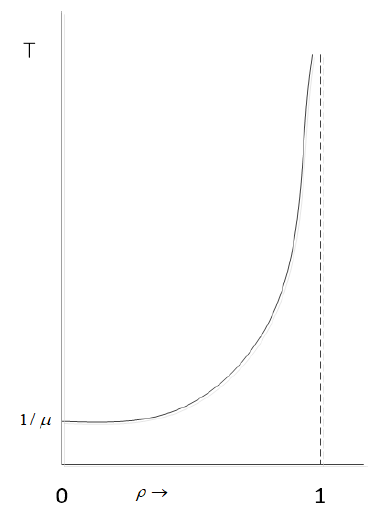{ width="400" }
</figure>

#### 1.1.2 The Performance of Static FDM

假设一个容量（带宽）为 $C\ bps$ 的独立信道。数据帧的到达过程是随机的（泊松到达），平均到达率为 $\lambda\ frames/sec$，帧长是可变的，平均帧长为 $\dfrac{1}{\mu}\ bit$，系统被建模为一个 $M/M/1$ 队列

- 平均服务时间 $\bar{x} = \dfrac{1}{\mu C}$
- 利用率 $\rho = \lambda \bar{x} = \dfrac{\lambda}{\mu C}$
- 平均时延 $T = \dfrac{\bar{x}}{1 - \rho} = \dfrac{1}{\mu C - \lambda}$

将信道静态地划分为 $N$ 个子信道。每个子信道的容量为 $\dfrac{C}{N}\ bps$。总的帧到达率 $\lambda$ 也被平均分配到每个子信道，因此每个子信道的到达率为 $\dfrac{\lambda}{N}$

每个子信道现在可以看作一个独立的 $M/M/1$ 队列，每个子信道的平均时延：$T = \dfrac{N}{\mu C - \lambda} = NT$

因此，在静态 FDM 中，将信道划分为 $N$ 个子信道会使平均时延增加到原来的 $N$ 倍

### 1.2 Key Assumptions of Dynamic Channel Allocation

所有动态信道分配方法都基于以下五个关键假设：

1. independent traffic（独立流量）：系统由多个（N 个）独立的站点组成。每个站点独立地生成需要传输的帧，帧的到达可能符合泊松过程。这是一个单缓冲区模型：当一个站点生成一个帧后，它进入阻塞状态，专注于处理这个帧（即尝试发送，如果失败则重发），在此期间不会生成新的帧。只有在当前帧成功发送后，它才能解除阻塞并生成下一个帧
2. single channel（单一信道）：所有站点共享同一个通信信道。所有站点在信道访问能力上是平等的，所有传输都能被所有站点接收到
3. observable collisions（可观察的冲突）：当两个或更多帧在时间上重叠传输时，就会发生冲突，导致所有涉及的帧都无法被正确接收。所有站点都能够检测到冲突的发生。检测到冲突后，相关站点知道其传输失败，并将在随后的某个时间重新尝试发送
4. continuous or slotted time（连续时间或分槽时间）：帧可以在任何时刻开始传输。这意味着传输的起始点是连续的、异步的。时间被划分为离散的、固定长度的时隙。帧传输必须在一个时隙的开始时刻进行。一个时隙的长度通常等于传输一个帧所需的时间。时隙有三种状态，空闲时隙：该时隙内没有帧传输；成功传输：该时隙内恰好有一个帧传输；冲突：该时隙内有两个或更多帧同时传输，导致冲突
5. carrier sense or no carrier sense（载波侦听或无载波侦听）：在有线信道中，使用 carrier sense，站点在发送之前，可以先侦听信道，以确定信道当前是否正被其他站点使用（即是否有载波信号）。如果侦听到信道忙，站点会推迟自己的传输，直到感知到信道空闲为止。这被称为说话前先听；在无线信道中，使用 no carrier sense，站点在发送之前无法侦听信道。站点有帧要发送时，会直接进行传输。传输完成后，通过是否收到确认等方式，才能推断出传输是否成功

## 2 Multiple Access Protocols

### 2.1 ALOHA

该协议于 1970 年代在夏威夷大学被开发，主要目的是为了解决地理上的挑战：将多个分散在夏威夷不同岛屿上的用户终端连接到位于欧胡岛檀香山的一台中央计算机

它采用了一种共享介质的通信方式：所有用户终端都使用同一个无线电频率（上行链路）向中央计算机发送数据

#### 2.1.1 Pure ALOHA

工作机制：

1. 发送：任何有数据要发送的站点都可以随时发送帧
2. 确认：中央计算机在收到帧后，会通过广播（下行链路）告知所有站点。发送站通过监听这个广播来判断自己的发送是否成功
3. 冲突处理：如果发送站没有收到成功的确认（意味着发生了冲突，发生冲突的帧会被销毁），它不会立即重发，而是等待一段随机的时间后再重新发送。这种随机退避策略是为了避免多个冲突站点在相同时间后重发，导致持续冲突

<figure markdown="span">
    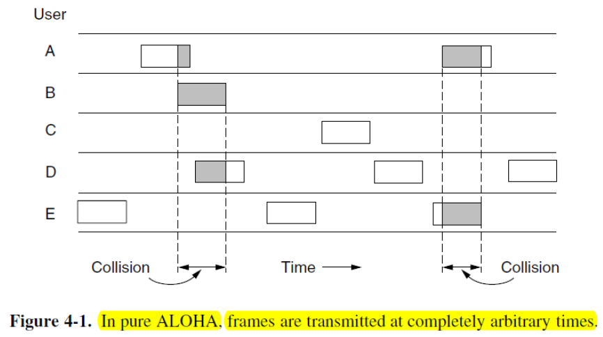{ width="600" }
</figure>

<figure markdown="span">
    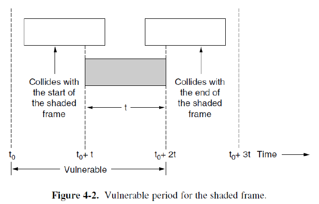{ width="600" }
</figure>

一个传播时间为 t 的帧能够成功传输的安全条件：在其开始传输的前一个帧时间 t 到后一个帧时间 t 内（即总共 2t 的冲突窗口内），不能有任何其他帧开始传输

!!! tip "pure ALOHA 的效率"

    效率在这里具体指：在所有发送的数据帧中，成功逃脱冲突的帧所占的比例。这个比例直接决定了信道的有效吞吐量

    定义 frame time（帧时间）为传输一个固定长度的帧所需的时间。这实际上就是帧的传输延迟

    假设网络中所有站点产生的新帧的到达过程遵循柏松分布，其平均值是每帧时间 $N$ 帧

    - 如果 $N > 1$，意味着用户试图发送帧的平均速率已经超过了信道连续成功传输帧的最大能力（即每帧时间 1 帧）。结果就是，几乎每一个帧都会发生冲突，导致吞吐量极低
    - 如果 $0 < N < 1$，为了系统能够稳定工作并获得有意义的吞吐量（即成功传输的帧速率），网络负载 $N$ 必须小于 1。在这个范围内，信道尚未饱和，有成功传输的可能

    总流量负载 $G$ 代表了信道上的总流量强度，包括新帧和因冲突而重传的旧帧。这更真实地反映了信道的实际负担

    1. $G \geqslant N$
    2. 低负载 $N \approx 0$：冲突概率低，重传帧很少，因此 $G \approx N$
    3. 高负载 $N$ 增大：冲突概率显著增加，产生大量重传帧，导致 $G > N$。这形成了一个正反馈循环：高负载 -> 多冲突 -> 更多重传 -> 负载更高

    吞吐率 $S$：信道用在成功发送帧的时间比例；传输成功概率 $P_0$：任意一个传输尝试能够成功（即不与其他传输发生冲突）的概率

    $S = GP_0$

    恰好有 $k$ 次传输尝试发生的概率 $p_k = \dfrac{G^ke^{-G}}{k!}\ \ G \sim \lambda t$

    出现零次传输尝试的概率是 $p_0 = e^{-G}$。一个帧要成功传输，必须在其前后各一个帧时间内，没有其他任何帧开始传输。在这个两倍长的时间区间内，传输尝试的平均次数自然就是 $2G$。因此，在这个关键的 $2t$ 区间内，出现零次传输尝试的概率 $P_0 = e^{-2G}$

    得到 $S = Ge^{-2G}$

    求导得到当 $G = 0.5$ 时，$S$ 最大

    <figure markdown="span">
        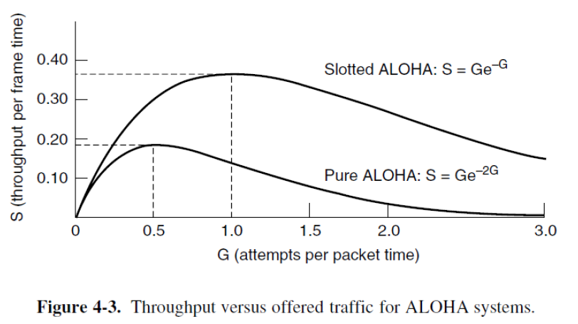{ width="600" }
    </figure>

#### 2.1.2 Slotted ALOHA

将连续的时间划分为离散的、长度等于一帧传输时间 t 的 **slots**（时槽）。所有站点必须同步，只能在时槽的起始时刻开始发送帧。这意味着帧的发送被对齐了

由于帧只能在时槽起点开始，一个帧如果要在当前时槽与测试帧冲突，它也必须在这个时槽的起点开始。因此，冲突只能发生在同一个时槽内。将冲突窗口从 2t 减少到了 t

!!! tip "slotted ALOHA 效率"

    成功概率 $P_0 = e^{-G}$

    $S = Ge^{-G}$

    求导得到当 $G = 1$ 时，$S$ 最大，正好是 pure ALOHA 的两倍

    ---

    成功发送一个帧总共恰好需要 $k$ 次尝试的概率 $P_k = e^{-G}(1 - e^{-G})^{k-1}$。传输次数的期望值 $E$ 是发送一个帧（直到成功为止）所需的平均尝试次数。$E = \sum\limits^{\infty}_{k=1} kP_k = e^G$

    平均尝试次数 $E$ 与网络总负载 $G$ 呈指数关系。所以一旦 $G$ 轻微增加，平均尝试次数 $E$ 就会急剧上升

    > 这种微小增加导致性能急剧下降的特性，说明了分槽 ALOHA 系统是内在不稳定的。如果没有额外的控制机制，系统在负载升高时很容易陷入冲突激增、吞吐量暴跌的恶性循环

### 2.2 Carrier Sense Multiple Access Protocols

分槽 ALOHA 的最大理论效率只有 36.8%，其根本问题在于站点的盲目性，它们在发送前不知道也不关心其他站点是否正在发送，导致大量冲突

引入新思路：在局域网等环境中，站点可以侦听信道上的信号，从而了解其他站点的活动情况。这为减少冲突提供了可能

CSMA 核心思想：先听后说。在发送数据之前，先侦听信道是否空闲

!!! tip "1-persistent CSMA"

    1. 侦听：有数据要发送的站点首先侦听信道
    2. 如果信道空闲：站点立即（以概率 1）发送它的帧。1-persistent 正是得名于此
    3. 如果信道繁忙：站点会持续等待并侦听，直到信道变为空闲，然后立即发送
    4. 冲突处理：如果发生冲突（例如，两个或多个都在等待的站点同时检测到信道空闲并立即发送），则站点等待一段随机时间（退避）后，重新开始整个过程

!!! tip "nonpersistent CSMA"

    1. 侦听：有数据要发送的站点首先侦听信道状态
    2. 如果信道空闲：站点立即发送数据
    3. 如果信道繁忙：站点不会持续等待信道空闲，而是主动等待一段随机时间，之后才重新回到步骤 1，再次侦听信道

    与 1-persistent CSMA 相比：

    - 优点：1-persistent CSMA 在信道繁忙时，多个等待的站点会在信道空闲的瞬间同时发送，导致必然的冲突。nonpersistent CSMA 通过引入随机等待，打散了这些潜在冲突站点的发送时机，从而显著降低了冲突概率。更少的冲突意味着更少的重传，从而提高了信道的有效利用率
    - 缺点：nonpersistent CSMA 的随机的等待时间增加了帧的平均延迟

!!! tip "p-persistent CSMA"

    通常用于时间被划分为离散时槽的信道。这类似于分槽 ALOHA，要求所有站点在时槽边界上同步操作

    当信道空闲时，站点不总是立即发送，也不总是完全等待，而是以一个设定的概率 p 来决定是否发送

    1. 初始侦听信道空闲：站点以概率 p 在当前时槽立即发送。同时，以概率 1 - p 推迟到下一个时槽。如果推迟了，并且在下一个时槽侦听到信道依然空闲，则重复此过程。这个过程持续下去，直到帧被发送出去或检测到信道变为繁忙，退避
    2. 初始侦听信道繁忙：站点持续侦听，直到信道变为空闲。一旦信道空闲，它并不立即行动，而是等待到下一个时槽的开始，然后应用情况 1 的算法

    如果 p = 1，退化为 1-persistent CSMA。如果 p 值很小，它的行为就接近 nonpersistent CSMA

<figure markdown="span">
    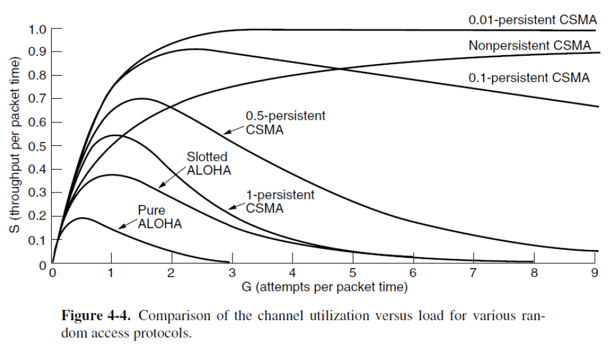{ width="600" }
</figure>

### 2.3 CSMA with Collision Detection

之前的 CSMA 协议只做到了先听后说。CSMA/CD 在此基础上增加了边说边听的能力。这意味着站点在发送数据的过程中，会持续监听信道

1. **collision detection**：站点将自己发送的信号与从信道上接收到的信号进行比较。如果两者一致，说明没有冲突，传输继续；如果两者不一致，说明有另一个站点也在发送，信号叠加发生了畸变，即检测到了冲突
2. 立即中止：一旦确认冲突发生，站点立即停止当前帧的传输。这节省了时间和带宽，因为继续传输一个注定要损坏的帧是毫无意义的

!!! quote ""

    这正是经典以太网（10BASE5, 10BASE2）所采用的核心协议。这些网络使用总线型拓扑，所有站点连接在同一根同轴电缆上，使得任何一个站点发送的信号都能被所有其他站点接收到，从而为边说边听提供了物理基础

1. transmission period（传输期）：一个站点成功获取信道并传输帧
2. 空闲期：没有站点有数据要发送
3. contention period（竞争期）：在传输结束或空闲期后，多个有数据要发送的站点开始使用 CSMA/CD 规则争夺信道使用权。这个期间可能发生冲突，并通过冲突检测和退避算法来解决

<figure markdown="span">
    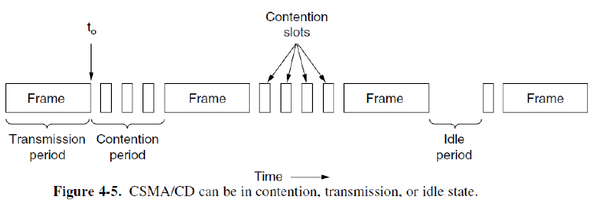{ width="600" }
</figure>

那冲突检测需要多长时间？

假设网络两端有两个站点 A 和 B，它们之间的信号传播延迟为 τ

1. t0：站点 A 开始发送帧
2. t0 + τ - ε: 就在 A 发送的信号即将到达 B 的前一瞬间（ε 是一个无限小的时间量），站点 B 也开始了发送。由于 B 此时尚未感知到 A 的信号，它认为信道是空闲的
3. t0 + τ: B 立即检测到冲突（因为它发送的信号与刚到达的 A 的信号混合），并停止发送，同时发出一个强化冲突的信号（噪声脉冲）
4. t0 + 2τ - ε: 这个表明冲突发生的噪声脉冲传回到站点 A

从 A 开始发送 (t0) 到它最终检测到冲突 (t0 + 2τ - ε)，总共经历了接近 2τ 的时间

这个 2τ 的时间段被称为冲突窗口。它的意义在于：一个站点必须持续检测至少 2τ 的时间，才能确信自己发送的帧没有遭遇冲突。如果在这段时间内没有检测到冲突，那么该站点就成功地捕获了信道，后续不会再发生冲突

### 2.4 Collision Free Protocols

CSMA/CD 只能保证在传输期内无冲突。在信道空闲后，多个站点开始竞争的初期（即竞争期），冲突仍然不可避免

当带宽-延迟积很大时，CSMA/CD 的效率会显著下降，因为冲突窗口 2τ 内能容纳的比特数更多，意味着更短的帧在检测到冲突前可能已经发送完毕，导致冲突无法被检测到，从而需要更高层的协议来纠错，效率更低

为了彻底解决上述问题，提出了 **无冲突协议**。这些协议的目标是从根本上消除冲突，包括竞争期的冲突。它们通过更复杂的协调机制（如轮询、预约或令牌传递）来安排站点的发送顺序，确保在任何时刻最多只有一个站点发送数据

!!! quote ""

    这些无冲突协议目前大多未成为主流，这可能是因为它们的复杂性，或者在传统数据应用场景下，CSMA/CD 的简单性和足够好的性能已能满足需求

    然而，随着对确定性网络和低延迟通信需求的增长，无冲突或确定性调度的思想正在重新获得关注，并可能在未来网络系统中得到应用

!!! tip "A Bit-Map Protocol —— Reservation Protocol"

    先预约，后发送：该协议将时间划分为循环，每个循环包含两个阶段：预约阶段（竞争期）和传输阶段

    1. 预约阶段（位图阶段）：这个阶段被均匀划分为 N 个时槽，其中 N 是网络中的站点总数。每个站点被静态分配一个唯一的时槽编号（从 0 到 N - 1）。如果某个站点有数据要发送，它就在属于自己的那个时槽内发送一个简单的 1 比特作为预约信号；如果该站点没有数据要发送，则其对应的时槽保持空闲。由于每个站点只在属于自己的唯一时槽内进行预约，所以在这个阶段绝对不会发生冲突。经过这 N 个时槽后，每个站点通过监听信道，都获得了一个完全一致的位图，清楚地知道哪些站点想要发送数据
    2. 传输阶段：在预约阶段结束后，所有站点按照站点编号的顺序（例如，从 0 到 N - 1）依次传输它们的数据帧。因为发送顺序是预先确定且所有站点都知道的，所以这个阶段也绝对不会发生冲突。只有那些在预约阶段发出了预约信号（即比特 1）的站点才需要在这个阶段发送数据帧
    3. 循环：当最后一个预约了的站点完成数据帧传输后，一个新的循环开始，再次进入 N 个时槽的预约阶段

    <figure markdown="span">
        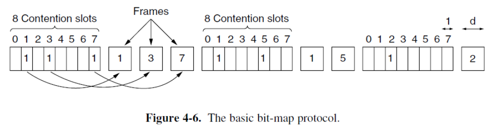{ width="600" }
    </figure>

!!! tip "Token Passing"

    网络中存在一个特殊的、很短的消息，称为 token。只有持有令牌的站点才被允许发送数据帧。令牌按照一个预定义的逻辑顺序在所有站点间依次传递

    当一个站点从它的上游邻居那里收到令牌时，它检查自己是否有数据要发送。如果有数据：它捕获令牌，然后发送一个或多个数据帧。发送完毕后，它将令牌释放给逻辑序列中的下一个站点。如果没有数据：它立即将令牌传递给下一个站点

    在典型的令牌环网络中，数据帧和令牌沿着同一个方向循环。这就产生了一个问题：数据帧在到达目的站并被拷贝后，如何被从环上移除，以防止它无限循环占用带宽？

    1. 由发送站移除：这是最常见的方式。发送站负责监视环上传回的自己发出的帧。当该帧在环上完整循环一周后，由发送站自己将其从环上移除，并检查目的站是否设置了确认位以判断传输是否成功
    2. 由接收站移除：目的站在接收并拷贝帧后，直接将其从环上移除。这种方式效率稍高，但实现起来更复杂

    实现令牌传递不一定需要物理上的环形布线。令牌传递是一种逻辑访问控制方法（属于数据链路层），它可以运行在多种物理拓扑上。例如，物理环，站点通过电缆实际连接成一个环；物理总线，所有站点连接在一条总线上，但通过软件定义一个逻辑环，令牌按照这个逻辑顺序在总线上的站点间传递

    <figure markdown="span">
        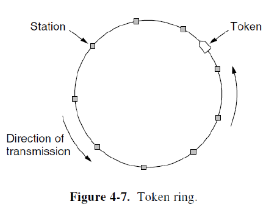{ width="600" }
    </figure>

!!! tip "Binary Countdown"

    在位图协议中，预约阶段需要 N 个时槽（N 是站点总数）。每个站点无论是否要发送数据，都固定占用一个时槽的开销。当网络规模很大（站点数 N 很大）时，即使只有少数几个站点要发送数据，也必须等待一个很长的、包含 N 个时槽的预约阶段，效率低下，扩展性差

    二进制倒计数协议是一种分布式、竞争性的仲裁协议。它通过让所有有数据要发送的站点同时广播它们的地址，并在线比较地址高低，来直接选举出当前获得发送权的站点。地址最高的竞争站点赢得信道。

    假设：有四个站点参与竞争，地址分别是 0010 (2), 0100 (4), 1001 (9), 1010 (10)。它们同时开始广播自己的地址，从最高位（MSB）到最低位（LSB）逐位进行

    1. 第 1 位：站点们分别发送 0, 0, 1, 1。信道上的实际信号是这些比特的逻辑或（OR），结果是 1。站点 0010 和 0100 发现自己发送的是 0，但听到信道上却是 1，这意味着存在地址更高的竞争者。它们立即退出竞争并保持沉默。站点 1001 和 1010 发现自己发送的比特与听到的一致（都是 1），因此继续竞争
    2. 第 2 位：剩下的两个站点 1001 和 1010 分别发送 0 和 0。信道上的或结果是 0。两者发送的与听到的一致，都继续
    3. 第 3 位：站点 1001 和 1010 分别发送 0 和 1。信道上的或结果是 1。站点 1001 发现自己发送的是 0，但听到的是 1，因此退出竞争。站点 1010 发送的与听到的一致，赢得信道，获得发送数据的权利

### 2.5 Limited-Contention Protocols

竞争协议（如 ALOHA, CSMA）：

- 优点（低负载）：当网络负载很轻时，站点很少，冲突概率低。站点可以几乎立即尝试发送，因此访问延迟非常低
- 缺点（高负载）：当网络负载很重时，大量站点竞争导致冲突频繁发生。大量时间被浪费在冲突和重传上，信道效率急剧下降

无冲突协议（如位图、令牌）：

- 优点（高负载）：无论负载多高，都通过预约或轮询机制完全避免冲突。信道被有效用于数据传输，信道效率高且稳定
- 缺点（低负载）：即使只有一个站点要发送数据，也可能需要等待一个完整的令牌循环或漫长的预约阶段，导致不必要的延迟

为了克服上述两种协议类型的缺点，同时保留它们的优点，提出了 **有限竞争协议**。其核心思想是：在低负载时表现得像竞争协议（低延迟），在高负载时表现得像无冲突协议（高效率）

传统的竞争协议是对称的，即每个活跃站点在每个竞争时槽内都以相同的概率 $p$ 尝试发送。当有 $k$ 个活跃站点时，在某个时槽内恰好有一个站点成功发送的概率 $A = kp(1-p)^{k-1}$。我们的目标是最大化这个概率 $A$

对于给定的 $k$，存在一个最优的 $p$ 值使得 $A$ 最大。当 $k = 1$ 时，最优 $p = 1$（即直接发送）；当 $k$ 增大时，最优 $p$ 值会减小（即需要降低发送概率以减少冲突）

对称协议的问题在于，当 $k$ 很大时，即使使用最优 $p$，成功概率 $A$ 也会下降

为了突破对称协议的性能限制，有限竞争协议采用了非对称的策略。它动态地将站点分组，使得在任何一个竞争时槽内，参与竞争的站点数量 $k$ 都保持较小，从而可以使用一个较大的 $p$ 值（甚至为 1），以确保高成功概率和低延迟

$p$ 的最佳值为 $\dfrac{1}{k}$，$A_{max} = (\dfrac{k-1}{k})^{k-1}$

一旦活跃竞争者数量 $k$ 超过 5，最大成功概率 $A_{max}$ 就迅速下降并趋近于 36.8%

<figure markdown="span">
    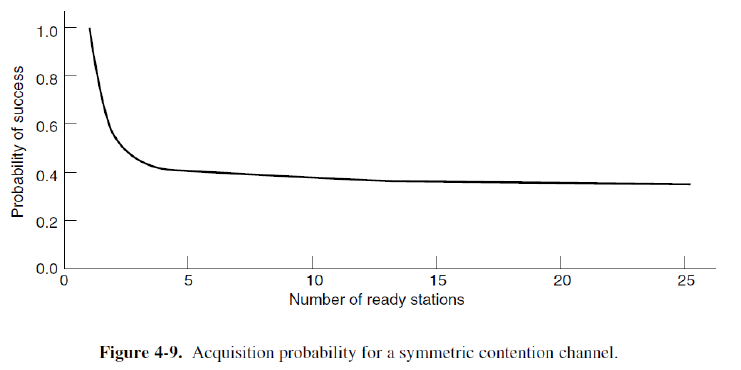{ width="600" }
</figure>

提升性能的关键在于限制每个竞争时槽内的活跃站点数。这通过将站点分组来实现

协议将时间划分为一系列竞争时槽。站点被分配到不同的组中（这些组可能重叠）。竞争过程是按组顺序进行的：

1. 时槽 0：只允许组 0 的站点参与竞争。如果该组中恰好有一个站点发送，则它获得信道，传输数据，竞争结束。如果该时槽空闲（组内无站点发送）或发生冲突（组内多个站点发送），则竞争权传递给下一组
2. 时槽 1：只允许组 1 的站点参与竞争。规则同上
3. 此过程持续，直到某个组的某个站点成功获得信道为止

有限竞争协议的目标就是通过精细的分组，使得每一个具体的竞争时槽都只有少数站点在竞争

- 低负载时：有数据要发送的站点很少。如果分组太小、太细，可能会导致需要经历很多个空的竞争时槽才能找到那个唯一的发送站，增加延迟。因此，此时应使用较大的组（甚至所有站点都在一个组里），让它们快速竞争，利用竞争协议低负载下延迟低的优点
- 高负载时：有数据要发送的站点很多。如果使用大组，组内竞争者 k 很大，成功概率会很低，导致多个冲突和重试。因此，此时应使用较小的组（理想情况下每组只有一个站点），这样就变成了无冲突的轮询，利用无冲突协议高负载下效率高的优点

!!! tip "The Adaptive Tree Walk Protocol"

    将所有站点视为一棵二叉树的叶子节点。例如，有 8 个站点，它们就是这棵二叉树的 8 个叶子。树的每个内部节点代表其下所有叶子站点的逻辑分组

    <figure markdown="span">
        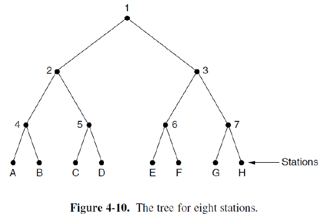{ width="600" }
    </figure>

    1. 时槽 0：在一次成功的数据传输之后，新的竞争周期开始。第一个竞争时槽（时槽 0）允许所有站点（即根节点 1 下的所有叶子）参与竞争。如果冲突：说明有多个站点（大于等于 2 个）要发送。协议进入树的下一层，以缩小竞争范围
    2. 时槽 1：只允许节点 2 下的站点在时槽 1 内竞争。如果成功：那么在该帧传输完毕后，协议不会回到根节点，而是继续检查节点 2 的兄弟节点，即节点 3 下的站点在下一个时槽竞争。这确保了同一父节点下的所有子组都有机会被检查到；如果再次冲突：说明在节点 2 下仍有多个站点要发送。协议继续深入到更细的分组
    3. 时槽 2：只允许节点 4 下的站点在时槽 2 内竞争
    4. 此过程递归进行，直到某个时槽内只有一个站点竞争（成功发送），或者一个时槽内没有站点竞争（空闲），然后协议会移动到当前节点的兄弟节点继续

    协议不必总是从树根（层级 0）开始竞争

    - 轻负载（q 小）：只有少数几个站点要发送。如果从很深的层级开始，可能会浪费时槽去遍历很多空的节点。从高层级（如根节点）开始可以更快地找到这些分散的发送站
    - 重负载（q 大）：很多站点要发送。如果从根节点开始，几乎必然发生冲突，需要逐层深入，过程缓慢。直接从深层级开始，一开始就在小范围内解决竞争，效率更高

    层级 $i$ 的任何一个节点，其下方包含的站点比例是 $2^{-i}$

    假设有 q 个站点准备发送数据，并且它们均匀分布在整个站点集合中。那么，在层级 i 的任何一个特定节点下，期望的竞争站点数量是：$2^{-i} \times q$

    目标：找到一个起始层级 i，使得在该层级的一个节点下参与竞争的平均站点数恰好为 1。这是效率最高的状态，因为此时成功获取信道的概率最高

    $i = \log_2 q$

### 2.6 CSMA with Collision Avoidance

!!! tip "Wireless LAN Protocols"

    与所有节点都连接在同一根电缆上的经典有线以太网不同，无线网络具有其独特的挑战

    Different Coverage Areas（The Hidden Terminal Problem）：在有线网络中，所有站点都能检测到所有其他站点的传输。在无线网络中，由于信号衰减和障碍物，节点的覆盖范围可能不同。例如，节点 A 和节点 C 可能都能与节点 B 通信，但彼此之间可能无法直接侦听到对方。这就导致载波侦听失效：节点 A 在发送前侦听信道，因为听不到节点 C，会认为信道空闲而发送，但此时节点 C 可能正在向节点 B 发送数据，从而在节点 B 处发生冲突。这就是著名的隐藏终端问题

    <figure markdown="span">
        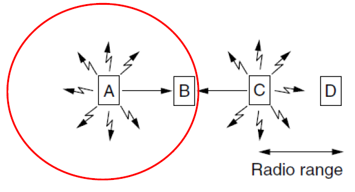{ width="600" }
    </figure>

    The Exposed Terminal Problem：当节点 B 正在向节点 A 发送数据时，节点 C 也有数据想要发送给节点 D。节点 C 在发送前进行载波侦听，它检测到了节点 B 正在进行的传输。根据 CSMA 的原则，节点 C 会认为信道繁忙，从而推迟它向节点 D 的发送。然而，从整个网络的角度看，节点 C 的这次发送本应是安全的，不会造成冲突。节点 B 和节点 C 的传输是可以同时进行的。由于节点 C 能够侦听到节点 B，导致它不必要地放弃了发送机会，这就造成了暴露终端问题

    <figure markdown="span">
        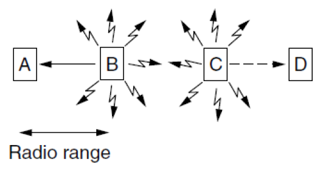{ width="600" }
    </figure>

    Nodes Cannot Hear while Sending（无法进行冲突检测）：在有线网络中，站点可以同时发送和接收（监听），从而实现 CSMA/CD 中的冲突检测。在无线网络中，一个站点的发射功率远高于其接收灵敏度。如果它在发送信号的同时尝试监听，其强大的发射信号会完全淹没任何可能传入的微弱接收信号。因此，无线站点在发送数据时实际上是聋的，无法检测到正在发生的冲突

    !!! quote ""

        因此，802.11 (Wi-Fi) 不使用 CSMA/CD

MACA 没有尝试去改进不可靠的载波侦听，而是引入了一个主动的 handshake 过程来为数据传输预约信道，从而避免冲突

1. RTS（Request-To-Send）：发送站想要发送数据时，首先向接收站广播一个很短的 RTS 控制帧。这个帧中包含即将发送的数据帧的长度信息。其他收到 RTS 的站点，会在数据帧传输的整个持续时间内对发送站保持静默
2. CTS（Clear-To-Send）：如果接收站成功地收到了 RTS 帧，它就会回复一个同样很短的 CTS 控制帧作为响应。这个 CTS 帧也包含了数据帧的长度信息

    1. 解决隐藏终端：任何能够听到接收站信号的节点（包括发送站不知道的、可能成为隐藏终端的节点），在收到这个 CTS 后，都知道接收站即将接收一个数据帧。因此，它们会在数据帧传输的整个持续时间内保持静默，从而避免了在接收站处发生冲突
    2. 解决暴露终端：只有能听到 CTS 的节点需要保持静默。那些能听到 RTS 但听不到 CTS 的节点，可以推断出自己不在接收站的范围内，自己的发送不会干扰到即将发生的数据传输。因此，它们不需要保持静默，从而缓解了暴露终端问题

3. 数据传输：发送站收到 CTS 后，确信信道已被成功预约，于是开始传输完整的数据帧。此时，由于周围的潜在干扰节点已被 CTS 静默，数据帧成功送达的概率大大提高

RTS 和 CTS 帧本身仍然是广播的，所以它们之间也可能发生冲突。但由于它们非常短，冲突的概率和代价远低于长数据帧的冲突。协议需要定义 RTS 冲突后的退避机制

<figure markdown="span">
    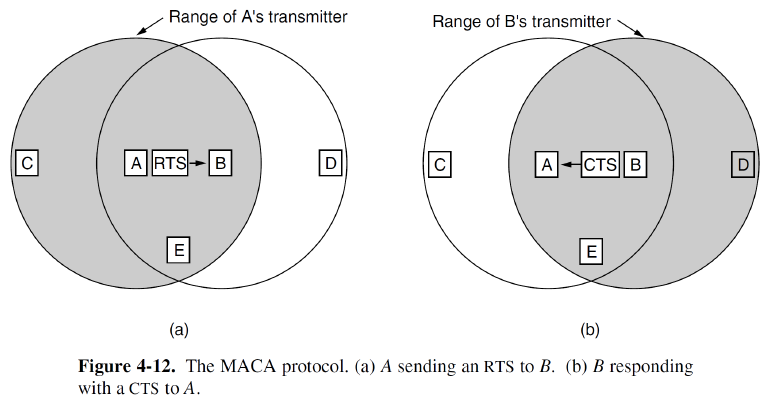{ width="600" }
</figure>

## 3 Ethernet

以太网的两个主要发展阶段：

1. 早期的 classical ethernet：速率较低，在 3 到 10 Mbps 之间
2. 后来发展的 switched ethernet：速率大幅提升，涵盖了快速以太网、千兆以太网和万兆以太网，分别对应 100 Mbps、1000 Mbps 和 10 Gbps

Manchester encoding：一种经典的物理层线路编码方式，用于在早期以太网（如同轴电缆）中将数据比特流转换为电信号，其特点是每个比特中间都有一个电平跳变，便于时钟同步

<figure markdown="span">
    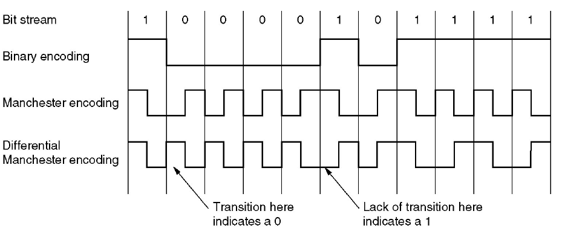{ width="600" }
</figure>

??? info "以太网简史"

    第一阶段（1970s）：bus topology（总线型拓扑）。最初由梅特卡夫和博格斯发明，采用总线结构，所有设备共享同一介质

    第二阶段（1990s 末）：hub-based star topology（集线器星型拓扑）。布线物理拓扑变为星型，中心设备是集线器。尽管物理上是星型，但逻辑上仍然是广播网络。集线器在物理层工作，简单地将收到的比特信号放大并广播到所有端口，导致冲突依然存在，需要 CSMA/CD 等 MAC 协议来管理介质访问

    第三阶段（2000s 初）：switch-based star topology（交换机星型拓扑）。中心设备升级为交换机，这是根本性的变革。交换机在数据链路层工作，能识别帧的 MAC 地址，可以智能地将数据帧只转发到目标设备所在的端口。这使网络从广播域转变为点对点通信。同时消除冲突，因此不再需要像 CSMA/CD 这样的 MAC 协议来解决冲突

以太网是迄今为止最主流的有线局域网技术。所有以太网技术都向网络层提供无连接服务。这意味着以太网在发送数据帧前不需要建立端到端的连接，它只是尽最大努力交付每个独立的数据帧，不保证帧一定到达，也不保证按顺序到达，更不进行确认

这种无连接服务类似于 IP，每个数据报独立路由。类似于 UDP，不提供可靠性保障

但通过牺牲可靠性（将复杂的总开销，如确认、重传、排序等留给更高层协议，如 TCP），换取了底层技术的简单性和低成本

### 3.1 Ethernet Frame Structure

<figure markdown="span">
    { width="600" }
</figure>

!!! tip "preamble"

    前导码：用于时钟同步

    前 7 个字节的固定模式 (`10101010`) 通过曼彻斯特编码后，在信道中形成一个周期性的方波，使得接收方能够调整其时钟节奏，与发送方保持同步

    第 8 个字节（模式以 `...11` 结尾）是一个特殊的信号，称为 the start of frame（帧起始定界符），告知接收方：“同步模式结束，真正的帧数据即将开始”

!!! tip "MAC addresses"

    MAC 地址包含目标 MAC 地址和源 MAC 地址
    
    每个地址的长度为 6 字节（48 位）
    
    通过目标地址的第一个比特来区分地址类型：0 代表 ordinary address，标识网络中的一个特定设备；1 代表 group / broadcasting address，用于向一组设备或所有设备发送数据
    
    广播地址是一个特例，其所有 48 位全为 1 （`FF:FF:FF:FF:FF:FF`），表示局域网内的所有设备都应接收该帧

    MAC 地址前 3 字节（24 位）：称为组织唯一标识符，由 IEEE 统一分配给各个设备制造商。这确保了不同厂商的地址前缀不会重复

    MAC 地址后 3 字节（24 位）：由各个制造商自行分配给自己生产的每个网络设备。这保证了同一厂商下每个设备的地址是唯一的

    这种分配机制理论上可以支持 $2^{48}$ 个全局唯一地址，并由制造商在网卡出厂时固化到硬件中

!!! tip "type or length"

    这个 2 字节的字段有两个可能的含义：类型或长度。具体含义取决于其数值的大小

    - 当该字段的值 > 0x600 (1536) 时，它被解释为类型
    - 当该字段的值 ≤ 0x600 (1536) 时，它被解释为长度

    作为类型字段：这是一个多路复用 / 多路分解标识符。它告诉接收方的数据链路层，应该将帧内封装的数据部分交给哪个上层网络协议（进程）处理。这类似于运输层端口号的作用，但在网络协议栈的更低一层

    > - `0x0800` -> IPv4
    > - `0x0806` -> ARP
    > - `0x86DD` -> IPv6

    作为长度字段：指示数据字段的字节长度

    这种巧妙的数值范围划分，使得网络设备能够自动区分并同时支持两种主要的以太网帧格式：

    1. 以太网 II 帧：使用类型字段
    2. IEEE 802.3 帧：使用长度字段

!!! tip "data field"

    最大长度（1500 字节）：以太网的 maximum transmission unit（MTU，最大传输单元）的长度是 1500 字节。如果一个 IP 数据报的长度超过了 1500 字节，那么 IP 层必须在发送前对这个数据报进行 fragment，将其分割成多个片段，每个片段都必须小于或等于 MTU，才能被封装到不同的以太网帧中进行传输

    最小长度（46 字节）：这个要求并非源于数据字段本身的需要，而是为了满足整个以太网帧的最小帧长要求

    以太网要求从目标地址字段开始，到校验和字段结束，整个帧必须至少为 64 字节。一个帧的固定头部（目标地址 6B + 源地址 6B + 类型 / 长度 2B + 校验和 4B）总共是 18 字节。64 - 18 = 46 字节。因此，如果上层传来的数据不足 46 字节，以太网层必须在数据字段后添加填充字节，使其总长度达到 46 字节，从而保证整个帧（从目标地址到校验和）满足 64 字节的最小长度要求

!!! tip "checksum"

    校验和使用 32 位 CRC（循环冗余校验）

### 3.2 Binary Exponential Backoff

经典以太网使用 1-persistent CSMA/CD 算法

二进制指数退避算法：在发生冲突后，让各站点随机地等待不同的时间再重试，从而分散重传时间，避免再次冲突

时隙：基本时间单位，由网络最大往返延迟（2τ）决定。在 10Mbps 以太网中，该值被标准化为 512 比特时间（51.2µs）。这确保了任何站点都能在发送完一个时隙长度的数据前检测到冲突

退避窗口增长：第 i 次冲突后，随机数 k 的取值范围是 0 到 $2^i - 1$。这意味着重传延迟的可能范围（即退避窗口）随着冲突次数的增加而呈指数级扩大

退避上限：冲突超过 10 次后，窗口大小不再增长，固定为 0-1023。这防止了等待时间过长

放弃机制：冲突 16 次后彻底放弃。这处理了网络持续极端拥堵或设备故障的情况

### 3.3 Ethernet Performance

这是一个重载且恒定负载的理想化场景，假设有 k 个站点始终有数据要发送，竞争非常激烈

单时隙成功概率 $A = kp(1-p)^{k-1}$。描述的是在某个特定的竞争时隙中，恰好有一个站点发送数据从而成功获取信道的概率。当每个站点选择发送的概率 $p = 1/k$ 时，成功概率 A 最大。随着站点数 k 增大，最大成功概率 A 趋近于 $1/e$ (约 0.368)。这表明即使在最优情况下，信道在竞争期内也有约 63.2% 的时间是空闲或被冲突浪费的

平均竞争时隙数为 $1/A$：竞争过程可以看作一系列独立的伯努利试验，每次试验（一个时隙）成功的概率是 A。竞争阶段需要持续到出现第一个成功的时隙为止。这恰好是一个几何分布模型。几何分布的期望（即平均需要试验多少次才能获得第一次成功）是 $1/A$。因此，平均竞争时隙数 = $1/A$。这个值直接衡量了信道访问的延迟。A 越小（站点越多或 p 选择越差），平均需要等待的竞争时隙就越多，性能越差

平均竞争间隔 $w = (1/A) \times 2 \tau = 2 \tau / A$。这代表了为获取信道访问权所花费的平均等待时间。在最优操作点（$p = 1/k$, $A \approx 1/e$），平均竞争间隔 $\tau \approx 5.4 \tau$

信道效率公式：$\dfrac{P}{P + \dfrac{2\tau}{A}}$

- $P$：成功传输一个帧所需的时间
- $P + \dfrac{2\tau}{A}$：总周期时间，包含 $P$ 和竞争开销时间 $\dfrac{2\tau}{A}$

因此，帧越长（P 越大）或速率越高，效率越高；竞争越激烈（A 越小，导致 w 越大）或网络范围越大（τ 越大，导致 w 越大），效率越低（因为开销占比大）

传播延迟 τ 是降低效率的一个关键因素。τ 与电缆的物理长度成正比。电缆越长，τ 越大，竞争间隔 w 就越长，从而导致信道效率下降

> 这从性能角度解释了以太网标准中为何必须限制最大电缆长度 —— 不仅仅是为了保证电气信号的完整性，更是为了控制竞争开销，维持一个可接受的信道效率

- 替换 $P = F / B$。$F$ 是以比特为单位的帧长度，$B$ 是信道带宽（比特率）
- 替换 $\tau = L / c$。$L$ 是电缆长度，$c$ 是信号在电缆中的传播速度（约为真空中光速的 2/3）。这表示信号从电缆一端传播到另一端所需的时间
- 平均竞争时隙数：在最优情况下，该值被设定为 e，因此 $1 / A \approx e$

得到：$\dfrac{1}{1 + \dfrac{2eLB}{cF}}$

<figure markdown="span">
    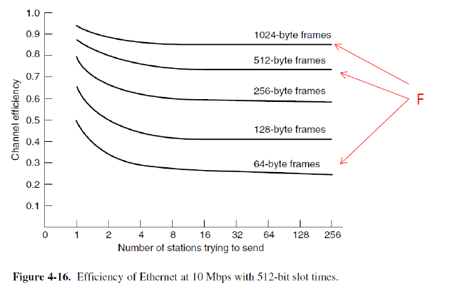{ width="600" }
</figure>

### 3.4 Switched Ethernet

Hub（集线器）：

1. 工作层级：物理层
2. 功能：本质上是一个多端口的信号中继器或放大器。它将从一个端口收到的电子信号简单地复制、放大并广播到所有其他端口
3. 所有连接到同一集线器（或由集线器级联的网络）的设备共享同一个通信信道。这相当于形成了一个单一的冲突域，在任何时刻只能有一个设备成功发送数据，否则就会发生冲突。因此，网络的总容量（带宽）是由所有设备共享的，集线器没有增加网络的总容量

switch（交换机）：

1. 工作层级：数据链路层
2. 核心组件：high-speed backplane（高速背板）。这是一个内部的高速交换矩阵，允许所有端口之间同时进行多个并发的、独立的通信
3. 交换机为每个端口创建了独立的冲突域（在现代全双工交换机中，甚至消除了冲突）。它能够学习每个端口所连接设备的 MAC 地址，并智能地将数据帧只转发到目标设备所在的特定端口，而不是广播到所有端口。这种工作方式使得连接在交换机不同端口上的设备可以同时进行通信，而互不干扰

> 冲突域是指网络中一个特定的区域，在该区域内，如果两个设备同时发送数据，就会产生冲突

<figure markdown="span">
    { width="600" }
</figure>

交换机能够检查帧头中的目标 MAC 地址。通过维护一个 MAC 地址表（端口与 MAC 地址的映射关系），它能够智能地将帧只转发到目标设备所连接的特定端口。这被称为定向转发

由于交换机的定向转发特性，网络流量通常只在通信双方之间的端口上传输，其他端口无法侦听到这些流量。这提供了基本的流量隔离，增强了网络安全性，使得窃听网络流量变得困难

<figure markdown="span">
    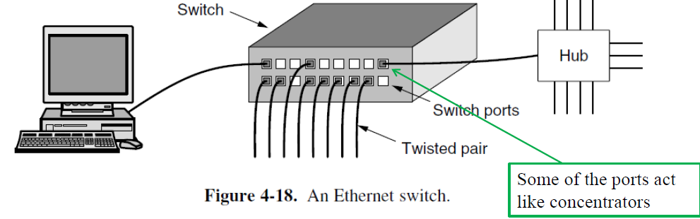{ width="600" }
</figure>

### 3.5 Ethernet Technologies

以太网技术由 IEEE 802.3 工作组进行标准化，这确保了设备的互操作性和技术的持续发展

以太网技术的标准命名格式，通常遵循：`[速率][信号方式][介质/距离]` 的模式。例如 `10BASE-T`, `10BASE-2`, `100BASE-T`, `1000BASE-LX`, `10GBASE-T`

> `BASE`：代表基带传输。这意味着数字信号（以太网帧）直接在物理介质上传输，而不需要先调制到高频载波上。介质的所有带宽都用于传输单一的以太网信号
>
> - `T`：通常代表双绞线
> - `2`：在早期标准中指细同轴电缆
> - `LX`：指长波长的光纤

以太网规范同时涵盖了数据链路层和物理层

- 数据链路层：定义了帧结构、MAC 地址、CSMA/CD 协议（经典以太网）等
- 物理层：定义了具体的电气、光学特性、编码方式、电缆类型和连接器等

!!! tip "Fast Ethernet"

    CSMA/CD 机制要求一个站点在发送完最小帧之前，必须能够检测到最远端发生的冲突。网络速度从 10Mbps 提升到 100Mbps 后，比特时间从 100ns 缩短到 10ns。在同样的最小帧长（64 字节，即 512 比特）下，帧的传输时间缩短为原来的 1/10

    为了维持这个检测机制，必须在以下两者中做出选择：

    1. 保持最小帧长不变，但必须按比例缩短最大网络电缆长度（缩小冲突域）
    2. 放弃 CSMA/CD，采用新的工作模式

    对于双绞线（100Base-T4/TX）：在较短的电缆距离（100 米）内，可以继续使用集线器（半双工，CSMA/CD）或交换机

    对于光纤（100Base-FX）：由于其允许的传输距离很长（2000 米），信号往返时间会超过最小帧的传输时间，导致 CSMA/CD 机制失效。因此，标准规定它必须连接到交换机，并工作在全双工模式。在全双工模式下，发送和接收使用不同的通道，不存在冲突，因此完全绕开了 CSMA/CD 的限制

    <figure markdown="span">
        { width="600" }
    </figure>

!!! tip "Gigabit Ethernet"

    千兆以太网的所有配置都使用点对点链路：这标志着千兆以太网彻底告别了经典以太网的总线型共享介质。网络中的每条连接（如计算机到交换机、交换机到交换机）都是一条独立的、专用的链路

    这是实现高性能和高效率的基础。点对点连接消除了多个设备对同一介质的竞争，为全双工通信创造了条件

    千兆以太网支持两种不同的操作模式：全双工模式和半双工模式

    `full-duplex mode`（全双工模式）：以交换机为中心的星型拓扑是标准配置。设备可以同时进行发送和接收，因为每个方向都有独立的通道（例如，交换机的一个端口与一台计算机之间就是一条独立的点对点链路）
    
    在这种模式下，CSMA/CD 协议被禁用。因为通信是点对点的，不存在多个设备竞争同一介质的情况，所以冲突不可能发生。这是千兆以太网性能得以大幅提升的关键

    <figure markdown="span">
        { width="600" }
    </figure>

    `half-duplex mode`（半双工模式）：连接到集线器，构成一个共享的冲突域。这是为了向后兼容，但在千兆速率下极不实用
    
    CSMA/CD 要求帧的传输时间（P = F/B）必须大于等于最坏情况下的往返延迟（2τ）。速度提升到 1000 Mbps 后，最小帧（64 字节）的传输时间急剧缩短。要维持机制，网络直径（最大电缆长度）必须同比缩小 100 倍，这将导致网络规模小到不切实际（例如可能只有 20 米左右）

    解决方案：

    1. carrier extension（载波扩展）：发送方在发送完一个正常的帧（最小可为 64 字节）后，继续发送特殊的扩展位，直到整个发送序列（有效帧 + 扩展位）的持续时间达到 512 字节的传输时间（这是在快速以太网中保证有效冲突检测所需的最小时间）。但如果发送很多短帧，载波扩展会引入巨大的开销，严重降低信道效率
    2. frame bursting（帧突发）：允许一个站点在一次信道获取中，连续发送多个帧（而不仅仅是一个）。只有第一个帧可能需要载波扩展以达到 512 字节，后续的帧可以紧挨着发送，形成一个突发。通过分摊载波扩展的开销，提高了连续发送多个短帧时的整体效率

    jumbo frame（巨型帧）：它允许使用远大于标准 1500 字节 MTU 的帧（如 9KB）。这减少了协议开销（帧头、中断次数），提升吞吐量，特别适合大数据传输。但这是一个非标准的可选特性，需要通信双方设备都支持

    <figure markdown="span">
        { width="600" }
    </figure>

!!! tip "10-Gigabit Ethernet"

    万兆以太网完全且仅支持全双工模式。这标志着一个时代的终结，以太网彻底告别了其诞生之初的共享介质和半双工操作。因此，CSMA/CD 协议被完全移除。网络架构完全基于交换机，点对点通信，不存在冲突，自然不再需要冲突检测和退避算法

    设计的核心挑战和重点全部集中在物理层，即如何在不同的介质（光纤、铜缆）上实现如此高的信号速率并保证信号完整性

    物理层编码技术：

    1. 光纤版本：普遍采用 64B/66B 编码。这种编码将 64 个数据比特转换为 66 个线路比特，编码开销（2/66 ≈ 3%）远低于早期以太网中使用的曼彻斯特编码（50%），效率极高，适合高速传输
    2. CX4 铜缆版本：使用 8B/10B 编码，开销为 20%，有助于保持直流平衡和时钟恢复
    3. 10GBase-T：这是最复杂的技术之一，它使用复杂的数字信号处理技术在 4 对 Cat 6a/7 UTP 电缆上实现 10Gbps。每对线缆同时进行双向传输，并通过回声抵消等技术来分离信号

    <figure markdown="span">
        { width="600" }
    </figure>

## 4 Wireless LANs (802.11 WiFi)

802.11 网络可以在两种模式下运行：

1. infrastructure mode（基础设施模式）：这是最常见的 Wi-Fi 模式，用于家庭、办公室和公共热点。网络以 AP（接入点）为中心。所有无线客户端（如笔记本电脑、手机）不直接相互通信，而是必须通过 AP 进行中转

    - AP 的作用：AP 作为一个网桥，连接无线网络和有线网络（如以太网），并管理其覆盖范围内的所有无线客户端的接入和通信
    - 扩展性：多个 AP 可以连接到同一个有线网络，形成一个覆盖范围更广的无线网络，客户端可以在不同 AP 之间漫游

2. Ad hoc network（自组网模式）：这是一种去中心化的点对点网络模式。网络中没有 AP。所有处于彼此无线覆盖范围内的设备可以直接建立连接并进行通信。适用于临时性的文件共享、多人游戏，或在没有现有网络基础设施的情况下进行快速设备互联。它的网络规模和稳定性通常不如基础设施模式

<figure markdown="span">
    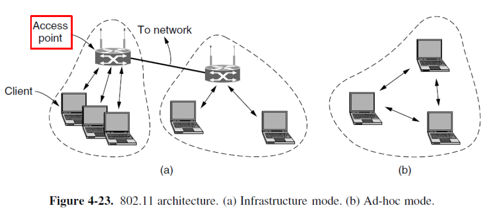{ width="600" }
</figure>

数据链路层被明确地划分为两个子层：MAC 子层和 LLC 子层。这是一种常见的网络设计模式，旨在实现模块化和灵活性

1. MAC 子层：控制对共享物理介质（在这里是无线电信道）的访问。它实现了特定的介质访问控制算法（例如，在 802.11 中是 CSMA/CA，即带冲突避免的载波侦听多路访问），以协调多个设备有序、高效地使用信道，解决下一个谁发送的问题
2. LLC 子层：提供统一的逻辑链路控制服务接口。它在 MAC 子层之上，为网络层（如 IP 协议）提供一个统一、一致的视图。通过 LLC 子层，不同的 802 标准（如 802.3 以太网、802.11 Wi-Fi）在网络层看来都是一样的。这使得同一个网络层协议（如 IP）可以轻松地在各种底层网络技术（有线或无线）上运行，极大地增强了兼容性和灵活性。它处理诸如帧复用、流量控制和确认等逻辑功能

<figure markdown="span">
    { width="600" }
</figure>

### 4.1 802.11 Physical Layer

使用 2.4 GHz 和 5 GHz 的 ISM 频段。这些是免许可的频段，允许设备在没有政府专项许可证的情况下使用，这极大地促进了 Wi-Fi 的普及。但由于是免许可，该频段可能较为拥挤，容易受到来自微波炉、蓝牙设备等其他设备的干扰

**802.11b** 定义了从 1 到 11 Mbps 的多个传输速率。设备可以根据无线信号质量动态调整速率（速率自适应），在信号好时使用高速率，信号差时回落到低速率以保证连接稳定性

扩频与调制技术：802.11b 使用直接序列扩频技术。它通过一个扩频序列（最初是 barker sequence）将每个数据比特扩展成多个码片，从而将信号能量分散到更宽的频带上。这提高了抗干扰能力和安全性

巴克序列：是一种具有优良自相关特性的伪随机序列。低自相关性使得接收端能够准确地与序列同步，从而在噪声中识别出信号

速率实现方式：

1. 1 Mbps：采用 BPSK 调制。每个调制符号代表 1 比特，每个比特由 11 个码片的巴克序列表示
2. 2 Mbps：采用 QPSK 调制。每个调制符号代表 2 比特，因此每 11 个码片可以传送2比特，速率翻倍
3. 5.5/11 Mbps：采用更高效的 CCK 编码。CCK 使用一组复杂的互补序列，允许每个码片序列携带更多信息（4 或 8 比特），从而在同样的带宽下实现了更高的数据速率

**802.11a** (1999 年)：率先使用 5 GHz 频段。该频段相对宽敞，干扰较少。采用 OFDM。这是一种将高速数据流分割成多个低速子流，并在多个正交子载波上并行传输的技术。它能有效对抗多径效应引起的符号间干扰，是实现高速无线传输的关键

使用 52 个子载波（48 个数据 + 4 个导频）。通过不同的调制方式（BPSK, QPSK, 16-QAM, 64-QAM）和不同的编码率（1/2, 2/3, 3/4）组合，实现从 6 Mbps 到 54 Mbps 的可变速率。编码率（如 1/2）表示信息比特在总传输比特中所占的比例，其余为纠错冗余

**802.11g** (2003 年)：可以看作是 802.11a 技术移植到 2.4 GHz 频段。同样采用 OFDM，从而在 2.4 GHz 频段实现了与 802.11a 相同的高速率（最高 54 Mbps）

**802.11n** (2009年)：引入 MIMO。使用多个发射天线和接收天线。通过空间复用，可以在同一频率信道内同时传输多个独立的数据流，从而成倍地提高吞吐量（例如，2x2 MIMO 理论上可使速率翻倍）。此外，MIMO 还能利用多径效应来提高信号可靠性。802.11n 还引入了更宽的信道带宽（40 MHz），进一步提升了速度

### 4.2 802.11 MAC Sublayer Protocol

无线通信面临的问题：

1. 半双工问题：典型的 802.11 电台不能在同一频率信道上同时进行发送和接收。这是因为发送信号的强度会远远压倒任何试图同时接收的微弱信号，从而淹没了接收机。这使得无线设备无法在发送时检测冲突。因此，像以太网那样基于冲突检测的 CSMA/CD 协议完全失效。802.11 MAC 协议必须采用其他机制，如 CSMA/CA（带冲突避免的载波侦听多路访问），它通过虚拟载波侦听（NAV）和确认帧来管理信道访问，而不是检测冲突
2. 有限范围导致的两个经典问题：

    1. hidden station problem（隐藏站问题）
    2. exposed station problem（暴露站问题）

<figure markdown="span">
    { width="600" }
</figure>

CSMA/CA（载波侦听多路访问 / 冲突避免）：由于之前提到的无线网络半双工特性导致无法在发送时检测冲突，因此 Wi-Fi 的设计重点从检测冲突转向了避免冲突

与 CSMA/CD 的相似之处：

1. 信道侦听：这是所有 CSMA 协议的基础。一个站在发送数据之前，必须先侦听信道，检查是否有其他站正在传输。如果信道忙，则推迟发送
2. 指数退避：当发生冲突（通过未收到确认帧间接判断）或当信道从忙转为空闲时，站不会立即发送。它会等待一段随机退避时间。如果连续发生冲突，退避时间的范围（窗口）会呈指数级增长，以降低再次冲突的概率。这个机制与以太网中的退避算法原理相同

<figure markdown="span">
    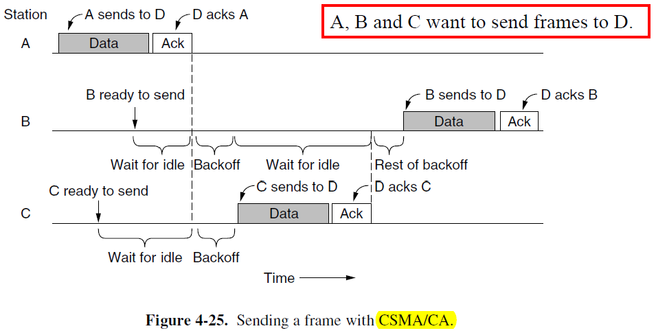{ width="600" }
</figure>

802.11 MAC 协议与以太网的核心区别：

1. starting backoffs early（提前启动退避）：以太网：只有当信道从忙变闲时，想发送的站点才会尝试发送，如果发生冲突则执行退避；802.11：一个站点在侦听到信道从忙变闲后，必须先等待一个固定的短时间（DIFS），然后进入退避计数阶段。它从一开始就选择一个随机退避时间并开始倒数。这种机制使得多个等待的站点不会在信道空闲时立即同时发送，从而分散了它们的发送时间，主动避免了冲突
2. acknowledgements（使用确认）：以太网：通过电气特性可以检测到冲突；802.11：由于无法检测冲突，它采用了一种积极的确认机制。接收站在成功收到一个发往它的数据帧后，必须立即回复一个短的 ACK 确认帧。如果发送站在预期时间内没有收到 ACK，它就推断发生了冲突或传输错误，然后执行重传和退避

两种操作模式：

1. DCF（distributed coordination function）：这是 802.11 必须实现且实际使用的标准模式。它基于分布式控制，所有站点（包括 AP）都遵循相同的 CSMA/CA 规则来竞争信道。这是 Wi-Fi 能够即插即用的基础
2. PCF（point coordinate function）：这是一种可选的、集中控制的模式。由 AP 作为主控制器，轮询各个站点，为它们分配无竞争的发送时段

> PCF 未使用的原因：缺乏协同。在免许可的 ISM 频段，一个网络中的 AP 无法控制邻近其他网络的站点发送数据。因此，PCF 所承诺的无竞争传输保障在现实环境中无法实现，导致该模式被业界弃用

在无线局域网（如 Wi-Fi）中，多个设备共享同一个无线信道，如果两个设备同时发送数据，就会发生碰撞（collision），导致数据丢失。为避免这种情况，802.11 协议引入了信道侦听机制，分为两种方式：

1. physical sensing（物理侦听）：通过硬件检测信道是否正被使用（比如是否有电磁信号）
2. virtual sensing（虚拟侦听）：通过软件机制，比如监听帧中的信息（例如网络分配向量 NAV），判断信道是否被占用

!!! tip "physical sensing"

    当设备检测到当前无线信道没有其他信号时，它就可以立即发送数据帧。一旦开始发送，就不继续侦听信道，因为此时它自己就是发送方。

    当两个或多个设备同时发送导致碰撞时，它们会停止发送，并等待一个随机时间段后再尝试重发。这个随机时间由二进制指数退避算法决定，该算法类似于以太网中的 CSMA/CD 机制，可以有效减少重复碰撞的概率

    适用于发送 RTS（Request to Send frame）帧。RTS 是一种控制帧，用于请求发送数据。在某些情况下（如高干扰环境），发送方会先发送 RTS 帧，接收方回复 CTS（Clear to Send），以此建立通信通道并减少碰撞。物理侦听通常用于这种握手过程中的帧传输

!!! tip "virtual sensing"

    考虑场景：C ---- A ---- B ---- D

    A 想要发送数据给 B。C 在 A 的通信范围内。D 在 B 的通信范围内，但不在 A 的通信范围内

    1. A 发送 RTS 帧到 B 请求发送权限，B 回复 CTS 帧表示允许发送。然后 A 发送数据，并启动 ACK 定时器
    2. C 接收到 RTS 帧，设置虚拟信道为忙状态，由 NAV（Network Allocation Vector）表示
    3. D 听到 CTS 帧，也设置 NAV

    NAV 信号不会被实际传输；它们只是内部提醒，用于在一段时间内保持安静

    <figure markdown="span">
        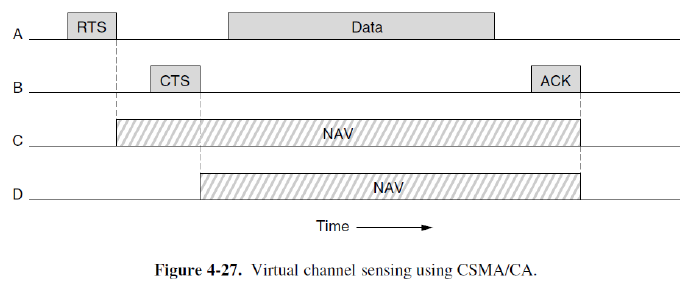{ width="600" }
    </figure>

虽然 CSMA/CA 是核心，但为了应对无线环境中的干扰、衰减、噪声等问题，802.11 还引入了多种辅助机制来增强传输的可靠性、效率和吞吐量

!!! tip "reliability"

    降低传输速率以提高成功传输的概率。发送更短的数据帧，以提高帧无损通过的概率

    802.11 允许将帧分割为更小的部分，称为 fragments（分片）。每个分片都有独立的编号；每个分片使用停止等待协议被单独确认（ACK）；每个分片都有自己的校验和，用于检测错误

    分片通过仅对损坏的分片进行重传（不需要重传整个帧），从而提高吞吐量

    NAV 机制仅使其他站点保持安静直到下一个确认（ACK）为止。当一个站点发送一个分片时，它会设置 NAV。让周围的站点知道信道正在被使用，不能发送。但是，这个 NAV 的持续时间只覆盖当前分片的传输 + 等待 ACK 的时间。一旦收到 ACK，NAV 就会被清除。下一个分片的传输又会触发新的 NAV 设置

    > 也就是说分片机制不会长时间独占信道，其他设备可以在每个分片之间有机会接入信道，保证了公平性和较高的信道利用率

!!! tip "power"

    节能的基本机制是基于信标帧（beacon frame）实现的

    在基础设施模式中，AP 会周期性地向所有连接的无线设备发送一种特殊的控制帧 —— **beacon frame**。信标帧的发送频率通常在 10 Hz 到 100 Hz 之间（即每秒 10~100 帧），具体取决于网络配置和标准版本。频率越高，设备同步越快，但也会增加能耗；频率越低，节省电量，但可能影响响应速度

    信标帧中携带了多种关键信息，包括：

    1. hopping sequences（跳频序列）：用于 FHSS（跳频扩频）系统中的频率切换顺序
    2. dwell times（驻留时间）：每个频率上停留的时间
    3. 其他信息还包括 SSID、BSSID、信道、支持的速率、TSF 时间戳等

    当某个站点处于省电模式时，它不会一直监听信道，而是只在特定时间醒来。AP 会在信标帧中通知哪些站点需要被唤醒，然后 AP 对这些站点进行轮询，被轮询的站点就会回复数据或请求，这样，AP 可以动态地为每个站点分配带宽资源

    802.11 提供了电源管理机制，允许移动设备（如手机、笔记本电脑）在不传输数据时进入睡眠状态，从而节省电池。设备通过设置电源管理位告知 AP 自己是否处于省电模式，当设备进入睡眠时，它不再持续监听信道，AP 将其数据缓存起来，并在下一个信标帧期间通过轮询唤醒它，一旦设备收到数据，就短暂唤醒处理，然后再次进入睡眠

!!! tip "quality of services"

    在无线网络中，多个设备共享同一信道。为了避免冲突并提高效率，802.11 协议引入了时隙间隔（IFS）机制。这些是帧之间必须保持的最小空闲时间。每次发送完一个帧后，不能立即发送下一个帧，必须等待一段空闲时间，确保信道确实空闲，不同优先级或用途的帧，使用不同的等待时间，等待时间越短 → 优先级越高 → 越快获得信道访问权

    常规数据帧之间的间隔称为 DIFS（DCF 接口间隔）。DIFS 是用于分布式协调功能（DCF）的标准间隔，它是普通数据帧（如数据、ACK、RTS/CTS）之间所需的最小空闲时间。所有非高优先级帧都必须等待 DIFS 后才能尝试发送

    802.11 定义了多种 IFS 类型，用来区分不同类型帧的优先级：

    <figure markdown="span">
        { width="600" }
    </figure>

### 4.3 802.11 Frame Structure

802.11 标准在无线信道中定义了三类不同的帧：数据帧（data）、控制帧（control）和管理帧（management）

1. 数据帧：传输用户数据（如网页、文件、视频）
2. 控制帧：协助数据传输过程，确保可靠性和效率
3. 管理帧：维护网络连接、发现和配置

<figure markdown="span">
    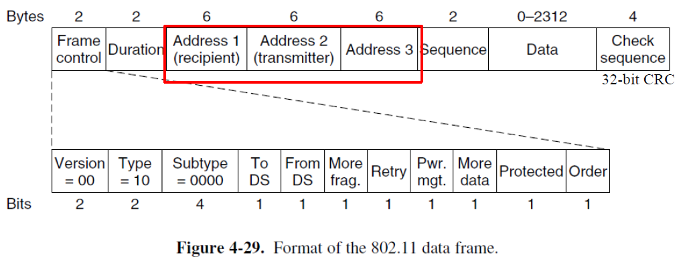{ width="600" }
</figure>

1. duration：该字段以微秒（μs）为单位，表示当前帧和预期 ACK 的总占用时间。用于虚拟侦听机制。接收方根据此值设置 NAV，告诉其他设备信道忙，请等待。例如：如果 Duration = 50 μs，则其他站点会暂停 50 微秒不发送
2. address 3：发送者或接收者的 BSSID（即 AP 的地址）。数据帧可以发送到或来自接入点，但 AP 可能只是一个中继点，因此 address 3 表示远端终点，即最终目的地或来源
3. sequence：12 位用于帧编号，唯一标识一个数据帧，防止重复接收；4 位用于分片编号，表示该帧是原数据帧的第几个分片。用于分片重组和丢包检测

!!! tip "frame control"

    1. version（设置为 `00`）：用于标识所使用的协议版本。当前所有主流 Wi-Fi 标准都使用版本 0
    2. type：定义帧的大类。00 = 管理帧；01 = 控制帧；10 = 数据帧；11 = 保留
    3. subtype：进一步细分帧的种类。0001 = RTS，0010 = CTS，0011 = ACK
    4. To DS and From DS：用于指示帧是发送到 AP 所连接的网络中，还是从这些网络中发出。两个字段不能同时为 0
    5. more fragments：表示后续还有更多的分片将被发送。当数据帧被分片时，除了最后一个分片外，其余每个分片都会设置此位为 1。最后一个分片设置为 0，表示这是最后一个
    6. retry：表示这是一个重传的帧。如果某个帧在之前传输失败，发送方会重新发送它，此时该位设为 1，通知接收方这是一次重传
    7. pwr：表示站点处于睡眠状态。该位用于支持节能机制，当设备进入省电模式时，AP 可能会在帧中设置此位，表示请不要立即响应，因为该站可能正在休眠
    8. more data：发送方还有其他帧要发送。在省电模式下，AP 使用此位告诉客户端：“我还有更多数据要发给你”。客户端收到后会保持唤醒状态，等待后续数据，避免频繁地进入和退出睡眠状态
    9. protected：该位表示帧是否经过加密，早期标准中用于 WEP 加密，现代标准（如 WPA / WPA2 / WPA3）也继承了这一机制。设置为 1 表示帧已加密，需解密才能读取内容
    10. order：用于支持严格有序传输（如视频流）。若设置为 1，则接收方必须按照帧的序列号顺序处理，不能乱序重组。主要用于 QoS 流量

!!! tip "管理帧"

    管理帧用于无线网络的建立、维护和终止。它们的帧格式与数据帧类似，但地址字段更少，通常只包含两个地址：

    1. Address 1：接收方 MAC 地址（通常是 AP 或客户端）
    2. Address 2：发送方 MAC 地址

    管理帧没有第三个地址。由于管理帧不涉及跨网桥或中继转发，它们主要用于本地通信（如客户端与 AP 之间的连接管理），所以不需要像数据帧那样标明远端终点（Address 3）

!!! tip "控制帧"

    控制帧是辅助数据传输的小型帧，用于协调通信过程，确保可靠性

    1. 地址字段少（1~2 个）。例如：RTS 包含 2 个；CTS 包含 1 个；ACK 包含 2 个
    2. 没有 Data 字段。控制帧不携带用户数据。它们的作用是信号通知或确认，不是传输信息，所以帧体非常短，节省带宽
    3. 没有 Sequence 字段。因为控制帧不进行分片，也不需要重组，不需要跟踪帧顺序，所以省略了 16 位的序列号字段，这使得控制帧更加简洁高效
    4. Subtype 字段常见值：RTS、CTS、ACK

### 4.4 Services

每个 802.11 局域网都必须提供九项服务。这九项服务是 802.11 协议定义的核心功能，由接入点（AP）或基站（Base Station）负责实现，用于支持无线网络的连接、安全、移动性和数据传输等

> 在基础设施模式下，AP 是整个基本服务集（BSS）的核心，它不仅转发数据，还承担了多种高层管理职责。这些服务统称为分布服务，因为它们帮助将数据从一个区域分布到另一个区域，包括跨网络的通信

1. association：用于移动站（客户端）连接到基站（AP）
2. disassociation：站点或基站都可以发起去关联，从而断开连接关系
3. reassociation：当站点从一个小区移动到另一个小区时使用（类似于蜂窝网络中的切换）
4. authentication：验证设备是否有权接入网络的过程。不同的安全协议使用不同的认证方式。802.11i 标准引入了更安全的 WPA2，采用 AES 加密和强身份验证
5. distribution：基站提供此项服务，将帧转发至目的地。直接转发（目标在本站内）或通过有线链路转发（目标在本站外）
6. integration：将 802.11 帧转换为非 802.11 目标网络的格式。当无线客户端要访问有线网络（如公司内部服务器）时，AP 必须对帧进行封装和解封装
7. privacy：保护数据不被窃听。使用 AES 加密算法对数据进行加密
8. QoS traffic scheduling service：提供对不同类型流量的优先级管理
9. related to using of spectrum：发射功率控制服务（自动调整 AP 和客户端的发射功率，避免过度辐射造成干扰。节能且降低干扰）和动态频率选择服务（在 5 GHz 频段中，自动避开雷达使用的频段（如机场雷达）。防止非法干扰）。这两项服务用于优化无线资源利用和减少干扰

## 5 Data Link Layer Switching

LANs 可以通过称为 bridge 或 switch 的设备进行连接。这些设备工作在数据链路层，比路由器（网络层）的层级低。它们根据 MAC 地址（数据链路层地址）来转发数据帧，因此可以承载各种网络层协议

使用多个局域网并通过网桥互联的原因：

1. 管理与所有权：不同的部门或组织可能希望管理自己的网络
2. 地理与成本：当建筑物分布较远时，用网桥连接多个独立的局域网可能比铺设长距离光缆更经济
3. 性能与负载隔离：将大部分通信限制在本地局域网内，减少了主干网络的拥堵，提升了整体网络性能
4. 物理限制：克服某些网络技术（如传统以太网）的电缆长度限制
5. 可靠性：网桥可以隔离故障。如果一个网段上的设备出现故障并疯狂发送数据，网桥可以阻止这些错误数据扩散到其他网段，类似于防火门防止火势蔓延
6. 安全性：网桥可以在一定程度上控制数据流的传播，减少被恶意嗅探（在混杂模式下）的风险，从而提供基础的安全隔离

### 5.1 Learning Bridge

> Learning Bridge 是指学习式网桥，不是动宾短语

连接到同一网桥端口的所有站点都属于同一个冲突域，并且这个冲突域与其他端口上的冲突域是不同的

<figure markdown="span">
    { width="600" }
</figure>

网桥对收到的每个数据帧都要做出两个关键决定：是否转发？从哪个端口转发？这个决策的唯一依据是帧头中的目的 MAC 地址

网桥内部维护着一个转发表，通常使用高效的哈希表实现。这个表的本质是一个地址-端口的映射关系：`[MAC地址] -> [对应的端口号]`

网桥刚启动时，转发表是空的。它不知道任何设备连接在哪个端口。此时，如果收到一个目标地址未知的帧，网桥采取 **flooding algorithm**（泛洪）：将该帧从除接收端口以外的所有其他端口复制并发送出去。确保即使不知道目标位置，帧也能被送达

网桥的每个端口都工作在 promiscuous mode（混杂模式）。这意味着网桥会接收并检查所有经过该端口的帧，而不仅仅是发给它自己的帧。这是网桥能够学习网络拓扑的基础，因为它能监听到所有邻近设备的通信

网桥通过检查帧的源 MAC 地址来学习。当一个帧从端口 X 进入时，网桥就会知道这个源 MAC 地址的设备连接在端口 X 上，并把这个信息记录到转发表中。一旦学习完成，当网桥再次收到发往该已知地址的帧时，它就不再泛洪，而是精准地从转发表中指定的端口转发出去

但是网络不是静态的：设备（电脑、IP 电话等）会开机、关机、或从一个端口移动到另一个端口。如果转发表永远不更新，就会包含过时或错误的信息，导致帧被错误地转发或丢弃

网桥每当学习到一个源地址（即创建或更新一条转发表记录）时，网桥不仅记录地址和端口，还会记录该帧的到达时间戳。如果该源地址再次发送帧，时间戳会被刷新为最新时间。这表明该设备仍然活跃在原位置。网桥内部有一个后台进程，会周期性地扫描整个转发表。检查每条记录的时间戳，如果发现某条记录自上次更新后已经存在了很长时间（例如超过 5 分钟），则认为该设备可能已经离线或移动，于是自动删除这条记录

!!! tip "总结"

    1. 如果目的地址对应的端口与源端口相同，则丢弃该帧
    2. 如果目的地址对应的端口与源端口不同，则将该帧转发到目的端口
    3. 如果目的端口未知，则使用泛洪，将该帧从除源端口外的所有端口发送出去

---

网络通信通常采用分层模型，每个层都有自己特定的头部信息（报头），桥接设备在转发数据时，可以修改所在层的头部信息。这种头部重写机制使得网络设备能够：实现协议转换、进行流量控制、提供安全保障、优化网络路径、支持不同网络环境间的互操作性

<figure markdown="span">
    { width="600" }
</figure>

IEEE 802 系列包含多种局域网标准，不同标准的 MAC 子层和物理层规范各不相同。网桥需要为每种连接的局域网类型配备相应的 MAC 子层和物理层接口，在转发数据时，网桥需要在不同 MAC 协议之间进行转换，尽管底层技术不同，但网桥为上层提供了统一的逻辑连接

<figure markdown="span">
    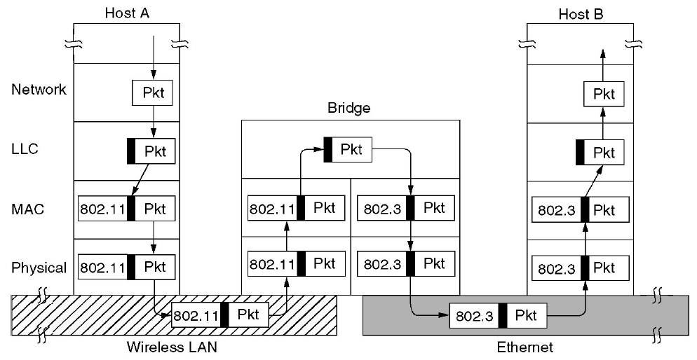{ width="600" }
</figure>

### 5.2 Spanning Tree Bridges

拓扑中可能存在 loop，可能是为了提供链路冗余，提高网络可靠性而故意设计的，也可能是由于配置错误或电缆插错端口等人为失误意外形成的

环路会导致的问题：

1. 广播风暴：当目标地址未知时，每个网桥都会向所有端口洪泛帧
2. 帧重复：同一数据帧可能通过不同路径多次到达目的地
3. MAC 地址表不稳定：网桥学习到的 MAC 地址与端口映射关系不断变化
4. 网络拥塞：无限循环的帧会耗尽网络带宽

<figure markdown="span">
    { width="600" }
</figure>

#### 5.2.1 Spanning Tree

解决环路导致的问题的方法是：交换机共同为拓扑找到一个生成树

生成树的结构是一种无环路的网络拓扑，其包含足够的链路来连接网络中所有交换机，并且任意两个节点之间只存在一条路径

<figure markdown="span">
    { width="600" }
</figure>

##### Spanning Tree Algorithm

为了构建生成树，交换机运行一个分布式算法。每个交换机定期通过所有端口向邻居广播配置消息（交换机间交换的特殊控制帧，包含交换机 ID、路径成本等信息），并处理从其他网桥接收到的消息。这些消息不被转发，因为它们的目的在于构建树，之后该树将用于转发

1. 根桥选举：选择最低的交换机标识（通常为 MAC 地址）。所有交换机广播自己的 ID，最终选举出唯一的根桥
2. 生成树构建：以根桥为中心，计算最短路径树。当到根桥的路径成本相等时，选择连接更低 ID 交换机的端口
3. 端口状态管理：位于生成树上的端口保持转发状态，非生成树链路上的端口被设置为阻塞状态

每个交换机在算法开始时都假定自己是生成树的根节点，定期向所有邻居端口发送配置消息（BPDU），配置消息包含发送者地址、根桥地址（当前认为的根交换机标识）、到根距离（以跳数计算的路径成本）

路径选择原则：

1. 优先选择更优的根：当收到包含更小根桥地址的消息时，更新自己的根桥认知
2. 优先选择更短路径：在根桥相同的情况下，选择到根桥跳数最少的路径
3. 地址打破平局：当多条路径的跳数距离相等时，选择连接更低地址交换机的端口

<figure markdown="span">
    { width="800" }
</figure>

### 5.3 Devices

各种网络设备在 OSI 模型或 TCP/IP 协议栈中所处的层级不同

<figure markdown="span">
    { width="600" }
</figure>

!!! tip "Repeaters and Hubs"

    中继器：模拟信号处理设备。不理解帧、数据包或头部。它们理解的是将比特编码为电压信号的符号

    1. 信号再生：清除信号噪声和失真
    2. 信号放大：补偿长距离传输的衰减

    集线器：多端口中继器。所有端口共享同一带宽，必须统一传输速率。其工作方式为将任一端口接收的信号广播到所有其他端口，不进行信号放大。完全忽略 MAC 地址等数据链路层信息

!!! tip "Bridges and Switches"

    网桥：

    1. 冲突域管理：每个端口都是独立的冲突域，彻底解决了集线器的冲突问题
    2. 智能转发：基于 MAC 地址表，只向目标设备所在端口转发帧（不广播）
    3. 并行处理：支持同时转发多个数据帧，提高网络吞吐量
    4. 速度适配：能够连接不同速率的网络段，通过缓冲机制处理速度不匹配
    5. 发展演变：从早期的异构网络互联设备，发展为现在主要用于同构网络

    交换机：多端口网桥，是以太网环境中网桥的具体实现。在数据链路层基于 MAC 地址进行帧交换

    1. 消除冲突：全双工点对点连接不再需要 CSMA/CD 冲突检测机制
    2. 带宽独享：每个端口享有专用带宽，大幅提升网络性能
    3. 流量隔离：只在必要路径上转发数据，减少不必要的网络流量

!!! tip "Routers and gateway"

    路由器：

    1. 决策依据：基于网络层数据包头部信息（如 IP 地址）进行路由选择
    2. 协议透明性：不关心底层帧的 MAC 地址或物理连接类型（LAN 或点对点）
    3. 网络互联：能够连接不同技术标准的网络（如以太网、Wi-Fi 等）
    4. 核心功能：在不同网络之间转发数据包，实现网络互连

    网关：可以在传输层、应用层甚至所有高层运行

    1. 协议转换：在不同网络体系结构之间进行完整的协议转换
    2. 数据重构：对数据内容、格式、语法进行重新格式化
    3. 高层互联：连接完全不同的网络系统（如 TCP/IP 与 SNA）

### 5.4 Virtual LANs

使用集线器和交换机进行集中式布线：

<figure markdown="span">
    { width="600" }
</figure>

VLAN 的核心思想：逻辑分组替代物理分组。打破物理位置限制，按部门、功能等逻辑关系划分网络

实施 VLAN 的三大理由：

1. 安全性：防止混杂模式下的数据窃听，隔离敏感部门的数据流量
2. 负载控制：避免部门间带宽争用，确保关键业务获得专用带宽
3. 广播抑制：限制广播域范围，减少不必要的网络流量，提高网络整体性能

VLAN 可以实现拓扑解耦，将逻辑网络结构与物理布线完全分离。通过网络配置而非物理搬移设备来调整网络结构。VLAN 通常用颜色非正式命名，可以通过颜色编码直观展示复杂的网络逻辑结构

交换机通过自动学习或管理配置建立 VLAN 转发表，每个端口被分配一个或多个 VLAN 标识

VLAN 转发规则：

1. 严格隔离：不允许帧跨越不同 VLAN 进行转发
2. 同 VLAN 广播：来自某个 VLAN 的帧只能在相同 VLAN 标识的端口间转发
3. 多 VLAN 端口：一个物理端口可以同时属于多个 VLAN（如 Trunk 端口）

<figure markdown="span">
    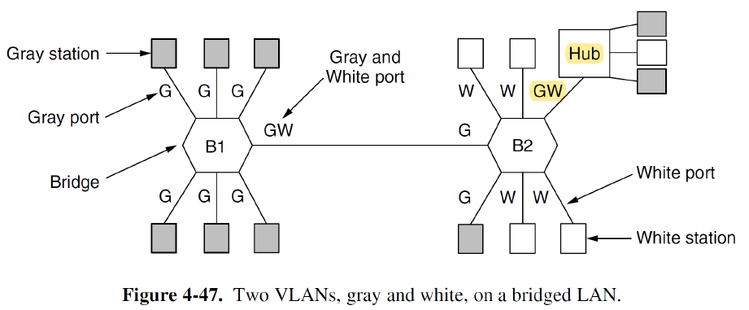{ width="600" }
</figure>

网桥如何得知传入帧属于哪个 VLAN？1998 年发布了 IEEE 802.1Q，包含 VLAN 标签字段

当帧进入 VLAN 网络时，首台交换机为其添加 VLAN 标签，所有 VLAN 感知交换机基于标签进行转发决策，在帧离开 VLAN 网络前，末端交换机移除 VLAN 标签

<figure markdown="span">
    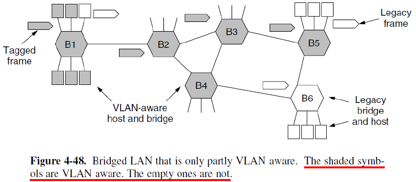{ width="600" }
</figure>

每个 VLAN 形成独立的广播域，广播帧只在同一 VLAN 内传播。VLAN trunking 是专门用于交换机间互联的特殊链路，承载多个 VLAN 的流量

干道端口与普通接入端口不同，干道端口同时属于所有 VLAN，负责在不同交换机间传递所有 VLAN 的数据帧，基于 802.1Q 标签来区分不同 VLAN 的帧

<figure markdown="span">
    { width="600" }
</figure>

!!! tip "802.1Q Frame Format"

    在标准以太网帧的源 MAC 地址和类型/长度字段之间插入 4 字节的 VLAN 标签

    VLAN 标签：

    1. TPID（标签协议标识符）：2 字节，固定值 `0x8100`，用于标识这是一个 802.1Q 帧，由于其值大于 1500，被识别为类型字段而非长度字段
    2. TCI（标签控制信息）：2 字节

        1. 优先级：3 位，提供 8 个服务质量等级
        2. CFI：1 位，用于兼容令牌环网络，指示 MAC 地址格式
        3. VID：12 位，VLAN 标识符（0-4095），其中 0 和 4095 保留
    
    <figure markdown="span">
        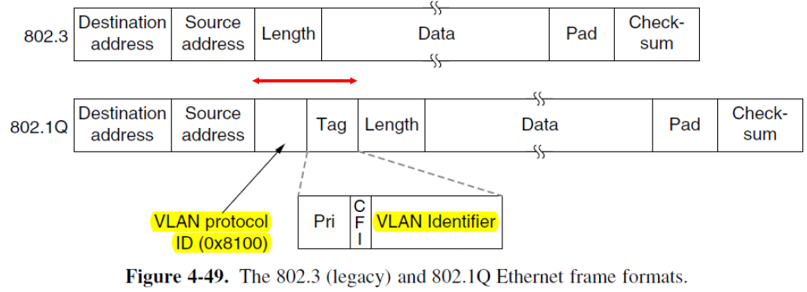{ width="600" }
    </figure>

    标准以太网帧的最大帧尺寸为 1518 字节（数据载荷 1500 字节 + 帧头帧尾 18 字节），802.1Q 帧的最大帧尺寸为 1522 字节（数据载荷 1500 字节 + 帧头帧尾 VLAN 标签 22 字节）

    最小帧仍保持 64 字节不变，但在实际传输中，网桥可能在发送时将 64 字节帧填充到 68 字节
