# 5 The Network Layer

<!-- !!! tip "说明"

    本文档正在更新中…… -->

!!! info "说明"

    本文档仅涉及部分内容，仅可用于复习重点知识

## 1 Overview of Network Layer

- 网络层：负责将数据包从发送方（源主机）跨越多个网络路由到接收方（目的主机）。它关注的是端到端的通信，可能跨越多个不同的物理网络。IP 协议是这一层的核心
- 数据链路层：负责在同一个本地网络内（例如，同一个以太网、同一个 Wi-Fi 网络内），将帧从一个设备（节点）传送到另一个直接相连的设备。它关注的是单跳通信，即在单一网段或物理链路上的数据传输。可以理解为负责最后一公里（或第一公里）的传输，确保数据在相邻设备间可靠传递

网络层的两个核心功能：

1. **forwarding**（转发）：是路由器在收到一个数据包后所执行的即时动作。它查看数据包的目的地址，查询内部的转发表，然后决定该数据包应该从哪个具体的端口发送出去
2. **routing**（路由）：是决定数据包从源到目的地的整条路径的过程。它通过运行路由协议（如 OSPF, BGP）来收集网络信息，计算最佳路径，并最终生成和更新每个路由器里的转发表

> 路由过程负责生成和更新转发表；而转发过程则使用这张转发表来实际运送每个数据包。简单来说，路由是决策，转发是执行

网络层设计的两个基本出发点：

1. 对传输层的服务：网络层作为传输层的下层，需要为其提供服务。这里的关键设计抉择是提供面向连接的、可靠的虚电路服务（类似于电话系统），还是提供无连接的、尽最大努力交付的数据报服务（类似于邮政系统）。这个选择直接影响上层应用的开发
2. 网络的内部设计：这关乎如何在网络内部实现数据包的传输。是使用虚电路方式（在通信前先建立一条逻辑路径），还是使用数据报方式（每个数据包独立路由）。这个内部设计可以与提供给上层的服务相互独立

store-and-forward packet switching（存储转发式分组交换）：这是网络层（也是早期计算机网络）实现数据转发的基础性机制。其工作流程可以分解为以下步骤：

1. 接收与存储：当路由器从一条输入链路开始接收一个数据包时，它不会立即将正在接收的比特转发出去
2. 完整接收：路由器会等待，直到整个数据包的所有比特都到达，并将其临时存储（缓存） 在内存中
3. 处理与转发：在确认整个数据包已完整无误地到达后（例如，通过 CRC 校验），路由器才会查询其转发表，决定从哪条输出链路发送，然后开始将整个数据包转发到下一个节点

<figure markdown="span">
    { width="600" }
</figure>

网络层服务的三个基本原则，其核心思想是简化上层并保持通用性：

1. 独立性：网络层的服务不应该依赖于底层使用的特定路由器品牌或技术。这保证了上层应用能在各种硬件上运行
2. 透明性（屏蔽复杂性）：传输层（以及更上层的应用程序）不应该关心网络底层到底有多少路由器、它们是什么型号、或者它们是如何连接（拓扑）的。网络层负责处理所有这些复杂性，为上层提供一个清晰的抽象接口
3. 寻址一致性：整个网络应该使用一套统一的地址方案（如 IP 地址），这样任何主机都能用同样的方式寻址任何其他主机，无论它们位于网络的哪个位置

!!! tip "面向连接与无连接服务"

    - connection-oriented service：在发送数据之前，必须先通过信令建立一条确定的路径（虚电路）。所有数据包都按顺序沿着这条路径传输，传输结束后拆除连接。优点在于能提供有保证的服务质量
    - connectionless service：每个数据包（数据报）都独立携带完整的目的地址，每个路由器根据当前网络状况为每个包独立选择路径。数据包可能走不同的路径，也可能不按顺序到达。优点是更健壮、更简单、无需建立连接的开销

在无连接服务中，网络层从传输层接收到数据后，会将其封装成独立的 **datagram**（数据报）。每个数据报都包含完整的目的地址。在发送数据之前，不需要像打电话一样先建立一条端到端的路径。每个数据报在网络中都是独立的个体。路由器会为每一个经过的数据报单独进行路由决策，即使它们属于同一个通信流。由于网络状况实时变化，同一源和目的地的不同数据报可能会通过不同的路径传输，从而导致乱序到达

**forwarding table**（转发表）是路由器进行转发决策的路线图。索引键是数据包的目的地址；对应值是为了到达该目的地，应该使用的输出接口或线路

<figure markdown="span">
    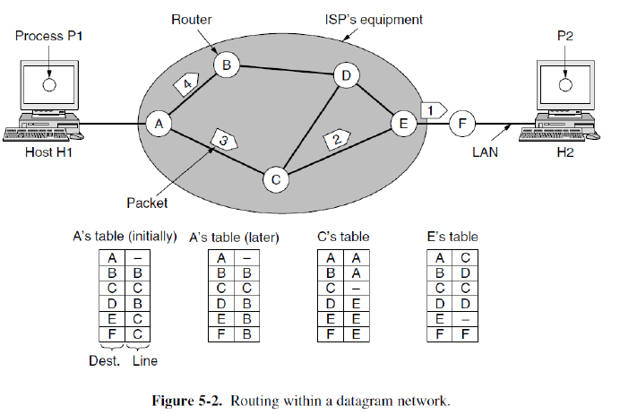{ width="600" }
</figure>

在面向连接服务中，在通信开始之前，会先建立一条穿越网络的虚电路。这是一条预定义的路径，不同于物理电路，它是逻辑上的。每个数据包不再需要携带完整的目的地地址。取而代之的是，它只携带一个简短的连接标识符（例如，一个虚拟电路号或标签）。这个标识符在每段链路上是局部的，只在两个相邻路由器之间有意义。路由器根据数据包到达的输入接口和包内的标识符，结合其转发表，决定将其从哪个输出接口转发出去，并通常会将标识符替换为下一段链路使用的新的标识符

!!! tip "MPLS（多协议标签交换）"

    MPLS 是一种高性能的隧道技术，在 IP 网络之上提供面向连接的转发
    
    路由器 A 为不同的连接分配不同的标识符，即使这些连接可能使用同一条虚电路。路由器可以根据这些标识符对数据进行不同的优先级处理或路由
    
    <figure markdown="span">
        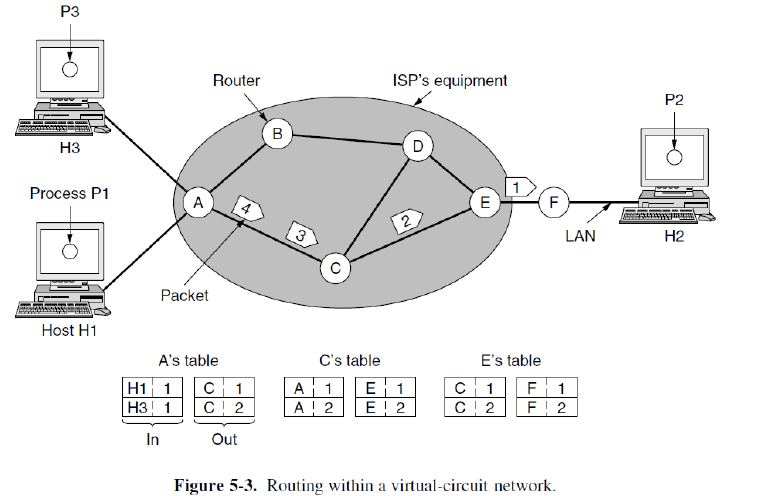{ width="600" }
    </figure>

| | 数据报网络（无连接）| 虚电路网络（面向连接）|
| -- | -- | -- |
| **电路建立** | 不需要 | 必需 |
| **寻址** | 每个数据包都包含完整的源地址和目的地址 | 每个数据包包含一个简短的虚电路(VC)号 |
| **状态信息** | 路由器不保存连接的状态信息 | 每条虚电路都需要在路由器中占用每连接的表项空间 |
| **路由** | 每个数据包被独立路由 | 在虚电路建立时选择路由；所有数据包都遵循此路由 |
| **路由器故障的影响** | 没有影响，除了在故障期间丢失的数据包 | 所有经过故障路由器的虚电路都将被中断 |
| **服务质量** | 困难 | 如果能为每条虚电路预先分配足够的资源，则很容易实现 |
| **拥塞控制** | 困难 | 如果能为每条虚电路预先分配足够的资源，则很容易实现 |

## 2 Routing Algorithms

网络层的根本任务是实现数据包从源头到目的地的路径选择与传输

路由器两大功能：

1. forwarding：根据数据包的目标地址查询内部的路由表，然后立即将数据包发送到正确的出站接口
2. 路由表维护：路由表是转发决策的依据。路由器需要动态地学习和更新路由信息，以确保表中的路径是准确和最新的。这个过程通常由路由协议和算法完成

路由算法上下文：

1. datagram 网络：每个数据包都是独立处理的。网络状况可能实时变化，因此同一个会话的不同数据包可能会通过不同的路径传输
2. virtual circuit 网络：在通信开始前，会预先建立一条固定的路径。一旦虚电路建立成功，所有后续数据包都沿着这条预定路径传输，直到连接结束

优秀路由算法的目标：correctness, simplicity, robustness, stability, fairness and efficiency

!!! tip "基于计算路径时拥有的网络信息范围的分类"

    1. global routing algorithm：每个路由器都拥有整个网络的完整拓扑信息和链路成本。它基于这张全局地图来独立计算到所有目的地的最佳路径

        - Link-state（LS）algorithm：每个路由器向网络中的所有其他路由器广播其邻居和链路成本信息。通过收集这些信息，每个路由器都能构建出完整的网络拓扑图，然后使用像Dijkstra算法这样的方法来计算最短路径。适用于小规模网络

    2. decentralized routing algorithm（分散式路由算法）：路由器不掌握全局网络信息。它只与直接相连的邻居路由器交换信息，并通过多次迭代和协作，逐步学习并计算出到达目的地的路径

        - distance-vector（DV）algorithm：每个路由器维护一个到所有已知目的地的距离向量。它定期与邻居交换自己的距离向量，并根据从邻居那里获得的信息来更新自己的路由表。适用于大规模网络

!!! tip "基于路径是否随时间动态调整的分类"

    1. static routing algorithm：路由是固定不变的，不会根据网络流量或拓扑的变化而自动调整。由网络管理员手动配置路由表。简单，开销小。无法适应网络故障或拥塞，缺乏灵活性
    2. dynamic routing algorithm：路由是自适应的。路由器会运行路由协议，根据收到的网络变化信息（如链路故障、成本变化）动态地重新计算和更新路由表。能够适应网络变化，提供更好的性能和可靠性。更复杂，会消耗带宽和 CPU 资源，并且可能引入路由环路（数据包在路由器间循环转发）和路由振荡（路由频繁剧烈变化）等问题

### 2.1 Link State Routing Algorithm

LS 算法的基本前提是，网络中的每个路由器（节点）都掌握着整个网络的完整地图。这张地图包含了所有路由器、连接它们的链路以及每条链路的成本

如何构建全局视图：链路状态广播。每个路由器首先识别所有与它直接相连的邻居，并测量到达每个邻居的链路成本。路由器将这一局部信息（即它的链路状态）打包成一个链路状态包，并将这个包广播（洪泛）到网络中的所有其他路由器。通过这个过程，每个路由器最终都会收到来自网络中所有其他路由器的链路状态包。通过整合这些信息，每个路由器就能在本地独立地构建出一张完整、一致的网络拓扑图

> 互联网中广泛使用的 OSPF 协议就是一个典型的链路状态路由协议

当每个路由器都拥有了完整的网络拓扑图后，它们就可以在本地运行相同的路径计算算法，而不会相互通信。这个算法就是著名的 Dijkstra 最短路径算法。该算法以一个特定的路由器作为源节点，计算出从这个源节点到网络中所有其他目的节点的最短路径（最低成本路径）

算法的主要目标是找到从源节点到目标节点的最短路径。这里的最短并非单指物理距离，而是指综合成本最低

1. number of hops：跳数
2. delay
3. distance
4. bandwidth
5. communication cost
6. average traffic：平均流量

最优性原理：如果路由器 B 在从路由器 A 到路由器 C 的最优路径上，那么从 B 到 C 的最优路径也遵循同一路由

!!! tip "Sink Tree"

    对于网络中任何一个给定的目的地节点，将所有能到达该目的地的最短路径合并在一起，所形成的一个树形结构，就称为该目的地的汇点树

    > 也存在 source tree（源点树）

    <figure markdown="span">
        { width="600" }
    </figure>
    
汇点树的结构带来了两个至关重要的简化：

1. 基于目的地的转发：数据包本身只需要携带最终目的地的地址。路由器在转发时，无需知道数据包的完整路径，也无需关心源地址。它只需要根据数据包的目的地地址，在本地查找应该将其发送给哪个邻居（下一跳）即可。这使得转发决策变得非常简单和高效
2. 下一跳转发：每个路由器在转发数据包时，只需要负责将其送到通往目的地的路径上的下一个路由器，而不需要直接送达最终目的地

具体体现就是转发表（路由表）。每一个条目的结构是：目的地地址 → 下一跳地址

??? example "Dijkstra 示例"

    <figure markdown="span">
        { width="600" }
    </figure>

Dijkstra 算法复杂度：$O(n^2)$

!!! tip "Oscillation Problem"

    路由振荡问题：所有路由器对于到达某个目的地的最佳路径无法稳定下来，而是发生持续、频繁的来回切换的现象

    原因：

    1. 动态的、与负载相关的链路成本：链路的成本不是固定的，而是由该链路上的实时流量负载决定的
    2. 所有路由器同步计算：网络中的所有路由器在同一时刻（或几乎同一时刻）运行路由算法，收集链路状态，并计算新的最短路径

    <figure markdown="span">
        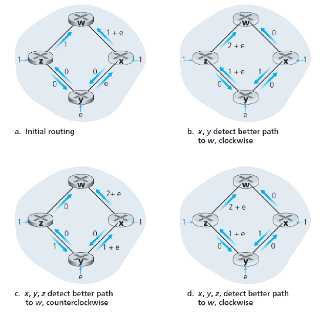{ width="600" }
    </figure>

    > 就是两个人走路的时候面对面碰到了，默契的你往左、我往右，结果永远错不开

### 2.2 Distance Vector Routing Algorithm

DV 算法的特性：

1. distributed：没有路由器拥有整个网络的全局视图。每个路由器只与它直接相连的邻居路由器进行通信。路由器从邻居那里获取信息，在本地进行计算，然后将计算结果（即自己的距离向量）告知邻居。决策是基于局部信息协作完成的
2. iterative：路径计算不是一步完成的，而是通过多次重复的信息交换-计算-再交换过程逐步逼近正确结果。路由器会周期性地与邻居交换信息，或者在外界条件（如链路成本变化、链路故障）触发时进行交换。每次交换后都可能重新计算路由。这个过程一直持续到网络中所有路由器的最佳路径信息都稳定下来，不再变化为止，此时算法自行终止
3. asynchronous（异步）：路由器之间不需要一个统一的全局时钟来协调动作。每个路由器可以独立地在任意时间点启动计算、发送或接收信息。这种松耦合的设计使算法更具鲁棒性，能够更好地适应现实网络中节点和链路状态变化的不确定性

使用 DV 算法的路由协议：

1. RIP：一个在中小型企业内部网络中常用的内部网关协议，是 DV 算法的经典实现
2. BGP：互联网的骨干路由协议，用于在不同自治系统之间交换路由信息。它作为一种路径向量协议，是 DV 算法的一种增强和演变，通过记录完整路径来解决 DV 算法的一些固有缺陷（如环路问题）

!!! tip "Bellman-Ford Equation"

    令 $d_x(y)$ 表示从节点 $x$ 到节点 $y$ 的最低成本路径的成本。那么，这些最低成本通过著名的贝尔曼-福特方程相互关联，即：

    $d_x(y) = \min\limits_v \lbrace c(x,v)+d_v(y) \rbrace$

    1. $d_x(y)$：这是我们要求解的值
    2. $\min\limits_v$：这个符号表示我们要在所有可能的选项中找到一个最小值。这里，我们是在遍历节点 $x$ 的每一个直接邻居 $v$
    3. $c(x,v)$：这是从节点 $x$ 到其邻居 $v$ 的直接链路成本。这是一个已知的、可测量的值
    4. $d_v(y)$：节点 $x$ 自己并不知道这个值，它需要从邻居 $v$ 那里学习这个信息
    
    <figure markdown="span">
        { width="600" }
    </figure>

每个节点 $x$ 开始时都有一个 $D_x(y)$，这是它自己到每个节点 $y$ 的最低成本路径成本的估计值。每个节点 $x$ 的 $D_x$ 记录了它认为自己到达网络中每一个其他节点的距离（成本）

每个路由器需要在其本地存储和维护以下三类信息：

1. 到直接邻居的链路成本 $c(x,v)$：这是唯一精确的、通过直接测量可知的信息。路由器知道连接到它每个直接邻居的链路成本
2. 自身的距离向量 $D_x$：这是该路由器当前的路由表或路由视图。它基于目前从邻居那里学到的最新信息，给出了到达所有目的地的最佳成本估计。这个向量会根据收到的邻居信息持续更新
3. 每个邻居的距离向量 $D_y$：路由器通过定期与邻居交换信息，来获取每个邻居的距离向量。拥有了邻居的距离向量，节点 $x$ 就能通过 Bellman-Ford Equation 得到 $d_x(y)$，进而得到完整的距离向量

由于可能不止有一个邻居，节点会选择最小的那个作为距离向量 $D_x(y)$。这时，如果自己的路由信息发生变化，节点会将自己的新距离向量广播给所有直接邻居，整个网络继续计算最后收敛

<figure markdown="span">
    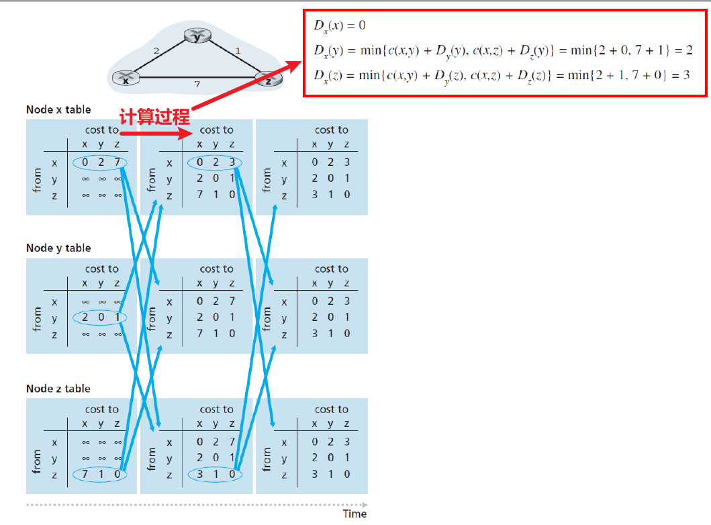{ width="600" }
</figure>

!!! tip "Count-to-Infinity Problem"

    算法虽然在理论上能保证收敛，但收敛速度可能极慢。在某些情况下，特别是发生链路故障时，正确路由信息在网络中传播的速度远远慢于错误信息的扩散，导致路由器在较长时间内保持错误的路由状态

    > 假设路由器 A 到达网络 X 的路径中下一跳是 B。当 A 与 X 之间的直连链路突然故障，A 会立刻知道。但如果 B 在此之前曾通过 A 学习过到达 X 的路径，那么 B 会认为“我可以经 A 到达 X”。链路故障后，A 会告诉 B “我到 X 的距离是无穷大”，但 B 可能会告诉 A “别担心，我有一条到 X 的路径（成本是 2）”。A 一听，就会认为“太好了，那我可以通过 B 到达 X，成本是 1 + 2 = 3”，并更新自己的路由表。然后 A 会把这个“新发现”的路径（成本 3）通告给 B。B 收到后，会更新自己的路径为“经 A 到达 X，成本是 1 + 3 = 4”，并再次通告给 A…… 如此循环，A 和 B 会不断地、缓慢地依次增加它们到 X 的成本估计值（3, 4, 5, 6...），就像在“计数”一样，直到这个成本最终增加到某个预先定义的“无穷大”值（例如在 RIP 中是 16），它们才会意识到目的地 X 是不可达的
    >
    > 这 78 AB

!!! tip "LS vs DV"

    1. 消息复杂度

        1. LS：高开销。每个路由器都需要将描述其本地链路状态的报文广播（洪泛） 给网络中的所有其他路由器。对于一个有 $n$ 个节点的网络，最坏情况下每个链路状态更新都会产生 $O(nE)$ 的消息量
        2. DV：低开销。路由器只与直接邻居交换它们的整个距离向量（路由表）。消息不会传播到整个网络，因此初始开销和微小变化时的开销通常更低

    2. 收敛速度

        1. LS：较快。使用 Dijkstra 算法，时间复杂度为 $O(n^2)$
        2. DV：较慢且不确定。因为路由信息是从邻居开始一跳一跳地逐步传播的，收敛速度通常比 LS 慢。其最严重的问题是 Count-to-Infinity，在发生某些故障时，收敛时间会变得非常长，期间可能导致路由环路

    3. 健壮性

        1. LS：更健壮。每个节点都有自己的网络视图，不依赖于邻居的计算结果。产生错误也很会被限制在本地，不会传播到其他路由器中
        2. DV：较不健壮。一个节点的错误信息会被邻居接收，邻居会基于此错误信息进行错误计算，然后这个错误会进一步传播给邻居的邻居，从而污染网络中大范围的路由表

    LS 通过更高的通信开销换取了更快的收敛和更好的健壮性，适用于现代中大型网络（如 OSPF）

    DV 则以较慢的收敛和较差的错误容忍度为代价，提供了简单的实现和较低的开销，适用于较小或简单的环境（如 RIP）

### 2.3 Hierarchical Routing

分层路由是为了管理大规模网络，将网络组织成层次结构，特别是划分为多个自治系统（AS）。每个自治系统内部使用统一的路由协议进行通信。不同的自治系统可以选择使用不同的内部路由协议

网关路由器是连接不同自治系统的特殊路由器。它们负责在不同自治系统之间转发数据

对于包含 N 个路由器的网络，最优的层次级数是对数级 $\log N$。这意味着网络规模越大，采用分层结构的好处越明显，但层次数量只需缓慢增加

<figure markdown="span">
    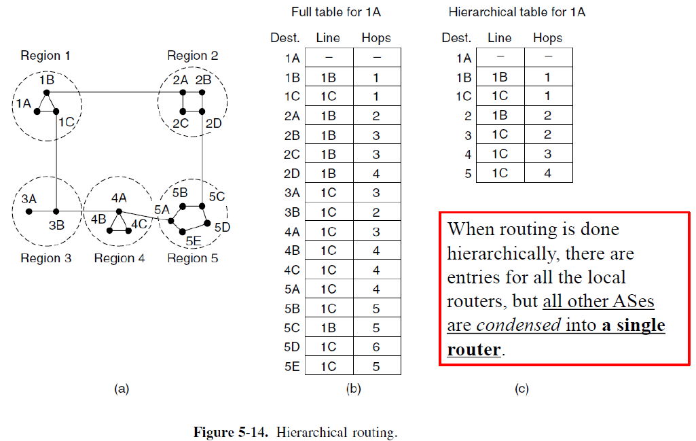{ width="600" }
</figure>

!!! tip "AS"

    **Autonomous System**

    一个 AS 通常是指由一个单一管理机构（例如一个 ISP、一所大学、一家公司）管辖下的一组路由器网络。它是实现分层路由的基础。通过将庞大的互联网划分为多个 AS，将路由问题分解为两个更易管理的子问题：

    1. AS 内部路由：运行 **域内路由协议**。同一个 AS 内的所有路由器使用相同的路由算法（如 RIP、OSPF），它们相互交换信息，共同维护一张完整的 AS 内部网络拓扑图或路由表
    2. AS 间路由：网关路由器是连接不同 AS 的边界路由器。它是一个 AS 通往外部世界的大门。在其所属的 AS 内部，它像普通路由器一样运行域内路由协议。同时，它还需要运行 **域间路由协议**，与其他 AS 的网关路由器交换路由信息，学习如何到达 AS 外部的网络

### 2.4 Broadcast Routing

广播路由的三种主要技术：

1. flooding（泛洪法）：每个收到广播包的节点简单地向所有邻居转发副本。容易形成路由循环，且可能产生广播风暴
2. controlled flooding（受控泛洪法）：两种实现方式

    1. 数据包 ID 记录：每个节点记录已转发的数据包 ID，避免重复转发
    2. 反向路径转发 (RPF)：智能过滤机制，只转发从最短路径方向来的数据包

3. spanning tree（生成树法）：构建一个覆盖所有节点但没有循环的树状结构。最优雅的解决方案，完全避免冗余数据包，确保每个节点只收到一次广播

!!! tip "uncontrolled flooding"

    非受控泛洪法：发送节点为网络中的每个目的地单独创建并发送数据包副本

    优点：
    
    1. 简单性：实现容易，不需要复杂算法或协议
    2. 兼容性：利用现有的单播路由机制，无需开发专门的广播协议

    缺点：

    1. 效率低下：源节点需要发送大量重复数据包
    2. 信息依赖：源节点必须预先知道网络中所有目的节点的信息，这在动态变化的网络中很难维护
    3. 广播风暴

!!! tip "controlled flooding: Packet ID"

    sequence-number-controlled flooding：序列号控制泛洪

    每个广播包包含两个关键信息：源节点地址（唯一标识发送者）、广播序列号（唯一标识本次广播）。每个网络节点维护一个已处理广播记录表，记录：源地址、序列号，这样可以识别重复的广播包

    工作流程：

    1. 接收检查：节点收到广播包时，先查询记录表
    2. 重复处理：如果记录表中已有相同源地址和序列号的记录，直接丢弃
    3. 新包处理：如果是新广播包，则：添加到记录表，复制数据包，转发给所有邻居节点

!!! tip "controlled flooding: RPF"

    路径验证：路由器收到广播包时，检查到达链路：

    - 如果来自返回源节点最短路径的链路 → 接受并转发
    - 如果来自其他链路 → 丢弃（认为是重复包）

    转发逻辑：只从正确方向来的第一个广播包被处理，向所有其他接口转发副本（除了接收接口）

    优点：RPF 只需要知道到发送方的单播最短路径上的下一跳邻居。它仅使用该邻居的身份来决定是否泛洪收到的广播数据包，而无需记住序列号

    <figure markdown="span">
        { width="600" }
    </figure>

!!! tip "spanning tree"

    生成树：包含网络中所有节点的无环连通子图。无环从根本上消除重复数据包和广播风暴

    构建阶段（center-based approach）：

    1. 中心选举：预先选定一个中心节点（rendezvous point / core），作为整个生成树的根节点
    2. 树形构建：各节点主动向中心发送加入树消息，消息沿单播最短路径向中心转发

        - 智能合并：当加入消息遇到已建树节点时，停止继续转发，将该路径 graft（嫁接）到现有生成树上

    <figure markdown="span">
        { width="600" }
    </figure>

    广播阶段：源节点仅通过生成树链路发送广播，中间节点仅向生成树邻居转发，数据包沿着树状路径自然传播到所有节点

    优点：

    3. 每个节点确切地收到一份数据包副本
    4. 使用最少数量的链路完成广播
    5. 树结构天然避免循环

### 2.5 Multicast Routing

组播路由：向特定群组发送信息，而非全网广播或单点单播。这些群组规模较大但与整个网络相比较小

在组播通信中，我们面临两个问题：

1. 接收者识别问题：如何确定哪些节点属于特定组播组
2. 数据包寻址问题：如何为组播组分配网络地址

使用两种方法来确定组播路由树：

1. source based tree：为组播组中的每个发送源分别建立一棵路由树，使用反向路径转发（RPF）算法构建。以源节点 x 为根，覆盖所有接收者的分发树
2. group shared tree：整个组播组共享一棵公共的路由树，基于中心节点（汇聚点）构建。通过加入消息机制构建树分支

##### 2.5.1 Internet Multicast Routing

在互联网中，代表一组接收者的单一标识符是一个 D 类组播 IP 地址

> D 类 IP 地址：用于标识组播组的特殊地址范围（224.0.0.0 - 239.255.255.255）

IGMP 协议：主机与路由器之间的组播组成员管理协议。主机向本地路由器宣告加入 / 离开组播组，路由器查询本地网络的组播组成员状态。在网络层和传输层之间运作

IGMP 协议的三大消息类型：

1. membership query message（成员查询消息）

    1. 发送方：路由器（主动查询）或主机（主动宣告）
    2. 目的：发现本地网络中的组播组成员
    3. 触发时机：路由器定期查询；主机新加入组时主动报告

2. membership report message（成员报告消息）

    1. 发送方：加入组播组的主机
    2. 目的：响应查询，宣告组成员身份
    3. 工作方式：主机收到查询后报告自己所属的组

3. leave group message（离开组消息，可选）

    1. 发送方：离开组的主机
    2. 目的：快速通知路由器成员离开

即使不发送离开消息，如果主机在查询时不再响应，路由器也会认为其已离开组

组播路由协议：路由器之间的通信。构建和维护组播分发树

1. DVMRP（距离向量组播路由协议）：使用反向路径转发 RPF 和剪枝技术实现基于源的组播树
2. PIM（协议无关组播）：两种工作模式

    1. PIM dense mode (PIM-DM)：适用于组播组成员密集分布的网络，采用类似 DVMRP 的洪泛-剪枝机制
    2. PIM sparse mode (PIM-SM)：适用于成员稀疏分布的大型网络，基于汇聚点（RP）的按需建树

### 2.6 Anycast Routing

任播路由：多个分布在不同地理位置的服务器使用相同的 IP 地址。当用户尝试访问这个 IP 地址时，网络的路由协议（主要是 BGP）会自动将用户的请求引导到对于该用户来说最近（通常指网络延迟最低）的那台服务器

这些服务器位于不同的网络（广播域），因此共享同一个 IP 不会冲突。需要通过 BGP 路由协议，让这些服务器所在的网络都向互联宣告这个相同的任播 IP 地址，从而引导流量

优点：

1. 提高性能与可靠性：用户总是连接到最近的服务器，降低了延迟，同时也提供了冗余，如果一台服务器故障，流量会自动路由到其他可用的服务器
2. 服务无关性：对于某些服务（如查询时间、CDN 分发内容），只要能得到正确结果，具体由哪个服务器处理请求并不重要。任播完美契合这种需求
3. 广泛应用：是 DNS 根服务器和高层域名服务器 的基石技术之一
4. 增强抗攻击能力：能有效抵御 DDoS 攻击，因为攻击流量会被分散到全球各地的多个服务器，而不是集中攻击单一目标

<figure markdown="span">
    { width="600" }
</figure>

## 3 The Network Layer in The Internet

### 3.1 IPv4 Addressing

报头结构：

1. 固定部分：长度为 20 字节，包含 IP 数据报必须的基本字段
2. 可选部分：长度可变，用于存放额外的控制信息

采用大端序网络字节顺序。数据比特的传输方向：先从左到右，再从上到下。这种顺序确保了不同系统间数据解释的一致性

<figure markdown="span">
    { width="600" }
</figure>

!!! tip "Version"

    1. 4 bit
    2. 功能：标识 IP 协议版本（IPv4 为 4，IPv6 为 6）
    3. 意义：允许网络在长期内平滑过渡到新版本协议，实现向后兼容

!!! tip "IHL"

    Internet Header Length

    1. 4 bit
    2. 计量单位：以 32 位字（4 字节）为单位计算首部长度
    3. 计算方式：实际字节数 = IHL 值 × 4 字节
    4. 取值范围：最小 5（20 字节），最大 15（60 字节）
    5. 实际应用：由于选项字段很少使用，绝大多数 IP 数据报的 IHL 值为 5，即标准的 20 字节首部

!!! tip "Different Service"

    Type of Service

    1. 8 bit
    2. 高 6 位：定义数据包的服务质量等级，允许网络设备根据应用需求提供不同的处理优先级
    3. 低 2 位：用于网络拥塞时的显式拥塞通知
    4. 应用示例：实时流量（IP 电话），非实时流量（FTP）

!!! tip "Total Length"

    1. 16 bit
    2. 功能：定义整个 IP 数据报（首部 + 数据）的总长度
    3. 数值范围：0-65535 字节
    4. 实际上常见值 ≤ 1500 字节，因为数据报大小通常受限于以太网的 MTU（最大传输单元）1500 字节，以避免在链路层进行分片，提高传输效率

!!! tip "Identification"

    1. 16 bit
    2. 功能：唯一标识一个数据报的所有分片，同一个原始数据报的所有分片共享相同的标识值

!!! tip "DF and MF"

    DF（Don't Fragment）：设置为 1 时，指示路由器不要对该数据报进行分片，如果数据报超过路径 MTU 且 DF 位被设置，路由器将丢弃该数据报并返回错误信息。用于路径 MTU 发现机制

    MF（More Fragment）：设置为 1 时，表示后面还有更多分片，最后一个分片的 MF 位设置为 0，表示分片结束

!!! tip "Fragment Offset"

    1. 13 bit
    2. 功能：指示当前分片在原始数据报中的位置（以 8 字节为单位）
    3. 计算：实际字节偏移量 = 偏移值 × 8
    4. 限制：最大 8192 个分片（由于 13 位字段最大值为 8191）

!!! tip "Time to Live"

    TTL

    1. 功能：防止数据报在网络中无限循环
    2. 工作机制：初始由源主机设置一个值（通常为 64、128 等），每经过一个路由器，值减 1，当 TTL 值为 0 时，路由器丢弃数据包并发送 ICMP 超时消息给源主机
    3. 实际意义：虽然名为生存时间，但实际上是通过跳数限制来控制数据包的生命周期

!!! tip "Protocol"

    1. 8 bit
    2. 核心功能：指定传输层协议类型，实现网络层到传输层的多路复用
    3. 常见协议编号：6：TCP（传输控制协议），面向连接的可靠传输；17：UDP（用户数据报协议），无连接的不可靠传输
    4. 协议号：连接网络层和传输层，确保数据被正确传递给相应的传输层协议
    5. 端口号：连接传输层和应用层，确保数据被正确传递给目标应用程序

!!! tip "Header Checksum"

    1. 功能：检测 IP 首部在传输过程中是否发生错误
    2. 计算方法：将整个 IP 首部按 16 位（2 字节）分段，使用反码运算对所有 16 位字段进行求和，结果取反得到校验和值
    3. 验证过程：接收方将收到的首部（包括校验和字段）按同样方法计算，如果结果不为零，说明首部在传输中出错
    4. 逐跳更新：由于 TTL 字段每经过路由器都会减 1，选项字段也可能改变，因此每个路由器都必须重新计算校验和
    5. 仅保护首部：不保护数据部分，数据完整性由更高层协议（如 TCP）负责

!!! tip "Source Address and Destination Address"

    1. 各 32 bit（4 字节）
    2. 源地址：标识发送数据报的主机
    3. 目的地址：标识接收数据报的目标主机
    4. 重要性：这两个字段是 IP 路由的基础，决定了数据报从源到目的地的传输路径

!!! tip "Options"

    这是 IP 首部的可变长度部分，用于提供额外的控制功能：

    1. 安全选项：定义数据报的安全等级和保密要求（实际中很少使用）
    2. 严格源路由：由发送方指定数据报必须经过的精确路径（每个路由器地址）
    3. 松散源路由：只指定必须经过的某些关键路由器，其余路径由网络决定
    4. 记录路由：每个处理数据报的路由器都会在选项中添加自己的 IP 地址，用于路径跟踪
    5. 时间戳：路由器不仅记录地址，还记录处理时间，用于网络性能分析

    特点：

    1. 选项字段长度可变，最大 40 字节
    2. 实际网络中选项使用较少，因为会增加路由器处理负担
    3. 许多防火墙会拒绝带选项的数据报

!!! tip "Data"

    payload，有效负荷

    包含实际要传输的高层协议数据（如 TCP 段、UDP 数据报、ICMP 消息等）。长度可变，受限于 IP 数据报总长度（最大 65535 字节）和 MTU 限制。是 IP 协议真正要传送的有用信息

IPv4 地址结构：

1. 总长度：32 位二进制数，通常表示为点分十进制（如 192.168.1.1）
2. 分层设计：包含网络部分和主机部分，与平坦的 MAC 地址形成鲜明对比

IP 地址标识的是网络接口，而非整台计算机，多宿主主机（连接多个网络）需要多个 IP 地址，路由器作为网络互联设备，必然拥有多个 IP 地址

IPv4 地址表示方法：

1. dotted decimal notation：将 32 位地址分成 4 个 8 位组，每组转换为十进制数。每个数字范围 0-255（对应 8 位二进制）
2. 十六进制表示：将 32 位地址直接转换为 8 位十六进制数

prefix：共享相同高位比特的连续地址块。通常写作网络地址/前缀长度（如 192.168.1.0/24）

<figure markdown="span">
    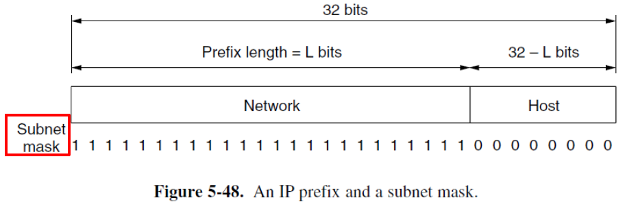{ width="600" }
</figure>

<figure markdown="span">
    { width="600" }
</figure>

#### 3.1.1 Packet Fragmentation

不同网络技术的最大有效负荷：

1. 以太网：1500 字节（最常见的 MTU 值）
2. 802.11 无线网络：2304 字节（加密前的最大帧大小）
3. IP 协议理论最大值：65515字节（总长度 65,355 减去 20 字节 IP 首部）

解决 MTU 不匹配的两种方案：

1. 避免分片：使用路径 MTU 发现机制，源主机探测到目的地的整条路径上最小的 MTU，然后发送不超过该大小的数据包
2. 接受分片：在需要时进行分片传输。存在两种重组策略

    1. transparent fragmentation：在分片发生后，由网络中的路由器负责重组，对端主机不可见
    2. nontransparent fragmentation：分片一直保持到目的主机，由最终接收方负责重组

!!! tip "Transparent Fragmentation"

    分片在网络内部（路由器）进行，重组也在网络内部（出口路由器）完成，最终主机看到的是完整的数据包，对分片过程无感知

    存在的问题：

    1. 分片完整性识别问题：出口路由器需要确知是否已收到全部分片

        - 解决方案：需要一个计数字段（记录总分片数量）或者一个结束标志位（如 IP 协议的 MF 位，当 MF = 0 时，说明是最后一个分片）

    2. 路由路径限制问题：所有分片必须经过同一个出口路由器。这违反了网络层的无状态设计原则，限制了负载均衡能力，降低了网络路由的灵活性，如果某个分片选择不同路径，重组将失败

    <figure markdown="span">
        { width="600" }
    </figure>

!!! tip "Nontransparent Fragmentation"

    在需要分片的网络节点（路由器）进行分片，仅在最终目的主机进行重组，路由器只负责转发分片，不进行重组操作

    优势：

    1. 降低路由器负担：路由器无需维护分片状态信息
    2. 提高网络灵活性：不同分片可以经过不同的网络路径

    IPv4 实现这种策略：同一数据报的所有分片共享相同标识值，Fragment Offset 字段指示分片在原始数据报中的位置，MF 字段标记是否为最后一个分片。通过这些字段的组合，目的主机能够正确重组原始数据报

    <figure markdown="span">
        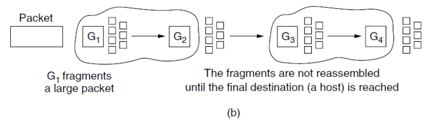{ width="600" }
    </figure>

<figure markdown="span">
    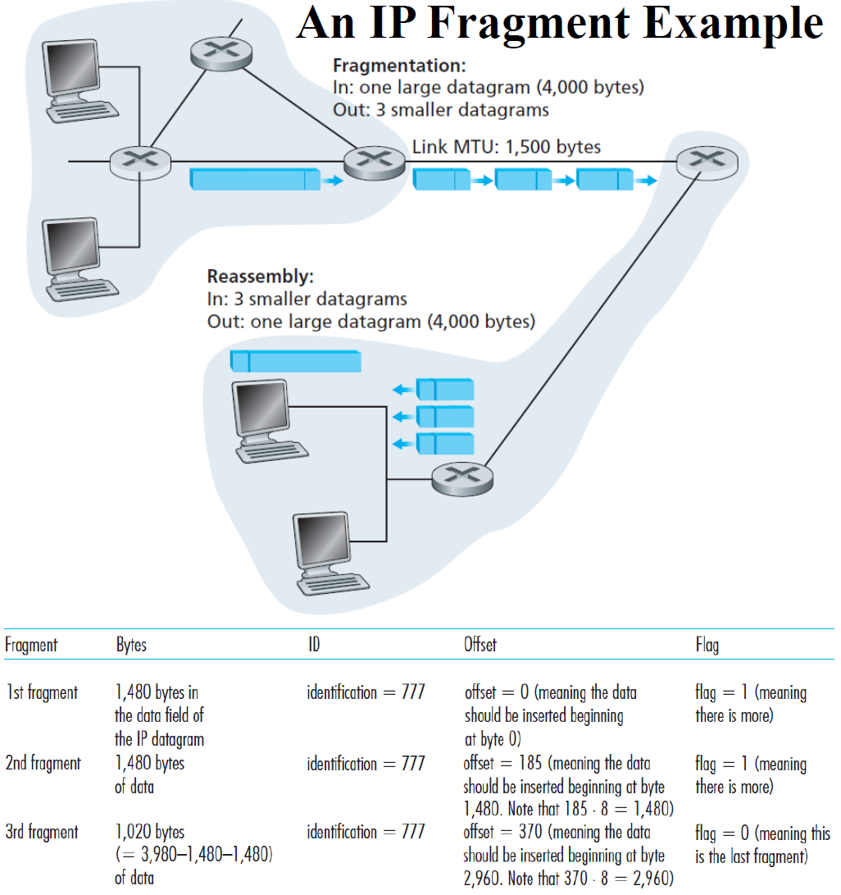{ width="600" }
</figure>

!!! tip "Path MTU Discovery"

    路径 MTU 发现机制

    路径 MTU 是指从源到目的地整条路径上能够传输的最大数据包大小，这是路径上所有链路 MTU 的最小值

    工作原理：源主机首先发送一个较大的数据包（通常设置 DF 不分片标志），如果中间路由器的 MTU 小于数据包大小，会丢弃数据包并返回 ICMP 需要分片错误消息，源主机根据返回的 MTU 信息减小数据包大小，重复此过程直到找到合适的路径 MTU

    优势：避免分片（源端发送合适大小的数据包，避免中间节点分片）、动态适应（能够适应网络拓扑和 MTU 的变化）、提高效率

    劣势：增加启动延迟（需要多次尝试-错误过程才能确定最佳 MTU）

    <figure markdown="span">
        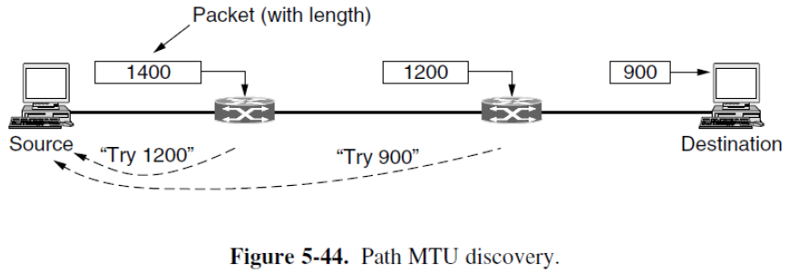{ width="600" }
    </figure>

#### 3.1.2 Subnets

传统 IP 编址中，一个网络号对应一个物理网络。但当组织规模扩大时，单个大型网络会面临广播风暴，管理困难等问题

解决方案是进行子网划分：将一个大的 IP 地址块在内部逻辑上划分为多个子网络，每个子网有自己的子网标识，对外部网络仍显示为统一的网络地址

<figure markdown="span">
    { width="600" }
</figure>

在划分子网的网络中，主路由器需要确定将入境数据包转发到哪个具体的子网

1. 基于主机的路由表：维护一个庞大的路由表，为网络内每个主机地址单独指定出口线路。缺点是路由表规模庞大，占用大量内存
2. 基于子网掩码的智能路由（实际采用方案）：使用按位与运算进行子网匹配，找到匹配的子网并转发

!!! tip "Classful Addressing"

    分类寻址是在 CIDR 技术出现之前的，将 IP 地址预先划分为几个固定类别

    <figure markdown="span">
        { width="600" }
    </figure>

    B 类网络对大多数组织来说太大，C 类又太小

!!! tip "Allocating Public IP Addresses"

    1. 顶层机构：ICANN（互联网名称与数字地址分配机构），非营利组织，负责全球互联网标识符的协调管理，核心职责：IP 地址分配 + DNS 根服务器管理
    2. 区域性互联网注册机构（RIRs）：ARIN 北美地区，RIPE NCC 欧洲、中东和中亚地区，APNIC 亚太地区，LACNIC 拉丁美洲和加勒比地区，AfriNIC 非洲地区
    3. 本地组织：互联网服务提供商、大型企业等
    4. 终端用户：通过 DHCP 协议动态获取或静态配置 IP 地址

!!! tip "Classless InterDomain Routing"

    CIDR：无类别域间路由

    随着互联网快速增长，核心路由器需要维护的路由表条目数量急剧增加，严重影响网络性能

    解决方案：

    1. subnetting（子网划分）：将大的 IP 地址块划分为更小的子网
    2. route aggregation（路由聚合）：将多个连续的小地址块合并为一个大的地址前缀

    <figure markdown="span">
        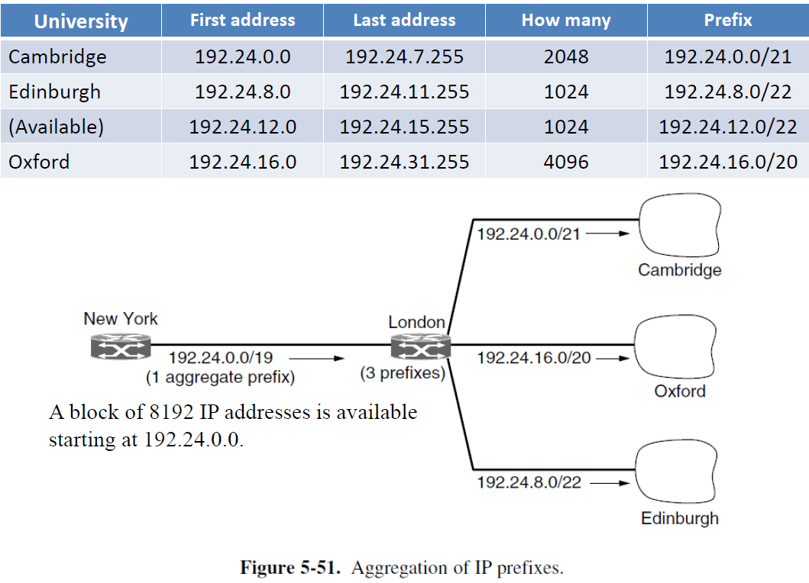{ width="600" }
    </figure>

前缀重叠：不同的路由条目可能匹配同一个目标 IP 地址。决策规则：选择匹配的所有路由中前缀长度最长的那条

> 假设目标 IP 为 192.168.1.5，路由表中有：192.168.0.0/16、192.168.1.0/24、192.168.1.0/28。路由器将选择 192.168.1.0/28，因为它的前缀最长，路由最具体

!!! tip "Subnetting vs. Aggregation"

    两者都能减少路由表规模，提高网络效率，优化 IP 地址空间利用率

    子网划分：

    1. 企业内部网络分段
    2. 部门间网络隔离
    3. 提高地址利用效率

    聚合：

    1. ISP 向上游路由通告
    2. 减少核心路由表条目
    3. 提高路由收敛速度

<figure markdown="span">
    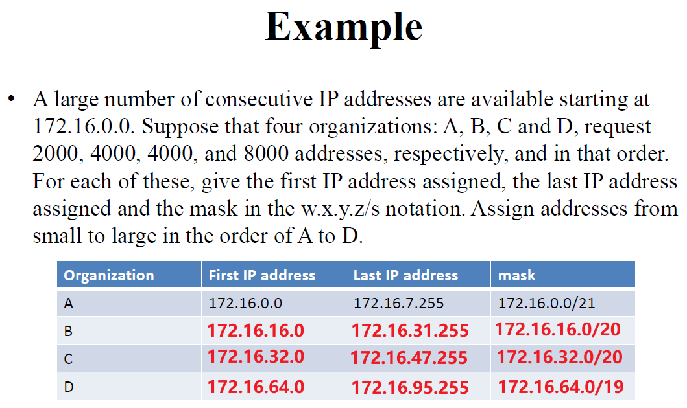{ width="600" }
</figure>

特殊 IP 地址：

1. `0.0.0.0`：默认地址

    1. 使用场景：系统启动过程中或网络配置时
    2. 作为源地址：表示本主机
    3. 作为目标地址：表示本网络中的所有主机
    4. 实际应用：DHCP 客户端在获取 IP 前使用该地址

2. `255.255.255.255`：有限广播地址

    1. 功能：本地网络广播
    2. 范围：仅在发送主机所在的物理网络段内有效
    3. 用途：网络发现协议，DHCP 客户端寻找服务器，本地网络管理

3. `127.0.0.1`：环回地址

    1. 地址范围：127.0.0.0/8（127.0.0.1 - 127.255.255.254）
    2. 功能：本地环回测试
    3. 特性：数据包不进入物理网络，直接返回给发送主机，用于测试网络协议栈是否正常工作
    4. 常见用途：开发和测试网络应用程序

#### 3.1.3 NAT

**Network Address Translation**

IPv4 地址是有限的稀缺资源

解决方案：

1. DHCP：通过动态分配和回收 IP 地址来提高 IP 地址利用率的机制。设备在线时获得 IP，离线后 IP 被收回供其他设备使用
2. NAT：NAT 设备位于内部网络和外部网络之间。它允许多个内部设备使用私有 IP 地址，同时共享一个或少数几个公共的、对外的 IP 地址来访问互联网。NAT 设备负责在数据包进出时转换 IP 地址。NAT 功能通常与防火墙集成在同一个硬件设备中。防火墙通过监控和控制网络流量来增强网络安全性

<figure markdown="span">
    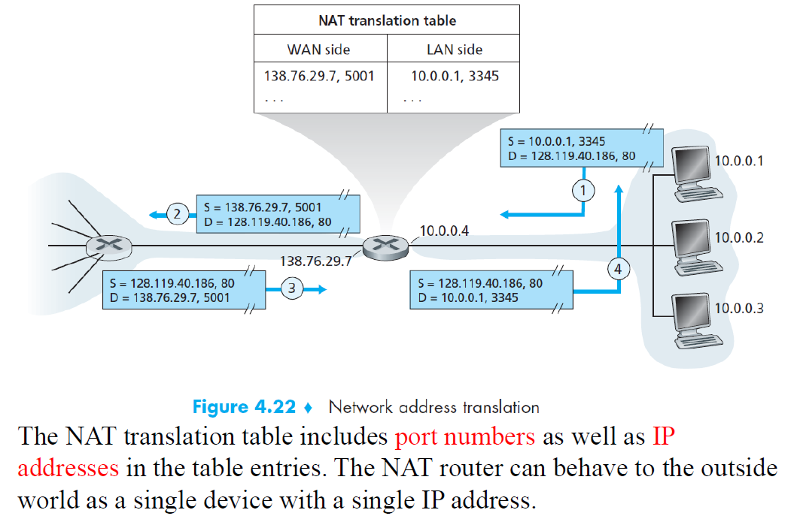{ width="600" }
</figure>

当内部网络中的一台计算机（例如 `10.0.1.2:5544`）想要访问外部网络时，NAT 设备会记录下它的内部 IP 地址和端口号。然后，NAT 设备会将这个内部地址转换为它自己的公共 IP 地址（`128.143.71.21`），并分配一个新的、唯一的端口号（例如 `3344`）来代表这个特定的连接。多个内部设备可以共享同一个公共 IP 地址，但通过不同的外部端口号来区分它们各自的连接

port（端口）指定了数据包应该交给哪个具体应用程序或进程。端口号长度 16 位，极大地扩展了寻址能力，使得一个 IP 地址可以同时处理成千上万个并发连接

> 端口号 0-1023 被称为 well-known，通常预留给标准的核心网络服务。例如端口 80 专门用于 HTTP 协议，即网页浏览流量

!!! tip "NAT 的问题"

    1. 滥用端口号：端口号在原始设计中是用于区分同一台计算机上的不同应用程序（进程）的。而 NAT 为了进行地址转换，劫持了端口号的含义，将其用于区分不同的内部主机，这被认为是一种设计上的黑客行为
    2. 破坏端到端原则：这是核心批评点。理想的互联网模型中，通信应直接在两个终端主机之间进行，中间网络设备（如路由器）不应修改数据包内容。NAT 为了完成地址转换，必须修改 IP 数据包头的 IP 地址和传输层的端口号，这破坏了网络的透明性和纯粹性
    3. 混淆层次边界：NAT 设备作为网络层（第 3 层）设备，却需要查看和修改传输层（第 4 层）的端口号信息。这违反了严格的协议分层模型，即每一层只应处理本层的头部信息，而不应关心上层封装的数据内容
    4. 改变网络本质：互联网本质上是无连接的，每个数据包都被独立路由。但 NAT 为了维护内部和外部地址的映射关系，必须维护一个连接状态表。这使得网络行为变得像面向连接的网络，其稳定性依赖于 NAT 设备本身。一旦 NAT 设备故障，所有依赖它的 TCP 连接都会因为映射表丢失而中断

#### 3.1.4 DHCP

**Dynamic Host Configuration Protocol**

DHCP 的核心作用是自动地为网络中的计算机（主机）分配 IP 地址和其他必要的网络配置参数，从而免去了手动配置的繁琐和可能出现的错误

DHCP 提供的配置信息包括：

1. IP 地址
2. 子网掩码
3. 默认网关
4. DNS 服务器地址

DHCP 被称为 **plug and play protocol**，当主机连接到网络时，DHCP 服务器会自动从其管理的地址池中挑选一个空闲的 IP 地址分配给该主机。分配的地址通常有一个租期。当主机关机或离开网络一段时间后，这个 IP 地址会被服务器收回，并可以重新分配给其他新加入的主机

DHCP 采用 client-server protocol，新加入网络的设备作为 DHCP 客户端，负责请求配置信息；而网络中存在一台或多台 DHCP 服务器，负责管理和分配 IP 地址等资源

理想情况下，每个子网（或广播域）内部都部署一台 DHCP 服务器，这样客户端可以通过本地广播直接与服务器通信。但实际中，为了管理方便和节约成本，通常不会在每个子网都部署服务器。这时，需要一个 DHCP 中继代理（通常由连接不同子网的路由器担当）。中继代理的作用是：接收本子网内客户端发出的广播请求。知道中心 DHCP 服务器的地址，并将客户端的请求以单播方式转发给该服务器。再将服务器的回复传回给客户端。这使得一个 DHCP 服务器能够为多个子网提供服务

对于新到达的主机，DHCP 获取配置是一个 4 步过程：

1. DHCP server discovery：新接入网络、没有 IP 地址的主机，需要找到网络中可用的 DHCP 服务器。客户端发送 DHCP Discover 消息。由于客户端自己没有 IP 地址，所以它将 IP 数据包的源地址设为 `0.0.0.0`。因为客户端不知道服务器的地址，所以它使用广播地址 `255.255.255.255` 作为目的地址，这样网络上的所有设备都会收到这个报文。消息被发送到 UDP 端口 67，这是公认的 DHCP 服务器监听端口
2. DHCP server offer：服务器响应客户端的发现请求，并提供一个可用的 IP 地址配置。服务器发送 DHCP Offer 消息。收到 Discover 报文的 DHCP 服务器会从自己的地址池中挑选一个空闲的 IP 地址，连同其他配置参数，通过 DHCP Offer 报文发送给客户端。此时客户端仍然没有 IP 地址，所以服务器同样使用广播方式发送此报文，以确保客户端能收到。如果网络中有多个 DHCP 服务器，它们可能都会回应一个 Offer。客户端将接收到的第一个 Offer 或根据特定策略选择一个 Offer
3. DHCP request：客户端正式向选定的服务器请求配置，并告知其他服务器它的选择。客户端发送 DHCP Request 消息。在收到一个或多个服务器的 Offer 后，客户端通常会选择第一个到达的或最合适的 Offer，然后广播一个 Request 消息
4. DHCP ACK：服务器最终确认并正式分配该配置。被选中的服务器发送 DHCP ACK 消息。服务器收到 Request 后，会回复一个 ACK 消息。这个消息包含了客户端所请求的完整配置参数。收到 ACK 后，客户端才被允许在网络上使用这个 IP 地址

<figure markdown="span">
    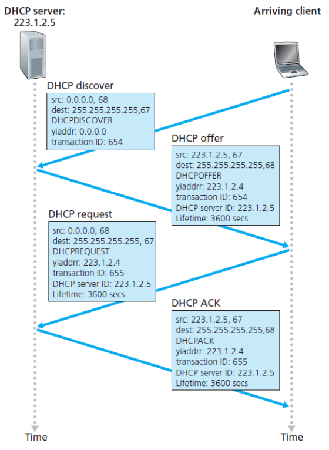{ width="600" }
</figure>

- lease duration（租期）：DHCP 分配的 IP 地址不是永久性的，它有一个时间限制，称为租期。这确保了当客户端离线或不再需要地址时，地址可以被回收再利用
- renew（续租）：为了防止租期到期后失去地址，客户端需要在租期过半左右时向服务器发起续租请求，以延长其 IP 地址的使用权。这通常不需要重复完整的四步过程

### 3.2 IPv6 Addressing

IPv6 使用 128 位地址，相比 IPv4 的 32 位地址，地址数量有了指数级增长。这从根本上解决了 IPv4 地址枯竭的问题

IPv6 与 IPv4 不兼容，IPv6 是一个独立的协议，IPv4 设备无法直接与 IPv6 设备通信。但 IPv6 与上层 / 辅助协议兼容：IPv6 仍然使用 TCP、UDP 等传输层协议，并与 DNS、BGP 等关键网络协议协同工作，保证了互联网架构的延续性

IPv4 头部长且包含多个可选字段，而 IPv6 头部被固定为 40 字节，字段数量减少到 7 。更简单、固定的头部结构使得路由器处理数据包时所需的操作更少，从而提高了数据转发速度，降低了网络延迟

在 IPv4 中，选项是放在主头部中的，这会降低路由器的处理性能。IPv6 通过扩展头部机制来处理选项，这些扩展头部只在需要时被检查，从而加快了标准数据包的常规处理速度。此外，IPv6 提高了安全性，改进了服务质量

<figure markdown="span">
    { width="600" }
</figure>

!!! tip "version"

    4 bit。用于指明 IP 数据报的版本。值为 6 表示这是一个 IPv6 数据包；值为 4 则表示是 IPv4

    仅仅在 IPv6 数据包的版本字段里写 4，并不能将它神奇地转换成一个合法的 IPv4 数据包。这是因为 IPv4 和 IPv6 的报文头结构完全不同。这个字段只是为了让设备能够正确识别并解析后续的报文内容

!!! tip "difference services"

    8 bit。用于服务质量和流量管理。它继承了 IPv4 中 TOS 字段的功能，但进行了重新定义。其中，最低的 2 位被定义为显式拥塞通知，允许网络路由器在数据包中标记它正在经历拥塞，从而通知发送端降低传输速率，这是一种主动的拥塞控制机制

!!! tip "flow label"

    20 bit。发送方可以为一系列相关联的数据包分配一个相同的、非零的流标签。当路由器看到这个标签时，可以快速查询内部表，得知这些数据包需要特定的处理方式（如更高的优先级、固定的路径等），而无需深入检查每个数据包的内容

    它试图结合数据报网络和虚电路网络的优点。互联网本质上是无连接的数据报网络，灵活但缺乏保障。流标签引入了类似虚电路的概念，能够为特定的数据流提供更可预测的服务质量，从而更好地支持实时应用

!!! tip "payload length"

    16 bit。指明了 IPv6 基本头部之后的数据部分的总长度（单位是字节）。这包括了可能存在的任何扩展头部以及最终的传输层数据段

    它只计算基本头部之后的内容。IPv6 的基本头部是固定的 40 字节，不在此字段的计算范围内

!!! tip "next header"

    8 bit。指明了紧跟在当前头部之后的头部的类型

    1. 如果后面直接是传输层数据（如 TCP、UDP），那么这个字段的值就对应着 TCP 或 UDP 的协议号，其含义和取值与 IPv4 头部的协议字段完全相同
    2. 如果后面还有一个 IPv6 扩展头部，那么这个字段的值就标识了那个扩展头部的类型。路由器或主机会根据这个值来解析下一部分内容

!!! tip "hop limit"

    8 bit。与 IPv4 的 TTL 字段功能完全一致。数据包每经过一个路由器，该值就减 1。当值减到 0 时，数据包会被丢弃。这可以防止数据包在网络中因路由环路而无限循环

!!! tip "source address and destination address"

    各占 128 bit。分别存放数据包发送者的 IPv6 地址和接收者的 IPv6 地址

!!! info "IPv6 不存在的字段"

    1. fragmentation / reassembly：IPv6 规定分片操作只允许由发送数据包的源主机执行。如果路由器遇到过大的数据包，它直接丢弃并通知源主机
    2. checksum：IPv6 无检验和字段。数据完整性检查由其他层负责了。传输层（TCP/UDP）有自己的校验和来保护数据和端口号，数据链路层（如以太网的 CRC）也保护了整个帧。在网络层再做一次校验被认为是多余的
    3. options：IPv6 无选项字段。IPv6 头部严格固定为 40 字节

IPv6 的 128 位地址被分成 8 段，每段 16 位。每段用 4 个十六进制数字表示。段与段之间用 冒号 `:` 分隔。例如 `8000:0000:0000:0000:0123:4567:89AB:CDEF`

简化规则：

1. 省略前导零：为了书写简洁，每一段中开头的零可以省略
2. 压缩连续的零段：如果地址中包含一个或多个连续的全零段（即 `0000`），可以将这些连续的全零段一次性压缩成 双冒号 `::`。在一个地址中，双冒号 `::` 只能使用一次

例如 `8000:0000:0000:0000:0123:4567:89AB:CDEF` → `8000:0:0:0:123:4567:89AB:CDEF` → `8000::123:4567:89AB:CDEF`

在 IPv4 向 IPv6 过渡期间，有一种特殊的表示法，可以将 IPv4 地址嵌入到 IPv6 地址中。格式为 `::IPv4 address`。这通常用于表示兼容 IPv4 的 IPv6 地址。例如 `::192.31.20.46`

##### 3.2.1 IPv6 Extension Headers

扩展头部是一些可选的、专门用途的额外头部，被放置在 IPv6 基本头部和上层协议头部（如 TCP/UDP）之间。扩展头部必须紧接在 IPv6 基本头部之后

| Extension header | Description |
| -- | -- |
| Hop-by-hop options | 携带必须被路径上每一台路由器检查的信息 |
| Destination options | 携带只需由最终目的地处理的信息 |
| Routing | 类似于 IPv4 的松散源路由，用于指定数据包需要经过的中间路由器列表 |
| Fragmentation | 当数据包需要分片时使用。在 IPv6 中，只有源主机可以使用此头部进行分片，路由器不会进行分片 |
| Authentication | 提供数据源认证和数据完整性检查 |
| Encrypted security payload | 提供数据的机密性（加密）保护 |

扩展头部的选项采用一种称为 TLV 的标准格式（Type, Length, Value）进行编码

1. Type：1 byte。标识选项的种类。类型字段的前 2 位是一个处理指令，专门告诉那些不认识这个特定选项的路由器应该如何行为。可能的指令有

    1. 00：跳过并继续：忽略这个不认识的选项，继续处理数据包的其他部分
    2. 01：丢弃并通知：丢弃整个数据包，并向发送源发送一个 ICMP 错误消息
    3. 10：静默丢弃：丢弃整个数据包，但不发送 ICMP 错误消息
    4. 11：丢弃（多播特例）：如果数据包是发往多播地址的，则丢弃它且不发送 ICMP 消息；对于单播地址，其行为与 01 相同

2. Length：1 byte。明确指出紧随其后的值字段有多少个字节。这允许接收方即使不理解某个选项的类型，也能准确地跳过它，继续处理后面的内容
3. Value：承载该选项具体的配置数据或信息

##### 3.2.2 Transitioning from IPv4 to IPv6

**dual-stack approaches**（双栈技术）：网络设备同时运行 IPv4 和 IPv6 两套协议栈。这意味着该设备既拥有 IPv4 地址，也拥有 IPv6 地址，并且能够理解、处理和收发两种协议的数据包

当与一个支持 IPv6 的目的地通信时，设备会优先使用 IPv6。当与一个仅支持 IPv4 的目的地通信时，设备则使用 IPv4。这种方式允许设备在 IPv4 和 IPv6 网络并存的过渡时期与绝大多数网络节点进行通信

当通信必须经过一个纯 IPv4 网络 时，双栈设备无法直接发送原始的 IPv6 数据包。IPv6 数据报中一些特定于 IPv6 的字段将会丢失

<figure markdown="span">
    { width="600" }
</figure>

**Tunneling**（隧道技术）：将整个 IPv6 数据包作为 payload 封装在一个 IPv4 数据包中，通过 IPv4 网络传输。在接收端，再解封装出原始的 IPv6 数据包

<figure markdown="span">
    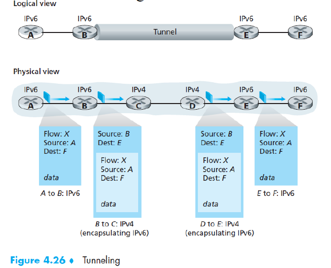{ width="600" }
</figure>

数据包在隧道中传输时，是被封装起来的。因此，隧道路径中间网络上的设备无法直接访问或识别被封装的原始数据包。它们只能看到外层的 IPv4 数据包

但 VPN 正是利用隧道技术来创建一条安全的、逻辑上的私有通道，穿越公共网络。隧道的不透明性正好确保了数据的机密性和完整性

### 3.3 Control Protocols

除了用于数据传输的 IP 协议之外，互联网在网络层还有几个配套的控制协议

- IPv4 使用：ICMP，ARP，DHCP
- IPv6 使用：ICMPv6，NDP，DHCPv6

#### 3.3.1 ICMP

ICMP 的核心功能是在网络层进行错误报告和诊断。当路由器或目标主机在处理 IP 数据报过程中遇到问题时，它会向数据报的源发送方回送一个 ICMP 消息，告知所遇到的错误类型

> "Destination network unreachable" 是 ICMP 生成的一种典型错误消息，它告知发送方其数据报由于某种路由问题而无法交付到目标网络

ICMP 在协议栈中被设计为位于 IP 之上。ICMP 消息本身作为一个独立的数据单元，被封装在 IP 数据报的数据部分中进行传输。在 IPv4 中，IP 头部的协议字段值为 1，明确标识其载荷是一个 ICMP 消息

ICMP 消息有一个 type 字段和一个 code 字段，这两个字段共同精确定义了消息的类型和具体子类；ICMP 错误消息会包含触发该错误的原始 IP 数据报的头部及其前 8 个字节。这前 8 个字节通常包含了传输层头部的关键信息

<figure markdown="span">
    { width="600" }
</figure>

!!! tip "ping"

    当在命令行输入 `ping <目标IP地址>` 时，电脑会主动生成一个特殊的 ICMP 消息，即回显请求报文。这个请求报文在 ICMP 中定义为 类型 8，代码 0。目标主机收到这个回显请求报文后，如果它工作正常且配置允许，会回送一个回显应答报文作为响应。该应答报文在 ICMP 中定义为 类型 0，代码 0

!!! tip "tracert"

    tracert 的目的是找出从源主机到目标主机的路径上，所有经过的中间路由器（跳数），利用了 TTL 字段的机制，当 TTL 值减为 0 时，路由器会丢弃该数据包，并向源发送方发回一个 ICMP 超时错误消息

    工作流程：

    1. 发送探测包序列：Tracert 不会只发送一个数据包，而是发送一系列数据包。第一个数据包的 TTL 设置为 1。它到达路径上的第一个路由器时，TTL 减为 0，于是该路由器丢弃它并返回一个 ICMP 超时消息。第二个数据包的 TTL 设置为 2，它能到达第二个路由器后才被丢弃并返回 ICMP 超时。第三个数据包的 TTL 设置为 3，以此类推
    2. 使用 UDP 段：这些数据包携带的是 UDP 数据段，并故意使用一个不常用的端口号，目的是希望目标主机在收到这个数据包时，会因为端口不可达而返回另一个 ICMP 错误消息，以此通知 Tracert 它已经到达了最终目的地
    3. 计时：源主机会为每个发出的数据包记录发送时间，当收到对应的 ICMP 回复时，就能计算出到该路由器的往返延迟
    4. 中间路由器的响应机制：当 Tracert 发送的、TTL 设置为 n 的数据包到达路径上的第 n 台路由器时，该路由器会将 TTL 值减 1。由于 TTL 变为 0，路由器会按照协议规定丢弃这个数据包。丢弃数据包的同时，路由器会主动生成一个 ICMP 超时消息（类型 11，代码 0），并将其发送回给 Tracert 的源主机。这个消息中包含了生成此错误信息的路由器自身的 IP 地址
    5. 源主机的信息提取：Tracert 源主机收到这个 ICMP 超时回复后，会执行两个关键操作：记录路由节点：从 ICMP 消息的源 IP 地址字段中，提取出第 n 跳路由器的 IP 地址。通过 DNS 反向查询，通常还可以解析出该路由器的名称；计算往返时间：根据之前为该探测包启动的计时器，计算出从发送到接收 ICMP 回复的往返延迟。这个时间反映了到该路由器的网络延迟情况
    6. 完整过程的循环：这个过程会一直重复，直到某个数据包最终到达目标主机。当 TTL 足够大的数据包到达目标主机后，目标主机会因为数据包中的 UDP 端口不可用而返回一个 ICMP 目的不可达（端口不可达）消息。Tracert 收到此消息后，便知道路径跟踪已完成

    标准的 Tracert 实现会为每一个 TTL 值连续发送 3 个完全相同的探测包

#### 3.3.2 ARP

计算机使用 IP 地址（网络层地址）在逻辑上标识自己并进行网络间路由。然而，实际的网络数据传输最终必须通过物理网络完成，这些网络使用 MAC 地址（链路层地址）在本地网络中直接识别设备

ARP 就是为了解决这个如何通过 IP 地址找到 MAC 地址的问题

工作原理：

1. 查询：当一台主机需要与同一本地网络（子网）内的另一台主机通信时，它会广播一个 ARP 请求包。这个包本质上是在向网络上的所有设备喊话："谁的 IP 地址是 XXX.XXX.XXX.XXX？请把你的 MAC 地址告诉我"
2. 响应：网络上所有主机都会收到这个广播，但只有 IP 地址匹配的那台主机会响应。它会向查询主机发送一个 ARP 回复包（单播），告知其 MAC 地址
3. 缓存：查询主机会将得到的 IP-MAC 对应关系存储在本地的 ARP 缓存表中，以便后续通信时直接使用，无需再次广播查询

ARP 只能在同一个本地网络（子网）内工作，因为 ARP 请求是以广播形式发送的，而广播帧通常不会被路由器转发到其他网络。不同子网之间的地址解析需要依赖其他机制（如网关）

ARP 协议为了提高效率而采用的优化机制：

1. ARP 缓存：每个设备维护一个 ARP 缓存表，存储最近查询到的 IP-MAC 地址映射。避免对同一目标 IP 地址的重复 ARP 查询。每个缓存条目都有一个 TTL。超过 TTL 后，条目会被删除，以确保当设备的 MAC 地址发生变化时，缓存信息不会永久错误。这保证了映射信息的最终一致性
2. 在 ARP 请求中包含发送方映射：当主机 A 广播 ARP 请求询问主机 B 的 MAC 地址时，主机 B 在回复之前，通常也需要知道主机 A 的 MAC 地址，这可能导致主机 B 也发起一个 ARP 请求。所以主机 A 在发送的 ARP 请求包中，就主动包含了自己的 IP-MAC 地址映射。主机 B 收到请求后，可以直接将主机 A 的映射存入自己的 ARP 缓存，从而在回复时无需再发起 ARP 查询。由于 ARP 请求是广播，网络内的所有主机都可以学习并缓存主机 A 的映射关系，如果它们将来需要与主机 A 通信，就可以直接使用缓存，避免了未来的 ARP 广播
3. gratuitous ARP（无故 ARP）：这是一种主动的、预防性的 ARP 使用方式，主要用于以下情况：

    1. IP 地址变更时通告：当一台主机更换了 IP 地址但 MAC 地址没变时，它可以通过广播一个查询自己新 IP 地址的 ARP 请求，来主动更新网络中所有其他主机 ARP 缓存里的旧映射
    2. IP 地址冲突检测：如果一台主机在启动时发送一个查询自己 IP 地址的 ARP 请求，竟然收到了回复，这就说明网络中存在另一台主机使用了相同的 IP 地址，从而检测到 IP 冲突

4. Proxy ARP（代理 ARP）：路由器被配置为代理的角色。它监听本地网络上的 ARP 请求。当路由器发现一个 ARP 请求的目标 IP 地址实际上位于另一个网络时，它会代表那个目标主机进行响应

<figure markdown="span">
    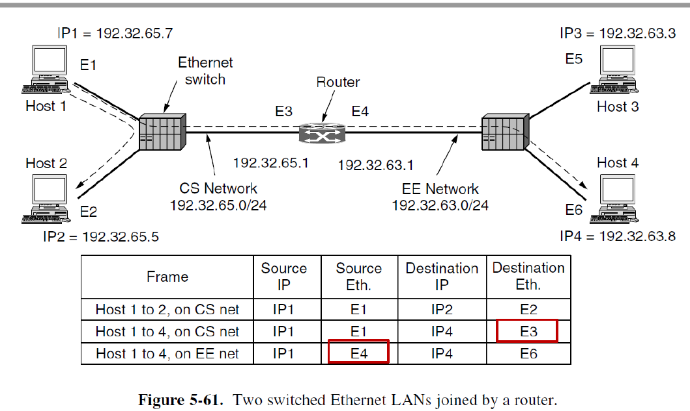{ width="600" }
</figure>

<figure markdown="span">
    { width="600" }
</figure>

### 3.4 Routing Protocols

two-level routing algorithm：互联网的路由被清晰地划分为两个层次

1. 域内路由：在一个独立的网络内部，这个网络通常被称为自治系统（AS）。用于在 AS 内部交换路由信息，决定数据包如何从一点到达另一点。常见协议有 OSPF 和 EIGRP
2. 域间路由：在不同的 AS（通常是不同的互联网服务提供商）之间。用于在 AS 之间交换路由信息，决定数据包如何跨越不同运营商的网络。常见协议有 BGP

互联网的层次化物理结构：

1. 核心骨干：由极少数顶级的 Tier 1 网络 构成
2. 中间层：包括普通的 ISP、区域性网络、大型数据中心等
3. 边缘网络：包括家庭、企业、大学的内网等。它们是互联网服务的最终用户和内容的消费者 / 提供者

尽管物理基础设施所有权分散、结构复杂，但 IP 协议提供了统一的逻辑语言。所有设备都使用 IP 地址，所有数据都被封装成 IP 数据包，这使得数据能够在异构的网络之间无缝路由和传输

<figure markdown="span">
    { width="600" }
</figure>

#### 3.4.1 RIP

RIP 是最早和最简单的域内路由协议之一

RIP 是一个经典的 DV 协议。这意味着路由器只与它的直接邻居交换信息，并且交换的信息是它自己到所有已知网络的距离（跳数）列表

RIP 使用非常简单的 hop 作为选择路径的唯一度量。hop 定义为从源路由器到目标子网所经过的路由器数量加 1。最大跳数被设定为 15，跳数为 16 则被视为不可达，因此 RIP 只能用于小型网络

在 RIP 中，路由器默认大约每 30 秒向所有邻居广播一次它的整个路由表（RIP 通告）。通告中包含该路由器所知的目的子网列表，以及它自己到这些子网的跳数

RIP 是作为一个应用层进程实现的。它使用 UDP 端口 520 来发送和接收路由信息。这意味着 RIP 协议逻辑运行在操作系统用户空间，通过标准套接字接口使用 UDP 服务来通信，而不是作为内核网络栈的一部分

<figure markdown="span">
    { width="600" }
</figure>

<figure markdown="span">
    { width="600" }
</figure>

<figure markdown="span">
    { width="600" }
</figure>

#### 3.4.2 OSPF

OSPF：域内路由，使用 LS 协议。用于在网络中动态计算最佳路径

当存在多条到同一目的地的、开销（cost）相同的最短路径时，OSPF 会同时记录这些路径

OSPF 支持 ECMP（等价多路径），ECMP 是一种负载分担技术，允许路由器将流量均匀（或按一定策略）分配到多条等价路径上，从而提高带宽利用率和网络可靠性

<figure markdown="span">
    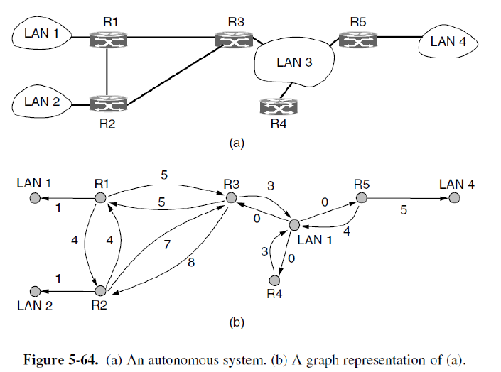{ width="600" }
</figure>

<figure markdown="span">
    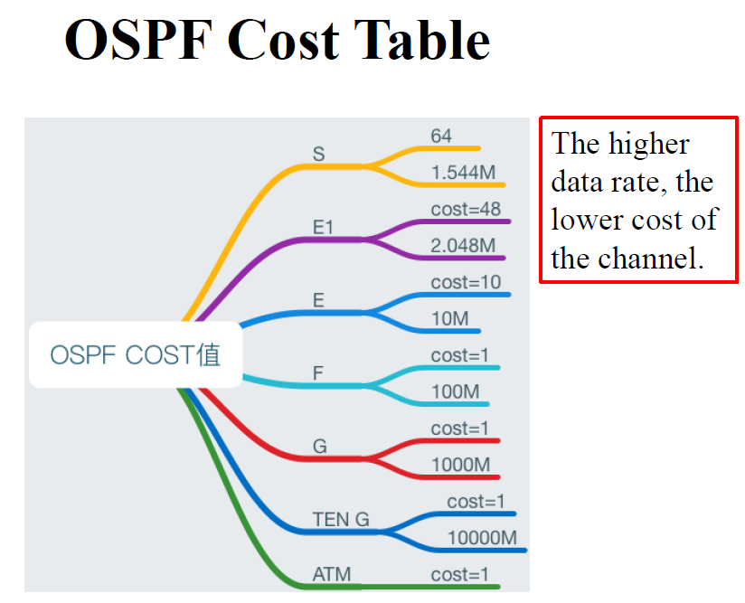{ width="600" }
</figure>

大型自治系统内的路由器数量可能非常多。如果所有路由器都在同一个 OSPF 区域内，那么每台路由器都需要维护整个 AS 内所有网络和路由器的完整链路状态数据库，并进行复杂的 SPF 计算，这会消耗大量的 CPU、内存资源，并且任何拓扑变化都会引发全网的泛洪更新，导致收敛速度慢、不稳定

OSPF 通过引入 **area** 的概念来解决这个问题，将一个大网络划分成多个较小的逻辑单元

区域的特性：

1. 拓扑隐藏：区域最重要的特性是信息抽象。一个区域内部的详细网络拓扑对于该区域之外的路由器是不可见的。外部路由器只知道如何到达这个区域以及这个区域内部有哪些网络，但不知道具体的内部路径
2. 减少信息泛洪：链路状态更新信息（LSA）的泛洪被限制在区域边界内。这极大地减少了网络中传递的路由协议流量和每个路由器需要处理的信息量
3. 内部路由器： 只负责本区域内路由计算的路由器，其路由表相对简单

每个自治系统都有一个 **backbone area**，称为 area 0。所有非主干区域都必须直接或间接（通过虚拟链路）连接到主干区域。区域之间的通信（区域间路由）必须通过主干区域进行。主干区域负责在不同的非主干区域之间传递路由信息。主干路由器负责维护主干区域的链路状态数据库，并在其上计算路径

area border router（ABR）：区域边界路由器。ABR 不会将其所在区域的完整、详尽的链路状态数据库传播到其他区域。相反，它会执行路由汇总。它将本区域的网络前缀以及到达这些网络的最佳开销，汇总成更简洁的信息后，再发送到其他区域

stub area：末梢区域。当一个区域只有一个唯一的出口（即只有一个 ABR）时，它被称为末梢区域。在这种配置下，区域内的路由器不需要了解外部的复杂路由。它们只需要知道，所有去往区域外的流量都发送给那个唯一的 ABR 即可

AS boundary router（ASBR）：AS 边界路由器。ASBR 是 OSPF 域与外部路由域（如另一个 OSPF 域、EIGRP 域、BGP 域或静态路由）的边界网关。它通过重分发机制，将来自其他路由协议或静态配置的、通往 OSPF 自治系统外部网络的路由信息，以外部 LSA 的形式引入到 OSPF 域中。这些路由信息会被传播到整个 OSPF 自治系统。对于 OSPF 域内的路由器来说，这些外部网络被表示为可通过某个特定的 ASBR 到达的目的地，并附带一个由 ASBR 计算或分配的外部开销值

<figure markdown="span">
    { width="600" }
</figure>

在每个 OSPF 区域内，所有路由器通过交换链路状态通告（LSA）达成对网络拓扑的一致认知（即相同的链路状态数据库）。基于这个一致的数据库，每台路由器独立运行最短路径优先（SPF）算法，计算出到达区域内所有目的地的最短路径树。这保证了区域内路由的最优性和无环性

ABR 是连接不同区域的路由器，它同时是多个区域的成员。因此，它必须为每个连接的区域维护一个独立的链路状态数据库，并且需要为每个区域运行独立的 SPF 计算

OSPF 强制规定所有区域间流量必须经过主干区域（区域 0）。如果主机 A 在区域 1，主机 B 在区域 2，那么数据包的路径将是：A → 区域 1 内的 ABR → 区域 0 → 区域 0 内的路径 → 区域 2 的 ABR → 区域 2 → B

由 ASBR 引入的外部路由会携带一个外部开销值。这个开销值可以有两种类型：

1. E1：外部开销 + OSPF 域内到达 ASBR 的开销。路由器会比较总开销
2. E2：默认类型。仅比较外部开销，不考虑 OSPF 域内到达 ASBR 的开销。这通常用于希望外部路由度量优先于内部路径选择的场景

在以太网等多路访问网络上，如果有 N 台路由器，若每两台之间都建立全互联的 OSPF 邻接关系，将产生 `N(N-1)/2` 条邻接关系，导致大量的 Hello 报文和 LSA 泛洪，效率极低。解决方案是选举 designed router（DR）和 backup designed router（BDR）

- DR：所有其他路由器（称为 DROthers）只与 DR 和 BDR 建立邻接关系。DR 负责代表该网络生成网络 LSA，并负责将 LSA 泛洪到网络上的所有其他路由器
- BDR：作为 DR 的热备份，随时准备在 DR 故障时立即接管其职责，实现快速、无缝的故障切换，避免网络收敛延迟

<figure markdown="span">
    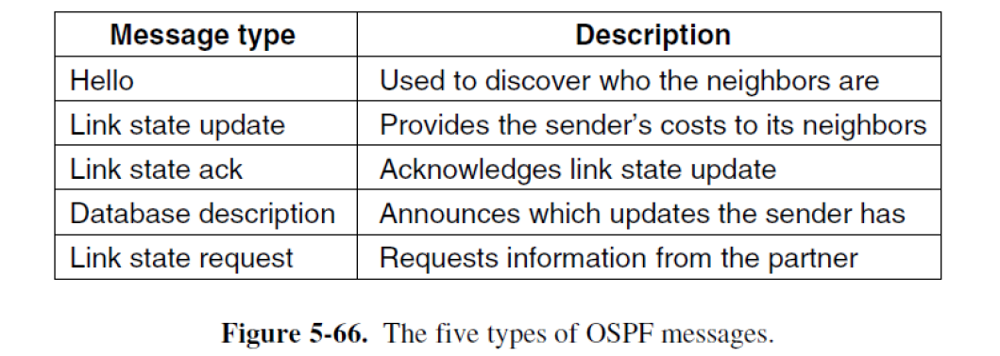{ width="600" }
</figure>

OSPF 路由器会周期性地泛洪其已知的 LINK STATE UPDATE 信息。仅仅发送更新是不够的，必须确保邻居确实收到了。为此，OSPF 使用链路状态确认。接收方在收到 LSA 后，必须发送 LINK STATE ACKNOWLEDGEMENT 报文进行确认。如果发送方在规定时间内没有收到确认，它会认为传输失败并重传更新

序列号是区分 LSA 新旧、防止信息回退和循环的关键。每台路由器为其生成的每类 LSA 都维护一个单调递增的序列号。当一台路由器收到一条 LSA 时，它会将收到的序列号与自己数据库中存储的同一条 LSA 的序列号进行比较：

1. 如果收到的大于存储的：说明这是更新的信息。路由器会用新 LSA 替换数据库中的旧 LSA，并继续泛洪这条新 LSA
2. 如果收到的等于存储的：说明信息未变。路由器会忽略它（但可能发送确认）
3. 如果收到的小于存储的：说明这是陈旧的信息。接收方会立即向发送方发送自己存储的、更新版本的 LSA，以帮助对方更新其数据库

#### 3.4.3 BGP

BGP：域间路由，使用 DV 协议。BGP 的核心职责是在不同的自治系统（AS）之间交换路由信息

BGP 的选路依据不单纯是最短距离，而是根据商业、政治、安全、性能等策略来选择路径。例如 ISP A 可能优先选择其付费客户的路径，即使该路径比免费的同行路径更长；拒绝接收或转发来自不可信 AS 的路由；避免路径经过某些拥塞或性能不佳的 AS

互联网交换中心 IXP 是 ISP 之间物理互连的主要场所。在 IXP，大量 ISP 通过交换机直接互联，避免了必须通过更高级别运营商进行中转。这降低了成本，提高了性能。BGP 会话经常在这些对等点建立

BGP 负责选择 AS 到 AS 的路径，IGP（例如 OSPF）负责在 AS 内部选择路由器到路由器的路径

在 BGP 中，路由器之间通过半永久 TCP 连接（使用端口 179）交换路由信息。BGP 邻居（对等体）之间的 TCP 连接一旦建立，就会长期维持，用于持续交换路由更新、保活和通知消息

在 BGP 中，目的地并不是单个主机，而是经过 CIDR 汇总的前缀，前缀可以是任意长度的掩码。ISP 会将其拥有的多个连续的子网汇总成一个更大的前缀再通告给其他 AS。这种路由聚合极大地减少了全球 BGP 路由表的规模，提高了路由查找和传播的效率

<figure markdown="span">
    { width="600" }
</figure>

- eBGP：用于不同 AS 之间交换路由信息。它是 AS 获取外部世界路由信息的唯一渠道
- iBGP：用于同一 AS 内部的 BGP 路由器之间交换从 eBGP 学到的路由信息

当（任何 AS 中的）网关路由器通过 eBGP 学习到前缀后，该网关路由器会利用其 iBGP 会话，将这些前缀分发给 AS 内部的其他路由器

无论是边界路由器（通过 eBGP 直接学习）还是内部路由器（通过 iBGP 学习），当它们接收到一条有效的 BGP 路由后，都会运行 BGP 决策进程（比较该前缀的多条可选路径的属性，选择最优的一条）。被选中的最优 BGP 路由，其下一跳 IP 地址（通常是对端 eBGP 邻居或 iBGP 通告者指定的地址）会被解析。路由器需要确保通过其 IGP 路由表能够到达这个 BGP 下一跳。一旦验证可达，路由器就会将此前缀条目安装到其 IP 转发表（或称转发信息库）中，用于实际的数据包转发

autonomous system number（ASN）：在全球范围内唯一地标识一个自治系统

BGP 路由：是前缀 + 路径属性的完整组合。属性携带了影响路径选择的策略信息

!!! tip "BGP Route Advertising"

    路由通告：各 AS 的边界路由器相互通告 BGP 路由。路由通告包含：

    1. IP prefix：这是目的地。BGP 通告的不是单个 IP，而是网络地址块
    2. AS path：这是路线图和防环的关键。它记录了从通告者出发，到达目标前缀需要依次经过哪些 AS
    3. next hop：这是下一个驿站。指的是接收方路由器应该将去往该前缀的流量转发给哪个 IP 地址

    防环机制：当一个 BGP 路由器收到一条路由时，它会立即检查 AS 路径列表中是否包含自己的 AS 号。如果包含，路由器会果断丢弃这条通告；如果不包含，路由器会将其视为有效的新路由，加入到 BGP 表中

    路由通告的传播方向与流量的方向相反

    <figure markdown="span">
        { width="600" }
    </figure>

<figure markdown="span">
    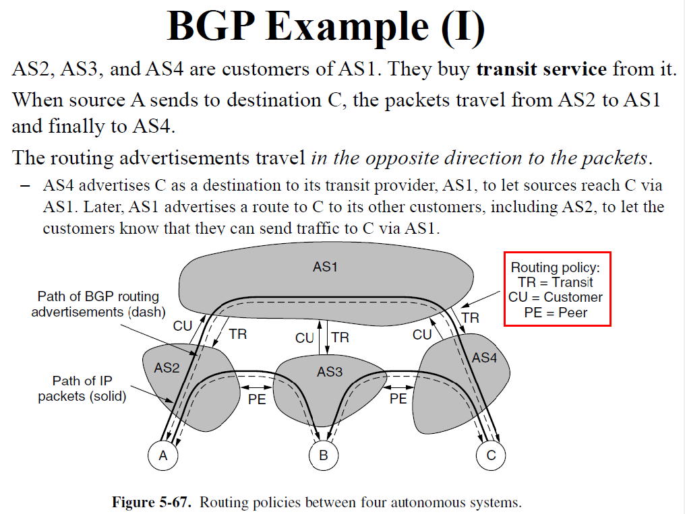{ width="600" }
</figure>

<figure markdown="span">
    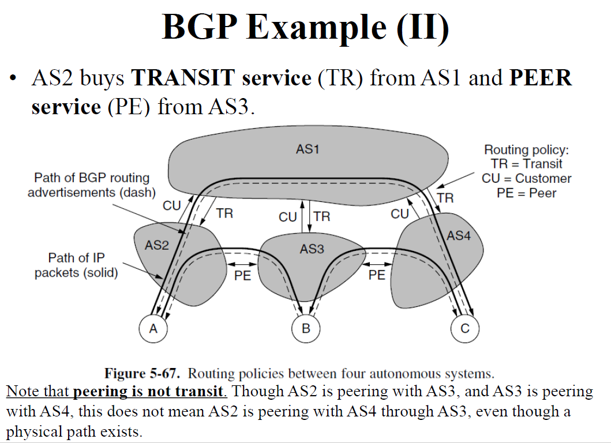{ width="600" }
</figure>

## 4 MPLS

传统 IP 转发（数据报模型）：每个路由器独立地为每个到达的数据包做出转发决策。路由器检查数据包的目的 IP 地址，在自己的路由表中执行最长前缀匹配查找，以确定下一跳

MPLS 引入标签：MPLS 在传统 IP 网络之上引入了一个新的转发范式。它在数据包进入 MPLS 域时，为其预先分配一个短小、固定长度的标签。这个标签在 MPLS 网络内部唯一标识了一条转发路径（即标签交换路径 LSP）

MPLS 的初衷不是要取代 IP。MPLS 是 IP 网络的增强层或加速层。它是一个运行在 IP 之下的 2.5 层协议。并非所有流量都必须经过 MPLS 处理。网络管理员可以有选择地为特定类型的流量建立 LSP 并打上标签

IP 协议在设计时遵循的是无连接、数据报模型。每个数据包都是独立的，其头部包含了足够的信息（目的 IP 地址）供每个路由器独立做出转发决策。因此，IP 头部结构（IPv4 或 IPv6）中没有预留给虚电路号或路径标签的字段。试图修改 IP 头部标准来加入标签，将意味着需要更新互联网上所有支持 IP 的设备，这在实践中是不可能完成的任务。MPLS 协议的设计者采用了一个非常聪明且务实的方案：不修改 IP 头部，而是在第二层和第三层之间插入一个新的头部

<figure markdown="span">
    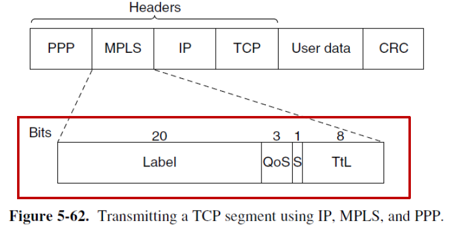{ width="600" }
</figure>

1. Label field：核心字段，占 20 位。这是数据包在网络内部使用的路径标识符。标签交换路由器（LSR）仅根据此标签进行转发决策
2. QoS field：3 位。用于服务等级分类，可以指示数据包的优先级或丢弃优先级，以便在网络拥塞时实施差异化服务
3. S field：1 位。栈底标志。MPLS 支持标签堆叠（标签栈），即一个数据包可以携带多个嵌套的标签。`S = 1` 表示这是标签栈中的最后一个（最底层）标签；`S = 0` 表示后面还有更多标签
4. TTL field：8 位。生存时间。其功能与 IP 头部中的 TTL 完全一致：每经过一台路由器减 1，当减至 0 时数据包被丢弃。这防止了因路由环路导致的数据包无限循环，是 MPLS 网络健壮性的关键保障

LSR 的工作流程：

1. 提取入标签：LSR 收到一个带 MPLS 标签的数据包后，首先读取其最外层的入标签
2. 查表（LFIB）：这个入标签被用作一个精确的整数索引，去查询一张名为标签转发信息库的表
3. 执行操作（出标签和出接口）：表中对应条目明确指示两项关键信息：出标签：一个新的标签值；出接口：数据包应该从哪个物理接口转发出去
4. 标签交换与转发：LSR 执行两个原子操作：标签交换：将数据包头部的旧（入）标签替换为新（出）标签；转发：将数据包从指定的出接口发送出去

同一个标签值在不同的 LSR 上代表完全不同的含义。例如，在路由器 A 上，标签 100 可能意味着发往路由器 B，使用接口 1；而在路由器 B 上，标签 100 可能意味着发往路由器 C，使用接口 2

因此，标签必须在每一跳都被替换（重映射）。这确保了数据包在穿越网络的每一跳时，使用的都是当前路由器能够理解的本地语言（标签）

MPLS 标签的生命周期：

1. 产生：当一个普通的 IP 数据包（无 MPLS 标签）到达 MPLS 网络的入口边界时，标签边缘路由器 LER 检查数据包的多个字段，根据预定义的策略，将符合相同条件的一类数据包，归入同一个转发等价类。每个 FEC 对应一条穿过 MPLS 网络的标签交换路径，LER 根据 FEC，从自己的标签转发表中找到对应的出标签，将这个标签（或多个标签构成的标签栈）压入到 IP 数据包之前，形成 MPLS 帧
2. 中途：一旦数据包被打上标签进入 MPLS 网络，所有内部的标签交换路由器将仅基于标签进行转发，完全忽略内部的 IP 头部
3. 消失：当带标签的数据包到达 MPLS 网络的出口边时。出口 LER 查找自己标签转发表的最后一条指令。对于要去往外部 IP 网络的数据包，这条指令通常是弹出最外层标签。标签被移除，原始的 IP 数据包被还原。然后，出口 LER 像一个普通 IP 路由器一样，根据 IP 路由表将数据包转发到下一个网络

> FEC 是一组被网络以相同方式转发的数据包。最常见的划分 FEC 的依据就是具有相同 IP 路由下一跳。一个标签在本地绑定到一个 FEC，而不是绑定到一个端到端的连接

<figure markdown="span">
    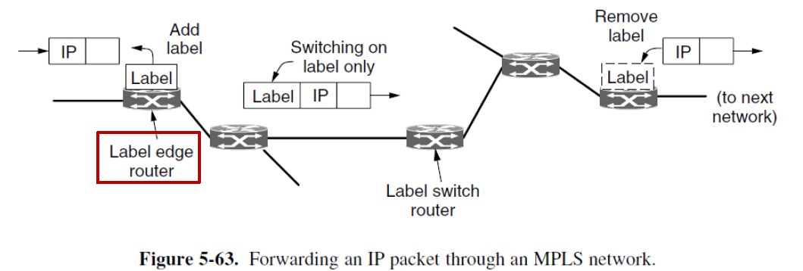{ width="600" }
</figure>

标签栈：MPLS 可以在一个已经打上标签的数据包中再打上别的多个标签，实现标签嵌套。这样一些路由器只需要查看最外层标签即可，无需关注内部标签。S filed 的作用就体现在这里。当路由器（通常是核心路由器）看到 `S = 0` 的标签时，它知道在执行标签交换时，不能移除这个标签，因为下面还有标签

<figure markdown="span">
    { width="600" }
</figure>
