# 6 Transport Layer

!!! tip "说明"

    本文档正在更新中……

!!! info "说明"

    本文档仅涉及部分内容，仅可用于复习重点知识

## 1 Overview of The Transport Layer

传输层与网络层一起，是网络协议栈中最核心的层次之一，负责在应用程序之间建立可靠或高效的数据传输机制

1. 数据传输：提供从发送方到接收方的数据传递服务，强调效率、可靠性和成本效益
2. end-to-end 通信：确保数据能够跨越整个网络，从源头直接到达目的地，而不只是相邻节点之间的传递

<figure markdown="span">
    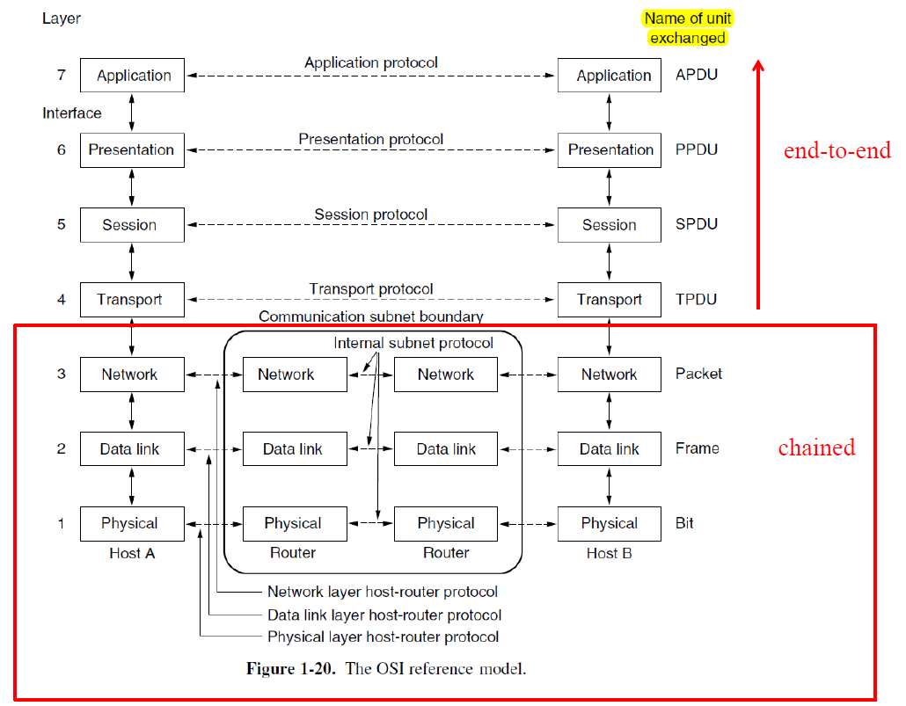{ width="600" }
</figure>

<figure markdown="span">
    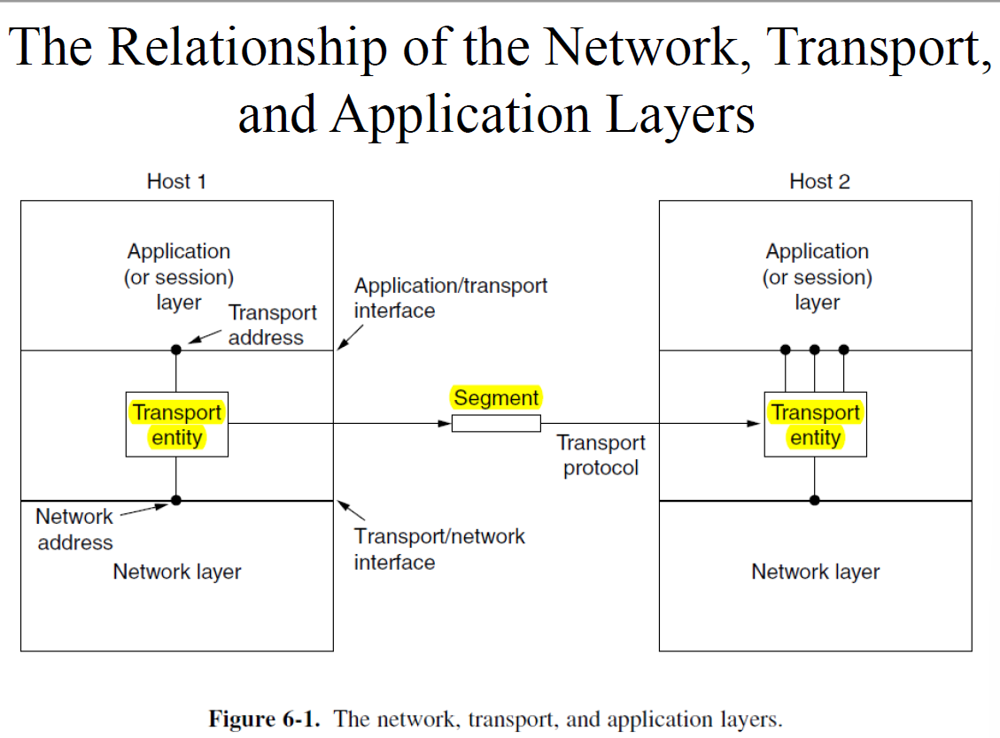{ width="600" }
</figure>

两种传输服务：

1. 面向连接的服务：需要先建立连接，传输完成后释放连接（如 TCP）
2. 无连接的服务：无需建立连接，每个数据包独立发送（如 UDP）

为什么要有传输层：

1. 用户控制与网络控制的分离：传输层运行在终端设备上，用户可控制其行为；网络层运行在网络设备上，用户无法干预
2. 弥补网络层不可靠性：网络层服务不保证可靠性、顺序或完整性，传输层通过重传、确认、连接管理等机制提供可靠服务

传输层的作用：在不可靠的网络层之上，通过建立连接、错误检测、重传、流量控制等方式，提升端到端的通信质量。在连接意外中断时，传输层可重建连接并恢复传输状态，确保数据完整性和连续性

<figure markdown="span">
    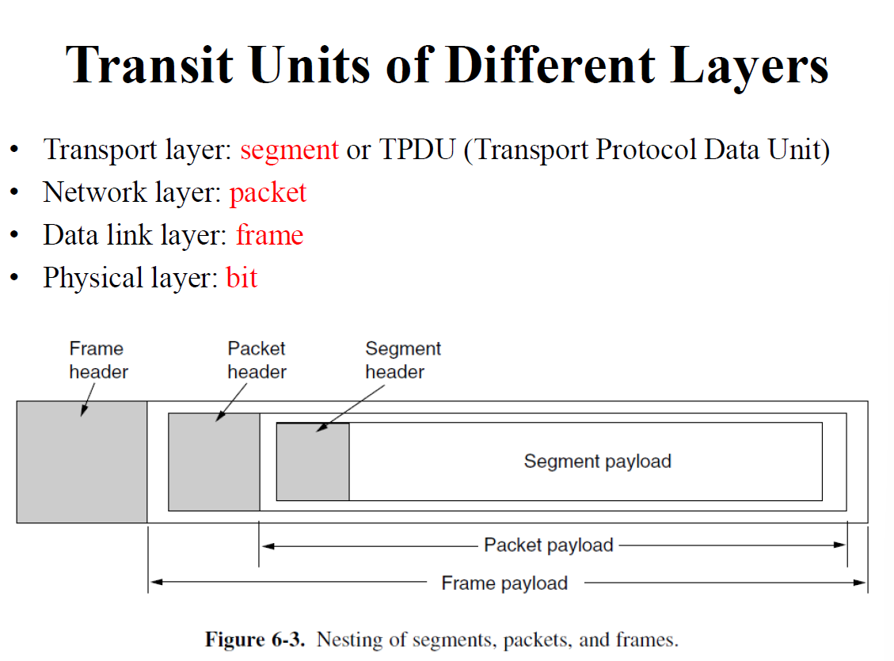{ width="600" }
</figure>

## 2 The Internet Transport Protocols

传输层的两种核心协议：

1. UDP（用户数据报协议）：是一种无连接的协议，意味着发送数据前不需要建立连接。提供非常基本的服务，仅负责将数据包从源应用程序发送到目标应用程序，不保证数据包的顺序、可靠性或是否到达。通常运行在操作系统的内核中，效率高、开销小
2. TCP（传输控制协议）：是一种面向连接的协议，在数据传输前需要经过三次握手建立连接，传输结束后通过四次挥手释放连接。提供丰富的功能，除了基本的数据传输外，还通过重传机制确保数据可靠到达，并提供流量控制和拥塞控制

### 2.1 UDP

UDP 是一种无连接、不可靠的传输协议，定义于 RFC 768

UDP header 结构非常简单，仅有 8 字节，包含四个字段：

<figure markdown="span">
    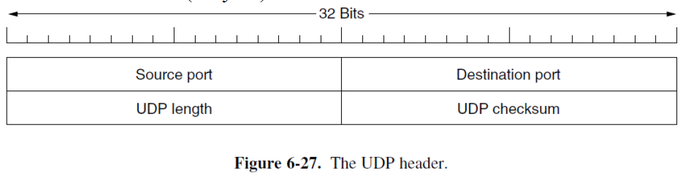{ width="600" }
</figure>

1. source port、destination port：共同标识通信的端点，即运行在设备上的应用程序
2. UDP length：表示整个 UDP 数据报的长度（包括头部和数据）。最小为 8 字节（仅头部，无数据）。最大为 65515 字节，这是因为 UDP 数据报封装在 IP 数据包中，受 IP 数据包最大长度（65535 字节）限制，减去 IP 头部（通常 20 字节）后得到此值
3. UDP checksum（可选）：提供简单的错误检测机制，用于验证数据在传输过程中是否损坏。校验和计算不仅包括 UDP 头部和数据，还包含一个 IP pseudoheader（IP 伪头部）

!!! tip "IPv4 pseudoheader"

    <figure markdown="span">
        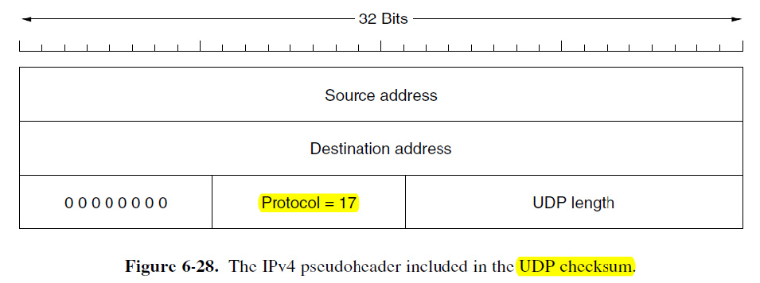{ width="600" }
    </figure>

    1. protocol（8 bit）：指示所使用的传输层协议，UDP 对应的协议号是 17
    2. UDP length（16 bit）：指整个 UDP 数据报（包括头部和数据）的字节数。和 UDP 头部的 length 字段值相同

    伪头部的作用：通过将 IP 层信息纳入校验和计算，UDP 可以在一定程度上验证数据报是否被误传给错误的主机或协议。这增强了端到端数据传递的可靠性

!!! tip "计算 UDP 校验和"

    1. 初始化校验和字段：计算校验和之前，UDP 头部中的校验和字段被临时设置为 0
    2. 数据填充：如果 UDP 数据部分的字节数是奇数，则在数据末尾填充一个 0 字节，使其成为偶数个字节。这是因为校验和计算以 16 位为基本单位，需要对齐
    3. 将所有 16 位二进制数值按 one's complement 加法规则求和。对上述求和的结果再取补码，得到的值即为最终校验和，并填入 UDP 头部的校验和字段中

<figure markdown="span">
    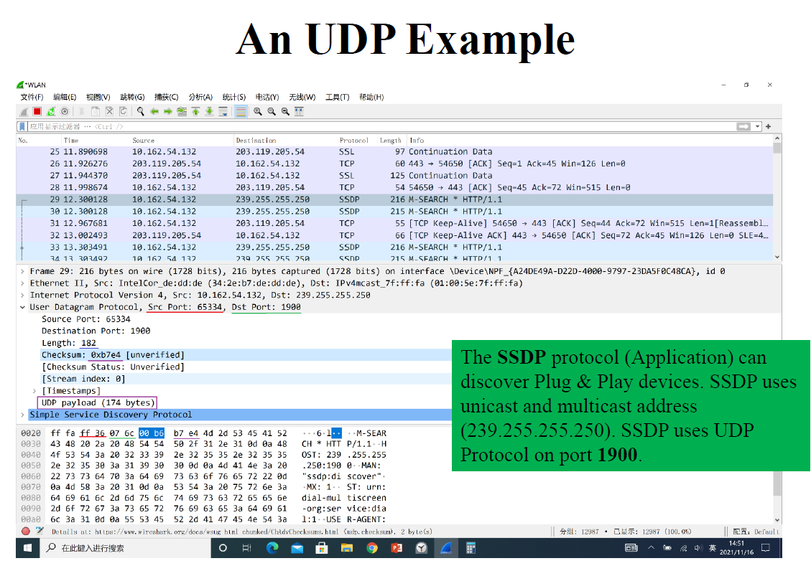{ width="600" }
</figure>

<figure markdown="span">
    { width="600" }
</figure>

UDP 不提供的功能：无流量控制，无拥塞控制，无错误重传

UDP 提供的功能：

1. 进程级的寻址（多路复用/分解）：这是 UDP 对 IP 层的核心增强。IP 协议只能将数据送到主机，而 UDP 通过源端口和目的端口，能将数据准确交付给主机上运行的特定应用程序进程
2. 可选的完整性验证：通过可选的校验和机制，UDP 为应用程序提供了一个基础的错误检测工具。应用程序可以选择启用或禁用它，以在可靠性和效率之间权衡

UDP 的典型应用：

1. DNS：DNS 查询通常是短小的请求-响应模式，要求快速且一次查询失败可以立即重试。UDP 的简单和低开销非常适合这种场景
2. SSDP（服务发现）：用于在局域网中自动发现设备。它基于类似 HTTP 的简单消息交换（NOTIFY 用于宣告，M-SEARCH 用于搜索），使用 UDP 广播/多播来实现高效的发现机制，无需建立连接

### 2.2 RTP

RTP 定义于 RFC 3550，虽然名义上是一种传输协议，用于在 IP 网络上传输实时数据，但它并不属于传统的传输层。它通常实现在应用层，作为应用程序的一部分运行

<figure markdown="span">
    { width="600" }
</figure>

RTP 专门为实时多媒体流（如 VoIP、视频会议、流媒体）设计。这些应用对时序和连续性的要求远高于对绝对可靠性的要求

RTP 可以将来自不同源的数据多路复用到一个 UDP 流中，这个 UDP 流支持单播与多播

每个 RTP 包都有递增的序号。其主要目的不是用于重传（因为 RTP 没有确认和重传机制），而是为了让接收端检测丢包和乱序。面对丢包，RTP 将恢复策略交给上层应用决定。对于视频，可能直接跳过丢失的帧或使用前一帧替代；对于音频，可能通过插值算法生成近似数据来填补空白

RTP 本身不规定具体的音频/视频编码格式，它只是提供一个容器。payload type 字段用于标识编码方案，使接收端能正确解码。一个 RTP 包可以包含多个压缩后的媒体样本，以提高传输效率，减少头部开销

timestamp（时间戳）是 RTP 的核心。它记录了媒体样本的采集或播放时刻（以时钟频率为单位）。接收方利用这个时间戳：

1. 消除抖动：通过设置一个播放缓冲区（Jitter Buffer），将提前到达的数据暂存，等待其正确的播放时刻，从而平滑网络延迟的波动
2. 实现流内同步：确保音频或视频样本按照原始录制的时间间隔连续播放
3. 实现流间同步：例如，使用相关联的时间戳来对齐音频流和视频流，实现口型同步

!!! tip "Jitter Buffer"

    在实时流传输中，网络数据包的到达时间是不稳定的。有的包快，有的包慢，这种到达时间的变化称为 jitter（抖动）。如果收到包就立即播放，会导致声音/视频断断续续、速度不均，体验极差

    playback point 是指接收方在收到第一个数据包后，故意等待一段时间再开始播放。这段等待时间形成的缓冲区称为 jitter buffer。在等待期间，后续的数据包陆续到达并存入缓冲区。播放开始后，播放器按照 RTP 时间戳指示的原始录制时序，从缓冲区中匀速取出数据包进行播放

    <figure markdown="span">
        { width="600" }
    </figure>

<figure markdown="span">
    { width="600" }
</figure>

1. Version：目前广泛使用的 RTP 版本是 2
2. P bit：填充位。若 Payload 长度不是 4 字节的整数倍，会用零字节填充至对齐。此位用于告知接收方存在填充，且填充的最后一个字节会指明填充的字节数，以便接收方正确移除填充
3. X bit：扩展位。用于指示在标准 RTP 头部之后是否还有一个扩展头部，以承载自定义的、特定应用的信息
4. CC：CSRC 计数。指明贡献源标识符（CSRC）列表中有多少个条目（0-15 个）。当存在混音器时，此列表用于记录原始流的来源
5. M bit：标记位。应用层自定义的标记。例如在视频流中，可用于标记关键帧的开始；在音频流中，可用于标记一段语音的开始
6. Payload Type：用于标识 RTP 数据包中媒体数据的编码格式。接收方根据此字段选择正确的解码器
7. Sequence Number：每个 RTP 包发送时递增 1（初始值随机）。主要目的是检测丢包和乱序，使接收方能重建原始顺序并统计丢包率
8. timestamp：表示该数据包中第一个媒体样本的采样时刻，单位为与媒体时钟频率相关的刻度数。用于接收方的播放时序控制（消除抖动）和多流同步
9. SSRC：同步源标识符。一个 32 位的唯一标识符（通常随机生成），用于在同一个 RTP 会话中唯一标识一个媒体流源（如同一视频会议中不同的发言者）。接收方据此区分来自不同发送者的流
10. CSRC：贡献源标识符。当存在混音器或转换器时，SSRC 标识的是混合后的流，而 CSRC 列表则记录了参与混合的原始流的 SSRC 标识符。这使接收方能知道混合流的原始贡献者（例如会议中混合了哪几个人的语音）

#### 2.2.1 RTCP

RTCP 被描述为 RTP 的小姊妹协议，意味着它与 RTP 紧密关联、协同工作，通常作为同一个协议族的一部分

RTP 负责传输实际的媒体数据，而 RTCP 负责传输控制信息，二者在逻辑上互补，在实际部署中通常共用同一个网络会话

RTCP 用于处理反馈、同步和用户界面，它本身不传输任何媒体样本

### 2.3 TCP

TCP 的核心承诺是提供可靠的数据传输。它通过确认（ACK）、重传、校验和、序列号等机制，确保数据能按顺序、无差错、无丢失、无重复地到达接收方

TCP 对应用程序呈现的是一个连续的、无结构的字节流接口，而非独立的消息或数据包。发送方写入的字节流与接收方读出的字节流完全相同。TCP 负责将字节流分段为合适的数据包（段）进行传输，并在接收方重组

> 发送方执行：`write("Hello"); write("World");`，接收方可能通过一次 `read` 读到 `HelloWorld`，也可能通过两次 `read` 分别读到 `Hel` 和 `loWorld`。它无法直接感知这些字节最初是由发送方的几次写入操作产生的。消息的解析责任完全交给了应用程序层

<figure markdown="span">
    { width="600" }
</figure>

TCP 通信的本质是两个应用程序之间的对话。为了实现这一点，TCP 在两端各创建一个抽象的通信端点，称为 socket（套接字）。应用程序通过网络编程接口操作套接字来发送和接收数据

一个套接字由两部分唯一标识：

1. IP 地址：标识网络中的主机
2. 端口号：一个 16 位的数字（范围 0-65535），用于标识主机上运行的特定应用程序或进程

一个 TCP 连接由通信双方的一对套接字唯一确定

TCP 连接特性：

1. 全双工：连接一旦建立，数据可以同时在两个方向上独立传输。每个方向都有自己的序列号和确认机制，互不干扰
2. 点对点：每个 TCP 连接只能有两个端点

PUSH 标志：催促 TCP 立即发送已缓冲的数据，而不是等待缓冲区填满或定时器超时。默认情况下，TCP 为了实现高效传输，会采用 Nagle 算法等策略，将多个小的应用层写入合并成一个较大的 TCP 段再发送，以减少网络上的小包数量。当应用程序设置了 PUSH 标志时，TCP 会立即发送当前已缓冲的所有数据（包括本次写入的数据），即使缓冲区还未满

URGENT 标志：在正常的数据流中标记并优先传递一段 OOB（out-of-band，带外）数据，用于通知对端某个紧急事件（如中断信号）。发送端应用程序指定 URGENT 标志，TCP 会设置该数据段的 URG 标志位，并利用紧急指针字段来指向数据流中紧急数据的最后一个字节。接收端收到带 URG 标志的段时，接收方 TCP 会立即通知应用程序，应用程序可以优先读取这段紧急数据

TCP 协议只明确标记了紧急数据的结束位置（通过紧急指针），但没有标记开始位置。应用程序需要根据自己定义的协议来推断紧急数据的起始点（通常紧邻之前接收到的最后一个非紧急字节之后）。而且，紧急数据的传输本身并不比普通数据拥有更高的网络优先级，它只是接收方处理上的优先通知

<figure markdown="span">
    { width="600" }
</figure>

#### 2.3.1 TCP Segment Header

TCP 将从应用层接收到的字节流切分成适合传输的块，这些块被称为 segment。段是 TCP 协议进行数据交换、确认和重传的基本单位

段的组成：

1. 固定头部（20 字节）
2. 可选部分：头部之后可以有长度可变的选项字段
3. 数据部分：承载来自应用层的实际字节流数据。数据长度可以为 0

TCP 段需要被封装在 IP 数据报 中进行传输。IP 数据报的总长度（头部 + 数据）由 16 位字段表示，最大为 65535 字节。标准的 IP 头部长度为 20 字节。因此，留给 TCP 段（头部 + 数据）的最大空间为：65535 - 20 = 65515 字节

网络中的每一段物理链路都有其最大传输单元 MTU，MTU 定义了该链路上可以传输的单个数据帧的最大尺寸。TCP 段（加上 IP 头部）必须能够适配整条路径中 MTU 最小的那个链路，否则数据包需要在路由器处被分片。因此，TCP 在建立连接时，会通过 MSS 协商，确保自己发送的段大小不超过路径 MTU - IP 头部 - TCP 头部，从而避免在 IP 层被分片

<figure markdown="span">
    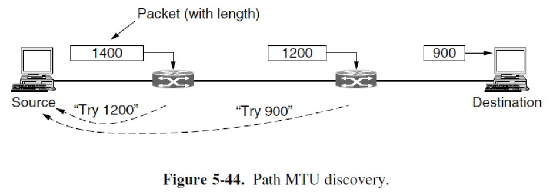{ width="600" }
</figure>

TCP 为连接上传输的每一个字节（而非每一个数据段）分配一个唯一的 32 位序列号。这为实现可靠传输和有序重组奠定了基础。发送方和接收方通过跟踪这些序列号，可以精确知道哪些字节已发送、已确认、已接收

<figure markdown="span">
    { width="600" }
</figure>

!!! tip "Source Port and Destination Port"

    源端口：标识发送数据的应用程序。目的端口：标识接收数据的应用程序

    连接的唯一标识：五元组：(传输层协议，源 IP 地址，源端口，目的 IP 地址，目的端口)

!!! tip "Sequence Number and Acknowledgement Number"

    序列号：代表了该 TCP 段中第一个数据字节在整个字节流中的序号。它使得 TCP 能够跟踪每一个已发送的字节

    确认号：表示接收方期望从发送方收到的下一个字节的序列号。这隐含地确认了所有小于该确认号的字节都已被正确、按序接收（累计确认）

!!! tip "TCP Header Length"

    指示整个 TCP 头部的长度，从而定位数据部分的开始位置。该字段的单位是 32 位，即 4 字节

    - 最小值为 5：因为标准的、没有选项的 TCP 头部是 20 字节
    - 最大值为 15：4 位字段能表示的最大十进制数是 15

!!! tip "Reserved"

    TCP Header Length 字段后面的 4 位被标记为保留位，必须设置为 0，为未来的协议扩展预留空间

!!! tip "8 个 1 bit 位"

    CWR 和 ECE 实现了 ECN（显式拥塞通知）机制，旨在避免通过数据包丢失来隐式地推断网络拥塞
    
    > 传统 TCP 依赖丢包作为拥塞信号。ECN 允许网络设备（如路由器）在发生拥塞时，在 IP 头部的 ECN 字段中标记数据包，而不是直接丢弃它

    CWR：

    1. 方向：由发送方在发给接收方的 TCP 段中设置
    2. 触发条件：当发送方收到 ECE 信号并采取了行动（如减小了拥塞窗口）后
    3. 作用：告知接收方：“我已收到你的 ECN-Echo 并已减速，你可以停止发送 ECE 信号了。” 这防止了接收方在拥塞缓解后持续发送不必要的 ECE 信号

    ECE：

    1. 方向：由接收方在发给发送方的 TCP 段中设置
    2. 触发条件：当接收方收到一个被网络标记为拥塞的 IP 数据包时
    3. 作用：告知发送方：“网络正在拥塞，请降低发送速率。”

    URG：当发送方应用程序有需要带外紧急处理的数据时，它可以将这段数据放入正常的字节流中，并设置 URG = 1，同时在紧急指针字段中指定一个值

    ACK：指示该 TCP 段是否包含有效的确认信息。当 ACK = 1 时，确认号字段有效，该段是对已接收数据的确认。当 ACK = 0 时，确认号字段应被忽略，该段不用于确认数据。

    PSH：PUSH 标志

    RST：用于立即、非正常地终止一个 TCP 连接。当一方检测到连接处于非法或不一致状态时，会发送 RST = 1 的段来重置连接

    SYN：这是 TCP 三次握手的核心标志，专门用于建立新的连接

    FIN：用于正常、有序地终止一个 TCP 连接（即四次挥手过程）

!!! tip "Window Size"

    用于防止发送方的发送速率超过接收方的处理能力，从而避免接收方缓冲区溢出和数据丢失

    窗口大小表示接收方当前愿意且能够接收的字节数量。它是一个信用机制。窗口的起始位置是确认号字段所指示的下一个期望字节

    > 假设接收方发送的段中 `Acknowledgement number = 5001`，`Window size = 3000`。这表示：我已正确收到字节 1-5000，现在允许你从字节 5001 开始，最多再发送 3000 个字节

    `Window size = 0` 是合法的。意思是接收方缓冲区已满，应用程序暂时无法消费数据。它确认了之前的所有数据，但明确要求发送方暂停发送。发送方进入零窗口探测状态，定期发送小探测包，询问窗口是否已重新打开

!!! tip "Checksum"

    与 UDP 类似，TCP 校验和的计算并不仅限于 TCP 段本身，它还包含一个来自 IP 层的伪头部。伪头部中 protocol 字段值为 6。计算方式与 UDP 想用

!!! tip "Urgent Pointer"

    紧急指针是一个 16 位的偏移量，其值是相对于本 TCP 段的序列号的一个正偏移。它指向的是紧急数据最后一个字节在整个字节流序列空间中的位置，而不是在 TCP 段内部的偏移

    > 设某个 TCP 段的 `Sequence number = 1000`，`Urgent pointer = 10`。这意味着：紧急数据的结束点在序列号 1000 + 10 = 1010 处。应用程序需要从这个字节流中找出序列号 1010 的位置，其之前（且紧邻该段的序列号之后）的部分被视为紧急数据

    只标记结束点，不标记起点

!!! tip "Options"

    长度可变，但必须通过填充（通常用零）使整个 TCP 头部长度是 32 位（4 字节）的整数倍。TCP 头部总长最大为 60 字节，因此选项部分最大长度为 60 - 20 = 40 字节

    常见选项：

    1. MSS：在三次握手的 SYN 段中交换，用于告知对方本方期望接收的 TCP 数据部分（不含头部）的最大字节数。通过协商一个合适的 MSS，确保 TCP 段加上 IP 头部后不超过路径 MTU，从而避免在 IP 层被分片。如果未指定，默认使用 536 字节。所有主机必须能处理 556 字节（536 + 20）的 TCP 段
    2. Window Scale：TCP 头部的窗口大小字段只有 16 位，最大只能表示 65535 字节（64 KB） 的窗口。窗口缩放选项在握手时协商一个缩放因子，实际的接收窗口大小为：$\text{Window Size} \times 2^{\text{缩放因子}}$。使得 TCP 能够支持高达约 1 GB 的窗口，充分利用现代高速网络的容量
    3. timestamp：发送方在每个数据段中放入一个单调递增的时间戳值；接收方在对应的确认段中原样回显这个时间戳。能够精确计算 RTT（往返时间），防止序列号回绕（PAWS）
    4. SACK：选择性确认。标准 TCP 使用累积确认。当发生多个不连续的数据块丢失时，接收方只能重复确认最后一个连续收到的字节。这导致发送方无法知道哪些非连续的数据块已成功到达，可能引发不必要的重传。SACK 选项允许接收方在 ACK 段中明确告知发送方哪些非连续的数据块已经收到。SACK 选项中包含一个或多个 `(左边界, 右边界)` 对，表示已收到的非连续数据块的序列号范围

#### 2.3.2 TCP Connection Establish and Release

<figure markdown="span">
    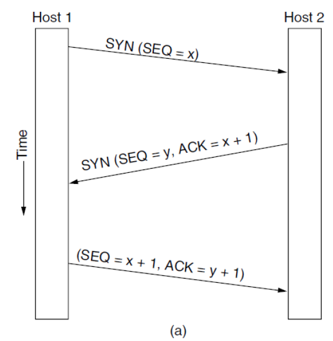{ width="600" }
</figure>

!!! tip "Step 1：客户端发送 SYN 段"

    这是连接建立的发起信号，旨在与服务器同步序列号并交换初始参数。SYN 段通常不携带任何应用层数据（有效载荷为空）。其全部信息都编码在 TCP 头部中。发送后，客户端进入 SYN-SENT 状态，等待服务器的响应

    > 虽然标准的三次握手 SYN 段通常没有数据，但在某些 TCP 扩展或优化中，允许在 SYN 段中携带少量应用数据，以加速连接建立后的数据传输

    SYN 段头部中的关键信息：

    1. 初始序列号：由客户端随机生成（实际上基于一个随时间缓慢变化的算法），而非从 0 或固定值开始
    2. SYN 标志位设为 1
    3. 最大段大小：位于 TCP 头部的选项字段中，作为 MSS 选项发送。客户端通过此值告知服务器：“在发送给我的数据段中，其数据部分请不要超过这个字节数”。帮助双方协商出一个合适的段大小，以避免路径 MTU 引起的 IP 分片，并优化传输效率
    4. 接收窗口大小

!!! tip "Step 2：服务器发送 SYN-ACK 段"

    服务器确认收到了客户端的 SYN 请求，同时发起自己方向的连接同步，并向客户端传递自己的连接参数。发送后，服务器进入 SYN-RECEIVED 状态，等待客户端的最终确认

    SYN-ACK 段头部中的关键信息：

    1. 服务器初始序列号：由服务器随机生成
    2. SYN 标志位设为 1
    3. 服务器的最大段大小：连接的最终 MSS 通常是双方通告值中的较小者，以确保双向传输都避免分片
    4. 服务器的接收窗口大小
    5. 确认号：确认号 = 客户端初始序列号 + 1
    6. ACK 标志位设为 1

!!! tip "Step 3：客户端发送 ACK 段"

    客户端最终确认服务器的 SYN-ACK，完成连接的建立。发送后，客户端进入 ESTABLISHED 状态，认为连接已建立，可以开始发送数据。当服务器收到此 ACK 后，也从 SYN-RECEIVED 状态进入 ESTABLISHED 状态

    客户端 SYN = 0，ACK = 1

SYN 段消耗序列号：尽管 SYN 段不携带任何应用层数据，但 TCP 协议规定 SYN 标志以及 FIN 标志会占用一个序列号。这是为了确保 SYN 段能够被可靠地确认和重传。由于它消耗了一个序列号，接收方就可以在其 ACK 段中使用确认号 = ISN + 1 来明确无误地确认这个 SYN 段

初始序列号应缓慢循环：TCP 要求每个主机为其连接选择的初始序列号（ISN）不能是简单的、可预测的数字（如每次从 0 开始），而应该是一个随时间缓慢、随机递增的数值

SYN = 0，ACK = 0 是不可能的组合

<figure markdown="span">
    { width="600" }
</figure>

<figure markdown="span">
    { width="600" }
</figure>

!!! tip "SYN Flood"

    服务器收到一个 SYN 请求后，会分配内存等资源来保存这个半开连接的状态，发送 SYN-ACK。等待客户端的 ACK

    问题所在：服务器在发送 SYN-ACK 后，在收到 ACK 前，必须为这个潜在的连接保留资源。如果客户端是恶意的，发送大量 SYN 请求后立刻消失（或不发送 ACK），服务器将为大量虚假的半开连接消耗资源（内存、CPU 等），最终导致资源耗尽，无法为合法用户服务。这就是 SYN Flood 攻击

    SYN Cookie 是一种无状态的防御技术，其核心思想是：在握手完成前，服务器不分配任何资源来记住这个连接

    当服务器收到 SYN 请求时，它不分配内存。它根据一个公式计算出一个特殊的 ISN（$ISN = C(t) + hash(本地地址，本地端口，远程地址，远程端口，密钥)$，$C(t)$ 是一个随时间缓慢递增的计数器，hash 中的密钥只有服务器知道），作为 SYN-ACK 的序列号发送出去。发送完 SYN-ACK 后，服务器立即忘记这个请求，不保留任何状态

    如果客户端是合法的，它会回复 ACK，其中的确认号 = 服务器发出的 ISN + 1。服务器收到 ACK 后，取出确认号减 1，得到客户端返回的 ISN。服务器用收到的连接四元组（客户端 IP、端口，服务器 IP、端口）和本地密钥，重新计算一遍哈希值，并与 ISN 中的哈希部分进行比较。如果匹配，说明这是一个对之前 SYN 请求的合法确认，且该请求不是伪造的。此时，服务器才正式分配资源，建立连接状态。如果不匹配，说明这是一个无效的或伪造的 ACK，服务器直接忽略

!!! tip "two army problem"

    两军问题是一个思想实验，用于证明在不可靠的通信信道上，不可能实现 100% 可靠的共识达成

    A 发送 FIN ≈ 一方发起关闭。B 发送 ACK ≈ 另一方确认收到 FIN。但发送 ACK 的一方（B）如何知道自己的 ACK 被对方（A）收到了？这需要 A 再发送一个确认的确认。而这个确认的确认又可能丢失。如此循环，理论上永远无法确保双方都 100% 确信对方知道连接已关闭

    TCP 没有试图解决这个理论上的无解问题，它采用了一种务实的、带超时和状态清理的近似方案，即四次挥手

<figure markdown="span">
    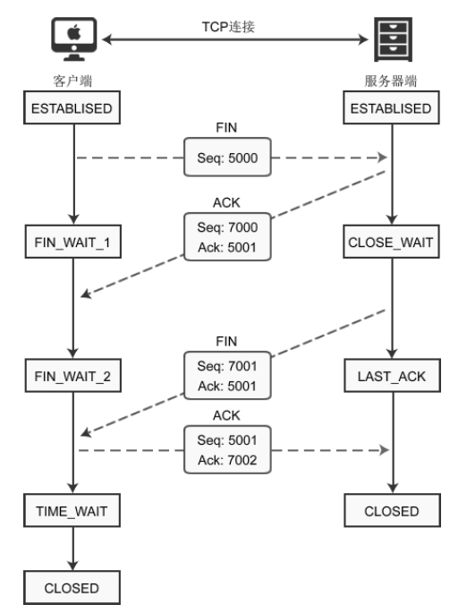{ width="600" }
</figure>

!!! tip "Step 1：客户端发起关闭"

    客户端的 TCP 协议栈构造一个 TCP 段，其中 FIN 标志位设置为 1。该段的序列号是客户端字节流中的下一个序号。客户端发送这个 FIN 段。发送 FIN 后，客户端从 ESTABLISHED 状态进入 FIN_WAIT_1 状态。在此状态下，客户端：不能发送任何新的应用数据，可以接收来自服务器的数据，等待服务器的 ACK 来确认这个 FIN 段

!!! tip "Step 2：服务器确认关闭"

    服务器收到客户端的 FIN 段。服务器释放接收缓冲区，发送一个 ACK 段作为响应。该 ACK 段的确认号为客户端 FIN 序列号 + 1。发送 ACK 后，服务器从 ESTABLISHED 状态进入 CLOSE_WAIT 状态。在此状态下，服务器：知道客户端已关闭发送通道。自己的发送通道仍然开放，可以继续向客户端发送残留数据。等待其上层的应用程序调用 `close()` 来关闭自己这端的发送通道

!!! tip "Step 3：客户端进入 FIN_WAIT_2 状态"

    客户端收到服务器对自身 FIN 的 ACK（步骤 2 的 ACK）。客户端从 FIN_WAIT_1 状态进入 FIN_WAIT_2 状态

    - 客户端 → 服务器方向（已关闭）：数据发送停止。客户端已发送 FIN，宣告发送完毕，且服务器已确认。客户端不应再发送任何应用数据。纯 ACK 发送：可以。客户端仍可以发送不携带数据的纯 ACK 段（例如，确认从服务器接收的数据）。这是一种控制信息，不属于应用数据流
    - 服务器 → 客户端方向（仍开放）

!!! tip "Step 4：服务器发起关闭"

    服务器应用程序完成数据发送，并调用 `close()` 系统调用.服务器的 TCP 协议栈构造一个 TCP 段，其中 FIN 标志位设置为 1。该段的序列号基于服务器自己的字节流。服务器发送这个 FIN 段给客户端。发送 FIN 后，服务器从 CLOSE_WAIT 状态进入 LAST_ACK 状态。在此状态下，服务器：已经关闭了自己的发送通道，等待客户端的最终 ACK 来确认这个 FIN，不能发送任何新的应用数据或控制信息（除了可能的重传 FIN）

!!! tip "Step 5：客户端确认服务器的 FIN"

    客户端（处于 FIN_WAIT_2 状态）收到来自服务器的 FIN 段（步骤 4）。客户端释放接收缓冲区，发送一个 ACK 段作为响应。该 ACK 段的确认号为服务器 FIN 序列号 + 1。发送 ACK 后，客户端从 FIN_WAIT_2 状态进入 TIME_WAIT 状态

使用定时器规避两军问题。假设步骤 4 的 ACK 丢失了。被动关闭方（在 LAST_ACK 状态）将永远收不到对其 FIN 的确认。被动关闭方在发送 FIN（步骤 3）后会启动一个重传定时器。如果超时前未收到 ACK，它会重传 FIN。主动关闭方在发送最后一个 ACK（步骤 4）后，会进入 TIME_WAIT 状态，并等待 2MSL（两个最大报文段生存期）的时间。主动方在 TIME_WAIT 状态等待 2MSL 后，单方面关闭连接，释放所有资源。被动方如果在重传 FIN 若干次后仍未收到 ACK，其重传定时器最终会超时。此时，它推断主动方已经离开，于是也单方面关闭连接，释放资源

> MSL 是任何 IP 数据报在网络中被允许存在的最长时间。2MSL 确保了：如果最后一个 ACK 丢失，被动方重传的 FIN 有足够时间到达（一个 MSL），主动方重传的 ACK 有足够时间到达被动方（另一个 MSL）

<figure markdown="span">
    { width="600" }
</figure>

<figure markdown="span">
    { width="600" }
</figure>

<figure markdown="span">
    { width="600" }
</figure>

<figure markdown="span">
    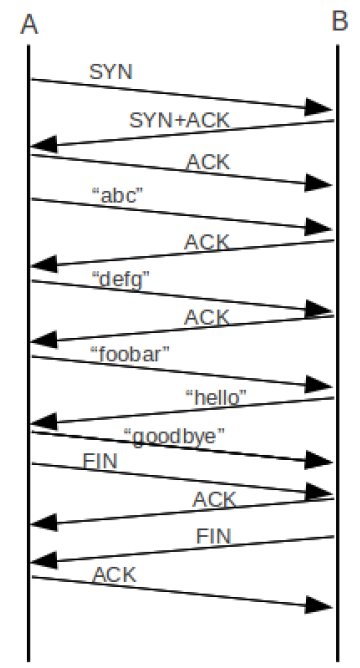{ width="600" }
</figure>

<figure markdown="span">
    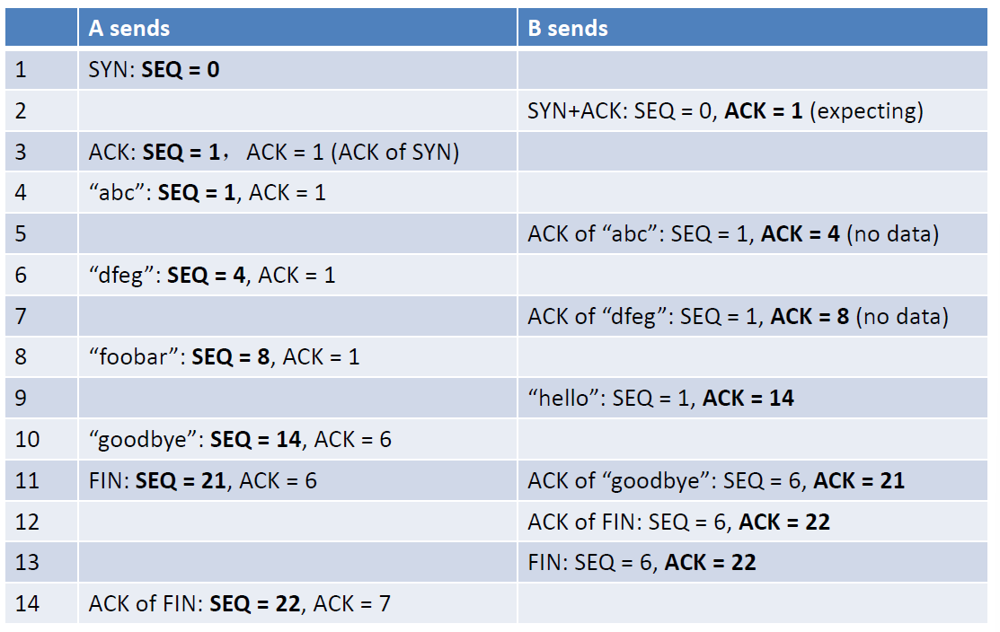{ width="600" }
</figure>

<figure markdown="span">
    { width="600" }
</figure>

#### 2.3.3 TCP Sliding Window

滑动窗口：允许发送方在未收到确认的情况下连续发送多个数据段，接收方通过通告窗口大小来告知自身缓冲区剩余空间，从而控制发送速率

窗口大小以字节为单位进行度量

当接收方缓冲区满（窗口大小为 0），发送方通常暂停发送。例外包括：

1. 发送紧急数据，如用户中断指令
2. 发送 1 字节窗口探测包（window probe），触发接收方更新窗口信息，避免因更新包丢失导致通信停滞

Delayed Acknowledgements（延迟确认）：接收端不会立即对每个收到的数据包发送确认，而是延迟最多 500 毫秒，希望在此期间有数据需要发送，从而将确认信息捎带在数据包中，减少单独确认包的数量

Nagle 算法：发送端将多个小数据块合并成一个较大的 TCP 段再发送，以减少网络中的小包数量，提高带宽利用率。发送第一个小数据块后，缓存后续数据，直到收到第一个数据块的确认，再将所有缓存数据一次性发送

> Nagle 算法不适用于交互式游戏，Nagle 算法有时可能与延迟确认机制相互作用，导致暂时的死锁

Silly Window Syndrome（SWS，糊涂窗口综合征）：当发送方有大数据块要发送，但接收方应用程序每次只从 TCP 缓冲区读取很少的数据（如 1 字节）时，接收方的可用窗口会变得非常小。发送方会收到一个很小的窗口通告，并因此发送很小的 TCP 段，导致网络被大量的小数据包充斥，效率低下

<figure markdown="span">
    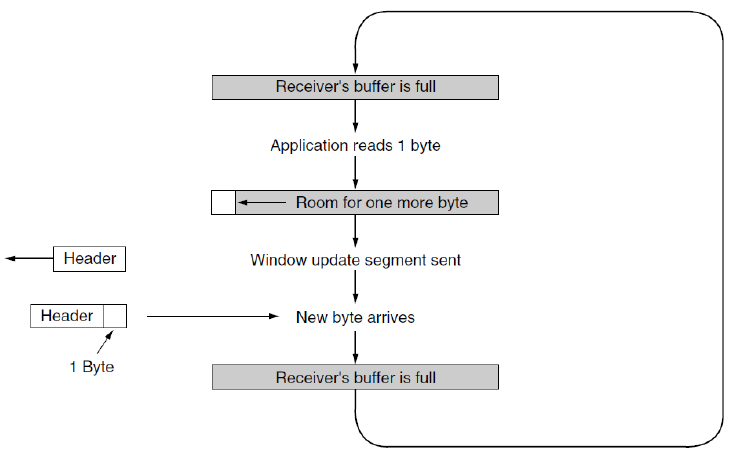{ width="600" }
</figure>

Clark's solution 的核心思想是避免通告过小的窗口。接收方不会立即通告一个很小的窗口，而是等待其缓冲区有足够大的空间（例如至少达到 MSS 大小或缓冲区的一半）时才通告新窗口。这样，发送方每次都能发送一个合理大小的段，提高了网络利用率

在应对糊涂窗口综合征时，Nagle 算法和 Clark 解决方案是互补的。发送端的应用程序一次只向 TCP 提交一个字节的数据，导致 TCP 发送大量小段。Nagle 算法通过缓冲小数据合并发送来解决；接收端的应用程序一次只从 TCP 缓冲区读取一个字节，导致接收窗口极小，诱使发送方发送小段。Clark 解决方案通过延迟通告小窗口来解决。两种方法分别从发送方和接收方两端入手，共同防止网络中充斥小 TCP 段。最终目标是避免发送小数据段，也避免请求小数据段，从而提升 TCP 传输效率和网络带宽利用率

#### 2.3.4 TCP Timer Management

TCP 使用多个定时器来完成其工作

1. Retransmission TimeOut（RTO，重传定时器）：用于控制数据包发送后的等待确认时间，超时则触发重传
2. Persistence timer（持续定时器）：用于防止因零窗口通告导致的死锁。当接收方通告窗口为 0 时，发送方启动该定时器，定期探测窗口是否已恢复
3. Keepalive timer（保活定时器）：用于检测空闲连接是否仍有效。若长时间无数据交换，TCP 可发送保活探测报文，以判断对方是否仍存活
4. TIME_WAIT 状态定时器：在连接关闭后，TCP 会在 TIME_WAIT 状态等待 2MSL，以确保网络中所有旧数据段都消失，避免新旧连接数据混淆

##### 2.3.4.1 RTO

RTO 应该设置为多长？与数据链路层相比，传输层的网络环境更为复杂：延迟差异大，动态性高

> 数据链路层的优势：通常在同一局域网内，传输延迟短且稳定（微秒级），可预测性强，因此 RTO 设定相对简单

<figure markdown="span">
    { width="600" }
</figure>

TCP 确认返回时间的分布（概率密度函数）具有高方差和时变性，与稳定、可预测的数据链路层环境形成鲜明对比

- 如果 RTO 设置过短：可能因正常延迟波动而误判丢包，触发不必要的重传，浪费带宽并加剧网络拥塞
- 如果 RTO 设置过长：在真正丢包时等待过久才重传，导致应用响应延迟增加，吞吐量下降

网络状况（如拥塞程度）可能在几秒内迅速变化，导致确认延迟的均值和方差也快速变化。因此，静态的 RTO 值无法适应实际网络，必须动态调整

Smoothed Round-Trip Time（平滑往返时间）：$SRTT = \alpha SRTT + (1-\alpha) R$ ($\alpha = \dfrac{7}{8}$)。表示历史 SRTT 占主导（87.5%），当前测量值 R 占较小权重（12.5%），使得 SRTT 对短期波动不敏感，更具稳定性

Round-Trip Time Variation（往返时间方差）：$RTTVAR = \beta RTTVAR + (1-\beta) |SRTT - R|$ ($\beta = \dfrac{3}{4}$)。衡量 RTT 的波动程度，通过绝对值偏差来估计。公式中同样赋予历史方差较高权重

$RTO = SRTT + 4 \times RTTVAR$：超时值不仅取决于平均延迟，还考虑其波动范围。最后限制 RTO 最小值通常不低于 1 秒（或系统定义的最小值），避免过于激进的重传。$RTO = \min(1 s, RTO)$

当一个 TCP 段超时并被重传后，如果随后收到确认（ACK），无法确定该 ACK 是对原始传输还是重传的响应。若错误地将该 ACK 的 RTT 样本用于更新 SRTT 和 RTTVAR，可能导致 RTO 估计不准确

Karn's Algorithms：避免更新重传段的 RTT 估计，只对未重传（首次成功传输）的段收集 RTT 样本并用于更新 SRTT 和 RTTVAR。退避重传超时，每次重传时，将 RTO 按指数退避方式加倍（例如：RTO = 2 × RTO），直到段成功传输。这有助于在网络持续拥塞时避免加重负担，并为恢复提供更多时间

##### 2.3.4.2 Persistence Timer

持续定时器主要用于解决因零窗口通告（Zero Window Advertisement）及更新丢失导致的通信死锁问题：接收方因缓冲区满而通告窗口大小为 0，发送方因此暂停发送。接收方在缓冲区可用后发送窗口更新，但该更新包在网络中丢失。发送方仍在等待窗口更新，接收方则在等待新数据，双方陷入相互等待

持续定时器的作用机制：发送方在收到零窗口通告后启动持续定时器。定时器超时后，发送方发送一个零窗口探测，该探测通常只包含 1 字节数据或不含数据，仅用于触发接收方响应。接收方回应探测时会携带当前窗口大小：若窗口仍为 0，则重置定时器，继续周期性探测；若窗口已打开，则发送方可恢复正常数据传输

##### 2.3.4.3 Keepalive Timer

保活定时器用于检测长时间无数据交换的 TCP 连接是否仍处于有效状态

当连接空闲时间超过设定的保活时间后，保活定时器超时。此时，发送方会向对方发送一个保活探测报文（Keepalive Probe）。若收到响应，则认为连接依然活跃，重置定时器继续监控。若多次探测无响应，则认为连接已失效，可主动关闭连接以释放资源

##### 2.3.4.4 TIME_WAIT 状态定时器

在 TCP 连接正常关闭（四次挥手）过程中，主动关闭连接的一端会进入 TIME_WAIT 状态。定时器时长设置为 2MSL，其中 MSL 是 TCP 报文在网络中允许存在的最大生存时间

#### 2.3.5 TCP Congestion Control

拥塞首先在路由器或交换机等网络设备中被感知，通常表现为队列长度增加、延迟升高或丢包。网络层的主要应对手段往往是被动式的，即通过丢包来减轻负载，并向发送方提供隐式反馈（如丢包事件）

传输层（主要指 TCP）负责解释丢包等拥塞信号，并主动调整发送速率，以缓解网络拥塞。TCP 不仅提供可靠性（通过重传），还通过拥塞控制算法动态适应网络状况

在互联网中，TCP 既是实现端到端可靠传输的主要协议，也是实施拥塞控制、维护网络稳定的关键机制

Additive Increase Multiplicative Decrease（AIMD）原则：AI 是指在未检测到拥塞时，拥塞窗口每经过一个 RTT 就线性增加（通常每次增加 1 个 MSS），逐步探测可用带宽；MD 是指一旦检测到拥塞（如丢包），拥塞窗口就立即减半（或按一定比例减小），快速降低发送速率以缓解拥塞

TCP 拥塞控制基于 AIMD，将分组丢失视为网络拥塞的主要信号。丢包通常被解释为路由器缓存溢出，即网络已拥塞

TCP 维护着一个 congestion window（拥塞窗口，发送窗口）和一个 flow control window（流量控制窗口，接收窗口）

1. 拥塞窗口（cwnd）：由发送方根据网络拥塞状况自行调节，目的是防止发送过多数据导致网络拥塞
2. 接收窗口（rwnd）：由接收方根据自身缓冲区可用空间决定，通过 TCP 首部中的 Window 字段通告给发送方，目的是防止发送方发送过快导致接收方溢出

实际发送窗口大小取两者中的较小值。只要其中任何一个窗口达到上限，发送方就必须暂停发送。

发送速率 ≈ 拥塞窗口大小 / 往返时间（RTT），因此调整窗口大小直接控制了发送速率

TCP 假设丢包的主要原因是网络拥塞，而非传输错误。因此，一旦检测到丢包，TCP 会触发拥塞控制。在有线网络中，链路误码率极低，丢包大多确实由拥塞引起。在无线链路中，由于信号衰减、干扰、移动性等因素，链路层误码导致的丢包很常见。此时，TCP 可能误将无线误码丢包解释为网络拥塞，从而不必要地降低发送速率，导致性能下降。无线链路层通常已有重传机制来应对误码，但 TCP 无法区分丢包是拥塞还是误码引起

发送方需要合理控制发送数据的节奏，避免突发流量冲击网络。Ack Clock（确认时钟）机制通过接收到的确认报文（ACK）来估计往返时间（RTT），并利用 ACK 的到达来触发新数据的发送，从而实现平滑、自适应的发送速率控制，避免空闲等待或过度突发

拥塞窗口的大小直接影响发送到网络中的数据量。初始时或重传后，TCP 使用 Slow Start（慢启动）机制来逐步探索可用带宽：从较小的窗口开始，每经过一个往返时间 RTT，拥塞窗口指数增长（通常每 RTT 翻倍），快速接近可用带宽。一旦检测到拥塞（如丢包），则切换到 Congestion Avoidance（拥塞避免）阶段，转为线性增长（AIMD 中的加性增）。慢启动帮助 TCP 快速达到高效传输状态，同时避免初期过度发送引发拥塞

Ack Clock 的基本原理：数据包在端到端路径中会经过多个链路，其中瓶颈链路（最慢链路）决定了整体吞吐能力。ACK 报文返回的间隔时间反映了数据包经过瓶颈链路后到达接收方的时间间隔，因此 ACK 的到达速率自然反映了瓶颈链路的可用带宽

发送方根据 ACK 的到达来触发新数据的发送，从而使发送速率自动匹配瓶颈链路的处理能力。避免了突发性发送导致的瞬时拥塞，减少了路由器中不必要的排队延迟和丢包。让发送速率跟随 ACK 时钟，TCP 能够更平稳地向网络注入数据，减少队列堆积，从而降低延迟、提高吞吐量并增强公平性

<figure markdown="span">
    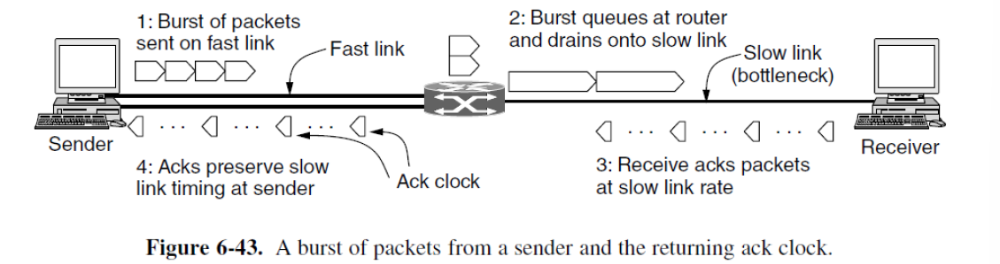{ width="600" }
</figure>

##### 2.3.5.1 Slow Start

理想 cwnd 取决于当前路径的带宽与时延，由于不同网络环境的带宽和 RTT 差异极大，理想 cwnd 变化范围广，难以静态设定。若采用固定大小的发送窗口，无法适应不同网络条件，可能因设置过大而导致瞬时拥塞和丢包，也可能因设置过小而无法充分利用带宽。而加性增虽然对网络友好、不易引发拥塞，但收敛速度过慢

slow start（慢启动）机制：在连接建立或重传恢复后，发送方从一个很小的拥塞窗口（通常为 1 个 MSS）开始。每收到一个有效确认（ACK），cwnd 增加 1 个 MSS，由于在一个 RTT 内可能收到多个 ACK，实际效果是每个 RTT 结束后 cwnd 翻倍

<figure markdown="span">
    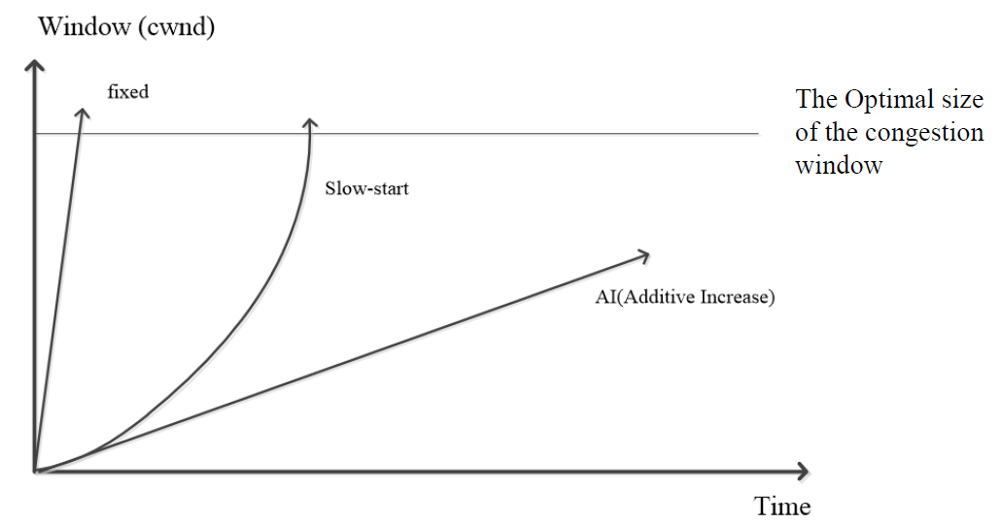{ width="600" }
</figure>

<figure markdown="span">
    { width="600" }
</figure>

为了防止慢启动阶段的指数增长无限持续下去，避免短时间内向网络注入过多数据而引发严重拥塞，TCP 引入了慢启动阈值（ssthresh）作为切换点。初始时 ssthresh 通常设为较大值（如接收方通告窗口大小），因此初始阶段不受其限制，慢启动可以充分进行

1. 发生丢包（超时）：说明可能已出现拥塞。此时将 ssthresh 设为当前 cwnd 的一半（至少为 2 个 MSS），并将 cwnd 重置为 1，重新开始慢启动
2. cwnd 达到或超过 ssthresh：此时认为已接近可用带宽，为避免过度增长引发拥塞，切换到加性增模式（即拥塞避免阶段），在拥塞避免中，cwnd 每 RTT 增加 1 个 MSS（线性增长），更温和地探测带宽

<figure markdown="span">
    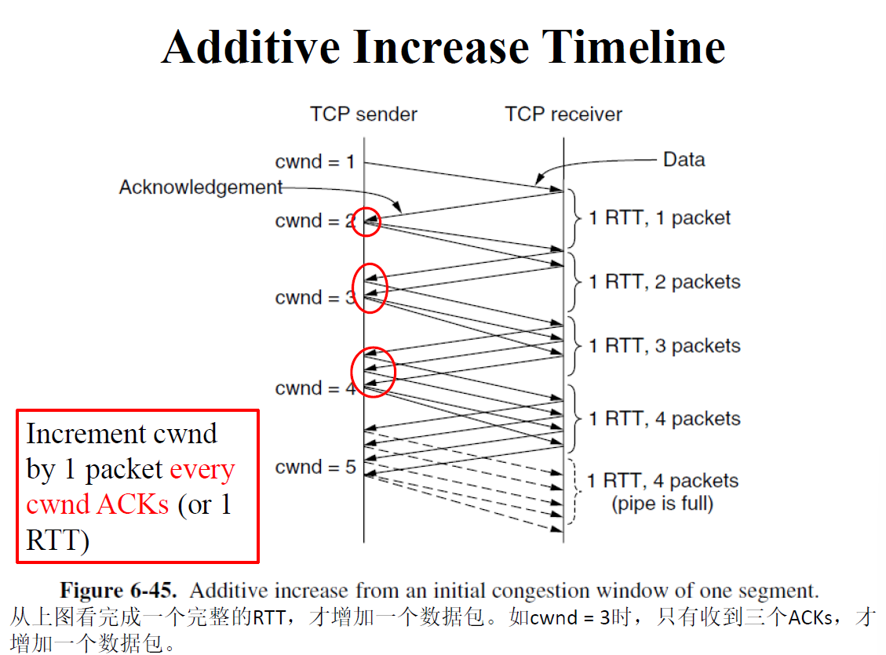{ width="600" }
</figure>

<figure markdown="span">
    { width="600" }
</figure>

---

Duplicate ACK：如果收到相同确认号的 ACK（即 DupACK），意味着接收方收到了比期望序号更高的乱序数据。这说明期望的段可能已丢失，而后续段已到达。TCP 约定，连续收到 3 个重复 ACK 即视为丢包事件，无需等待重传超时 RTO，发送方立即重传期望的那个丢失段，从而减少等待时间，提高恢复速度。触发快速重传后，执行拥塞响应，将慢启动阈值（ssthresh）设为当前 cwnd 的一半

fast retransmit（快速重传）：当发送方连续收到 3 个相同确认号的 ACK（重复 ACK）时，发送方立即重传该丢失段，而不必等待重传超时。选择 3 次作为阈值是为了在一定程度上容忍数据段在网络中的重排序，避免将短暂乱序误判为丢包

在重传丢失段后，发送方需等待接收方返回一个确认新数据的 ACK（即确认号跳跃到更高序号），期间可能暂时无法发送新数据，造成短暂空闲

!!! example "TCP Tahoe"

    TCP Tahoe（1988 年版本）在遇到超时丢包事件后的拥塞控制行为：

    基本参数：

    1. MSS = 1KB：每个 TCP 段的最大数据载荷为 1 千字节
    2. 初始 cwnd = 64 KB：连接开始时的拥塞窗口大小（相当于 64 个段）

    在时刻 0 发生超时，TCP Tahoe 执行乘性减：新 ssthresh = 当前 cwnd / 2 = 64 KB / 2 = 32 KB。同时将 cwnd 重置为 1 个 MSS（即 1 KB），进入慢启动阶段

    在大约时刻 13，有一个数据包丢失。接收方每收到一个乱序数据包就会发送一个重复 ACK，发送方收到连续 3 个重复 ACK 后，推断该数据包丢失，触发快速重传，发送方立即重传该丢失数据包。执行拥塞响应，新 ssthresh = 当前 cwnd / 2 = 40 KB / 2 = 20 KB。将 cwnd 重置为 1 个 MSS（1 KB），并重新开始慢启动

    <figure markdown="span">
        { width="600" }
    </figure>

每个 DupACK 都对应一个乱序到达的后续数据段，因此，每收到一个 DupACK，就意味着有一个非丢失段已成功到达接收方，并从网络中移除。由于这些后续段已离开网络，发送方可以在重传丢失段的同时，安全地将发送窗口向前滑动（即发送新数据），而不会增加网络中的总数据量，从而维持网络负载稳定

fast recovery（快速恢复）：在快速重传丢失段之后，每收到一个重复 ACK 就发送一个新数据段。对 DupACK 进行计数，包括最初触发快速重传的 3 个，当网络中数据包的数量降至新的阈值时，恢复过程接近完成。当收到确认新数据的 ACK 时，发送方退出快速恢复阶段

!!! example "TCP Reno"

    TCP Reno（1990 年版本）中的快速恢复机制：

    在快速重传后，不将 cwnd 重置为 1，而是将其设为新的慢启动阈值（ssthresh），即丢包前 cwnd 的一半，通过继续发送新数据包（每收到一个重复 ACK 就发送一个），维持 ACK 时钟运行，避免吞吐量骤降

    TCP Reno 仅在两种情况下使用慢启动：连接建立时；发生超时丢包时

    <figure markdown="span">
        { width="600" }
    </figure>

    <figure markdown="span">
        { width="600" }
    </figure>

Selective ACK（选择性确认）：传统 TCP 使用累积确认，只能告知发送方连续接收的最高序列号，无法指明乱序到达或丢失的具体数据段。SACK 允许接收方在 ACK 报文中额外携带最多三个非连续、已接收的数据块范围，从而更精确地反馈接收情况

发送方可以根据 SACK 信息明确知道哪些段已成功接收、哪些可能丢失，从而仅重传真正丢失的段，避免不必要的重传。在同一窗口内多个数据包丢失的情况下，传统 TCP 可能多次触发快速重传与恢复，导致性能下降；而 SACK 能一次性识别多个丢失段，更高效地恢复

<figure markdown="span">
    { width="600" }
</figure>

ECN（显示拥塞通知）：ECN 是 IP 层提供的显式拥塞反馈机制（通过在 IP 首部中设置 ECN 字段），允许路由器在拥塞即将发生但尚未丢包时主动向终端发送拥塞信号，而不是仅依靠丢包作为隐式信号

在 TCP 三次握手期间，双方通过设置 TCP 首部中的 ECE 和 CWR 标志位来表明支持 ECN。只有两端都支持时，ECN 才会在该连接中启用

ECN 的工作流程：

1. 路由器行为：当检测到队列长度超过阈值（即即将拥塞）时，支持 ECN 的路由器会在经过的 IP 包中设置拥塞标记（CE，Congestion Experienced），而不丢弃该包
2. 接收方行为：TCP 接收方检测到带有 CE 标记的数据包后，在返回的 ACK 中设置 ECE 标志，通知发送方网络出现拥塞
3. 发送方行为：发送方收到带有 ECE 的 ACK 后，执行拥塞控制（如将 cwnd 减半），并在下一个数据包中设置 CWR 标志，告知接收方已响应拥塞，可停止发送 ECE

#### 2.3.6 BBR

早期 TCP 假设丢包 ≈ 拥塞，这是因为当时网络设备缓冲区小、链路误码率较高，丢包多为拥塞所致。随着硬件进步，网络环境已发生根本变化，这一假设不再普遍成立

现代路由器/交换机通常配备大缓冲区，基于丢包的算法会持续填满缓冲区，导致队列延迟急剧增加。发送方在丢包发生前可能已长时间以过高速率发送，造成网络延迟高、交互响应差

若缓冲区很小，轻微波动即导致丢包，传统 TCP 会频繁减半窗口，无法充分利用带宽，吞吐量低下

BBR 是 Google 在 2016 年提出的新型拥塞控制算法，其核心思想是直接测量网络路径的带宽（B）与传播时延（RTT），而非依赖丢包作为拥塞信号。BBR 通过主动控制发送速率，旨在最大化吞吐量并最小化延迟，避免缓冲区膨胀，适应各种缓冲区大小的网络环境

在任何端到端路径中，总存在一个最慢的链路（瓶颈），它决定了该方向的最大可用带宽（BtlBw），拥塞本质上是在瓶颈处形成的队列堆积，当发送速率超过瓶颈带宽时，数据包开始在缓冲区中排队

- RTprop（往返传播时间）：信号在物理介质中传播所需的最小时间，与路径长度和介质特性相关，不受流量影响
- BtlBw（瓶颈带宽）：路径中瓶颈链路的最大数据传输能力

> 将网络路径比作一根管道：RTprop 是管道长度，决定数据从一端到另一端的最短时间；BtlBw 是管道最窄处的直径，决定单位时间内能通过的最大数据量

BBR 认为，理想的拥塞控制应使发送速率尽可能接近 BtlBw，同时保持队列尽可能短（避免排队延迟），从而在高吞吐量与低延迟之间取得最优平衡

!!! tip "the network's heisenberg uncertainty principle"

    RTprop 和 BtlBw 遵循一种不确定性原理：当一个能被测量时，另一个就不能

    1. 测量 BtlBw：需要填满甚至略微超过管道，通过观察最大传输速率来估计带宽。但这必然在瓶颈处产生排队，导致 RTT 增大，使得此时的 RTT 不等于 RTprop，因此无法同时准确测量 RTprop
    2. 测量 RTprop：需要在管道未被填满（无排队）时测量 RTT，此时 RTT 接近最小值 RTprop。但此时发送速率低于 BtlBw，无法准确估计带宽

app limited region（应用受限区域）：当发送方应用提供数据的速度较慢（如交互式应用、请求-响应模式）时，即使网络有足够带宽，实际在途数据量也无法填满管道（BDP）。此时传输行为受限于应用，网络带宽无法被充分利用

rate balance（速率平衡）：理想状态下，发送方应以恰好等于瓶颈带宽（BtlBw）的速率发送数据。这样既能最大化吞吐量（瓶颈利用率 100%），又能避免排队

full pipe（管道满载）：为了实现速率平衡，网络中应在途的数据量应等于带宽延迟积（BDP = BtlBw × RTprop）。BDP 表示管道容量，足够填满从发送方到接收方的整个路径，但不多于管道能容纳的量。若在途数据 < BDP → 瓶颈可能空闲（利用率不足）；若在途数据 > BDP → 产生排队（延迟增加）

<figure markdown="span">
    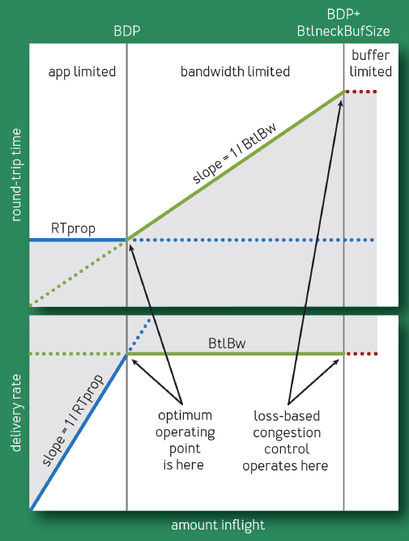{ width="600" }
</figure>

!!! tip "RTprop 估计方法"

    实际测量的 RTT 由两部分组成：RTprop（物理传播时延） + η（噪声/附加延迟）

    由于 η 总是非负的，因此 RTprop ≤ 任何时刻的 RTT。在足够长的时间窗口内，取 RTT 的最小值作为 RTprop 的估计

!!! tip "BtlBw 估计方法"

    在一段时间间隔 $\Delta t$ 内，成功传输并得到确认的数据量 $\Delta delivered$。传输速率 $deliveryRate = \dfrac{\Delta delivered}{\Delta t}$
    
    由于测量时使用的时间间隔 $\Delta t$ 是基于 ACK 到达时间估算的，该时间可能大于或等于真实的数据包到达间隔。因此，计算出的 deliveryRate 不会超过真实传输速率，而真实传输速率又不会超过瓶颈带宽（BtlBw）。这意味着：测量到的 deliveryRate ≤ 真实传输速率 ≤ BtlBw

    由于 deliveryRate 是 BtlBw 的下界，要估计 BtlBw 应取 deliveryRate 的最大值。在滑动时间窗口内，取 deliveryRate 的最大值作为 BtlBw 的估计
