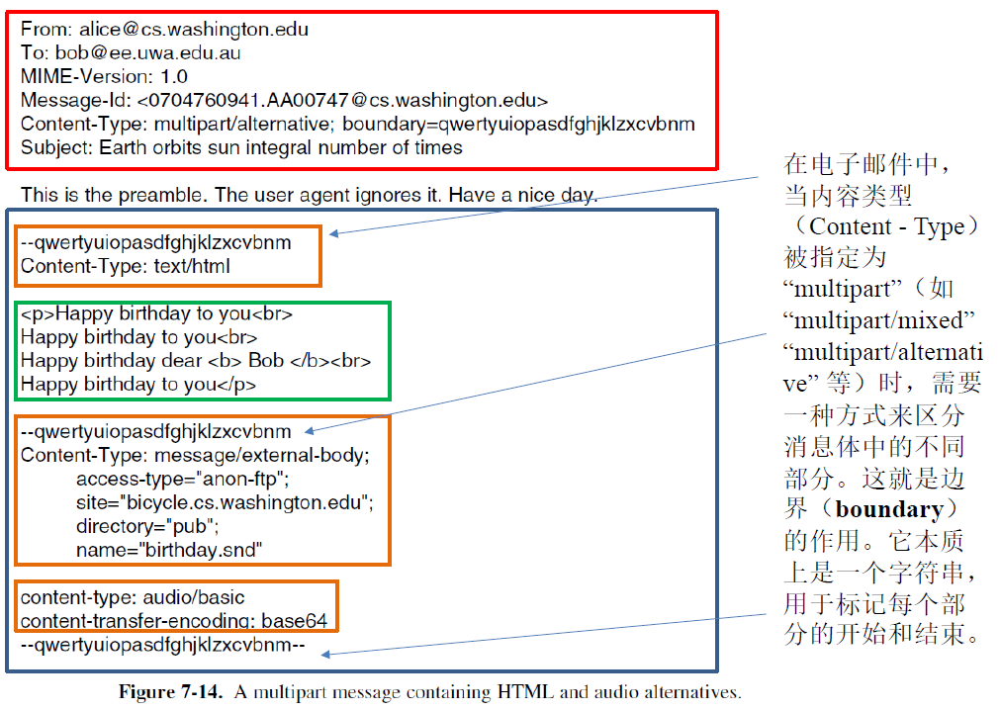
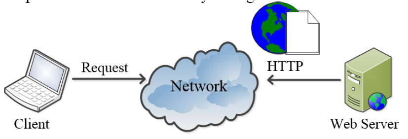
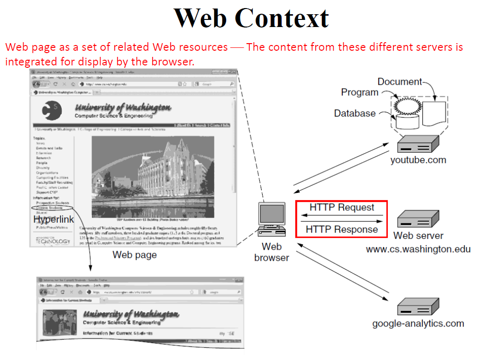
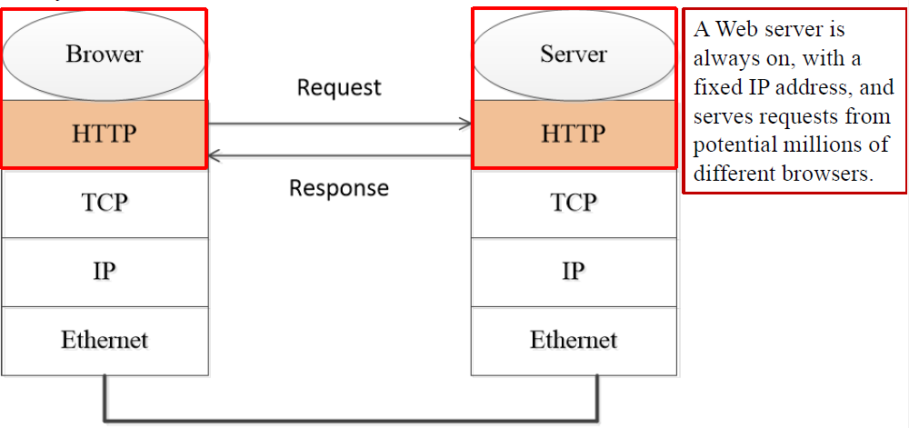
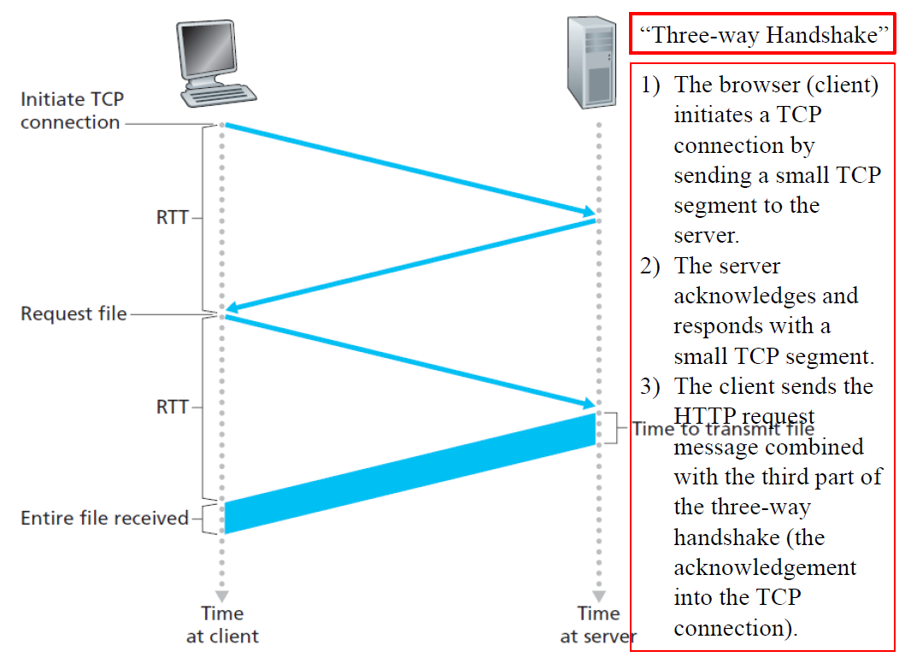
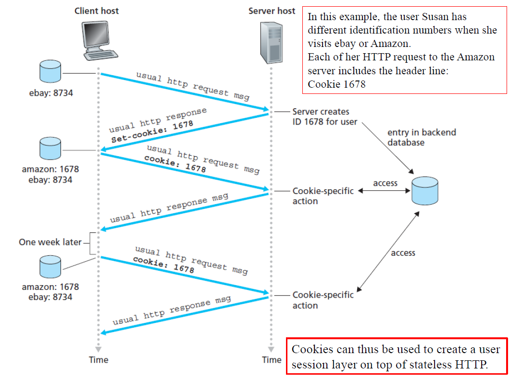
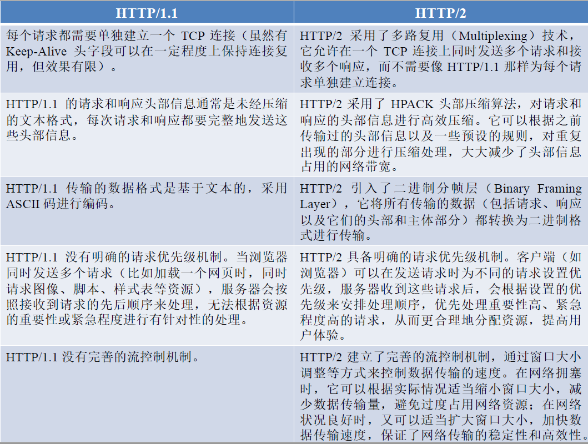
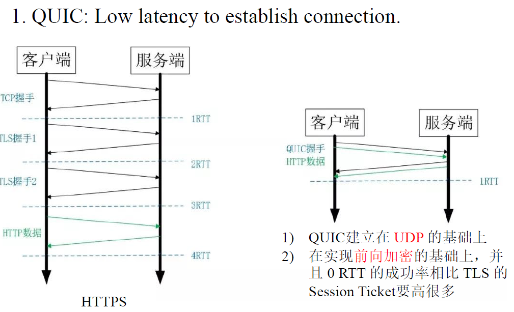
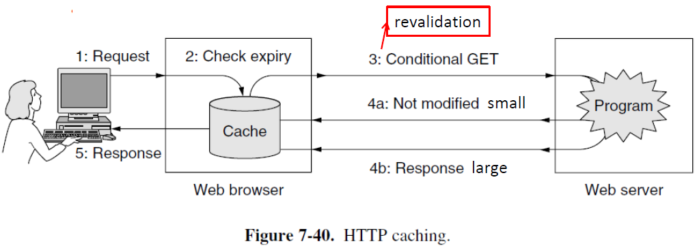

# 7 The Application Layer

<!-- !!! tip "说明"

    本文档正在更新中…… -->

!!! info "说明"

    本文档仅涉及部分内容，仅可用于复习重点知识

## 1 Overview of Application Layer

应用程序需要的传输层服务：

1. data loss：音视频流媒体可以容忍少量数据丢失，而文件传输或远程登录必须保证数据完整无误
2. bandwidth：对带宽敏感的应用程序（如多媒体）需要保证一定量的最大带宽。弹性应用程序是指可以使用任何可用带宽
3. timing：某些应用程序（如网络电话）要求低延迟才能有效工作

<figure markdown="span">
    { width="600" }
</figure>

<figure markdown="span">
    { width="600" }
</figure>

## 2 DNS

**Domain Name System**

网络资源通过 IP 地址定位，但 IP 地址难以记忆。如果服务器更换 IP 地址，所有用户都需要更新地址信息，这在实际操作中非常不便。DNS 通过引入易读的域名来代表 IP 地址，实现了名称与地址的分离。这样用户只需记住域名，而不必关心背后具体的 IP 地址，即使服务器地址变更，也只需在 DNS 系统中更新映射关系，对用户透明

DNS 采用层次化、基于域名的命名体系，便于组织和管理。实现为一个分布式数据库系统，不同层级的域名由不同的服务器负责解析，提高了可扩展性和可靠性

应用程序通过调用解析器发起域名查询，解析器负责向 DNS 服务器发送请求并获取 IP 地址

DNS 查询和响应通常使用 UDP 协议传输，这是因为 UDP 具有低开销、速度快的特点，适合频繁的小数据量查询

!!! question "为什么 DNS 采用分布式系统而非集中式结构"

    集中式系统的缺点：

    1. 单点故障：如果中心服务器宕机，整个域名系统将瘫痪
    2. 流量负载：所有域名查询都集中到一台服务器，会造成巨大的网络流量和处理压力
    3. 延迟问题：地理位置遥远的用户访问集中式服务器时，响应速度会明显变慢
    4. 扩展性限制：随着网络规模扩大，集中式系统难以应对日益增长的域名管理需求

三类主要 DNS 服务器：

1. root DNS servers：位于层次结构的顶端，负责指向顶级域（TLD）服务器
2. top level domain (TLD) DNS servers：管理特定顶级域（如 .com、.org、.cn 等）下的域名信息
3. authoritative DNS servers：直接存储特定域名（如 example.com）的 IP 地址记录，是该域名的最终权威信息来源

<figure markdown="span">
    { width="600" }
</figure>

根域名服务器共有 13 个逻辑名称（a.root-servers.net 到 m.root-servers.net），对应 13 个 IP 地址。每个逻辑名称背后实际上是一个由多台物理服务器组成的集群，这种复制架构提高了系统的安全性和容错能力。所有 DNS 服务器都需要知道根服务器的地址，这通常通过名为 named.ca 的配置文件实现，其中缓存了根服务器的地址

IP 任播是根服务器实现高可用性和低延迟访问的核心技术。通过在不同地理位置部署相同 IP 地址的服务器实例，用户请求会自动路由到最近的实例

根服务器同时支持 IPv4 和 IPv6 协议，确保与新旧网络设备的兼容性

<figure markdown="span">
    { width="600" }
</figure>

<figure markdown="span">
    { width="600" }
</figure>

通用顶级域名 gTLD：目前已有 22 个以上。每个 gTLD 有特定的注册和使用政策（如 .edu 限于教育机构，.gov 限于政府）

国家代码顶级域名：每个国家/地区分配一个双字母代码（如 .cn 代表中国）。2010 年后开始支持国际化域名（如中文、阿拉伯文等字符）。许多小国家通过商业授权其 ccTLD 获得收入（如 .tv 被视频行业广泛使用）

为了避免单一信息源带来的风险，DNS 采用分区域管理的方式。一个 DNS 区域是 DNS 命名空间中一段连续的、逻辑上独立的部分。各区域之间互不重叠，确保每个域名记录只由一个区域负责。每个区域由一个或多个域名服务器进行管理，这些服务器存储该区域的所有 DNS 记录

<figure markdown="span">
    { width="600" }
</figure>

一个域可以完全属于一个区域，也可以进一步 delegation（授权，委托）给下级区域管理。例如：zju.edu.cn 被委托给浙江大学管理，形成独立的区域，而 cs.zju.edu.cn 仍属于该区域，除非再被委托出去

<figure markdown="span">
    { width="600" }
</figure>

<figure markdown="span">
    { width="600" }
</figure>

### 2.1 Domain Resources Records

资源记录是 DNS 系统中存储信息的基本单元，所有域名相关的数据都以资源记录的形式存储。这些记录共同构成了分布式的 DNS 数据库，是域名解析的数据基础

DNS 本质上是一个名称到资源记录的映射系统。当用户查询一个域名时，DNS 返回的是与该域名关联的一条或多条资源记录，而不仅仅是 IP 地址

每个资源记录由 5 个字段组成，构成一个标准化的五元组数据结构：(Domain_name, Time_to_live, Class, Type, Value)

1. 域名字段：作为主键，用于标识该记录属于哪个域。由于 DNS 数据库存储大量不同域的信息，该字段是查询时进行匹配和检索的关键依据
2. 生存时间字段：表示该记录在缓存中可以被保留的有效时长（单位通常为秒）。高 TTL 值表示记录很少变更，适合长期缓存。低 TTL 值表示记录可能频繁变更，需要频繁更新
3. Class 字段：用于标识资源记录所属的网络类别或协议族。对于互联网信息，它始终是 IN。对于非互联网信息，可以使用其他代码，但实际上这些很少见
4. Type 和 Value 字段

    1. SOA 记录（起始授权记录）：提供有关该域名服务器区域主要信息源的名称
    2. A 记录（IPv4 地址记录）：存储某个主机的 32 位 IPv4 地址
    3. AAAA 记录（IPv6 地址记录）：存储 128 位 IPv6 地址
    4. MX 记录（邮件交换记录）：指明负责接收该域电子邮件的邮件服务器主机名
    5. NS 记录（域名服务器记录）：指定负责该域或子域解析的权威域名服务器
    6. CNAME 记录（规范名称记录）：为域名创建别名，实现类似宏定义的指向功能
    7. PTR 记录（指针记录）：主要用于反向 DNS 查找，将 IP 地址映射回对应的主机名
    8. SRV 记录（服务定位记录）：扩展了 MX 记录的功能，可标识各种网络服务的主机和端口信息
    9. SPF 记录（发件人策略框架记录）：用于邮件防伪和防垃圾邮件，声明该域名的合法发件服务器
    10. TXT 记录（文本记录）：最初用于存储任意文本信息。现广泛用于域名验证、邮件安全策略和所有权声明

<figure markdown="span">
    { width="600" }
</figure>

---

当本地 DNS 服务器没有缓存所需的域名信息时，解析过程通常从根域名服务器开始。解析器会按照 DNS 层次结构逐级向下查询：根 → 顶级域（TLD）→ 权威域名服务器，直到获得最终的 IP 地址

<figure markdown="span">
    { width="600" }
</figure>

!!! tip "Recursive Queries"

    递归查询是一种全权委托式的查询方式，客户端（或本地 DNS 解析器）将查询任务完全交给递归 DNS 服务器处理，并等待最终结果

    客户端向本地 DNS 服务器发送一个递归查询请求。本地 DNS 服务器负责执行整个查询链：可能从根服务器开始，逐级向下查询 TLD 和权威服务器，直到获得最终 IP 地址。本地 DNS 服务器将最终结果返回给客户端

    优点：

    1. 客户端简化：终端设备或本地解析器只需发起一次查询，后续所有查询步骤均由递归服务器负责，降低了客户端的实现复杂度
    2. 性能优化：递归服务器可通过缓存先前查询结果（即 DNS 缓存）直接响应重复查询，减少解析链路的延迟，提升用户体验

    缺点：

    1. 服务器压力：递归服务器需要为每个首次查询的域名执行完整的迭代查询（从根开始逐级查询），高并发场景下容易成为性能瓶颈
    2. 安全风险：递归服务器若被攻击者控制或劫持，可能返回伪造的 DNS 响应（DNS 欺骗），导致用户被导向恶意站点。这也使得递归服务器成为 DDoS 攻击（如 DNS 放大攻击）的潜在目标或工具

!!! tip "Iterative Queries"

    迭代查询是一种分步推进的查询方式，解析器（如本地 DNS 服务器）主动、逐步地向不同层级的 DNS 服务器发起查询，每次获取更接近目标的线索，直至最终得到 IP 地址

    通常由本地 DNS 服务器（即递归 DNS 服务器）在执行递归查询过程中使用迭代查询来获取最终答案

    假设一个本地 DNS 解析器想要解析域名 www.cs.washington.edu

    1. 本地 DNS 服务器首先联系根 DNS 服务器。但根 DNS 服务器并不直接知道 www.cs.washington.edu 的 IP 地址，但它知道顶级域（TLD）服务器（例如 .edu 服务器）的 IP 地址。因此，它会将相关 TLD 服务器的 IP 地址返回给本地 DNS 解析器
    2. 本地 DNS 解析器接着联系 TLD 服务器。TLD 服务器随后提供域名 washington.edu 的权威 DNS 服务器的 IP 地址
    3. 最后，本地 DNS 解析器联系权威 DNS 服务器，该服务器提供 www.cs.washington.edu 的 IP 地址

    优点：

    1. 负载分散：由于本地 DNS 服务器负责逐步推进查询，根和 TLD 服务器只需提供下一级服务器的地址，减轻了中间服务器的负载
    2. 缓存共享：本地 DNS 服务器可以缓存查询结果，为同一网络内的多个客户端提供服务，提高整体解析效率

    缺点：

    1. 延迟累积：每次查询都需要往返一次网络通信，多级查询会叠加延迟，尤其在跨地域或网络拥堵时更明显
    2. 客户端复杂度：虽然对终端用户透明，但本地 DNS 服务器需要实现迭代查询逻辑，增加了其实现和维护复杂度

本地域名服务器可以由机构内部、设备本地、公共 DNS 服务提供。客户端设备通常通过 DHCP（动态主机配置协议）自动获取本地 DNS 服务器的地址，无需手动设置，便于网络管理

<figure markdown="span">
    { width="600" }
</figure>

早期 DNS 事务 ID 过短，仅 16 位，使得攻击者容易猜测或暴力匹配。缺乏加密与认证，查询与响应以明文传输，无法验证数据来源的真实性和完整性。这一设计使 DNS 容易遭受多种攻击，包括缓存投毒攻击（DNS cache poisoning，也称 DNS 欺骗，DNS spoofing）（攻击者向递归 DNS 服务器发送伪造的响应包，使其接受错误的域名—IP 映射，并缓存该恶意记录。伪造的响应必须匹配请求中的查询内容、事务 ID、源/目的 IP 与端口等字段）

<figure markdown="span">
    { width="600" }
</figure>

<figure markdown="span">
    { width="600" }
</figure>

DNS 欺骗攻击步骤：

1. 攻击者先查询两个他控制的域名，目的是：让 ISP 的 DNS 服务器缓存相关记录。观察并预测 ISP 使用的 DNS 事务 ID（序列号）生成规律
2. 攻击者发送一个查询，以获取当前使用的序列号 n
3. 攻击者立即查询目标域名 bob.com，迫使 ISP 的 DNS 服务器向 .com 权威服务器发起新一轮查询，此时序列号会递增为 n+1
4. 攻击者预测到序列号将是 n+1，并抢先向 ISP 发送伪造的 DNS 响应，声称 bob.com 的 IP 是 42.9.9.9（恶意地址）
5. 当真正的权威服务器返回合法响应时，ISP 已接受了伪造的响应并缓存了错误记录，因此真实响应被丢弃

<figure markdown="span">
    { width="600" }
</figure>

## 3 FTP

<figure markdown="span">
    { width="600" }
</figure>

FTP 的工作流程：

1. 建立连接：用户输入远程主机名后，本地 FTP 客户端会与远程 FTP 服务器通过 TCP 协议建立可靠连接
2. 身份验证：用户提供的用户名和密码通过已建立的 TCP 连接以 FTP 命令形式发送到服务器进行认证
3. 文件传输：认证成功后，用户可以在本地文件系统与远程文件系统之间双向传输文件

FTP 使用两条并行的 TCP 连接来传输文件：

1. control connection（控制连接）：用于在两个主机之间传递控制信息，例如传输命令和响应（如登录、切换目录、操作指令）。传输格式为 7 位 ASCII 文本，易于阅读和调试。由于控制信息和文件数据分开传输，因此 FTP 是 out-of-band（带外）传输的
2. data connection（数据连接）：专门用于实际的文件内容传输。在控制连接建立并验证身份后，按需建立数据连接进行文件的上传或下载

## 4 Email

电子邮件是一种异步通信媒介。电子邮件的发送和接收不需要双方同时在线，这与即时通信（如聊天）形成对比，提供了更高的灵活性

三个主要组成部分：

1. user agents（用户代理，UA）：用户直接交互的界面或应用程序，如 Outlook、Thunderbird 或网页版 Gmail。负责撰写、发送、接收和显示邮件
2. message transfer agents（邮件传输代理，MTA）：负责在后台传输邮件，接收来自用户代理的邮件并将其路由至目的地服务器，类似邮政系统中的邮局
3. simple mail transfer protocol（简单邮件传输协议，SMTP）：应用层协议，用于在邮件服务器之间（或从用户代理到邮件服务器）传输邮件，是电子邮件发送过程的核心协议

> 用户通过用户代理撰写邮件，经由 SMTP 协议发送给邮件服务器，再由邮件服务器通过 SMTP 将邮件转发至接收方的邮件服务器，最终由接收方通过其用户代理（可能使用 POP3/IMAP 协议）收取邮件

<figure markdown="span">
    { width="600" }
</figure>

!!! tip "User Agent"

    用户代理是用户与电子邮件系统交互的客户端软件或界面。它提供邮件撰写、收发、回复及邮箱管理的功能。如 Gmail（网页界面）、Outlook、Apple Mail、Thunderbird 等都是常见的用户代理

    邮件通常存储在邮件服务器上，而非仅仅本地。用户代理通过标准协议（如 SMTP、POP3、IMAP）与服务器交互，实现邮件的同步与管理

### 4.1 SMTP

SMTP 是互联网邮件传输的核心协议，由 RFC 5321 定义。使用 TCP 作为传输层协议，确保邮件传输的可靠性

SMTP 采用客户端-服务器架构，每个邮件服务器既充当客户端（向其他服务器发送邮件），也充当服务器（接收来自其他服务器的邮件）。发送时，发件人邮件服务器作为 SMTP 客户端，收件人邮件服务器作为 SMTP 服务器

SMTP 最初设计仅支持 7 位 ASCII 文本，因此无法直接传输二进制文件（如图片、音频等）。为解决这个问题，通常使用如 MIME（多用途互联网邮件扩展）等编码方式将二进制数据转换为 ASCII 格式进行传输，接收方再将其解码还原

SMTP 采用端到端直接传输模式，不依赖中间邮件服务器进行接力转发。无论发送方和接收方服务器距离多远，都会建立直接连接

连接建立过程：发送方邮件服务器作为 SMTP 客户端，通过 TCP 向接收方邮件服务器的 25 号端口发起连接。这是 SMTP 的标准服务端口。如果目标服务器未响应，客户端会进行重试，确保邮件最终能被送达

连接建立后，双方通过应用层握手交换信息，客户端告知发件人和收件人邮箱地址，服务器验证是否接受该邮件请求。身份确认后，邮件内容通过同一 TCP 连接传输。如果有多个邮件发往同一服务器，可在同一连接内连续发送，提高传输效率。完成所有邮件传输后，连接被正常关闭

SMTP 是一种推送协议，负责将邮件从一个节点推送到另一个节点。收件人用户代理（如 Outlook 或 Gmail 客户端）无法使用 SMTP 从邮件服务器获取邮件，因为获取邮件是拉取操作，而 SMTP 不支持拉取

Email Access Protocol（邮件访问协议）：允许收件人从邮件服务器检索邮件到本地设备或网页端

1. POP：简单、轻量，主要用于身份验证和邮件下载。默认情况下邮件下载后从服务器删除。无状态，无法在服务器端进行邮件分类、搜索等操作
2. IMAP：支持在服务器上管理邮件（创建文件夹、移动、标记等）。保持用户状态，支持多设备同步访问同一邮箱。较 POP 更复杂，但适合现代多设备、长期存储的邮件使用场景
3. HTTP：网页邮箱（如 Gmail、Yahoo Mail）使用 HTTP/HTTPS 作为访问协议，通过浏览器与服务器交互。早期实现可能因页面加载等原因较慢，但现代网页邮箱已高度优化

### 4.2 Email Message Format

最初由 RFC 822 定义，后更新为 RFC 5322，并扩展了 MIME 等机制以支持多媒体内容（如图片、音频、附件等）

消息格式的一个核心概念是 envelop（信封）和 content（内容）的区分：

1. envelop：类比传统邮政系统，信封上写明收件人地址、优先级等信息，用于邮件的路由与投递。SMTP 命令中使用的 `MAIL FROM:` 和 `RCPT TO:` 实际上就是信封信息
2. 内容（消息本身）：包括头部和正文，是用户实际看到和交互的部分

    1. 头部：包含元数据和控制信息，如发件人、收件人、日期、主题、内容类型等，供邮件客户端解析和处理
    2. 正文：邮件的实际内容，可以是纯文本、HTML 或包含多媒体内容的 MIME 格式

<figure markdown="span">
    { width="600" }
</figure>

!!! tip "RFC 5322 —— The Internet Message Format"

    | Header | Meaning |
    | -- | -- |
    | To: | 指明邮件的主要接收者 |
    | Cc: | 抄送。邮件同时发送给其他相关人员 |
    | Bcc: | 密件抄送。收件人不会看到其他 Bcc 接收者 |
    | From: | 表示邮件的创建者或名义发件人 |
    | Sender: | 表示实际发送邮件的地址，可能与 From 不同（如秘书代经理发信） |
    | Received: | 记录邮件经过每个邮件服务器的信息，用于追踪路由 |
    | Date: | 记录邮件的发送时间，用于排序和归档 |
    | Reply-To: | 指定回复地址，可与发件人地址不同，例如用于反馈邮箱或邮件列表 |
    | Message-Id: | 每封邮件的全局唯一标识符，便于追踪与引用 |
    | In-Reply-To: | 说明此邮件是回复哪一封邮件，指向原邮件的 Message-Id |
    | References: | 列出所有相关的 Message-Id，用于建立邮件对话线索 |
    | Keywords: | 用户自定义关键词，便于分类与搜索 |
    | Subject: | 邮件主题，用于邮件列表中的简要显示和快速识别 |

!!! tip "MIME"

    The Multimedia Internet Mail Extension

    它是对原始电子邮件协议（SMTP 和 RFC 5322）的扩展，以支持非 ASCII 文本和多媒体内容。MIME 使用 type/subtype 的格式标识内容类型，并可附加参数以进一步说明

    <figure markdown="span">
        { width="600" }
    </figure>

    Content-Type：

    1. multipart/alternative：这是在电子邮件或基于 HTTP 等协议的消息体中使用的 MIME 类型标识。它表示消息内容由多个部分组成，这些部分提供了同一内容的不同表达形式，通常用于适应不同的显示环境或客户端能力。当消息被标记为 multipart/alternative 时，通常包含一个或多个子部分，每个子部分都有独立的 MIME 类型和内容。这些子部分按优先级排列，通常最简单（最兼容）的格式放在前面，最丰富（最现代）的格式放在后面。在电子邮件中，这种格式特别有用，因为不同客户端对内容支持程度不同：有些只能显示纯文本，有些则可正常显示 HTML
    2. message/external-body：这是一种 MIME 类型，表示邮件内容实际上是一个指向外部资源的引用，而不是直接包含在邮件体中。它类似于一个指针，指向内容真正存储的位置
    3. audio/basic：这是一种用于音频内容的 MIME 类型，表明消息体包含基本的音频数据。它常用于电子邮件或网页音频嵌入等场景，以便接收方能正确处理和播放音频

!!! tip "Base64"

    Base64 是一种将二进制数据编码为可打印 ASCII 字符的编码方案，广泛应用于电子邮件（MIME）、数据传输（如 HTTP）以及存储系统中

    编码原理：将每 3 字节（24 位）划分为 4 个 6 位组，每个 6 位组映射为一个 ASCII 字符。由于 6 位最多表示 64 种值，因此选取了 64 个无歧义的可打印字符作为映射表
    
    填充规则：若数据长度不是 3 的倍数，会在编码后添加 `=` 进行填充，以确保编码后字符数为 4 的倍数

<figure markdown="span">
    { width="600" }
</figure>

<figure markdown="span">
    { width="600" }
</figure>

## 5 HTTP

HTTP 是万维网中应用层的关键协议，负责客户端（如浏览器）与服务器之间的通信。由一系列 RFC 文档标准化

HTTP 协议采用请求-响应模型：客户端发送请求，服务器返回响应。基于 TCP 实现可靠传输，通常使用端口 80（HTTP）或 443（HTTPS）。HTTP 本身不负责解释网页内容，只负责传输数据；内容的解析与渲染由客户端（如浏览器）完成。HTTP 本身不保存客户端状态，每次请求之间相互独立

网页由多个对象（如文本、图片、脚本、样式表等）组成。每个对象都是一个可通过 URL（统一资源定位符） 唯一标识的文件。浏览器通过 HTTP 依次获取这些对象，并将它们组合成完整的页面

<figure markdown="span">
    { width="600" }
</figure>

<figure markdown="span">
    { width="600" }
</figure>

<figure markdown="span">
    { width="600" }
</figure>

!!! tip "The Client Side"

    URL：`http://www.zju.edu.cn/index.html`

    1. `http://` 表示使用的协议（HTTP）
    2. `www.zju.edu.cn` 是服务器的主机名（域名）
    3. `/index.html` 是服务器上资源（网页文件）的路径

    获取页面的关键步骤：

    1. DNS 解析：将域名 `www.zju.edu.cn` 转换为 IP 地址，以便定位服务器
    2. 建立 TCP 连接：与服务器 IP 的 80 端口（HTTP 默认端口）建立可靠的 TCP 连接
    3. 发送 HTTP 请求：通过该连接发送 `GET /index.html HTTP/1.1` 等请求报文
    4. 接收 HTTP 响应：服务器返回 HTML 文件及状态码
    5. 处理与渲染：浏览器解析 HTML 内容。识别并获取嵌入资源。执行 JavaScript 代码，渲染最终页面
    6. 清理连接：若保持连接（HTTP Keep-Alive）未启用，则在完成后关闭 TCP 连接

    URL 格式：`协议://主机/路径`。不同协议对应不同的资源类型和访问方式，浏览器根据协议调用相应处理模块

    | 协议 | 作用 |
    | -- | -- |
    | http / https | 访问网页内容（后者为加密版本）|
    | ftp | 访问 FTP 服务器上的文件，浏览器可充当简易 FTP 客户端 |
    | file | 访问本地文件系统，通常用于测试或打开本地文档 |
    | mailto | 启动邮件客户端并预填收件人，实现网页中直接发邮件的功能 |
    | rtsp | 用于流媒体播放（如视频直播） |
    | sip | 用于发起语音/视频通话（VoIP） |
    | about | 访问浏览器内部信息或配置页面 |

!!! tip "The Server Side"

    1. 建立连接：服务器监听特定端口（如 80），等待并接受客户端通过 TCP 发起的连接
    2. 解析请求：从 HTTP 请求报文中提取请求的资源路径（例如 /index.html）
    3. 读取资源：根据路径从服务器本地文件系统中读取对应的文件
    4. 发送响应：将文件内容封装为 HTTP 响应报文，通过 TCP 连接发送回客户端
    5. 关闭连接：完成响应后关闭 TCP 连接（除非启用持久连接）

<figure markdown="span">
    { width="600" }
</figure>

### 5.1 Cookies

HTTP 的无状态性：每个 HTTP 请求之间相互独立，服务器不保留客户端之前请求的任何信息。这简化了服务器设计，但无法支持如登录状态、购物车等需要跨请求识别用户的场景

解决方案：

1. 使用 IP 地址：通过客户端 IP 地址来识别用户。但由于 NAT（网络地址转换）、DHCP（动态主机配置协议）、代理或共享网络的存在，多个用户可能共享同一 IP 地址，导致识别不准确
2. 使用 Cookies：由服务器通过 HTTP 响应头 Set-Cookie 发送给浏览器一小段文本信息，浏览器随后在后续请求中通过 Cookie 请求头将其发送回服务器。首次在 Netscape 浏览器中实现，后由 RFC 2109 和 RFC 2965 标准化。是目前主流且可靠的跨请求状态保持机制

Cookie 是由服务器通过 HTTP 响应头 Set-Cookie 发送给浏览器的一小段数据（最大容量通常为 4KB）。浏览器会存储该 Cookie，并在后续向同一服务器发起请求时自动通过 Cookie 请求头将其发回

Cookie 的用途：

1. 会话管理：最常见用途，如保持用户登录状态、记住购物车内容、保存游戏进度等
2. 个性化设置：存储用户的语言、主题、布局偏好等，提供定制化体验
3. 用户追踪：记录用户浏览行为、点击路径等，用于数据分析、广告投放（如 Google Analytics、广告跟踪工具等）

Cookie 的字段组成：

1. Domain：指定 Cookie 所属的域名，浏览器仅会在向该域名或其子域名发送请求时携带此 Cookie
2. Path：进一步限制 Cookie 在服务器特定路径下的有效性，提高安全性并减少不必要的发送
3. Content：存储实际数据，如会话标识、用户偏好等（通常经过编码或加密）
4. Expires：定义 Cookie 的过期时间，控制其生命周期

    1. 非持久化 Cookie（会话 Cookie）：无 Expires 字段，仅在浏览器会话期间有效，关闭浏览器后即删除
    2. 持久化 Cookie：设定了明确的过期时间，会保存在用户硬盘中，直到过期或手动删除

5. Secure：安全标志，指示 Cookie 只能通过 HTTPS 等加密连接传输，防止中间人攻击窃取

Cookie 的删除机制：服务器可通过重新发送同名 Cookie 并设置过期时间为过去，来通知浏览器立即删除该 Cookie

<figure markdown="span">
    { width="600" }
</figure>

### 5.2 HTTP Performance

page load time（PLT，页面加载时间）：PLT 指从用户点击链接或输入 URL 开始，到页面完全显示在屏幕上所经历的时间。研究表明，即使 PLT 增加几毫秒，也会显著降低用户满意度、增加跳出率，并直接影响电商网站的转化率与销售额

影响 PLT 的主要因素：

1. 页面/内容结构：如 HTML 大小、CSS/JavaScript 文件数量与体积、图片优化程度、资源加载顺序等
2. HTTP 和 TCP 协议
3. 网络条件：RTT（往返时间）和带宽

HTTP/1.0 的连接模型：每个 HTTP 请求都需要建立一个新的 TCP 连接，并在获取响应后立即关闭（短连接）。如果一个页面包含多个资源（如图片、CSS、脚本），浏览器需要为每个资源单独建立和关闭 TCP 连接

虽然浏览器可以并行打开多个 TCP 连接（通常为 4–8 个）来同时获取资源，但每个连接仍需要独立进行 TCP 三次握手（增加延迟）和慢启动（降低初始传输速度）。这样频繁建立和关闭连接消耗额外的网络资源和时间。在单个连接内请求只能顺序处理，若某个请求响应慢，会阻塞后续请求（队头阻塞问题）

<figure markdown="span">
    { width="400" }
</figure>

降低 PLT 的方法：

1. 减小内容体积：压缩图片、文本压缩
2. 改进 HTTP 协议以更好地利用带宽
3. 改进 HTTP 协议以避免重复传输相同内容：使用缓存和代理
4. 优化内容分发位置：CDN（内容分发网络）：将静态资源（如图片、CSS、JS）分发到全球各地的边缘服务器，使用户从地理上最近的节点获取内容，大幅降低网络延迟（RTT）

!!! tip "改进 HTTP：Parallel Connections"

    并行连接的原理：浏览器同时与服务器建立多个 TCP 连接（通常为 4–8 个），在每个连接上分别请求不同的资源（如图片、脚本、样式表）

    性能提升的原因：单个 HTTP 连接由于队头阻塞和慢启动等原因无法充分利用带宽。并行连接可同时传输多个资源，提高了网络利用率，缩短了总加载时间

    缺点：

    1. 连接建立开销：每个连接都需要 TCP 三次握手（及可能的 TLS 握手），增加了延迟
    2. 连接管理成本：每个连接都要维护状态，占用客户端和服务器资源
    3. 资源竞争与拥塞：每个 TCP 连接独立执行拥塞控制，可能同时进入拥塞避免阶段，导致整体上更激进地抢占带宽。多连接并发容易引发网络突发流量，增加路由器缓冲区压力，可能导致更多丢包和重传。在共享网络中可能对其他流量（如音视频流、实时应用）造成不公平影响

!!! tip "改进 HTTP：Persistent Connections"

    HTTP/1.1 引入持久连接：在同一个 TCP 连接上发送多个 HTTP 请求和响应，而不是每个资源都新建连接。通过请求头 `Connection: keep-alive` 明确启用（HTTP/1.1 默认支持）

    性能优势：减少连接开销，支持请求流水线（客户端可以在收到前一个响应之前发送下一个请求，进一步提高并行性），网络友好

    问题：连接保持时间应该是多久？连接在空闲一段时间后会被关闭，以释放服务器资源。服务器可能因维护大量空闲连接而压力增大，需要合理管理超时策略

    持久连接可能会变慢：

    1. 队头阻塞：如果某个请求处理缓慢，会阻塞同一连接上的后续请求
    2. 流水线限制：由于必须按顺序返回响应，实际并行提升有限，且部分中间设备（如代理）可能不支持流水线
    3. 连接竞争：如果所有资源都通过同一连接传输，可能无法充分利用可用带宽（尤其在高速网络中）

    <figure markdown="span">
        { width="600" }
    </figure>

!!! tip "改进 HTTP：HTTP/2"

    HTTP/2 支持服务器在客户端明确请求之前，主动将可能需要的资源（如 CSS、JavaScript、图片）推送到客户端缓存。例如，当客户端请求 HTML 时，服务器可以同时推送关联的 CSS 文件，减少额外的请求往返

    HTTP/2 的多路复用允许在单个 TCP 连接上并行交错地发送多个请求和响应，响应可以任意顺序返回，互不阻塞

    <figure markdown="span">
        { width="600" }
    </figure>

!!! tip "改进 HTTP：HTTP/3"

    HTTP/3 是 HTTP 协议的最新版本，其最大变化在于传输层协议。它不再使用传统的 TCP 作为传输协议，而是基于 QUIC（Quick UDP Internet Connections）协议构建，因此也称为 HTTP-over-QUIC

#### 5.2.1 QUIC

QUIC 相比目前广泛应用的 HTTP/2 + TCP + TLS 组合协议具有以下优势：

1. 减少握手延迟：整合传输与加密握手，支持 0-RTT 或 1-RTT 连接建立，显著降低首次及重复连接的延迟
2. 改进的拥塞控制：使用更现代的拥塞控制算法（如 BBR），并可在用户空间灵活更新，无需内核修改
3. 避免队头阻塞的多路复用：在单个 QUIC 连接上可并行传输多个独立流（Stream），某个流的数据包丢失不会阻塞其他流
4. 连接迁移：使用连接 ID 而非 IP + 端口标识连接，当用户切换网络（如 WiFi 转蜂窝网络）时，连接可无缝保持
5. 前向冗余纠错：可发送冗余数据包，在丢包时帮助恢复信息，减少重传延迟，提升弱网性能

<figure markdown="span">
    { width="600" }
</figure>

QUIC 为每个数据包分配一个单调递增的唯一编号，无论该数据包是原始发送还是重传，编号始终不同。这样，接收方的 ACK 可以明确指向具体的包编号，消除了 TCP 协议的 ACK 歧义

<figure markdown="span">
    { width="600" }
</figure>

#### 5.2.2 Web Caching

用户经常访问相同或相似的网页，如果每次访问都从原始服务器重新获取所有内容，会造成不必要的网络流量和延迟。缓存允许将先前获取的资源存储在本地（客户端）或中间节点（如代理、CDN），后续请求时直接重用，从而显著提升加载速度并降低服务器负载

HTTP 协议定义了缓存机制，通过响应头和请求头来控制缓存行为。这些机制使得客户端能够判断缓存内容是否仍然有效（新鲜），以及何时需要重新验证或获取更新

<figure markdown="span">
    { width="600" }
</figure>

本地如何判断缓存的资源是否仍然可用：

1. page validation（页面验证）

    1. 基于过期时间的验证：服务器可以在响应中设置 Expires 头，指定资源的绝对过期时间。客户端将当前时间与该时间比较，若未过期则直接使用缓存，否则重新请求
    2. 基于最后修改时间的启发式验证：服务器返回 Last-Modified 头，指示资源最后修改的时间。客户端可使用启发式规则（如“最后修改时间距今不超过一定时长”）判断缓存是否新鲜

2. 与服务器重新验证缓存副本：当缓存副本可能已过期或不确定是否新鲜时，客户端不直接使用缓存，而是向服务器发起验证请求。客户端在请求头中携带缓存资源的元信息（如最后修改时间），询问服务器该资源是否已变更

    1. 基于时间戳的条件 GET：客户端从之前响应的 Last-Modified 头中获知资源的最后修改时间。在后续请求中，客户端将该时间放入 If-Modified-Since 请求头发送给服务器。服务器比较资源当前的最后修改时间与客户端提供的时间：如果未修改（时间相同或更晚），则返回 304 Not Modified 响应（空正文），客户端继续使用缓存。如果已修改，则返回 200 OK 及完整的新资源
    2. 基于 Etag 的条件请求：Etag 是服务器为资源生成的唯一标识符，通常基于资源内容计算（如哈希值），任何内容变化都会导致 Etag 改变。服务器在响应头 ETag 中返回该标签，客户端将其与资源一同缓存。当需要验证缓存时，客户端在请求头 If-None-Match 中附上缓存的 Etag 值。服务器比较当前资源的 Etag 与客户端提供的值：如果匹配，返回 304 Not Modified，客户端复用缓存。如果不匹配，返回 200 OK 及新资源和新的 Etag

        1. 更精确的验证：不依赖时间戳，避免了时钟不同步或文件仅修改时间变化而内容未变的问题
        2. 支持内容协商：对于同一 URL 根据不同条件（如语言、编码、设备类型）返回不同内容的情况，Etag 能准确区分不同变体

<figure markdown="span">
    { width="600" }
</figure>

#### 5.2.3 Web Proxies

代理服务器位于客户端（如公司内部用户）与互联网 Web 服务器之间，作为中间人处理 HTTP 请求与响应。它既能代表客户端向服务器发起请求，也能代表服务器向客户端返回响应

代理优势：

1. 增强缓存：代理可以缓存被多个用户频繁访问的内容（如新闻首页、软件更新），减少重复的外部请求，提升访问速度并节省带宽
2. 安全检查：可进行内容过滤、恶意软件扫描、访问日志记录等
3. 访问控制：企业或机构可通过代理实施上网策略，如阻止某些网站、限制访问时间等

代理的限制：

1. 安全/动态内容：如 HTTPS 加密流量（除非使用中间人解密）、个性化或实时生成的内容难以缓存
2. 长尾内容：大量不常被访问的页面（“长尾”）缓存命中率低，仍需要代理转发请求至源服务器

<figure markdown="span">
    { width="600" }
</figure>

### 5.3 HTTP Message Format: Request

HTTP 请求报文组成：

1. request line：包含方法（如 GET）、请求资源的 URL、HTTP 版本（如 HTTP/1.1）
2. request header：多行键值对，传递附加信息
3. 空行：分隔首部和主体
4. 可选主体：某些方法（如 POST、PUT）携带的数据

| 方法 | 说明 |
| -- | -- |
| GET | 读取一个网页 |
| HEAD | 读取网页的首部 |
| POST | 向网页追加内容 |
| PUT | 存储一个网页 |
| DELETE | 删除一个网页 |
| TRACE | 回显收到的请求 |
| CONNECT | 通过代理建立连接 |
| OPTIONS | 查询页面的选项 |

首部字段的作用：类似于编程中函数调用的参数，它们传递额外信息以控制请求/响应的行为。请求首部由客户端发送，告知服务器客户端的能力、偏好、身份等。响应首部由服务器返回，描述资源特性、控制缓存、设置 Cookie 等

| 功能 | 示例首部 |
| -- | -- |
| 浏览器能力（客户端 → 服务器） | User-Agent, Accept, Accept-Charset, Accept-Encoding, Accept-Language |
| 缓存相关（双向） | If-Modified-Since, If-None-Match, Last-Modified, Expires, Date, Cache-Control, ETag |
| 浏览器上下文（客户端 → 服务器） | Host, Authorization, Referer, Cookie |
| 内容传递（服务器 → 客户端） | Content-Encoding, Content-Language, Content-Length, Content-Type, Content-Range, Set-Cookie |

!!! tip "Request Header"

    User-Agent：标识发起请求的客户端软件（浏览器、爬虫、应用程序等）及其版本、操作系统等信息。服务器可根据不同浏览器特性返回适配的内容（如针对移动端返回响应式布局）

    Accept 系列首部（内容协商）：

    1. Accept：列出客户端支持的 MIME 类型（如 text/html, application/json），服务器可选择最合适的返回
    2. Accept-Charset：指定支持的字符编码，现代浏览器通常支持 UTF-8，该首部已较少使用
    3. Accept-Encoding：声明支持的压缩算法（如 gzip, deflate, br），服务器可对响应主体进行压缩以节省带宽
    4. Accept-Language：指明用户偏好的自然语言（如 en-US, zh-CN），服务器可据此返回对应语言版本的资源

    缓存验证首部：

    1. If-Modified-Since：与 Last-Modified 响应头配合，客户端携带缓存资源的最后修改时间，询问服务器资源是否在此时间后已更改
    2. If-None-Match：与 ETag 响应头配合，客户端携带缓存资源的实体标签，询问服务器资源内容是否已变化

    Host：指明服务器名称。在 HTTP/1.1 中必须提供，即使 URL 中已包含主机名

    Authorization：用于在访问需要身份验证的资源时，携带凭据

    Referer（早期 HTTP 规范中的拼写错误，为保持向后兼容而沿用）：表示当前请求是从哪个网页链接过来的，即来源页面的 URL

    1. Set-Cookie：是响应首部，服务器通过它向客户端设置 Cookie（键值对及属性如过期时间、域、路径等）
    2. Cookie：是请求首部，客户端在后续请求中自动携带之前保存的 Cookie，用于维持会话或存储状态

    Date（通用首部）：出现在请求或响应中，表示消息生成的日期和时间（GMT 格式）

    Range：客户端请求资源的部分内容时使用，指定字节范围（如 Range: bytes=500-999）。服务器若支持，则返回 206 Partial Content 和相应范围数据；否则返回完整资源及 200 OK

    Cache-Control（通用首部）：提供细粒度的缓存控制指令，替代或补充 Expires 首部

    Upgrade（通用首部）：用于请求将当前连接升级到其他协议（如从 HTTP/1.1 升级到 WebSocket）。服务器若同意，返回 101 Switching Protocols 并切换协议

!!! tip "Response Header"

    缓存相关响应首部：

    1. Last-Modified：服务器在响应中返回，表示资源最后修改时间，客户端可用于条件请求（If-Modified-Since）
    2. Expires：服务器指定资源的绝对过期时间，过时后客户端应重新验证或获取新版本

    Location：服务器在返回 3xx 重定向状态码（如 301、302、307）时，通过 Location 指定客户端应跳转的目标 URL

    Accept-Ranges：服务器通过此首部告知客户端是否支持字节范围请求，常用值为 bytes（支持）或 none（不支持）

    ETag：服务器为资源分配的唯一标识符（通常基于内容哈希），用于缓存验证。客户端后续请求可通过 If-None-Match 携带该 ETag，询问资源是否已变更

<figure markdown="span">
    { width="600" }
</figure>

### 5.4 HTTP Message Format: Response

HTTP 响应报文组成：

1. 状态行：包含 HTTP 版本、状态码和简短描述（如 HTTP/1.1 200 OK）
2. 响应首部：多行键值对，提供服务器信息、资源元数据、缓存指令等
3. 空行：分隔首部与主体
4. 响应主体：请求的资源内容（如 HTML、图片、JSON 数据）

| 状态码 | 说明 |
| -- | -- |
| 1xx（信息性状态码）| 表示请求已被接收，继续处理（如 100 Continue 用于大文件上传前的确认）|
| 2xx（成功状态码）| 表示请求已成功被服务器接收、理解并处理（如 200 OK、201 Created、204 No Content）|
| 3xx（重定向状态码）| 表示需要客户端进一步操作以完成请求（如 301 Moved Permanently、302 Found、304 Not Modified）|
| 4xx（客户端错误状态码）| 表示客户端请求有误（如 400 Bad Request、401 Unauthorized、403 Forbidden、404 Not Found）|
| 5xx（服务器错误状态码）| 表示服务器处理请求时出错（如 500 Internal Server Error、502 Bad Gateway、503 Service Unavailable）|

<figure markdown="span">
    { width="600" }
</figure>

### 5.5 Web Page

##### 5.5.1 Static Web Page

静态网页是预先创建并存储在服务器上的文件，其内容在用户请求时不会动态改变。可以包含文本、图片、音频、视频等多媒体内容

HTML 是一种标记语言，通过在文本中插入标签（tag）来描述文档结构和格式

HTML 1.0 的单向性：主要用于静态内容的展示，用户只能浏览和下载信息，无法提交数据。这限制了 Web 在电子商务、用户注册、搜索等交互场景中的应用

随着 Web 向应用平台发展，用户需要能够提交信息。这要求 Web 协议支持从客户端到服务器的数据传输。实现双向交互的两个关键支持：

1. HTTP POST 方法：允许客户端将数据（如表单内容）放在请求主体中发送给服务器。相比 GET 方法（数据附在 URL 中），POST 更安全、更适合大量或敏感数据
2. HTML 表单：提供了一系列输入控件（如文本框、单选按钮、复选框、下拉列表、提交按钮）。用户填写后，点击提交按钮，浏览器将数据打包并发送到服务器指定的 URL

CSS 在 HTML 4.0 中正式引入，使得网页设计更加灵活和可维护。开发者可以集中管理样式，实现一次定义，多处应用，并轻松更换网站主题

##### 5.5.2 Dynamic Web Page

动态网页的内容在请求时由服务器端的程序（如 PHP、Python、Node.js、Java）实时生成。内容通常基于用户输入、数据库查询、API 调用等动态数据源

服务器端动态网页生成技术：

1. CGI（通用网关接口）：Web 服务器接收到请求（如表单提交）后，启动一个外部程序（CGI 脚本），将请求数据传递给它，脚本处理数据并生成 HTML，服务器再将结果返回给客户端
2. PHP：一种嵌入式脚本语言，PHP 代码直接嵌入在 HTML 文件中（扩展名通常为 .php）。服务器在发送页面前执行其中的 PHP 代码，生成最终的 HTML
3. JSP（JavaServer Pages）：类似于 PHP，但基于 Java 技术。JSP 文件在服务器端被编译成 Java Servlet 执行，生成 HTML 返回客户端

服务器端技术（如 PHP、CGI）无法实时响应用户在浏览器中的操作（如鼠标移动、点击、键盘输入），因为这些操作需要即时反馈，若每次交互都向服务器请求，会产生高延迟和频繁的网络通信。解决方法是将脚本嵌入 HTML，由浏览器在客户端直接执行，实现富交互体验

主要客户端技术：

1. JavaScript：目前最主流的客户端脚本语言，几乎所有现代浏览器都支持。可用于操作 DOM（文档对象模型）、处理事件、发起异步请求（AJAX）、实现动画等
2. VBScript：由微软推出，主要限于 Internet Explorer，因兼容性差和安全性问题，现已基本被淘汰
3. Applets：使用 Java 编写的小程序，在浏览器中通过 JVM 运行。曾用于实现复杂交互，但因安全性、性能、维护困难等原因，现已被 HTML5、JavaScript 和 WebAssembly 等技术取代

!!! tip "AJAX"

    AJAX 是一种 Web 开发技术体系，而非独立编程语言。目标是实现无需刷新整个页面的数据交互与内容更新，提供更流畅的用户体验

    五大技术组件：

    1. HTML + CSS：构建页面结构与样式
    2. DOM：浏览器将 HTML 解析为树状结构，JavaScript 可通过 DOM API 动态修改节点内容、属性和样式。实现局部更新：仅更新页面中需要变化的部分，而不是重新加载整个页面
    3. XML：最初作为数据交换格式，因其结构清晰、可扩展性强。现代 AJAX 应用中更多使用 JSON（轻量、易解析）替代 XML
    4. 异步通信：通过 XMLHttpRequest 对象（现常用 fetch API）在后台与服务器交换数据，不阻塞用户界面
    5. JavaScript：作为粘合剂，协调以上技术：发起异步请求、处理响应、操作 DOM 更新界面

!!! tip "DOM"

    DOM 是浏览器将 HTML 文档解析后生成的树形数据结构，使得 JavaScript 等脚本能够访问和操作页面内容

    DOM 树结构：以 <html> 为根节点，逐层向下包含 <head>、<body> 等元素，每个元素、属性、文本都对应树中的一个节点

    DOM 的核心价值：

    1. 动态更新页面：通过 JavaScript 修改 DOM 节点（如添加、删除、替换元素，更改属性或样式），可实现局部刷新，无需重新加载整个页面
    2. 与 AJAX 结合：异步获取数据后，通过更新 DOM 实时展示新内容，是实现现代单页应用（SPA）和富交互体验的基础
    3. 跨平台与标准化：DOM 是 W3C 标准，不同浏览器均提供基本一致的 API，确保了 Web 应用的互操作性

    <figure markdown="span">
        { width="600" }
    </figure>
