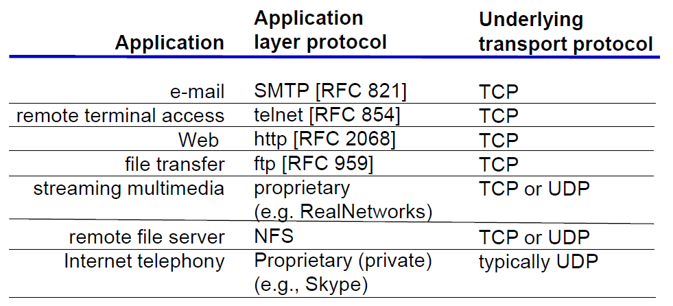
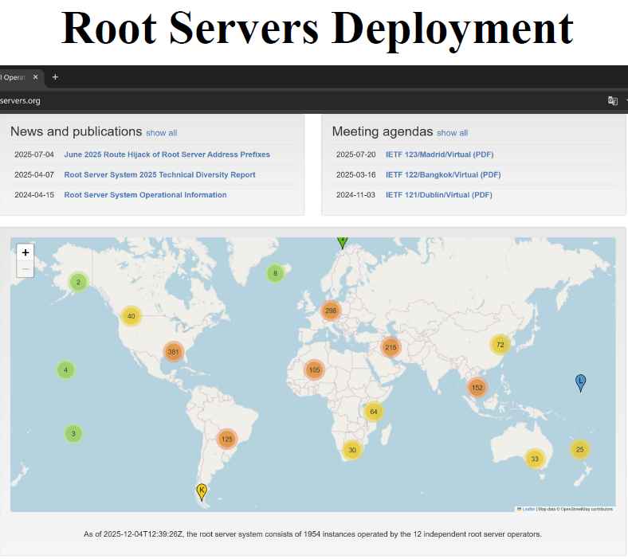
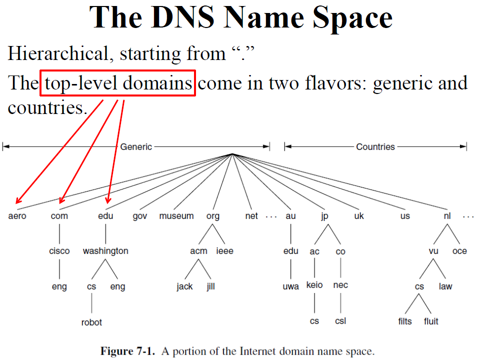
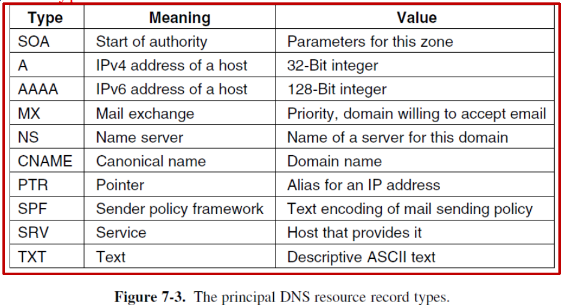
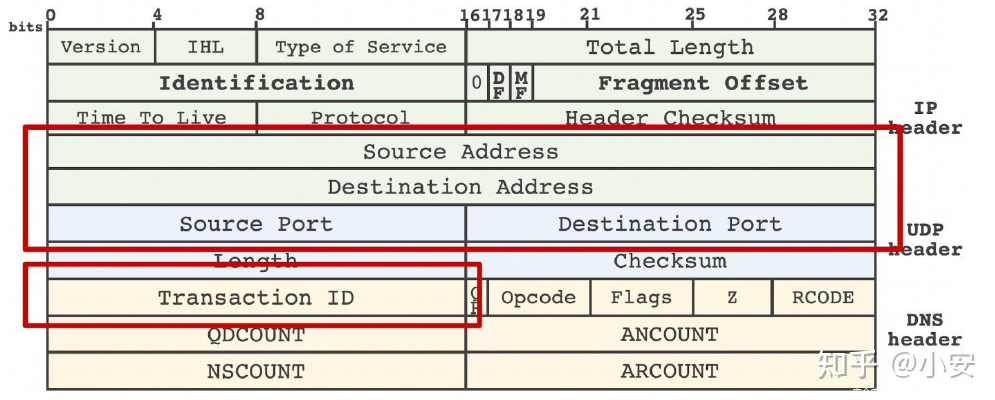
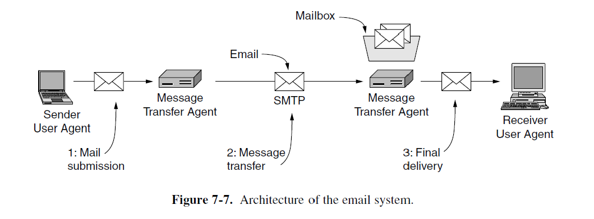
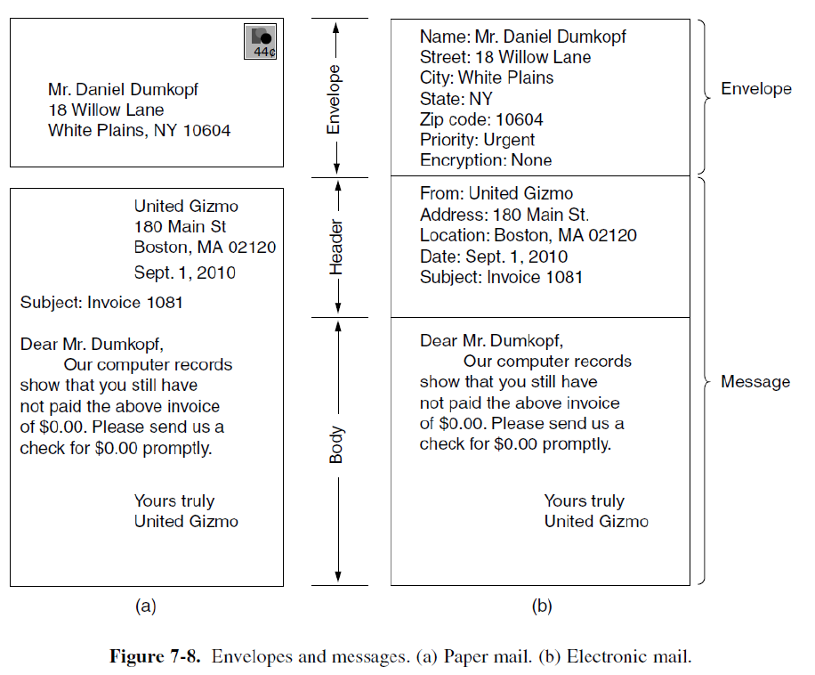

# 7 Application Layer

!!! tip "说明"

    本文档正在更新中……

!!! info "说明"

    本文档仅涉及部分内容，仅可用于复习重点知识

## 1 Overview of Application Layer

应用程序需要的传输层服务：

1. data loss：音视频流媒体可以容忍少量数据丢失，而文件传输或远程登录必须保证数据完整无误
2. bandwidth：对带宽敏感的应用程序（如多媒体）需要保证一定量的最大带宽。弹性应用程序是指可以使用任何可用带宽
3. timing：某些应用程序（如网络电话）要求低延迟才能有效工作

<figure markdown="span">
    { width="600" }
</figure>

<figure markdown="span">
    { width="600" }
</figure>

## 2 DNS

**Domain Name System**

网络资源通过 IP 地址定位，但 IP 地址难以记忆。如果服务器更换 IP 地址，所有用户都需要更新地址信息，这在实际操作中非常不便。DNS 通过引入易读的域名来代表 IP 地址，实现了名称与地址的分离。这样用户只需记住域名，而不必关心背后具体的 IP 地址，即使服务器地址变更，也只需在 DNS 系统中更新映射关系，对用户透明

DNS 采用层次化、基于域名的命名体系，便于组织和管理。实现为一个分布式数据库系统，不同层级的域名由不同的服务器负责解析，提高了可扩展性和可靠性

应用程序通过调用解析器发起域名查询，解析器负责向 DNS 服务器发送请求并获取 IP 地址

DNS 查询和响应通常使用 UDP 协议传输，这是因为 UDP 具有低开销、速度快的特点，适合频繁的小数据量查询

!!! question "为什么 DNS 采用分布式系统而非集中式结构"

    集中式系统的缺点：

    1. 单点故障：如果中心服务器宕机，整个域名系统将瘫痪
    2. 流量负载：所有域名查询都集中到一台服务器，会造成巨大的网络流量和处理压力
    3. 延迟问题：地理位置遥远的用户访问集中式服务器时，响应速度会明显变慢
    4. 扩展性限制：随着网络规模扩大，集中式系统难以应对日益增长的域名管理需求

三类主要 DNS 服务器：

1. root DNS servers：位于层次结构的顶端，负责指向顶级域（TLD）服务器
2. top level domain (TLD) DNS servers：管理特定顶级域（如 .com、.org、.cn 等）下的域名信息
3. authoritative DNS servers：直接存储特定域名（如 example.com）的 IP 地址记录，是该域名的最终权威信息来源

<figure markdown="span">
    { width="600" }
</figure>

根域名服务器共有 13 个逻辑名称（a.root-servers.net 到 m.root-servers.net），对应 13 个 IP 地址。每个逻辑名称背后实际上是一个由多台物理服务器组成的集群，这种复制架构提高了系统的安全性和容错能力。所有 DNS 服务器都需要知道根服务器的地址，这通常通过名为 named.ca 的配置文件实现，其中缓存了根服务器的地址

IP 任播是根服务器实现高可用性和低延迟访问的核心技术。通过在不同地理位置部署相同 IP 地址的服务器实例，用户请求会自动路由到最近的实例

根服务器同时支持 IPv4 和 IPv6 协议，确保与新旧网络设备的兼容性

<figure markdown="span">
    { width="600" }
</figure>

<figure markdown="span">
    { width="600" }
</figure>

通用顶级域名 gTLD：目前已有 22 个以上。每个 gTLD 有特定的注册和使用政策（如 .edu 限于教育机构，.gov 限于政府）

国家代码顶级域名：每个国家/地区分配一个双字母代码（如 .cn 代表中国）。2010 年后开始支持国际化域名（如中文、阿拉伯文等字符）。许多小国家通过商业授权其 ccTLD 获得收入（如 .tv 被视频行业广泛使用）

为了避免单一信息源带来的风险，DNS 采用分区域管理的方式。一个 DNS 区域是 DNS 命名空间中一段连续的、逻辑上独立的部分。各区域之间互不重叠，确保每个域名记录只由一个区域负责。每个区域由一个或多个域名服务器进行管理，这些服务器存储该区域的所有 DNS 记录

<figure markdown="span">
    { width="600" }
</figure>

一个域可以完全属于一个区域，也可以进一步 delegation（授权，委托）给下级区域管理。例如：zju.edu.cn 被委托给浙江大学管理，形成独立的区域，而 cs.zju.edu.cn 仍属于该区域，除非再被委托出去

<figure markdown="span">
    { width="600" }
</figure>

<figure markdown="span">
    { width="600" }
</figure>

### 2.1 Domain Resources Records

资源记录是 DNS 系统中存储信息的基本单元，所有域名相关的数据都以资源记录的形式存储。这些记录共同构成了分布式的 DNS 数据库，是域名解析的数据基础

DNS 本质上是一个名称到资源记录的映射系统。当用户查询一个域名时，DNS 返回的是与该域名关联的一条或多条资源记录，而不仅仅是 IP 地址

每个资源记录由 5 个字段组成，构成一个标准化的五元组数据结构：(Domain_name, Time_to_live, Class, Type, Value)

1. 域名字段：作为主键，用于标识该记录属于哪个域。由于 DNS 数据库存储大量不同域的信息，该字段是查询时进行匹配和检索的关键依据
2. 生存时间字段：表示该记录在缓存中可以被保留的有效时长（单位通常为秒）。高 TTL 值表示记录很少变更，适合长期缓存。低 TTL 值表示记录可能频繁变更，需要频繁更新
3. Class 字段：用于标识资源记录所属的网络类别或协议族。对于互联网信息，它始终是 IN。对于非互联网信息，可以使用其他代码，但实际上这些很少见
4. Type 和 Value 字段

    1. SOA 记录（起始授权记录）：提供有关该域名服务器区域主要信息源的名称
    2. A 记录（IPv4 地址记录）：存储某个主机的 32 位 IPv4 地址
    3. AAAA 记录（IPv6 地址记录）：存储 128 位 IPv6 地址
    4. MX 记录（邮件交换记录）：指明负责接收该域电子邮件的邮件服务器主机名
    5. NS 记录（域名服务器记录）：指定负责该域或子域解析的权威域名服务器
    6. CNAME 记录（规范名称记录）：为域名创建别名，实现类似宏定义的指向功能
    7. PTR 记录（指针记录）：主要用于反向 DNS 查找，将 IP 地址映射回对应的主机名
    8. SRV 记录（服务定位记录）：扩展了 MX 记录的功能，可标识各种网络服务的主机和端口信息
    9. SPF 记录（发件人策略框架记录）：用于邮件防伪和防垃圾邮件，声明该域名的合法发件服务器
    10. TXT 记录（文本记录）：最初用于存储任意文本信息。现广泛用于域名验证、邮件安全策略和所有权声明

<figure markdown="span">
    { width="600" }
</figure>

---

当本地 DNS 服务器没有缓存所需的域名信息时，解析过程通常从根域名服务器开始。解析器会按照 DNS 层次结构逐级向下查询：根 → 顶级域（TLD）→ 权威域名服务器，直到获得最终的 IP 地址

<figure markdown="span">
    { width="600" }
</figure>

!!! tip "Recursive Queries"

    递归查询是一种全权委托式的查询方式，客户端（或本地 DNS 解析器）将查询任务完全交给递归 DNS 服务器处理，并等待最终结果

    客户端向本地 DNS 服务器发送一个递归查询请求。本地 DNS 服务器负责执行整个查询链：可能从根服务器开始，逐级向下查询 TLD 和权威服务器，直到获得最终 IP 地址。本地 DNS 服务器将最终结果返回给客户端

    优点：

    1. 客户端简化：终端设备或本地解析器只需发起一次查询，后续所有查询步骤均由递归服务器负责，降低了客户端的实现复杂度
    2. 性能优化：递归服务器可通过缓存先前查询结果（即 DNS 缓存）直接响应重复查询，减少解析链路的延迟，提升用户体验

    缺点：

    1. 服务器压力：递归服务器需要为每个首次查询的域名执行完整的迭代查询（从根开始逐级查询），高并发场景下容易成为性能瓶颈
    2. 安全风险：递归服务器若被攻击者控制或劫持，可能返回伪造的 DNS 响应（DNS 欺骗），导致用户被导向恶意站点。这也使得递归服务器成为 DDoS 攻击（如 DNS 放大攻击）的潜在目标或工具

!!! tip "Iterative Queries"

    迭代查询是一种分步推进的查询方式，解析器（如本地 DNS 服务器）主动、逐步地向不同层级的 DNS 服务器发起查询，每次获取更接近目标的线索，直至最终得到 IP 地址

    通常由本地 DNS 服务器（即递归 DNS 服务器）在执行递归查询过程中使用迭代查询来获取最终答案

    假设一个本地 DNS 解析器想要解析域名 www.cs.washington.edu

    1. 本地 DNS 服务器首先联系根 DNS 服务器。但根 DNS 服务器并不直接知道 www.cs.washington.edu 的 IP 地址，但它知道顶级域（TLD）服务器（例如 .edu 服务器）的 IP 地址。因此，它会将相关 TLD 服务器的 IP 地址返回给本地 DNS 解析器
    2. 本地 DNS 解析器接着联系 TLD 服务器。TLD 服务器随后提供域名 washington.edu 的权威 DNS 服务器的 IP 地址
    3. 最后，本地 DNS 解析器联系权威 DNS 服务器，该服务器提供 www.cs.washington.edu 的 IP 地址

    优点：

    1. 负载分散：由于本地 DNS 服务器负责逐步推进查询，根和 TLD 服务器只需提供下一级服务器的地址，减轻了中间服务器的负载
    2. 缓存共享：本地 DNS 服务器可以缓存查询结果，为同一网络内的多个客户端提供服务，提高整体解析效率

    缺点：

    1. 延迟累积：每次查询都需要往返一次网络通信，多级查询会叠加延迟，尤其在跨地域或网络拥堵时更明显
    2. 客户端复杂度：虽然对终端用户透明，但本地 DNS 服务器需要实现迭代查询逻辑，增加了其实现和维护复杂度

本地域名服务器可以由机构内部、设备本地、公共 DNS 服务提供。客户端设备通常通过 DHCP（动态主机配置协议）自动获取本地 DNS 服务器的地址，无需手动设置，便于网络管理

<figure markdown="span">
    { width="600" }
</figure>

早期 DNS 事务 ID 过短，仅 16 位，使得攻击者容易猜测或暴力匹配。缺乏加密与认证，查询与响应以明文传输，无法验证数据来源的真实性和完整性。这一设计使 DNS 容易遭受多种攻击，包括缓存投毒攻击（DNS cache poisoning，也称 DNS 欺骗，DNS spoofing）（攻击者向递归 DNS 服务器发送伪造的响应包，使其接受错误的域名—IP 映射，并缓存该恶意记录。伪造的响应必须匹配请求中的查询内容、事务 ID、源/目的 IP 与端口等字段）

<figure markdown="span">
    { width="600" }
</figure>

<figure markdown="span">
    { width="600" }
</figure>

DNS 欺骗攻击步骤：

1. 攻击者先查询两个他控制的域名，目的是：让 ISP 的 DNS 服务器缓存相关记录。观察并预测 ISP 使用的 DNS 事务 ID（序列号）生成规律
2. 攻击者发送一个查询，以获取当前使用的序列号 n
3. 攻击者立即查询目标域名 bob.com，迫使 ISP 的 DNS 服务器向 .com 权威服务器发起新一轮查询，此时序列号会递增为 n+1
4. 攻击者预测到序列号将是 n+1，并抢先向 ISP 发送伪造的 DNS 响应，声称 bob.com 的 IP 是 42.9.9.9（恶意地址）
5. 当真正的权威服务器返回合法响应时，ISP 已接受了伪造的响应并缓存了错误记录，因此真实响应被丢弃

<figure markdown="span">
    { width="600" }
</figure>

## 3 FTP

<figure markdown="span">
    { width="600" }
</figure>

FTP 的工作流程：

1. 建立连接：用户输入远程主机名后，本地 FTP 客户端会与远程 FTP 服务器通过 TCP 协议建立可靠连接
2. 身份验证：用户提供的用户名和密码通过已建立的 TCP 连接以 FTP 命令形式发送到服务器进行认证
3. 文件传输：认证成功后，用户可以在本地文件系统与远程文件系统之间双向传输文件

FTP 使用两条并行的 TCP 连接来传输文件：

1. control connection（控制连接）：用于在两个主机之间传递控制信息，例如传输命令和响应（如登录、切换目录、操作指令）。传输格式为 7 位 ASCII 文本，易于阅读和调试。由于控制信息和文件数据分开传输，因此 FTP 是 out-of-band（带外）传输的
2. data connection（数据连接）：专门用于实际的文件内容传输。在控制连接建立并验证身份后，按需建立数据连接进行文件的上传或下载

## 4 Email

电子邮件是一种异步通信媒介。电子邮件的发送和接收不需要双方同时在线，这与即时通信（如聊天）形成对比，提供了更高的灵活性

三个主要组成部分：

1. user agents（用户代理，UA）：用户直接交互的界面或应用程序，如 Outlook、Thunderbird 或网页版 Gmail。负责撰写、发送、接收和显示邮件
2. message transfer agents（邮件传输代理，MTA）：负责在后台传输邮件，接收来自用户代理的邮件并将其路由至目的地服务器，类似邮政系统中的邮局
3. simple mail transfer protocol（简单邮件传输协议，SMTP）：应用层协议，用于在邮件服务器之间（或从用户代理到邮件服务器）传输邮件，是电子邮件发送过程的核心协议

> 用户通过用户代理撰写邮件，经由 SMTP 协议发送给邮件服务器，再由邮件服务器通过 SMTP 将邮件转发至接收方的邮件服务器，最终由接收方通过其用户代理（可能使用 POP3/IMAP 协议）收取邮件

<figure markdown="span">
    { width="600" }
</figure>

!!! tip "User Agent"

    用户代理是用户与电子邮件系统交互的客户端软件或界面。它提供邮件撰写、收发、回复及邮箱管理的功能。如 Gmail（网页界面）、Outlook、Apple Mail、Thunderbird 等都是常见的用户代理

    邮件通常存储在邮件服务器上，而非仅仅本地。用户代理通过标准协议（如 SMTP、POP3、IMAP）与服务器交互，实现邮件的同步与管理

### 4.1 SMTP

SMTP 是互联网邮件传输的核心协议，由 RFC 5321 定义。使用 TCP 作为传输层协议，确保邮件传输的可靠性

SMTP 采用客户端-服务器架构，每个邮件服务器既充当客户端（向其他服务器发送邮件），也充当服务器（接收来自其他服务器的邮件）。发送时，发件人邮件服务器作为 SMTP 客户端，收件人邮件服务器作为 SMTP 服务器

SMTP 最初设计仅支持 7 位 ASCII 文本，因此无法直接传输二进制文件（如图片、音频等）。为解决这个问题，通常使用如 MIME（多用途互联网邮件扩展）等编码方式将二进制数据转换为 ASCII 格式进行传输，接收方再将其解码还原

SMTP 采用端到端直接传输模式，不依赖中间邮件服务器进行接力转发。无论发送方和接收方服务器距离多远，都会建立直接连接

连接建立过程：发送方邮件服务器作为 SMTP 客户端，通过 TCP 向接收方邮件服务器的 25 号端口发起连接。这是 SMTP 的标准服务端口。如果目标服务器未响应，客户端会进行重试，确保邮件最终能被送达

连接建立后，双方通过应用层握手交换信息，客户端告知发件人和收件人邮箱地址，服务器验证是否接受该邮件请求。身份确认后，邮件内容通过同一 TCP 连接传输。如果有多个邮件发往同一服务器，可在同一连接内连续发送，提高传输效率。完成所有邮件传输后，连接被正常关闭

### 4.2 Email Message Format

最初由 RFC 822 定义，后更新为 RFC 5322，并扩展了 MIME 等机制以支持多媒体内容（如图片、音频、附件等）

消息格式的一个核心概念是 envelop（信封）和 content（内容）的区分：

1. envelop：类比传统邮政系统，信封上写明收件人地址、优先级等信息，用于邮件的路由与投递。SMTP 命令中使用的 `MAIL FROM:` 和 `RCPT TO:` 实际上就是信封信息
2. 内容（消息本身）：包括头部和正文，是用户实际看到和交互的部分

    1. 头部：包含元数据和控制信息，如发件人、收件人、日期、主题、内容类型等，供邮件客户端解析和处理
    2. 正文：邮件的实际内容，可以是纯文本、HTML 或包含多媒体内容的 MIME 格式

<figure markdown="span">
    { width="600" }
</figure>

!!! tip "RFC 5322 —— The Internet Message Format"

    | Header | Meaning |
    | -- | -- |
    | To: | 指明邮件的主要接收者 |
    | Cc: | 抄送。邮件同时发送给其他相关人员 |
    | Bcc: | 密件抄送。收件人不会看到其他 Bcc 接收者 |
    | From: | 表示邮件的创建者或名义发件人 |
    | Sender: | 表示实际发送邮件的地址，可能与 From 不同（如秘书代经理发信） |
    | Received: | 记录邮件经过每个邮件服务器的信息，用于追踪路由 |
    | Date: | 记录邮件的发送时间，用于排序和归档 |
    | Reply-To: | 指定回复地址，可与发件人地址不同，例如用于反馈邮箱或邮件列表 |
    | Message-Id: | 每封邮件的全局唯一标识符，便于追踪与引用 |
    | In-Reply-To: | 说明此邮件是回复哪一封邮件，指向原邮件的 Message-Id |
    | References: | 列出所有相关的 Message-Id，用于建立邮件对话线索 |
    | Keywords: | 用户自定义关键词，便于分类与搜索 |
    | Subject: | 邮件主题，用于邮件列表中的简要显示和快速识别 |

!!! tip "MIME"

    The Multimedia Internet Mail Extension

    它是对原始电子邮件协议（SMTP 和 RFC 5322）的扩展，以支持非 ASCII 文本和多媒体内容。MIME 使用 type/subtype 的格式标识内容类型，并可附加参数以进一步说明

    <figure markdown="span">
        { width="600" }
    </figure>

