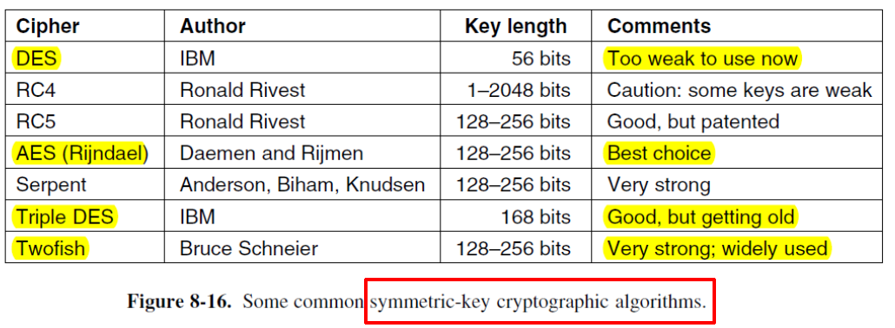

# 8 Network Security

!!! warning "注意"

    本文档已停止更新

!!! info "说明"

    本文档仅涉及部分内容，仅可用于复习重点知识

网络安全问题大致可分为四个紧密关联的领域：

1. secrecy：机密性
2. authentication：身份认证
3. nonrepudiation：不可否认。防止参与方事后否认已执行的操作
4. integrity control：完整性控制

除了物理层面的安全措施，现代网络安全主要依赖于密码学技术来实现上述保护机制

## 1 Cryptography

Kerckhoff's Principle：强调密码系统的安全性不应依赖于算法的保密，而应依赖于密钥的保密。这意味着算法可以公开分析和检验，系统的安全完全由密钥保证

密钥越长，可能的密钥组合越多，攻击者通过穷举法（暴力破解）所需尝试的次数呈指数增长，从而大幅提高破解的难度和成本

加密方法可分为两类：

1. Substitution Ciphers：替换密码。将明文中的每个字符替换为另一个字符
2. Transposition Ciphers：换位密码。保持字符不变，但改变它们在明文中的排列顺序

!!! example "Caesar Cipher"

    一种最简单的替换密码，每个字母在字母表中固定偏移（如偏移 3 位）。推广后的凯撒密码允许任意偏移量 k，此时 k 就是密钥，加密安全性略有提升

    进一步采用随机的一对一映射，而不是简单的字母表移位。这种方法的密钥空间更大，安全性高于凯撒密码，但仍可能通过频率分析被破解

<figure markdown="span">
    { width="600" }
</figure>

两个基本密码学原理：

1. 冗余性：加密消息中必须包含一些额外的信息（如校验和、特定格式、数字签名或协议字段），这些信息并非有效载荷本身，而是用于验证消息的真实性和完整性
2. 新鲜性：必须确保接收到的消息是最新的，而不是攻击者重放的旧消息。重放攻击是一种常见威胁，攻击者截获并重新发送之前有效的消息，以欺骗系统

## 2 Symmetric-key Algorithms

加密和解密使用同一个密钥，或两个可以简单互推的密钥

<figure markdown="span">
    { width="600" }
</figure>

block ciphers：分组密码是一种对称加密的实现方式，它将明文分割成固定长度（如 64 位或 128 位）的数据块，并对每个块分别加密

<figure markdown="span">
    { width="600" }
</figure>

1. P-box：通过置换（即重新排列）输入比特的位置，来实现扩散性。扩散是指让明文的一个比特变化影响密文中多个比特的变化，从而隐藏明文的统计特征，使得攻击者难以通过分析密文来推测明文
2. S-box：通过代换（即查表替换）将输入比特映射为输出比特，来实现非线性变换。非线性是指输出与输入之间的关系不是简单的线性函数（如异或、移位），这能有效抵抗线性密码分析等攻击

Product Cipher：乘积密码。指将多个简单的密码组件（如 P-盒 和 S-盒）组合连接起来，形成一个更复杂、更安全的整体密码算法。典型的对称密钥长度 k 为 64 到 256 位，以确保足够的密钥空间。在硬件实现中，常常会设计至少 10 轮的变换层

<figure markdown="span">
    { width="600" }
</figure>

## 3 Public-Key Algorithms

Diffie 和 Hellman 提出了一种新型密码体系（公钥密码学），其核心是加密与解密使用不同的密钥，且解密密钥不能从加密密钥推导出来

公钥系统的三大基本要求：

1. 可逆性：使用解密函数 D 作用于已加密的消息 E(P) 必须能恢复原始明文 P
2. 计算不可行性：从公钥 E 推导私钥 D 在计算上是不可行的
3. 抗选择明文攻击：即使攻击者能使用公钥加密任意明文，也无法借此破解系统

密钥结构：

1. 公钥：公开给任何人，用于加密发送给该用户的消息
2. 私钥：仅用户自己持有，用于解密收到的密文

!!! example "典型算法"

    1. RSA
    2. ECC

## 4 Digital Signatures

数字签名的目的：解决数字文档的真实性与身份验证问题，其作用类似于纸质文件中的手写签名，但基于密码学技术实现，具有更高的安全性和不可伪造性

数字签名基本要求：

1. 可验证性：接收方能够通过公开信息（如公钥）验证签名是否有效
2. 不可否认性：签名只能由发送方的私钥生成，因此发送方不能抵赖其签署行为
3. 不可伪造性：接收方或任何第三方无法伪造有效签名或相应消息，因为缺少发送方的私钥

!!! tip "Replay Attack"

    回放攻击：攻击者截获合法的通信数据，并在之后某个时间重新发送该数据，以欺骗系统误认为是一次新的合法请求。即使数据是加密的，攻击者可能不理解其内容，但仍可通过重放实现攻击目的

    攻击者可能通过 IP 数据包替换伪装成合法用户，进而实施中间人攻击的一种变体

    防御措施：

    1. 使用时间戳：每个消息包含一个时间戳，接收方只接受一定时间窗口内的消息，过时的消息将被拒绝
    2. 使用一次性随机数（Nonce）：例如 R 指一个仅使用一次的随机数或序列号，系统会记录已使用过的随机数，重复使用将被视为无效

message digests：消息摘要（哈希函数）。传统签名需要对整个消息进行加密，同时实现认证和保密，但很多时候只需认证，不需加密。哈希函数提供了一种更高效且专注的认证方式

单向哈希函数将任意长度的输入映射为固定长度的输出。它不是加密，而是一种摘要生成，无法从哈希值还原原始数据

1. 高效性：计算哈希值非常快速，适用于大量数据的处理
2. 单向性：无法从哈希值反推原文，即使知道哈希结果，原文也应该是不可恢复的
3. 抗碰撞性：难以找到两个不同的输入，使它们的哈希值相同。这确保了唯一性与完整性，是数字签名安全的基础
4. 雪崩效应：输入的任何微小变化都会导致输出哈希值发生显著且不可预测的变化，这有助于检测任何篡改

哈希长度至少 128 位（16 字节）才能有效抵抗碰撞攻击

!!! example "典型算法"

    1. MD5
    2. SHA-1
    3. SHA-2

## 5 Management of Public Keys

如何安全地获取一个陌生人的公钥，并确保该公钥确实属于其声称的所有者？简单地将公钥发布在网站、论坛或邮件中，无法抵抗中间人攻击或冒充攻击

certification authority：CA 是一个受信任的第三方组织，负责核实用户身份，并签发数字证书，以证明某个公钥确实属于特定实体

数字证书本质上是一个电子文档，其中包含：主体的名称、主体的公钥、签发该证书的 CA 信息、有效期、其他扩展信息。该文档由 CA 用自己的私钥进行数字签名，从而形成签名块

CA 会计算证书内容的哈希值，并用其私钥对该哈希值进行签名。当用户收到证书时，可用 CA 的公钥验证签名，从而确认完整性和真实性

public key infrastructures（PKI）：公钥基础设施。提供一个标准化框架，规定各组件如何交互、证书格式、签发流程、撤销机制等。确保不同 CA 和系统之间的互操作性

1. 用户：证书的申请者和使用者
2. CA（认证机构）：负责审核身份并签发证书
3. 证书：绑定身份与公钥的电子凭证
4. 目录：用于存储和分发证书及证书状态信息

CA 层次结构（典型的 PKI 结构）：通常是一个树状信任链

1. 根 CA：位于最顶端，是信任的起点，其公钥预先嵌入在操作系统或浏览器中
2. 中间 CA：由根 CA 授权签发，可进一步为用户或其他下级 CA 签发证书
3. 终端用户/服务器：持有由中间 CA 或根 CA 签发的证书

## 6 Communication Security

IPsec：是网络层（IP 层）的安全协议套件，用于为 IP 数据包提供端到端的安全性。IPsec 不绑定于特定加密或哈希算法，而是允许在协商过程中动态选择算法。这种可插拔设计使得 IPsec 可以灵活应对未来密码学进展或算法被破解的风险

IPsec 可以在不同层次上应用安全策略：

1. 传输模式：保护单个 TCP/UDP 连接（端到端保护）
2. 隧道模式：保护整个 IP 数据包（常用于路由器间 VPN，或主机到网关的场景）

尽管 IP 协议本身是无连接的，但 IPsec 引入了面向连接的安全机制，即通信双方需要事先建立安全参数（如加密算法、密钥等）并维持一段时间内的安全状态

SA 是 IPsec 的基本安全单元，表示两个端点之间在一个方向上的安全通信通道。每个 SA 包含：安全协议（AH 或 ESP）、加密/认证算法、密钥材料、序列号（用于防重放）、生存期等参数

SA 是单工的，意味着一个 SA 仅保护从 A 到 B 或从 B 到 A 的流量。因此，双向安全通信需要两个独立的 SA，每个方向一个

每个 SA 都有一个唯一的安全参数索引（SPI），它和目的 IP 地址、安全协议一起唯一标识一个 SA

IPsec 协议的两大组成部分：

1. 数据包安全封装协议：定义了两种安全协议头，可直接嵌入 IP 数据包中，实现对数据包的保护

    1. AH（认证头部）：提供数据完整性、数据源认证和可选的防重放保护。不提供加密，因此仅适用于不需要机密性的场景
    2. ESP（封装安全载荷）：可同时提供机密性（加密）、数据完整性、数据源认证和防重放保护。是目前 IPsec 中最常用、功能最全的安全协议

2. 密钥管理框架与协议：ISAKMP 是一个通用框架，定义了协商、建立、修改和删除安全关联（SA）的流程和报文格式，但它本身不规定具体的密钥交换方法。IKE 是基于 ISAKMP 框架实现的实际密钥交换协议，用于动态地协商和建立 SA，并安全地交换密钥材料。

## 7 Authentication Protocols

## 8 Email Security

## 9 Web Security