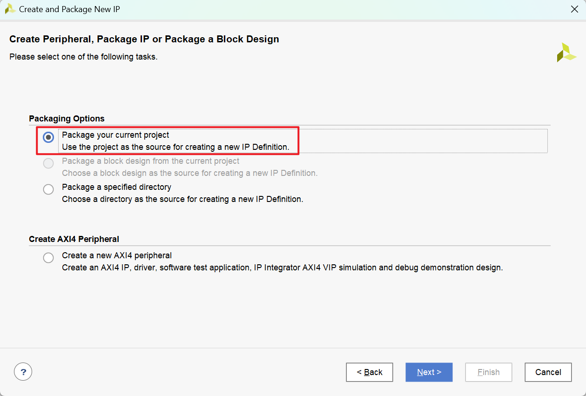
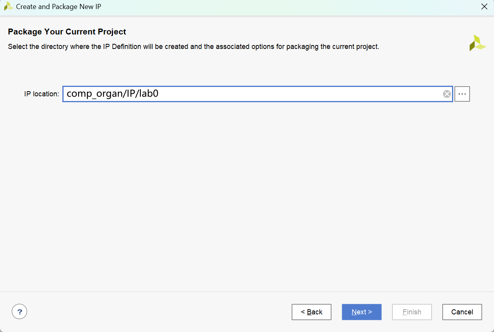
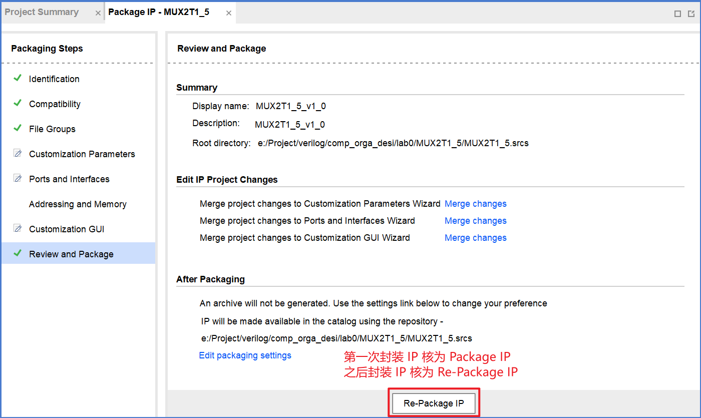
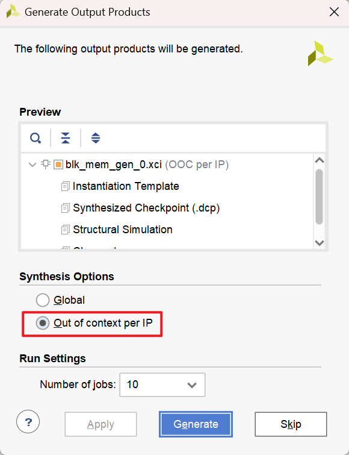

# Lab 0: Vivado 介绍与模块封装

<!-- !!! tip "说明"

    本文档正在更新中…… -->

!!! warning "注意"

    1. 官方 ppt 部分内容存在错误，请注意辨别
    2. 具体的 verilog 代码请先根据官方 ppt 自行完成，本文档不提供全部的 verilog 代码，仅作参考和提示作用
    3. 本文档为个人经验，具体情况具体分析

## 实验目标

1. 熟悉 Vivado 模块设计流程（此内容本文档暂不涉及）
2. 完成 Water_LED 的设计
3. 完成 18 个模块设计，并封装为 IP 核（此 18 个模块 IP 核后续实验会多次调用）
4. 完成 muxctrl 模块设计

---

ROM 和 RAM 的生成建议在使用时再生成，不建议封装为 IP 核

## 准备工作

为便于管理和调用所有 lab 相关文件，建议如下操作：

!!! warning "注意"

    保证所有路径全都为英文路径

1. 新建文件夹 `comp_organ`，存放所有本次课程的 lab 相关文件
2. 新建 `comp_organ/project`，存放所有 Vivado 的工程文件
3. 新建 `comp_organ/IP`，存放所有 IP 核文件

## 0.1 Water_LED 的设计

新建 `comp_organ/project/lab0/`，在此目录下创建 Vivado 工程，命名为 `Water_LED`

---

新建源文件 `Water_LED.v`，实现 4 个 LED 灯依次点亮的效果

要实现每隔一段时间，熄灭原 LED 灯，点亮下一个 LED 灯的效果，可以新建一个计数器变量 `count`，每过一个时钟周期，`count` 加 1，每次 `count` 达到某个值，重置 `count` 并更新 `LED` 即可

verilog 代码如下：

```verilog title="Water_LED" linenums="1"
module Water_LED (
    input clk,
    input rst,

    output reg [3:0] LED
);

    reg [31:0] count;

    always @(posedge clk) begin
        if (rst) begin  // 重置
            LED <= 4'b0001;
            count <= 32'b0;
        end else begin
            if (count == 32'd100_000_000) begin  // count 每达到 100_000_000
                count <= 32'b0;  // count 重置为 0
                // 更新 LED
                if (LED == 4'b1000) begin
                    LED <= 4'b0001;
                end else begin
                    LED <= LED << 1;
                end
            end else begin
                count <= count + 1'b1;
                LED <= LED;
            end
        end
    end

endmodule
```

---

新建 `Water_LED_tb.v` testbench 文件

```verilog title="Water_LED_tb.v" linenums="1"
module Water_LED_tb();
    reg clk;
    reg rst;
    
    wire [3:0] LED;

    Water_LED Water_LED_0 (
        .clk(clk),
        .rst(rst),
        .LED(LED)
    );

    always begin
        #5 clk = ~clk;
    end

    initial begin
        clk = 1'b0;
        rst = 1'b1;
        #100;
        rst = 1'b0;
    end

endmodule
```

进行仿真验证

---

新建 `Water_LED_xdc.xdc` 引脚约束文件

```verilog title="Water_LED_xdc.xdc" linenums="1"
set_property IOSTANDARD LVCMOS33  [get_ports  clk]
set_property PACKAGE_PIN E3       [get_ports  clk]
set_property IOSTANDARD LVCMOS33  [get_ports  rst]
set_property PACKAGE_PIN C12      [get_ports  rst]

set_property -dict { PACKAGE_PIN H17   IOSTANDARD LVCMOS33 } [get_ports { LED[0] }]; 
set_property -dict { PACKAGE_PIN K15   IOSTANDARD LVCMOS33 } [get_ports { LED[1] }]; 
set_property -dict { PACKAGE_PIN J13   IOSTANDARD LVCMOS33 } [get_ports { LED[2] }]; 
set_property -dict { PACKAGE_PIN N14   IOSTANDARD LVCMOS33 } [get_ports { LED[3] }]; 
```

---

综合、实现、生成比特流文件，进行上板验证

## 0.2 模块设计

### MUX

`MUXaTb_c`：表示 c 位 a 选 b MUX

##### MUX2T1_5

在目录 `comp_organ/project/lab0/` 下创建 Vivado 工程，命名为 `MUX2T1_5`

---

新建 `MUX2T1_5.v` 源文件

```verilog title="MUX2T1_5.v" linenums="1"
module MUX2T1_5 (
    input [4:0] I0,
    input [4:0] I1,
    input s,
    
    output [4:0] o
);

    assign o = s ? I1 : I0;

endmodule
```

#### IP 核生成

根据 ppt 将此工程文件封装为 IP 核

在本门课程中，有如下建议：

1.使用含源文件的封装方法

2.无论是第一次封装 IP 核还是之后重新封装 IP 核，都选择第一个选项 —— 封装整个工程文件

<figure markdown="span">
    { width="600" }
</figure>

3.将 IP Location 修改为 `comp_organ/IP/{name}`，例如本 IP 核存放在 `comp_organ/IP/lab0` 中

<figure markdown="span">
    { width="600" }
</figure>

点击 next 后，会弹出“是否拷贝工程到新路径下”的提示框，点击 OK 即可，之后自动打开拷贝后的工程文件，在此文件中继续后续操作即可

<figure markdown="span">
    { width="400" }
</figure>

<figure markdown="span">
    { width="600" }
</figure>

##### MUX2T1_8

在目录 `comp_organ/project/lab0/` 下创建 Vivado 工程，命名为 `MUX2T1_8`

---

新建 `MUX2T1_8.v` 源文件

```verilog title="MUX2T1_8.v" linenums="1"
module MUX2T1_8 ( 
    input [7:0] I0, 
    input [7:0] I1, 
    input s, 

    output [7:0] o 
); 
 
    assign o = s ? I1 : I0;

endmodule
```

> 下文只提供 verilog 代码，其余部分省略

##### MUX2T1_32

```verilog title="MUX2T1_32.v" linenums="1"
module MUX2T1_32 ( 
    input [31:0] I0, 
    input [31:0] I1, 
    input s, 

    output [31:0] o 
); 
 
    assign o = s ? I1 : I0;

endmodule
```

##### MUX2T1_64

```verilog title="MUX2T1_64.v" linenums="1"
module MUX2T1_64 ( 
    input [63:0] I0, 
    input [63:0] I1, 
    input s, 

    output [63:0] o 
); 
 
    assign o = s ? I1 : I0;

endmodule
```

##### MUX4T1_5

```verilog title="MUX4T1_5.v" linenums="1"
module MUX4T1_5 ( 
    input [4:0] I0, 
    input [4:0] I1, 
    input [4:0] I2, 
    input [4:0] I3, 
    input [1:0] s, 

    output [4:0] o 
); 
 
    assign o = s[0] ? (s[1] ? I3 : I1) : (s[1] ? I2 : I0);

endmodule
```

##### MUX4T1_32

```verilog title="MUX4T1_32.v" linenums="1"
module MUX4T1_32 ( 
    input [31:0] I0, 
    input [31:0] I1, 
    input [31:0] I2, 
    input [31:0] I3, 
    input [1:0] s, 

    output [31:0] o 
); 
 
    assign o = s[0] ? (s[1] ? I3 : I1) : (s[1] ? I2 : I0);

endmodule
```

##### MUX8T1_8

```verilog title="MUX8T1_8.v" linenums="1"
module MUX8T1_8 ( 
    input [7:0] I0, 
    input [7:0] I1, 
    input [7:0] I2, 
    input [7:0] I3, 
    input [7:0] I4, 
    input [7:0] I5, 
    input [7:0] I6, 
    input [7:0] I7, 
    input [2:0] s, 

    output [7:0] o 
); 
 
    assign o = (s == 3'b000) ? I0 : 
               (s == 3'b001) ? I1 : 
               (s == 3'b010) ? I2 : 
               (s == 3'b011) ? I3 : 
               (s == 3'b100) ? I4 : 
               (s == 3'b101) ? I5 : 
               (s == 3'b110) ? I6 : I7;

endmodule
```

##### MUX8T1_32

```verilog title="MUX8T1_32.v" linenums="1"
module MUX8T1_32 ( 
    input [31:0] I0, 
    input [31:0] I1, 
    input [31:0] I2, 
    input [31:0] I3, 
    input [31:0] I4, 
    input [31:0] I5, 
    input [31:0] I6, 
    input [31:0] I7, 
    input [2:0] s, 

    output [7:0] o 
); 
 
    assign o = (s == 3'b000) ? I0 : 
               (s == 3'b001) ? I1 : 
               (s == 3'b010) ? I2 : 
               (s == 3'b011) ? I3 : 
               (s == 3'b100) ? I4 : 
               (s == 3'b101) ? I5 : 
               (s == 3'b110) ? I6 : I7;

endmodule
```

### 算数模块

##### add32

```verilog title="add32.v" linenums="1"
module add32 ( 
    input [31:0] A, 
    input [31:0] B, 

    output [31:0] C
); 
 
    assign C = A + B;  // 无进位加法 

endmodule 
```

##### ADC32

此模块减法运算时，运算数 b 未进行取反操作，取反操作在此模块外部完成

```verilog title="ADC32.v" linenums="1"
module ADC32 ( 
    input [31:0] A, 
    input [31:0] B, 
    input C0, 

    output [32:0] S 
); 
 
    wire B_Notation = C0 ^ 1'b0;  // 判断运算类型，C0 为 1 是减法，为 0 是加法 

    assign S = {1'b0, A} + {B_Notation, B} + C0;  // 实现加减法运算 
    // 当加法运算时，S = A + B（C0 为 0） 
    // 当减法运算时，S = A + B（此时 B 尚未进行反码操作） + 1（C0 为 1） 

endmodule
```

### 逻辑运算模块

##### and32

```verilog title="and32.v" linenums="1"
module and32 ( 
    input [31:0] A, 
    input [31:0] B, 

    output [31:0] res 
); 
 
    assign res = A & B; 

endmodule
```

##### or32

```verilog title="or32.v" linenums="1"
module or32 ( 
    input [31:0] A, 
    input [31:0] B, 

    output [31:0] res 
); 
 
    assign res = A | B; 

endmodule
```

##### nor32

```verilog title="nor32.v" linenums="1"
module nor32 ( 
    input [31:0] A, 
    input [31:0] B, 

    output [31:0] res 
); 
 
    assign res = ~ (A | B); 

endmodule
```

##### xor32

```verilog title="xor32.v" linenums="1"
module xor32 ( 
    input [31:0] A, 
    input [31:0] B, 

    output [31:0] res 
); 
 
    assign res = A ^ B; 

endmodule
```

### 其他模块

##### or_bit_32

判断运算数是否全 0

```verilog title="or_bit_32.v" linenums="1"
module or_bit_32 ( 
    input [31:0] A, 

    output o 
); 
     
    assign o = !(|A);  // 逐位或操作，全 0 时则为 0，再取反变为 1

endmodule
```

##### SignalExt_32

位扩展模块

```verilog title="SignalExt_32.v" linenums="1"
module SignalExt_32 ( 
    input S, 

    output [31:0] So 
); 
     
	assign So = {32{S}}; 

endmodule
```

##### srl_32

右移模块

```verilog title="srl_32.v" linenums="1"
module srl_32 ( 
    input [31:0] A, 
    input [31:0] B, 

    output [31:0] res 
); 
     
    assign res = A >> B[4:0]; 

endmodule
```

##### Ext_32

位拼接模块

```verilog title="Ext_32.v" linenums="1"
module Ext_32 ( 
    input [15:0] imm_16, 

    output [31:0] imm_32 
); 
 
    assign imm_32 = {{16{imm_16[15]}}, imm_16}; 

endmodule
```

## 0.3 muxctrl 的设计

在目录 `comp_organ/project/lab0/` 下创建工程文件，命名为 `muxctrl`

### 调用 IP 核

根据 ppt 内容，在 IP -> Repository 下添加路径 `comp_organ/IP`，Vivado 会识别该路径下所有的 IP 核

之后可在 IP Catalog 中生成所需要的 IP 核

虽然 ppt 上建议生成 IP 核时选择 Global，但我个人建议选择 Out of context per IP

<figure markdown="span">
    { width="600" }
</figure>

### muxctrl

新建 `muxctrl.v` 源文件

根据连接图编写 verilog 代码

<embed src="../../../../../file/computer_organization/lab0/lab0_doc1.pdf" type="application/pdf" width="100%" height="500" />

可以进行仿真验证

添加 xdc 文件，上板验证