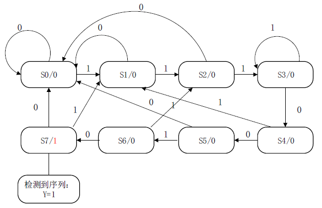

# Lab 1: ALU、Regfiles 设计与有限状态机

<!-- !!! tip "说明"

    此文档正在更新中…… -->

!!! warning "注意"

    1. 官方 ppt 部分内容存在错误，请注意辨别
    2. 具体的 verilog 代码请先根据官方 ppt 自行完成，本文档不提供全部的 verilog 代码，仅作参考和提示作用

## 实验目标

1. ALU 的设计（后续实验会调用）
2. Register Files 的设计（后续实验会调用）
3. 有限状态机

## 1.1 ALU 的设计

### ALU 功能描述

| ALU 控制信号 | 功能 |
|:-------:|:-------:|
| 000     | and        |
| 001     | or        |
| 010     | add        |
| 110     | sub        |
| 111     | slt（若 A < B，则 res 为 1）|
| 100     | nor        |
| 101     | srl        |
| 011     | xor        |

### ALU

新建 `comp_organ/project/lab1/`，在此目录下创建工程文件，命名为 `ALU`

---

生成并调用相应的 IP 核，新建 `ALU.v` 源文件，根据连接图编写 verilog 代码

<embed src="../../../../../file/computer_organization/lab1/lab1_doc1.pdf" type="application/pdf" width="100%" height="500" />

---

编写 testbench 文件进行仿真验证

## 1.2 Register Files

### 功能描述

1. 该模块含 32 个 32 位寄存器（RISC-V 中的 32 个寄存器），其中 `r0` 恒为 0（RISC-V 中的 x0 寄存器）
2. 包含两个读端口 `Rs1_addr` `Rs2_addr`，其数值表示寄存器的地址（号码），并在端口 `Rs1_data` `Rs2_data` 输出相应寄存器的值。例如若 `Rs1_addr = 10` `Rs2_addr = 11`，而此刻寄存器的值为 `r10 = 156` `r11 = 123`，则输出 `Rs1_data = 156` `Rs2_data = 123`
3. 包含写控制信号 `RegWrite` 和写端口 `Wt_addr` `Wt_data`，当 `RegWrite = 1` 时，此模块的写功能才能开启，将 `Wt_data` 的值写进地址为 `Wt_addr` 的寄存器当中
4. 注意所有操作不能改变 `r0` 寄存器的值

### regs

在目录 `comp_organ/project/lab1/regs` 下创建工程文件，命名为 `regs`

---

生成并调用相应的 IP 核，新建 `regs.v` 源文件，根据 ppt 和上述功能描述，编写 verilog 代码

---

编写 testbench 文件进行仿真验证

## 1.3 有限状态机

### 状态图

<figure markdown="span">
    { width="600" }
</figure>

### seq

在目录 `comp_organ/project/lab1/` 下创建工程文件，命名为 `seq`

---

新建 `seq.v` 源文件，根据 ppt 和状态图，编写 verilog 代码

---

编写 testbench 文件进行仿真验证