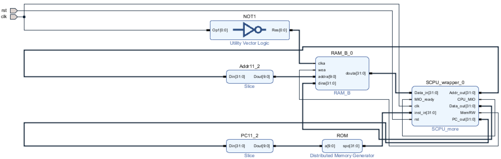
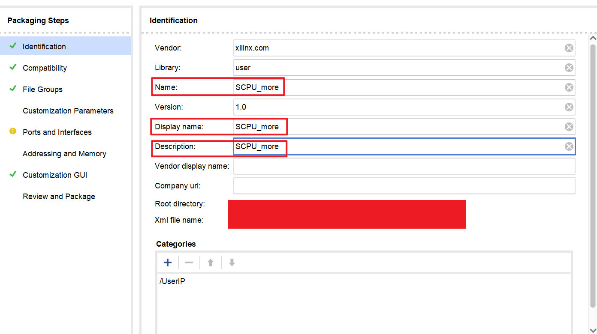

# Lab 4: 单周期 CPU

<!-- !!! tip "说明"

    本文档正在更新中…… -->

!!! warning "注意"

    1. 官方 ppt 部分内容存在错误，请注意辨别
    2. 具体的 verilog 代码请先根据官方 ppt 自行完成，本文档不提供全部的 verilog 代码，仅作参考和提示作用
    3. 本文档为个人经验，具体情况具体分析

## 实验内容

1. 利用课件给出的 DataPath 和 Controller，构建 CPU 核
2. 设计 DataPath
3. 设计 Controller
4. 实现指令扩展
5. 实现 CPU 中断处理

## 4.1 构建 CPU 核

将课件中的 `DataPath.edf` `DataPath.v` `SCPU_ctrl.edf` `SCPU_ctrl.v` 保存到 `comp_organ/IP/lab4` 目录下

在目录 `comp_organ/project/` 下创建工程文件，命名为 `lab4_CPU`

---

新建 `SCPU.v` 源文件，导入文件 `DataPath.edf` `DataPath.v` `SCPU_ctrl.edf` `SCPU_ctrl.v`，根据连接图编写 verilog 代码

<embed src="../../../../../file/computer_organization/lab4/lab4_doc1.pdf" type="application/pdf" width="100%" height="500" />

## 4.2 设计 DataPath

### 原理

根据 ppt 的内容，了解 DataPath 的原理

### PC 模块

新建 `PC.v` 源文件，根据 ppt 内容，编写 verilog 代码

### ImmGen 模块

新建 `ImmGen.v` 源文件，根据 ppt 内容和不同格式立即数扩展规则，编写 verilog 代码

| Instr_type | ImmSel |
| :--: | :--: |
| I-type | 00 |
| S-type | 01 |
| B-type | 10 |
| J-type | 11 |

### DataPath 模块

新建 `my_DataPath.v` 源文件，根据连接图调用相关文件，编写 verilog 代码

<embed src="../../../../../file/computer_organization/lab4/lab4_doc2.pdf" type="application/pdf" width="100%" height="500" />

## 4.3 设计 Controller

### 原理

根据 ppt 的内容，了解 Controller 的原理

### Controller 模块

新建 `my_SCPU_ctrl.v` 源文件，根据 ppt 内容和下表，编写 verilog 代码

| instr | opcode | fun3 | fun7 |
| :--: | :--: | :--: | :--: |
| add | 0110011 | 000 | 0000000 |
| sub | 0110011 | 000 | 0100000 |
| slt | 0110011 | 010 | 0000000 |
| xor | 0110011 | 100 | 0000000 |
| srl | 0110011 | 101 | 0000000 |
| or | 0110011 | 110 | 0000000 |
| and | 0110011 | 111 | 0000000 |
| sw | 0100011 | 010 | - |
| beq | 1100011 | 000 | - |
| jal | 1101111 | - | - |
| lw | 0000011 | 010 | - |
| addi | 0010011 | 000 | - |
| slti | 0010011 | 010 | - |
| xori | 0010011 | 100 | - |
| ori | 0010011 | 110 | - |
| andi | 0010011 | 111 | - |
| srli | 0010011 | 101 | 0000000 |

---

| Instr | Branch | Jump | ImmSel | ALUSrc_B | ALU_Control | MemRW | RegWrite | MemtoReg |
| :--: | :--: | :--: | :--: | :--: | :--: | :--: | :--: | :--: |
| add | 0 | 0 | * | 0 | 010 | 0 | 1 | 00 |
| sub | 0 | 0 | * | 0 | 110 | 0 | 1 | 00 |
| and | 0 | 0 | * | 0 | 000 | 0 | 1 | 00 |
| or | 0 | 0 | * | 0 | 001 | 0 | 1 | 00 |
| slt | 0 | 0 | * | 0 | 111 | 0 | 1 | 00 |
| xor | 0 | 0 | * | 0 | 011 | 0 | 1 | 00 |
| srl | 0 | 0 | * | 0 | 101 | 0 | 1 | 00 |
| addi | 0 | 0 | 00 | 1 | 010 | 0 | 1 | 00 |
| slti | 0 | 0 | 00 | 1 | 111 | 0 | 1 | 00 |
| xori | 0 | 0 | 00 | 1 | 011 | 0 | 1 | 00 |
| ori | 0 | 0 | 00 | 1 | 001 | 0 | 1 | 00 |
| andi | 0 | 0 | 00 | 1 | 000 | 0 | 1 | 00 |
| srli | 0 | 0 | 00 | 1 | 101 | 0 | 1 | 00 |
| lw | 0 | 0 | 00 | 1 | 010 | 0 | 1 | 01 |
| sw | 0 | 0 | 01 | 1 | 010 | 1 | 0 | * |
| beq | 1 | 0 | 10 | 0 | 110 | 0 | 0 | * |
| jal | 0 | 1 | 11 | 1 | * | 0 | 1 | 10 |

### 修改寄存器相关模块

修改这些模块，以实现在 VGA 上显示 32 个寄存器的值的效果

思路就是将 32 个寄存器的值从 regs 模块中一路引出来

```verilog title="regs.v" linenums="1"
module regs (
    -- snip --
    output [31:0] x0,
    output [31:0] ra,
    output [31:0] sp,
    output [31:0] gp,
    output [31:0] tp,
    output [31:0] t0,
    output [31:0] t1,
    output [31:0] t2,
    output [31:0] s0,
    output [31:0] s1,
    output [31:0] a0,
    output [31:0] a1,
    output [31:0] a2,
    output [31:0] a3,
    output [31:0] a4,
    output [31:0] a5,
    output [31:0] a6,
    output [31:0] a7,
    output [31:0] s2,
    output [31:0] s3,
    output [31:0] s4,
    output [31:0] s5,
    output [31:0] s6,
    output [31:0] s7,
    output [31:0] s8,
    output [31:0] s9,
    output [31:0] s10,
    output [31:0] s11,
    output [31:0] t3,
    output [31:0] t4,
    output [31:0] t5,
    output [31:0] t6
);

    reg [31:0] registers [1:31];

    -- snip --

    assign x0 = 32'b0;
    assign ra = registers[1];
    assign sp = registers[2];
    assign gp = registers[3];
    assign tp = registers[4];
    assign t0 = registers[5];
    assign t1 = registers[6];
    assign t2 = registers[7];
    assign s0 = registers[8];
    assign s1 = registers[9];
    assign a0 = registers[10];
    assign a1 = registers[11];
    assign a2 = registers[12];
    assign a3 = registers[13];
    assign a4 = registers[14];
    assign a5 = registers[15];
    assign a6 = registers[16];
    assign a7 = registers[17];
    assign s2 = registers[18];
    assign s3 = registers[19];
    assign s4 = registers[20];
    assign s5 = registers[21];
    assign s6 = registers[22];
    assign s7 = registers[23];
    assign s8 = registers[24];
    assign s9 = registers[25];
    assign s10 = registers[26];
    assign s11 = registers[27];
    assign t3 = registers[28];
    assign t4 = registers[29];
    assign t5 = registers[30];
    assign t6 = registers[31];

    -- snip --

endmodule
```

```verilog title="my_DataPath.v" linenums="1"
module my_DataPath (
    -- snip --
    output [31:0] x0,
    output [31:0] ra,
    output [31:0] sp,
    output [31:0] gp,
    output [31:0] tp,
    output [31:0] t0,
    output [31:0] t1,
    output [31:0] t2,
    output [31:0] s0,
    output [31:0] s1,
    output [31:0] a0,
    output [31:0] a1,
    output [31:0] a2,
    output [31:0] a3,
    output [31:0] a4,
    output [31:0] a5,
    output [31:0] a6,
    output [31:0] a7,
    output [31:0] s2,
    output [31:0] s3,
    output [31:0] s4,
    output [31:0] s5,
    output [31:0] s6,
    output [31:0] s7,
    output [31:0] s8,
    output [31:0] s9,
    output [31:0] s10,
    output [31:0] s11,
    output [31:0] t3,
    output [31:0] t4,
    output [31:0] t5,
    output [31:0] t6
);
    
    -- snip --

    regs regs_0 (
        -- snip --
        .x0(x0),
        .ra(ra),
        .sp(sp),
        .gp(gp),
        .tp(tp),
        .t0(t0),
        .t1(t1),
        .t2(t2),
        .s0(s0),
        .s1(s1),
        .a0(a0),
        .a1(a1),
        .a2(a2),
        .a3(a3),
        .a4(a4),
        .a5(a5),
        .a6(a6),
        .a7(a7),
        .s2(s2),
        .s3(s3),
        .s4(s4),
        .s5(s5),
        .s6(s6),
        .s7(s7),
        .s8(s8),
        .s9(s9),
        .s10(s10),
        .s11(s11),
        .t3(t3),
        .t4(t4),
        .t5(t5),
        .t6(t6)
    );

    -- snip --

endmodule
```

```verilog title="SCPU.v" linenums="1"
module SCPU (
    -- snip --
    output [31:0] x0,
    output [31:0] ra,
    output [31:0] sp,
    output [31:0] gp,
    output [31:0] tp,
    output [31:0] t0,
    output [31:0] t1,
    output [31:0] t2,
    output [31:0] s0,
    output [31:0] s1,
    output [31:0] a0,
    output [31:0] a1,
    output [31:0] a2,
    output [31:0] a3,
    output [31:0] a4,
    output [31:0] a5,
    output [31:0] a6,
    output [31:0] a7,
    output [31:0] s2,
    output [31:0] s3,
    output [31:0] s4,
    output [31:0] s5,
    output [31:0] s6,
    output [31:0] s7,
    output [31:0] s8,
    output [31:0] s9,
    output [31:0] s10,
    output [31:0] s11,
    output [31:0] t3,
    output [31:0] t4,
    output [31:0] t5,
    output [31:0] t6
);

    -- snip --

    my_DataPath my_DataPath_0(
        -- snip --
        .x0(x0),
        .ra(ra),
        .sp(sp),
        .gp(gp),
        .tp(tp),
        .t0(t0),
        .t1(t1),
        .t2(t2),
        .s0(s0),
        .s1(s1),
        .a0(a0),
        .a1(a1),
        .a2(a2),
        .a3(a3),
        .a4(a4),
        .a5(a5),
        .a6(a6),
        .a7(a7),
        .s2(s2),
        .s3(s3),
        .s4(s4),
        .s5(s5),
        .s6(s6),
        .s7(s7),
        .s8(s8),
        .s9(s9),
        .s10(s10),
        .s11(s11),
        .t3(t3),
        .t4(t4),
        .t5(t5),
        .t6(t6)
    );

    -- snip --

endmodule
```

### 搭建仿真平台

替换 4.1 中的 DataPath 和 Controller 模块为 4.2 和 4.3 自己设计的

> 原来的几个文件可以右键点击 ^^Disable File^^ 停用，之后若要启用右键点击 ^^Enable File^^ 即可

新建 `SCPU_top.v` 模块，根据连接图生成相应的 IP 核，编写 verilog 代码

<figure markdown="span">
    { width="800" }
</figure>

再次说明：

1. ROM 核中存放机器码，即指令
2. RAM 核相当于内存

### 仿真验证

新建 `SCPU_top_tb.v` testbench 文件

```verilog title="SCPU_top_tb.v" linenums="1"
module SCPU_top_tb();
    reg clk;
    reg rst;

    SCPU_top my_SCPU_top (
        .clk(clk),
        .rst(rst)
    );

    always begin
        #5 clk = ~clk;
    end

    initial begin
        clk = 1'b0;
        rst = 1'b1;
        #10;
        rst = 1'b0;
    end

endmodule
```

根据 ppt，仿真后，添加需要的变量到窗口，点击 Relaunch Simulate 按钮

<figure markdown="span">
    { width="400" }
</figure>

仿真确认无误后，将 `SCPU_top.v` 文件，ROM 和 RAM 右键停用，封装此工程文件为 IP 核到 `comp_organ/IP/lab4`，但在封装前，建议先综合一下，并检查报错信息（包括黄色的报错），确认没有什么语法错误，端口位数不一样，变量名打错了等等的错误（其实仿真前最好也综合一下，把一些问题先排除掉）

> 即使仿真结果正确，也可能存在一些问题导致后续综合、实现报错

如果需要多次封装 IP 核（即有多个版本做调试），封装时注意命名，避免调用时冲突

<figure markdown="span">
    { width="600" }
</figure>

> 例如可命名为 `SCPU_v1` `SCPU_v2` 等等

### 上板验证

!!! warning "注意"

    由于未知原因，上板验证时，凡是涉及 RAM 的指令（如 `lw` `sw` 等）均运行不正确。如果遇到此问题无法解决，可以尝试将 RAM 替换为一个模块，此模块通过创建一个大数组以达到类似 RAM 的效果

    > 我们验收可以仿真验收，也可以上板验收，我也遇到了这个问题，懒得弄了，就仿真验收了

打开 lab 2 工程文件，生成调用 lab 4.3 SCPU 的 IP 核，替换掉原来的 SCPU 文件，检查 ROM 和 RAM 初始化文件是否是自己需要的

> 如果觉得封装为 IP 核再调用太麻烦，你可以直接在 lab 2 工程文件里导入 SCPU 的源文件进行编辑

修改 VGA 相关模块，以实现在 VGA 上显示 32 个寄存器的值的效果

```verilog title="CSSTE.v" linenums="1"
-- snip --
    wire [31:0] x0;
    wire [31:0] ra;
    wire [31:0] sp;
    wire [31:0] gp;
    wire [31:0] tp;
    wire [31:0] t0;
    wire [31:0] t1;
    wire [31:0] t2;
    wire [31:0] s0;
    wire [31:0] s1;
    wire [31:0] a0;
    wire [31:0] a1;
    wire [31:0] a2;
    wire [31:0] a3;
    wire [31:0] a4;
    wire [31:0] a5;
    wire [31:0] a6;
    wire [31:0] a7;
    wire [31:0] s2;
    wire [31:0] s3;
    wire [31:0] s4;
    wire [31:0] s5;
    wire [31:0] s6;
    wire [31:0] s7;
    wire [31:0] s8;
    wire [31:0] s9;
    wire [31:0] s10;
    wire [31:0] s11;
    wire [31:0] t3;
    wire [31:0] t4;
    wire [31:0] t5;
    wire [31:0] t6;

    -- snip --

    SCPU SCPU_0(
        -- snip --
        .x0(x0),
        .ra(ra),
        .sp(sp),
        .gp(gp),
        .tp(tp),
        .t0(t0),
        .t1(t1),
        .t2(t2),
        .s0(s0),
        .s1(s1),
        .a0(a0),
        .a1(a1),
        .a2(a2),
        .a3(a3),
        .a4(a4),
        .a5(a5),
        .a6(a6),
        .a7(a7),
        .s2(s2),
        .s3(s3),
        .s4(s4),
        .s5(s5),
        .s6(s6),
        .s7(s7),
        .s8(s8),
        .s9(s9),
        .s10(s10),
        .s11(s11),
        .t3(t3),
        .t4(t4),
        .t5(t5),
        .t6(t6)
    );

    -- snip --

    VGA VGA_0(
        -- snip --
        .x0(x0),
        .ra(ra),
        .sp(sp),
        .gp(gp),
        .tp(tp),
        .t0(t0),
        .t1(t1),
        .t2(t2),
        .s0(s0),
        .s1(s1),
        .a0(a0),
        .a1(a1),
        .a2(a2),
        .a3(a3),
        .a4(a4),
        .a5(a5),
        .a6(a6),
        .a7(a7),
        .s2(s2),
        .s3(s3),
        .s4(s4),
        .s5(s5),
        .s6(s6),
        .s7(s7),
        .s8(s8),
        .s9(s9),
        .s10(s10),
        .s11(s11),
        .t3(t3),
        .t4(t4),
        .t5(t5),
        .t6(t6)
    );

    -- snip --
```

```verilog title="VGA.v" linenums="1"
module VGA (
    -- snip --
    input [31:0] x0,
    input [31:0] ra,
    input [31:0] sp,
    input [31:0] gp,
    input [31:0] tp,
    input [31:0] t0,
    input [31:0] t1,
    input [31:0] t2,
    input [31:0] s0,
    input [31:0] s1,
    input [31:0] a0,
    input [31:0] a1,
    input [31:0] a2,
    input [31:0] a3,
    input [31:0] a4,
    input [31:0] a5,
    input [31:0] a6,
    input [31:0] a7,
    input [31:0] s2,
    input [31:0] s3,
    input [31:0] s4,
    input [31:0] s5,
    input [31:0] s6,
    input [31:0] s7,
    input [31:0] s8,
    input [31:0] s9,
    input [31:0] s10,
    input [31:0] s11,
    input [31:0] t3,
    input [31:0] t4,
    input [31:0] t5,
    input [31:0] t6,
    -- snip --
);

    -- snip --

    VgaDebugger vga_debugger(
        -- snip --
        .x0            (x0               ),
        .ra            (ra               ),
        .sp            (sp               ),
        .gp            (gp               ),
        .tp            (tp               ),
        .t0            (t0               ),
        .t1            (t1               ),
        .t2            (t2               ),
        .s0            (s0               ),
        .s1            (s1               ),
        .a0            (a0               ),
        .a1            (a1               ),
        .a2            (a2               ),
        .a3            (a3               ),
        .a4            (a4               ),
        .a5            (a5               ),
        .a6            (a6               ),
        .a7            (a7               ),
        .s2            (s2               ),
        .s3            (s3               ),
        .s4            (s4               ),
        .s5            (s5               ),
        .s6            (s6               ),
        .s7            (s7               ),
        .s8            (s8               ),
        .s9            (s9               ),
        .s10           (s10              ),
        .s11           (s11              ),
        .t3            (t3               ),
        .t4            (t4               ),
        .t5            (t5               ),
        .t6            (t6               ),
        -- snip --
    );

    -- snip --

endmodule
```

---

综合，实现，生成比特流文件，上板验证

## 4.4 实现指令扩展

保存文件 `comp_organ/lab4_instr_more_mem.coe`

```verilog title="lab4_instr_more_mem.coe" linenums="1"
memory_initialization_radix=16;
memory_initialization_vector=
00007293,00007313,88888137,00832183,0032A223,00402083,
01C02383,00338863,555550B7,0070A0B3,FE0098E3,007282B3,
00230333,00531463,40000033,40530433,405304B3,0080006F,
00007033,0072F533,00157593,00B51463,00006033,00A5E5B3,
0015E513,00558463,00004033,00A5C633,00164613,00B61463,
00000013,0012D293,00060463,40000033,00129293,00B28463,
00000013,001026B3,00503733,F65FF06F;
```

---

> 之后 4.5 中断以及 lab 5 的部分模块，ppt 上用的是未进行指令扩展的版本，所以这里可以复制一份工程文件出来（可以新建一个工程文件，导入 4.1 4.2 4.3 的模块），做个备份
>
> 但 4.5 以及 lab 5 使用指令扩展之后的模块，也是能够实现的，只不过要根据具体情况改一些东西

### DataPath 扩展

#### ALU

修改 `ALU.v`，按照 ppt 内容和下表，编写 verilog 代码

| ALU 控制信号 | 功能 |
|:-------:|:-------:|
| 0010     | add        |
| 0110     | sub        |
| 1110     | sll（逻辑左移） |
| 0111     | slt        |
| 1001     | sltu |
| 1100     | xor        |
| 1101     | srl（逻辑右移）|
| 1111     | sra（算术右移）|
| 0001 | or |
| 0000 | and |

原来的 ALU 采用的是结构描述，增加的功能可以采用行为描述的方法，例如（具体情况具体分析）：

```verilog title="ALU.v" linenums="1"
module ALU(
    -- snip --
    input [3:0] ALU_operation,

    output reg [31:0] res,
    -- snip --
);

    wire [31:0] MUX8T1_32_0_0_out;

    -- snip --

    always @(*) begin
        if (ALU_operation[3] == 0) begin  // 兼容原 ALU
            res = MUX8T1_32_0_0_out;
        end else if (ALU_operation[3] == 1) begin  // 扩展指令
            case (ALU_operation[2:0])
                3'b110: begin  // sll 逻辑左移
                    res = A << B[4:0];
                -- snip --
            endcase
        end
    end

    -- snip --

    MUX8T1_32_0 MUX8T1_32_0_0 (
        -- snip --
        .s(ALU_operation[2:0]),    // input wire [2 : 0] s
        .o(MUX8T1_32_0_0_out)    // output wire [31 : 0] o
    );

endmodule
```

#### ImmGen

修改 `ImmGen.v`，根据 ppt 内容和下表，编写 verilog 代码

| Instr_type | ImmSel |
| :--: | :--: |
| I-type | 001 |
| S-type | 010 |
| B-type | 011 |
| J-type | 100 |
| U-type | 000 |

#### DataPath

修改 `my_DataPath.v`，根据连接图编写 verilog 代码

<embed src="../../../../../file/computer_organization/lab4/lab4_doc3.pdf" type="application/pdf" width="100%" height="500" />

### Controller 扩展

修改 `my_SCPU_ctrl.v`，根据 ppt 内容和下表，编写 verilog 代码

| instr | opcode | fun3 | fun7 |
| :--: | :--: | :--: | :--: |
| add | 0110011 | 000 | 0000000 |
| sub | 0110011 | 000 | 0100000 |
| sll | 0110011 | 001 | 0000000 |
| slt | 0110011 | 010 | 0000000 |
| sltu | 0110011 | 011 | 0000000 |
| xor | 0110011 | 100 | 0000000 |
| srl | 0110011 | 101 | 0000000 |
| sra | 0110011 | 101 | 0100000 |
| or | 0110011 | 110 | 0000000 |
| and | 0110011 | 111 | 0000000 |
| sw | 0100011 | 010 | - |
| beq | 1100011 | 000 | - |
| bne | 1100011 | 001 | - |
| lui | 0110111 | - | - |
| jal | 1101111 | - | - |
| lw | 0000011 | - | - |
| jalr | 1100111 | - | - |
| addi | 0010011 | 000 | - |
| slti | 0010011 | 010 | - |
| sltiu | 0010011 | 011 | - |
| xori | 0010011 | 100 | - |
| ori | 0010011 | 110 | - |
| andi | 0010011 | 111 | - |
| slli | 0010011 | 001 | 0000000 |
| srli | 0010011 | 101 | 0000000 |
| srai | 0010011 | 101 | 0100000 |

---

| Instr | Branch | BranchN | Jump | ImmSel | ALUSrc_B | ALU_Control | MemRW | RegWrite | MemtoReg |
| :--: | :--: | :--: | :--: | :--: | :--: | :--: | :--: | :--: | :--: |
| add | 0 | 0 | 00 | * | 0 | 0010 | 0 | 1 | 00 |
| sub | 0 | 0 | 00 | * | 0 | 0110 | 0 | 1 | 00 |
| and | 0 | 0 | 00 | * | 0 | 0000 | 0 | 1 | 00 |
| or | 0 | 0 | 00 | * | 0 | 0001 | 0 | 1 | 00 |
| sra | 0 | 0 | 00 | * | 0 | 1111 | 0 | 1 | 00 |
| slt | 0 | 0 | 00 | * | 0 | 0111 | 0 | 1 | 00 |
| sll | 0 | 0 | 00 | * | 0 | 1110 | 0 | 1 | 00 |
| sltu | 0 | 0 | 00 | * | 0 | 1001 | 0 | 1 | 00 |
| xor | 0 | 0 | 00 | * | 0 | 1100 | 0 | 1 | 00 |
| srl | 0 | 0 | 00 | * | 0 | 1101 | 0 | 1 | 00 |
| addi | 0 | 0 | 00 | 001 | 1 | 0010 | 0 | 1 | 00 |
| slti | 0 | 0 | 00 | 001 | 1 | 0111 | 0 | 1 | 00 |
| sltiu | 0 | 0 | 00 | 001 | 1 | 1001 | 0 | 1 | 00 |
| xori | 0 | 0 | 00 | 001 | 1 | 1100 | 0 | 1 | 00 |
| ori | 0 | 0 | 00 | 001 | 1 | 0001 | 0 | 1 | 00 |
| andi | 0 | 0 | 00 | 001 | 1 | 0000 | 0 | 1 | 00 |
| slli | 0 | 0 | 00 | 001 | 1 | 1110 | 0 | 1 | 00 |
| srli | 0 | 0 | 00 | 001 | 1 | 1101 | 0 | 1 | 00 |
| srai | 0 | 0 | 00 | 001 | 1 | 1111 | 0 | 1 | 00 |
| lw | 0 | 0 | 00 | 001 | 1 | 0010 | 0 | 1 | 01 |
| sw | 0 | 0 | 00 | 010 | 1 | 0010 | 1 | 0 | * |
| beq | 1 | * | 00 | 011 | 0 | 0110 | * | 0 | * |
| bne | * | 1 | 00 | 011 | 0 | 0110 | * | 0 | * |
| jalr | * | * | 10 | 001 | 1 | 0010 | * | 1 | 10 |
| jal | * | * | 01 | 100 | 1 | * | * | 1 | 10 |
| lui | 0 | 0 | 00 | 000 | * | * | * | 1 | 11 |

### SCPU 模块

修改 `SCPU.v`，根据连接图编写 verilog 代码

<embed src="../../../../../file/computer_organization/lab4/lab4_doc4.pdf" type="application/pdf" width="100%" height="500" />

### 仿真验证

启用 `SCPU_top.v`，ROM 和 RAM 模块，其中 ROM 的初始化文件为 `comp_organ/lab4_instr_more_mem.coe`，进行仿真验证

### 上板验证

停用 `SCPU_top.v`，ROM 和 RAM 模块，封装 IP 核，封装时注意命名，避免调用时出现冲突

<figure markdown="span">
    { width="600" }
</figure>

## 4.5 实现中断

保存文件 `comp_organ/lab4_instr_int_mem.coe`

```verilog title="lab4_instr_int_mem.coe" linenums="1"
memory_initialization_radix=16;
memory_initialization_vector=
0200006F,0C40006F,0D80006F,0C80006F,00000033,
00000033,00000033,00000033,00007293,00007313,
88888137,FE62DAE3,00832183,0032A223,00402083,
01C02383,00338863,555550B7,0070A0B3,FE0098E3,
007282B3,00230333,00531463,40000033,40530433,
405304B3,0080006F,00007033,0072F533,00000073,
00157593,00B51463,00006033,00A5E5B3,0015E513,
00558463,00004033,00A5C633,00164613,00B61463,
00000013,0012D293,00060463,40000033,00129293,
00B28463,00000013,001026B3,00503733,F5DFF06F,
00168693,00168693,30200073,40C70733,40C70733,
30200073,00128793,00178793,30200073;
```

建议复制一份工程文件

### 原理

根据 ppt 内容和课件中的 `I_int.pdf` 文件了解中断处理的原理

> 虽然 ppt 里介绍了很多中断需要用到的寄存器，但我自己在实现时只用了 `mepc` 这一个

### RV_int

新建 `RV_int.v` 源文件，根据 ppt 内容和下文提示（具体情况具体分析），编写 verilog 代码

> 我自己实现的时候，仿真时发现 CPU 变成了双周期 CPU，因为第一个周期 PC 码停留在 `RV_int` 模块，处理中断，第二个周期 PC 码才到 `PC` 模块。还有一些因双周期带来的小 bug。我当时想不明白怎么改了，就改了这些 bug 按照双周期做了
>
> 不过我现在想到，可以把中断处理的功能也放到 `PC` 模块里，不需要额外增加这个 `RV_int` 模块了，应该能解决这个双周期问题吧（没试过，可行性不清楚）

```verilog title="RV_int.v" linenums="1"
module RV_int(
    input clk,
    input rst,
    input INT,  // 外部中断信号
    input ecall,  // 内部中断信号
    input mret,  // 异常状态返回信号
    input ill_instr,  // 非法指令中断信号
    input [31:0] pc_next,

    output reg [31:0] pc,
);

    reg [31:0] mepc;  // 存储异常的返回地址

    // mepc
    // 遇到 ecall 和 ill_instr 情况，mepc 应保存 pc_next 的值
    // 遇到 INT 情况，mepc 应保存 pc_next - 4 的值

    // pc
    // 正常情况，pc 即为 pc_next
    // 遇到 INT，pc 应为 0xc
    // 遇到 ecall。pc 应为 0x8
    // 遇到 ill_instr，pc 应为 0x4
    // 遇到 mret，pc 应为 mepc（返回原来的地址）

endmodule
```

### DataPath

修改 `DataPath.v`，根据连接图，编写 verilog 代码

<embed src="../../../../../file/computer_organization/lab4/lab4_doc5.pdf" type="application/pdf" width="100%" height="500" />

### Controller

修改 `my_SCPU_ctrl.v`，根据 ppt 内容、下表和下文提示（具体情况具体分析），编写 verilog 代码

| instr | opcode | Fun_mret(instr[29:28]) | Fun_ecall(instr[22:20]) |
| :--: | :--: | :--: | :--: |
| mret | 1110011 | 11 | - |
| ecall | 1110011 | - | 000 |

```verilog title="my_SCPU_ctrl.v" linenums="1"
module my_SCPU_ctrl(
    input [6:0] OPcode,
    input [2:0] Fun3,
    input Fun7,
    -- snip --
    input [2:0] Fun_ecall,  // inst[22:20]
    input [1:0] Fun_mret,  // inst[29:28]
    
    -- snip --
    output reg ecall,
    output reg mret,
    output reg ill_instr
);
        
    -- snip --

    assign Fun = {Fun3, Fun7};

    always @(*) begin
        case (OPcode)
            7'b0110011: begin  // R-type
                mret = 1'b0;  // 正常的指令，这些信号均为 0
                ecall = 1'b0;
                ill_instr = 1'b0;
                -- snip --
                case (Fun)
                    4'b0000: begin  // add
                        ALU_Control = 4'b0010;
                    end
                    
                    -- snip --

                    default: begin  // default ill_instr
                        ill_instr = 1'b1;  // 其余的指令均为未定义/错误指令
                        RegWrite = 1'b0;  // 保险起见，为避免寄存器被修改，将这个置为 0
                    end
                endcase
            end

            -- snip --

            7'b1110011: begin  // 中断处理
                mret = 1'b0;
                ecall = 1'b0;
                ill_instr = 1'b0;
                RegWrite = 1'b0;
                if (Fun_mret == 2'b11) begin  // mret
                    mret = 1'b1;
                end else if (Fun_ecall == 3'b000) begin  // ecall
                    ecall = 1'b1;
                end else begin
                    ill_instr = 1'b1;
                end
            end
            default: begin  // default ill_instr
                ill_instr = 1'b1;  // 其余的指令均为未定义/错误指令
                RegWrite = 1'b0;
            end
        endcase
    end

endmodule
```

### SCPU

修改 `SCPU.v`，根据连接图，编写 verilog 代码

<embed src="../../../../../file/computer_organization/lab4/lab4_doc6.pdf" type="application/pdf" width="100%" height="500" />

### 仿真验证

修改 `SCPU_top.v`，增加 INT 信号

```verilog title="SCPU_top_tb.v" linenums="1"
module SCPU_top(
    input clk,
    input rst,
    input INT
);

    -- snip --

    SCPU my_SCPU (
        -- snip --
        .INT0(INT),
        -- snip --
    );

    -- snip --

endmodule
```

ROM 初始化文件使用 `comp_organ/lab4_instr_int_mem.coe`

修改 `SCPU_top_tb.v`，增加 INT 信号

```verilog title="SCPU_top_tb.v" linenums="1"
module SCPU_top_tb();
    reg clk;
    reg rst;
    reg INT;

    SCPU_top my_SCPU_top (
        .clk(clk),
        .rst(rst),
        .INT(INT)
    );

    always begin
        #5 clk = ~clk;
    end

    initial begin
        clk = 0;
        rst = 1;
        INT = 0;
        #10;
        rst = 0;
        #615;  // 具体数值根据仿真波形图来定
        INT = 1;
        #20;
        INT = 0;
    end

endmodule
```

### 上板验证

建议复制一份 lab 2 的工程文件

修改 `CSSTE.v`，根据连接图，编写 verilog 代码

<embed src="../../../../../file/computer_organization/lab4/lab4_doc7.pdf" type="application/pdf" width="100%" height="500" />