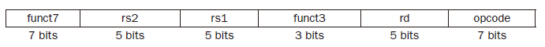
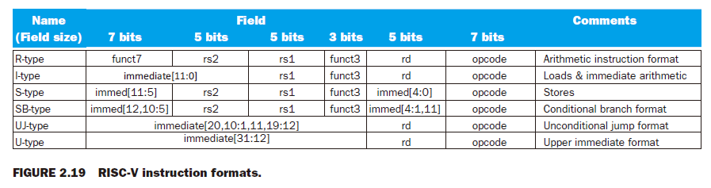
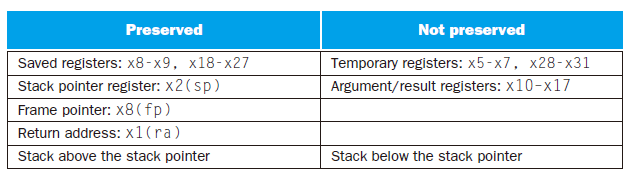
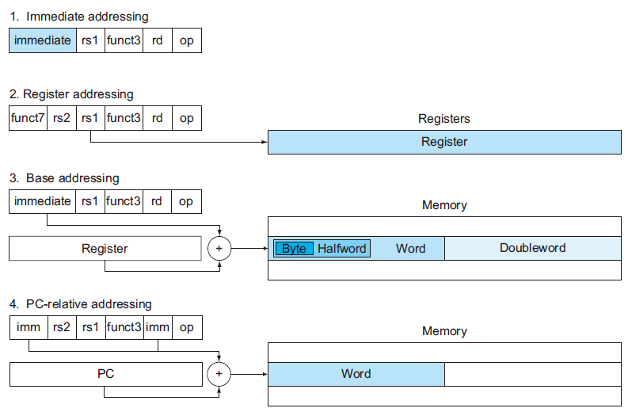
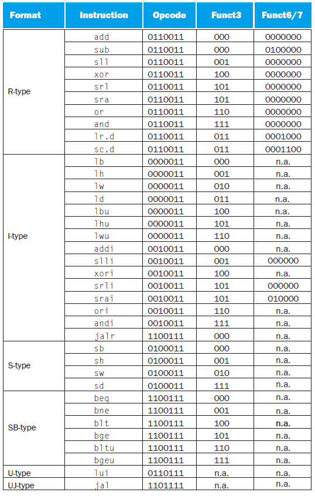
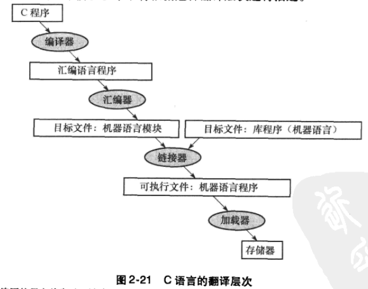

# 2 Instructions: Language of the Computer

!!! tip "说明"

    此文档正在更新中……

!!! info "说明"

    1. 部分内容由 AI 翻译课本原文，可能存在错误
    2. 本文档只涉及部分知识点，仅可用来复习重点知识

## 2.2 计算机硬件的操作

RISC-V 操作数（operands）：

<figure markdown="span">
    { width="800" }
</figure>

RISC-V 寄存器约定：

<figure markdown="span">
    { width="600" }
</figure>

RISC-V 汇编语言（assembly language）：

<figure markdown="span">
    { width="800" }
</figure>

<figure markdown="span">
    { width="800" }
</figure>

!!! example "把 C 语言中一条复杂的赋值语句编译成 RISC-V"

    <div class="grid" markdown>
    
    ```c title="c" linenums="1"
    f = (g + h) - (i + j);
    ```
    
    ```verilog title="RISC-V" linenums="1"
    add t0, g, h
    add t1, i, j
    sub f, t0, t1
    ```
    
    </div>

    t0 和 t1 是临时寄存器

## 2.3 计算机硬件的操作数

在 RISC-V 体系结构中寄存器大小为 64 bit，由于 64 bit 为 1 组的情况经常出现，因此在 RISC-V 体系结构中将其称为 $doubleword$，32 bit 为 1 组则称为 $word$

!!! example "使用寄存器编译 C 赋值语句"

    f, g, h, i, j 分别存储在寄存器 x19, x20, x21, x22, x23 当中
    
    <div class="grid" markdown>
    
    ```c title="c" linenums="1"
    f = (g + h) - (i + j);
    ```
    
    ```verilog title="RISC-V" linenums="1"
    add x5, x20, x21  // x5 = g + h
    add x6, x22, x23  // x6 = i + j
    sub x19, x5, x6  // f = x5 - x6
    ```
    
    </div>

### 2.3.1 存储器操作数

如上所述，RISC-V 的算术运算只对寄存器进行操作，因此，RISC-V 必须包含在存储器和寄存器之间传送数据的指令。这些指令叫做 **数据传送指令**（data transfer instruction）

将数据从存储器拷贝到寄存器的数据传送指令，通常叫 **取数指令**（load），RISC-V 中记为 `ld`，表示 $load\ doubleword$

!!! example "编译一个操作数在存储器中的 C 赋值语句"

    设 A 是一个含 100 个 doubleword 的数组，g，h 分别存储在 x20，x21 中。A 数组的基址（base address）存储在 x22 中

    <div class="grid" markdown>
    
    ```c title="c" linenums="1"
    g = h + A[8];
    ```
    
    ```verilog title="RISC-V" linenums="1"
    ld x9, 64(x22)  // 为什么是 64 呢，见下文
    add x20, x21, x9
    ```
    
    </div>

    x22 称为基址寄存器（base register），8 称为偏移量（offset）

<figure markdown="span">
    { width="400" }
</figure>

很多程序都用到字节类型，且大多数体系结构按字节编址。因此，一个双字的地址必和它所包括的八个字节中的某个地址相匹配，且连续双字的地址相差 8。上图中展示了实际的 RISC-V 地址，其中第三个双字的字节地址为 16

1. 大端编址（big-endian）：最高有效位在低地址
2. 小端编址（little-endian）：最低有效位在低地址

<figure markdown="span">
    { width="600" }
</figure>

==RISC-V 使用小端编址==

字节寻址也影响到数组下标。在上面的代码中，为了得到正确的字节地址，与基址寄存器相加的偏移量必须是 $8 \times 8$，即 64，这样才能正确读到 A[8] 的数据

与取数指令相对应的指令通常叫做 **存数指令**（store），它将数据从寄存器拷贝到存储器。RISC-V 中为 `sd`，表示 $store\ doubleword$

!!! example "用取数/存数指令进行编译"

    h 存储在 x21，A 的基地址存储在 x22

    <div class="grid" markdown>
    
    ```c title="c" linenums="1"
    A[12] = h + A[8];
    ```
    
    ```verilog title="RISC-V" linenums="1"
    ld x9, 64(x22)  // 得到 A[8] 的值
    add x9, x21, x9  // h + A[8]
    sd x9, 96(x22)  // 存储到 A[12] 中
    ```
    
    </div>

### 2.3.2 常数或立即数操作数

加立即数 `addi`（add immediate）

RISC-V 将寄存器 x0 恒置为 0

## 2.5 计算机中指令的表示

指令的布局形式叫做 **指令格式**（instruction format）。所有 RISC-V 指令都是 32 位长

为了将它与汇编语言区分开来，把指令的数字形式称为 **机器语言** （machine language），这样的指令序列叫做 **机器码**（machine code）

### 2.5.1 RISC-V 字段

**RISC-V Fields**

<figure markdown="span">
    { width="600" }
</figure>

1. opcode：指令的基本操作，通常称为 **操作码**
2. rd：用于存放操作结果的寄存器
3. funct3：附加操作码
4. rs1：第一个源操作数寄存器
5. rs2：第二个源操作数寄存器
6. funct7：附加操作码

RISC-V 指令的格式：

<figure markdown="span">
    { width="800" }
</figure>

## 2.6 逻辑操作

**Logical Operations**

<figure markdown="span">
    { width="600" }
</figure>

## 2.7 决策指令

**Instructions for Making Decisions**

`beq rs1, rs2, L1`

如果 rs1 和 rs2 中的数值相等，则转到标签为 L1 的语句执行。`beq` 代表如果相等则分支（branch if equal）

`bne rs1, rs2, L1`

如果 rs1 和 rs2 中的数值不相等，则转到标签为 L1 的语句执行。`bne` 代表如果不相等则分支（branch if not equal）

这两条指令称为 **条件分支指令**（conditional branches）

!!! example "将 if-then-else 语句编译成条件分支指令"

    f，g，h，i，j 分别存储在 x19，x20，x21，x22，x23 中

    <div class="grid" markdown>
    
    ```c title="c" linenums="1"
    if (i == j) {
        f = g + h;
    } else {
        f = g - h;
    }
    ```
    
    ```verilog title="RISC-V" linenums="1" hl_lines="1 3"
    bne x22, x23, Else
    add x19, x20, x21
    beq x0, x0, Exit
    Else: sub x19, x20, x21
    Exit:
    ```

    </div>

    line 1：通常，通过测试分支的相反条件来跳过 if 语句后面的 then 部分，代码的效率会更高，所以使用 bne 指令

    line 3：在 if 语句的结尾部分，需要引入另一种分支指令，通常叫做无条件分支指令（unconditional branch）。一种方式便是使用此指令，其条件永为 true

### 2.7.1 循环

!!! example "编译 C 语言 while 循环语句"

    i，k 存储在 x22，x24 中，save 数组基址存储在 x25

    <div class="grid" markdown>
    
    ```c title="c" linenums="1"
    while (save[i] == k) {
        i += 1;
    }
    ```
    
    ```verilog title="RISC-V" linenums="1"
    Loop: slli x10, x22, 3  // x10 = 8 * i
    add x10, x10, x25  // 获得 save[i] 的地址
    ld x9, 0(x10)  // x9 = save[i]
    bne x9, x24, Exit  // 如果 x9 ≠ x24，Exit 退出循环
    addi x22, x22, 1
    beq x0, x0, Loop
    Exit:
    ```

    </div>

### 2.7.2 边界检查的捷径

将有符号数作为无符号数来处理，是一种检验 $0 \leqslant x < y$ 的低开销方法，常用于检查数组的下标是否越界。问题的关键是负数在二进制补码表示法中看起来像是无符号表示法中一个很大的数因为在无符号数中最高有效位是符号位，而有符号数中最高有效位是具有最大权重的位。所以使用无符号比较 $x < y$，在检查 x 是否小于 y 的同时，也检查了 x 是否为一个负数

`bgeu x20, x11, IndexOutOfBounds`

如果 $x20 \geqslant x11$ 或者 $x20 < 0$，则跳转至 IndexOutOfBounds

### 2.7.3 case/switch 语句

大多数程序设计语言中都包括 case 或 switch 语句，使得程序员可以根据某个变量的值选择不同分支之一。实现 switch 语句的最简单方法是借助一系列的条件判断，将 switch 语句转化为 if-then-else 语句嵌套

有时候另一种更有效的方法是将多个指令序列分支的地址编码为一张表，即 **转移地址表**（branch address table / branch table）。这样程序只需索引该表即可跳转到恰当的指令序列。转移地址表是一个由代码中标签所对应地址构成的数组。程序需要跳转的时候首先将转移地址表中适当的项加载到寄存器中，然后使用寄存器中的地址值进行跳转。为了支持这种情况，RISC-V 提供了寄存器跳转指令 `jalr`，用来无条件地跳转到寄存器指定的地址

## 2.8 计算机硬件对过程的支持

**过程**（procedure）或函数时程序员进行结构化编程的工具

在过程运行期间，程序必须遵循以下六个步骤：

1. 将参数放在过程可以访问到的位置
2. 将控制转移给过程
3. 获得过程所需的存储资源
4. 执行请求的任务
5. 将结果的值放在调用程序可以访问到的位置
6. 将控制返回起始点，因为一个过程可能由一个程序中的多个点调用

RISC-V 遵循以下约定：

1. x10-x17：8 个寄存器用于传递参数和返回值
2. x1：用于返回起始点的返回地址寄存器

RISC-V 还包含一条过程调用指令，跳转到某个地址的同时将下一条指令的地址保存在寄存器 rd 当中，这条 **跳转和链接指令**（jump-and-link-instruction）`jal` 格式为：

`jal x1, ProcedureAddress`

指令中的链接部分表示指向调用点的地址或链接，以允许过程返回到合适的地址。存储在寄存器 x1（ra） 中的链接部分称为 **返回地址**（return address）。返回地址是必需的，因为同一过程可能在程序的不同部分调用

为了支持这种情况，类似 RISC-V 的计算机使用了 **寄存器跳转**（jump register）指令 `jalr`，用于case 语句，表示无条件跳转到寄存器所指定的地址:

`jalr x0, 0(x1)`

调用程序称为 **调用者**（caller），将参数值放在 x10-x17 当中，使用 `jal` 指令跳转到某个过程（称为 **被调用者**（callee））被调用者执行运算，将结果放在某些寄存器当中，然后使用 `jalr` 指令将控制返回给 caller

### 2.8.1 使用更多的寄存器

换出寄存器的最理想的数据结构是 **栈**（stack）。一种后进先出的队列。栈需要一个指针指向栈中最新分配的地址，以指示下一个过程放置换出寄存器的位置，或是寄存器旧值的存放位置。**栈指针**（stack pointer）按照每个被保存或恢复的寄存器以字为单位进行调整。RISC-V 中的栈指针为 x2（sp）。由于栈的应用十分广泛，因此向栈传递数据或从栈中取数都有专用术语：将数据放人栈中称为 **压栈**（push），从栈中移除数据称为 **出栈**（pop）

按照历史惯例，栈“增长”是按照地址从高到低的顺序进行的。这意味着将值压栈时，栈指针值减小；而值出栈时，栈长度缩短，栈指针增大

!!! example "编译一个不调用其他过程的 C 过程"

    g，h，i，j 存储在 x10，x11，x12，x13 中，f 存储在 x20 中

    <div class="grid" markdown>
    
    ```c title="c" linenums="1"
    leaf_example(int g, int h, int i, int j)
    {
        int f;
        f = (g + h) - (i + j);
        return f;
    }
    ```
    
    ```verilog title="RISC-V" linenums="1" hl_lines="1 2 7 8 9"
    leaf_example: addi sp, sp, -8
    sd x20, 0(sp)
    add x5, x10, x11  // x5 = g + h
    add x6, x12, x13  // x6 = i + j
    sub x20, x5, x6  // f = x5 - x6
    addi x10, x20, 0  // 将 f 的值存储在 x10 中
    ld x20, 0(sp)
    addi sp, sp, 8
    jalr x0, 0(x1)
    ```

    </div>

    line 1-2：将 x20 压栈

    line 7-8：将 x20 出栈，恢复 x20 原来的值

    line 9：返回 caller，返回地址存储在 x1 当中

为了避免保存和恢复一个其值未被使用过的寄存器（通常是临时寄存器），RISC-V 将 19 个寄存器分为两组：

1. x5-x7 和 x28-x31：临时寄存器，在过程调用中不必被 callee 保存
2. x8-x9 和 x18-x27：保留寄存器，在过程调用中必须被保存

### 2.8.2 嵌套过程

**Nested Procedures**

不调用其他过程的过程称为 **叶过程**（leaf procedure）

caller 将所有调用后还需要的参数寄存器 x10-x17 或临时寄存器 x5-x7 x28-x31 压栈。callee 将返回地址寄存器 x1 和 callee 使用的保留寄存器 x8-x9 x18-x27 都压栈。栈指针 x2（sp）随着栈中寄存器个数调整。到返回时，寄存器会从存储器中恢复，栈指针也随着重新调整

!!! example "编译一个递归 C 过程，演示嵌套过程的链接"

    n 存储在 x10 当中

    <div class="grid" markdown>
    
    ```c title="c" linenums="1"
    int fact(int n)
    {
        if (n < 1) {
            return 1;
        } else {
            return (n * fact(n - 1));
        }
    }
    ```
    
    ```verilog title="RISC-V" linenums="1"
    fact: addi sp, sp, -16
    sd x1, 8(sp)  // 保存返回地址
    sd x10, 0(sp)  // 保存 caller 的参数 n
    addi x5, x10, -1  // x5 = x10 - 1
    bge x5, x0, L1  // 若 (n - 1) >= 0，跳转至 L1
    addi x10, x0, 1  // return 1
    addi sp, sp, 16  // pop 两个值
    jalr x0, 0(x1)  // 返回 caller
    L1: addi x10, x10, -1  // n = n - 1
    jal x1, fact  // 使用新的 n 值即 (n - 1) 调用 callee
    addi x6, x10, 0  // x6 = fact(n - 1)
    ld x10, 0(sp)  // 恢复原来的 n 值 x10 = n
    ld x1, 8(sp)  // 恢复原来的返回地址
    addi sp, sp, 16
    mul x10, x10, x6  // x10 = n * fact(n - 1)
    jalr x0, 0(x1)
    ```

    </div>

    我们拿 n = 2 来举个例子，首先某个地方调用了 fact 函数，比如

    ```verilog title="RISC-V" linenums="1"
    addi x10, x0, 2  // x10 = n = 2
    jal x1, fact
    ```

    假设 x1 值为 001，接下来运行

    ```verilog title="RISC-V" linenums="1"
    fact: addi sp, sp, -16
    sd x1, 8(sp)
    sd x10, 0(sp)
    addi x5, x10, -1  // x5 = 1
    bge x5, x0, L1  // x5 >= 0，跳转至 L1
    ```

    此时 `sp = [2, 001]`，接下来运行

    ```verilog title="RISC-V" linenums="1"
    L1: addi x10, x10, -1  // x10 = n = 1
    jal x1, fact  // 假设 x1 = 002
    ```

    现在 x1 值为 002，回到 fact，接下来运行

    ```verilog title="RISC-V" linenums="1"
    fact: addi sp, sp, -16
    sd x1, 8(sp)
    sd x10, 0(sp)
    addi x5, x10, -1  // x5 = 0
    bge x5, x0, L1  // x5 >= 0，跳转至 L1
    ```

    此时 `sp = [1, 002, 2, 001]`，接下来运行

    ```verilog title="RISC-V" linenums="1"
    L1: addi x10, x10, -1  // x10 = n = 0
    jal x1, fact  // 假设 x1 = 003
    ```

    现在 x1 值为 003，回到 fact，接下来运行

    ```verilog title="RISC-V" linenums="1"
    fact: addi sp, sp, -16
    sd x1, 8(sp)
    sd x10, 0(sp)
    addi x5, x10, -1  // x5 = -1
    bge x5, x0, L1  // x5 < 0，不跳转
    addi x10, x0, 1  // return 1，即x10 = 1
    addi sp, sp, 16
    jalr x0, 0(x1)
    ```

    此时 `sp = [1, 002, 2, 001]`，回到 x1 = 003，接下来运行

    ```verilog title="RISC-V" linenums="1"
    addi x6, x10, 0  // x6 = fact(0) = 1
    ld x10, 0(sp)  // x10 = 1
    ld x1, 8(sp)  // x1 = 002
    addi sp, sp, 16
    mul x10, x10, x6  // x10 = x10 * 1 = 1
    jalr x0, 0(x1)
    ```

    此时 `sp = [2, 001]`，回到 x1 = 002，接下来运行

    ```verilog title="RISC-V" linenums="1"
    addi x6, x10, 0  // x6 = fact(1) = 1
    ld x10, 0(sp)  // x10 = 2
    ld x1, 8(sp)  // x1 = 001
    addi sp, sp, 16
    mul x10, x10, x6  // x10 = x10 * 1 = 2
    jalr x0, 0(x1)
    ```

    此时 sp 无值，回到 x1 = 001， 接下来回到最开始那个 `jal x1, fact` caller，此时 x10 里的值即为 `fact(2) = 2`

过程调用时保留和不保留的内容：

<figure markdown="span">
    { width="600" }
</figure>

### 2.8.3 在栈中为新数据分配空间

**Allocating Space for New Data on the Stack**

栈中包含过程所保存的寄存器和局部变量的片段称为 **过程帧**（procedure frame）或 **活动记录**（activation record）

### 2.8.4 在堆中为新数据分配空间

**Allocating Space for New Data on the Heap**

RISC-V 寄存器约定：

<figure markdown="span">
    { width="600" }
</figure>

## 2.9 人机交互

**Communicating with People**

## 2.10 RISC-V 中立即数和地址的寻址

**RISC-V Addressing for Wide Immediates
and Addresses**

### 2.10.1 立即数

RISC-V 指令集中的读取立即数高位指令（Load upper immediate）`lui`，将 20 bit 常数存储到寄存器的 [31:12] 中，寄存器 [63:32] 复制填充 [31] 的数据，[11:0] 填充 0

### 2.10.2 分支和跳转中的寻址

> 书上的例子

### 2.10.3 RISC-V 寻址模式总结

<figure markdown="span">
    { width="600" }
</figure>

1. Immediate addressing: where the operand is a constant within the instruction itself.
2. Register addressing: where the operand is a register.
3. Base or displacement addressing: where the operand is at the memory location whose address is the sum of a register and a constant in the instruction.
4. PC-relative addressing: where the branch address is the sum of the PC and a constant in the instruction.

### 2.10.4 机器语言解码

**Decoding Machine Language**

<figure markdown="span">
    { width="600" }
</figure>

RISC-V 指令的格式：

<figure markdown="span">
    { width="800" }
</figure>

## 2.11 并行与指令：同步

**Parallelism and Instructions:
Synchronization**

`lr.d`

`sc.d`

> 书上的例子

## 2.12 翻译并执行程序

<figure markdown="span">
    { width="600" }
</figure>

### 2.12.3 链接器

### 2.12.4 加载器

### 2.12.5 动态链接库

### 2.12.6 启动一个 Java 程序

## 2.13 以一个 C 排序程序为例

1. 为程序变量分配寄存器
2. 为过程体生成汇编代码
3. 保存过程调用间的寄存器

> 书上的例子

## 2.14 数组与指针

> 书上的例子

### 2.14.1 用数组实现 clear

### 2.14.2 用指针实现 clear
