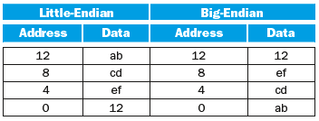

# 2 Instructions: Language of the Computer

<!-- !!! tip "说明"

    本文档正在更新中…… -->

!!! info "说明"

    1. 部分内容由 AI 翻译课本原文，可能存在错误
    2. 本文档仅涉及部分内容，仅可用于复习重点知识
    3. 部分课本练习题答案可能存在错误，欢迎在评论区指出，也可以写下你的疑问

## 2.2 计算机硬件的操作

RISC-V 操作数（operands）：

<figure markdown="span">
    { width="800" }
</figure>

RISC-V 寄存器约定：

<figure markdown="span">
    { width="600" }
</figure>

RISC-V 汇编语言（assembly language）：

<figure markdown="span">
    { width="800" }
</figure>

<figure markdown="span">
    { width="800" }
</figure>

!!! example "把 C 语言中一条复杂的赋值语句编译成 RISC-V"

    <div class="grid" markdown>
    
    ```c title="c" linenums="1"
    f = (g + h) - (i + j);
    ```
    
    ```verilog title="RISC-V" linenums="1"
    add t0, g, h
    add t1, i, j
    sub f, t0, t1
    ```
    
    </div>

    t0 和 t1 是临时寄存器

???+ question "课本 2.1"

    For the following C statement, write the corresponding RISC-V assembly code. Assume that the C variables f, g, and h, have already been placed in registers x5, x6, and x7 respectively. Use a minimal number of RISC-V assembly instructions.

    ```c title="c" linenums="1"
    f = g + (h - 5);
    ```

    ??? success "答案"

        ```verilog title="RISC-V" linenums="1"
        addi x5, x7, -5
        add x5, x5, x6
        ```

???+ question "课本 2.2"

    Write a single C statement that corresponds to the two RISC-V assembly instructions below.

    ```verilog title="RISC-V" linenums="1"
    add f, g, h
    add f, i, f
    ```

    ??? success "答案"

        ```c title="c" linenums="1"
        f = g + h + i;
        ```

## 2.3 计算机硬件的操作数

在 RISC-V 体系结构中寄存器大小为 64 bit，由于 64 bit 为 1 组的情况经常出现，因此在 RISC-V 体系结构中将其称为 $doubleword$，32 bit 为 1 组则称为 $word$

!!! example "使用寄存器编译 C 赋值语句"

    f, g, h, i, j 分别存储在寄存器 x19, x20, x21, x22, x23 当中
    
    <div class="grid" markdown>
    
    ```c title="c" linenums="1"
    f = (g + h) - (i + j);
    ```
    
    ```verilog title="RISC-V" linenums="1"
    add x5, x20, x21  // x5 = g + h
    add x6, x22, x23  // x6 = i + j
    sub x19, x5, x6  // f = x5 - x6
    ```
    
    </div>

### 2.3.1 存储器操作数

如上所述，RISC-V 的算术运算只对寄存器进行操作，因此，RISC-V 必须包含在存储器和寄存器之间传送数据的指令。这些指令叫做 **数据传送指令**（data transfer instruction）

将数据从存储器拷贝到寄存器的数据传送指令，通常叫 **取数指令**（load），RISC-V 中记为 `ld`，表示 $load\ doubleword$

!!! example "编译一个操作数在存储器中的 C 赋值语句"

    设 A 是一个含 100 个 doubleword 的数组，g，h 分别存储在 x20，x21 中。A 数组的基址（base address）存储在 x22 中

    <div class="grid" markdown>
    
    ```c title="c" linenums="1"
    g = h + A[8];
    ```
    
    ```verilog title="RISC-V" linenums="1"
    ld x9, 64(x22)  // 为什么是 64 呢，见下文
    add x20, x21, x9
    ```
    
    </div>

    x22 称为基址寄存器（base register），8 称为偏移量（offset）

<figure markdown="span">
    { width="400" }
</figure>

很多程序都用到字节类型，且大多数体系结构按字节编址。因此，一个双字的地址必和它所包括的八个字节中的某个地址相匹配，且连续双字的地址相差 8。上图中展示了实际的 RISC-V 地址，其中第三个双字的字节地址为 16

1. 大端编址（big-endian）：最高有效位在低地址
2. 小端编址（little-endian）：最低有效位在低地址

<figure markdown="span">
    { width="600" }
</figure>

==RISC-V 使用小端编址==

字节寻址也影响到数组下标。在上面的代码中，为了得到正确的字节地址，与基址寄存器相加的偏移量必须是 $8 \times 8$，即 64，这样才能正确读到 A[8] 的数据

???+ question "课本 2.5"

    Show how the value 0xabcdef12 would be arranged in memory of a little-endian and a big-endian machine. Assume the data are stored starting at address 0 and that the word size is 4 bytes.

    ??? success "答案"
    
        <figure markdown="span">
            { width="600" }
        </figure>

与取数指令相对应的指令通常叫做 **存数指令**（store），它将数据从寄存器拷贝到存储器。RISC-V 中为 `sd`，表示 $store\ doubleword$

!!! example "用取数/存数指令进行编译"

    h 存储在 x21，A 的基地址存储在 x22

    <div class="grid" markdown>
    
    ```c title="c" linenums="1"
    A[12] = h + A[8];
    ```
    
    ```verilog title="RISC-V" linenums="1"
    ld x9, 64(x22)  // 得到 A[8] 的值
    add x9, x21, x9  // h + A[8]
    sd x9, 96(x22)  // 存储到 A[12] 中
    ```
    
    </div>

### 2.3.2 常数或立即数操作数

加立即数 `addi`（add immediate）

RISC-V 将寄存器 x0 恒置为 0

???+ question "课本 2.3"

    For the following C statement, write the corresponding RISC-V assembly code. Assume that the variables f, g, h, i, and j are assigned to registers x5, x6, x7, x28, and x29, respectively. Assume that the base address of the arrays A and B are in registers x10 and x11, respectively.

    ```c title="c" linenums="1"
    B[8] = A[i - j];
    ```

    ??? success "答案"

        ```verilog title="RISC-V" linenums="1"
        sub x5, x28, x29  // x5 = i - j
        slli x5, x5, 3  // x5 = 8(i - j)
        add x5, x10, x5  // x5 = &A[i - j]
        ld x6, 0(x5)  // x6 = A[i - j]
        sd x6, 64(x11)  // B[8] = A[i - j]
        ```

???+ question "课本 2.4"

    For the RISC-V assembly instructions below, what is the corresponding C statement? Assume that the variables f, g, h, i, and j are assigned to registers x5, x6, x7, x28, and x29, respectively. Assume that the base address of the arrays A and B are in registers x10 and x11, respectively.

    ```verilog title="RISC-V" linenums="1"
    slli x30, x5, 3  // x30 = f*8
    add x30, x10, x30  // x30 = &A[f]
    slli x31, x6, 3  // x31 = g*8
    add x31, x11, x31  // x31 = &B[g]
    ld x5, 0(x30)  // f = A[f]

    addi x12, x30, 8
    ld x30, 0(x12)
    add x30, x30, x5
    sd x30, 0(x31)
    ```

    ??? success "答案"

        ```verilog title="RISC-V" linenums="7"
        addi x12, x30, 8  // x12 = &A[f + 1]
        ld x30, 0(x12)  // x30 = A[f + 1]
        add x30, x30, x5  // x30 = A[f + 1] + A[f]
        sd x30, 0(x31)  // B[g] = A[f + 1] + A[f]
        ```

        ```c title="c" linenums="1"
        B[g] = A[f + 1] + A[f]
        ```

???+ question "课本 2.7"

    Translate the following C code to RISC-V. Assume that the variables f, g, h, i, and j are assigned to registers x5, x6, x7, x28, and x29, respectively. Assume that the base address of the arrays A and B are in registers x10 and x11, respectively. Assume that the elements of the arrays A and B are 8-byte words:

    ```c title="c" linenums="1"
    B[8] = A[i] + A[j]
    ```

    ??? success "答案"

        ```verilog title="RISC-V" linenums="1"
        slli x5, x28, 3  // x5 = 8 * i
        add x5, x10, x5  // x5 = &A[i]
        ld x6, 0(x5)  // x6 = A[i]
        slli x5, x29, 3  // x5 = 8 * j
        add x5, x10, x5  // x5 = &A[j]
        ld x7, 0(x5)  // x7 = A[j]
        add x5, x6, x7  // x5 = x6 + x7
        sd x5, 64(x11)  // B[8] = x5
        ```

???+ question "课本 2.8"

    Translate the following RISC-V code to C. Assume that the variables f, g, h, i, and j are assigned to registers x5, x6, x7, x28, and x29, respectively. Assume that the base address of the arrays A and B are in registers x10 and x11, respectively.

    ```verilog title="RISC-V" linenums="1"
    addi x30, x10, 8
    addi x31, x10, 0
    sd x31, 0(x30)
    ld x30, 0(x30)
    add x5, x30, x31
    ```

    ??? success "答案"

        ```verilog title="RISC-V" linenums="1"
        addi x30, x10, 8  // x30 = &A[1]
        addi x31, x10, 0  // x31 = &A[0]
        sd x31, 0(x30)  // A[1] = &A[0]
        ld x30, 0(x30)  // x30 = &A[0]
        add x5, x30, x31  // x5 = 2 * &A[0]
        ```

## 2.5 计算机中指令的表示

指令的布局形式叫做 **指令格式**（instruction format）。所有 RISC-V 指令都是 32 位长

为了将它与汇编语言区分开来，把指令的数字形式称为 **机器语言** （machine language），这样的指令序列叫做 **机器码**（machine code）

### 2.5.1 RISC-V 字段

**RISC-V Fields**

<figure markdown="span">
    { width="600" }
</figure>

1. opcode：指令的基本操作，通常称为 **操作码**
2. rd：用于存放操作结果的寄存器
3. funct3：附加操作码
4. rs1：第一个源操作数寄存器
5. rs2：第二个源操作数寄存器
6. funct7：附加操作码

RISC-V 指令的格式：

<figure markdown="span">
    { width="800" }
</figure>

## 2.6 逻辑操作

**Logical Operations**

<figure markdown="span">
    { width="600" }
</figure>

???+ question "课本 2.12"

    Provide the instruction type and assembly language instruction for the following binary value:

    ```verilog title="machine code" linenums="1"
    0000 0000 0001 0000 1000 0000 1011 0011
    ```

    ??? success "答案"

        `opcode = 0110011`

        R-type

        `funct7 = 0000000`<br/>
        `rs2 = 00001`<br/>
        `rs1 = 00001`<br/>
        `funct3 = 000`<br/>
        `rd = 00001`

        ```verilog title="RISC-V" linenums="1"
        add x1, x1, x1
        ```

???+ question "课本 2.13"

    Provide the instruction type and hexadecimal representation of the following instruction:

    ```verilog title="RISC-V" linenums="1"
    sd x5, 32(x30)
    ```

    ??? success "答案"

        S-type
        
        <figure markdown="span">
            { width="600" }
        </figure>

        $immed = 32_{10} = 000\_000\_100\_000_2$<br/>
        $rs2 = 5_{10} = 00101_2$<br/>
        $rs1 = 30_{10} = 11110_2$<br/>
        $funct3 = 011$<br/>
        $opcode = 0100011$

        ```verilog title="machine code" linenums="1"
        0000 0010 0101 1111 0011 0000 0010 0011
        ```

???+ question "课本 2.14"

    Provide the instruction type, assembly language instruction, and binary representation of instruction described by the following RISC-V fields:

    `opcode=0x33, funct3=0x0, funct7=0x20, rs2=5, rs1=7, rd=6`

    ??? success "答案"

        `opcode = 0110011`

        R-type

        `funct3 = 000`<br/>
        `funct7 = 0100000`

        sub

        `rs2 = 00101`<br/>
        `rs1 = 00111`<br/>
        `rd = 00110`

        ```verilog title="RISC-V" linenums="1"
        sub x6, x7, x5
        ```

        ```verilog title="machine code" linenums="1"
        0100 0000 0101 0011 1000 0011 0011 0011
        ```

???+ question "课本 2.15"

    Provide the instruction type, assembly language instruction, and binary representation of instruction described by the following RISC-V fields:

    `opcode=0x3, funct3=0x3, rs1=27, rd=3, imm=0x4`

    ??? success "答案"

        `opcode = 0000011`

        I-type

        `funct3 = 011`

        ld

        `rs1 = 11011`<br/>
        `rd = 00011`<br/>
        `imm = 000_000_000_100`

        ```verilog title="RISC-V" linenums="1"
        ld x3, 4(x27)
        ```

        ```verilog title="machine code" linenums="1"
        0000 0000 0100 1101 1011 0001 1000 0011
        ```

???+ question "课本 2.17"

    Assume the following register contents:

    `x5 = 0x00000000AAAAAAAA, x6 = 0x1234567812345678`

    (1) For the register values shown above, what is the value of x7 for the following sequence of instructions?

    ```verilog title="RISC-V" linenums="1"
    slli x7, x5, 4
    or x7, x7, x6
    ```

    (2) For the register values shown above, what is the value of x7 for the following sequence of instructions?

    ```verilog title="RISC-V" linenums="1"
    slli x7, x6, 4
    ```

    (3) For the register values shown above, what is the value of x7 for the following sequence of instructions?

    ```verilog title="RISC-V" linenums="1"
    srli x7, x5, 3
    andi x7, x7, 0xFEF
    ```

    ??? success "答案"

        (1) `x7 = x5 << 4 = 0x0000_000A_AAAA_AAA0`<br/>
        `x7 = x7 or x6 = 0x1234_567A_BABE_FEF8`

        ---

        (2) `x7 = x6 << 4 = 0x2345_6781_2345_6780`

        ---

        (3) `x7 = x5 >> 3 = 0x0000_0000_1555_5555`<br/>
        `x7 = x7 and 0xFEF = 0x0000_0000_0000_0545`

???+ question "课本 2.20"

    For the following C statement, write a minimal sequence of RISC-V assembly instructions that performs the identical operation. Assume x6 = A, and x17 is the base address of C.

    ```c title="c" linenums="1"
    A = C[0] << 4;
    ```

    ??? success "答案"

        ```verilog title="RISC-V" linenums="1"
        ld x5, 0(x17)  // x5 = C[0]
        slli x6, x5, 4
        ```

## 2.7 决策指令

**Instructions for Making Decisions**

`beq rs1, rs2, L1`

如果 rs1 和 rs2 中的数值相等，则转到标签为 L1 的语句执行。`beq` 代表如果相等则分支（branch if equal）

`bne rs1, rs2, L1`

如果 rs1 和 rs2 中的数值不相等，则转到标签为 L1 的语句执行。`bne` 代表如果不相等则分支（branch if not equal）

这两条指令称为 **条件分支指令**（conditional branches）

!!! example "将 if-then-else 语句编译成条件分支指令"

    f，g，h，i，j 分别存储在 x19，x20，x21，x22，x23 中

    <div class="grid" markdown>
    
    ```c title="c" linenums="1"
    if (i == j) {
        f = g + h;
    } else {
        f = g - h;
    }
    ```
    
    ```verilog title="RISC-V" linenums="1" hl_lines="1 3"
    bne x22, x23, Else
    add x19, x20, x21
    beq x0, x0, Exit
    Else: sub x19, x20, x21
    Exit:
    ```

    </div>

    line 1：通常，通过测试分支的相反条件来跳过 if 语句后面的 then 部分，代码的效率会更高，所以使用 bne 指令

    line 3：在 if 语句的结尾部分，需要引入另一种分支指令，通常叫做无条件分支指令（unconditional branch）。一种方式便是使用此指令，其条件永为 true

### 2.7.1 循环

!!! example "编译 C 语言 while 循环语句"

    i，k 存储在 x22，x24 中，save 数组基址存储在 x25

    <div class="grid" markdown>
    
    ```c title="c" linenums="1"
    while (save[i] == k) {
        i += 1;
    }
    ```
    
    ```verilog title="RISC-V" linenums="1"
    Loop: slli x10, x22, 3  // x10 = 8 * i
    add x10, x10, x25  // 获得 save[i] 的地址
    ld x9, 0(x10)  // x9 = save[i]
    bne x9, x24, Exit  // 如果 x9 ≠ x24，Exit 退出循环
    addi x22, x22, 1
    beq x0, x0, Loop
    Exit:
    ```

    </div>

### 2.7.2 边界检查的捷径

将有符号数作为无符号数来处理，是一种检验 $0 \leqslant x < y$ 的低开销方法，常用于检查数组的下标是否越界。问题的关键是负数在二进制补码表示法中看起来像是无符号表示法中一个很大的数因为在无符号数中最高有效位是符号位，而有符号数中最高有效位是具有最大权重的位。所以使用无符号比较 $x < y$，在检查 x 是否小于 y 的同时，也检查了 x 是否为一个负数

`bgeu x20, x11, IndexOutOfBounds`

如果 $x20 \geqslant x11$ 或者 $x20 < 0$，则跳转至 IndexOutOfBounds

### 2.7.3 case/switch 语句

大多数程序设计语言中都包括 case 或 switch 语句，使得程序员可以根据某个变量的值选择不同分支之一。实现 switch 语句的最简单方法是借助一系列的条件判断，将 switch 语句转化为 if-then-else 语句嵌套

有时候另一种更有效的方法是将多个指令序列分支的地址编码为一张表，即 **转移地址表**（branch address table / branch table）。这样程序只需索引该表即可跳转到恰当的指令序列。转移地址表是一个由代码中标签所对应地址构成的数组。程序需要跳转的时候首先将转移地址表中适当的项加载到寄存器中，然后使用寄存器中的地址值进行跳转。为了支持这种情况，RISC-V 提供了寄存器跳转指令 `jalr`，用来无条件地跳转到寄存器指定的地址

???+ question "课本 2.21"

    Assume x5 holds the value 0x00000000001010000. What is the value of x6 after the following instructions?

    ```verilog title="RISC-V" linenums="1"
    bge x5, x0, ELSE
    jal x0, DONE
    ELSE: ori x6, x0, 2
    DONE:
    ```

    ??? success "答案"
    
        ```verilog title="RISC-V" linenums="1"
        x6 = 00 or 10 = 10
        ```

        $x6 = 10_2 = 2_{10}$

???+ question "课本 2.24"

    Consider the following RISC-V loop:

    ```verilog title="RISC-V" linenums="1"
    LOOP: beq x6, x0, DONE
    addi x6, x6, -1
    addi x5, x5, 2
    jal x0, LOOP
    DONE:
    ```

    (1) Assume that the register x6 is initialized to the value 10. What is the final value in register x5 assuming the x5 is initially zero?

    (2) For the loop above, write the equivalent C code. Assume that the registers x5 and x6 are integers acc and i, respectively.

    (3) For the loop written in RISC-V assembly above, assume that the register x6 is initialized to the value N. How many RISC-V instructions are executed?

    (4) For the loop written in RISC-V assembly above, replace the instruction “beq x6, x0, DONE” with the instruction “blt x6, x0, DONE” and write the equivalent C code.

    ??? success "答案"

        (1) 简单的循环问题，`x5 = 20`

        ---

        (2)

        ```c title="c" linenums="1"
        i = 10;
        acc = 0;
        while (i != 0) {
            acc += 2;
            i --;
        }
        ```

        ---

        (3) 共 $4N + 1$ 次

        ---

        (4)

        ```c title="c" linenums="1"
        i = 10;
        acc = 0;
        while (i >= 0) {
            acc += 2;
            i --;
        }
        ```

???+ question "课本 2.27"

    Translate the following loop into C. Assume that the C-level integer i is held in register x6,x5 holds the C-level integer called result, and x10 holds the base address of the integer MemArray.

    > 课本题干有误，本文档已修正

    ```verilog title="RISC-V" linenums="1"
    addi x6, x0, 0
    addi x29, x0, 100
    LOOP: ld x7, 0(x10)
    add x5, x5, x7
    addi x10, x10, 8
    addi x6, x6, 1
    blt x6, x29, LOOP
    ```

    ??? success "答案"

        ```verilog title="RISC-V" linenums="1"
        addi x6, x0, 0  // x6 = 0
        addi x29, x0, 100  // x29 = 100
        LOOP: ld x7, 0(x10)  // x7 = MemArray[x10]
        add x5, x5, x7  // x5 = x5 + x7
        addi x10, x10, 8  // x10 = x10 + 8
        addi x6, x6, 1  // x6 = x6 + 1
        blt x6, x29, LOOP  // x6 < x29
        ```

        ```c title="c" linenums="1"
        for (i = 0; i < 100; i++) {
            result += MemArray[i];
        }
        ```

## 2.8 计算机硬件对过程的支持

**过程**（procedure）或函数时程序员进行结构化编程的工具

在过程运行期间，程序必须遵循以下六个步骤：

1. 将参数放在过程可以访问到的位置
2. 将控制转移给过程
3. 获得过程所需的存储资源
4. 执行请求的任务
5. 将结果的值放在调用程序可以访问到的位置
6. 将控制返回起始点，因为一个过程可能由一个程序中的多个点调用

RISC-V 遵循以下约定：

1. x10-x17：8 个寄存器用于传递参数和返回值
2. x1：用于返回起始点的返回地址寄存器

RISC-V 还包含一条过程调用指令，跳转到某个地址的同时将下一条指令的地址保存在寄存器 rd 当中，这条 **跳转和链接指令**（jump-and-link-instruction）`jal` 格式为：

`jal x1, ProcedureAddress`

指令中的链接部分表示指向调用点的地址或链接，以允许过程返回到合适的地址。存储在寄存器 x1（ra） 中的链接部分称为 **返回地址**（return address）。返回地址是必需的，因为同一过程可能在程序的不同部分调用

为了支持这种情况，类似 RISC-V 的计算机使用了 **寄存器跳转**（jump register）指令 `jalr`，用于case 语句，表示无条件跳转到寄存器所指定的地址:

`jalr x0, 0(x1)`

调用程序称为 **调用者**（caller），将参数值放在 x10-x17 当中，使用 `jal` 指令跳转到某个过程（称为 **被调用者**（callee））被调用者执行运算，将结果放在某些寄存器当中，然后使用 `jalr` 指令将控制返回给 caller

### 2.8.1 使用更多的寄存器

换出寄存器的最理想的数据结构是 **栈**（stack）。一种后进先出的队列。栈需要一个指针指向栈中最新分配的地址，以指示下一个过程放置换出寄存器的位置，或是寄存器旧值的存放位置。**栈指针**（stack pointer）按照每个被保存或恢复的寄存器以字为单位进行调整。RISC-V 中的栈指针为 x2（sp）。由于栈的应用十分广泛，因此向栈传递数据或从栈中取数都有专用术语：将数据放人栈中称为 **压栈**（push），从栈中移除数据称为 **出栈**（pop）

按照历史惯例，栈“增长”是按照地址从高到低的顺序进行的。这意味着将值压栈时，栈指针值减小；而值出栈时，栈长度缩短，栈指针增大

!!! example "编译一个不调用其他过程的 C 过程"

    g，h，i，j 存储在 x10，x11，x12，x13 中，f 存储在 x20 中

    <div class="grid" markdown>
    
    ```c title="c" linenums="1"
    leaf_example(int g, int h, int i, int j)
    {
        int f;
        f = (g + h) - (i + j);
        return f;
    }
    ```
    
    ```verilog title="RISC-V" linenums="1" hl_lines="1 2 7 8 9"
    leaf_example: addi sp, sp, -8
    sd x20, 0(sp)
    add x5, x10, x11  // x5 = g + h
    add x6, x12, x13  // x6 = i + j
    sub x20, x5, x6  // f = x5 - x6
    addi x10, x20, 0  // 将 f 的值存储在 x10 中
    ld x20, 0(sp)
    addi sp, sp, 8
    jalr x0, 0(x1)
    ```

    </div>

    line 1-2：将 x20 压栈

    line 7-8：将 x20 出栈，恢复 x20 原来的值

    line 9：返回 caller，返回地址存储在 x1 当中

为了避免保存和恢复一个其值未被使用过的寄存器（通常是临时寄存器），RISC-V 将 19 个寄存器分为两组：

1. x5-x7 和 x28-x31：临时寄存器，在过程调用中不必被 callee 保存
2. x8-x9 和 x18-x27：保留寄存器，在过程调用中必须被保存

### 2.8.2 嵌套过程

**Nested Procedures**

不调用其他过程的过程称为 **叶过程**（leaf procedure）

caller 将所有调用后还需要的参数寄存器 x10-x17 或临时寄存器 x5-x7 x28-x31 压栈。callee 将返回地址寄存器 x1 和 callee 使用的保留寄存器 x8-x9 x18-x27 都压栈。栈指针 x2（sp）随着栈中寄存器个数调整。到返回时，寄存器会从存储器中恢复，栈指针也随着重新调整

!!! example "编译一个递归 C 过程，演示嵌套过程的链接"

    n 存储在 x10 当中

    <div class="grid" markdown>
    
    ```c title="c" linenums="1"
    int fact(int n)
    {
        if (n < 1) {
            return 1;
        } else {
            return (n * fact(n - 1));
        }
    }
    ```
    
    ```verilog title="RISC-V" linenums="1"
    fact: addi sp, sp, -16
    sd x1, 8(sp)  // 保存返回地址
    sd x10, 0(sp)  // 保存 caller 的参数 n
    addi x5, x10, -1  // x5 = x10 - 1
    bge x5, x0, L1  // 若 (n - 1) >= 0，跳转至 L1
    addi x10, x0, 1  // return 1
    addi sp, sp, 16  // pop 两个值
    jalr x0, 0(x1)  // 返回 caller
    L1: addi x10, x10, -1  // n = n - 1
    jal x1, fact  // 使用新的 n 值即 (n - 1) 调用 callee
    addi x6, x10, 0  // x6 = fact(n - 1)
    ld x10, 0(sp)  // 恢复原来的 n 值 x10 = n
    ld x1, 8(sp)  // 恢复原来的返回地址
    addi sp, sp, 16
    mul x10, x10, x6  // x10 = n * fact(n - 1)
    jalr x0, 0(x1)
    ```

    </div>

    我们拿 n = 2 来举个例子，首先某个地方调用了 fact 函数，比如

    ```verilog title="RISC-V" linenums="1"
    addi x10, x0, 2  // x10 = n = 2
    jal x1, fact
    ```

    假设 x1 值为 001，接下来运行

    ```verilog title="RISC-V" linenums="1"
    fact: addi sp, sp, -16
    sd x1, 8(sp)
    sd x10, 0(sp)
    addi x5, x10, -1  // x5 = 1
    bge x5, x0, L1  // x5 >= 0，跳转至 L1
    ```

    此时 `sp = [2, 001]`，接下来运行

    ```verilog title="RISC-V" linenums="1"
    L1: addi x10, x10, -1  // x10 = n = 1
    jal x1, fact  // 假设 x1 = 002
    ```

    现在 x1 值为 002，回到 fact，接下来运行

    ```verilog title="RISC-V" linenums="1"
    fact: addi sp, sp, -16
    sd x1, 8(sp)
    sd x10, 0(sp)
    addi x5, x10, -1  // x5 = 0
    bge x5, x0, L1  // x5 >= 0，跳转至 L1
    ```

    此时 `sp = [1, 002, 2, 001]`，接下来运行

    ```verilog title="RISC-V" linenums="1"
    L1: addi x10, x10, -1  // x10 = n = 0
    jal x1, fact  // 假设 x1 = 003
    ```

    现在 x1 值为 003，回到 fact，接下来运行

    ```verilog title="RISC-V" linenums="1"
    fact: addi sp, sp, -16
    sd x1, 8(sp)
    sd x10, 0(sp)
    addi x5, x10, -1  // x5 = -1
    bge x5, x0, L1  // x5 < 0，不跳转
    addi x10, x0, 1  // return 1，即x10 = 1
    addi sp, sp, 16
    jalr x0, 0(x1)
    ```

    此时 `sp = [1, 002, 2, 001]`，回到 x1 = 003，接下来运行

    ```verilog title="RISC-V" linenums="1"
    addi x6, x10, 0  // x6 = fact(0) = 1
    ld x10, 0(sp)  // x10 = 1
    ld x1, 8(sp)  // x1 = 002
    addi sp, sp, 16
    mul x10, x10, x6  // x10 = x10 * 1 = 1
    jalr x0, 0(x1)
    ```

    此时 `sp = [2, 001]`，回到 x1 = 002，接下来运行

    ```verilog title="RISC-V" linenums="1"
    addi x6, x10, 0  // x6 = fact(1) = 1
    ld x10, 0(sp)  // x10 = 2
    ld x1, 8(sp)  // x1 = 001
    addi sp, sp, 16
    mul x10, x10, x6  // x10 = x10 * 1 = 2
    jalr x0, 0(x1)
    ```

    此时 sp 无值，回到 x1 = 001， 接下来回到最开始那个 `jal x1, fact` caller，此时 x10 里的值即为 `fact(2) = 2`

过程调用时保留和不保留的内容：

<figure markdown="span">
    { width="600" }
</figure>

!!! tip "一个简单且万能的实现方式"

    ```c title="c" linenums="1"
    int fact(int n)
    {
        if (n < 1) {
            return 1;
        } else {
            return (n * fact(n - 1));
        }
    }
    ```

    n 存储在 x10
    
    ```verilog title="RISC-V" linenums="1"
    // 存储参数
    fact: addi sp, sp, -16
    sd x1, 8(sp)
    sd x8, 0(sp)
    mv x8, x10  // 将参数 n 复制到 x8 中，之后需要用 n，就使用 x8
    
    // 分支跳转
    li x5, 1  // x5 = 1
    blt x8, x5, rtr_1  // x8 < x5 (n < 1)，管你相反条件速度更快，能用就行（
    
    // 最后一个 else 语句的内容
    addi x10, x8, -1  // x10 = n - 1
    jal x1, fact  // 调用 fact(n - 1)，最后的结果在 x10 当中
    mul x10, x8, x10  // x10 = n * fact(n - 1)
    
    // 跳转到 end
    j end
    
    // rtr_1
    rtr_1: li x10, 1  // return 1
    // j end 可以省略
    
    // 恢复寄存器的值并返回
    end: ld x8, 0(sp)
    ld x1, 8(sp)
    addi sp, sp, 16
    jalr x0, 0(x1)
    ```

???+ question "课本 2.25"

    Translate the following C code to RISC-V assembly code. Use a minimum number of instructions. Assume that the values of a, b, i, and j are in registers x5, x6, x7, and x29, respectively. Also, assume that register x10 holds the base address of the array D.

    ```c title="c" linenums="1"
    for (i = 0; i < a; i++) {
        for (j = 0; j < b; j++) {
             D[4 * j] = i + j;
        }
    }
        
    ```
    
    ??? success "答案"

        <div class="grid" id="grid-mid">
        ```verilog title="第一个 for 循环" linenums="1"
        li x7, 0
        for1tst: bge x7, x5, exit1
        -- snip --
        addi x7, x7, 1
        j for1tst

        exit1:
        ```
        ```verilog title="第二个 for 循环" linenums="1"
        li x29, 0
        for2tst: bge x29, x6, exit2

        slli x28, x29, 2  // x28 = 4 * j
        slli x28, x28, 3  // x28 = 8 * (4 * j)
        add x28, x10, x28  // x28 = &D[4 * j]
        add x30, x7, x29  // x30 = i + j
        sd x30, 0(x28)  // D[4 * j] = i + j

        addi x29, x29, 1
        j for2tst

        exit2:
        ```
        </div>

        ```verilog title="RSIC-V" linenums="1"
        li x7, 0
        for1tst: bge x7, x5, exit1
        
        li x29, 0
        for2tst: bge x29, x6, exit2

        slli x28, x29, 2  // x28 = 4 * j
        slli x28, x28, 3  // x28 = 8 * (4 * j)
        add x28, x10, x28  // x28 = &D[4 * j]
        add x30, x7, x29  // x30 = i + j
        ld x30, 0(x28)  // D[4 * j] = i + j

        addi x29, x29, 1
        j for2tst

        exit2: addi x7, x7, 1
        j for1tst
        
        exit1:
        ```

???+ question "课本 2.29"

    Implement the following C code in RISC-V assembly. Hint: Remember that the stack pointer must remain aligned on a multiple of 16.

    ```c title="c" linenums="1"
    int fib(int n) {
        if (n == 0) {
            return 0;
        } else if (n == 1) {
            return 1;
        } else {
            return fib(n - 1) + fib(n - 2);
        }
    }
    ```
    
    ??? success "答案"

        直接套上面的格式
        
        n 存储在 x10 中
    
        ```verilog title="RISC-V" linenums="1"
        // 存储参数
        fib: addi sp, sp, -16
        sd x1, 8(sp)
        sd x8, 0(sp)
        mv x8, x10

        // 分支跳转
        beq x8, x0, rtr_0

        li x5, 1
        beq x8, x5, rtr_1
        
        // 最后一个 else 语句的内容
        addi x10, x8, -1  // x10 = x8 - 1 = n - 1
        jal x1, fib  // 调用 fib(n - 1)，结果存储在 x10 中
        mv x28, x10  // 复制 x10 的值到 x28
        addi x10, x8, -2  // x10 = x8 - 2 = n - 2
        jal x1, fib  // 调用 fib(n - 2)，结果存储在 x10 中
        add x10, x28, x10  // x10 = fib(n - 1) + fib(n - 2)

        // 跳转到 end
        j end

        // rtr_0
        rtr_0: li x10, 0
        j end

        // rtr_1
        rtr_1: li x10, 1
        // j end 可以省略

        // 恢复寄存器的值并返回
        end: ld x8, 0(sp)
        ld x1, 8(sp)
        addi sp, sp, 16
        jalr x0 0(x1)
        ```

        可以让 `n = 3`，手写体会一下过程

???+ question "课本 2.31"

    Translate function f into RISC-V assembly language. Assume the function declaration for g is int g(int a, int b). The code for function f is as follows:

    ```c title="c" linenums="1"
    int f (int a, int b, int c, int d) {
        return g(g(a, b), c + d);
    }
    ```
    
    ??? success "答案"

        a, b, c, d 存储在 x10, x11, x12, x13 当中，g 函数的结果存储在 x10 中

        ```verilog title="参考答案" linenums="1"
        addi sp, sp, -16
        sd x1, 8(sp)
        add x5, x12, x13  // x5 = c + d
        sd x5, 0(sp)
        jal x1, g
        ld x11, 0(sp)  // x11 = c + d
        jal x1, g
        ld x1, 8(sp)
        addi sp, sp, 16
        jalr x0, 0(x1)
        ```

        ---

        我的答案

        ```verilog title="函数内部" linenums="1" hl_lines="3"
        add x8, x12, x13  // x8 = c + d
        jal x1, g  // x10 = g(a, b)
        mv x11, x8  // x11 = c + d
        jal x1, g  // x10 = g(g(a, b), c + d)
        ```

        x8 是保留寄存器，如果 g 函数需要用到 x8，g 函数 body 代码执行前会存储的，g 函数返回前也会恢复 x8 的值，所以我觉得 line 3 可以这样写

        ```verilog title="RISC-V" linenums="1"
        addi sp, sp, -16
        sd x1, 8(sp)
        sd x8, 0(sp)  // f 函数也需要存储 x8 的值

        add x8, x12, x13  // x8 = c + d
        jal x1, g  // x10 = g(a, b)
        mv x11, x8  // x11 = c + d
        jal x1, g  // x10 = g(g(a, b), c + d)

        ld x1, 8(sp)
        ld x8, 0(sp)
        addi sp, sp, 16

        jalr x0, 0(x1)
        ```

???+ question "课本 2.32"

    Can we use the tail-call optimization in this function? If no, explain why not. If yes, what is the difference in the number of executed instruction in f with and without the optimization?

    ```c title="c" linenums="1"
    int f (int a, int b, int c, int d) {
        return g(g(a, b), c + d);
    }
    ```
    
    ??? success "答案"

        a, b, c, d 存储在 x10, x11, x12, x13 当中，g 函数的结果存储在 x10 中

        ```verilog title="RISC-V" linenums="1"
        addi sp, sp, -16
        sd x1, 8(sp)
        add x5, x12, x13
        sd x5, 0(sp)
        jal x1, g
        ld x11, 0(sp)
        ld x1, 8(sp)
        addi sp, sp, 16
        jal x0, g
        ```

### 2.8.3 在栈中为新数据分配空间

**Allocating Space for New Data on the Stack**

栈中包含过程所保存的寄存器和局部变量的片段称为 **过程帧**（procedure frame）或 **活动记录**（activation record）

某些 RISC-V 软件使用 **帧指针**（fp）或 x8 指向过程帧的第一个双字

<figure markdown="span">
    { width="600" }
</figure>

### 2.8.4 在堆中为新数据分配空间

**Allocating Space for New Data on the Heap**

栈由内存高端开始并向下增长。内存低端的第一部分是保留的，之后是 RISC-V 机器代码的第一部分，通常称为 **正文段**（text segment）。正文段之上的代码为 **静态数据段**（static data segment），是存储常量和其他静态变量的空间。然后是动态数据，动态数据在某一区域中朝着栈的方向向上生长，该区域称为 **堆**（heap）

一些递归过程可以不使用递归而使用迭代的方式实现。通过消除过程调用的相关开销，迭代可以显著提高性能

<figure markdown="span">
    { width="600" }
</figure>

RISC-V 寄存器约定：

<figure markdown="span">
    { width="600" }
</figure>

## 2.9 人机交互

**Communicating with People**

`lbu x12, 0(x10)`

从地址 x10 中读取一个字节（8 bit），经零扩展后写入 x12

`sb x12, 0(x11)`

将 x12 的低 8 位存入内存地址 x11

!!! example "通过编译一个字符串复制过程，来展示如何使用 C 字符串"

    假设 x，y 的基地址存储在 x10，x11，i 存储在 x19

    <div class="grid" markdown>
    
    ```c title="c" linenums="1"
    void strcpy(char x[], char y[])
    {
        size_t i;
        i = 0;
        while ((x[i] = y[i]) != '\0') {
            i += 1;
        }
    }
    ```
    
    ```verilog title="RISC-V" linenums="1" hl_lines="4 5"
    strcpy: addi sp, sp, -8
    sd x19, 0(sp)  // 存储 i
    add x19, x0, x0  // i = 0
    L1: add x5, x19, x11  // 计算 y[i] 的地址
    lbu x6, 0(x5)  // x6 = y[i]
    add x7, x19, x10  // 计算 x[i] 的地址
    sb x6, 0(x7)  // x[i] = y[i]
    beq x6, x0, L2
    addi x19, x19 1  // i += 1
    jal x0, L1
    L2: ld x19, 0(sp)  // 恢复 x19 i 的值
    addi sp, sp, 8
    jalr x0, 0(x1)  // 返回 caller
    ```

    </div>

    line 4-5：`y[]` 中存放着字符，一个字符刚好 1 byte（8 bit），RISC-V 使用字节编码，因此这里不需要像上面的例子中乘以 8（上面例子的数组中存储的是 doubleword，是 8 bytes，所以要乘以 8）

`lhu x19, x0(x10)`

从地址 x10 中读取 2 bytes（16 bits），经零扩展后写入 x19

`sh x19, 0(x11)`

将 x19 的低 2 bytes（16 bits）存入内存地址 x11

???+ question "课本 2.35"

    Consider the following code:

    ```verilog title="RISC-V" linenums="1"
    lb x6, 0(x7)
    sd x6, 8(x7)
    ```

    Assume that the register x7 contains the address 0×10000000 and the data at address is 0×1122334455667788.

    (1) What value is stored in 0×10000008 on a big-endian machine?

    (2) What value is stored in 0×10000008 on a little-endian machine?
    
    ??? success "答案"

        (1) 大端寻址：最高有效位在低地址

        ```verilog title="RISC-V" linenums="1"
        lb x6, 0(x7)  // x6 = 0x11
        sd x6, 8(x7)  // x6 存在 0×10000008
        ```

        `x6 = 0x11`

        ---

        (2) 小端寻址：最低有效位在低地址

        ```verilog title="RISC-V" linenums="1"
        lb x6, 0(x7)  // x6 = 0x88
        sd x6, 8(x7)  // x6 存在 0×10000008
        ```

        `x6 = 0x88`

## 2.10 RISC-V 中立即数和地址的寻址

**RISC-V Addressing for Wide Immediates
and Addresses**

### 2.10.1 立即数

RISC-V 指令集中的读取立即数高位指令（Load upper immediate）`lui`，将 20 bit 常数存储到寄存器的 [31:12] 中，寄存器 [63:32] 复制填充 [31] 的数据，[11:0] 填充 0

`lui rd, immediate`

### 2.10.2 分支和跳转中的寻址

`bne rs1, rs2, offset` 不相等时分支

<figure markdown="span">
    { width="600" }
</figure>

`jal rd, offset`

<figure markdown="span">
    { width="600" }
</figure>

**PC 相对寻址**（PC-relative addressing）

!!! example "在机器语言中描述分支偏转"

    假设把 loop 的开始位置放在内存的 80000 处

    <div class="grid" markdown>
    <div>
    ```c title="c" linenums="1"
    Loop: slli x10, x22, 3
    add x10, x10, x25
    ld x9, 0(x10)
    bne x9, x24, Exit
    addi x22, x22, 1
    beq x0, x0, Loop
    Exit:
    ```
    </div>
    <figure markdown="span">
        { width="400" }
    </figure>
    </div>

!!! example "远距离的分支转移"

    ```verilog title="RISC-V" linenums="1"
    beq x10, x0, L1
    ```

    假设当 x10 等于 0 时，跳转到 L1。可以用两条指令替换上面的指令，以获得更远的转移距离

    ```verilog title="RISC-V" linenums="1"
    bne x10, x0, L2
    jal x0, L1
    L2:
    ```

    因为 `jal` 指令里面的 offset 位数更多，所以可以跳转的距离就更远

???+ question "课本 2.22"

    Suppose the program counter (PC) is set to 0x20000000.

    (1) What range of addresses can be reached using the RISC-V jump-and-link (jal) instruction? (In other words, what is the set of possible values for the PC after the jump instruction executes?)

    (2) What range of addresses can be reached using the RISC-V branch if equal (beq) instruction? (In other words, what is the set of possible values for the PC after the branch instruction executes?)

    ??? success "答案"

        (1) 注意 jal 的指令格式中立即数的存储方式

        $offset_{max} = 0111\_1111\_1111\_1111\_1111\_0 = 1048574_{10}$<br/>
        $offset_{min} = 1000\_0000\_0000\_0000\_0000\_0 = -1048576_{10}$

        $PC_{min} = PC + offset_{min} = 0x1ff0\_0000$<br/>
        $PC_{max} = PC + offset_{max} = 0x200f\_fffe$

        $\therefore PC = [0x1ff0\_0000, 0x200f\_fffe]$

        ---

        (2) $offset_{max} = 0111\_1111\_1111\_0 = 4094_{10}$<br/>
        $offset_{min} = 1000\_0000\_0000\_0 = -4096_{10}$

        $PC_{min} = PC + offset_{min} = 0x1fff\_f000$<br/>
        $PC_{max} = PC + offset_{max} = 0x2000\_0ffe$

        $\therefore PC = [0x1fff\_f000, 0x2000\_0ffe]$

### 2.10.3 RISC-V 寻址模式总结

多种不同的寻址形式一般统称为 **寻址模式**（addressing mode）

<figure markdown="span">
    { width="600" }
</figure>

1. 立即数寻址（immediate addressing）: 操作数是位于指令自身中的常数
2. 寄存器寻址（register addressing）: 操作数是寄存器
3. 基址或偏移寻址（base or displacement addressing）: 操作数在内存中，其地址是指令中基址寄存器和常数的和
4. PC 相对寻址（PC-relative addressing）: 地址是 PC 和指令中常数的和

### 2.10.4 机器语言解码

**Decoding Machine Language**

<figure markdown="span">
    { width="600" }
</figure>

> 课本原图有误，本文档已修正

RISC-V 指令的格式：

<figure markdown="span">
    { width="800" }
</figure>

???+ question "课本 2.36"

    Write the RISC-V assembly code that creates the 64-bit constant $0x1122334455667788_{two}$ and stores that value to register x10.

    ??? success "答案"

        ```verilog title="RISC-V" linenums="1"
        lui x10, 0x11223
        addi x10, x10, 0x344
        slli x10, x10, 32
        lui x5, 0x55667
        addi x5, x5, 0x788
        add x10, x10, x5
        ```

## 2.11 并行与指令：同步

**Parallelism and Instructions:
Synchronization**

`lr.d rd, rs1`

从内存地址为 rs1 中加载 8 bytes，写入 rd，并对这个内存双字注册保留

`sc.d rd, rs2, rs1`

如果内存地址 rs1 上存在加载保留，将 rs2 寄存器中的 8 bytes 数存入 rs1。如果存入成功，向 rd 存入 0，否则存入一个非 0 的错误码

## 2.12 翻译并执行程序

<figure markdown="span">
    { width="600" }
</figure>

## 2.13 以一个 C 排序程序为例

1. 为程序变量分配寄存器
2. 为过程体生成汇编代码
3. 保存过程调用间的寄存器

### 2.13.1 swap 过程

```c title="c" linenums="1"
void swap(int v[], int k)
{
    int temp;
    temp = v[k];
    v[k] = v[k + 1];
    v[k + 1] = temp;
}
```

#### 为 swap 分配寄存器

实现参数传递通常使用 x10-x17，因为此 swap 只需要两个参数，v 和 k，它们将被分配到 x10 和 x11。还有一个变量是 temp，分配到 x5

#### 为 swap 过程体生成代码

<div class="grid" markdown>

```c title="c" linenums="1"
temp = v[k];
v[k] = v[k + 1];
v[k + 1] = temp;
```

```verilog title="RISC-V" linenums="1"
slli x6, x11, 3  // x6 = k * 8
add x6, x10, x6  // x6 为 v[k] 的地址
ld x5, 0(x6)  // temp = v[k]
ld x7, 8(x6)  // x7 = v[k + 1]
sd x7, 0(x6)  // v[k] = x7 = v[k + 1]
sd x5, 8(x6)  // v[k + 1] = temp
```

</div>

#### 完整的 swap 程序

```verilog title="RISC-V" linenums="1"
swap: slli x6, x11, 3  // x6 = k * 8
add x6, x10, x6  // x6 为 v[k] 的地址
ld x5, 0(x6)  // temp = v[k]
ld x7, 8(x6)  // x7 = v[k + 1]
sd x7, 0(x6)  // v[k] = x7 = v[k + 1]
sd x5, 8(x6)  // v[k + 1] = temp
jalr x0, 0(x1)  // return
```

### 2.13.2 sort 过程

```c title="c" linenums="1"
void sort (int v[], int n)
{
    int i, j;
    for (i = 0; i < n; i += 1) {
        for (j = i - 1; j >= 0 && v[j] > v[j + 1]; j -= 1) {
            swap(v, j);
        }
    }
}
```

#### sort 的寄存器分配

v，n 存储在 x10，x11 中，i，j 分配在 x19，x20 中

#### 为 sort 过程体生成代码

第一个 for 循环：

<div class="grid" markdown>

```c title="c" linenums="4"
for (i = 0; i < n; i += 1) {
```

```verilog title="RISC-V" linenums="1"
li x19, 0  // 伪指令，立即数加载
for1tst: bge x19, x11, exit1  // i >= n 则退出
-- snip --  // 第一个 for 循环的 body
addi x19, x19, 1
j for1tst
exit1:
```

</div>

第二个 for 循环：

<div class="grid" markdown>

```c title="c" linenums="5"
for (j = i - 1; j >= 0 && v[j] > v[j + 1]; j -= 1) {
```

```verilog title="RISC-V" linenums="1"
addi x20, x19, -1
for2tst: blt x20, 0, exit2  // j < 0 则退出
slli x5, x20, 3  // x5 = j * 8
add x5, x10, x5  // x5 = v[j] 的地址
ld x6, 0(x5)  // x6 = v[j]
ld x7, 8(x5)  // x7 = v[j + 1]
ble x6, x7, exit2  // v[j] <= v[j + 1] 则退出
-- snip -- // 第二个 for 循环的 body
addi x20, x20, -1
j for2tst
exit2:
```

</div>

#### sort 中的过程调用

第二个 for 循环的 body：

<div class="grid" markdown>

```c title="c" linenums="6"
swap(v, j);
```

```verilog title="RISC-V" linenums="1"
jal x1, swap
```

</div>

#### sort 中的参数传递

sort 函数中需要使用 x10，x11，而 swap 函数也需要使用。一种解决方法是再过程较早的地方将 sort 的参数复制到其他的寄存器中，这个方法比在栈中保存再取回快得多

```verilog title="RISC-V" linenums="1"
mv x21, x10  // 复制 x10 到 x21 中
mv x22, x11
```

调用 swap 前，传递值

```verilog title="RISC-V" linenums="1"
mv x10, x21
mv x11, x20
```

#### 在 sort 中保存寄存器

保存返回地址 x1，保留寄存器 x19，x20，x21，x22 也需要保存

```verilog title="RISC-V" linenums="1"
addi sp, sp, -40
sd x1, 32(sp)
sd x22, 24(sp)
sd x21, 16(sp)
sd x20, 8(sp)
sd x19, 0(sp)
```

#### 完整的 sort 过程

把上面的步骤拼起来

```verilog title="RISC-V" linenums="1"
// 保存寄存器
addi sp, sp, -40
sd x1, 32(sp)
sd x22, 24(sp)
sd x21, 16(sp)
sd x20, 8(sp)
sd x19, 0(sp)
// 过程体
// 复制参数
mv x21, x10  // 复制 x10 到 x21 中
mv x22, x11
// 第一个 for 循环
li x19, 0  // 伪指令，立即数加载
for1tst: bge x19, x22, exit1  // i >= n 则退出
// 第二个 for 循环
addi x20, x19, -1
for2tst: blt x20, 0, exit2  // j < 0 则退出
slli x5, x20, 3  // x5 = j * 8
add x5, x21, x5  // x5 = v[j] 的地址
ld x6, 0(x5)  // x6 = v[j]
ld x7, 8(x5)  // x7 = v[j + 1]
ble x6, x7, exit2  // v[j] <= v[j + 1] 则退出
// 传递参数，调用 swap
mv x10, x21
mv x11, x20
jal x1, swap
// 第二个 for 循环末尾
addi x20, x20, -1
j for2tst
// 第一个 for 循环末尾
exit2: addi x19, x19, 1
j for1tst
// 恢复寄存器
exit1: ld x19, 0(sp)
ld x20, 8(sp)
ld x21, 16(sp)
ld x22, 24(sp)
ld x1, 32(sp)
addi sp, sp, 40
// 返回 caller
jalr x0, 0(x1)
```

## 2.14 数组与指针

### 2.14.1 用数组实现 clear

假设 array，size 保存在 x10，x11。i 保存在 x5

<div class="grid" markdown>

```c title="c" linenums="1"
clear1 (int array[], int size)
{
    int i;
    for (i = 0; i < size; i += 1) {
        array[i] = 0;
    }
}
```

```verilog title="RISC-V" linenums="1"
li x5, 0
loop1: slli x6, x5, 3
add x7, x10, x6
sd x0, 0(x7)  // array[i] = 0
addi x5, x5, 1
blt x5, x11, loop1
```

</div>

### 2.14.2 用指针实现 clear

array，size 存储在 x10，x11。p 存储在 x5

<div class="grid" markdown>

```c title="c" linenums="1"
clear2 (int *array, int size)
{
    int *p;
    for (p = &array[0]; p < &array[size]; p = p + 1) {
        *p = 0;
    }
}
```

```verilog title="RISC-V" linenums="1"
mv x5, x10
loop2: sd x0, 0(x5)
addi x5, x5, 8
slli x6, x11, 3
add x7, x10, x6
bltu x5, x7, loop2
```

</div>

上述代码中，每次循环都会计算一次 `&array[size]`，可以将其放在循环外面

```verilog title="RISC-V" linenums="1"
mv x5, x10
slli x6, x11, 3
add x7, x10, x6
loop2: sd x0, 0(x5)
addi x5, x5, 8
bltu x5, x7, loop2
```

### 2.14.3 比较两个版本的 clear

<div class="grid" markdown>

```verilog title="RISC-V clear1" linenums="1"
li x5, 0
loop1: slli x6, x5, 3
add x7, x10, x6
sd x0, 0(x7)
addi x5, x5, 1
blt x5, x11, loop1
```

```verilog title="RISC-V clear2" linenums="1"
mv x5, x10
slli x6, x11, 3
add x7, x10, x6
loop2: sd x0, 0(x5)
addi x5, x5, 8
bltu x5, x7, loop2
```

</div>
