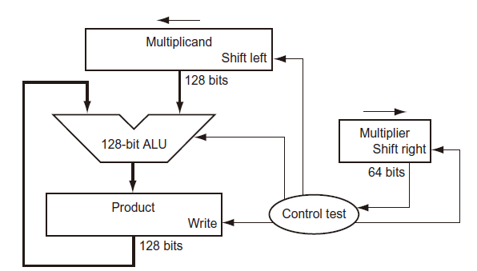
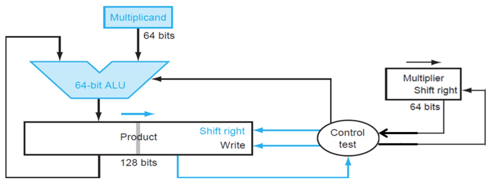
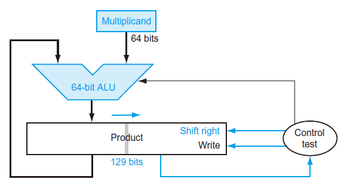
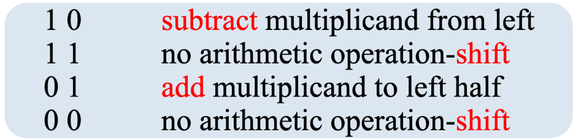
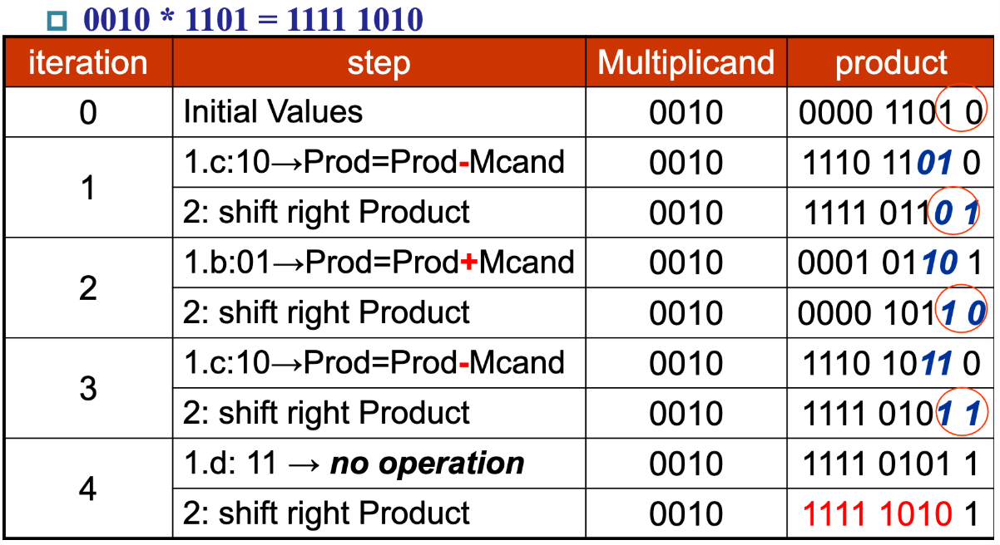
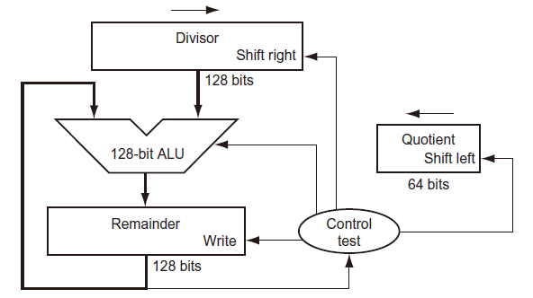
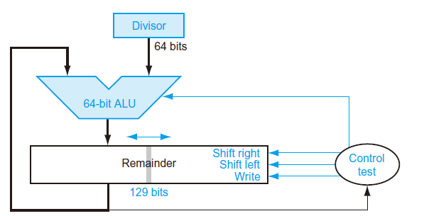
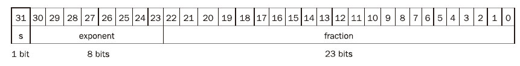
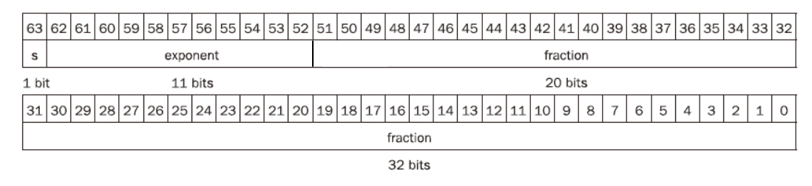
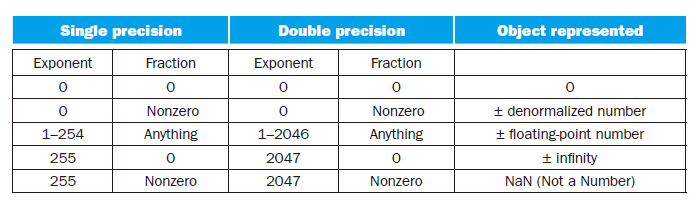

# 3 Arithmetic for Computers

<!-- !!! tip "说明"

    此文档正在更新中…… -->

!!! info "说明"

    1. 部分内容由 AI 翻译课本原文，可能存在错误
    2. 本文档只涉及部分知识点，仅可用来复习重点知识
    3. 部分课本练习题答案可能存在错误，欢迎在评论区指出，也可以写下你的疑问

## 3.2 Addition and Subtraction

### 无符号减法

$M - N$

1. M大于等于N（没产生借位）：正常输出
2. M小于N（产生借位）：取补码，再加负号

### 利用补码的无符号减法

$M - N$

转化为 M + N的补码

1. M大于等于N（产生进位）：去除进位即为答案
2. M小于N（没产生进位）：取补码，再加负号

### sign-magnitude 计算

$M +/- N$ 无论加减法都适用

3 个符号：M的符号，N的符号，运算符号（+为0，-为1）

1. 如果 3 个符号异或为0：
    1. 数值部分相加即可
    2. 检查是否有溢出（是否产生进位）
    3. 结果符号与M的符号相同
2. 如果 3 个符号异或为1：
    1. 数值部分相减（第 1 个减第 2 个）
    2. 检查是否产生borrow位：
          1. 若没有：即为结果，符号与M的符号相同
          2. 若有：结果取补码，符号与M的符号相反
    3. 不可能产生溢出

### 2's complement 计算

1. 加法：
    1. 正常算，抛弃产生的进位
    2. 如果 2 个运算数的符号相同且结果的符号也相同，说明没产生溢出
    3. 如果 2 个运算数的符号相同且结果的符号不相同，说明产生了溢出
    4. 如果 2 个运算数的符号不同，不可能产生溢出
2. 减法：取第 2 个数的补码，第 1 个数加第 2 个数的补码转换为加法

> 同学们可以自己取一些值把 4 种运算都算一下，体会一下运算过程，比如 4 bit 下 $6 + 4, -6 + 4, -6 - 4, -6 - (-4)$ 等等

???+ example "例题 课本 3.5 - sign-magnitude"

    What is 4365 − 3412 when these values represent signed 12-bit octal numbers stored in sign-magnitude format? The result should be written in octal. Show your work.

    ??? success "答案"

        $(4365)_8 = (100\_011\_110\_101)_2$

        > 以 $100\_011\_110\_101$ 的形式存在计算机中，实际上计算机认为它是 $(-245)_{10}$

        $(3412)_8 = (011\_100\_001\_010)_2$

        > 以 $011\_100\_001\_010$ 的形式存在计算机中，实际上计算机认为它是 $(1802)_{10}$

        3 个符号异或为 0 $(\verb!1 ^ 0 ^ 1 = 0!)$，数值部分相加

        $$
        \ \ \ 00\_011\_110\_101\\
        +11\_100\_001\_010\\
        ————————\\
        \ \ \ 11\_111\_111\_111
        $$

        没有产生进位，符号与第一个运算数的符号相同，即 $(111\_111\_111\_111)_2 = (7777)_8$

        > 以 $111\_111\_111\_111$ 的形式给出结果，实际上计算机认为它是 $(-2047)_{10} = (-3777)_8$，所以计算机认为的运算是 $-245 - 1802 = -2047$

???+ question "课本 3.7 - sign-magnitude"

    Assume 185 and 122 are signed 8-bit decimal integers stored in sign-magnitude format. Calculate 185 + 122. Is there overflow, underflow, or
    neither?

    ??? success "答案"

        $(185)_{10} = (1011\_1001)_2$

        > 以 $1011\_1001$ 的形式存在计算机中，实际上计算机认为它是 $(-57)_{10}$

        $(122)_{10} = (0111\_1010)_2$

        > 以 $0111\_1010$ 的形式存在计算机中，实际上计算机认为它是 $(122)_{10}$

        3 个符号异或为 1 $(\verb!1 ^ 0 ^ 0 = 1!)$，数值部分相减

        $$
        \ \ \ \dot{0} \dot{1} \dot{1}\_ \dot{1} \dot{0}01\\
        -111\_1010\\
        ————————\\
        \ \ \ 011\_1111
        $$

        产生了借位，结果取补码，符号与第一个运算数的符号相反，即$(0100\_0001)_2 = (65)_{10}$，Neither

        > 实际上计算机认为的运算是 $-57 + 122 = 65$

???+ question "课本 3.9 - 2's complement"

    Assume 151 and 214 are signed 8-bit decimal integers stored in two’s complement format. Calculate 151 + 214 using saturating arithmetic. The result should be written in decimal. Show your work.

    ??? success "答案"

        $(151)_{10} = (1001\_0111)_2$

        > 以 $1011\_1001$ 的形式存在计算机中，实际上计算机认为它是 $(-105)_{10}$

        $(214)_{10} = (1101\_0110)_2$

        > 以 $1101\_0110$ 的形式存在计算机中，实际上计算机认为它是 $(-42)_{10}$

        加法正常算

        $$
        \ \ \ 1001\_0111\\
        +1101\_0110\\
        ————————\\
        \ \ \ 0110\_1101
        $$

        抛弃产生的进位，结果为 $0110\_1101$，符号与原运算数符号不同，产生了 overflow。因为 2's complement 8 bit 最小的负数是 $(1000\_0000)_2 = (-128)_{10}$，所以答案为 $-128$

        > 实际上因为产生了进位，正确的结果应为 $(1\_0110\_1101)_2 = (-147)_{10}$，实际上计算机认为的运算是 $-105 - 42 = -147$

???+ question "课本 3.10 - 2's complement"

    Assume 151 and 214 are signed 8-bit decimal integers stored in two’s complement format. Calculate 151 − 214 using saturating arithmetic. The
    result should be written in decimal. Show your work.

    ??? success "答案"

        $(151)_{10} = (1001\_0111)_2$

        > 以 $1011\_1001$ 的形式存在计算机中，实际上计算机认为它是 $(-105)_{10}$

        $(214)_{10} = (1101\_0110)_2$

        > 以 $1101\_0110$ 的形式存在计算机中，实际上计算机认为它是 $(-42)_{10}$

        减法，第 1 个运算数加上第 2 个运算数的补码 $0010\_1010$

        $$
        \ \ \ 1001\_0111\\
        +0010\_1010\\
        ————————\\
        \ \ \ 1100\_0001
        $$

        结果为 $(1100\_0001)_2 = (-63)_{10}$

        > 实际上计算机认为的运算是 $-105 - (-42) = -63$

???+ question "课本 3.11 - 无符号数"
    
    Assume 151 and 214 are unsigned 8-bit integers. Calculate 151+ 214 using saturating arithmetic. The result should be written in decimal.
    Show your work.

    ??? success "答案"

        > 步骤与上面类似，而且这个是无符号数加法，最简单的一种。步骤省略

        $151 + 214 = 365$，但是 8 bit 无符号数最大为 255，所以最后结果是 255

## 3.3 乘法

**Multiplication**

第一个操作数称为 **被乘数**（multiplicand），第二个操作数称为 **乘数**（multiplier），最终的结果称为 **积**（product）

### 3.3.1 顺序的乘法算法和硬件

#### V1

64-bit 乘法器 V1：

<figure markdown="span">
    { width="600" }
</figure>

1. 被乘数放在 multiplicand 寄存器的低 64 位中，乘数放在 multiplier 寄存器中，积放在 product 寄存器中且被初始化为 0
2. 检测 multiplier 的最低有效位
      1. 若为 0：跳转到第 3 步
      2. 若为 1：multiplicand 与 product 进行加法运算，并将结果存储到 product 寄存器中
3. 将 multiplicand 寄存器中的值左移一位
4. 将 multiplier 寄存器中的值右移一位
5. 若已重复操作了 64 次，结束；否则回到第 2 步

#### V2

64-bit 乘法器 V2：

<figure markdown="span">
    { width="600" }
</figure>

1. 被乘数放在 multiplicand 寄存器中，乘数放在 multiplier 寄存器中，积放在 product 寄存器的高 64 位中且被初始化为 0
2. 检测 multiplier 的最低有效位
      1. 若为 0：跳转到第 3 步
      2. 若为 1： multiplicand 与 product 寄存器的高 64 位进行加法运算，并将结果存储到 product 寄存器的高 64 位中
3. 将 product 寄存器的值右移一位
4. 将 multiplier 寄存器的值右移一位
5. 若已重复操作了 64 次，结束；否则回到第 2 步

#### V3

64-bit 乘法器 V3：

<figure markdown="span">
    { width="600" }
</figure>

1. 被乘数放在 multiplicand 寄存器中，乘数放在 product 寄存器的低 64 位中，其余为初始化为 0
2. 检测 product 寄存器的最低有效位
      1. 若为 0：跳转到第 3 步
      2. 若为 1：multiplicand 与 product 寄存器的高 65 位（加法运算时，product 的最高有效位当作 $C_{in}$）进行加法运算，并将结果存储到 product 寄存器的高 65 位中（product 的最高有效位存放加法结果的 $C_{out}$）
3. 将 product 寄存器的值右移一位
4. 若已重复操作了 64 次，结束；否则回到第 2 步

### 3.3.2 有符号乘法

最简单的方法是首先将被乘数和乘数转化为正数，并记住原来的符号位。接下来按无符号乘法来算，并根据两个操作数的符号来调整结果

### 3.3.3 更快速的乘法

Booth's Algorithm

<figure markdown="span">
    { width="500" }
</figure>

<figure markdown="span">
    { width="600" }
</figure>

## 3.4 除法

**Division**

除法中的两个操作数分别称为 **被除数**（dividend），**除数**（divisor），结果称为 **商**（quotient）和 **余数**（remainder）

### 3.4.1 除法算法及其硬件结构

#### V1

64-bit 除法器 V1：

<figure markdown="span">
    { width="600" }
</figure>

1. 被除数存放在 remainder 寄存器中，除数存放在 divisor 寄存器的高 64 位，商存放在 quotient 寄存器中
2. 用 remainder 寄存器中的值减去 divisor 寄存器中的值，将结果放入 remainder 寄存器中
3. 检测 remainder 寄存器
      1. 若为正数：将 quotient 寄存器中的值左移一位，并将最低有效位置为 1
      2. 若为负数：
         1. 撤销第 2 步操作，即将 remainder 寄存器中的值与 divisor 寄存器中的值相加，将结果存入 remainder 寄存器
         2. 将 quotient 寄存器中的值左移一位，并将最低有效位置为 0
4. 将 divisor 寄存器中的值右移一位
5. 若已重复了 65 次，结束；否则返回第 2 步

#### V2

64-bit 除法器 V2：

<figure markdown="span">
    { width="600" }
</figure>

1. 被除数存放在 remainder 寄存器低 128 位中，最高有效位初始化为 0（多出来的这一位是为了保证做 ALU 运算时，进位和借位不丢失），除数存放在 divisor 寄存器中
2. 将 remainder 寄存器中的值左移一位
3. 用 remainder 寄存器高 65 位减去 divisor 寄存器中的值，将结果放入 remainder 寄存器高 65 位
4. 检测 remainder 寄存器
      1. 若为正数：将 remainder 寄存器中的值左移一位，并将最低有效位置为 1
      2. 若为负数：
         1. 撤销第 2 步操作，即将 remainder 寄存器高 65 位与 divisor 寄存器中的值相加，将结果存入 remainder 寄存器高 65 位
         2. 将 remainder 寄存器中的值左移一位，并将最低有效位置为 0
5. 若已重复了 64 次，跳转至第 6 步；否则返回第 3 步
6. 将 remainder 寄存器高 65 位的值右移一位。此时 remainder 寄存器 [127:64] 位为余数，低 64 位为商

!!! tip "除数为 0"

    divisor 为 0 时，硬件无法检测，需要软件进行检测

### 3.4.2 有符号除法

同有符号乘法一样，首先记住转化被除数和除数为正数，并记住原来的符号。但在最后根据符号处理结果的时候要遵循以下规则：

==两操作数符号相反时商为负，并使余数的符号和被除数相同==

1. $(+7) \div (-2) = -3 ······ +1$
2. $(-7) \div (+2) = -3 ······ -1$
3. $(-7) \div (-2) = +3 ······ -1$

## 3.5 Floating Point

### 表示

#### single precision

IEEE 754 单精度浮点

<figure markdown="span">
    { width="800" }
</figure>

符号位 S：0 为正数，1 为负数

指数位 E：实际指数 $e = E - 127$ 

!!! tip "bias 偏阶"

    这种计数法称为带偏阶的计数法 $biased\ notation$，需要从带偏阶的指数中减去偏阶，才能获得真实的值

    设指数位的位数用 `E#` 表示，则
    
    $$
    bias = 2^{E\# - 1} - 1
    $$

    单精度 $bias = 2^{8 - 1} - 1 = 2 ^ 7 - 1 = 127$ 
    双精度 $bias = 2^{11 - 1} - 1 = 2 ^ {10} - 1 = 1023$

小数位 F：实际小数 $1 + F$

!!! tip "hidden 1 隐含1"

    IEEE 754 隐藏了规格化二进制数的前导位 1

$$
floating\text{-} point\ number = (-1)^S \times (1 + F) \times 2^{E - bias}
$$

#### double precision

IEEE 754 双精度浮点

<figure markdown="span">
    { width="800" }
</figure>

> 课本原图有误，本图片已修正

符号位 S：0 为正数，1 为负数

指数位 E：实际指数 $e = E - 1023$

小数位 F：实际小数 $f = 1 + F$

!!! warning "二进制无限小数取近似"

    **single precision：**
    
    尾数共 23 位 
    1. 24 位为 0 时，舍去 23 位后面的数字 
    2. 24 位为 1 且 23 位后面不是 1000... 时，23 位加 1 且舍去 23 位后面的数字 
    3. 当 23 位后面是 1000... 时，若 23 位是 1，则 23 位加 1 并舍去 23 位后面的数字；若 23 位是 0，则舍去 23 位后面的数字

    <table>
      <thead>
        <tr>
          <th style="text-align: center; vertical-align: middle;">23</th>
          <th style="text-align: center; vertical-align: middle;">24</th>
          <th style="text-align: center; vertical-align: middle;">23 位后面</th>
          <th style="text-align: center; vertical-align: middle;">结果</th>
        </tr>
      </thead>
      <tbody>
        <tr>
          <td style="text-align: center; vertical-align: middle;">0</td>
          <td style="text-align: center; vertical-align: middle;">0</td>
          <td style="text-align: center; vertical-align: middle;"></td>
          <td style="text-align: center; vertical-align: middle;">舍去</td>
        </tr>
        <tr>
          <td style="text-align: center; vertical-align: middle;">1</td>
          <td style="text-align: center; vertical-align: middle;">0</td>
          <td style="text-align: center; vertical-align: middle;"></td>
          <td style="text-align: center; vertical-align: middle;">舍去</td>
        </tr>
        <tr>
          <td rowspan="2" style="text-align: center; vertical-align: middle;">0</td>
          <td rowspan="2" style="text-align: center; vertical-align: middle;">1</td>
          <td style="text-align: center; vertical-align: middle;">= 1000...</td>
          <td style="text-align: center; vertical-align: middle;">舍去</td>
        </tr>
        <tr>
          <td style="text-align: center; vertical-align: middle;">≠ 1000...</td>
          <td style="text-align: center; vertical-align: middle;">23 位加 1 且舍去 23 位后面的数字</td>
        </tr>
        <tr>
          <td style="text-align: center; vertical-align: middle;">1</td>
          <td style="text-align: center; vertical-align: middle;">1</td>
          <td style="text-align: center; vertical-align: middle;"></td>
          <td style="text-align: center; vertical-align: middle;">23 位加 1 且舍去 23 位后面的数字</td>
        </tr>
      </tbody>
    </table>

    > 例题见下文

    **double precision：**
    
    尾数共 52 位 
    1. 53 位为 0 时，舍去 52 位后面的数字 
    2. 53 位为 1 且 52 位后面不是 1000... 时，52 位加 1 且舍去 52 位之后的数字 
    3. 当 52 位后面是 1000... 时，若 52 位是 1，则 52 位加 1 并舍去 52 位后面的数字；若 52 位是 0，则舍去 52 位后面的数字

    <table>
      <thead>
        <tr>
          <th style="text-align: center; vertical-align: middle;">52</th>
          <th style="text-align: center; vertical-align: middle;">53</th>
          <th style="text-align: center; vertical-align: middle;">52 位后面</th>
          <th style="text-align: center; vertical-align: middle;">结果</th>
        </tr>
      </thead>
      <tbody>
        <tr>
          <td style="text-align: center; vertical-align: middle;">0</td>
          <td style="text-align: center; vertical-align: middle;">0</td>
          <td style="text-align: center; vertical-align: middle;"></td>
          <td style="text-align: center; vertical-align: middle;">舍去</td>
        </tr>
        <tr>
          <td style="text-align: center; vertical-align: middle;">1</td>
          <td style="text-align: center; vertical-align: middle;">0</td>
          <td style="text-align: center; vertical-align: middle;"></td>
          <td style="text-align: center; vertical-align: middle;">舍去</td>
        </tr>
        <tr>
          <td rowspan="2" style="text-align: center; vertical-align: middle;">0</td>
          <td rowspan="2" style="text-align: center; vertical-align: middle;">1</td>
          <td style="text-align: center; vertical-align: middle;">= 1000...</td>
          <td style="text-align: center; vertical-align: middle;">舍去</td>
        </tr>
        <tr>
          <td style="text-align: center; vertical-align: middle;">≠ 1000...</td>
          <td style="text-align: center; vertical-align: middle;">52 位加 1 且舍去 52 位后面的数字</td>
        </tr>
        <tr>
          <td style="text-align: center; vertical-align: middle;">1</td>
          <td style="text-align: center; vertical-align: middle;">1</td>
          <td style="text-align: center; vertical-align: middle;"></td>
          <td style="text-align: center; vertical-align: middle;">52 位加 1 且舍去 52 位后面的数字</td>
        </tr>
      </tbody>
    </table>

???+ example "例题 课本 3.22 - 16 进制转浮点数"

    What decimal number does the bit pattern 0 × 0C000000 represent if it is a floating point number? Use the IEEE 754 standard.

    ??? success "答案"

        $0x0c000000 = 0\ 0001\ 1000\ 0000 ···$
    
        $E = 0001\ 1000 = 24$
    
        $e = E - 127 = -103$
    
        结果为 $1.0 \times 2^{-103}$

???+ question "课本 3.23 - 10 进制转 single 浮点数"
    
    Write down the binary representation of the decimal number 63.25 assuming the IEEE 754 single precision format.

    ??? success "答案"

        $$
        63.25 = 1111\ 11.01\\
        \kern5.2em = 1.1111\ 1010 \times 2 ^{5}\\
        $$

        $S = 0$

        $E = e + 127 = 5 + 127 = 132 = 1000\ 0100$

        $F = 1111\ 1010\ ···$

        结果为 $0\ 1000\ 0100\ 1111\ 1010\ ···$

???+ question "课本 3.24 - 10 进制转 double 浮点数"
    
    Write down the binary representation of the decimal number 63.25 assuming the IEEE 754 double precision format.

    ??? success "答案"

        $$
        63.25 = 1111\ 11.01\\
        \kern5.2em = 1.1111\ 1010 \times 2 ^{5}\\
        $$

        $S = 0$

        $E = e + 1023 = 5 + 1023 = 1028 = 100\ 0000\ 0100$

        $F = 1111\ 1010\ ···$

        结果为 $0\ 100\ 0000\ 0100\ 1111\ 1010\ ···$

???+ warning "0.3 转浮点数"

    **single precision:**

    $$
    0.3 = 0.01\ 0011\ 0011\ 0011\ ··· \times 2 ^ 0\\
    \kern0.9em = 1.0011\ 0011\ 0011\ ··· \times 2^{-2}
    $$

    $S = 0$

    $E = e + 127 = -2 + 127 = 125 = 0111\ 1101$

    $F = 0011\ 0011\ 0011\ 0011\ 0011\ 001\ 1$

    F 第 24 位为 1 且 23 位后面数字 $1\ 0011\ 0011\ ···$ 不为 1000，则 23 位加 1 且舍去 23 位后面的数字，即

    $F = 0011\ 0011\ 0011\ 0011\ 0011\ 010$

    结果为 $0\ 0111\ 1101\ 0011\ 0011\ 0011\ 0011\ 0011\ 010$

    **double precision:**

    $E = e + 1023 = 1021 = 011\ 1111\ 1101$

    $F = 0011\ 0011\ 0011\ 0011\ 0011\ 0011\ 0011\ 0011\ 0011\ 0011\ 0011\ 0011\ 0011\ 0$

    F 第 53 位为 0，舍去 53 位后面的数字，即

    $F = 0011\ 0011\ 0011\ 0011\ 0011\ 0011\ 0011\ 0011\ 0011\ 0011\ 0011\ 0011\ 0011$

    结果为 $0\ 011\ 1111\ 1101\ 0011\ 0011\ 0011\ 0011\ 0011\ 0011\ 0011\ 0011\ 0011\ 0011\ 0011\ 0011\ 0011$

### 范围和精度

<figure markdown="span">
    { width="800" }
</figure>

==我们不考虑 $denormalized\ number$ （非规格化数）的存在==

!!! note "记忆"

    1. $0x0000\_0000 = 0$
    2. $0x7F80\_0000 = +\infty$
    3. $0xFF80\_0000 = -\infty$
    4. 注意 NaN 也需要记忆，考试也会考

    > 可恶，没人告诉我呀

#### single precision

E 最低为 1（因为如果是 0 的话，由上面的表格，表示的要么是 0，要么是非规格化数），则 e 最低为 -126。F 最低为 $0000 ···$, 因为有 hidden 1 存在，所以 f 最低为 1.0。则最小数的绝对值为 $1.0 \times 2^{-126}$

最小数为 $\pm 1.0 \times 2^{-126}$

E 最高为 254（因为如果是 255 的话，表示的要么是无穷，要么是 NaN），则 e 最高为 127。F 最高为 $1111\ 1111\ ···$，即 $1 - 2 ^{-23}$，还有 hidden 1 存在，所以 f 最高为 $1.1111\ 1111\ ···$， 即 $2 - 2 ^{-23}$。则最大数的绝对值为 $(2 - 2 ^{-23}) \times 2 ^ {127}$

最大数为 $\pm (2 - 2 ^{-23}) \times 2 ^ {127}$

精度为 $2 ^ {-23}$

!!! tip "范围和精度"

    范围：$\pm 1.0 \times 2^{1 - bias} \sim \pm (2 - 2^{-F\#}) \times 2^{bias}$

    精度：$2^{-F\#}$

#### double precision

同理：

最小数为 $\pm 1.0 \times 2^{-1022}$

最大数为 $\pm (2 - 2 ^{-52}) \times 2 ^ {1023}$

精度为 $2 ^ {-52}$

???+ example "例题 课本 3.26 - 10 进制转浮点数"
    
    Write down the binary bit pattern to represent $−1.5625 × 10^{−1} $ assuming a format similar to that employed by the DEC PDP-8 (the leftmost 12 bits are the exponent stored as a two’s complement number, and the rightmost 24 bits are the fraction stored as a two’s complement number). No hidden 1 is used. Comment on how the range and accuracy of this 36-bit pattern compares to the single and double precision IEEE 754 standards.

    ??? success "答案"

        小数部分用 2's complement 表示，说明符号位是小数部分的第一位

        $$
        -1.5625 \times 10^{-1} = -0.15625 \times 10^0\\
        \kern6.5em = -0.00101 \times 2^0\\
        \kern6.1em = -0.101 \times 2^{-2}\\
        $$

        $E = -2 = 1111\ 1111\ 1110$

        $F = -0.101 = 0.1011\ 0000 ···$

        结果为 $1111\ 1111\ 1110\ 1011\ 0000\ ···$

        > 关于范围和精度，网上暂时没有找到答案，我算出来是这样的，不知道对不对

        范围： $-2^{-23} \times 2^{-2048} \sim (2 - 2^{-23}) \times 2^{2047}$

        精度：$2^{-23}$

???+ question "课本 3.27 - 10 进制转浮点数"
    
    IEEE 754-2008 contains a half precision that is only 16 bits wide. The leftmost bit is still the sign bit, the exponent is 5 bits wide and has a bias of 15, and the mantissa is 10 bits long. A hidden 1 is assumed. Write down the bit pattern to represent −1.5625 × 10−1 assuming a version of this format, which uses an excess-16 format to store the exponent. Comment on how the range and accuracy of this 16-bit floating point format compares to the single precision IEEE 754 standard.

    ??? success "答案"

        $$
        -1.5625 \times 10^{-1} = -0.15625 \times 10^0\\
        \kern6.5em = -0.00101 \times 2^0\\
        \kern5.6em = -1.01 \times 2^{-3}\\
        $$

        $E = e + bias = -3 + 15 = 12 = 01100$

        $F = 0100\ 0000\ ···$

        结果为 $1\ 01100\ 0100\ 0000\ ···$

        直接套用上面提到的公式：

        范围：$\pm 1.0 \times 2^{-14} \sim \pm (2 - 2^{-10}) \times 2^{15}$

        精度：$2^{-10}$

### 算数精确性

IEEE 754 在中间计算中，右边总是多保留 2 位，分别称为 $guard$ （保护位）和 $round$（舍入位）

在这 2 位之后还有 1 位 $sticky\ bit$（粘贴位），当舍入位右边的数非零时将它置 1。粘贴位可以让计算机在舍入时，能够区分 $(0.50···00)_{10}$ 和 $(0.50···01)_{10}$

总之，3 位一起决定舍入，如果 $\lbrace guard,\ round,\ sticky\ bit \rbrace_2 > (100)_2$，$round\ up$（进位）；如果 $\lbrace guard,\ round,\ sticky\ bit \rbrace_2 < (100)_2$，舍掉；如果 $\lbrace guard,\ round,\ sticky\ bit \rbrace_2 = (100)_2$，偶数不变，奇数变偶数
        
???+ example "例题 课本 3.32 - 浮点数加法"
    
    Calculate $(3.984375 × 10^{−1} + 3.4375 × 10^{−1}) + 1.771 × 10^3$ by hand, assuming each of the values is stored in the 16-bit half precision format described in Exercise 3.27 (and also described in the text). Assume 1 guard, 1 round bit, and 1 sticky bit, and round to the nearest even. Show all the steps, and write your answer in both the 16-bit floating point format and in decimal.

    ??? success "答案"

        $$
        3.984375 \times 10^{-1} = 0.3984375\\
        \kern9.5em = 0.0110\ 011 \times 2^0\\
        \kern11.5em = 1.10011\ 00000 \times 2^{-2}
        $$

        $$
        3.4375 \times 10^{-1} = 0.34375\\
        \kern8.3em = 0.01011 \times 2^0\\
        \kern11.6em = 1.01100\ 00000 \times 2^{-2}
        $$

        $$
        1.771 \times 10^3 = 1771\\
        \kern9.2em = 110\ 1110\ 1011\\
        \kern11.7em = 1.10111\ 01011 \times 2^{10}
        $$

        设这 3 个数从左到右依次为A，B，C

        (A + B):

        $$
        \ \ \ 1.10011\ 00000\\
        + 1.01100\ 00000\\
        ————————\\
        \ 10.11111\ 00000
        $$

        $$
        (A + B) = 10.11111\ 00000 \times 2 ^{-2}\\
        \kern3.4em = 1.01111\ 10000 \times 2 ^{-1}
        $$

        $A + B$ 小数点左移：$A + B = 0.00000\ 00000\ 101 \times 2 ^{10}$

        $guard = 1, round = 0, sticky\ bit = 1$

        > 这里 $sticky\ bit = 1$，不是因为小数点左移后第 13 个小数位为 1，而是因为小数点左移后，round 位的右边是 $1111\ 10000$，是非零数，所以 sticky bit 置为 1

        (A + B) + C:

        $$
        \ \ \ 0.00000\ 00000\\
        + 1.10111\ 01011\\
        ————————————\\
        \ \ \ 1.10111\ 01011
        $$

        $101 > 100$，进位。结果为 $1.10111\ 01100 \times 2 ^{10} = 110\ 1110\ 1100 = 1772$

???+ question "课本 3.33 - 浮点数加法"
    
    Calculate $3.984375 × 10^{−1} + (3.4375 × 10^{−1} + 1.771 × 10^3)$ by hand, assuming each of the values is stored in the 16-bit half precision format described in Exercise 3.27 (and also described in the text). Assume 1 guard, 1 round bit, and 1 sticky bit, and round to the nearest even. Show all the steps, and write your answer in both the 16-bit floating point format and in decimal.

    ??? success "答案"

        $$
        3.984375 \times 10^{-1} = 0.3984375\\
        \kern9.5em = 0.0110\ 011 \times 2^0\\
        \kern11.5em = 1.10011\ 00000 \times 2^{-2}
        $$

        $$
        3.4375 \times 10^{-1} = 0.34375\\
        \kern8.3em = 0.01011 \times 2^0\\
        \kern11.6em = 1.01100\ 00000 \times 2^{-2}
        $$

        $$
        1.771 \times 10^3 = 1771\\
        \kern9.2em = 110\ 1110\ 1011\\
        \kern11.7em = 1.10111\ 01011 \times 2^{10}
        $$

        设这 3 个数从左到右依次为A，B，C

        B 小数点左移。$B = 0.00000\ 00000\ 011$

        $guard = 0, round = 1, sticky = 1$

        > 这里 $sticky\ bit = 1$，是因为 round 位的右边是 $01100\ 00000$，是非零数，所以 sticky bit 置为 1

        (B + C):

        $$
        \ \ \ 0.00000\ 00000\\
        + 1.10111\ 01011\\
        ————————————\\
        \ \ \ 1.10111\ 01011
        $$

        A 小数点左移。$A = 0.00000\ 00000\ 011$

        A + (B + C):

        $$
        \ \ \ 0.00000\ 00000\\
        + 1.10111\ 01011\\
        ————————————\\
        \ \ \ 1.10111\ 01011
        $$

        $011 < 100$，不进位

        结果为 $1.10111\ 01011 \times 2 ^{10} = 110\ 1110\ 1011 = 1771$

        > guard，round，sticky bit 不参与计算，计算过程中不发生变化