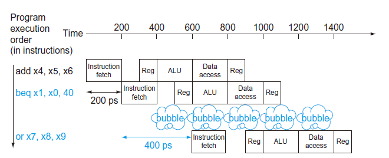

# 4 The Processor

!!! tip "说明"

    此文档正在更新中……

!!! info "说明"

    1. 部分内容由 AI 翻译课本原文，可能存在错误
    2. 本文档只涉及部分知识点，仅可用来复习重点知识
    3. 部分课本练习题答案可能存在错误，欢迎在评论区指出
   
    > 理论课讲到这里的时候，实验课已经把单周期 CPU 都实现了，4.1 - 4.4 理解起来很容易啦，就不过多讲解了。需要注意的是，实验课讲的一些实现方法和这里讲的有些不一样

## 4.1 引言

处理器的实现方式决定了时钟周期长度和 CPI

### 4.1.1 一个基本的 RISC-V 实现

核心子集：

1. 存储器访问指令：ld，sd
2. 算术逻辑指令：add，sub，and，or
3. 分支指令：beq

### 4.1.2 实现方式概述

实现每条指令的前两步是一样的：

1. 程序计数器（PC）指向指令所在的存储单元，并从中取出指令
2. 译码，读寄存器

> 实验课里面，PC 指向指令所在的存储单元就是 ROM。另外，我们 vivado 生成的 ROM，地址为 0 就是取出第一个数据，地址为 1 就是取出第二个数据。但我们让 PC + 4，所以观察 CSSTE 电路图，可以发现 ROM 的地址我们接入的是 PC[11:2]

<figure markdown="span">
    { width="600" }
</figure>

加入多选器模块和控制单元：

<figure markdown="span">
    { width="600" }
</figure>

## 4.2 逻辑设计惯例

**状态单元**（state element）：一个存储单元，如寄存器或存储器

1. 使用术语 **有效** （asserted），表示逻辑高（1）
2. 使用属于 **无效** （deasserted），表示逻辑低（0）

### 4.2.1 时钟方法

**clocking methodology**

## 4.3 建立数据通路

**building a datapath**

用于取指和程序计数器自增的数据通路部分：

<figure markdown="span">
    { width="600" }
</figure>

处理器的 32 个通用寄存器位于一个叫做 **寄存器堆**（register file）的结构中

实现分支指令的部分：

<figure markdown="span">
    { width="600" }
</figure>

> 实验课实现的数据通路，分支指令的立即数乘以 2 已经在 ImmGen 模块就实现了，不需要后续在左移 1 位 

### 4.3.1 创建一个简单的数据通路

实现 R-type 指令和存储指令：

<figure markdown="span">
    { width="600" }
</figure>

现在，我们将上述三个部分合并：

<figure markdown="span">
    { width="600" }
</figure>

???+ question "课本 4.1"

    Consider the following instruction:

    Instruction: `and rd, rs1, rs2`

    Interpretation: `Reg[rd] = Reg[rs1] AND Reg[rs2]`

    (1) What are the values of control signals generated by the control in the figure below for this instruction?

    <figure markdown="span">
        { width="600" }
    </figure>

    (2) Which resources (blocks) perform a useful function for this instruction?

    (3) Which resources (blocks) produce no output for this instruction? Which resources produce output that is not used?

    ??? success "答案"

        (1) `RegWrite = true` `ALUSrc = 0` `ALU operation = "and"` `MemWrite = false` `MemRead = false` `MemtoReg = 0`

        ---

        (2) Register file, ALUsrc MUX, ALU, MemToReg MUX

        ---

        (3) All blocks produce some output<br/>
        output not used: ImmGen and DataMemory

## 4.4 一个简单的实现机制

### 4.4.1 ALU 控制

| ALU control lines | Function |
| :--: | :--: |
| 0000 | AND |
| 0001 | OR |
| 0010 | add |
| 0110 | subtract |

1. 对于取字和存储字指令，ALU 用加法计算存储器地址
2. 对于 R-type 指令：根据 funct7 和 funct3 选择某个操作
3. 对于 `beq` 指令：ALU 执行减法操作

<figure markdown="span">
    { width="600" }
</figure>

主控制单元生成 ALUOp 作为 ALU 控制单元的输入，再由 ALU 控制单元生成真正控制 ALU 的信号，这种多级译码的方法是一种常用的实现方式。使用多级译码可以减小主控制单元的规模。使用多个小控制单元还可以提高控制单元的速度。这种优化是很重要的，因为控制单元的性能对减少时钟周期非常关键

### 4.4.2 主控制单元的设计

<figure markdown="span">
    { width="600" }
</figure>

控制信号的作用：

<figure markdown="span">
    { width="600" }
</figure>

包含控制信号的数据通路：

<figure markdown="span">
    { width="600" }
</figure>

### 4.4.3 数据通路的操作

<figure markdown="span">
    { width="600" }
</figure>

### 4.4.4 控制的结束

<figure markdown="span">
    { width="600" }
</figure>

### 4.4.5 为什么不使用单周期实现方式

虽然单周期设计也可以正确地工作，但现代设计中并不采取这种方式，因为它的效率太低。究其原因，是在单周期设计中，时钟周期对所有指令等长，这样时钟周期要由执行时间最长的那条指令决定。这条指令几乎肯定是装载指令，它依次使用了5个功能单元：指令存储器、寄存器堆、ALU、数据存储器、寄存器堆。虽然CPI为1（见第1章），单周期实现方式的总体性能并不一定很好，因为时钟周期实在是太长了

使用单周期设计的代价虽然很大，但对于小指令集来说，或许是可以接受的。事实上，早期具有简单指令集的计算机就曾经采用过这种实现方式。然而，若要实现包含浮点或更复杂指令的指令集，这样的单周期设计根本不能胜任

因为时钟周期必须满足所有指令中最坏的情况，故不能使用那些缩短常用指令执行时间而不改善最坏情况的实现技术。这样，单周期实现方式违背了第2章中加快常见情况这一设计原则

在 4.5 节，我们将看到一种称为流水线的实现技术，使用与单周期类似的数据通路，但效率更高。从方法来说，流水线是通过重叠多条指令的执行来提高效率的

???+ question "课本 4.4"

    When silicon chips are fabricated, defects in materials (e.g., silicon) and manufacturing errors can result in defective circuits. A very common defect is for one signal wire to get “broken” and always register a logical 0. This is often called a “stuck-at-0” fault.

    (1) Which instructions fail to operate correctly if the MemToReg wire is stuck at 0?

    (2) Which instructions fail to operate correctly if the ALUSrc wire is stuck at 0?

    ??? success "答案"

        (1) MemToReg 一直是 0 的话，写回寄存器组的数据只能是 ALU 的结果，不会是 DataMemory 的结果，所以涉及从内存当中取数的指令都运行不正确
        
        `loads`

        ---

        (2) ALUSrc 一直是 0 的话，第二个操作数只能是来自寄存器组的数据，不会是立即数，所以涉及立即数操作的指令都运行不正常

        `I-type` `loads` `stores`

???+ question "课本 4.6"

    Section 4.4 does not discuss I-type instructions like addi or andi.

    (1) What additional logic blocks, if any, are needed to add I-type instructions to the CPU shown in the figure below? Add any necessary logic blocks to the figure below and explain their purpose.

    <figure markdown="span">
        { width="600" }
    </figure>

    (2) List the values of the signals generated by the control unit for addi. Explain the reasoning for any “don’t care” control signals.

    ??? success "答案"

        (1) No additional logic blocks are needed

        > 无语

        ---

        (2) `Branch = false` `MemRead = false` `MemToReg = 0` `ALUOp = "add"` `MemWrite = false` `ALUSrc = 1` `RegWrite = 1`

        don't care: `MemRead`，由于 `MemToReg` 为 0，选择的是 ALU 结果，因此 DataMemory 读不读出数据无所谓

???+ question "课本 4.7"

    Problems in this exercise assume that the logic blocks used to implement a processor’s datapath have the following latencies:

    <figure markdown="span">
        { width="600" }
    </figure>

    “Register read” is the time needed after the rising clock edge for the new register value to appear on the output. This value applies to the PC only. “Register setup” is the amount of time a register’s data input must be stable before the rising edge of the clock. This value applies to both the PC and Register File.

    (1) What is the latency of an R-type instruction (i.e., how long must the clock period be to ensure that this instruction works correctly)?

    (2) What is the latency of ld? (Check your answer carefully. Many students place extra muxes on the critical path.)

    (3) What is the latency of sd? (Check your answer carefully. Many students place extra muxes on the critical path.)

    (4) What is the latency of beq?

    (5) What is the latency of an I-type instruction?

    (6) What is the minimum clock period for this CPU?

    ??? success "答案"

        找最长的那条路径

        (1) `RegisterRead + I-Mem + RegisterFile + Mux + ALU + Mux + RegisterSetup = 30 + 250 + 150 + 25 + 200 + 25 + 20 = 700ps`

        <figure markdown="span">
            { width="600" }
        </figure>

        ---

        (2) `RegisterRead + I-Mem + RegisterFile + Mux + ALU + D-Mem + Mux + RegisterSetup = 30 + 250 + 150 + 25 + 200 + 250 + 25 + 20 = 950ps`

        <figure markdown="span">
            { width="600" }
        </figure>

        ---

        (3) `RegisterRead + I-Mem + RegisterFile + Mux + ALU + D-Mem = 30 + 250 + 150 + 25 + 200 + 250 = 905ps`

        <figure markdown="span">
            { width="600" }
        </figure>

        ---

        (4) `RegisterRead + I_Mem + RegisterFile + Mux + ALU + SingleGate + Mux + RegisterSetup = 30 + 250 + 150 + 25 + 200 + 5 + 25 + 20 = 705ps`

        <figure markdown="span">
            { width="600" }
        </figure>

        ---

        (5) `RegisterRead + I_Mem + RegisterFile + Mux + ALU + Mux + RegisterSetup = 30 + 250 + 150 + 25 + 200 + 25 + 20 = 700ps`

        <figure markdown="span">
            { width="600" }
        </figure>

        ---

        (6) `sd` 指令最长，选择 950ps 最为 CPU clock

???+ question "课本 4.9"

    Consider the addition of a multiplier to the CPU shown in the figure below. This addition will add 300 ps to the latency of the ALU, but will reduce the number of instructions by 5% (because there will no longer be a need to emulate the multiply instruction).

     <figure markdown="span">
        { width="600" }
    </figure>

    (1) What is the clock cycle time with and without this improvement?

    (2) What is the speedup achieved by adding this improvement?

    (3) What is the slowest the new ALU can be and still result in improved performance?

    ???+ success "答案"

        (1) without improvement: 950ps（应该是延续 4.7）with improvement: 950 + 300 = 1250ps

        ---

        (2) 设程序的指令数为 $n$
        
        $T = 950n \times CPI$<br/>
        $T' = 1250\times (1 - 5\%)n \times CPI= 1187.5n \times CPI$

        则“加速”了 $\dfrac{T}{T'} = 0.8$ 倍

        ---

        (3) 答案原文：Because adding a multiply instruction will remove 5% of the instructions, the cycle time can grow to as much as 950/(0.95) = 1000. Thus, the time for the ALU can increase by up to 50 (from 200 to 250).

        > 暂时没看懂

## 4.5 流水线概述

**An Overview of Pipelining**

**流水线**（pipelining）是一种实现多条指令重叠执行的技术

通常，一个 RISC-V 指令包含如下五个处理步骤：

1. 从指令存储器中读取指令
2. 指令译码的同时读取寄存器
3. 执行操作或计算地址
4. 从数据存储器中读取操作数（如果需要的话）
5. 将结果写回寄存器（如果需要的话）

!!! example "单周期指令模型与流水线性能"

    <figure markdown="span">
        { width="600" }
    </figure>

    <figure markdown="span">
        { width="600" }
    </figure>

所有的流水级都只花费一个时钟周期的时间，因此，时钟周期必须能够满足最慢操作的执行需要。单周期模型中必须选择最坏情况下的 800 ps 作为时钟周期，流水线执行模型的时钟周期必须选择最坏情况下的 200 ps 作为时钟周期。流水线能够将性能提高 4 倍

如果流水线各阶段操作平衡，那么在流水线机器上的指令执行时间为（在理想情况下）

$$
Time\ between\ instruction_{pipelined} = \dfrac{Time\ between\ instruction_{nonpipelined}}{Number\ of\ pipe\ stages}
$$

即在理想情况和有大量指令的情况下，流水线所带来的加速比与流水线的级数近似相同。例如一个 5 级流水线能够获得的加速比接近于 5

流水线引入了一些开销。所以，在流水线机器中每一条指令的执行时间会超过这个最小的可能值，因此流水线能够获得的加速比也就小于流水线的级数

流水线所带来的性能提高是通过增加指令的吞吐率，而不是减少单条指令的执行时间实现的

### 4.5.1 面向流水线的指令集设计

### 4.5.2 流水线冒险

**Pipeline Hazards**

在下一个时钟周期中下一条指令不能执行。这种情况称为 **冒险**（hazard）

#### 结构冒险

**Structural Hazard**

硬件不支持多条指令在同一时钟周期执行

#### 数据冒险

**Data Hazards**

**数据冒险** 发生在由于一条指令必须等待另一条指令的完成而造成流水线暂停的情况下

在计算机流水线中，数据冒险是由于一条指令依赖于更早的一条还在流水线中的指令造成的。比如有一条减法指令需要使用上一条加法指令的结果

```verilog linenums="1"
add x19, x0, x1
sub x2, x19, x3
```

一种最基本的解决方法：对于上述的代码序列，一旦 ALU 生成了加法运算的结果，就可以将它用作减法运算的一个输入项。从内部资源中直接提前得到缺少的运算项的过程称为 **转发**（forwarding） 或者 **旁路**（bypassing）

!!! example "两条指令间的转发"

    <figure markdown="span">
        { width="600" }
    </figure>

    <figure markdown="span">
        { width="600" }
    </figure>

    <figure markdown="span">
        { width="600" }
    </figure>

转发可以工作得很好，然而它并不能够避免所有流水线阻塞的发生。如下图所示，即使采用了转发机制，在遇到 **装载-使用型数据冒险** (1) （load-use data hazard）时，流水线不得不阻塞一个步骤。图中显示了一个重要的流水线概念，正式的叫法是 **流水线阻塞**（pipeline），但是它经常被昵称为气泡（bubble）
{.annotate}

1. 一类特殊的数据冒险，指当装载指令要取的数还没取回来时其他指令就需要使用的情况

<figure markdown="span">
    { width="600" }
</figure>

!!! example "重新安排代码以避免流水线阻塞"

    考虑此 C 代码：

    ```c linenums="1" title="c"
    a = b + e;
    c = b + f;
    ```

    对应的 RISC-V 指令，假设所有的变量都在存储器中，且以 x10 为基址进行寻址：

    ```verilog linenums="1" title="RISC-V" hl_lines="2 3 5 6"
    ld x1, 0(x31)
    ld x2, 8(x31)
    add x3, x1, x2
    sd x3, 24(x31)
    ld x4, 16(x31)
    add x5, x1, x4
    sd x5, 32(x31)
    ```

    两条 add 指令都存在冒险，因为他们都依赖于上一条 ld 指令。通过将第三条 ld 指令提前可以消除所有的冒险

    ```verilog linenums="1" title="RISC-V"
    ld x1, 0(x31)
    ld x2, 8(x31)
    ld x4, 16(x31)
    add x3, x1, x2
    sd x3, 24(x31)
    add x5, x1, x4
    sd x5, 32(x31)
    ```

#### 控制冒险

**Control Hazards**

控制冒险也称为 **分支冒险**（branch hazard）。控制冒险发生在决策依赖于一条指令的结果，而其正在执行中。计算机中的决策就是分支指令。在去分支指令之后，紧跟着就会取下一条指令。但是流水线并不知道下一条真正要执行的指令在哪里，因为它才刚刚从指令存储器中把分支指令给取出来

一种可能的解决方法是取分支指令后立即 **阻塞**（stall）流水线，直到流水线确定分支指令的结果并指导下一条真正要执行的指令在哪为止

<figure markdown="span">
    { width="600" }
</figure>

!!! example "阻塞对分支性能的影响"

    假设其他所有指令的 CPI 都为 1，分支指令约占执行指令的 17%。分支指令阻塞要多一个时钟周期，因此平均 CPI 为 1.17

如果不能在第二级解决分支问题，那么分支结构上的阻塞将导致更大的速度下降。对很多计算机来说，这种阻塞的方法代价太大，因此也就产生了另外一种消除控制冒险的方法

**预测：**（predict）一种简单的预测方法讲就是总预测分支未发生。当预测正确的时候，流水线会全速地执行。只有当分支发生时流水线才会阻塞

<figure markdown="span">
    { width="600" }
</figure>

<figure markdown="span">
    { width="500" }
</figure>

一种更加成熟的分支预测方法是预测一些分支发生而预测另一些分支不发生。在计算机程序中，循环体底部的分支总是会跳回到循环体的顶部。在此种情况下，由于分支总是发生并且向前跳转，因此我们可以预测分支会跳转到前面的某一地址处

这种分支预测方法依赖于始终不变的行为，它没有考虑特定分支指令的特点。**动态**（Dynamic）硬件预测其与这种方法截然不同，它的预测取决于每一条指令的行为，并且在整个程序生命期内可能改变分支的预测结果

计算机中动态预测方法的一种比较普遍的实现方式是保存每次分支的历史记录，然后利用这个历史记录来预测。稍后我们将看到，历史记录的数量和类型足够多时，这种硬件预测分支的方式能够达到 90% 的正确率。当预测错误时，流水线控制必须确保被错误预测的分支后面的指令执行不会生效，并且必须在正确的分支地址处重新开始启动流水线

如同其他解决控制冒险的方法一样，较长的流水线会恶化预测的性能，并会提高错误预测的代价

## 4.6 流水线数据通路及其控制

将指令划分为五个阶段意味着一个流水线采用五级

<figure markdown="span">
    { width="800" }
</figure>

1. IF：取指令
2. ID：指令译码，读寄存器堆
3. EX：执行或计算地址
4. MEM：存储器访问
5. WB：写回

然而，在从左到右的指令流中有两个例外：

- 写回阶段，它把结果写回数据通路中间的寄存器堆中
- 选择 PC 的下一个值时，需在自增的 PC 和 MEM 级的分支地址间进行选择

这两个从右向左的数据流不会影响当前指令；只有当前指令以后的指令才会受到这种数据反向活动的影响。需要注意的是第一个例外会导致数据冒险，而第二个会导致控制冒险

<figure markdown="span">
    { width="800" }
</figure>

在两个阶段之间添加寄存器来存储指令和相应的变量

分析 `ld` 指令：

<figure markdown="span">
    { width="800" }
    <div style="text-align: left">
        **取指令：** 图中表示指令使用 PC（程序计数器）中的地址从存储器中读取数据，然后将数据放入 IF/ID 流水线寄存器中。PC 地址加 4 然后写回 PC 以便为下个时钟周期做好准备。增加后的地址同时也存入了 IF/ID 流水线寄存器中以备后面的指令使用（如 beq）。计算机并不知道所取指令的类型，所以必须考虑到所有可能的指令，并沿流水线传递所有可能有用的信息
    </div>
</figure>

<figure markdown="span">
    { width="800" }
    <div style="text-align: left">
        **指令译码与寄存器堆的读取：** 图中显示的是 IF/ID 流水线寄存器的指令部分，其中包括一个 64 位的立即数和两个寄存器号（用于读取寄存器）。这三个值和自增的 PC 地址一起存入 ID/EX 流水线寄存器中。这里同样必须传递后面指令可能需要的所有信息
    </div>
</figure>

<figure markdown="span">
    { width="800" }
    <div style="text-align: left">
        **执行或者地址计算：** 图中表示装载指令从 ID/EX 流水线寄存器中读取由寄存器 1 传过来的值以及经符号扩展后的立即数，并用 ALU 将它们相加，和值存入 EX/MEM 流水线寄存器中
    </div>
</figure>

<figure markdown="span">
    { width="800" }
    <div style="text-align: left">
        **存储器访问：** 图中表示装载指令使用从 EX/MEM 流水线寄存器中得到的地址读取数据存储器，并将数据存入 MEM/WB 流水线寄存器中
    </div>
</figure>

<figure markdown="span">
    { width="800" }
    <div style="text-align: left">
      **写回：** 图中表示了最后一个步骤，即从 MEM/WB 流水线寄存器中读取数据并将它写回寄存器堆
    </div>
</figure>

但其实在上述过程中有错误，在装载指令执行的最后一级写回了哪个寄存器呢？更确切地说，哪条指令提供了写寄存器号呢？在 IF/ID 流水线寄存器中的指令提供了写寄存器号，但是很显然现在这条指令已经是装载指令之后的指令了

因此，我们要在装载指令中保存目的寄存器号。就像存储指令为了 MEM 的需要将寄存器的内容从 ID/EX 传送到 EX/MEM 中一样，为了 WB 级使用的需要，装载指令必须把寄存器号从 ID/EX 经过 EX/MEM 传送到 MEM/WB 中。从另一个角度来考虑寄存器号的传递，为了共享流水线的数据通路，我们需要在 IF 中保存读取的指令，因此每一个流水线寄存器都要保存当前和后续流水级所需的部分指令

下图给出了修正后的数据通路。首先将写寄存器号传送到 ID/EX 寄存器，然后送到 EX/MEM 寄存器，最后送到 MEM/WB 寄存器。在 WB 级使用寄存器号指定了要写入的寄存器

<figure markdown="span">
    { width="800" }
</figure>

### 4.6.1 图形化表示流水线

<figure markdown="span">
    { width="800" }
</figure>

### 4.6.2 流水线控制

<figure markdown="span">
    { width="800" }
</figure>

为了详细说明流水线的控制问题，我们只需要在每一个流水级中都设置相应的控制信号。由于每一个控制信号只与某个流水级中的某个功能单元相关，因此我们可以根据流水线的五级将控制信号分成五组

1. **取指令**：读指令存储器和写PC的控制信号总是有效的，因此在取指阶段没有特别需要控制的内容
2. **指令译码/寄存器堆读**：与第一步类似，在每个时钟周期内本阶段所做的工作都是完全相同的，因此不需要设置控制信号
3. **指令执行/地址计算**：控制信号有 ALUOp 和 ALUSrc（见图4-47和图4-48）。根据这些信号选择结果寄存器、ALU 操作，并为 ALU 读取数据2或符号扩展后的立即数
4. **存储器访问**：这一步的控制信号有 Branch、MemRead 和 MemWrite。这些控制信号分别由相等则分支、装载指令和存储指令设置。除非控制电路断言是一条分支指令并且 ALU 结果为0，否则将选择线性地址中的下一条指令作为图4-48中的PCSrc信号
5. **写回**：控制信号有 MemtoReg 和 RegWrite，其中前者决定是将 ALU 结果还是将存储器数据传送到寄存器堆，后者决定是否写入寄存器堆

<figure markdown="span">
    { width="800" }
</figure>

<figure markdown="span">
    { width="800" }
</figure>

## 4.7 数据冒险：转发与阻塞

**Data Hazard: Forwarding versus Stalling**

<figure markdown="span">
    { width="800" }
</figure>

4 个冒险条件：

1a. EX/MEM.RegisterRd = ID/EX.RegisterRs1<br/>
1b. EX/MEM.RegisterRd = ID/EX.RegisterRs2<br/>
2a. MEM/WB.RegisterRd = ID/EX.RegisterRs1<br/>
2b. MEM/WB.RegisterRd = ID/EX.RegisterRs2

上述例子中：

1. sub-and 是 1a 冒险
2. sub-or 是 2b 冒险

可通过转发来解决

<figure markdown="span">
    { width="800" }
</figure>

添加转发机制：

<figure markdown="span">
    { width="600" }
</figure>

<figure markdown="span">
    { width="600" }
</figure>

**EX 冒险：**

1. 直接采用总是转发的方式解决冒险是不正确的，因为某些指令可能不写回寄存器，就会产生一些不必要的转发。一种简单的解决方法是检测 RegWrite 信号是否是活动的
2. x0 寄存器始终为 0，必须避免把 x0 按非零结果转发

```c linenums="1"
if (EX/MEM.RegWrite 
&& EX/MEM.RegisterRd ≠ 0 
&& EX/MEM.RegisterRd = ID/EX.RegisterRs1) {
    ForwardA = 10;
}

if (EX/MEM.RegWrite 
&& EX/MEM.RegisterRd ≠ 0 
&& EX/MEM.RegisterRd = ID/EX.RegisterRs2) {
    ForwardB = 10;
}
```

**MEM 冒险：**

更为复杂的潜在数据冒险发生在 WB 级的指令结果、MEM 级的指令结果和 ALU 级的指令源操作数之间。例如，在一个寄存器中对多个数字进行求和运算时，一系列连续的指令将会读写到同一寄存器：

```verilog linenums="1"
add x1, x1, x2
add x1, x1, x3
add x1, x1, x4
......
```

在这种情况下，由于 MEM 级的结果是最新的，因而结果是由 MEM 级转发得到，因而需要添加一些控制条件，用行高亮表示

```c linenums="1" hl_lines="3 4 5 12 13 14"
if (MEM/WB.RegWrite 
&& MEM/WB.RegisterRd ≠ 0 
&& !(EX/MEM.RegWrite
    && EX/MEM.RegisterRd ≠ 0
    && EX/MEM.RegisterRd = ID/EX.RegisterRs1)
&& MEM/WB.RegisterRd = ID/EX.RegisterRs1) {
    ForwardA = 01;
}

if (MEM/WB.RegWrite 
&& MEM/WB.RegisterRd ≠ 0 
&& !(EX/MEM.RegWrite
    && EX/MEM.RegisterRd ≠ 0
    && EX/MEM.RegisterRd = ID/EX.RegisterRs2)
&& MEM/WB.RegisterRd = ID/EX.RegisterRs2) {
    ForwardB = 01;
}
```

添加支持转发的硬件：

<figure markdown="span">
    { width="800" }
</figure>

添加在寄存器和立即数之间的选择器：

<figure markdown="span">
    { width="800" }
</figure>

### 4.7.1 数据冒险与阻塞

**Data Hazards and Stalls**

如上文所说的，当一条指令试图读取一个由前一条装载指令读入的寄存器时，就无法使用转发解决冒险了

<figure markdown="span">
    { width="800" }
</figure>

**冒险检测单元**，工作在 ID 级，控制条件：

```c linenums="1"
if (ID/EX.MemRead 
&& (ID/EX.RegisterRd = IF/ID.RegisterRs1) 
    || (ID/EX.RegisterRd = IF/ID.RegisterRs2)) {
    stall the pipeline;
}
```

如果条件成立，指令将阻塞一个时钟周期。经过这一个周期的阻塞，转发逻辑就可以处理相关性并继续执行程序了

如果处于 ID 级的指令被阻塞，那么处于 IF 级的指令也必须被阻塞，否则，已经取到的指令就会丢失。防止这两条指令继续执行的方法是保持 PC 寄存器和 IF/ID 流水线寄存器不变。如果这些寄存器内容保持不变，在 IF 级的指令将继续使用相同的 PC 取指令，而在 ID 级将继续使用 IF/ID 流水线寄存器中的相同的指令字段读寄存器堆

在 EX、MEM 和 WB 级如果将所有 7 个控制信号都清除（置为0），就会产生一个“什么都不做”的指令，即空指令。通过识别 ID 级的冒险，可以在流水线中插入一个气泡，方法是把 ID/EX 流水线寄存器的 EX、MEM 和 WB 级的控制信号都置为 0。这些控制信号在每个时钟周期都向前传递，但不会产生不良后果，因为如果控制信号都是 0 的话，所有寄存器和存储器都不进行写操作

与 AND 指令相关的流水线执行槽被插入一条空指令，这样从 AND 开始的所有指令都被延迟一个时钟周期。就像水管中的气泡，一个阻塞的气泡会延缓后面所有指令的执行，同时在每个时钟周期，气泡也沿着流水线向后推进一级，直到它退出流水线为止。在这个例子中，冒险强迫指令 AND 和 OR 在第4个时钟周期重复第3个时钟周期所做的内容，即指令 AND 读存储器并进行译码，指令 OR 从存储器中取指令。这种重复的工作就像阻塞一样，但它的效果是拉伸了指令 AND 和 OR，并且延迟了第二个 add 指令的取数操作

<figure markdown="span">
    { width="800" }
</figure>

<figure markdown="span">
    { width="800" }
</figure>

## 4.8 控制冒险

**Branch Hazard**

<figure markdown="span">
    { width="800" }
</figure>

### 4.8.1 假定分支不发生

采用阻塞直到分支判断完毕来处理控制冒险的速度实在太慢。一种比较普遍的提高速度的方法是假设分支不发生，并继续执行顺序的指令流。如果分支发生的话，就丢弃已经读取并译码的指令，并按分支目标继续执行。如果分支不发生的可能性是 50%，同时丢弃指令的代价很小的话，那么这种优化方法可以将控制冒险的代价减半

为了丢弃指令，只需要将最初的控制信号置为 0 即可，这一点与阻塞解决装载指令的数据冒险类似。其不同之处在于当分支到达 MEM 级时必须分别改变在 IF、ID 和 EX 级的三条指令的控制信号，而对于装载指令的阻塞只需要将ID级的控制信号置为 0，并将其从流水线中退出即可。分支冒险中的丢弃指令意味着必须能够将流水线的 IF、ID 和 EX 级的指令都清除

### 4.8.2 缩短分支的延迟

将分支地址计算指令提前到 ID 级

为了在 IF 级清除指令，我们加入了一条称为 IF.Flush 的控制信号，即将 IF/ID 流水线寄存器的指令字段置为 0。清空寄存器的结果是将预取到的指令转变为空指令

!!! example "流水线分支"

    假定流水线对分支不发生进行了优化，并且分支的执行提前到流水线的 ID 级。试说明下面的指令序列在分支发生时的执行情况：

    ```verilog linenums="1"
    36 sub x10, x4, x8
    40 beq x1, x3, 16
    44 and x12, x2, x5
    48 or x13, x2, x6
    52 add x14, x4, x2
    56 sub x15, x6, x7
    ···
    72 ld x4, 50(x7)
    ```

    <figure markdown="span">
        { width="800" }
    </figure>

### 4.8.3 动态分支预测

**Dynamic Branch Prediction**

一种策略是通过查找指令的地址观察上一次执行该指令时分支是否发生，如果上次执行时分支发生就从上次分支发生的地方开始取新的指令。这种技术称为 **动态分支预测** 

这种策略的一种实现方法就是采用 **分支预测缓存** 或分支历史记录表。分支预测缓存是一小块按照分支指令的地址低位索引的存储器区，其中包括一位或多位数据用以说明最近是否发生过分支

这是最简单的一类缓存，我们实际上并不知道预测是否正确，而且它还可能由其他具有相同地址低位的分支设置，但这并不影响这种方法的准确率。预测只是对正确分支方向的一种假设，在这个基础上，沿着预测的方向进行取指，如果这种假设错误，预测错误的指令将被删除，预测位将取反，并返回原来的位置，继续按照正确的方向取指并执行

<figure markdown="span">
    { width="600" }
</figure>

### 4.8.4 流水线小结

<figure markdown="span">
    { width="800" }
</figure>

## 4.9 异常

**Exception**

控制中最难的部分之一是实现 **异常**（exception）和 **中断**（interrupt）—— 除分支以外改变正常指令执行顺序的事件

我们使用术语 *异常* 指控制流中任何意外的改变，而无论其产生的原因是来自处理器内部还是外部，术语 *中断* 指由外部引起的事件

<figure markdown="span">
    { width="600" }
</figure>

### 4.9.1 异常在 RISC-V 体系结构中的处理

异常发生时处理器必须进行的基本操作是：在异常程序计数器（SEPC）中保存出错指令的地址，并把控制权转交给操作系统的特定地址

为了处理异常，操作系统除了要知道是哪条指令引起异常之外，还必须知道引起异常的原因。主要有两种方法用于表示产生异常的原因。RISC-V 使用的方法是设置一个状态寄存器（SCAUSE），其中有一个字段用于记录异常产生的原因

另一种方法是使用 **向量中断**（vectored interrupt）。在向量中断中，控制权被转移到由异常原因决定的地址处

<figure markdown="span">
    { width="600" }
</figure>

### 4.9.2 在流水线中的异常

<figure markdown="span">
    { width="800" }
</figure>

在处理分支预测错误时，我们已经知道如何通过将 IF 级的指令转换成 nop 指令来清除指令。为了清除 ID 级的指令，我们使用 ID 级已有的多选器，将控制信号清零以产生阻塞。一个称为 ID.Flush 的新控制信号与冒险检测单元的阻塞信号相或，可以在 ID 级进行清除。为了清除 EX 级的指令，我们使用一个称为 EX.Flush 的新信号，用它控制新的多选器将控制信号清零。为了从地址 1C09 0000₁₆（某个异常地址）开始取指令，只要简单地加入一个额外的输入到 PC 的多选器，由它将 1C09 0000₁₆ 传递到 PC

异常处理的最后一步是将导致异常的指令的地址保存到 SEPC 中

!!! example "流水线处理器中的异常"

    给出以下指令序列：

    ```verilog linenums="1"
    40 sub x11, x2, x4
    44 and x12, x2, x5
    48 or x13, x2, xx6
    4C add x1, x2, x1  // 该 add 指令发生溢出
    50 sub x15, x6, x7
    54 ld x16, 100(x7)
    ···
    ```

    假定异常处理程序的开始部分如下：

    ```verilog linenums="1"
    1C09_0000 sd x26, 1000(x10)
    1C09_0004 sd x27, 1008(x10)
    ···
    ```

    给出 add 指令发生溢出异常时流水线的情况

    <figure markdown="span">
        { width="800" }
    </figure>

    1. clock 6：溢出在 EX 级被检测到，1C09_0000 被强制放入 PC
    2. clock 7：add 指令及其后面的指令被清除，并且异常代码的第一条指令被取出（即 `sd x26, 1000(x10)`）

    注意，SEPC 中保存的地址是 add 指令地址 4C

