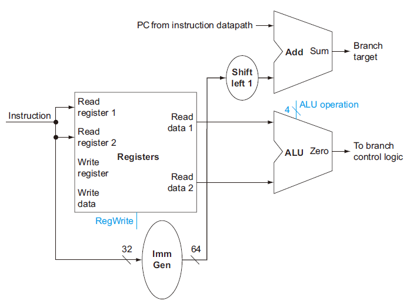

# 4 The Processor

!!! tip "说明"

    此文档正在更新中……

!!! info "说明"

    1. 部分内容由 AI 翻译课本原文，可能存在错误
    2. 本文档只涉及部分知识点，仅可用来复习重点知识
   
    > 理论课讲到这里的时候，实验课已经把单周期 CPU 都实现了，4.1 - 4.4 理解起来很容易啦，就不过多讲解了。需要注意的是，实验课讲的一些实现方法和这里讲的有些不一样

## 4.1 引言

处理器的实现方式决定了时钟周期长度和 CPI

### 4.1.1 一个基本的 RISC-V 实现

核心子集：

1. 存储器访问指令：ld，sd
2. 算术逻辑指令：add，sub，and，or
3. 分支指令：beq

### 4.1.2 实现方式概述

实现每条指令的前两步是一样的：

1. 程序计数器（PC）指向指令所在的存储单元，并从中取出指令
2. 译码，读寄存器

> 实验课里面，PC 指向指令所在的存储单元就是 ROM。另外，我们 vivado 生成的 ROM，地址为 0 就是取出第一个数据，地址为 1 就是取出第二个数据。但我们让 PC + 4，所以观察 CSSTE 电路图，可以发现 ROM 的地址我们接入的是 PC[11:2]

<figure markdown="span">
    { width="600" }
</figure>

加入多选器模块和控制单元：

<figure markdown="span">
    { width="600" }
</figure>

## 4.2 逻辑设计惯例

**状态单元**（state element）：一个存储单元，如寄存器或存储器

1. 使用术语 **有效** （asserted），表示逻辑高（1）
2. 使用属于 **无效** （deasserted），表示逻辑低（0）

### 4.2.1 时钟方法

**clocking methodology**

## 4.3 建立数据通路

**building a datapath**

用于取指和程序计数器自增的数据通路部分：

<figure markdown="span">
    { width="600" }
</figure>

处理器的 32 个通用寄存器位于一个叫做 **寄存器堆**（register file）的结构中

实现分支指令的部分：

<figure markdown="span">
    { width="600" }
</figure>

> 实验课实现的数据通路，分支指令的立即数乘以 2 已经在 ImmGen 模块就实现了，不需要后续在左移 1 位 

### 4.3.1 创建一个简单的数据通路

实现 R-type 指令和存储指令：

<figure markdown="span">
    { width="600" }
</figure>

现在，我们将上述三个部分合并：

<figure markdown="span">
    { width="600" }
</figure>

## 4.4 一个简单的实现机制

### 4.4.1 ALU 控制

| ALU control lines | Function |
| :--: | :--: |
| 0000 | AND |
| 0001 | OR |
| 0010 | add |
| 0110 | subtract |

1. 对于取字和存储字指令，ALU 用加法计算存储器地址
2. 对于 R-type 指令：根据 funct7 和 funct3 选择某个操作
3. 对于 `beq` 指令：ALU 执行减法操作

<figure markdown="span">
    { width="600" }
</figure>

主控制单元生成 ALUOp 作为 ALU 控制单元的输入，再由 ALU 控制单元生成真正控制 ALU 的信号，这种多级译码的方法是一种常用的实现方式。使用多级译码可以减小主控制单元的规模。使用多个小控制单元还可以提高控制单元的速度。这种优化是很重要的，因为控制单元的性能对减少时钟周期非常关键

### 4.4.2 主控制单元的设计

<figure markdown="span">
    { width="600" }
</figure>

控制信号的作用：

<figure markdown="span">
    { width="600" }
</figure>

包含控制信号的数据通路：

<figure markdown="span">
    { width="600" }
</figure>

### 4.4.3 数据通路的操作

<figure markdown="span">
    { width="600" }
</figure>

### 4.4.4 控制的结束

<figure markdown="span">
    { width="600" }
</figure>

### 4.4.5 为什么不使用单周期实现方式

虽然单周期设计也可以正确地工作，但现代设计中并不采取这种方式，因为它的效率太低。究其原因，是在单周期设计中，时钟周期对所有指令等长，这样时钟周期要由执行时间最长的那条指令决定。这条指令几乎肯定是装载指令，它依次使用了5个功能单元：指令存储器、寄存器堆、ALU、数据存储器、寄存器堆。虽然CPI为1（见第1章），单周期实现方式的总体性能并不一定很好，因为时钟周期实在是太长了

使用单周期设计的代价虽然很大，但对于小指令集来说，或许是可以接受的。事实上，早期具有简单指令集的计算机就曾经采用过这种实现方式。然而，若要实现包含浮点或更复杂指令的指令集，这样的单周期设计根本不能胜任

因为时钟周期必须满足所有指令中最坏的情况，故不能使用那些缩短常用指令执行时间而不改善最坏情况的实现技术。这样，单周期实现方式违背了第2章中加快常见情况这一设计原则

在 4.5 节，我们将看到一种称为流水线的实现技术，使用与单周期类似的数据通路，但效率更高。从方法来说，流水线是通过重叠多条指令的执行来提高效率的

## 4.5 流水线概述

**An Overview of Pipelining**

**流水线**（pipelining）是一种实现多条指令重叠执行的技术

通常，一个 RISC-V 指令包含如下五个处理步骤：

1. 从指令存储器中读取指令
2. 指令译码的同时读取寄存器
3. 执行操作或计算地址
4. 从数据存储器中读取操作数（如果需要的话）
5. 将结果写回寄存器（如果需要的话）

!!! example "单周期指令模型与流水线性能"

    <figure markdown="span">
        { width="600" }
    </figure>

    <figure markdown="span">
        { width="600" }
    </figure>

所有的流水级都只花费一个时钟周期的时间，因此，时钟周期必须能够满足最慢操作的执行需要。单周期模型中必须选择最坏情况下的 800 ps 作为时钟周期，流水线执行模型的时钟周期必须选择最坏情况下的 200 ps 作为时钟周期。流水线能够将性能提高 4 倍

如果流水线各阶段操作平衡，那么在流水线机器上的指令执行时间为（在理想情况下）

$$
Time\ between\ instruction_{pipelined} = \dfrac{Time\ between\ instruction_{nonpipelined}}{Number\ of\ pipe\ stages}
$$

即在理想情况和有大量指令的情况下，流水线所带来的加速比与流水线的级数近似相同。例如一个 5 级流水线能够获得的加速比接近于 5

流水线引入了一些开销。所以，在流水线机器中每一条指令的执行时间会超过这个最小的可能值，因此流水线能够获得的加速比也就小于流水线的级数

流水线所带来的性能提高是通过增加指令的吞吐率，而不是减少单条指令的执行时间实现的

### 4.5.1 面向流水线的指令集设计

### 4.5.2 流水线冒险

**Pipeline Hazards**

在下一个时钟周期中下一条指令不能执行。这种情况称为 **冒险**（hazard）

#### 结构冒险

**Structural Hazard**

硬件不支持多条指令在同一时钟周期执行

#### 数据冒险

**Data Hazards**

**数据冒险** 发生在由于一条指令必须等待另一条指令的完成而造成流水线暂停的情况下

在计算机流水线中，数据冒险是由于一条指令依赖于更早的一条还在流水线中的指令造成的。比如有一条减法指令需要使用上一条加法指令的结果

```verilog linenums="1"
add x19, x0, x1
sub x2, x19, x3
```

一种最基本的解决方法：对于上述的代码序列，一旦 ALU 生成了加法运算的结果，就可以将它用作减法运算的一个输入项。从内部资源中直接提前得到缺少的运算项的过程称为 **转发**（forwarding） 或者 **旁路**（bypassing）

!!! example "两条指令间的转发"

    <figure markdown="span">
        { width="600" }
    </figure>

    <figure markdown="span">
        { width="600" }
    </figure>

    <figure markdown="span">
        { width="600" }
    </figure>

转发可以工作得很好，然而它并不能够避免所有流水线阻塞的发生。如下图所示，即使采用了转发机制，在遇到 **装载-使用型数据冒险** (1) （load-use data hazard）时，流水线不得不阻塞一个步骤。图中显示了一个重要的流水线概念，正式的叫法是 **流水线阻塞**（pipeline），但是它经常被昵称为气泡（bubble）
{.annotate}

1. 一类特殊的数据冒险，指当装载指令要取的数还没取回来时其他指令就需要使用的情况

<figure markdown="span">
    { width="600" }
</figure>

!!! example "重新安排代码以避免流水线阻塞"

    考虑此 C 代码：

    ```c linenums="1" title="c"
    a = b + e;
    c = b + f;
    ```

    对应的 RISC-V 指令，假设所有的变量都在存储器中，且以 x10 为基址进行寻址：

    ```verilog linenums="1" title="RISC-V"
    ld x1, 0(x31)
    ld x2, 8(x31)
    add x3, x1, x2
    sd x3, 24(x31)
    ld x4, 16(x31)
    add x5, x1, x4
    sd x5, 32(x31)
    ```