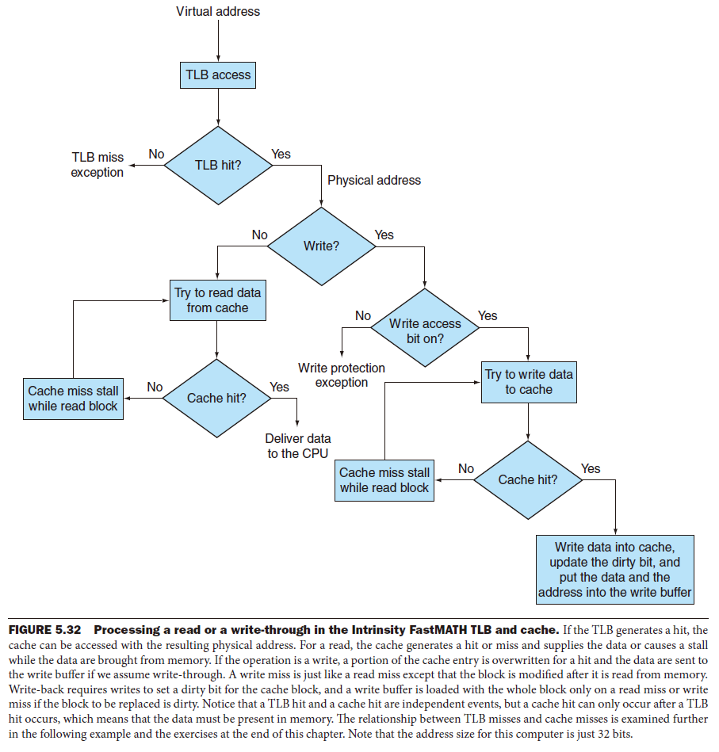

# 5 Large and Fast: Exploiting Memory Hierarchy

!!! tip "说明"

    此文档正在更新中……

!!! info "说明"

    1. 部分内容由 AI 翻译课本原文，可能存在错误
    2. 本文档只涉及部分知识点，仅可用来复习重点知识
    3. 部分课本练习题答案可能存在错误，欢迎在评论区指出，也可以写下你的疑问

## 5.1 引言

主存储器由 DRAM （动态随机存取存储器）实现，靠近处理器的那层（cache）则由 SRAM （静态随机存取存储器）来实现。磁盘（disk）通常是存储层次结构中容量最大且速度最慢的一层。在很多嵌入式设备中，常用闪存（flash memory）来替代磁盘

<figure markdown="span">
    { width="600" }
</figure>

存储器层次结构可以由多层构成，但是数据每次只能在相邻的两个层次之间进行复制。因此我们将注意力重点集中在两个层次上。高层的存储器靠近处理器，比低层存储器容量小且访问速度更快，我们将一个两级层次结构中存储信息的最小单元称为 **块**（block）或 **行**（line）

<figure markdown="span">
    { width="600" }
</figure>

如果处理器需要的数据存放在高层存储器中的某个块中，则称为一次 **命中**（hit）。如果在高层存储器中没有找到所需的数据，这次数据请求则称为一次 **缺失**（miss）。随后访问低层存储器来寻找包含所需数据的那一块。**命中率**（hit rate），或命中比率（hit ratio），是在高层存储器中找到数据的存储访问比例，通常被当成存储器层次结构性能的一个衡量标准。**缺失率**（miss rate）（1－命中率）则是数据在高层存储器中没有找到的存储访问比例

追求高性能是我们使用存储器层次结构的主要目的，因而命中和缺失的执行时间就显得尤为重要。**命中时间**（hit time）是指访问存储器层次结构中的高层存储器所需要的时间，包括了判断当前访问是命中还是缺失所需的时间。**缺失代价**（miss penalty）是将相应的块从低层存储器替换到高层存储器中，以及将该信息块传送给处理器的时间之和，由于较高存储层次容量较小并且使用了快速的存储器部件，因此比起对存储层次中较低层的访问，命中时间要少得多，这也是缺失代价的主要组成部分

<figure markdown="span">
    { width="600" }
</figure>

## 5.2 Memory Technologies

1. SRAM Technology
2. DRAM Technology
3. Flash Memory
4. Disk Memory

## 5.3 cache 的基本原理

要访问的数据项最初不在 cache 中，该请求导致了一次缺失，$X_n$ 被从主存调入 cache 之中

<figure markdown="span">
    { width="600" }
</figure>

在 cache 中为主存中每个字分配一个位置的最简单方法就是根据这个字的主存地址进行分配，这种 cache 结构称为 **直接映射**（direct mapped）。每个主存地址对应到 cache 中一个确定的地址

$$
（块地址） mod （cache 中的块数）
$$

如果 cache 中的块数是 2 的幂，则只需要取地址的低 $\log_2$ 位

<figure markdown="span">
    { width="600" }
</figure>

由于 cache 中每个位置可能对应于主存中多个不同的地址，我们如何知道 cache 中的数据项是否是所请求的字呢？即如何知道所请求的字是否在 cache 中？我们可以在 cache 中增加一组 **标记**（tag），标记中包含了地址信息，这些地址信息可以用来判断 cache 中的字是否就是所请求的字。标记只需包含地址的高位，也就是没有用来检索 cache 的那些位。例如，在上图中，标记位只需使用 5 位地址中的高 2 位，地址低 3 位的索引域则用来选择 cache 中的块

我们还需要一种方法来判断 cache 块中确实没有包含有效信息。例如，当一个处理器启动时，cache 中没有数据，标记域中的值没有意义。甚至在执行了一些指令后，cache 中的一些块依然为空。因此，在 cache 中，这些块的标记应该被忽略。最常用的方法就是增加一个 **有效位**（valid bit）来标识一个块是否含有一个有效地址。如果该位没有被设置，则不能使用该块中的内容

### 5.3.1 cache 访问

<figure markdown="span">
    { width="600" }
</figure>

<figure markdown="span">
    { width="600" }
</figure>

由于 cache 初始为空，第一次访问的一些数据都会发生缺失。图 5-6 对每一次访问行为进行了描述。第 8 次访问将会对 cache 中的一个块产生冲突的请求。地址 18（\(10010_2\)）的字将被取到 cache 的第 2 块（\(010_2\)）中。因此，它将替换掉原先存在于 cache 第 2 块（\(010_2\)）中的地址为 26（\(11010_2\)）中的字。这种行为令 cache 具有时间局部性：最近访问过的字替换掉较早访问的字

- 标记域（tag field）：用来与 cache 中标记域的值进行比较
- cache 索引：用来选择块

<figure markdown="span">
    { width="600" }
</figure>

假设有以下情况：

1. 64-bit 地址
2. 直接映射 cache
3. cache 大小为 $2^n$ 个块，因此 $n$ 位被用来索引
4. 块大小为 $2^m$ 个字（$2^{m+2}$ 个字节），因此 $m$ 位用来查找块中的字，两位是字节偏移信息

tag field 的大小为：$64 - (n + m + 2)$

直接映射的 cache 总位数为：$2^n \times (block\ size + tag\ size + valid\ field\ size)$

块大小为 $2^m$ 个字（$2^{m+5}$ 位），同时我们需要 1 位有效位，因此这样一个 cache 的位数是 $2^n \times (2^m \times 32 + (64 - m - n -2) + 1) = 2^n \times (2^m \times 32 + 63 - n - m)$

尽管以上计算是实际的大小，但是通常对 cache 命名只考虑数据的大小而不考虑标记域和有效位域的大小，因此上图中是一个 4 KiB 的 cache

!!! example "cache 中的位数"

    假设一个直接映射的 cache，有 16 KiB 的数据，块大小为 4 个字，地址为 64 位，那么该 cache 总共需要多少位？

    ??? success "答案"

        数据共 $16\ KiB = 2^{14}\ bytes = 2^{12}\ words$，一个块 4 个 word，则一共有 $2^{10}$ 个块，因此用来索引的位有 10 位，标记域有 $64 - 10 - 2 - 2 = 50$ 位，有效位 1 位。则 cache 大小总共为 $2^{10} \times (4 \times 32 + 50 + 1) = 2^{10} \times 179 = 179\ Kibibits = 22.4\ KiB$

!!! example "将一个地址映射到多字大小的 cache 块中"

    考虑一个 cache 有 64 个块，每个块 16 字节，那么字节地址为 1200 将被映射到 cache 中的哪一块？

    ??? success "答案"

        $块地址 = \lfloor \dfrac{字节地址}{每块字节数} \rfloor = \lfloor \dfrac{1200}{16} \rfloor = 75$

        $（块地址）mod（cache 中的块数）= 75\ mod\ 64 = 11$。事实上地址 1200 和 1215 之间的所有地址都映射在这一块

### 5.3.2 cache 缺失处理

1. 把 PC 的原始值（当前 PC - 4）送到存储器中
2. 通知主存执行一次读操作，并等待主存访问完成
3. 写 cache 项，将从主存取回的数据写入 cache 中存放数据的部分，并将地址的高位（从 ALU 中得到）写入标记域，设置有效位
4. 重新返回指令执行第一步，重新取值，这次该指令在 cache 中

### 5.3.3 写操作处理

**write-through**（写直达法）：

将数据同时写入主存和 cache 中。但这样会花费大量的时间，一种解决方法是 write-buffer（写缓冲），当一个数据在等待写入主存时，先将它放入写缓冲中

**write-back**（写回机制）：

新值仅仅被写入 cache 块中，只有当修改过的块被替换时才需要写到较低层次存储结构中

### 5.3.4 一个 cache 的例子：内置 FastMATH 处理器

<figure markdown="span">
    { width="600" }
</figure>

cache 容量为 16 KB，有 256 个块，每个块有 16 个字

对 cache 的读请求的步骤如下：

1. 将地址送到适当的 cache 中去，该地址来自程序计数器（对于指令访问），或者来自于ALU（对于数据访问）

2. 如果 cache 发出命中信号，请求的字就出现在数据线上。由于在请求的数据块中有16个字，因此需要选择那个正确的字。块索引域用来控制多路选择器（如图5-9底部所示），从检索到的块中选择16个字中的某个字

3. 如果 cache 发出缺失信号，我们把地址送到主存。当主存返回数据时，把它写入 cache 后再读出以满足请求

对于写操作，内置 FastMATH 处理器同时提供写直达和写回机制，由操作系统来决定某种应用该使用哪个机制。它有一个只包含一项的写缓冲

## 5.4 cache 性能的评估和改进

$CPU\ time = (CPU\ execution\ clock\ cycles + Memory-stall\ clock\ cycles) \times Clock\ cycle\ time$ 
$CPU\ 时间 = （CPU\ 执行时钟周期 + 存储器阻塞的时钟周期）\times 时钟周期$

$Memory-stall\ clock\ cycles = (Read-stall\ cycles + Write-stall\ cycles)$ 
$存储器阻塞时钟周期 = 读操作引起阻塞时的时钟周期 + 写操作引起阻塞的时钟周期$

$Read-stall\ cycles = \dfrac{Reads}{Program} \times Read\ miss\ rate \times Read\ miss\ penalty$ 
$读操作阻塞的时钟周期数 = \dfrac{读的次数}{程序数} \times 读缺失率 \times 读确实代价$

$Write-stall\ cycles = (\dfrac{Writes}{Program} \times Write\ miss\ rate \times Write\ miss\ penalty) + Write\ buffer\ stalls$ 
$写操作阻塞的时钟周期数 = (\dfrac{写的次数}{程序数} \times 写缺失率 \times 写缺失代价) + 写缓冲区阻塞$

在大部分写直达 cache 结构中，读和写的缺失代价是一样的（都是从主存中取回数据块的时间）。如果假设写缓冲区阻塞可以被忽略，那么我们可以合并读写操作并共用一个缺失率和缺失代价

$Memory-stall\ clock\ cycles = \dfrac{Memory\ accesses}{Program} \times Miss\ rate \times Miss\ penalty$ 
$存储器阻塞时钟周期 = \dfrac{存储器访问次数}{程序数} \times 缺失率 \times 缺失代价$

$Memory-stall\ clock\ cycles = \dfrac{Instructions}{Program} \times \dfrac{Misses}{Instructions} \times Miss\ penalty$ 
$存储器阻塞时钟周期 = \dfrac{指令数}{程序数} \times \dfrac{缺失数}{指令} \times 缺失代价$

!!! example "计算 cache 性能"

    假设指令 cache 的缺失率为 2%，数据 cache 的缺失率为 4%，处理器的 CPI 为 2，没有存储器阻塞，且每次缺失的代价为 100 个时钟周期，那么配置一个从不发生缺失的理想的 cache，处理器的速度快多少？这里假定全部 load 和 store 的频率为 36%
    
    根据指令计数器(I)，由指令缺失引起的时钟周期损失数为：
    
    指令缺失时钟周期 = I × 2% × 100 = 2.00 × I
    
    由于所有load和store指令出现的频率为36%，我们可以计算出数据缺失引起的时钟周期损失数：
    
    数据缺失时钟周期 = I × 36% × 4% × 100 = 1.44 × I
    
    总的存储器阻塞时钟周期为：
    
    2.00 × I + 1.44 × I = 3.44 × I
    
    每条指令的存储器阻塞超过3个时钟周期。因此，包括存储器阻塞在内的总的CPI是：$2 + 3.44 = 5.44$。由于指令计数器或时钟频率都没有改变，CPU 执行时间的比率为：
    
    $\dfrac{有阻塞的 CPU 执行时间}{配置理想 cache 的 CPU 执行时间} = \dfrac{I × CPI阻塞 × 时钟周期}{I × CPI理想 × 时钟周期} = \dfrac{CPI 阻塞}{CPI 理想} = \dfrac{5.44}{2}$
    
    因此，配置了理想的cache的CPU的性能是原来的：
    
    $\dfrac{5.44}{2} = 2.72 倍$
    
    所以，配置了理想的 cache 的 CPU 的性能是原来的 2.72 倍

如果处理器速度很快，而存储系统却不快，那样又会发生什么？存储器阻塞花费的时间占据执行时间的比例会上升。一些简单的例子会说明这个问题有多严重。假设我们加速上面例子中的计算机，通过改进流水线，在不改变时钟频率的情况下，将 CPI 从 2 降到 1。那么具有 cache 缺失的系统的 CPI 为 1 + 3.44 = 4.44，而配置理想的 cache 的系统性能是它的 4.44 / 1 = 4.44 倍。存储器阻塞所花费的时间占据整个执行时间的比例则从 3.44 / 5.4 = 63% 上升到 3.44 / 4.44 = 77%

同样，仅仅提高时钟频率而不改进存储系统也会因cache缺失的增加而加剧性能的流失

**平均存储器访问时间**（AMAT）：$Time\ for\ a\ hit + Miss\ rate \times Miss\ penalty$ 
$命中时间 + 缺失率 \times 缺失代价$

!!! example "计算平均存储器访问时间"

    处理器时钟周期的时间为 1 ns，缺失代价是 20 个时钟周期，缺失率为每条指令 0.05 次缺失，cache 访问时间（包括命中判断）为 1 个时钟周期。假设读操作和写操作的缺失代价相同并且忽略其他写阻塞。请计算 AMAT

    $AMAT = 1 + 0.05 \times 20 = 2 个时钟周期$

    即为 2 ns

### 5.4.1 通过更灵活地放置块来减少 cache 缺失

**全相联：**（fully associative） 一个块可以被放置在 cache 中的任何位置

**组相联：**（set associative） 每个块可被放置的位置数是固定的（至少两个）

每个块有 n 个位置可放的 cache 被称作 n 路组相联 cache（n-way set-associative cache）。一个 n 路组相联 cache 由很多个组构成，每个组有 n 块。根据索引域，存储器中的每个块对应到 cache 中唯一的组，并且可以放在这个组中的任何一个位置上

<figure markdown="span">
    { width="600" }
</figure>

在组相联 cache 中，包含存储块的组是这样给出的：

$(Block\ number) mod (number\ of\ sets\ in\ the\ cache)$ 
$（块号）mod（cache 中的组数）$

由于该块可能被放在组中的任何一个位置，因此组中所有块的标记都要被检索。而在全相联 cache 中，块可以被放在任何位置，因此 cache 中全部块的标记都要被检索

m 路组相联：关联度（Associativity）为 m

cache 中块的总数等于组数乘以关联度

<figure markdown="span">
    { width="600" }
</figure>

提高关联度的好处在于它通常能够降低缺失率，而主要的缺点则是增加了命中时间

!!! example "cache 的缺失与关联度"

    假设有三个小的 cache，每个 cache 都有 4 个块，块大小为 1 个字。第一个 cache 是全相联方式，第二个是两路组相联，第三个是直接映射。若按以下地址 0，8，0，6，8 依次访问时，求每个 cache 的缺失次数

    **直接映射：**

    首先判断每个地址对应的 cache 块：

    <figure markdown="span">
        { width="400" }
    </figure>

    标蓝的项表示新的

    <figure markdown="span">
        { width="600" }
    </figure>

    直接映射 cache 的 5 次访问产生 5 次缺失

    ---

    **组相联 cache：**

    首先确定每个块地址映射到哪一组：

    <figure markdown="span">
        { width="400" }
    </figure>

    当产生缺失时，需要选择替换组中的某一项，因此需要一个替换规则。组相联 cache 通常会选择替换一组中最近最少被使用的块

    <figure markdown="span">
        { width="600" }
    </figure>

    两路组相联 cache 总共有 4 次缺失

    ---

    **全相联 cache：**

    <figure markdown="span">
        { width="600" }
    </figure>

    仅有 3 次缺失

### 5.4.2 在 cache 中查找一个块

如何在组相联 cache 中查找一个 cache 块

索引值用来选择包含所需地址的组，该组中所有块的标记都将被查看。被选中的组中所有块的标记是并行检测的

<figure markdown="span">
    { width="600" }
</figure>

如果 cache 总容量保持不变，提高关联度就增加了每组中的块数，也就是并行查找时同时比较的次数：关联度每增加到两倍就会使每组块数加倍而使组数减半。相应地，关联度每增加到两倍，检索位就会减少 1 位，标记位增加 1 位。在全相联 cache 中，只有一组有效，所有块必须并行检测，因此没有索引，除了块内偏移地址，整个地址都需要和每个 cache 块的标记进行比较。换句话说，我们不使用索引位就可以查找整个 cache

四路组相联 cache 需要 4 个比较器以及一个 4 选 1 的多路选择器，用来在选定组中的 4 个成员之间进行选择

<figure markdown="span">
    { width="600" }
</figure>

!!! example "标记位大小与组相联"

    提高关联度需要更多比较器，同时 cache 块中的标记位数也需要增加。假设一个 cache，有 4K 个块，块大小为 4 个字，地址为 32 位，请分别计算在直接映射、两路组映射、四路组映射和全相联映射中，cache 的总组数以及总的标记位数

    **直接映射：**

    块总数为 $4K = 2^{12}$，索引位有 12 位，标记位有 32 - 12 - 2 - 2 = 16 位。则总组数等于总块数为 4K 个，总的标记位数为 $4K \times 16 = 64K$

    **两路组映射：**

    总组数为 $\dfrac{4K}{2} = 2K = 2^{11}$ 个，索引位有 11 位，标记位有 32 - 11 - 2 - 2 = 17 位（即增加 1 位）。总的标记位数为 $2K \times 2 \times 17 = 68K$

    **四路组映射：**

    总组数为 1K 个，标记位有 18 位，总标记位数为 $1K \times 4 \times 18 = 72K$

    **全映射：**

    总组数为 1 个，标记位有 28 位，总标记位数为 $1 \times 4K \times 28 = 112K$

### 5.4.3 替换块的选择

最常用的方法是 **最近最少使用法**（LRU）

### 5.4.4 使用多级 cache 结构减少缺失代价

所有现代计算机都使用 cache。为了进一步减小现代处理器高时钟频率与日益增长的 DRAM 访问时间之间的差距，大多数微处理器都会增加额外一级 cache。这种二级 cache 通常位于芯片内，当一级 cache 缺失时就会访问它。如果二级 cache 中包含所需要的数据，那么一级 cache 的缺失代价就是二级 cache 的访问时间，这要比访问主存快得多。如果一级和二级 cache 中均不包含所需的数据，就需要访存，这样就会产生更大的缺失代价

!!! example "多级 cache 的性能"

    假定我们的处理器基本的 CPI 为 1.0，所有访问在一级 cache 中均命中，时钟频率为 4 GHz。假设主存访问时间为 100 ns，其中包括缺失处理时间。设一级 cache 中每条指令缺失率为 2%。如果增加一个二级 cache，命中或缺失访问的时间都是 5 ns，而且容量大到必须使访问主存的缺失率减少到 0.5%，这时的处理器速率能提高多少？

    主存的缺失代价为

    \[ \frac{100 \text{ ns}}{0.25 \text{ ns/时钟周期}} = 400 \text{ 个时钟周期} \]
    
    只有一级 cache 的处理器的有效 CPI 由下列公式给出：

    \[ \text{总的 CPI} = \text{基本 CPI} + \text{每条指令的存储器阻塞时钟周期} \]
    
    因此，在本例中，只有一级 cache 时

    \[ \text{总的 CPI} = 1.0 + \text{每条指令的存储器阻塞时钟周期} = 1.0 + 2\% \times 400 = 9 \]

    对于两级 cache，一级 cache 缺失时可以由二级 cache 或者主存来处理。访问二级 cache 时的缺失代价为

    \[ \frac{5 \text{ ns}}{0.25 \text{ ns/时钟周期}} = 20 \text{ 个时钟周期} \]
    
    如果缺失能由二级 cache 处理，那么这就是整个缺失代价。如果缺失处理需要访存，总的缺失代价就是二级 cache 和主存的访问时间之和
    
    因此，对一个两级的 cache，总的 CPI 是两级 cache 的阻塞时钟周期和基本 CPI 的总和

    \[ \text{总的 CPI} = 1 + \text{一级 cache 中每条指令的阻塞} + \text{二级 cache 中每条指令的阻塞} \]

    \[ = 1 + 2\% \times 20 + 0.5\% \times 400 = 1 + 0.4 + 2.0 = 3.4 \]
    
    因此，有二级 cache 的处理器性能是没有二级 cache 处理器性能的 \( \frac{9.0}{3.4} = 2.6 \) 倍
    
    我们还可以使用另一种方法来计算阻塞时间。在二级 cache 命中的阻塞周期为 \( (2\% - 0.5\%) \times 20 = 0.3 \)；而必须访问主存的阻塞周期必须同时包括访问二级 cache 和访问主存的时间，为 \( 0.5\% \times (20 + 400) = 2.1 \)。对它们求和为 \( 1.0 + 0.3 + 2.1 \)，同样等于 3.4

## 5.7 虚拟存储器

**Virtual Memory**

主存也可以为通常由磁盘实现的辅助存储器充当“cache”，这项技术被称作“虚拟存储器”。构造虚拟存储器有两个主要动机：允许在多道程序之间有效而安全地共享存储器；消除一个小而受限的主存容量对程序设计造成的影响

虚拟存储器中，块被称为 **页**（page），访问缺失则被称为 **缺页**（page fault）。在虚拟存储器中，处理器产生一个 **虚拟地址**（virtual address），再结合软硬件转换成一个 **物理地址**（physical address），然后就可以被用来访问主存了

<figure markdown="span">
    { width="600" }
</figure>

在虚拟存储器中，地址被划分为 **虚页号**（virtual page number）和 **页内偏移**（page offset）。页内偏移域的位数决定了页的大小

<figure markdown="span">
    { width="600" }
</figure>

缺失引发的高代价是许多设计选择虚拟存储系统的原因，缺失在虚拟存储器中通常称为缺页。一次缺页处理将花费数百万个时钟周期。这一巨大的缺失代价，主要由取得标准大小的页中第一个字所需的时间来确定，因此在设计虚拟存储系统时需要考虑一些关键性的因素

- 为了弥补较长的访问时间，页应该足够大。目前典型的页大小从4 KB到16 KB。能支持32 KB到64 KB页的新型台式计算机和服务器正在被研发，但是新的嵌入式系统走的是相反的方向，页大小为1 KB
- 能降低缺页率的组织结构具有吸引力。这里用到的主要技术是允许存储器中的页以全相联方式放置
- 缺页可以用软件处理，这是因为与访问磁盘的时间相比，这样的开销不算大。此外，软件可以使用一些更先进的算法来选择替换页，只要缺失率减少很小一部分就足以弥补算法的开销
- 由于写时间太长，因此在虚拟存储器中，写直达机制不能很好地管理写操作。因此虚拟存储系统中都采用写回机制

### 5.7.1 页的存放和查找

在虚拟存储系统中，我们使用一个索引存储器的表来定位页，这种结构称为 **页表**（page table），它被存放在存储器中。页表使用虚拟地址中的页号作索引，以找到相应的物理页号。每个程序都有它自己的页表。为了指出页表再存储器中的位置，硬件包含一个指向页表首地址的寄存器，我们称之为页表寄存器

<figure markdown="span">
    { width="600" }
</figure>

### 5.7.2 缺页

如果虚拟页的有效位关闭，就会发生缺页。操作系统获得控制权。控制的转移由异常机制完成，这点在本节稍后进行讨论。一旦操作系统获得控制权，它必须在下一级存储层次（通常是磁盘）中找到该页然后决定将请求页放到主存的什么位置。

虚拟地址本身并不会马上告诉我们页在磁盘中的位置。还拿图书馆作类比，我们不能仅仅依靠书名就找到图书的具体位置。而是，按目录查找，获得书在书架上的位置信息，比如说图书馆的索引书号。同样，在虚拟存储系统中，我们必须保持追踪记录虚拟地址空间的每一页在磁盘上的位置。

由于我们无法提前获知存储器中的某一页什么时候将被替换出去，因此操作系统在创建进程的时候候通常会在磁盘上为进程中所有的页创建空间。这一磁盘空间称为交换区。同时，它也创建一个数据结构来记录每个虚拟页在磁盘上的存放位置。这个数据结构可能是页表中的一部分，也可能是辅助数据结构，寻址方式和页表一样

<figure markdown="span">
    { width="600" }
</figure>

操作系统同样会创建一个数据结构来追踪记录使用每个物理页的是哪些进程和哪些虚拟地址。当一次缺页发生时，如果主存中所有的页都在使用，操作系统就必须选择一页进行替换。我们希望最小化缺页的次数，因而大多数操作系统都会选择它们认为近期内不会被使用的页进行替换。使用过去的信息来预测未来，操作系统遵循我们在5.3节中提到的最近最少使用替换策略（LRU）。操作系统查找最近最少使用的页，假定某一页在很长一段时间都没有被访问，那么该页再被访问的可能性比最近经常访问的页的可能性要小。被替换的页写入磁盘的交换区

虚拟地址为 32 位，页大小为 4KB，页表每一项为 4 个字节，我们可以计算总的页表容量为

\[ \text{页表项数} = \frac{2^{32}}{2^{12}} = 2^{20} \]

\[ \text{页表容量} = 2^{20} \text{个页表项} \times 2^2 \text{字节/页表项} = 4 \text{MB} \]

一系列的技术已经被用于减少页表所需的存储量。下面五种技术都是针对减少所需的最大存储量以及减少用于页表的主存

1. 最简单的技术是使用一个界限寄存器，对给定的进程限制其页表的大小。如果虚拟页号大于界限寄存器中的值，就必须在页表中加入该项。这种技术允许页表随着进程消耗空间的增多而增长。因此，只有当进程使用了虚拟地址空间许多页时，页表才会变得很大。这种技术要求地址空间只朝一个方向扩展
2. 允许地址空间只朝一个方向增长并不够，因为多数语言需要两种大小可扩展的区域：一个用来保留栈，一个用来保留堆。由于这种二元性，如果将页表划分，使其既能从最高地址向下扩展，也能从最低地址向上扩展，就方便多了。这也就意味着有两个独立的页表和两个独立的界限。两个页表的使用将地址空间分成两段。地址的高位用来判断该地址使用了哪个段和哪个页表。由于段由地址的高位部分决定，每一段可以有地址空间的一半大。每段的界限寄存器指定了当前段的大小，该大小以页为单位增长。这种类型的段被应用于很多体系结构，包括 MIPS结构。这种形式的段对应用程序是不可见的，尽管它对操作系统可见。这种机制主要的缺陷在于当以一种稀疏方式使用地址空间而不是一组连续的虚拟地址时，它的执行效果就不太好
3. 另外一种减小页表容量的方法是对虚拟地址使用哈希函数，这样，页表需要的容量仅仅是主存中的物理页数。这种结构称为反置页表（inverted page table）。当然，反置页表的查找过程略微有些复杂，因为我们不能仅仅依靠索引来访问页表
4. 多级页表同样可以用来减少页表存储量。第一级映射到虚拟地址空间中较大的固定大小的块，一共有 64~256 页。这些大的块有时候被称为段，而第一级的映射表有时被称为段表，对用户来说段表是不可见的。段表中的每一项指出了该段中是否有页被分配，如果有，就指向该段的页表。地址转换发生在第一次段表查找时，使用地址的高位部分。如果段地址有效，下一组高位地址则用来索引由段表项指向的页表。这种机制允许以一种稀疏的方式（多个不相连的段同时处于活跃状态）来使用地址空间而不用分配整个页表。对很大的地址空间和在需要非连续地址分配的软件系统中，这种机制尤为有效。但是这种两级映射方式的主要缺陷在于地址转换过程更为复杂
5. 为了减少页表占用的实际主存空间，现在，多数系统也允许页表分页。尽管听起来这很复杂，但是它的工作原理和虚拟存储器一样，并且允许页表驻留在虚拟地址空间中。另外，还有一些很小却很关键的问题，例如，要避免不断出现的缺页。如何克服这些问题都描述地很细节化并且一般因机器而异。简而言之，要避免这些问题，可以将全部页表置于操作系统地址空间中并且至少要把操作系统中一部分页表放在主存中的可物理寻址的一块区域中，这部分页表总是存在于主存而非磁盘中

### 5.7.3 关于写

访问 cache 和主存的时间相差上百个时钟周期，写直达机制也可以使用，但是我们需要一个写缓冲区来隐藏写延迟。在虚拟存储器系统中，对存储器层次结构中下一层（磁盘）的写操作需要数百万个处理器时钟周期；因此，创建一个缓冲区用来允许系统用写直达的方式对磁盘进行写，这种方法是完全不可行的。相反，虚拟存储器系统必须使用写回机制，对存储器中的页进行单独写，并且在该页被替换出存储器时再被复制到磁盘中去

### 5.7.4 加快地址转换：TLB

由于页表存放在主存中，因此程序每次访存至少需要两次：一次访存以获得物理地址，第二次访存才获得数据。提高访问性能的关键在于依靠页表的访问局部性。当一个转换的虚拟页号被使用时，它可能在不久的将来再次被使用到，因为对该页中字的引用同时具有时间局部性和空间局部性

因此，现代处理器都包含一个特殊的cache 以追踪最近使用过的地址变换。这个特殊的地址转换cache通常称为 **快表** (TLB)（将其称为地址变换高速缓存更精确）

TLB的每个标记项存放虚拟页号的一部分，每个数据项中存放了物理页号。由于我们每次访问的是TLB而不是页表，TLB需要包括其他状态位，如重写位和引用位

<figure markdown="span">
    { width="600" }
</figure>

每次访问，我们都要在TLB中查找虚拟页号。如果命中，物理页号就用来形成地址，相应的引用位被置位。如果处理器执行的是写操作，重写位同样要被置位。如果TLB发生缺失，我们必须判断是发生缺页还是仅仅是一次TLB缺失。如果该页在主存中，那么TLB缺失只是一次转换缺失。在这种情况下，处理器可以通过将页表中的变换装载到TLB中并且重新访问来进行缺失处理。如果该页不在主存中，TLB缺失就是一次真的缺页。在这种情况下，处理器调用操作系统的异常处理。由于TLB中的项比主存中的页数少得多，发生TLB缺失会比缺页要频繁得多

#### 内置 FastMATH TLB

为了弄清楚这些想法是如何实际应用到处理器中的，我们来进一步研究内置FastMATH的TLB。存储系统页大小为4KB，地址空间为32位，因此，虚拟页号长为20位，如图顶部所示。物理地址和虚拟地址长度相等。TLB包含了16个项，采用全相联映射，由指令和数据访问共享。每个表项宽为64位，包含了20位的标记位（作为该TLB表项的虚页号）、相应的物理页号（也是20位）、一个有效位、一个重写位以及一些其他管理操作位

<figure markdown="span">
    { width="600" }
</figure>

<figure markdown="span">
    { width="600" }
</figure>

对于写请求来说，有一个额外的复杂情况：必须检查TLB中的写访问位。该位可以阻止程序向它仅具有读权限的页中进行写操作。如果程序试图写，且写访问位是关闭的，则会产生异常。写访问位构成了保护机制的一部分

### 5.7.5 集成虚拟存储器、TLB 和 cache

!!! example "存储器层次结构的全部操作"

    在类似于由一个TLB和一个cache组成的存储器层次结构中，一次存储器访问可能遭遇三种不同类型的缺失：TLB缺失、缺页以及cache缺失。考虑这三种缺失发生一个或多个时所有可能的组合（7种可能性）。对每种可能性，说明这种情况是否会真的发生，在什么条件下发生

    <figure markdown="span">
        { width="600" }
    </figure>

### 5.7.6 虚拟存储器中的保护

虚拟存储器最重要的功能就是允许多个进程共享一个主存，同时为这些进程和操作系统提供存储保护。保护机制必须确保，尽管多个进程在共享同一个主存，但是无论有意或是无意，一个恶意进程不能写另一个用户进程或者操作系统的地址空间。TLB中的写访问位可以防止一个页被改写。如果没有这一级保护，计算机病毒将更加泛滥

### 5.7.7 处理 TLB 缺失和缺页

尽管当TLB命中时，利用TLB将虚拟地址转换成物理地址是很简单的，但是处理TLB缺失和缺页要复杂得多。当TLB中没有一个表项能匹配虚拟地址时，TLB缺失就会发生。TLB缺失有下面两种可能性之一：

1. 页在主存中，只需要创建缺失的TLB表项。
2. 页不在主存中，需要将控制权交给操作系统来解决缺页。

怎么知道这两种情况中的哪一种发生了呢？当我们处理缺失时，需要查找页表项并且取回TLB。如果匹配的页表项的有效位是关闭的，那么对应的页就不在主存中，发生缺页。而不仅仅是TLB缺失。如果有效位开启，只需取回所需的表项

处理TLB缺失或者缺页需要使用异常机制来中断活跃的进程，将控制权传给操作系统，然后恢复执行被中断的进程。缺页将在主存访问时钟周期的某一时刻被发现。为了在缺页处理完毕后重新启动引起缺页的指令，必须保存该指令的程序计数器中的值。异常程序计数器（exception program counter, EPC）用来保存这个值

另外，TLB缺失或者缺页异常必须在访存发生的同一个时钟周期的末尾被判定，因此下一个时钟周期就开始进行异常处理而不是继续正常的指令执行。如果在这个时钟周期没有断定缺页发生，一条load指令可能改写寄存器，而当我们试图重新启动指令时，这可能是灾难性的错误。例如，考虑指令`lb x10, 0(x10)`：计算机必须防止写流水级发生，否则，就不能重新启动指令，因为 x10 的内容将被破坏。Store指令也会发生类似复杂情况。当发生缺页而没有完成处理时，我们必须组织写主存的操作。这通常是通令到主存写控制线为无效来完成

一旦操作系统知道了引起缺页的虚拟地址，它必须完成以下三个步骤：

1. 使用虚拟地址查找页表项，并在磁盘上找到被访问的页的位置
2. 选择替换一个物理页；如果被选中的页被修改过，需要在把新的虚拟页装入之前将这个物理页写回到磁盘上
3. 启动读操作，将被访问的页从磁盘上取回到所选择的物理页的位置上

当然，最后一个步骤将花费数百万个时钟周期（如果被替换的页被重写过，那么第二步也需要花费这么多时间）；因此，操作系统通常都会选择另一个进程在处理器上执行直到磁盘访问结束。由于操作系统已经保存了当前进程的状态，因此它可以很随意地将控制权交给另一个进程

当从磁盘读页的操作完成后，操作系统可以恢复原先引起缺页的进程状态，并且执行从异常返回的指令。该指令将处理器从核心态恢复到用户态，同样也恢复程序计数器的值。用户进程接着重新执行引发缺页的那条指令，成功地访问请求的页，然后继续执行

数据访问引起的缺页异常很难处理，这是由于以下三个特性：

1. 它们发生于指令中间，不同于指令缺页
2. 在异常处理前指令没有结束
3. 异常处理之后，指令必须重新执行，就好像什么都没发生过一样

要使指令可重新启动，这样异常可以被处理，指令稍后也能继续执行，这在类似于 RISC-V 的结构中实现相对简单。因为每条指令只能写一个数据项并且只能在指令周期的最后进行写操作，我们就可以阻止指令的完成（不执行写操作）并且在开始处重新启动指令

### 5.7.8 小结

虚拟存储器是管理主存和磁盘之间数据缓存的一级存储层次。虚拟存储器允许单个程序在主存有限的范围内扩展地址空间。更重要的是，虚拟存储器以一种保护的方式，支持多个同时活跃的进程共享主存

管理主存和磁盘之间的存储器层次结构很具有挑战性，这是由于缺页的代价很高。下面一些技术被用来降低缺失率：

1. 增大页的容量以便利用空间局部性并降低缺失率
2. 由页表实现的虚拟地址和物理地址之间的映射采用全相联的方式，这样虚拟页就可以被放置到主存中的任何位置
3. 操作系统使用类似LRU和访问位之类的技术来选择替换哪一页

写磁盘的代价是很高的，因此虚拟存储器使用写回机制并且追踪一页是否更改过（采用重写位）以避免把没有变化的页写回到磁盘

虚拟存储器机制提供了从被程序使用的虚拟地址到用来访问主存的物理地址空间之间的转换。这个地址转换允许对主存进行受保护的共享，同时还提供了很多额外的好处，如简化了存储器分配。为了保证进程间受到保护，要求只有操作系统才能改变地址变换，这是通过防止用户程序更改页表来实现的。进程之间受控制地共享页可以在操作系统的帮助下实现，页表中的访问位被用来指出用户程序对页进行读访问还是写访问

如果对于每一次访问，处理器不得不访问主存中的页表来进行转换，虚拟存储器的开销将很大，cache也将失去意义。相反，对于页表，TLB扮演了地址转换cache的角色，利用TLB中的变换，将虚拟地址转换为物理地址