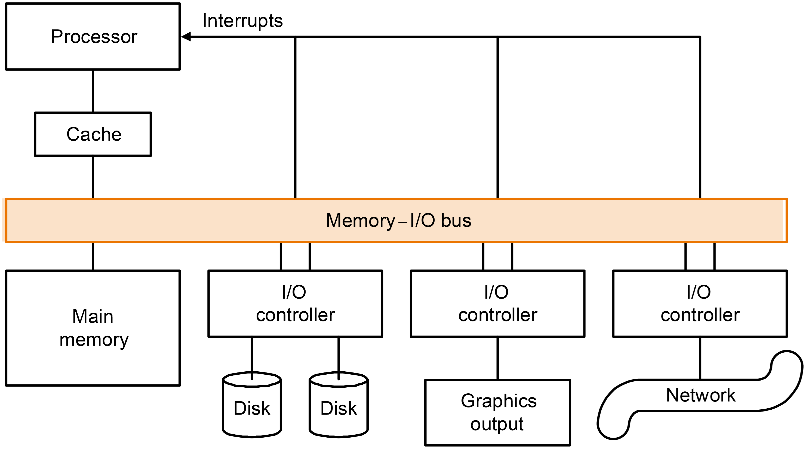

# 6 Storage and Other I/O Topics

<!-- !!! tip "说明"

    本文档正在更新中…… -->

!!! info "说明"

    1. 部分内容由 AI 翻译课本原文，可能存在错误
    2. 本文档只涉及部分知识点，仅可用来复习重点知识
    3. 部分课本练习题答案可能存在错误，欢迎在评论区指出，也可以写下你的疑问

## 6.1 引言

输入与输出系统（I/O）通常把重点放在可信度与成本上，而处理器和内存则把重点放在性能与成本上。I/O 系统还必须考虑设备的可扩展性和多样性

<figure markdown="span">
    { width="600" }
</figure>

I/O 重要的三类特性：

1. 行为（behavior）：输入（只读）、输出（只写，不能被读）或者存储（可以被重读或者重写）
2. 合作者（partner）：I/O 设备的另一端是人还是及其，是在输入端输入数据还是在输出端读数据
3. 数据速率（data rate）：数据在 I/O 设备与主存或者处理器之间传输的峰值速率（peak rate）。它可用来了解在设计一个 I/O 系统时，设备能产生的最大需求

如何评测 I/O 性能取决于应用：

1. 吞吐率（throughout）
2. 响应时间（response time）
3. 吞吐率和响应时间

## 6.2 可信度、可靠性和可用性

**dependability， reliability and availability**

1. 服务实现（service accomplishment）：按照预定方式提供服务
2. 服务中断（service interruption）：提供不同于预定的服务

从 1 到 2 的转换由故障引起，从 2 到 1 的转换称为 **恢复**（restoration）

可靠性（reliability）：实现连续服务的度量

**平均故障时间**（MTTF）

**平均修理时间**（MTTR）

**故障之间的平均时间**（MTBF）：是 MTTF 和 MTTR 的和

可用性（availability）：服务实现的一个度量

$Availability = \dfrac{MTTF}{MTTF + MTTR}$

**错误**（fault）表示一个部件的故障（failure）

三种提高 MTTF 的途径：

1. **错误避免**（fault avoidance）：通过结构设计来防止错误的发生
2. **错误容忍**（fault tolerance）：利用冗余技术允许服务在错误发生时仍能正常地工作，这里的错误主要指的是硬件错误
3. **错误预测**（fault forecasting）：预测错误的存在和产生，将这种预测使用到硬件错误和软件错误中，可以达到在一个部件出现故障之前替换掉它的目的

缩短 MTTR 可以和增大 MTTF 一样达到提高可用性的目的

## 6.3 磁盘存储器

每一个扇面被分成许多 **磁道**（track），每个磁道被分成一些记录信息的 **扇区**（sector）

<figure markdown="span">
    { width="600" }
</figure>

每个磁盘面的磁头都被连在一起并且一起移动，因此每个磁头会处在每个面的相同磁道上

访问数据三阶段：

**寻道**（seek）：把磁头定位到正确的磁道上

磁头找到正确磁道的时间被称为 **寻道时间**（seek time）

---

等待正确的扇区旋转到读/写磁头下面，这段时间被称为 **旋转时间/旋转延时**（rotation latency/delay）。取得信息的平均延时是磁盘旋转半周所需的时间

---

传输数据

**传输时间**：传输一块数据所需的时间。传输时间是扇区大小、旋转速度和磁道记录密度的函数

**磁盘控制器** 通常用来具体地控制磁盘以及内存之间地数据传输。这导致磁盘存取时间又多了一项 **控制器时间**（controller time），它是执行 I/O 存取操作时控制器带来地开销

---

执行 I/O 操作的平均时间将由这四段时间组成，此外还有因其他程序使用磁盘而带来的等待时间

!!! example "读磁盘时间"

    对于一个旋转速度为 15000 RPM 的磁盘，读或者写一个 512 字节的扇区需要多少时间？手册上宣称的平均寻道时间是 4 ms，传输速率是 100 MB/s，控制器开销是 0.2 ms。假设这个磁盘空闲的，也就是没有等待时间

    平均磁盘存取时间 = 平均寻道时间 + 平均旋转延迟 + 传输时间 + 控制器开销

    $4\ ms + \dfrac{0.5\ r}{15000\ RPM} + \dfrac{0.5\ KB}{100\ MB/s} + 0.2\ ms = 6.2\ ms$

### RAID

!!! info "说明"

    此 RAID 部分内容来源：[Wu-wu-u's Notebooks - 计算机组成 6 I/O](https://wu-wu-u.github.io/Notebooks/cs/systems/CO/IO/#redundant-array-of-independent-disks){:target="_blank"}

RAID（Redundant Array of Independent Disks，独立磁盘冗余阵列）是一种将多个物理磁盘组合成一个逻辑单元，以提高数据存储性能和/或提供数据冗余的技术。RAID 通过将数据分布在多个磁盘上来实现这些目标，从而提高了数据的可靠性和读取/写入速度

#### RAID 0（条带化）

特点：将数据分块并分布到多个磁盘上，提供高性能，但没有冗余

优点：读写速度快

缺点：任何一个磁盘故障都会导致数据丢失

#### RAID 1（镜像）

特点：将数据完全复制到两个或多个磁盘上，提供高冗余

优点：数据可靠性高，任何一个磁盘故障不会导致数据丢失

缺点：存储效率低（需要两倍的存储空间）

#### RAID 3（字节级奇偶校验）

特点：RAID 3 是一种使用字节级条带化和专用奇偶校验磁盘的 RAID 级别。它将数据按字节分割，并将每个字节分布到多个磁盘上，同时使用一个专用的磁盘来存储奇偶校验信息

缺点：small write 时，都需要修改 parity 盘，throughput 较差

#### RAID 5（分布式奇偶校验）

特点：RAID5 是一种使用块级条带化和分布式奇偶校验的 RAID 级别。它将数据和奇偶校验信息分布在所有磁盘上，而不是使用一个专用的奇偶校验磁盘

## 6.4 快闪式存储器

1. NOR 快闪式存储器
2. NAND 快闪式存储器

## 6.5 连接处理器、内存以及 I/O 设备

总线被称划分为 

1. **处理器-内存总线**（processor-memory bus）：比较短，通常是高速总线
2. I/O 总线：比较长

## 6.6 为处理器、内存和操作系统提供 I/O 设备接口

