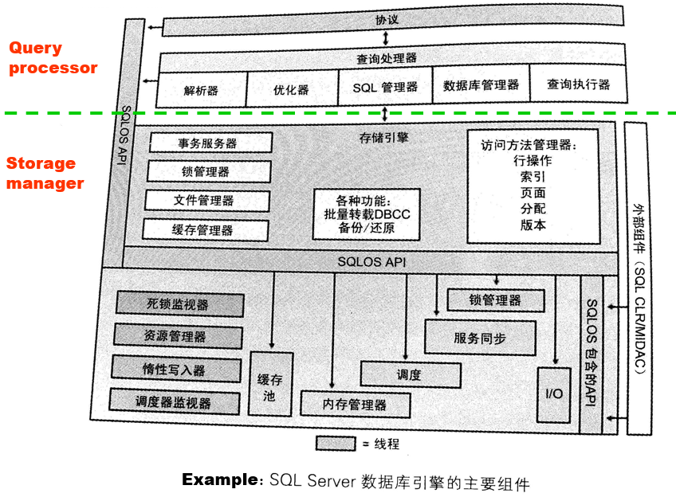

# 1 Introduction

<!-- !!! tip "说明"

    此文档正在更新中…… -->

!!! info "说明"

    本文档只涉及部分知识点，仅可用来复习重点知识

Database：长期存储在计算机内、有组织的、可共享的数据集合

Database-management system (DBMS)：一个用来存储，管理，便捷访问 database 的软件系统

## 1.2 Purpose of Database Systems

**file-processing system 的缺点：**

1. data redundancy and inconsistency
2. difficulty in accessing data
3. data isolation
4. integrity problems
5. atomicity problems（原子性问题，不可分割性问题）
      1. Transfer of funds from one account to another should either complete or not happen at all.（A 转出钱财，B 转入钱财，这两件事要么同时发生，要么都不发生）
6. concurrent-access anomalies（并发访问异常）
7. security problems

**DBMS 的特征：**

1. Efficiency and scalability in data access.（数据访问便捷性和可扩展性）
2. Reduced application development time.（减少应用处理时间）
3. Data independence (including physical data independence and logical data independence).（数据独立性）
4. Data integrity and security.（数据完整性和安全性）
5. Concurrent access and robustness (i.e., recovery).（支持多用户并发查询，稳健性）

## 1.3 View of Data

### 1.3.1 Level of Data Abstraction

数据库的 3 个 level：

<figure markdown="span">
  { width="600" }
</figure>

- physical level：物理方面如何保存数据
- logical level：数据库中的数据，以及这些数据之间的关系
- view level：最终展现的视图结果。应用可以隐藏一些不必要的信息，或出于安全考虑不展示某些私密信息

### 1.3.2 Schemas and Instances

- Schema：database 不同 level 的结构
- Instance：database 在特定时间下具体的内容

类似编程语言 type（schema） 和 variable（instance） 的关系

### 1.3.3 Data Independence

- Physical data independence：修改 physical schema 但不改变 logical schema 的能力
- Logical data independence：确保 logical schema 的变化不会影响软件应用

### 1.3.4 Data Models

用于描述 data, data relationships, data semantics and data constraints 的一系列工具

- Relational model（关系模型）：用于 logical design
- Entity-Relationship data model：用于 conceptual design

!!! example "Relational Model"

    <figure markdown="span">
      { width="600" }
    </figure>

## 1.4 Database Languages

### 1.4.1 Data Definition Language (DDL)

指定 database scheme，数据存储方式，查找方式等等。编译后数据表存储在特定文件 —— data dictionary 当中

data dictionary 中包含 metadata

!!! example "例子"

    ```sql linenums="1"
    create table account(
      account_number char(10),
      balance integer
    );
    ```

### 1.4.2 Data Manipulation Language (DML)

1. Procedural DMLs（过程性）：用户描述 what data 和 how to get data
2. Declarative DMLs（nonprocedural DMLs 描述性）：用户只需要描述 what data

### 1.4.3 SQL

SQL = DDL + DML + DCL(Data Control Language)

!!! example "例子"

    ```sql linenums="1"
    select customer.customer-name
    from customer
    where customer..customer-id = '192-83-7465'
    ```

## 1.5 Database Design

### 1.5.1 Steps of Database Design

1. 需求分析
2. Conceptual database design
      1. 使用 Entity-Relationship model
3. Logical database design
4. Schema refinement
5. Physical database design
6. Create and initialize the database & Security design

---

**Entity-Relationship model**

- Entities：实体
    - customers, accounts
    - entities 有很多的 attributes
- Relationships：实体之间的关系
    - Johnson 持有 A-101 的 ID 卡
    - Relationship set *depositor* 将所有 ID 卡和所有 customers 联系在一起

<figure markdown="span">
  { width="600" }
</figure>

!!! example "例子"

    <figure markdown="span">
      { width="600" }
    </figure>

## 1.6 Database Engine

### 1.6.1 Storage Manager

提供数据库中存储的低级数据与提交给系统的应用进程和查询之间的接口

- Transaction manager
- Authorization and integrity manager
- File manager
- Buffer manager

### 1.6.2 Query Processor

- DDL interpreter：解释
- DML compiler：编译
    - query optimization：从各种备选方案中挑选成本最低的评估计划
- query evaluation engine：执行由 DML 编译形成的 low-level 结构

<figure markdown="span">
  { width="600" }
</figure>

### 1.6.3 Transaction Management（事务管理）

包含：atomicity, consistence, isolation, durability

- 确保 database 保持在正常的状态下，即使发生了错误（通过 recovery system 处理问题）
- Concurrency-control manager：控制并发事务之间的交互

## 1.7 Database Architecture

<figure markdown="span">
  { width="600" }
</figure>

<figure markdown="span">
  { width="600" }
</figure>

## 1.8 Database Users and Administrators

<figure markdown="span">
  { width="600" }
</figure>

> 图片来源：https://note.hobbitqia.cc/DB/db1/

Database Administrator (DBA):

1. 拥有 database 的最高权限
2. 协调 database system 的所有活动
3. 控制所有用户对 database 的访问
4. 对企业的信息和需求有着很好的理解

## Homework

???+ question "课本 1.7"

    List four significant differences between a file-processing system and a DBMS.

    ??? success "答案"

        1. 数据共享与集成：
              1. 前者存在数据孤立问题，不同的应用程序可能拥有各自的数据文件，这导致了数据冗余以及数据不一致的问题
              2. 后者支持数据的集中管理和共享，允许不同应用程序访问相同的数据集。这种方式减少了数据冗余，并提高了数据一致性
        2. 数据独立性：
              1. 前者应用程序紧密依赖于数据结构，任何对数据结构的修改都可能需要更改相应的程序代码
              2. 后者提供了 physical data independence 和 logical data independence，这意味着数据结构的变化不会影响到应用程序的功能，从而简化了维护工作
        3. 并发控制与安全：
              1. 前者管理多用户同时访问文件或记录的能力有限，容易引发数据丢失或覆盖问题，且缺乏有效的安全措施来保护数据
              2. 后者提供了强大的并发控制机制，确保多个用户可以同时安全地访问数据库而不会相互干扰。此外，DBMS 还提供了细粒度的安全功能，如用户认证、权限控制等，增强了数据的安全性
        4. 数据完整性与恢复：
              1. 前者很难实现复杂的数据完整性约束，且一旦发生系统故障，数据恢复过程较为复杂且不可靠
              2. 后者通过定义完整性规则（例如主键、外键约束）来保证数据的准确性。同时，它还提供了事务管理功能，支持原子性、一致性、隔离性和持久性，并具备良好的备份和恢复机制，确保数据在系统崩溃后的可恢复性

???+ question "课本 1.8"

    Explain the concept of physical data independence and its importance in database systems.

    ??? success "答案"

	    概念：修改 physical schema 时，不改变 logical schema

		重要性：

		1. 维护简便：应用程序不必随着物理结构的变化而更新
		2. 便于性能优化：DBA 不必考虑对应用的影响，可以直接对 database 进行优化
		3. 扩展性增强：当需求增长或技术进步时，可以更容易地迁移到新的硬件平台或采用新的存储技术，不必担心现有应用会受到影响
		4. 简化开发过程：开发者能够专注于应用软件的实现，不必深入了解 database 的具体细节
   
???+ question "课本 1.9"

    List five responsibilities of a database-management system. For each responsibility, explain the problems that would arise if the responsibility were not discharged.

	??? success "答案"
        
        1. 数据存储与检索：
              1. 一结构化的方式存储数据，并提供高效的机制来查询和检索这些数据
              2. 如果没有这一功能，用户将难以有效地组织大量数据，查找特定信息会变得耗时且复杂，可能导致数据丢失或损坏，以及无法保证数据的一致性和准确性
        2. 并发控制：
              1. 确保当多个用户同时访问或修改数据库时，系统能够正确处理这些请求，避免数据不一致或冲突
              2. 缺乏有效的并发控制会导致数据损坏、丢失更新、重复读取等问题，特别是在高并发环境下，这可能会导致严重的业务决策失误或财务损失
        3. 数据安全与权限管理：
              1. 保护数据库不受未经授权的访问，通过实施安全策略如用户认证、角色定义和权限设置来控制谁可以访问哪些数据
              2. 没有适当的安全措施，敏感信息可能会被泄露给不适当的人员，增加数据被盗用的风险，损害个人隐私及企业利益
        4. 备份与恢复：
              1. 定期备份数据，并在发生故障时能够迅速恢复数据，以减少数据丢失的风险
              2. 如果缺少备份和恢复机制，在遇到硬件故障、软件错误或其他灾难性事件时，可能导致重要数据永久丢失，对企业运营造成严重影响
        5. 事务支持：
              1. 确保所有数据库操作作为一个工作单元执行，要么全部成功提交，要么全部撤销（原子性、一致性、隔离性、持久性），以维护数据完整性和可靠性
              2. 若无事务支持，部分完成的操作可能导致数据库处于不一致状态，影响数据的准确性和完整性，进而影响基于这些数据做出的任何分析或决策

???+ question "课本 1.15"

    Describe at least three tables that might be used to store information in a social networking system such as Facebook.

	??? success "答案"

        1. users table：
              1. user_ID
              2. username
              3. email
              4. password
              5. gender
        2. friends table：
              1. friendship_ID
              2. user_A_ID
              3. user_B_ID
        3. posts table：
              1. post_ID
              2. author_ID
              3. posted_time
              4. content
