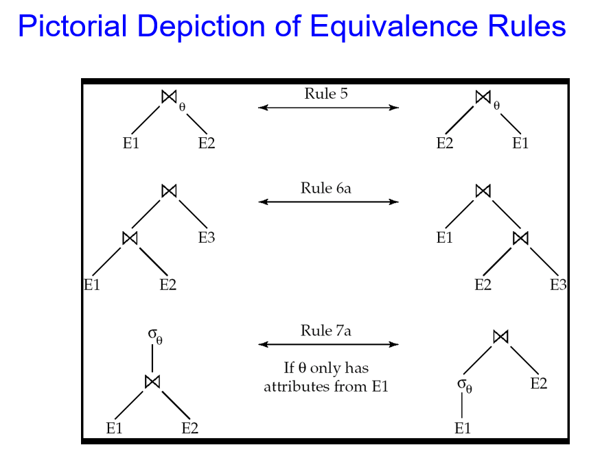
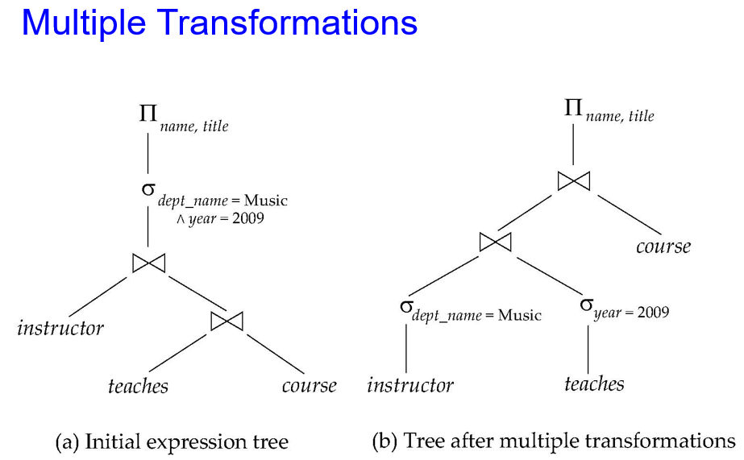
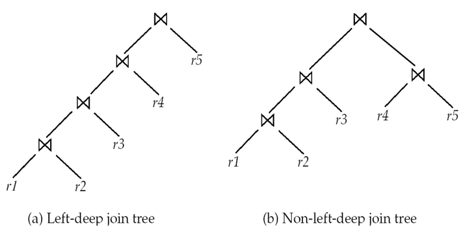

# 10 Query Optimization

<!-- !!! tip "说明"

    本文档正在更新中…… -->

!!! info "说明"

    本文档仅涉及部分内容，仅可用于复习重点知识

## 1 Introduction

evaluation plan（评估计划）明确定义了每个操作使用什么算法，以及如何协调操作的执行

cost-based query optimization（基于成本的查询优化）步骤：

1. 使用等价规则生成逻辑上等价的表达式
2. 注释结果表达式以获得替代查询计划
3. 基于估计成本选择最经济的计划

成本估算基础：

1. 关系统计信息（如记录数、属性不同值数量）
2. 中间结果统计
3. 算法成本公式

## 2 Transformation of Relational Expressions

两个关系代数表达式等价，当且仅当它们在所有符合数据库约束的实例上产生完全相同的元组集合（顺序无关）

> 如果数据库违反完整性约束导致结果不同，我们不予考虑

在 SQL 中，输入和输出是元组的多重集（允许重复元组）。在多重集关系代数中，若两个表达式在所有合法数据库实例上生成相同的多重集元组，则称它们等价

equivalence rule（等价规则）：两种形式的表达式可以相互替换

### 2.1 Equivalence Rules

1. conjunctive selection 操作可分解为一系列单个选择操作的序列：$\sigma_{\theta_1 \land \theta_2}(E) = \sigma_{\theta_1}(\sigma_{\theta_2}(E))$
2. selection 是 commutative（可交换的）：$\sigma_{\theta_1}(\sigma_{\theta_2}(E)) = \sigma_{\theta_2}(\sigma_{\theta_1}(E))$
3. projection 操作序列中仅需保留最后一个，其余可省略：$\Pi_{L_1}(\Pi_{L_2}(...(\Pi_{L_n}(E))...)) = \Pi_{L_1}(E)$
4. selection 操作可以与 cartesian products 和 theta 连接结合

    1. $\sigma_{\theta}(E_1 \times E_2) = E_1 \Join_{\theta} E_2$
    2. $\sigma_{\theta_1}(E_1 \Join_{\theta_2} E_2) = E_1 \Join_{\theta_1 \land \theta_2} E_2$

5. theta 连接操作（及 natural join）是 commutative：$E_1 \Join_{\theta} E_2 = E_2 \Join_{\theta} E_1$
6. 连接操作的可结合性

    1. natural join 是 associative（可结合的）：$(E_1 \Join E_2) \Join E_3 = E_1 \Join (E_2 \Join E_3)$
    2. theta join 在以下情况下是可结合的：$(E_1 \Join_{\theta_1} E_2) \Join_{\theta_2 \land \theta_3} E_3 = E_1 \Join_{\theta_1 \land \theta_3} (E_2 \Join_{\theta_2} E_3)$，其中 $\theta_2$ 仅涉及 $E_2$ 和 $E_3$ 的属性

7.  selection 操作在以下情况下可分配到 theta 连接操作中（先连接后选择 → 先选择后连接）

    1. 当选择条件 $\theta_0$ 仅涉及连接表达式之一 $E_1$ 的属性时：$\sigma_{\theta_0}(E_1 \Join_{\theta}E_2) = (\sigma_{\theta_0}(E_1)) \Join_{\theta}E_2$
    2. 当选择条件 $\theta_1$ 仅涉及 $E_1$ 的属性，且 $\theta_2$ 仅涉及 $E_2$ 的属性时：$\sigma_{\theta_1 \land \theta_2}(E_1 \Join_{\theta} E_2) = (\sigma_{\theta_1}(E_1)) \Join_{\theta} (\sigma_{\theta_2}(E_2))$

8.  projection 操作在 theta join 运算中的分配律（先连接后投影 → 先投影后连接）

    1. 如果连接条件 $\theta$ 仅涉及 $L_1 \cup L_2$ 中的属性：$\Pi_{L_1 \cup L_2}(E_1 \Join_{\theta} E_2) = (\Pi_{L_1}(E_1)) \Join_{\theta} (\Pi_{L_2}(E_2))$
    2. 对于连接 $E_1 \Join_{\theta} E_2$

        1. 设 $L_1$ $L_2$ 分别来自 $E_1$ $E_2$ 的属性集
        2. 设 $L_3$ 是 $E_1$ 中参与连接条件 $\theta$ 但不在 $L_1 \cup L_2$ 中的属性
        3. 设 $L_4$ 是 $E_2$ 中参与连接条件 $\theta$ 但不在 $L_1 \cup L_2$ 中的属性
        4. $\Pi_{L_1 \cup L_2}(E_1 \Join_{\theta} E_2) = \Pi_{L_1 \cup L_2}((\Pi_{L_1 \cup L_3}(E_1)) \Join_{\theta} (\Pi_{L_2 \cup L_4})(E_2))$

9. 集合 union 和 intersection 是 commutative
10. 集合 union 和 intersection 是 associative
11. selection 对并、交、差集具有分配律

    1. $\sigma_{\theta}(E_1 - E_2) = \sigma_{\theta}(E_1) - \sigma_{\theta}(E_2)$，对并集和交集同样成立
    2. 特殊情况：$\sigma_{\theta}(E_1 - E_2) = \sigma_{\theta}(E_1) - E_2$，对交集同样成立，但对并集不成立

12. projection 对并集具有分配律：$\Pi_{L}(E_1 \cup E_2) = (\Pi_{L}(E_1)) \cup (\Pi_L(E_2))$

<figure markdown="span">
  { width="600" }
</figure>

**Example**：find the names of all instructors in the Music department, along with the titles of the courses that they teach

$\Pi_{name, title}(\sigma_{dept\_name = "Music"}(instructor \Join (teaches \Join \Pi_{course\_id, title}(course))))$

根据 7a，$\Pi_{name, title}((\sigma_{dept\_name = "Music"}(instructor) \Join (teaches \Join \Pi_{course\_id, title}(course))))$

==尽早地进行 selection 操作可以减少连接时 relation 的大小==

---

**Example**：Find the names of all instructors in the Music department who have taught a course in 2009, along with the titles of the courses that they taught

$\Pi_{name, title}(\sigma_{dept\_name = "Music" \land year = 2009}(instructor \Join (teaches \Join \Pi_{course\_id, title}(course))))$

根据 6a，$\Pi_{name, title}(\sigma_{dept\_name = "Music" \land year = 2009}((instructor \Join teaches) \Join \Pi_{course\_id, title}(course)))$

接着又可以拆分 $\sigma_{dept\_name = "Music"}(instructor) \Join \sigma_{year = 2009}(teaches)$

<figure markdown="span">
  { width="600" }
</figure>

---

**Example**：$\Pi_{name, title}(\sigma_{dept\_name = "Music"}(instructor) \Join teaches) \Join \Pi_{course\_id, title}(course)$

根据 8a 和 8b，$\Pi_{name, title}(\Pi_{name, course\_id}(\sigma_{dept\_name = "Music"}(instructor) \Join teaches)) \Join \Pi_{course\_id, title}(course)$

==尽早地进行 projection 操作可以减少连接时 relation 的大小==

---

**Example**：如果 $r_2 \Join r_3$ 非常大而 $r_1 \Join r_2$ 小，我们选择 $(r_1 \Join r_2) \Join r_3$

==连接的顺序对于减少临时变量有影响==

---

**Example**：$\Pi_{name, title}(\sigma_{dept\_name = "Music"}(instructor) \Join teaches) \Join \Pi_{course\_id, title}(course)$

最好先进行 $\sigma_{dept\_name = "Music"}(instructor) \Join teaches$

### 2.2 Enumeration of Equivalent Expressions

查询优化器使用等价规则系统性地生成与给定表达式等价的表达式

生成所有等价表达式的方法如下：

1. 重复以下步骤：

    1. 对所有已发现的等价表达式中的每个子表达式，应用所有适用的等价规则
    2. 将新生成的表达式添加到等价表达式集合中

2. 直到不再产生新的等价表达式为止

上述方法在空间和时间上的开销非常大，两种优化方法：

1. 基于转换规则的优化计划生成
2. 针对仅包含选择、投影和连接查询的特殊情况处理方法

## 3 Statistics for Cost Estimation

基本关系统计量：

1. $n_r$：关系 r 中的元组数量
2. $b_r$：包含关系 r 元组的磁盘块数量
3. $l_r$：关系 r 中单个元组的大小（字节数）
4. $f_r$：关系 r 的块因子，即一个磁盘块能容纳的 r 的元组数量

属性级统计量：$V(A, r)$ 关系 r 中属性 A 的不同取值数量，等同于 ∏ₐ(r) 的大小

存储计算公式：当关系 r 的元组物理上连续存储时：$b_r = \lceil \dfrac{n_r}{f_r} \rceil$

### 3.1 Histograms

1. Equi-width 直方图
2. Equi-depth 直方图

### 3.2 Selection Size Estimation

$\sigma_{A=v}(r)$：

1. 满足条件的记录数估计：$\dfrac{n_r}{V(A, r)}$
2. 如果是主键属性上的等值条件：结果大小估计 = 1

$\sigma_{A\leqslant v}(r)$

1. 设 c 为满足条件的元组估计数
2. 若目录中有 $min(A, r)$ 和 $max(A, r)$

    1. 当 $v < min(A, r)$ 时，c = 0
    2. 否则：$c = n_r \dfrac{v - min(A, r)}{max(A, r) - min(A, r)}$

#### 3.2.1 Size Estimation of Complex Selections

**selectivity**（选择度）：指关系中元组满足某个条件的概率。如果关系 r 中有 $sᵢ$ 个元组满足条件 $θᵢ$，则该条件的选择度为 $sᵢ/nᵣ$

1. conjunction：假设条件间独立，估计公式为 $n_r \dfrac{s_1 s_2 \cdots s_n}{n_r^n}$
2. disjunction：$n_r (1 - (1 - \dfrac{s_1}{n_r})(1 - \dfrac{s_2}{n_r})\cdots(1 - \dfrac{s_n}{n_r}))$
3. negation：$n_r - size(\sigma_{\theta}(r))$

### 3.3 Estimation of the Size of Joins

1. Cartesian product r x s：包含 $n_r \times n_s$ 个元组，每个元组占 $l_r + l_s$ 字节
2. 当 $R∩S=∅$ 时，$r \Join s$ 等价于 r x s
3. 若 $R∩S$ 是关系 R 的主键：关系 s 的每个元组最多匹配关系 r 的一个元组，连接结果元组数 ≤ s 的元组数
4. 若 $R∩S$ 是关系 S 的外键且引用关系 R：连接结果元组数 = s 的元组数
5. 当 $R∩S=\{A\}$ 且 A 不是 R 或 S 的键时

    1. 假设 R 的每个元组都会与 S 的元组连接，结果大小估计为：$\dfrac{n_r \times n_s}{V(A, s)}$
    2. 若反过来假设 S 的每个元组与 R 连接，则估计为：$\dfrac{n_r \times n_s}{V(A, r)}$
    3. 取两个估计值中较小的一个通常更准确

### 3.4 Size Estimation for Other Operations

1. Projection：$\Pi_A(r) = V(A, r)$
2. Aggregation：$A_gf(r) = V(A, r)$
3. outer join

    1. 左外连接 = 内连接部分 + 左表中未匹配部分
    2. 全外连接 = 内连接部分 + 左表未匹配部分 + 右表未匹配部分

4. set 运算

    1. 同一关系的选择操作可以合并条件
    2. 不同关系的运算：

        1. 估计 r ∪ s 的大小 = r 的大小 + s 的大小
        2. 估计 r ∩ s 的大小 = r 和 s 大小的最小值
        3. 估计 r - s 的大小 = r 的大小
        4. 这三种估计可能不太准确，但提供了大小的上界

### 3.5 Estimation of Number of Distinct Values

Selections：$\sigma_{\theta}(r)$

1. 当条件强制属性 A 等于某个特定值 (如 A = 3) 时：结果中该属性只有一个唯一值，所以 $V(A, σ_θ(r)) = 1$
2. 当条件限定属性 A 为一组离散值 (如 A = 1 或 3 或 4) 时：不同值数量就是条件中指定的不同值的数量
3. 当条件是A与某值的比较 (如 A > 5，A ≠ 10等) 时：估计不同值数量为原关系的不同值数量乘以选择性，$V(A, σ_θ(r)) = V(A, r) * s$（选择性 s 表示满足条件的元组比例 (0 ≤ s ≤ 1)）
4. 其他情况：采用保守估计：取原关系不同值数量和结果集大小的较小值，$min(V(A, r), n_{σ_θ(r)})$

Join：$r \Join s$

1. 如果属性集 A 中的属性全部来自关系 r：$V(A, r ⋈ s) = min(V(A, r), n_{r ⋈ s})$
2. 如果属性集 A 包含来自 r 的属性 A1 和来自 s 的属性 A2：$V(A, r ⋈ s) = min(V(A1, r)*V(A2-A1, s), V(A1-A2, r)*V(A2, s), n_{r ⋈ s})$

Projection：$∏A(r)$ 中属性的不同值数量与 r 中相同

Aggregation：与投影操作相同

1. 对于 min(A) 和 max(A)：估计为 $min(V(A, r), V(G, r))$，其中 G 表示分组属性
2. 对于其他聚合函数（如 sum, avg, count 等）：假设所有值都不同，使用 $V(G, r)$ 作为估计值

### 3.6 Evaluation plan

执行计划的选择：

1. 选择执行计划时必须考虑不同评估技术之间的相互作用：独立为每个操作选择最便宜的算法可能无法得到最佳整体方案，例如：

    - 归并连接 (Merge-join) 可能比哈希连接 (Hash-join) 代价更高，但能产生有序输出，从而降低外层聚合操作的成本
    - 嵌套循环连接 (Nested-loop join) 可能支持流水线操作

2. 实际的查询优化器通常结合以下两种主要方法：

    1. 基于成本的搜索：搜索所有可能的计划并选择成本最低的方案
    2. 启发式方法：使用启发式规则选择执行计划

#### 3.6.1 Cost-Based Optimization

考虑为关系表达式 $r_1 \times r_2 \times \cdots \times r_n$ 寻找最优连接顺序的问题

该表达式存在 $\dfrac{2(n - 1)!}{(n - 1)!}$ 种不同的连接顺序

解决方案：无需生成所有连接顺序。采用动态规划方法：对任何子集只需计算一次最低成本连接顺序，存储计算结果供后续使用

## * 4 Dynamic Programming for Choosing Evaluation Plans

当需要连接多个表（如 SQL 中的 JOIN 操作）时，连接顺序的不同会导致性能差异巨大。动态规划用于高效探索所有可能的连接顺序，选择成本最低的计划

1. 子集分解：将问题拆解为所有可能的非空子集组合（S₁-S₂），递归计算每个子集的最优连接成本
2. 递归基准：单表时直接应用选择操作（如 WHERE 条件）并选择最佳索引
3. 记忆化存储：保存已计算的子集结果，避免重复计算，这是动态规划的核心思想

总共有 2ⁿ-2 种可能的连接方式（n 为表数量），算法通过存储中间结果将指数级问题优化为多项式时间

### 4.1 Join Order Optimization Algorithm

```c linenums="1"
procedure findbestplan(S)  
    if (bestplan[S].cost ≠ ∞)
        // 若 bestplan[S] 已计算，直接返回结果，避免重复计算
        return bestplan[S]  
    // 否则 bestplan[S] 尚未计算，现在计算  
    if (S 仅包含 1 个关系)  
        根据访问 S 的最佳方式（使用 S 上的选择操作和索引）  
        设置 bestplan[S].plan 和 bestplan[S].cost  
    else  
        for each (S 的非空子集 S1，且 S1 ≠ S)  
            P1 = findbestplan(S1)  
            P2 = findbestplan(S - S1)  
            A = 连接 P1 和 P2 结果的最佳算法  
            cost = P1.cost + P2.cost + A 的成本  
            if cost < bestplan[S].cost  
                bestplan[S].cost = cost  
                bestplan[S].plan = "执行 P1.plan; 执行 P2.plan;  
                                   用 A 连接 P1 和 P2 的结果"  
    return bestplan[S]  
```

### 4.2 Cost of Optimization

1. Bushy 树（完全二叉树）优化：

    1. 时间复杂度 $O(3^n)$：需遍历所有可能的子集组合
    2. 空间复杂度 $O(2^n)$：需存储所有子集的最优解

2. 左深树（left-deep trees）优化：

    1. 定义：连接树呈左倾链式结构（如 `((A⋈B)⋈C)⋈D`），仅允许右节点为单表
    2. 算法修改：不再分割子集，而是固定右表（如 `S1 = S - r`），减少递归分支
    3. 复杂度降低：时间 $O(n 2^n)$，空间仍为 $O(2^n)$

左深树优势：计算量更低，适合大多数查询优化器

Bushy 树优势：可能找到更优计划，但复杂度高，仅用于小型 n

### 4.3 Interesting Sort Orders

在连接多个表（如 (r1 x r2) x r3）时，中间结果的排序属性（如公共属性 A）可能影响后续操作的效率

Interesting Sort Orders：一种可能降低后续操作（如连接、排序、分组）成本的元组排序方式

用归并连接计算 r1 x r2 会 A 排序结果，虽然比哈希连接慢，但后续与 r3 的归并连接可能更快（因无需重新排序）。排序结果还可直接用于 ORDER BY A 或 GROUP BY A，避免额外排序开销

动态规划扩展：

1. 原算法局限：仅存储子集的最优成本，忽略中间结果的排序属性
2. 改进算法：每个子集额外存储不同排序顺序下的最优计划（如“按 A 排序”或“未排序”），选择连接算法时，权衡当前成本与后续排序收益（如归并连接虽慢但“免费”排序）
3. 复杂度影响：有趣排序顺序通常较少（如仅按公共属性排序），不会显著增加计算量

### 4.4 Cost Based Optimization with Equivalence Rules

Physical equivalence rules（物理等价规则）的作用：将抽象的逻辑查询计划（描述"做什么"）转换为具体的物理查询计划（描述"怎么做"），包括为每个操作（如连接、选择等）选择特定的执行算法（如哈希连接、归并连接等）

高效优化器的四个关键要素：

1. 空间高效的表达式表示：使用共享结构避免子表达式重复存储，节省内存
2. 重复推导检测：快速识别相同子表达式，避免冗余计算
3. 记忆化动态编程：首次遇到子表达式时计算并缓存最优解，后续直接复用
4. 成本剪枝：基于成本估算主动放弃明显不优的计划分支，减少搜索空间

### 4.5 Heuristic Optimization

**启发式优化**

即使采用动态规划，基于成本的优化仍然代价高昂，系统可能使用启发式方法来减少需要基于成本进行选择的情况

核心启发式规则：

1. 尽早执行选择（σ）：先过滤掉不需要的元组，减少后续操作的数据量
2. 尽早执行投影（π）：提前去掉不需要的属性，减少数据宽度
3. 选择性高的操作优先：先执行能最大程度减少结果集的操作（如高选择性的 WHERE 条件或连接）

### 4.6 Structure of Query Optimizers

1. 左深连接顺序 (Left-deep join orders)：大多数优化器采用这种连接顺序

    1. 显著降低优化复杂度
    2. 生成的执行计划更适合流水线处理，减少中间结果物化
    3. 配合启发式规则

2. Oracle 的启发式优化方法：采用贪心算法策略：从每个可能的关系作为起点，每次选择当前最优的下一个连接关系，最终比较不同起点的方案，选择全局最优
3. SQL复杂性的挑战：特别是处理嵌套子查询时：需要将子查询转换为等效的连接形式，考虑子查询结果的大小和分布，处理相关子查询的特殊情况

#### 4.6.1 Left Deep Join Trees

<figure markdown="span">
  { width="600" }
</figure>

---

混合优化策略：

1. 典型的两阶段处理：
    
    1. 先应用启发式规则重写查询结构（特别是处理嵌套查询和聚合）
    2. 再对简化的查询块进行精确的成本优化

2. 高级优化器采用更整体的优化方式，不受原始查询块结构限制

优化过程控制：

1. 成本预算机制：当找到足够好的计划时提前终止优化
2. 计划缓存：通过参数化处理（将常量替换为参数）实现计划重用

开销与收益权衡：

1. 优化器采用自适应策略：

    1. 简单查询：快速启发式（如仅考虑左深连接）
    2. 复杂查询：综合使用动态规划等精确方法

2. 尽管优化过程本身有开销，但对于执行时间长的查询，优化收益显著

## * 5 Additional Optimization Techniques

### 5.1 Optimizing Nested Subqueries

```sql linenums="1"
select name
from instructor
where exists (select *
  from teaches
  where instructor.ID = teaches.ID and teaches.year = 2007)
```

SQL 在概念上把 where 子句中的嵌套子查询视为接收参数并返回单个值或值集的函数，参数是外层查询中在嵌套子查询里使用的变量，这类变量称为 correlation variables（关联变量）

概念上，嵌套子查询会对由外层from子句生成的笛卡尔积中的每个元组执行一次，这种计算方式称为 correlated evaluation（关联求值）

数据库会尝试：

1. 将关联子查询转换为等价的连接操作（如半连接）
2. 利用外层 where 条件提前过滤数据
3. 对子查询结果进行缓存复用

```sql linenums="1"
/* 转换后的等价形式 */
select distinct name
from instructor join teaches on instructor.ID = teaches.ID
where teaches.year = 2007
```

在我们的例子中，原始嵌套查询可能被转换为：

```sql linenums="1"
create table t_1 as
select distinct ID
from teaches
where year = 2007

select name
from instructor, t_1
where t_1.ID = instructor.ID
```

通过连接操作（可能使用临时关系）替换嵌套查询的过程称为去关联化（decorrelation）

当出现以下情况时，去关联化会变得更加复杂：

1. 嵌套子查询包含聚合函数
2. 嵌套子查询的结果用于等值测试
3. 连接嵌套子查询和其他查询的条件是 not exists
4. 以及其他类似情况

### 5.2 Materialized Views

物化视图是指内容被预先计算并存储的视图

```sql linenums="1"
create view department_total_salary(dept_name, total_salary) as 
select dept_name, sum(salary)
from instructor
group by dept_name
```

如果经常需要查询各部门的薪资总额，物化这个视图将非常有用。避免了每次都要查找多个元组并累加其金额的开销

#### 5.2.1 Materialized View Maintenance

保持物化视图与底层数据同步的过程称为物化视图维护，可以通过每次更新时重新计算来维护物化视图

更优的选择是使用 incremental view maintenance（增量视图维护）：利用数据库关系的变化来计算物化视图的相应变化，然后更新视图

视图维护可以通过以下方式实现：

1. 在视图定义涉及的每个关系上手动定义插入、删除和更新的触发器
2. 编写手动代码在数据库关系更新时更新视图
3. 定期重新计算（例如每晚）

#### 5.2.2 Incremental View Maintenance

对关系或表达式的变更（插入和删除）称为其 differential（差分）

1. $i_r$：新增元组集合（insertions）
2. $d_r$：删除元组集合（deletions）

更新操作的处理技巧：将 UPDATE 操作转换为 DELETE + INSERT 组合

> 为简化描述，我们仅考虑插入和删除操作

例如：将 `UPDATE r SET a=1 WHERE b=2` 转换为：

```sql linenums="1"
d_r = {元组 | b=2}
i_r = {修改后的元组 | b=2, a=1}
```

#### 5.2.3 Join Operation

物化视图 v 是两个表 r 和 s 的笛卡尔积，当 r 表发生数据变更（插入/删除）时，需要高效更新视图

1. 插入操作的增量计算：新连接结果 = 旧连接结果 ∪ (新增元组 × s 表)
2. 删除操作的增量计算：新连接结果 = 旧连接结果 - (删除元组 × s 表)

#### 5.2.4 Selection and Projection Operations

选择操作（σ）的增量维护：只需过滤变更数据后直接合并/移除

$$
\begin{cases}
v^{new} = v^{old} \cup \sigma_\theta(i_r) & \text{插入}\\
v^{new} = v^{old} - \sigma_\theta(d_r) & \text{删除}
\end{cases}
$$

投影操作（Π）的增量维护：因多对一映射特性（多个输入元组可能映射到同一输出元组），需通过计数机制解决

$$
\begin{cases}
\text{插入}(a,b): & count[a] \leftarrow count[a] + 1 \\
\text{删除}(a,b): & count[a] \leftarrow count[a] - 1 \\
\text{维护规则}: & \text{当} count[a] = 0 \text{时移除} (a)
\end{cases}
$$

#### 5.2.5 Aggregation Operations

聚合操作物化视图的增量维护技术：

**1.计数（COUNT）维护**

```python linenums="1" title="插入处理"
for 新元组 in 新增集合:
    if 新元组.A in 视图:
        视图[新元组.A].count += 1
    else:
        视图.add(新元组.A, count=1)
```

```python linenums="1" title="删除处理"
for 删除元组 in 删除集合:
    视图[删除元组.A].count -= 1
    if 视图[删除元组.A].count == 0:
        视图.remove(删除元组.A)
```

**2.求和（SUM）维护**

必须同步维护计数，因为：某组的 `sum = 0` 可能表示：

1. 该组所有 B 值为 0（应保留）
2. 该组无数据（应删除）

**3.平均值（AVG）维护**

存储原始分量：`avg = sum / count`，避免每次更新重新计算所有数据

```sql linenums="1"
-- 当插入(a, x)时：
UPDATE 视图 SET 
  sum = sum + x, 
  count = count + 1,
  avg = (sum + x)/(count + 1)
WHERE group_key = 'a'
```

**4.极值（MIN/MAX）维护特性**

```python linenums="1" title="插入处理"
for 新元组 in 新增集合:
    if 新元组.A not in 视图:
        视图.add(新元组.A, min=新元组.B, max=新元组.B)
    else:
        视图[新元组.A].min = min(当前min, 新元组.B)
        视图[新元组.A].max = max(当前max, 新元组.B)
```

```python linenums="1" title="删除处理"
for 删除元组 in 删除集合:
    if 删除元组.B == 视图[删除元组.A].min:
        # 需要重新扫描该组所有剩余元组找出新的最小值
        新min = 重新计算min(剩余元组.B)
        视图[删除元组.A].min = 新min
    # 同理处理 max
```

当删除的元组正好是当前 min/max 值时，需要：

1. 查询基础表该分组的所有剩余数据
2. 重新计算极值

#### 5.2.6 Other Operations

交集（∩）的增量处理：

```python linenums="1" title="插入逻辑"
def on_insert_r(new_tuple):
    if new_tuple in s:  # 需要快速查找能力
        v.add(new_tuple)
```

```python linenums="1" title="删除逻辑"
def on_delete_r(old_tuple):
    if old_tuple in v:  # 需要快速查找能力
        v.remove(old_tuple)
```

外连接操作维护：

1. 当 s 新增匹配元组时：需找到 r 中之前未匹配的元组补全连接
2. 当 s 删除元组时：需将对应结果从连接转为 NULL 填充形式

#### 5.2.7 Handling Expressions

复杂表达式增量维护的自底向上处理方法：

1. 先处理原子关系（基础表）的变更
2. 逐步向上计算各层运算符的增量
3. 最终得到整个表达式的变更集

### 5.3 Query Optimization and Materialized Views

物化视图在查询优化中的两种关键应用策略：

**1.查询扩展（View Utilization）**

当查询包含视图定义的子集时：

```sql linenums="1"
-- 物化视图
CREATE MATERIALIZED VIEW v AS SELECT * FROM r JOIN s ON...

-- 用户查询（可优化）
SELECT * FROM r JOIN s JOIN t  -- 可重写为：
SELECT * FROM v JOIN t
```

**2.视图替换（View Backtracking）**

当直接使用物化视图反而低效时：

```sql linenums="1"
-- 低效情况（v无A字段索引）
SELECT * FROM v WHERE A=10

-- 更优方案（利用r的A索引）
SELECT * FROM r JOIN s WHERE r.A=10
```

### 5.4 Materialized View Selection

1. 物化视图选择问题："应该物化哪些视图是最优的？"
2. 索引选择问题："应该创建哪些索引是最优的？"。与物化视图选择密切相关，但相对简单

物化视图选择和索引选择基于典型系统工作负载（查询和更新）

典型目标：在存储空间和关键查询/更新时间约束下，最小化工作负载执行时间