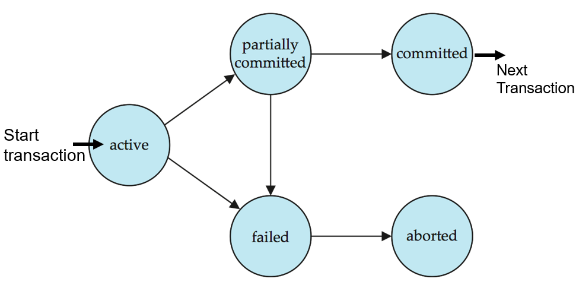
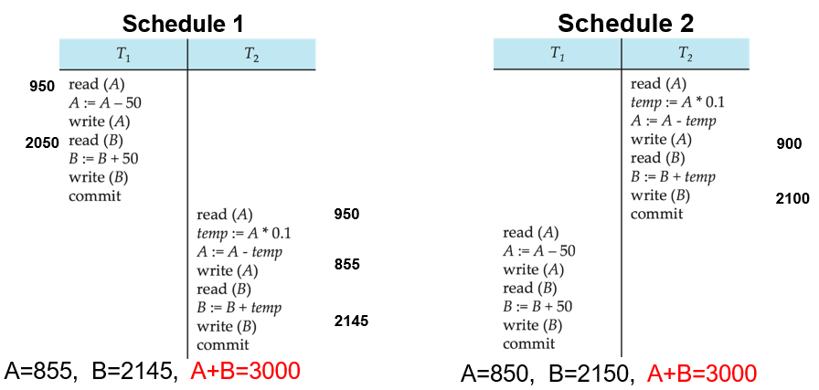
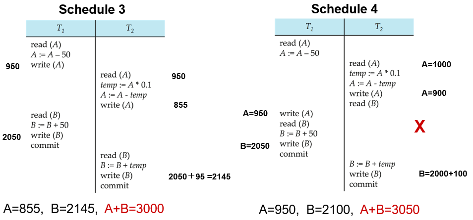
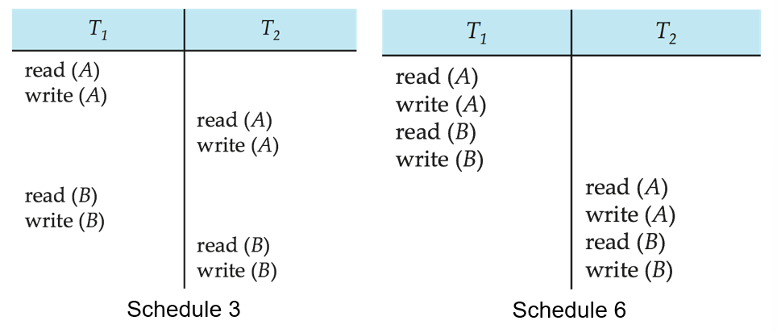

# 11 Transactions

!!! tip "说明"

    本文档正在更新中……

!!! info "说明"

    本文档仅涉及部分内容，仅可用于复习重点知识

## 1 Transaction Concept

对于一个 DBMS，需要解决两个主要问题：

1. 多用户或多程序的 concurrent executions
2. 各种 failures，比如硬件损坏，系统崩溃

transaction 的定义：事务是数据库操作的基本单位，包含一组逻辑相关的 SQL 语句（如查询、插入、修改等），这些语句要么全部成功执行（提交），要么全部不执行（回滚）

transaction 的目的：

1. 并发控制：确保多个事务同时执行时，数据库仍能保持正确性和一致性
2. 数据完整性：通过提交或回滚机制，防止部分操作导致数据不一致（例如转账操作中，一方扣款而另一方未收款）

ACID Properties：

1. Atomicity（原子性）：事务的所有操作要么全部完成，要么全部不完成
2. Consistency（一致性）：事务执行前后，数据库必须满足预定义的规则（如约束、触发器等）
3. Isolation（隔离性）：并发事务之间互不干扰，中间状态对其他事务不可见
4. Durability（持久性）：事务提交后，其结果永久保存在数据库中

## 2 Transaction State

1. Active（活跃）：事务正在执行 SQL 语句（如读写数据）
2. Partially Committed（部分提交）：所有操作已执行，但数据可能仍在内存缓冲区，尚未写入磁盘。此时若系统崩溃，事务可能丢失
3. Failed（失败）：因错误（如违反约束、死锁）无法继续执行
4. Aborted（中止）：回滚所有操作，数据库恢复原状。用户可选择重启事务（如因临时死锁）或终止（如逻辑错误）
5. Committed（提交）：数据持久化到磁盘，事务成功结束

<figure markdown="span">
  { width="600" }
</figure>

## 3 Implementation of Atomicity and Durability

数据库系统的 recovery-management component（恢复管理组件）负责实现原子性（Atomicity）和持久性（Durability）的支持

影子数据库方案（Shadow-Database Scheme）：一种简单但低效的方案：

1. 初始状态：`db_pointer` 指向一个一致的数据库副本（影子副本）
2. 事务执行：修改操作在新副本上进行，影子副本保持不变
3. 事务提交：

    1. 将新副本数据强制写入磁盘（确保持久性）
    2. 通过原子性地切换 `db_pointer` 指向新副本，实现原子性（若切换失败，仍保留原副本）

4. 事务中止：直接丢弃新副本，无需恢复（影子副本始终完好）

## 4 Concurrent Executions

优势：

1. 提高处理器和磁盘利用率，从而提升事务吞吐量（Throughput）：一个事务使用 CPU 时，另一个事务可以同时读写磁盘
2. 减少事务的平均响应时间：短事务无需等待长事务完成

问题：尽管每个事务本身是正确的，但并发操作可能破坏数据一致性

Concurrency Control Schemes（并发控制机制）：

1. 通过隔离机制控制并发事务的交互，防止它们破坏数据库的一致性
2. 实现 Serializability（可串行化），Recoverability（可恢复性）

Schedule（调度）：多个并发事务的指令（如读、写、提交等）按时间顺序排列的执行序列

1. 完整性：必须包含所有相关事务的全部指令，不能遗漏
2. 顺序保留：每个事务内部的指令顺序必须与原始定义一致

<figure markdown="span">
  { width="600" }
  <figcaption>serial schedule</figcaption>
</figure>

<figure markdown="span">
  { width="600" }
  <figcaption>concurrent schedule</figcaption>
</figure>

## 5 Serializability

可串行化是并发控制的黄金标准，确保并发执行的事务最终结果与某种串行顺序执行的结果一致，从而维持数据一致性

1. Conflict Serializability（冲突可串行化）：通过交换非冲突操作（如两个事务读取同一数据）得到的等价串行调度
2. View Serializability（视图可串行化）：要求并发调度的“读-写”依赖关系与某个串行调度完全一致

假设：

1. 忽略读写之外的操作：我们仅关注事务的读（read）和写（write）指令，其他操作（如计算、条件判断等）被忽略
2. 允许本地缓冲区的任意计算：假设事务在两次读写之间可以对本地缓冲区（local buffers）中的数据进行任意计算处理
3. 简化的调度仅包含读写指令：我们所研究的简化调度序列仅由读和写操作构成

### 5.1 Conflict Serializability

事务 Ti 的指令 li 和事务 Tj 的指令 lj 冲突，当且仅当：

1. 两者访问同一数据项 Q
2. 至少有一个指令是写操作

> 就像 RAW、WAR、WAW 一样

Conflict Equivalent（冲突等价）：如果一个调度 S 可以通过一系列非冲突指令的交换转换成调度 S'，则称 S 和 S' 是冲突等价

conflict serializable（冲突可串行化）：如果一个调度 S 与某个串行调度冲突等价

<figure markdown="span">
  { width="600" }
  <figcaption>schedule 3 可以转换成 schedule 6，因此 schedule 3 是 conflict serializable</figcaption>
</figure>

<figure markdown="span">
  { width="500" }
  <figcaption>这个 schedule 不是 conflict serializable</figcaption>
</figure>

### * 5.2 View Serializability

## 6 Recoverability

### 6.1 Recoverable Schedules

### 6.2 Cascading Rollbacks

### 6.3 Cascadeless Schedules

## 7 Implementation of Isolation

## 8 Transaction Definition in SQL

## 9 Testing for Serializability 

