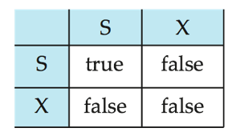
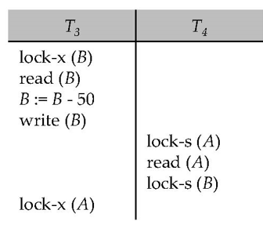
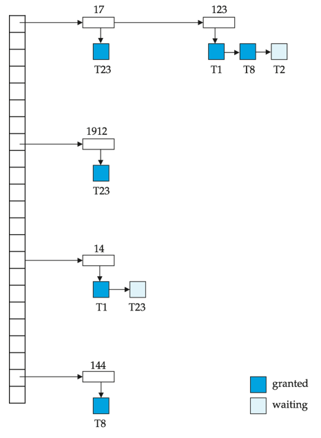
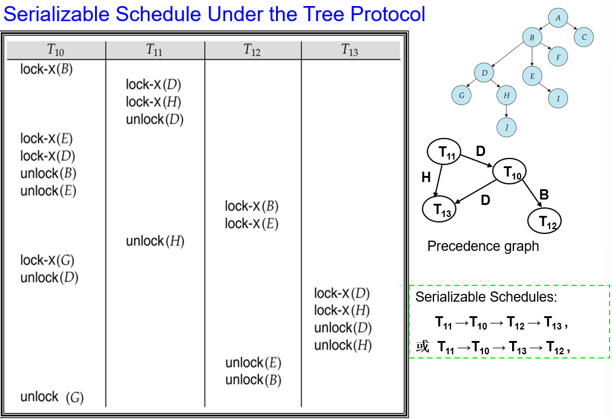
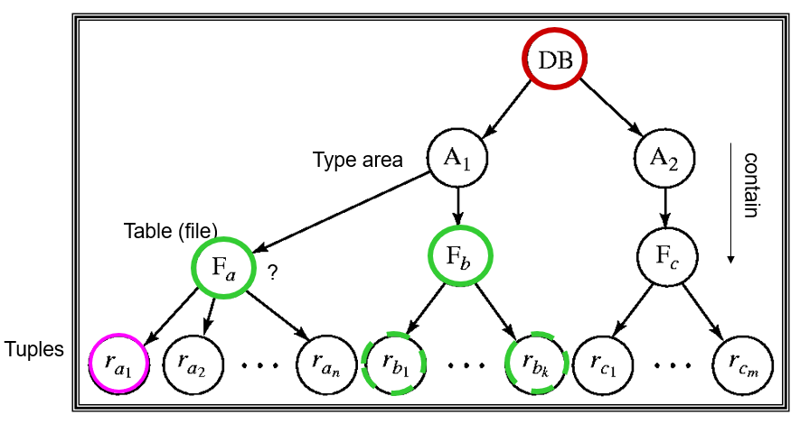
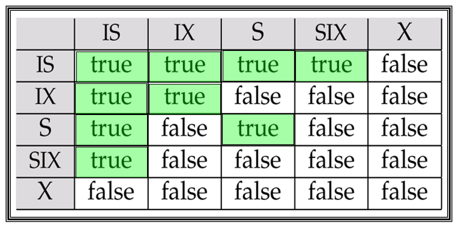
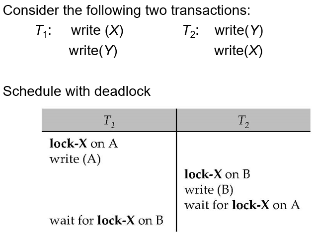
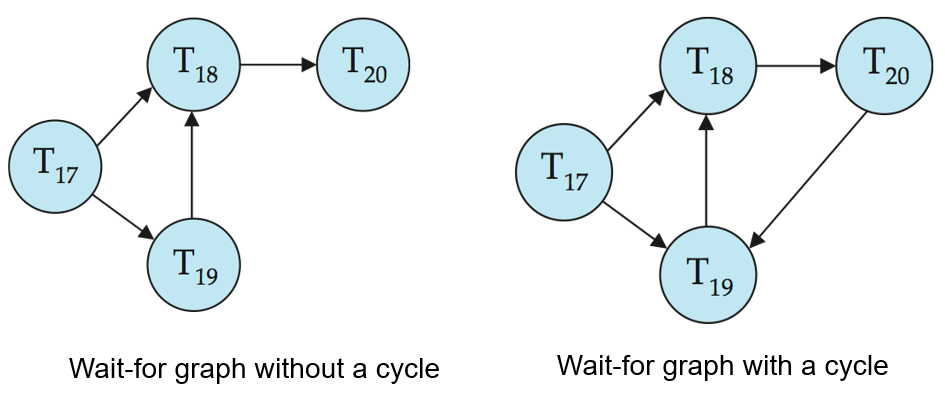

# 12 Concurrency Control

!!! tip "说明"

    本文档正在更新中……

!!! info "说明"

    本文档仅涉及部分内容，仅可用于复习重点知识

## 1 Lock-Based Protocols

数据项可以通过两种模式加锁：

1. exclusive mode（排他锁，X 锁）：当一个事务需要修改数据时使用，它会阻止其他事务同时读取或修改相同数据
2. shared mode（共享锁，S 锁）：当多个事务只需要读取数据时使用，允许多个事务同时获取读锁，但会阻止任何事务获取写锁

锁管理机制：系统有一个专门的并发控制管理器负责接收和处理锁请求，事务必须等待直到获得所需锁才能继续操作

Lock-compatibility matrix：

<figure markdown="span">
  { width="400" }
</figure>

1. 如果一个数据项上的请求锁与其他事务已持有的锁兼容，则该事务可以获取该锁
2. 多个事务可以同时持有 S 锁；但如果任一事务持有 X 锁，则其他事务不能再获取任何类型的锁（无论是 S 锁还是 X 锁）
3. 如果锁无法立即授予（由于不兼容），请求锁的事务必须等待，直到其他事务释放所有不兼容的锁，然后才能获取该锁

locking protocol（锁协议）：所有事务在请求和释放锁时必须遵循的一组规则。锁协议通过限制可能的调度方式来确保并发执行的正确性

### 1.1 Pitfalls of Lock-Based Protocols

<figure markdown="span">
  { width="400" }
</figure>

上述情况称为 deadlock（死锁）

1. 互斥条件：锁的排他性导致资源独占
2. 占有并等待：事务持有锁的同时请求新锁
3. 非抢占条件：已获得的锁不能被强制剥夺
4. 循环等待：形成等待环路

处理死锁需要回滚其中一个事务并释放其持有的锁

大多数锁协议都存在死锁的可能性。死锁是一种难以避免的弊端

如果并发控制管理器设计不当，还可能发生 starvation（饥饿现象）：

1. 某个事务可能正在等待获取数据项上的 X 锁，而同时其他一系列事务却不断获取该数据项上的 S 锁
2. 同一事务因反复陷入死锁而被多次回滚

通过合理设计，并发控制管理器（concurrency control manager）可以预防饥饿现象的发生

### 1.2 The Two-Phase Locking Protocol

保证 conflict-serializable schedules 的锁协议

1. Growing Phase：transaction 获得锁而不释放锁

    1. 获得 lock-S
    2. 获得 lock-X
    3. 将 lock-S 转换到 lock-X（upgrade）

2. Shrinking Phase：transaction 释放锁而不获得锁

    1. 释放 lock-S
    2. 释放 lock-X
    3. 将 lock-X 转换到 lock-S（downgrade）

两阶段锁协议不能完全避免死锁

在两阶段锁协议下可能出现级联回滚。为避免这种情况，可以采用改进版的 strict two-phase locking（严格两阶段锁协议），要求事务持有的所有 **排他锁** 必须保持到事务提交或中止时才释放

Rigorous two-phase locking（严谨两阶段锁协议）更为严格：要求所有锁（包括 **共享锁**）都保持到事务提交或中止。该协议下事务可按提交顺序实现串行化

### 1.3 Implementation of Locking

1. lock manager 可作为独立进程实现，事务向其发送加锁和解锁请求
2. 锁管理器通过发送授权消息响应请求（若发生死锁则发送回滚消息）
3. 请求事务将等待直至收到响应
4. 锁管理器维护称为 lock table 的数据结构，记录已授权锁和待处理请求
5. 锁表通常实现为内存哈希表，以被锁数据项名称作为索引键

<figure markdown="span">
  { width="600" }
</figure>

### 1.4 Graph-Based Protocols

Graph-based protocols 是两阶段锁协议的替代方案

tree protocol 是最简单的 graph protocol

核心优势：

1. 死锁免疫：通过树形访问顺序自然避免循环等待
2. 弹性锁释放：事务可以在使用完父节点后立即释放其锁，而不必像 2PL 那样保持到事务结束
3. 高并发性：早期锁释放减少了资源占用时间

主要局限：

1. 恢复难题：由于允许早期解锁，可能出现事务 T2 读取了 T1 修改但未提交的数据，若 T1 最终中止会导致不可恢复的情况
2. 过度加锁：为访问节点 D，事务必须按 A → C → D 路径加锁，即使只需要访问 D
3. 协议互斥性：与 2PL 存在调度能力差异

#### 1.4.1 Tree Protocol

<figure markdown="span">
  { width="400" }
</figure>

1. 只允许使用排他锁（X 锁）
2. 事务 Ti 的第一个锁可以加在任何数据项上。后续对数据项 Q 加锁的前提是：Ti 当前正持有 Q 的父节点的锁（也就是遵循父到子的路径）
3. 数据项可以在任何时候解锁
4. 如果数据项已被 Ti 加锁并解锁，则 Ti 后续不能再重新对其加锁

<figure markdown="span">
  { width="800" }
</figure>

## * 2 Timestamp-Based Protocols

## * 3 Validation-Based Protocols

## 4 Multiple Granularity

**多粒度锁定**：允许事务根据需求选择不同大小的数据单元（从单行到整个表）进行锁定，提供了灵活性

层次结构：数据粒度被组织成树状结构，例如：整个数据库 → 表 → 页 → 记录。较小的数据单元（细粒度）包含在较大的单元（粗粒度）中

隐式锁定规则：当锁定某个节点时，其所有子节点自动被锁定。例如，锁定一个表会隐式锁定表中的所有行

粒度选择权衡：

1. Fine granularity（细粒度）：允许多个事务同时访问不同数据，并发性高，但需要维护更多锁，开销大
2. Coarse granularity（粗粒度）：管理简单开销小，但会限制并发，因为锁定整个表会阻止其他事务访问表中任何部分

<figure markdown="span">
  { width="600" }
  <figcaption>granularity hierarchy 的示例</figcaption>
</figure>

### 4.1 Intention Lock

**意向锁**

树形层次结构中（如数据库 → 表 → 行），如果事务 T4 想锁定整个数据库，传统方法需要遍历所有子节点检查是否有冲突锁（如某个行已被 X 锁锁定），这会导致性能低下

1. 意向共享锁（IS, Intention-Shared Lock）：表示该节点的某个后代节点已被 S 锁锁定。例如：如果某行被 S 锁锁定，则其所属的表和数据库会被加上 IS 锁
2. 意向排他锁（IX, Intention-Exclusive Lock）：表示该节点的某个后代节点已被 X 锁锁定。例如：如果某行被 X 锁锁定，则其所属的表和数据库会被加上 IX 锁
3. SIX 锁（Shared + Intention eXclusive）：表示当前节点被 S 锁锁定，但某些后代节点可能被 X 锁锁定（用于更复杂的并发控制）

<figure markdown="span">
  { width="600" }
  <figcaption>compatibility matrix 兼容性矩阵</figcaption>
</figure>

1. 锁的获取顺序（自顶向下）

    1. 必须先锁根节点（如整个数据库），再逐步向下锁定更细粒度的节点（如表、行）
    2. 意向锁（IS/IX） 用于声明事务可能在子节点加锁，避免遍历整棵树检查冲突

2. 锁的释放顺序（自底向上）

    1. 必须先释放所有子节点的锁，才能释放父节点的锁
    2. 例如：事务不能先释放表的锁，而仍持有表中某些行的锁

## * 5 Multiversion Schemes

## 6 Deadlock Handling

<figure markdown="span">
  { width="600" }
  <figcaption>死锁示例</figcaption>
</figure>

解决方法：

1. Deadlock prevention
2. Deadlock detection and deadlock recovery 

### 6.1 Deadlock Prevention

死锁预防协议确保系统永远不会进入死锁状态。死锁的四个必要条件（互斥、占有并等待、非抢占、循环等待），死锁预防策略通过破坏其中一个条件来避免死锁

1. 预声明锁（Conservative 2PL）：事务在执行前必须一次性申请所有需要的锁，如果无法全部获取，则不执行任何操作（避免部分持有导致死锁）

    1. 完全避免死锁（因为不会出现“持有部分锁并等待”的情况）
    2. 并发性极低：事务必须提前知道所有数据项，且长时间持有锁
    3. 实用性差：实际场景中很难预先确定所有需要访问的数据（如动态查询）

2. 数据项偏序加锁（Graph-Based Protocol）：系统为所有数据项定义一个全局顺序（如按主键排序、按表名排序等），事务必须严格按照该顺序加锁（例如，必须先锁表 A，才能锁表 B）

    1. 如果所有事务按相同顺序加锁，循环等待不可能出现（因为锁请求是单向的）
    2. 比 Conservative 2PL 更灵活，允许动态加锁
    3. 需要维护全局顺序，可能限制业务逻辑的灵活性

#### 6.1.1 More Deadlock Prevention Strategies

基于超时的机制（Timeout-Based Schemes）：事务申请锁时启动计时器，超时后自动回滚。本质上是乐观策略，假设死锁不常见，通过超时被动解决

- 优点：不可能发生死锁（因为等待链会被超时中断）
- 缺点

    1. 实现简单，但可能导致饥饿（某些事务反复超时）
    2. 难以确定合适的超时时间（太短会导致误判，太长会降低并发性）

---

Wait-Die（等待-死亡）与 Wound-Wait（伤害-等待）：两种策略均基于事务时间戳（Timestamp），确保老事务优先执行，避免循环等待。被回滚的事务会保留原始时间戳，重启后仍保持原有优先级

1. 等待-死亡（Wait-Die）—— non-preemptive（非抢占式）：老事务可以等待新事务释放数据项，但新事务绝不等待老事务，而是直接回滚。一个事务可能在成功前多次回滚（反复“死亡”）
2. 伤害-等待（Wound-Wait）—— preemptive（抢占式）：老事务会强制回滚（“伤害”）新事务，而不是等待它。新事务可以等待老事务。相比 Wait-Die，回滚次数可能更少

### 6.2 Deadlock Detection

等待图（Wait-for Graph）：用有向图直观表示事务间的资源等待关系

示例：

1. 事务 T1 持有数据项 A，请求 B（被 T2 持有）
2. 事务 T2 持有 B，请求 A
3. 等待图：T1 -> T2 -> T1（形成环 -> 死锁）

死锁检测流程：

1. 周期性地构建等待图（例如每隔几秒或根据系统负载触发）
2. 检测图中是否存在环
3. 解除死锁：选择牺牲者（如回滚最年轻的事务或代价最小的事务）

<figure markdown="span">
  { width="600" }
  <figcaption>Wait-for graph 示例</figcaption>
</figure>

### 6.3 Deadlock Recovery

## 7 Insert and Delete Operations

## * 8 Concurrency in Index Structures