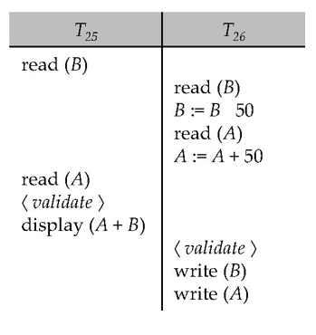
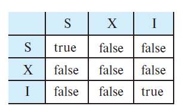

# 12 Concurrency Control

<!-- !!! tip "说明"

    本文档正在更新中…… -->

!!! info "说明"

    本文档仅涉及部分内容，仅可用于复习重点知识

## 1 Lock-Based Protocols

数据项可以通过两种模式加锁：

1. exclusive mode（排他锁，X 锁）：当一个事务需要修改数据时使用，它会阻止其他事务同时读取或修改相同数据
2. shared mode（共享锁，S 锁）：当多个事务只需要读取数据时使用，允许多个事务同时获取读锁，但会阻止任何事务获取写锁

锁管理机制：系统有一个专门的并发控制管理器负责接收和处理锁请求，事务必须等待直到获得所需锁才能继续操作

Lock-compatibility matrix：

<figure markdown="span">
  { width="400" }
</figure>

1. 如果一个数据项上的请求锁与其他事务已持有的锁兼容，则该事务可以获取该锁
2. 多个事务可以同时持有 S 锁；但如果任一事务持有 X 锁，则其他事务不能再获取任何类型的锁（无论是 S 锁还是 X 锁）
3. 如果锁无法立即授予（由于不兼容），请求锁的事务必须等待，直到其他事务释放所有不兼容的锁，然后才能获取该锁

locking protocol（锁协议）：所有事务在请求和释放锁时必须遵循的一组规则。锁协议通过限制可能的调度方式来确保并发执行的正确性

### 1.1 Pitfalls of Lock-Based Protocols

<figure markdown="span">
  { width="400" }
</figure>

上述情况称为 deadlock（死锁）

1. 互斥条件：锁的排他性导致资源独占
2. 占有并等待：事务持有锁的同时请求新锁
3. 非抢占条件：已获得的锁不能被强制剥夺
4. 循环等待：形成等待环路

处理死锁需要回滚其中一个事务并释放其持有的锁

大多数锁协议都存在死锁的可能性。死锁是一种难以避免的弊端

如果并发控制管理器设计不当，还可能发生 starvation（饥饿现象）：

1. 某个事务可能正在等待获取数据项上的 X 锁，而同时其他一系列事务却不断获取该数据项上的 S 锁
2. 同一事务因反复陷入死锁而被多次回滚

通过合理设计，并发控制管理器（concurrency control manager）可以预防饥饿现象的发生

### 1.2 The Two-Phase Locking Protocol

保证 conflict-serializable schedules 的锁协议

1. Growing Phase：transaction 获得锁而不释放锁

    1. 获得 lock-S
    2. 获得 lock-X
    3. 将 lock-S 转换到 lock-X（upgrade）

2. Shrinking Phase：transaction 释放锁而不获得锁

    1. 释放 lock-S
    2. 释放 lock-X
    3. 将 lock-X 转换到 lock-S（downgrade）

两阶段锁协议不能完全避免死锁

在两阶段锁协议下可能出现级联回滚。为避免这种情况，可以采用改进版的 strict two-phase locking（严格两阶段锁协议），要求事务持有的所有 **排他锁** 必须保持到事务提交或中止时才释放

Rigorous two-phase locking（严谨两阶段锁协议）更为严格：要求所有锁（包括 **共享锁**）都保持到事务提交或中止。该协议下事务可按提交顺序实现串行化

### 1.3 Implementation of Locking

1. lock manager 可作为独立进程实现，事务向其发送加锁和解锁请求
2. 锁管理器通过发送授权消息响应请求（若发生死锁则发送回滚消息）
3. 请求事务将等待直至收到响应
4. 锁管理器维护称为 lock table 的数据结构，记录已授权锁和待处理请求
5. 锁表通常实现为内存哈希表，以被锁数据项名称作为索引键

<figure markdown="span">
  { width="500" }
</figure>

### 1.4 Graph-Based Protocols

Graph-based protocols 是两阶段锁协议的替代方案

tree protocol 是最简单的 graph protocol

核心优势：

1. 死锁免疫：通过树形访问顺序自然避免循环等待
2. 弹性锁释放：事务可以在使用完父节点后立即释放其锁，而不必像 2PL 那样保持到事务结束
3. 高并发性：早期锁释放减少了资源占用时间

主要局限：

1. 恢复难题：由于允许早期解锁，可能出现事务 T2 读取了 T1 修改但未提交的数据，若 T1 最终中止会导致不可恢复的情况
2. 过度加锁：为访问节点 D，事务必须按 A → C → D 路径加锁，即使只需要访问 D
3. 协议互斥性：与 2PL 存在调度能力差异

#### 1.4.1 Tree Protocol

<figure markdown="span">
  { width="400" }
</figure>

1. 只允许使用排他锁（X 锁）
2. 事务 Ti 的第一个锁可以加在任何数据项上。后续对数据项 Q 加锁的前提是：Ti 当前正持有 Q 的父节点的锁（也就是遵循父到子的路径）
3. 数据项可以在任何时候解锁
4. 如果数据项已被 Ti 加锁并解锁，则 Ti 后续不能再重新对其加锁

<figure markdown="span">
  { width="800" }
</figure>

## * 2 Timestamp-Based Protocols

**基于时间戳的协议**

时间戳的作用：

1. 每个事务在进入系统时会被分配一个唯一的时间戳，用于标识其开始的时间顺序。时间戳通常是一个单调递增的数字或系统时间
2. 通过比较事务的时间戳，可以确定事务之间的先后顺序，从而保证并发执行的结果与某种串行顺序一致（即可串行化）

协议的核心思想：如果一个事务 Ti 的时间戳 TS(Ti) 小于事务 Tj 的时间戳 TS(Tj)（即 Ti 比 Tj 更早进入系统），则协议会确保 Ti 的的操作在逻辑上先于 Tj 的操作执行

协议为每个数据项 Q 维护两个时间戳值：

1. W-timestamp(Q)：记录最后一次成功写入数据项 Q 的事务的时间戳。任何新事务试图写入 Q 时，其时间戳必须满足一定的条件（通常要求大于当前的 R-timestamp(Q)），以避免“写覆盖”问题
2. R-timestamp(Q)：记录最后一次成功读取数据项 Q 的事务的时间戳。任何新事务试图读取 Q 时，其时间戳必须满足一定的条件（通常要求大于当前的 W-timestamp(Q)），以避免读取到“过时”数据

假设事务 Ti 发出一个 read(Q) 操作：

1. 如果 TS(Ti) <= W-timestamp(Q)，说明 Ti 试图读取一个已被覆盖的 Q 值。因此，该读操作会被拒绝，且 Ti 会被回滚
2. 如果 TS(Ti) >= W-timestamp(Q)，则读操作会被执行，同时将 R-timestamp(Q) 更新为 R-timestamp(Q) 和 TS(Ti) 中的较大值

假设事务 Ti 发出一个 write(Q) 操作：

1. 如果 TS(Ti) < R-timestamp(Q)，说明 Ti 试图写入的 Q 值已被其他事务读取，而系统已假设该值不会被再次修改。因此，写操作会被拒绝，且 Ti 会被回滚
2. 如果 TS(Ti) < W-timestamp(Q)，说明 Ti 试图写入一个过时的 Q 指（已有更新的事务完成写入）。因此，写操作会被拒绝，且 Ti 会被回滚
3. 否则：写操作会被执行，同时将 W-timestamp(Q) 更新为 TS(Ti)

### 2.1 Correctness of Timestamp-Ordering Protocol

1. 保证可串行性：

    1. 优先图（Precedence Graph）：通过时间戳强制事务操作的执行顺序（较小时间戳的事务必须先于较大时间戳的事务执行），使得优先图中所有边的方向一致（从旧事务指向新事务）
    2. 无环路：由于时间戳是全序的（即事务之间总有明确的先后关系），优先图中不会出现循环依赖，从而保证调度是可串行化的

2. 避免死锁：无等待机制：事务若违反时间戳规则（如尝试读取已覆盖的数据或写入过时值），会直接回滚而非等待其他事务完成。因此，系统不会出现事务互相阻塞的死锁情况

### 2.2 Recoverability and Cascade Freedom

1. 级联回滚（Cascading Rollback）：若事务 Tj 读取了事务 Ti 写入的数据，但 Ti 之后被回滚，则 Tj 也必须回滚（因其读取了“脏数据”）。时间戳协议无法避免此问题
2. 不可恢复的调度：若事务 Tj 提交后，其依赖的事务 Ti 被回滚，则调度不可恢复（违反事务原子性）。时间戳协议可能允许此类情况发生

解决方法：

1. 延迟写操作：将事务的所有写操作集中到事务的最后阶段执行，确保在写操作完成前，事务不会对其他事务产生可见的影响
2. 原子性保证：写操作作为一个原子单元执行，期间禁止其他事务介入，避免部分写操作被其他事务读取
3. 时间戳重置：中止的事务会分配一个新的时间戳后重新执行，避免因时间戳冲突导致再次失败

### 2.3 Thomas’ Write Rule

1. 忽略过时写入：若事务 Ti 的写操作时间戳小于 Q 的最后写入时间戳，说明该写操作是基于旧数据状态的，对最终结果无影响，可直接忽略而无需回滚事务
2. 保留原协议逻辑：对于其他情况（如时间戳冲突或读操作），仍遵循时间戳排序协议的规则

托马斯写规则允许更高的并发潜力。与之前的协议不同，它支持某些视图可串行化（view-serializable）但非冲突可串行化（conflict-serializable）的调度

## * 3 Validation-Based Protocols

**基于验证的协议**

三阶段设计：

1. 读取和执行阶段：事务读取数据库数据，所有修改先在内存中缓存，避免直接修改数据库，减少冲突
2. 验证阶段：检查事务的执行是否与其他事务冲突（如是否读取了已提交的新数据或覆盖了其他事务的更新）
3. 写入阶段：通过验证后，才将修改永久写入数据库，否则丢弃所有修改

并发执行的事务的三个阶段可以交替进行，但每个事务必须严格按顺序经历这三个阶段

该协议也称为 optimistic concurrency control（乐观并发控制），因为事务会完全执行，并期望在验证阶段一切顺利

每个事务包含三个时间戳：

1. start：开始执行的时间
2. validation：进入验证阶段的时间
3. finish：完成写入阶段的时间

可串行化顺序由验证阶段的时间戳决定，以提升并发性。因此令 TS(Ti) = validation(Ti)

该协议在冲突概率较低的场景中非常有效，并能提供更高的并发度，因为：

1. 可串行化顺序并非预先确定
2. 需要回滚的事务数量相对较少

### 3.1 Validation Test for Transaction Tj

对于所有满足 TS(Ti) < TS(Tj) 的事务 Ti，若以下任一条件成立：

1. finish(Ti) < start(Tj)
2. start(Tj) < finish(Ti) < validation(Tj) 且 Ti 写入的数据项集合与 Tj 读取的数据项集合无交集

则验证成功，Tj 可以提交；否则验证失败 Tj 终止

<figure markdown="span">
  { width="400" }
  <figcaption>Validation-Based Protocols 的示例</figcaption>
</figure>

## 4 Multiple Granularity

**多粒度锁定**：允许事务根据需求选择不同大小的数据单元（从单行到整个表）进行锁定，提供了灵活性

层次结构：数据粒度被组织成树状结构，例如：整个数据库 → 表 → 页 → 记录。较小的数据单元（细粒度）包含在较大的单元（粗粒度）中

隐式锁定规则：当锁定某个节点时，其所有子节点自动被锁定。例如，锁定一个表会隐式锁定表中的所有行

粒度选择权衡：

1. Fine granularity（细粒度）：允许多个事务同时访问不同数据，并发性高，但需要维护更多锁，开销大
2. Coarse granularity（粗粒度）：管理简单开销小，但会限制并发，因为锁定整个表会阻止其他事务访问表中任何部分

<figure markdown="span">
  { width="600" }
  <figcaption>granularity hierarchy 的示例</figcaption>
</figure>

### 4.1 Intention Lock

**意向锁**

树形层次结构中（如数据库 → 表 → 行），如果事务 T4 想锁定整个数据库，传统方法需要遍历所有子节点检查是否有冲突锁（如某个行已被 X 锁锁定），这会导致性能低下

1. 意向共享锁（IS, Intention-Shared Lock）：表示该节点的某个后代节点已被 S 锁锁定。例如：如果某行被 S 锁锁定，则其所属的表和数据库会被加上 IS 锁
2. 意向排他锁（IX, Intention-Exclusive Lock）：表示该节点的某个后代节点已被 X 锁锁定。例如：如果某行被 X 锁锁定，则其所属的表和数据库会被加上 IX 锁
3. SIX 锁（Shared + Intention exclusive）：表示当前节点被 S 锁锁定，但某些后代节点可能被 X 锁锁定（用于更复杂的并发控制）

<figure markdown="span">
  { width="600" }
  <figcaption>compatibility matrix 兼容性矩阵</figcaption>
</figure>

1. 锁的获取顺序（自顶向下）

    1. 必须先锁根节点（如整个数据库），再逐步向下锁定更细粒度的节点（如表、行）
    2. 意向锁（IS/IX） 用于声明事务可能在子节点加锁，避免遍历整棵树检查冲突

2. 锁的释放顺序（自底向上）

    1. 必须先释放所有子节点的锁，才能释放父节点的锁
    2. 例如：事务不能先释放表的锁，而仍持有表中某些行的锁

### 4.2 Multiple Granularity Locking Scheme

**多粒度锁定机制**

事务 Ti 对节点 Q 加锁时需遵循以下规则：

1. 必须遵守锁兼容性矩阵（即不同锁模式的兼容性规则）
2. 必须先锁定树的根节点，且根节点可以以任何模式锁定
3. 仅当节点 Q 的父节点当前被 Ti 以 IX 或 IS 模式锁定时，Ti 才能以 S 或 IS 模型锁定 Q
4. 仅当节点 Q 的父节点当前被 Ti 以 IX 或 SIX 模式锁定时，Ti 才能以 X、SIX 或 IX 模式锁定 Q
5. Ti 必须遵守两阶段锁协议（2PL），即锁定阶段不能与解锁阶段交叉（锁定后不能提前释放任何节点锁）
6. Ti 仅当节点 Q 的所有子结点均为被 Ti 锁定时，才能解锁 Q

## * 5 Multiversion Schemes

**多版本并发控制**

多版本机制通过保留数据项的旧版本来提高并发性

1. 每次写操作创建数据的新版本，而非直接覆盖旧数据
2. 每个版本关联一个时间戳（如事务的提交时间），用于确定版本的可见性

读操作流程：事务 Ti 读取数据项 Q 时，系统选择满足以下条件的版本：

1. 该版本的时间戳 ≤ 事务 Ti 的时间戳
2. 且该版本是所有满足条件中时间戳最大的版本（即最新可见版本）

> 若 Ti 的时间戳为 50，系统会返回时间戳 ≤ 50 的最新版本（如版本 45）

写操作流程：事务 Tj 写入 Q 时，生成新版本并标记为 Tj 的时间戳（如 60）。旧版本（如版本 45）仍保留

### 5.1 Multiversion Timestamp Ordering

**多版本时间戳排序**

每个数据项 Q 维护一个版本序列 `<Q1, Q2,...., Qm>`，每个版本 Qk 包含三个字段：

1. Content：版本 Qk 的值
2. W-timestamp(Qk)：创建（写入）该版本的事务的时间戳
3. R-timestamp(Qk)：成功读取该版本的事务的最大时间戳

当事务 Ti 创建 Q 的新版本 Qk 时，Qk 的 W-timestamp 和 R-timestamp 均初始化为 TS(Ti)

每当事务 Tj 读取 Qk 且 TS(Tj) > R-timestamp(Qk) 时，更新 Qk 的 R-timestamp 为 TS(Tj)

1. 读操作处理：事务 Ti 读取数据项 Q 时，系统会选择 W-timestamp 不超过 TS(Ti) 的最新版本 Qk，并返回其内容。这确保了事务只能读取在其时间戳之前已提交的数据版本
2. 写操作处理

    1. 冲突检测：如果 TS(Ti) < R-timestamp(Qk)，说明已经有“更年轻”的事务读取了 Qk，此时 Ti 的写入会破坏一致性，因此必须回滚
    2. 版本覆盖：如果 TS(Ti) = W-timestamp(Qk)，表示 Ti 是之前创建 Qk 的事务，允许覆盖内容（例如事务重试或更新操作）
    3. 创建新版本：其他情况下，生成一个新版本 $Q_{k+1}$，并设置其 W-timestamp 和 R-timestamp 为 TS(Ti)

协议特性：

1. 读操作无阻塞：由于保留了历史版本，读操作总能找到合适版本，无需等待
2. 写操作严格性：通过时间戳比较，确保写入不会破坏已存在的读操作一致性
3. 可串行性保证：所有操作的执行顺序与时间戳定义的逻辑顺序一致，从而满足可串行性要求

### 5.2 Multiversion Two-Phase Locking

**多版本两阶段锁定**

更新事务（写操作）：

1. 采用严格两阶段锁（Rigorous 2PL）：全程持有锁直至提交，确保可串行化
2. 版本化写入：每次写操作生成新版本，版本时间戳在提交时从 ts-counter 获取（提交时间戳）

只读事务（读操作）：分配启动时的 ts-counter 值作为时间戳，读取时间戳 ≤ 该值的最新版本，避免锁等待

---

1. 更新事务 Ti 的读操作：通过获取共享锁（S 锁）读取最新版本，确保在读取过程中数据不会被其他事务修改，保证一致性
2. 更新事务 Ti 的写操作：

    1. 获取排他锁（X 锁）以独占访问数据项，创建新版本并临时将时间戳设为 ∞ 表示该版本尚未提交
    2. 在提交阶段，将这些版本的时间戳更新为 ts-counter + 1，并递增全局 ts-counter，确保版本时间戳唯一且按提交顺序递增

在 Ti 递增 ts-counter 前后启动的事务的可见性规则：

1. 提交后启动的只读事务：时间戳 ≥ 提交后的 ts-counter，因此可以看到最新提交的版本
2. 提交前启动的只读事务：时间戳 < 提交后的 ts-counter，因此只能看到提交前的旧版本

## 6 Deadlock Handling

<figure markdown="span">
  { width="500" }
  <figcaption>死锁示例</figcaption>
</figure>

解决方法：

1. Deadlock prevention
2. Deadlock detection and deadlock recovery 

### 6.1 Deadlock Prevention

死锁预防协议确保系统永远不会进入死锁状态。死锁的四个必要条件（互斥、占有并等待、非抢占、循环等待），死锁预防策略通过破坏其中一个条件来避免死锁

1. 预声明锁（Conservative 2PL）：事务在执行前必须一次性申请所有需要的锁，如果无法全部获取，则不执行任何操作（避免部分持有导致死锁）

    1. 完全避免死锁（因为不会出现“持有部分锁并等待”的情况）
    2. 并发性极低：事务必须提前知道所有数据项，且长时间持有锁
    3. 实用性差：实际场景中很难预先确定所有需要访问的数据（如动态查询）

2. 数据项偏序加锁（Graph-Based Protocol）：系统为所有数据项定义一个全局顺序（如按主键排序、按表名排序等），事务必须严格按照该顺序加锁（例如，必须先锁表 A，才能锁表 B）

    1. 如果所有事务按相同顺序加锁，循环等待不可能出现（因为锁请求是单向的）
    2. 比 Conservative 2PL 更灵活，允许动态加锁
    3. 需要维护全局顺序，可能限制业务逻辑的灵活性

#### 6.1.1 More Deadlock Prevention Strategies

基于超时的机制（Timeout-Based Schemes）：事务申请锁时启动计时器，超时后自动回滚。本质上是乐观策略，假设死锁不常见，通过超时被动解决

- 优点：不可能发生死锁（因为等待链会被超时中断）
- 缺点

    1. 实现简单，但可能导致饥饿（某些事务反复超时）
    2. 难以确定合适的超时时间（太短会导致误判，太长会降低并发性）

---

Wait-Die（等待-死亡）与 Wound-Wait（伤害-等待）：两种策略均基于事务时间戳（Timestamp），确保老事务优先执行，避免循环等待。被回滚的事务会保留原始时间戳，重启后仍保持原有优先级

1. 等待-死亡（Wait-Die）—— non-preemptive（非抢占式）：老事务可以等待新事务释放数据项，但新事务绝不等待老事务，而是直接回滚。一个事务可能在成功前多次回滚（反复“死亡”）
2. 伤害-等待（Wound-Wait）—— preemptive（抢占式）：老事务会强制回滚（“伤害”）新事务，而不是等待它。新事务可以等待老事务。相比 Wait-Die，回滚次数可能更少

### 6.2 Deadlock Detection

等待图（Wait-for Graph）：用有向图直观表示事务间的资源等待关系

示例：

1. 事务 T1 持有数据项 A，请求 B（被 T2 持有）
2. 事务 T2 持有 B，请求 A
3. 等待图：T1 -> T2 -> T1（形成环 -> 死锁）

死锁检测流程：

1. 周期性地构建等待图（例如每隔几秒或根据系统负载触发）
2. 检测图中是否存在环
3. 解除死锁：选择牺牲者（如回滚最年轻的事务或代价最小的事务）

<figure markdown="span">
  { width="600" }
  <figcaption>Wait-for graph 示例</figcaption>
</figure>

### 6.3 Deadlock Recovery

检测到死锁时：需要回滚某个事务（作为牺牲者）以解除死锁。选择回滚成本最小的事务作为牺牲者

1. total rollback（完全回滚）：中止事务并重新启动
2. partial rollback（部分回滚）：仅回滚到解除死锁所需的最小程度，这种方式更高效

Starvation（饥饿问题）：若同一事务总是被选为牺牲者，会导致饥饿现象。解决方案是将回滚次数纳入成本计算，以避免饥饿

## 7 Insert and Delete Operations

若使用两阶段锁协议（2PL）：

1. 删除操作：仅当事务对要删除的元组持有排他锁（X 锁）时，才能执行删除
2. 插入操作：插入新元组的事务会获得该元组的排他锁（X 锁）

插入和删除可能导致 **Phantom Phenomenon**（幻读现象）：

1. 事务 A 扫描整个关系（如计算 Perryridge 分行所有账户的余额总和）
2. 事务 B 在该关系中插入新元组（如在 Perryridge 分行新增一个账户）
3. 尽管两者未访问同一元组，但（概念上）存在冲突

若仅使用元组级锁，可能导致不可串行化的调度：例如：扫描事务无法看到新增的账户，但会读取更新事务修改的其他元组，导致数据不一致

考虑以下两个事务：

<div class="grid" markdown>

```sql linenums="1" title="T1"
select count (*)
from instructor
where dept name = 'Physics';
```

```sql linenums="1" title="T2"
insert into instructor
values (11111, 'Feynman', 'Physics', 94000);
```

</div>

如果 T1 在计算 `count(*)` 时使用了 T2 新插入的元组，则 T1 读取了 T2 写入的值。因此，在等价于调度 S 的串行调度中，T2 必须位于 T1 之前

如果 T1 未使用 T2 新插入的元组计算 `count(*)`，则在等价于调度 S 的串行调度中，T1 必须位于 T2 之前

---

幻读问题的根源在于事务对关系结构信息（如元组存在性）的读写冲突，而非仅针对具体数据

数据项锁定方案：

1. 共享锁（S 锁）：允许并发扫描，但阻止插入/删除操作（需 X 锁）
2. 排他锁（X 锁）：插入/删除事务独占关系结构信息，但会阻塞所有扫描操作

缺点：由于锁粒度粗（整个关系），插入/删除事务需等待所有扫描完成，吞吐量下降

改进方案：Index Locking Protocol（索引锁定协议）通过要求对特定索引桶加锁，在防止幻读的同时提供更高的并发性

> 在本例中，我们假设 instructor 表的 dept_name 属性上建有索引。此时，事务 T2 必须修改包含键值 "Physics" 的叶子节点。如果事务 T1 需要读取同一叶子节点来定位所有属于 Physics 系的元组，那么 T1 和 T2 会在此叶子节点上产生冲突

### 7.1 Index Locking Protocol

基本要求：

1. 每个关系必须至少有一个索引
2. 对关系的访问必须通过其上的某个索引进行

查找操作（Lookup）：事务 Ti 执行查找时，必须以共享模式（S-mode）锁定所有访问的索引桶（index buckets）

插入操作（Insert）：

1. 事务 Ti 若要将元组 ti 插入关系 r，必须更新 r 的所有索引
2. Ti 需在每个索引上执行查找，定位所有可能包含指向 ti 的指针的索引桶（假设 ti 已存在），并以排他模式（X-mode）锁定这些索引桶
3. 同时，Ti 必须以排他模式锁定所有需要修改的索引桶

协议规则：必须遵守两阶段锁协议（2PL）的规则

## * 8 Concurrency in Index Structures

索引的特殊性：

1. 功能单一性：索引仅用于加速数据检索，不直接存储业务数据
2. 高频访问：索引的访问频率远高于数据本身（如每次查询都可能遍历索引）

传统锁机制的局限性：若对 B+ 树的每个节点严格使用两阶段锁（2PL），会导致大量事务阻塞（例如，根节点被锁定时所有操作无法进行）

索引并发协议的优化：

1. 提前释放锁：在确保正确性的前提下，事务访问完 B+ 树的某个内部节点后，可立即释放其锁，无需等待事务结束
2. 容忍非串行化：只要最终能正确导航到叶子节点，中间节点的读取顺序即使不一致也可接受

在 B+ 树节点上使用爬行协议（Crabbing）替代两阶段锁协议

1. 向下阶段：从根节点开始，沿 B+ 树向下遍历时，每层节点按需加共享锁，一旦子节点锁获取成功即释放父节点锁
2. 向上阶段：若需修改树结构（如叶子节点分裂），反向向上以排他锁重新锁定路径上的父节点

优点：减少锁持有时间，提升并发性

死锁问题：

1. 事务 A 向下搜索时持有高层节点共享锁
2. 事务 B 向上更新时请求高层节点排他锁
3. 两者互相等待，形成环路死锁

解决：牺牲搜索事务（因其无副作用），重启后树结构可能已更新，需重新遍历

更优协议：B-link 树协议。核心思想：在获取子节点锁之前释放父节点锁，并处理锁释放与获取之间可能发生的结构变更

## Homework

???+ question "课本 18.1"

    Show that the two-phase locking protocol ensures conflict serializability and that transactions can be serialized according to their lock points.

    ??? success "答案"

        Tow-Phase Locking 将事务分为两个阶段：

        1. Growing Phase：事务只能获取锁，不能释放锁
        2. Shrinking Phase：事务只能释放锁，不能获取锁

        由于事务在释放任何锁之后不能再获取新的锁，因此事务之间的锁获取顺序形成了一个偏序关系。这种偏序关系确保了事务的调度是冲突可串行化的，即存在一个等价的事务串行顺序

        Lock Point 是事务获取最后一个锁的时间点。将事务按照它们的锁定点顺序串行化，可以保证调度的冲突可串行性。因为锁定点反映了事务对数据项的访问顺序，从而避免了冲突操作的交叉

???+ question "课本 18.2"

    Consider the following two transactions:

    <div class="grid" markdown>

    ```text linenums="1" title="T34"
    read(A);
    read(B);
    if A = 0 then B := B + 1;
    write(B).
    ```

    ```text linenums="1" title="T35"
    read(B);
    read(A);
    if B = 0 then A := A + 1;
    write(A).
    ```

    </div>

    Add lock and unlock instructions to transactions T34 and T35 so that they observe the two-phase locking protocol. Can the execution of these transactions result in a deadlock?

    ??? success "答案"

        $T_{34}$

        ```text
        lock-S(A);
        read(A);
        lock-S(B);
        read(B);
        if A = 0 then
        	upgrade(B);
        	B := B + 1;
        	write(B);
        unlock(A);
        unlock(B);
        ```
        
        $T_{35}$
        
        ```text
        lock-S(B);
        read(B);
        lock-S(A);
        read(A);
        if B = 0 then
        	upgrade(A);
        	A := A + 1;
        	write(A);
        unlock(B);
        unlock(A);
        ```
        
        这两个事务有可能导致 deadlock：
        
        |                           $T_{34}$                           |                           $T_{35}$                           |
        | :----------------------------------------------------------: | :----------------------------------------------------------: |
        |                   lock-S(A);<br/>read(A);                    |                                                              |
        |                   lock-S(B);<br/>read(B);                    |                                                              |
        |                                                              |                   lock-S(B);<br/>read(B);                    |
        |                                                              |                   lock-S(A);<br/>read(A);                    |
        | if A = 0 then<br/>	upgrade(B);<br/>$T_{35}$ 拥有 B 的 S 锁，等待 |                                                              |
        |                                                              | if B = 0 then<br/>	upgrade(A);<br/>$T_{34}$ 拥有 A 的 S 锁，等待 |
        
        $T_{34}$ 等待 $T_{35}$ 释放 B 的锁，而 $T_{35}$ 等待 $T_{34}$ 释放 A 的锁，形成循环等待，即 deadlock

???+ question "课本 18.7"

    Consider a database system that includes an atomic increment operation, in addition to the read and write operations. Let V be the value of data item X. The operation `increment(X) by C` sets the value of X to V + C in an atomic step. The value of X is not available to the transaction unless the latter executes a read(X).
    
    Assume that increment operations lock the item in increment mode using the compatibility matrix in Figure below.

    <figure markdown="span">
      { width="400" }
    </figure>

    a. Show that, if all transactions lock the data that they access in the corresponding mode, then two-phase locking ensures serializability.

    b. Show that the inclusion of increment mode locks allows for increased concurrency.

    ??? success "答案"

        a. 如果所有事务按兼容性矩阵正确加锁，则事务的锁请求顺序会形成一个偏序关系，避免冲突操作交叉。最终调度等价于按锁获取顺序的串行执行，从而保证可串行化

        b.

        1. 没有 I 锁：`increment(X)` 操作需要用到 X 锁，根据兼容性矩阵，这会阻碍其他所有操作
        2. 有 I 锁：多个 `increment(X)` 操作就可以并发执行，因为 I 锁之间相互兼容

???+ question "课本 18.18"

    Most implementations of database systems use strict two-phase locking. Suggest three reasons for the popularity of this protocol.

    ??? success "答案"

        strict tow-phase locking：要求事务持有的所有排他锁必须保持到事务提交或中止时才释放

        1. **简化恢复过程**：由于事务持有的排他锁直到提交后才释放，其他事务无法读取或修改未提交的数据。因此，系统无需处理脏读或级联回滚，故障恢复时只需回滚未提交的事务即可
        2. **避免级联回滚**：在普通 2PL 中，事务可能读取其他事务未提交的数据（如果锁被提前释放）。若后者回滚，前者也必须回滚，导致级联问题。而 Strict 2PL 要求事务持有的所有排他锁必须保持到事务提交或中止时才释放，彻底避免了这一现象
        3. **实现简单且高效**：锁管理开销低，事务只需在提交时一次性释放所有锁，无需跟踪锁的释放时机