# 13 Recovery System

<!-- !!! tip "说明"

    本文档正在更新中…… -->

!!! info "说明"

    本文档仅涉及部分内容，仅可用于复习重点知识

## 1 Failure Classification

1. Transaction failure

    1. Logical errors：由于某些内部错误条件导致事务无法完成，如溢出、错误输入、数据未找到等
    2. System errors：数据库系统由于错误条件（如死锁）必须终止活动事务

2. System crash：电源故障或其他硬件/软件故障导致系统崩溃

    - Fail-stop assumption（故障停止假设）：假设非易失性存储内容不会因系统崩溃而损坏
    - 数据库系统有众多完整性检查来防止磁盘数据损坏

3. Disk failure：磁头碰撞或类似磁盘故障破坏部分或全部磁盘存储

    - 假设破坏是可检测的：磁盘驱动器使用校验和来检测故障

### 1.1 Recovery Algorithms

事务的原子性问题：以转账事务为例，说明一个事务包含多个操作（如扣款和存款），这些操作要么全部完成，要么全部不完成。如果系统在部分操作完成后崩溃，会导致数据不一致（如钱已扣但未存入）

恢复算法的必要性：

1. 如果过早将修改写入数据库（未提交时），崩溃会导致不一致状态
2. 如果过晚写入（提交后才写入），崩溃会导致已提交的修改丢失

恢复算法的两个核心部分：

1. 预防性措施：在事务正常执行时记录足够信息（如日志），为可能的故障恢复做准备
2. 恢复措施：在故障发生后，利用之前记录的信息将数据库恢复到正确状态

## * 2 Storage Structure

1. 易失性存储（Volatile storage）：

    - 系统崩溃后数据无法保留
    - 例如：主存（内存）、缓存

2. 非易失性存储（Nonvolatile storage）：

    - 系统崩溃后数据仍可保留
    - 例如：磁盘、磁带、闪存（如SSD）、非易失性RAM（电池供电）
    - 但仍可能发生故障，导致数据丢失

3. 稳定存储（Stable storage）：

    - 一种理想化的存储形式，能抵御所有故障
    - 实际中通过在不同非易失性介质上维护多个数据副本来近似实现

### 2.1 Stable-Storage Implementation

在多个独立磁盘上维护每个数据块的副本：副本可存放在远程站点，以防火灾、洪水等灾难性事件

数据传输期间的故障仍可能导致副本不一致，数据块传输可能出现以下结果：

1. 成功完成
2. 部分失败：目标块包含错误信息
3. 完全失败：目标块未被更新

防止数据传输期间的存储介质故障（一种解决方案），按以下步骤执行输出操作（假设每个数据块有两个副本）：

1. 将信息写入第一个物理块
2. 当第一次写入成功完成后，将相同信息写入第二个物理块
3. 仅当第二次写入也成功完成后，才视为输出操作完成

如何对比多个磁盘中的内容：

1. 低效方法：全盘扫描比对所有块的副本（计算开销大）
2. 高效方法：

    1. 通过非易失性日志记录正在写入的块位置（关键创新）
    2. 恢复时仅检查日志中记录的"可能不一致块"，大幅减少比对量

恢复策略：

1. 优先相信校验和正确的副本
2. 当两个副本均有效但内容不同时，采用"第一副本优先"的覆盖策略（隐含第一个副本更可信的设计假设）

### 2.2 Data Access

1. Physical blocks：是持久化存储在磁盘上的数据单元，是数据的最终存储形式
2. Buffer blocks：是数据在内存中的临时副本，用于提高访问效率（磁盘 I/O 速度远慢于内存）

数据传输操作：

1. input(B)：读取操作，将磁盘上的数据加载到内存供程序使用
2. output(B)：写入操作，将修改后的数据从内存刷回磁盘，确保持久化

> 为简化起见，我们假设每个数据项都能完整存储在一个单独的块中

事务工作区机制：每个事务都有独立的工作区，存储数据项的本地副本（如 $x_i$ 是 X 的副本）。这种设计实现了事务隔离性，确保事务不会直接相互干扰

关键操作：

1. read(X)：将数据从数据库缓冲区读入事务工作区（**首次访问时必须执行**，后续读取可直接使用本地副本）
2. write(X)：将修改从工作区写回缓冲区（可延迟执行）
3. output($B_X$)：将缓冲区内容最终写入磁盘（由系统决定时机）

<figure markdown="span">
  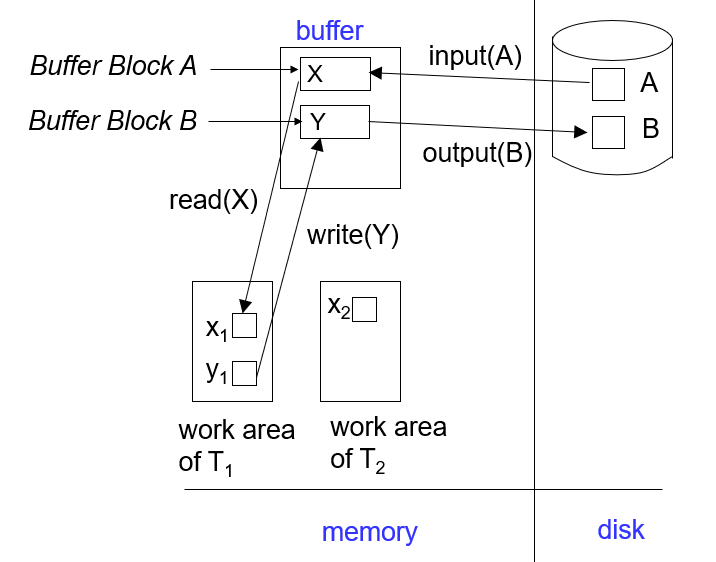{ width="600" }
  <figcaption>Data Access 示例</figcaption>
</figure>

## * 3 Recovery and Atomicity

原子性保证原理：采用"先记录后修改"策略，所有更改首先被记录到持久化的日志中。这种设计确保即使系统崩溃，也能通过日志恢复未完成的事务

**log-based recovery mechanisms**（日志恢复机制）：主流的恢复技术

替代方案：影子分页 (shadow-paging)

## 4 Log-Based Recovery

日志是数据库系统中实现事务恢复的关键机制，具有以下特点：

1. 存储在稳定存储中，确保即使系统崩溃也不会丢失
2. 按时间顺序记录所有数据库更新活动
3. 每个记录包含足够的信息用于恢复操作

三种基本日志记录：

1. 开始记录：`<Tᵢ start>`：标记事务开始，用于识别哪些事务在崩溃时处于活动状态
2. 更新记录：`<Tᵢ, X, V₁, V₂>`：记录数据项 X 的修改，包含修改前值 (V₁) 和修改后值 (V₂)，为回滚 (undo) 和重做 (redo) 提供必要信息
3. 提交记录：`<Tᵢ commit>`：标记事务成功完成，表示事务的所有修改可以永久生效

两种恢复方法：

1. Deferred database modification（延迟数据库修改）
2. Immediate database modification（立即数据库修改）

<figure markdown="span">
  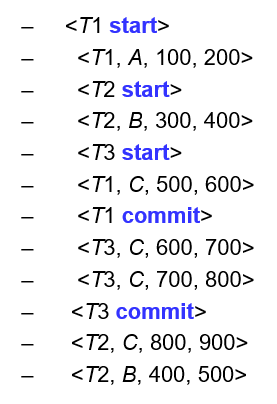{ width="300" }
  <figcaption>Log File Example</figcaption>
</figure>

### 4.1 Deferred Database Modification

核心思想：

1. 所有数据修改首先被记录到日志中，但实际的数据写入被推迟到事务提交之后
2. 采用"先记日志，后写数据"的方式确保可恢复性

执行流程：

1. 事务开始时记录开始标记
2. 每个写操作只记录到日志（包含事务 ID、数据项和新值）：产生一条日志记录 `<Tᵢ, X, V>`，其中 V 是 X 的新值（此方案不需要记录旧值）
3. 事务提交时记录提交标记
4. 最后才真正执行所有数据修改

<figure markdown="span">
  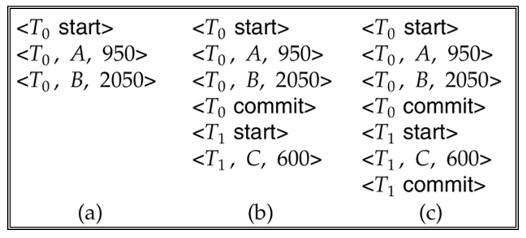{ width="600" }
  <figcaption>Deferred Database Modification 示例</figcaption>
</figure>

上图中，如果崩溃时稳定存储中的日志处于以下情况：

1. 不需要执行任何重做 (redo) 操作
2. 必须执行 redo(T₀)，因为日志中存在 `<T₀ commit>` 记录
3. 必须先执行 redo(T₀)，接着执行 redo(T₁)，因为日志中同时存在 `<T₀ commit>` 和 `<T₁ commit>` 记录

### 4.2 Immediate Database Modification

核心特征：

1. 与延迟修改相反，允许事务在提交前就将修改写入数据库
2. 但仍需遵循 WAL (Write-Ahead Logging) 原则：先记日志后改数据

日志记录必须优先持久化（直接写入稳定存储）。数据块的写入时机和顺序更灵活（可延迟、可乱序）

<figure markdown="span">
  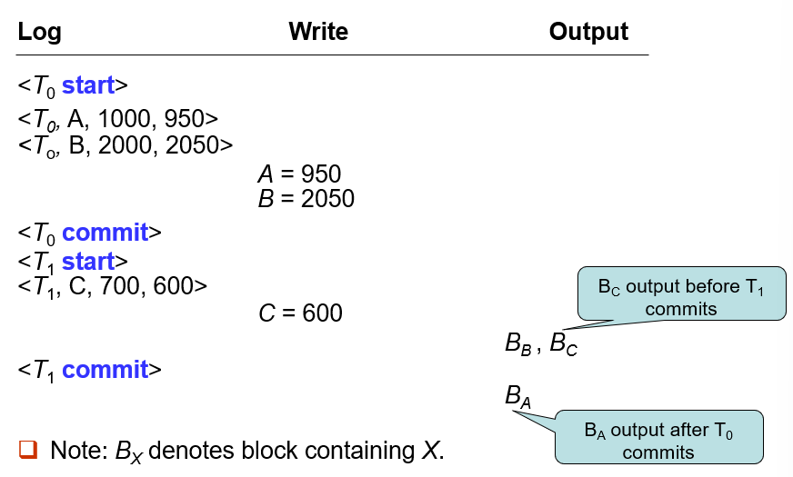{ width="600" }
  <figcaption>Immediate Database Modification 示例</figcaption>
</figure>

#### 4.2.1 How to Recovery

双操作恢复体系：

1. undo：逆向回滚未提交事务（保证原子性）：将 Tᵢ 更新的所有数据项恢复为旧值，从 Tᵢ 的最后一条日志记录逆向处理
2. redo：正向重做已提交事务（保证持久性）：将 Tᵢ 更新的所有数据项设置为新值，从 Tᵢ 的第一条日志记录正向处理
3. 二者配合确保数据库达到一致状态

这两个操作必须是幂等的：即使操作重复执行多次，效果与执行一次相同

事务状态判定：

1. 只有 start 记录 → 未提交 → 需要 undo
2. 同时有 start 和 commit 记录 → 已提交 → 需要 redo
3. 既无 start 也无 commit → 忽略（视为未开始）

==必须先执行所有 undo 操作，再执行 redo 操作==

1. 避免已回滚事务的修改被错误重做
2. 确保最终状态与事务的串行执行结果一致

**Example：**

<figure markdown="span">
  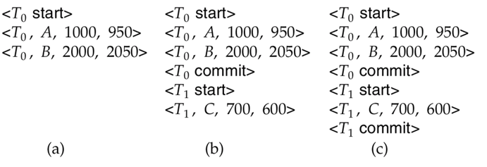{ width="600" }
</figure>

1. undo(T₀)：将 B 恢复为 2000，A 恢复为 1000。写入日志记录：`<T₀, B, 2000>`、`<T₀, A, 1000>`、`<T₀ abort>`
2. undo(T₁) 和 redo(T₀) ：将 C 恢复为 700，将 A 和 B 分别设为 950 和 2050。写入日志记录：`<T₁, C, 700>`、`<T₁ abort>`
3. redo(T₀) 和 redo(T₁)：先将 A 和 B 分别设为 950 和 2050，然后将 C 设为 600

### 4.3 Checkpoints

传统的事务恢复需要处理整个事务日志，当系统运行时间很长时，日志会变得非常庞大，导致恢复过程缓慢。另一个问题是可能会重复重做 (redundant redo) 那些已经成功写入磁盘的事务更新

检查点解决方案：定期执行检查点操作来标记系统的特定状态点

1. 将内存中的日志记录持久化到稳定存储
2. 将脏缓冲区（修改过的数据）刷写到磁盘
3. 记录一个包含当前活跃事务列表的特殊检查点日志记录

在执行检查点操作期间，系统会暂停所有数据更新操作以保证一致性

系统崩溃后，只需处理：

1. 检查点时刻仍在活跃的事务（记录在 `<checkpoint L>` 的列表 L 中）
2. 检查点之后新开始的事务
3. 检查点之前已结束（提交或中止）的事务无需处理，因为它们的修改已持久化到磁盘

日志扫描策略：

1. 反向扫描日志：从日志末尾向前查找最近的检查点记录，确定恢复的起点
2. 撤销操作的边界：继续向前扫描，直到找到所有活跃事务的开始记录 `<Ti start>`，确保撤销操作完整
3. 日志截断：早于所有活跃事务开始记录的日志部分可安全删除，节省存储空间

**Example：**

<figure markdown="span">
  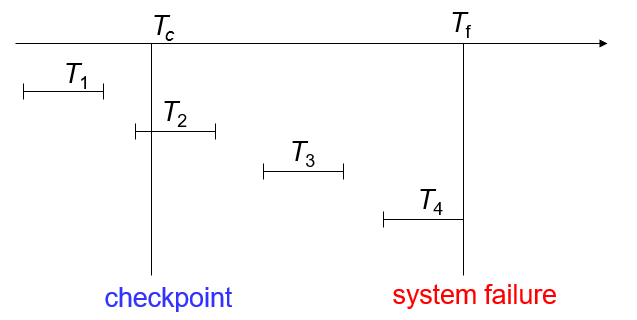{ width="600" }
</figure>

1. T1 可以被忽略
2. T2 和 T3 需要 redo
3. T4 需要 undo

## * 5 Shadow Paging

它是数据库恢复机制中基于日志恢复的替代方案，尤其适合串行事务环境

1. 双页表结构：

    1. 当前页表（Current Page Table）：记录事务执行过程中修改后的数据页位置，用于正常数据访问
    2. 影子页表（Shadow Page Table）：事务开始时数据库的原始页表，存储在非易失性存储（如磁盘）中，始终不被修改

2. 写时复制（Copy-on-Write）：事务首次修改某数据页时：

    1. 创建该页的副本到空闲区域
    2. 更新当前页表，使其指向新副本（原页仍被影子页表引用）
    3. 所有修改仅作用于副本，保持原始页不变

事务提交：

1. 首先确保所有修改过的内存页面都持久化到磁盘
2. 将记录这些修改的当前页表也写入磁盘
3. 通过原子性地更新一个固定的磁盘指针，将当前页表"提升"为新的影子页表

事务中止：丢弃当前页表，恢复影子页表，所有修改自动失效（因实际数据未被覆盖）

<figure markdown="span">
  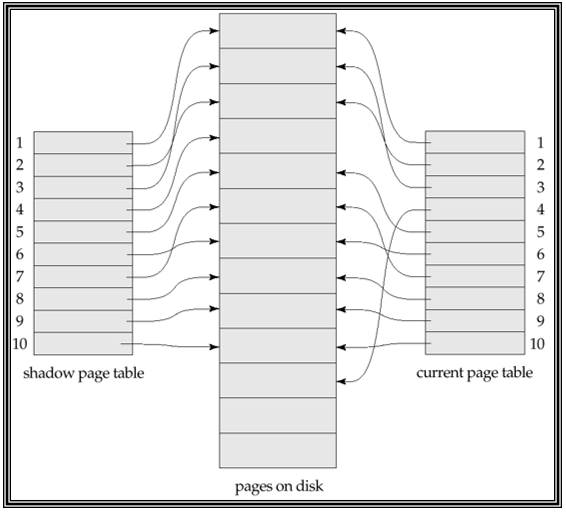{ width="600" }
  <figcaption>Shadow Paging 示例</figcaption>
</figure>

崩溃恢复优势：

1. 由于采用原子指针切换，系统总是保持一致性状态
2. 崩溃后不需要传统恢复过程，直接使用最后的影子页表即可
3. 新事务可以立即开始工作，无需等待恢复完成

影子分页：

1. 优点

    1. 无日志开销：传统日志机制需要为每个操作记录日志，而影子分页完全避免了这一开销。省去了日志写入、维护和管理的过程
    2. 极简恢复：系统崩溃后只需回退到最近的影子页表。不需要复杂的重做 (redo) 或撤销 (undo) 操作

2. 缺点

    1. 页表复制问题：原始实现需要复制整个页表，性能代价高

        - 优化方案：采用 B+ 树结构的页表，只需复制被修改的路径分支（类似写时复制）

    2. 持久化开销：提交时必须确保所有修改页和页表都持久化到磁盘。这种批量刷新的 I/O 压力可能造成性能瓶颈
    3. 存储管理问题：

        1. 数据碎片化：多次更新会导致页面副本分散在磁盘各处
        2. 垃圾回收：需要额外机制回收旧版本页面，增加了系统复杂度

    4. 并发限制：原生设计只适合串行事务，要实现并发需要引入额外机制（如版本控制），相比之下，基于日志的方案天然更适合并发环境

## 6 Recovery With Concurrent Transactions

1. 共享资源设计：

    1. 单一日志文件：所有事务的日志记录混合存储
    2. 统一缓冲区：事务间共享内存缓冲池

2. 并发控制基础：

    1. 采用 strict two-phase locking（X 锁持续到事务结束）
    2. 确保未提交修改不会影响其他事务（隔离性）

日志管理特点：

1. 交叉日志记录：不同事务的操作按实际执行顺序混合记录
2. 检查点增强：需要记录检查点时刻所有活跃事务的状态

恢复机制调整：

1. 检查点扩展：检查点记录必须包含多个并发事务的上下文，典型形式：`<checkpoint {T1,T2,...Tn}>`
2. 恢复流程变化：需要重建崩溃时的并发场景，必须正确处理事务间的依赖关系

恢复算法核心流程：

1. 创建两个关键列表：

    1. undo-list：记录需要回滚的事务
    2. redo-list：记录需要重做的事务

2. 从日志末尾开始反向扫描，直到找到第一个 `<checkpoint L>` 记录为止。在反向扫描过程中：

    1. 如果遇到 `<Ti commit>`，将 Ti 加入 redo-list
    2. 如果遇到 `<Ti start>`，且 Ti 不在 redo-list 中，则将 Ti 加入 undo-list
    3. 如果遇到 `<Ti abort>`，将 Ti 加入 undo-list

3. 对于检查点记录 L 中的每个事务 Ti，如果 Ti 不在 redo-list 中，则将其加入 undo-list
4. 从日志文件末尾开始反向扫描，直到遇到 undo-list 中每个事务 T 的 `<T start>` 记录为止。在扫描过程中，对属于 undo-list 中事务的每个日志记录执行 undo 操作
5. 定位最近的 `<checkpoint L>` 记录
6. 从 `<checkpoint L>` 记录开始正向扫描日志直到日志末尾，在扫描过程中，对属于 redo-list 中事务的每个日志记录执行 redo 操作

**Example：**

<figure markdown="span">
  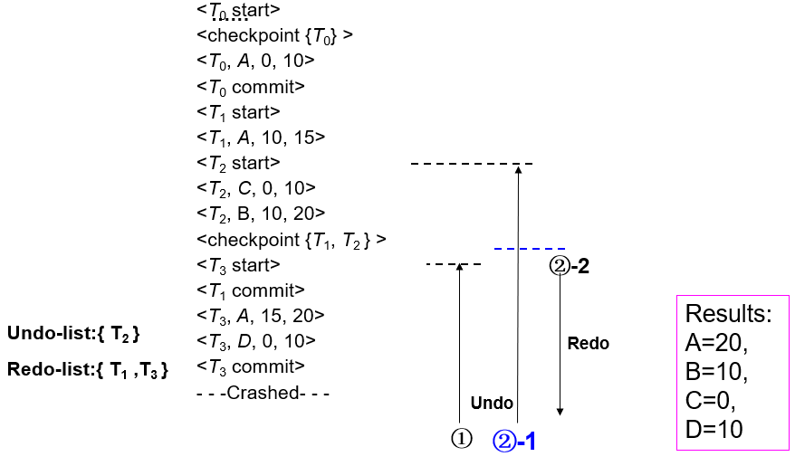{ width="600" }
  <figcaption>Recovery 示例</figcaption>
</figure>

## 7 Buffer Management

通常，稳定存储（如磁盘）的写入以块为单位进行，而单个日志记录通常远小于一个块大小。因此，日志记录会先在内存中缓冲，而非直接写入稳定存储

以下情况会将日志记录写入稳定存储：

1. 缓冲区中的日志记录块已满
2. 执行强制写入（log force）操作。例如：检查点发生时

事务提交时需要执行强制写入（log force），将该事务的所有日志记录（包括提交记录 `<T_i commit>`）强制写入稳定存储

通过这种方式，多个日志记录可以通过单次 I/O 操作写入，显著降低 I/O 开销

### 7.1 The Rules for Log Record Buffering

1. 日志记录必须按照生成顺序写入稳定存储
2. 事务 Ti 只有在其提交记录 `<Ti commit>` 写入稳定存储后，才能进入提交状态
3. 在输出 `<Ti commit>` 记录前，必须确保 Ti 相关的所有日志记录都已持久化
4. WAL（Write-Ahead Logging）机制：内存中的数据块写入数据库前，该块内数据对应的所有日志记录必须已写入稳定存储（日志先于数据落盘）

### 7.2 Database Buffering

数据库在内存中维护数据块的缓冲池，当需要新块时，若缓冲池已满，则需移除现有块；若被移除的块已被修改，则必须将其写回磁盘

- 恢复算法支持 no-force 策略（非强制策略），即事务提交时无需立即将修改块写入磁盘

> force 策略（强制策略）：要求提交时必须写回所有修改块

- 恢复算法支持 steal 策略（抢占策略），即允许包含未提交事务修改的数据块提前写入磁盘

若要将包含未提交更新的数据块写入磁盘，必须先将包含这些更新 undo 信息的日志记录写入稳定存储

数据块写入磁盘时，必须确保没有正在进行的更新操作。可通过以下方式保证：

1. 写入数据项前，事务需先获取包含该数据项的数据块的排他锁
2. 写入完成后即可释放锁，此类短期持有的锁称为 **latch**（闩锁）

数据块写入磁盘的完整流程：

1. 首先获取数据块的排他闩锁：确保该块上没有进行中的更新操作
2. 然后执行日志刷盘（log flush）
3. 接着将数据块写入磁盘
4. 最后释放数据块的闩锁

---

Database buffer 的实现方式可分为：

1. 在预留的 real main-memory（物理内存区域）中实现（专供数据库使用）
2. 在虚拟内存中实现

使用预留物理内存的缺点：

1. 内存需预先在数据库缓冲区和应用程序间静态划分，缺乏灵活性
2. 当内存需求变化时，操作系统无法动态调整内存分配比例（尽管操作系统最了解实时内存需求）

尽管存在缺陷，数据库缓冲通常仍采用虚拟内存实现：

1. 当操作系统需要置换出已修改的页面时，该页面会被写入磁盘交换区
2. 当数据库决定将缓冲页写入磁盘时，目标页可能已被交换到磁盘交换区，导致需要：先从交换区读取该页到内存，再将其写入数据库磁盘。这种额外的 I/O 操作称为 **dual paging**（双分页问题）
3. 理想情况下，当操作系统需要置换缓冲页时，应将控制权移交数据库，由数据库执行

    1. 若页面已被修改，先写日志再直接将页面写入数据库（而非交换区）
    2. 释放该页面供操作系统重用

## 8 Failure with Loss of Nonvolatile Storage

采用类似检查点的技术应对存储介质故障：

1. 定期将数据库 **dump**（完整转储）到稳定存储
2. 转储过程中不允许有任何活跃事务，需执行类似检查点的操作：

    1. 将内存中的所有日志记录写入稳定存储
    2. 将所有缓冲区块写入磁盘
    3. 将数据库完整内容复制到稳定存储
    4. 向日志中输出一条 `<dump>` 记录

磁盘故障后的恢复步骤：

1. 从最近的完整转储 (dump) 恢复数据库基础状态
2. 检查日志并重做 (redo) 转储后所有已提交的事务

可扩展支持转储期间保持事务活跃（称为模糊转储或在线转储）

商业数据库系统采用多种安全性和可靠性保障方法，各商业数据库产品提供专用工具辅助数据复制和恢复

## * 9 Advanced Recovery Techniques

B+ 树并发控制：在高并发环境下，B+ 树索引需要特殊的锁定技术来保证数据一致性，同时维持高性能

提前释放锁：与传统事务处理不同，B+ 树操作 (插入/删除) 会在操作完成后立即释放锁，而不是等待事务结束，这提高了并发性但增加了恢复复杂度

逻辑撤销 (Logical Undo)：

1. 由于锁被提前释放，不能简单地用物理撤销 (恢复旧值)
2. 需要通过执行相反操作来撤销 (插入 → 删除，删除 → 插入)
3. 日志中需要记录如何执行这些反向操作

日志记录方式：

1. 撤销日志：采用逻辑记录 (记录操作而非数据)
2. 重做日志：仍采用物理记录 (记录新值)，因为逻辑重做实现起来太复杂

操作一致性：指数据库状态必须能够接受特定操作，而崩溃后磁盘状态可能不满足这一要求，使得逻辑重做难以实现

---

操作日志（operation logging）的记录方式如下：

1. 当操作开始时，记录 `<Ti, Oj, operation-begin>`，其中 Oj 是该操作实例的唯一标识符
2. 在操作执行期间，正常记录包含物理重做（physical redo）和物理撤销（physical undo）信息的日志记录
3. 当操作完成时，记录 `<Ti, Oj, operation-end, U>`，其中 U 包含执行逻辑撤销（logical undo）所需的信息

如果 crash 或 rollback 发生在操作完成之前：

1. 找不到 `operation-end` 日志记录
2. 此时使用物理撤销信息来回滚该操作

如果 crash 或 rollback 发生在操作完成之后： 

1. 能找到 `operation-end` 日志记录
2. 此时使用 U 执行逻辑撤销，而忽略该操作的物理撤销信息

操作的 redo（崩溃后恢复）仍然使用 physical redo 信息

---

回滚的基本流程：采用反向扫描日志的方式（从最新到最旧）进行回滚，遇到不同类型的日志记录会采取不同的处理方式

1. 反向扫描日志

    1. 如果找到日志记录 `<Ti, X, V1, V2>`：

        1. 执行撤销操作（undo）
        2. 并记录一条特殊的"仅重做"日志记录 `<Ti, X, V1>`

    2. 如果找到 `<Ti, Oi, operation-end, U>`记录：

        1. 使用撤销信息 U 逻辑地回滚该操作
        2. 回滚过程中执行的更新会像正常操作执行时一样被记录
        3. 在操作回滚结束时，不记录 operation-end 记录，而是生成一条 `<Ti, Oi, operation-abort>` 记录
        4. 跳过该操作内部的所有日志记录，直接回到操作开始点

2. 继续反向扫描日志

    1. 如果发现"仅重做"日志记录（redo-only record），则忽略它
    2. 如果发现 `<Ti, Oj, operation-abort>` 记录：跳过 Ti 的所有前序日志记录，直到找到 `<Ti, Oj, operation-begin>` 记录为止
    3. 当找到 `<Ti, start>` 记录时停止扫描
    4. 向日志中添加一条 `<Ti, abort>` 记录

<figure markdown="span">
  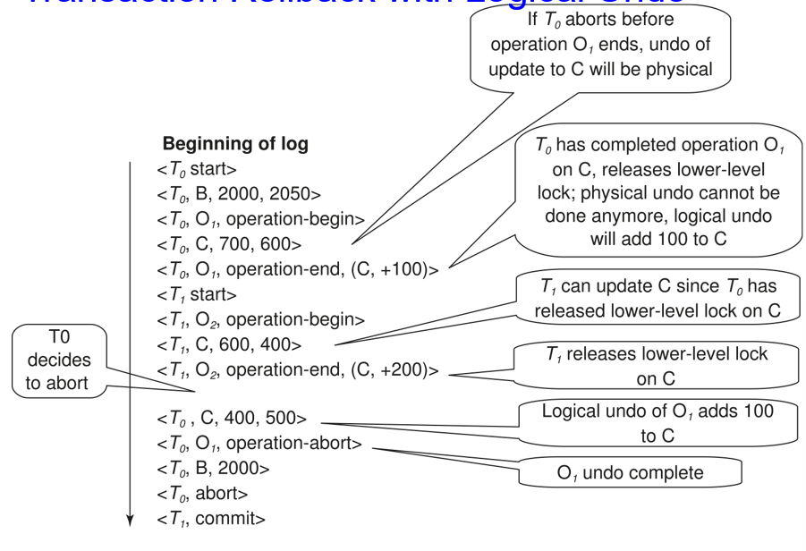{ width="600" }
  <figcaption>示例</figcaption>
</figure>

---

系统崩溃后恢复时执行以下操作：

1. 从最后一条 `<checkpoint L>` 记录开始正向扫描日志：

    1. 通过物理重做所有事务的所有更新来"重演历史"
    2. 在扫描过程中创建撤销列表 (undo-list)：

        1. 初始时 undo-list 设置为 L（检查点记录中的事务列表）
        2. 当找到 `<Ti start>` 记录时，将 Ti 加入 undo-list
        3. 当找到 `<Ti commit>` 或 `<Ti abort>` 记录时，将 Ti 从 undo-list 移除

2. 反向扫描日志，对撤销列表 (undo-list) 中的事务执行撤销操作：

    1. 按照之前描述的方法回滚事务
    2. 当在 undo-list 中找到事务 Ti 的 `<Ti start>` 记录时，写入一条 `<Ti abort>` 日志记录
    3. 当 undo-list 中所有 Ti 的 `<Ti start>` 记录都被找到时停止扫描

---

检查点 (checkpoints) 的执行过程如下：

1. 将内存中的所有日志记录输出到稳定存储设备
2. 将所有已修改的缓冲区块输出到磁盘
3. 向稳定存储设备的日志中输出一条 `<checkpoint L>` 记录

在检查点执行过程中，不允许事务执行任何操作

fuzzy checkpointing（模糊检查点）：允许事务在检查点最耗时的操作进行期间继续执行

<figure markdown="span">
  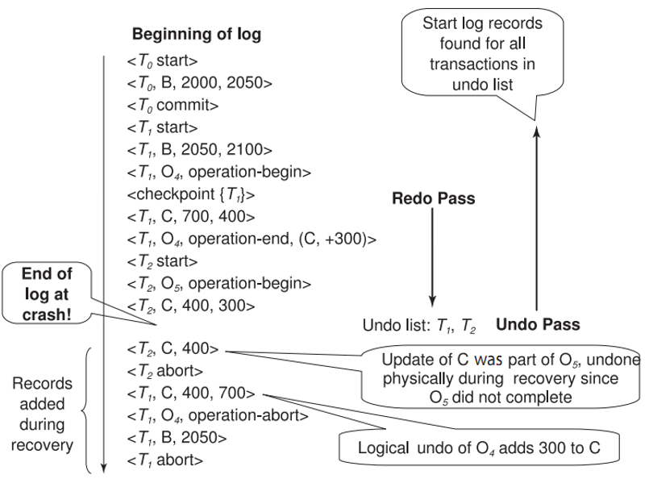{ width="600" }
  <figcaption>示例</figcaption>
</figure>

---

模糊检查点 (fuzzy checkpointing) 执行流程：

1. 暂时停止所有事务的更新操作
2. 写入 `<checkpoint L>` 日志记录并强制刷入稳定存储
3. 记录当前被修改的缓冲区块列表 M
4. 此时允许事务继续执行操作
5. 将列表 M 中所有被修改的缓冲区块输出到磁盘

    - 数据块在写入磁盘时不能被更新
    - 遵循 WAL (Write-Ahead Logging) 原则：必须先输出与某数据块相关的所有日志记录，才能输出该数据块

6. 在磁盘固定位置 last_checkpoint 存储指向该检查点记录的指针

使用模糊检查点恢复时：

1. 从 last_checkpoint 指针指向的检查点记录开始扫描日志
2. last_checkpoint 之前的日志记录，其更新已经反映在磁盘数据库中，无需重做
3. 可以安全处理不完整的检查点（系统在执行检查点时崩溃的情况）

## * 10 ARIES Recovery Algorithm

ARIES：这是一种先进的数据库恢复算法，通过多种优化技术实现了高效运行和快速恢复

1. LSN（log sequence number 日志序列号）：每个日志记录都有唯一标识，数据库页中也存储相关 LSN，用于追踪页面更新状态
2. physiological redo（生理重做）：一种介于物理和逻辑之间的重做方式，兼具两者的优点
3. dirty page table（脏页表）：记录哪些页面被修改过，避免恢复时对所有页面执行重做
4. fuzzy checkpointing（模糊检查点）：检查点操作不需写出所有脏页，只需记录脏页信息，大大减少检查点开销

### 10.1 Physiological redo

受影响的页面通过物理方式定位，但页面内的操作可以是逻辑性的：用于减少日志记录的开销  

例如：当删除一条记录且需要移动其他记录来填补空缺时

- 生理重做只需记录删除操作
- 物理重做则需要记录页面中大量数据的旧值和新值

要求页面必须以原子方式写入磁盘：硬件 RAID 可以轻松实现这一点，某些磁盘系统也支持该功能。不完整的页面写入可以通过校验和技术检测到，但恢复时需要执行额外的操作，这种情况被视为介质故障

### 10.2 ARIES Data Structures

1. LSN：用于唯一标识每条日志记录

    1. 必须严格单调递增
    2. 通常是日志文件起始位置的偏移量，以实现快速访问
    3. 可轻松扩展以支持多日志文件

2. Page LSN
3. 多种类型的日志记录
4. Dirty page table

#### 10.2.1 Page LSN

每个页面包含一个 PageLSN，记录的是该页面上最后一次更新的日志记录 LSN

更新页面的流程：

1. 获取页面的排他锁 (X-latch)，并写入日志记录
2. 更新页面内容
3. 将日志记录的 LSN 存入 PageLSN
4. 释放页面锁

将页面刷写到磁盘前，必须先获取共享锁 (S-latch)，从而确保磁盘上的页面状态是操作一致的，这是支持生理重做 (physiological redo) 的必要条件

PageLSN 在恢复过程中用于避免重复执行重做操作，从而确保操作的幂等性

#### 10.2.2 Log Record

每个日志记录包含同一事务前一个日志记录的 LSN（PrevLSN）

> 日志记录中的 LSN 可以是隐式的

<figure markdown="span">
  { width="600" }
</figure>

使用一种特殊的 redo-only（仅重做）日志记录 —— compensation log record（CLR，补偿日志记录），用于记录恢复过程中无需撤销的操作

1. 其作用相当于早期恢复算法中的操作中止日志记录
2. 包含 UndoNextLSN 字段，指向下一个（更早的）需要撤销的记录

    1. 两者之间的记录已被撤销
    2. 用于避免重复撤销已撤销的操作

<figure markdown="span">
  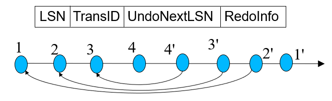{ width="600" }
</figure>

#### 10.2.3 Dirty Page Table

记录缓冲区中已被修改的页面列表，即脏页表

对于每个脏页包含以下信息：

1. 该页面的 PageLSN（最后更新日志序列号）
2. RecLSN：表示早于此 LSN 的日志记录已应用到磁盘上的页面版本
3. 当页面首次被修改加入脏页表时，RecLSN 被设置为当前日志的末尾位置
4. 该信息会被记录在检查点中，有助于最小化重做工作量

<figure markdown="span">
  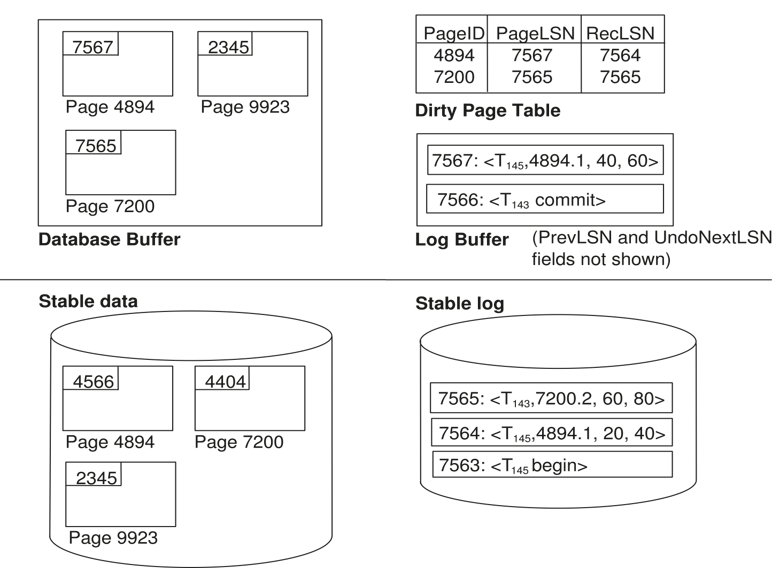{ width="600" }
  <figcaption>ARIES Data Structures</figcaption>
</figure>

#### 10.2.4 Checkpoint Log

Checkpoint log record：

1. 脏页表和活跃事务列表
2. 每个活跃事务的 LastLSN（该事务最后写入的日志记录 LSN）

磁盘上的固定位置记录了最近一次完成的检查点日志记录的 LSN

检查点时不立即写出脏页，而是采用后台持续刷新的方式逐步写出。因此检查点操作开销极低，可以频繁执行

### 10.3 ARIES Recovery Algorithm

1. Analysis pass：确定

    1. 需要撤销哪些事务
    2. 崩溃时哪些页面是脏页（磁盘版本不是最新状态）
    3. RedoLSN：开始重做操作的起始 LSN

2. Redo pass：重演历史，从 RedoLSN 开始重做所有操作，通过 RecLSN 和 PageLSN 避免重复重做已应用到页面的操作
3. Undo pass：回滚所有未完成的事务，之前已完成回滚的事务不再处理。核心思想：这些事务无需重复撤销 —— 之前的撤销操作已记录在日志中，必要时会通过重做机制恢复

<figure markdown="span">
  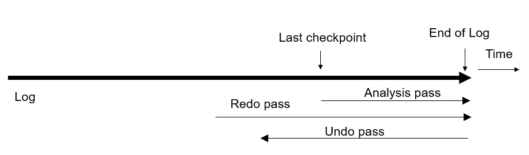{ width="600" }
</figure>

#### 10.3.1 Analysis

1. 从最后一个完整的检查点日志记录开始处理

    1. 从该日志记录中读取脏页表 (DirtyPageTable)
    2. 将 RedoLSN 设置为脏页表中所有页面的 RecLSN 最小值。如果没有脏页，则 RedoLSN 设为检查点记录的 LSN
    3. 将 undo-list 初始化为检查点日志记录中的事务列表
    4. 从检查点日志记录中读取 undo-list 里每个事务的最后一条日志记录的 LSN

2. 从检查点位置开始向前扫描日志

    1. 如果发现不属于 undo-list 中事务的日志记录，将该事务加入 undo-list
    2. 每当发现更新日志记录时，如果对应页面不在脏页表中，则将其加入并将 RecLSN 设为该更新日志记录的 LSN
    3. 如果发现事务结束日志记录，将该从事务 undo-list 中移除
    4. 持续跟踪 undo-list 中每个事务的最后一条日志记录，后续撤销阶段可能需要这些信息

3. 分析阶段结束时：

    1. RedoLSN 确定重做阶段的起始位置
    2. 脏页表中各页面的 RecLSN 用于最小化重做工作量
    3. undo-list 中的所有事务都需要被回滚

#### 10.3.2 Redo

通过重放所有尚未体现在磁盘页面上的操作来重现历史，具体流程如下：

从 RedoLSN 开始向前扫描日志。每当发现更新日志记录时：

1. 如果该页面不在脏页表中，或者日志记录的 LSN 小于脏页表中该页面的 RecLSN，则跳过该记录
2. 否则从磁盘读取该页面。如果从磁盘读取的页面的 PageLSN 小于日志记录的 LSN，则重做该日志记录

#### 10.3.3 Undo

当对更新日志记录执行撤销操作时：

1. 生成包含所执行撤销动作的补偿日志记录 (CLR)（撤销操作会以物理或生理方式记录）
2. 将 CLR 的 UndoNextLSN 设置为原更新日志记录的 PrevLSN 值

ARIES 支持部分回滚：例如用于处理死锁时，只需回滚到足以释放读锁的程度

<figure markdown="span">
  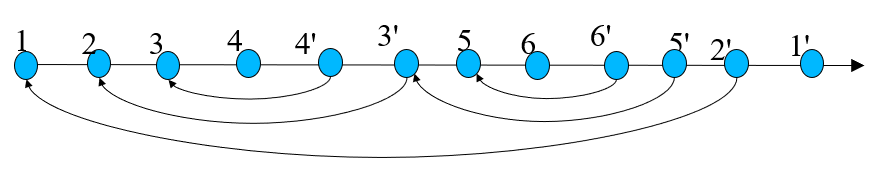{ width="600" }
  <figcaption>1. 图中用 n' 表示对记录 n 生成的 CLR 2. 图中箭头表示 UndoNe系统LSN 的值 3. 图示说明了部分回滚后的继续操作。初始有记录 3 和 4，之后是 5 和 6，最后完全回滚</figcaption>
</figure>

处理流程：

1. 逆向扫描日志，回滚 undo-list 中的所有事务：通过以下方式优化逆向扫描，跳过不需要的日志记录：

    1. 为每个事务设置下一个待撤销 LSN（初始值为分析阶段确定的该事务最后一条日志 LSN）
    2. 每次选择这些 LSN 中的最大值进行撤销，跳转到该位置执行撤销
    3. 撤销完成后：

        1. 对于普通日志记录，将下一个待撤销 LSN 设置为该记录的 PrevLSN
        2. 对于补偿日志记录 (CLR)，将下一个待撤销 LSN 设置为该记录的 UndoNextLSN

    4. 中间所有记录都可以跳过（因为它们已被撤销）

2. 撤销操作按照前述机制执行

<figure markdown="span">
  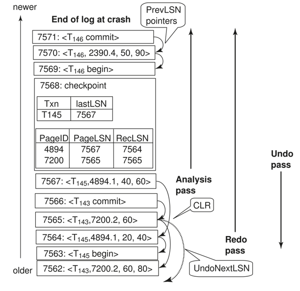{ width="600" }
  <figcaption>Recovery Actions in ARIES</figcaption>
</figure>

**Example：**

<figure markdown="span">
  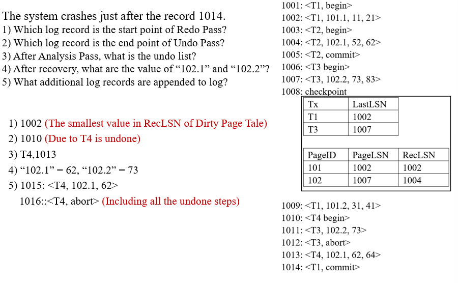{ width="600" }
</figure>

### 10.4 Other ARIES Features

1. Recovery independence：页面可以独立于其他页面恢复。例如：当某些磁盘页面损坏时，可以在使用其他页面的同时从备份恢复损坏页
2. Savepoints：事务可以设置保存点并回滚到指定保存点。对复杂事务特别有用，也可用于死锁时仅回滚到释放锁所需的程度
3. Fine-grained locking：支持索引并发算法，允许在索引上实现元组级锁定。这类操作需要逻辑撤销（而非早期恢复算法中的物理撤销）
4. Recovery optimization：

    1. 利用脏页表预取页面加速重做过程
    2. 支持乱序重做：对正在从磁盘读取的页面可暂缓重做，待页面加载完成后再执行，期间可以继续处理其他日志记录

## * 11 Remote Backup Systems

远程备份系统通过确保即使主站点损毁也能继续处理事务，提供了高可用性保障

<figure markdown="span">
  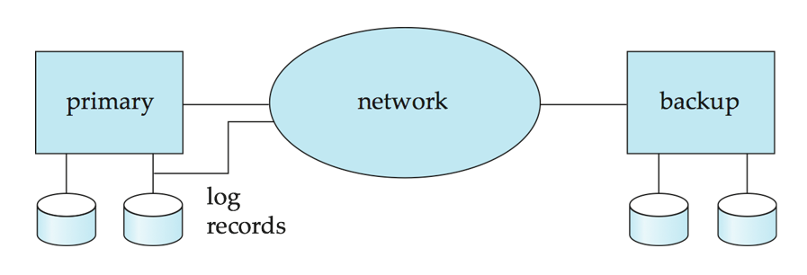{ width="600" }
</figure>

Detection of failure：备份站点必须能检测主站点故障

1. 为区分主站点故障与网络链路故障，需维护多条主备站点间的通信链路
2. 采用心跳消息检测机制

Transfer of control：

1. 接管控制权时，备份站点需先使用数据库副本和接收到的所有日志记录进行恢复。重做已完成事务，回滚未完成事务
2. 当备份站点接管处理时，即成为新的主站点
3. 当原主站点恢复后，需从备份站点获取重做日志并应用所有本地更新才能重新接管控制权

Time to recover：为减少接管延迟，备份站点定期处理重做日志记录（实质上是基于先前数据库状态执行恢复），执行检查点操作，之后可删除早期日志

热备配置实现快速接管

1. 备份站点持续处理到达的重做日志记录，在本地应用更新
2. 当检测到主站点故障时，备份站点回滚未完成事务后即可立即处理新事务

远程备份的替代方案：采用数据复制的分布式数据库：远程备份更快更经济，但容错性较低

更新持久性保障：通过延迟事务提交直到备份站点记录日志来实现，但可通过降低持久性等级避免此延迟

1. 一级安全 (One-safe)：主站点写入提交日志记录后立即提交。问题：备份接管时可能未收到更新
2. 二级非常安全 (Two-very-safe)：主备站点都写入提交日志记录后才提交。会降低可用性（任一站点故障都导致无法提交）
3. 二级安全 (Two-safe)：主备都活跃时采用 two-very-safe 策略；仅主站点活跃时采用 one-safe 策略。比 two-very-safe 可用性更高，同时避免 one-safe 的事务丢失问题