# 2 Introduction to the Relational Model

!!! tip "说明"

    此文档正在更新中……

!!! info "说明"

    本文档只涉及部分知识点，仅可用来复习重点知识

一个 relation 就是一个二维表格

<figure markdown="span">
  { width="600" }
</figure>

## 2.1 Structure of Relational Databases

### 2.1.1 Basic Structure

笛卡尔积（Cartesian product）

一个 relation 是一组 n-tuples ($a_{1j}, a_{2j}, \cdots, a_{nj}(a_{ij} \in D_i (i \in [1, n]))$)

<figure markdown="span">
  { width="600" }
</figure>

<figure markdown="span">
  { width="600" }
</figure>

### 2.1.2 Attribute

- The set of allowed values for each attribute is called the domain of the attribute
- Attribute values are (normally) required to be atomic that is indivisible
- The special value null is a member of every domain

<figure markdown="span">
  { width="600" }
</figure>

## 2.2 Database Schema

- Database schema：描述 relation 的结构
- Database instance：给定条件下的具体数值

<figure markdown="span">
  { width="600" }
</figure>

## 2.3 Keys

1. superkey：能够唯一确定特定 tuple 的 relation
2. candidate key：最小 superkey
3. primary key：K 是 candidate key 其中被选中的那一个
      1. 通常下划线标注
4. foreign key：

<figure markdown="span">
  { width="600" }
</figure>

==primary key 和 foreign key 都是 integrated constraints==

## 2.4 Schema Diagram

<figure markdown="span">
  { width="600" }
</figure>

## 2.5 Relational Query Languages

用户从 database 中获取信息的语言

## 2.6 The Fundamental Relational Algebra

### 2.6.1 Select Operation

**选择**

<figure markdown="span">
  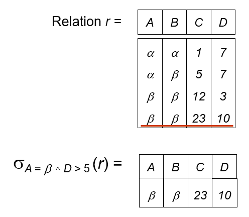{ width="600" }
</figure>

$\sigma_{p}(r) = \lbrace t | t \in r\ and\ p(t) \rbrace$

*p* 是 selection predicate，由 $\land \lor \lnot$ 连接的 terms 组成

### 2.6.2 Project Operation

**投影**

<figure markdown="span">
  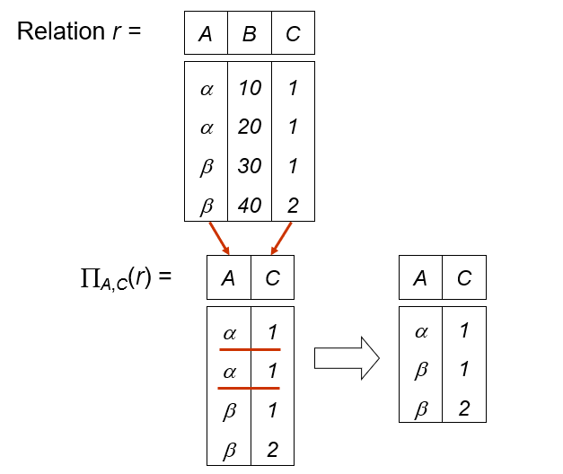{ width="600" }
</figure>

$\Pi_{A_1, A_2, \cdots, A_k}(r)$

### 2.6.3 Union Operation

**并集**

<figure markdown="span">
  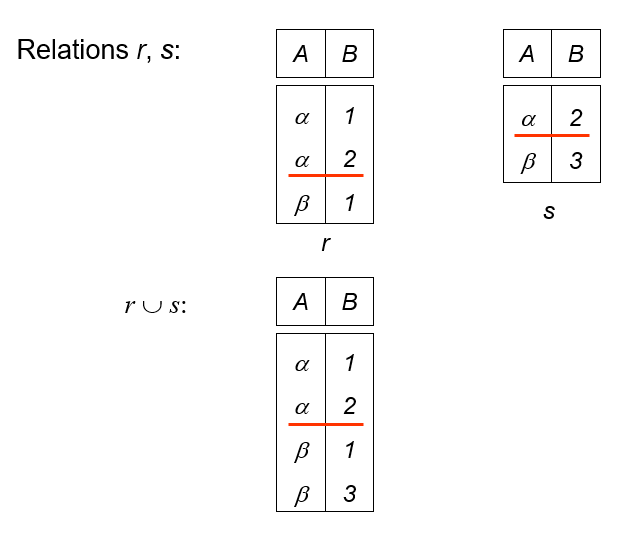{ width="600" }
</figure>

$r \cup s$

1. *r* and *s* 必须有相同的 attributes
2. attributes 是可共存的

### 2.6.4 Set Difference Operation

**差集**

<figure markdown="span">
  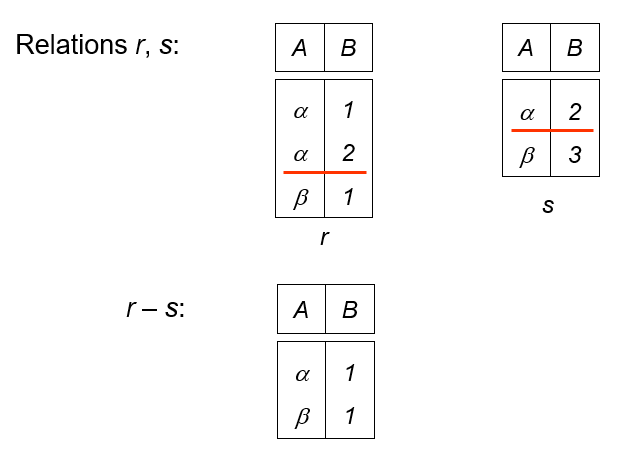{ width="600" }
</figure>

$r - s$

1. 只能在可共存的 relations 之间使用
2. *r* and *s* 必须有相同的 attributes
3. attributes 是可共存的

### 2.6.5 Cartesian-Product Operation

**笛卡尔积**

<figure markdown="span">
  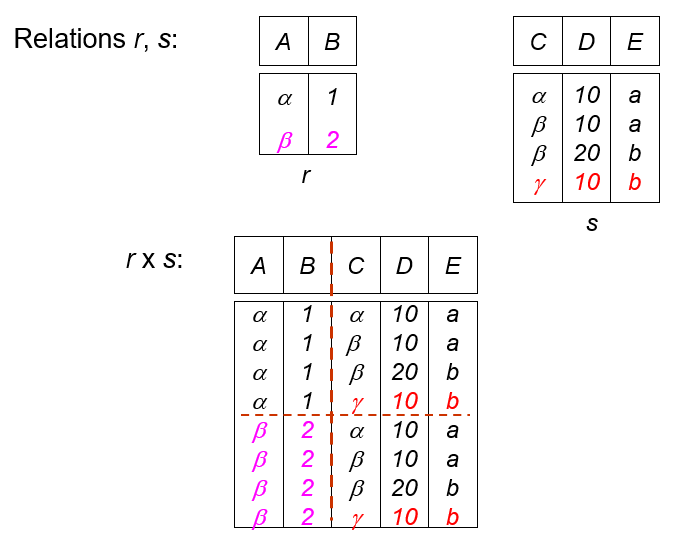{ width="600" }
</figure>

$r \times s$

如果 *r* *s* 有相同的 attributes，则会 rename

<figure markdown="span">
  { width="600" }
</figure>

### 2.6.6 Composition of Operation

<figure markdown="span">
  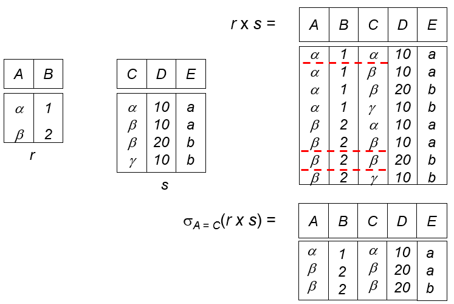{ width="600" }
</figure>

### 2.6.7 Rename Operation

**重命名**

复制一份出来重新命名

$\rho_{new\_name}(E)$

$\rho_{new\_name(new\_attr\_name1, new\_attr\_name2, \cdots, new\_attr\_name3)}(E)$

### 2.6.8 Banking Example

- branch(branch-name, branch-city, assets) 
- customer(customer-name, customer-street, customer-city) 
- account(account-number, branch-name, balance) 
- loan(loan-number, branch-name, amount) 
- depositor(customer-name, account-number) 
- borrower(customer-name, loan-number) 

**Example 1**: Find all loans of over $1200

$\sigma_{amount > 1200}(loan)$

**Example 2**: Find the loan number for each loan of an amount greater than $1200

$\Pi_{loan\text{-}number}(\sigma_{amount > 1200}(loan))$

**Example 3**: Find the names of all customers who have a loan, or an account, or both, from the bank

$\Pi_{customer\text{-}name}(borrower) \cup \Pi_{customer\text{-}name}(depositor)$

**Example 4**: Find the names of all customers who at least have a loan and an account at bank

$\Pi_{customer\text{-}name}(borrower) \cap \Pi_{customer\text{-}name}(depositor)$

**Example 5**: Find the names of all customers who have a loan at the Perryridge branch

- $\Pi_{customer\text{-}name}(\sigma_{branch\text{-}name='Perryridge'}(\sigma_{borrower.loan\text{-}number = loan.loan\text{-}number}(borrower \times loan)))$
- **BETTER**: $\Pi_{customer\text{-}name}(\sigma_{borrower.loan\text{-}number = loan.loan\text{-}number}(borrower \times (\sigma_{branch\text{-}name='Perryridge'}(loan))))$

**Example 6**: Find the names of all customers who have loans at the Perryridge branch but do not have an account at any branch of the bank

$\Pi_{customer\text{-}name}(\sigma_{borrower.loan\text{-}number = loan.loan\text{-}number}(borrower \times (\sigma_{branch\text{-}name='Perryridge'}(loan)))) - \Pi_{customer\text{-}name}(depositor)$

**Example 7**: Find the largest account balance (self-comparison)

1.Rename *account* relation as *d*
2.Find the relation including all balances except the largest one

$\Pi_{account.balance}(\sigma_{account.balance < d.balance}(account \times \rho_{d}(account)))$

3.Find the largest account balance

$\Pi_{balance}(account) - \Pi_{account.balance}(\sigma_{account.balance < d.balance}(account \times \rho_{d}(account)))$

## 2.7 The Additional Relational Algebra

### 2.7.1 Set Intersection Operation

**交**

<figure markdown="span">
  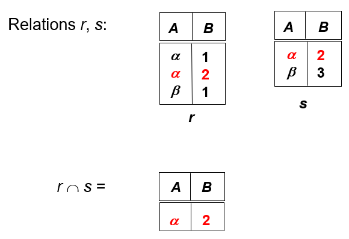{ width="600" }
</figure>

$r \cap s = r - (r - s)$

2. *r* and *s* 必须有相同的 attributes
3. attributes 是可共存的

### 2.7.2 Natural Join Operation

**自然连接**

$r \Join s$

去除掉重复的 attributes

<figure markdown="span">
  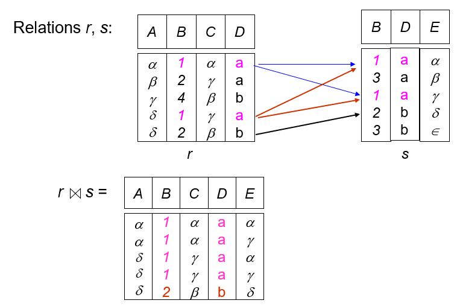{ width="600" }
</figure>

$r \Join_{\theta} s = \sigma_{\theta}(r \Join s)$

### 2.7.3 Division Operation

**除**

$r \div s$

<figure markdown="span">
  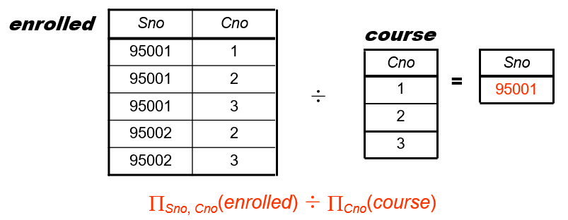{ width="600" }
</figure>

<figure markdown="span">
  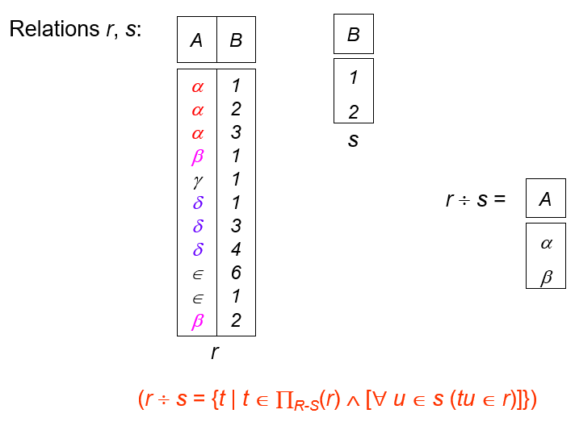{ width="600" }
</figure>

<figure markdown="span">
  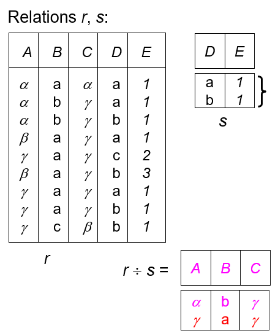{ width="600" }
</figure>

<figure markdown="span">
  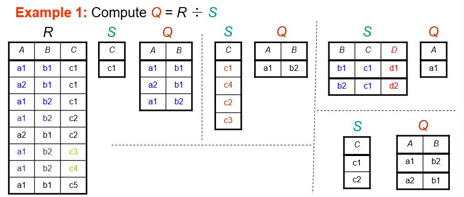{ width="600" }
</figure>

<figure markdown="span">
  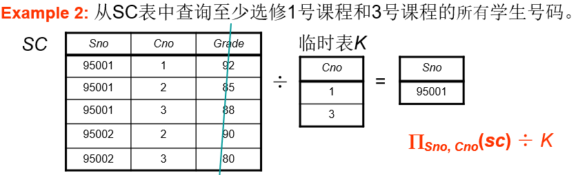{ width="600" }
</figure>

### 2.7.4 Assignment Operation

**赋值**

### 2.7.5 Banking Example

## 2.8 The Extended Relational Algebra

### 2.8.1 Generalized Projection

### 2.8.2 Aggregate Functions and Operations

<figure markdown="span">
  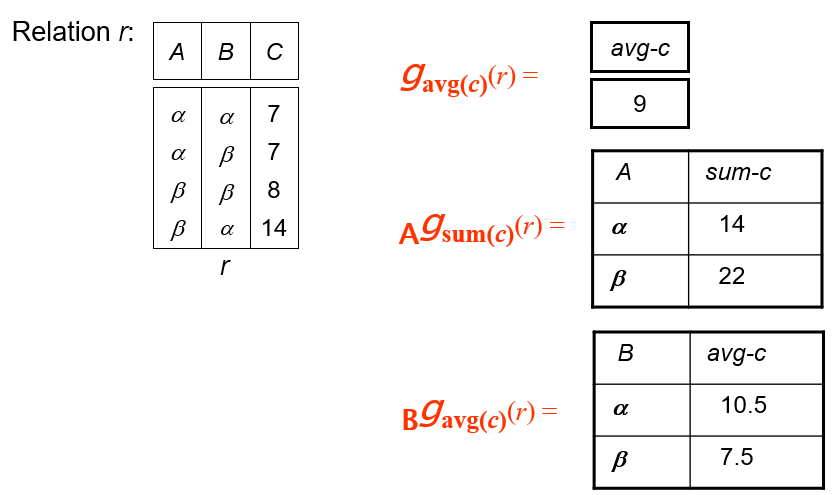{ width="600" }
</figure>

## 2.9 Modification of The Database

### 2.9.1 Deletion

**Example 1**: Delete all account records in the Perryridge branch

### 2.9.2 Insertion

**Example 1**: Insert information in the database specifying that Smith has $1200 in account A-973 at the Perryridge branch

$account \leftarrow account \cup \lbrace ('Perryridge', A\text{-}973, 1200) \rbrace$

### 2.9.3 Update

**Example 1**: Make interest payments by increasing all balances by 5 percent

$account \leftarrow \Pi_{account\text{-}number, branch\text{-}name, balance * 1.05}(account)$

**Example 2**: Pay all accounts with balances over $10,000 6 percent interest and pay all others 5 percent