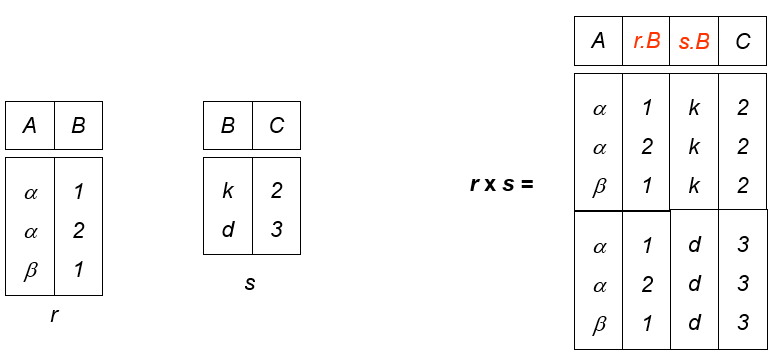
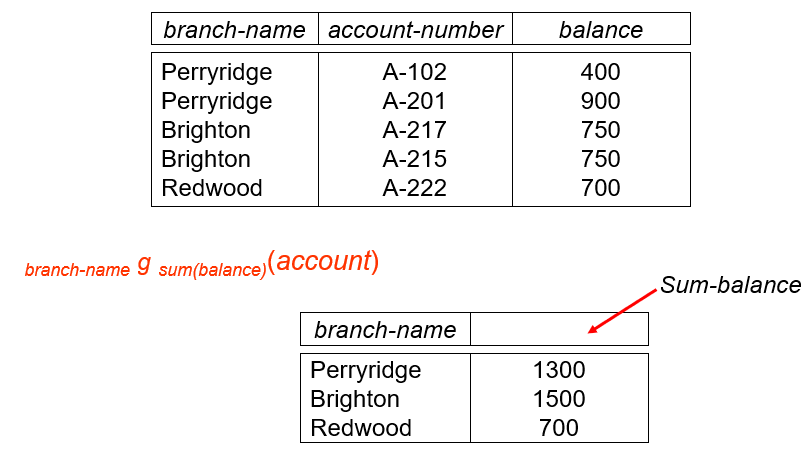
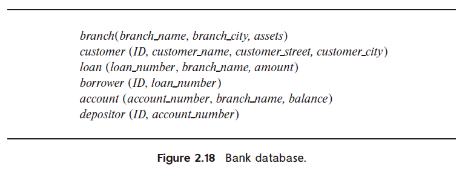
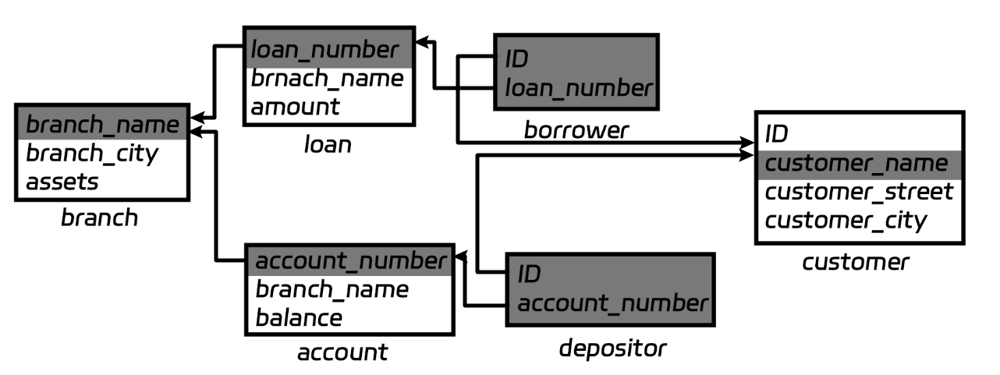

# 2 Introduction to the Relational Model

<!-- !!! tip "说明"

    本文档正在更新中…… -->

!!! info "说明"

    本文档仅涉及部分内容，仅可用于复习重点知识

一个 relation 就是一个二维表格

<figure markdown="span">
  { width="600" }
</figure>

## 2.1 Structure of Relational Databases

### 2.1.1 Basic Structure

笛卡尔积（Cartesian product）

一个 relation 是一组 n-tuples ($a_{1j}, a_{2j}, \cdots, a_{nj}(a_{ij} \in D_i (i \in [1, n]))$)

<figure markdown="span">
  { width="600" }
</figure>

<figure markdown="span">
  { width="600" }
</figure>

### 2.1.2 Attribute

- The set of allowed values for each attribute is called the domain of the attribute
- Attribute values are (normally) required to be atomic that is indivisible
- The special value null is a member of every domain

<figure markdown="span">
  { width="600" }
</figure>

## 2.2 Database Schema

- Database schema：描述 relation 的结构
- Database instance：给定条件下的具体数值

<figure markdown="span">
  { width="600" }
</figure>

## 2.3 Keys

1. superkey：能够唯一确定特定 tuple 的 relation
2. candidate key：最小 superkey
3. primary key：K 是 candidate key 其中被选中的那一个
      1. 通常下划线标注
4. foreign key：

<figure markdown="span">
  { width="600" }
</figure>

==primary key 和 foreign key 都是 integrated constraints==

## 2.4 Schema Diagram

<figure markdown="span">
  { width="600" }
</figure>

## 2.5 Relational Query Languages

用户从 database 中获取信息的语言

## 2.6 The Fundamental Relational Algebra

### 2.6.1 Select Operation

**选择**

<figure markdown="span">
  { width="600" }
</figure>

$\sigma_{p}(r) = \lbrace t | t \in r\ and\ p(t) \rbrace$

*p* 是 selection predicate，由 $\land \lor \lnot$ 连接的 terms 组成

### 2.6.2 Project Operation

**投影**

<figure markdown="span">
  { width="600" }
</figure>

$\Pi_{A_1, A_2, \cdots, A_k}(r)$

### 2.6.3 Union Operation

**并集**

<figure markdown="span">
  { width="600" }
</figure>

$r \cup s$

1. *r* and *s* 必须有相同的 attributes
2. attributes 是可共存的

### 2.6.4 Set Difference Operation

**差集**

<figure markdown="span">
  { width="600" }
</figure>

$r - s$

1. 只能在可共存的 relations 之间使用
2. *r* and *s* 必须有相同的 attributes
3. attributes 是可共存的

### 2.6.5 Cartesian-Product Operation

**笛卡尔积**

<figure markdown="span">
  { width="600" }
</figure>

$r \times s$

如果 *r* *s* 有相同的 attributes，则会 rename

<figure markdown="span">
  { width="600" }
</figure>

### 2.6.6 Composition of Operation

<figure markdown="span">
  { width="600" }
</figure>

### 2.6.7 Rename Operation

**重命名**

复制一份出来重新命名

$\rho_{new\_name}(E)$

$\rho_{new\_name(new\_attr\_name1, new\_attr\_name2, \cdots, new\_attr\_name3)}(E)$

### 2.6.8 Banking Example

- branch(branch-name, branch-city, assets) 
- customer(customer-name, customer-street, customer-city) 
- account(account-number, branch-name, balance) 
- loan(loan-number, branch-name, amount) 
- depositor(customer-name, account-number) 
- borrower(customer-name, loan-number) 

**Example 1**: Find all loans of over $1200

$\sigma_{amount > 1200}(loan)$

**Example 2**: Find the loan number for each loan of an amount greater than $1200

$\Pi_{loan\text{-}number}(\sigma_{amount > 1200}(loan))$

**Example 3**: Find the names of all customers who have a loan, or an account, or both, from the bank

$\Pi_{customer\text{-}name}(borrower) \cup \Pi_{customer\text{-}name}(depositor)$

**Example 4**: Find the names of all customers who at least have a loan and an account at bank

$\Pi_{customer\text{-}name}(borrower) \cap \Pi_{customer\text{-}name}(depositor)$

**Example 5**: Find the names of all customers who have a loan at the Perryridge branch

- $\Pi_{customer\text{-}name}(\sigma_{branch\text{-}name='Perryridge'}(\sigma_{borrower.loan\text{-}number = loan.loan\text{-}number}(borrower \times loan)))$
- **BETTER**: $\Pi_{customer\text{-}name}(\sigma_{borrower.loan\text{-}number = loan.loan\text{-}number}(borrower \times (\sigma_{branch\text{-}name='Perryridge'}(loan))))$

**Example 6**: Find the names of all customers who have loans at the Perryridge branch but do not have an account at any branch of the bank

$\Pi_{customer\text{-}name}(\sigma_{borrower.loan\text{-}number = loan.loan\text{-}number}(borrower \times (\sigma_{branch\text{-}name='Perryridge'}(loan)))) - \Pi_{customer\text{-}name}(depositor)$

**Example 7**: Find the largest account balance (self-comparison)

1.Rename *account* relation as *d*

2.Find the relation including all balances except the largest one

$\Pi_{account.balance}(\sigma_{account.balance < d.balance}(account \times \rho_{d}(account)))$

3.Find the largest account balance

$\Pi_{balance}(account) - \Pi_{account.balance}(\sigma_{account.balance < d.balance}(account \times \rho_{d}(account)))$

## 2.7 The Additional Relational Algebra

### 2.7.1 Set Intersection Operation

**交**

<figure markdown="span">
  { width="600" }
</figure>

$r \cap s = r - (r - s)$

2. *r* and *s* 必须有相同的 attributes
3. attributes 是可共存的

### 2.7.2 Natural Join Operation

**自然连接**

$r \Join s$

去除掉重复的 attributes

<figure markdown="span">
  { width="600" }
</figure>

$r \Join_{\theta} s = \sigma_{\theta}(r \Join s)$

### 2.7.3 Division Operation

**除**

$r \div s$

<figure markdown="span">
  { width="600" }
</figure>

<figure markdown="span">
  { width="600" }
</figure>

<figure markdown="span">
  { width="600" }
</figure>

<figure markdown="span">
  { width="600" }
</figure>

<figure markdown="span">
  { width="600" }
</figure>

### 2.7.4 Assignment Operation

**赋值**

$temp \leftarrow s$

### 2.7.5 Banking Example

**Example 1**: Find all customers who have an account from at least the “Downtown” and the “Uptown” branches

- $\Pi_{customer\text{-}name}(\sigma_{branch\text{-}name=‘Downtown’}(depositor \Join account)) \cap \Pi_{customer\text{-}name}(\sigma_{branch\text{-}name=‘Uptown’}(depositor \Join account)) $
- $\Pi_{customer\text{-}name, branch\text{-}name}(depositor \Join account)\div \rho_{temp(branch\text{-}name)}(\lbrace(‘Downtown’), (‘Uptown’)\rbrace)$

**Example 2**: Find all customers who have an account at all branches located in Brooklyn city

$\Pi_{customer\text{-}name, branch\text{-}name}(depositor \Join account) \div \Pi_{branch\text{-}name}(\sigma_{branch\text{-}city=‘Brooklyn’}(branch))$

**Example 3**: 查询选修了全部课程的学生学号和姓名

- 课程信息: course(cno, cname, pre-cno, credits)
- 选课信息: enrolled(sno, cno, grade)
- 学生信息: student(sno, sname, sex, age) 

1. 找出全部课程号：$\Pi_{cno}(course)$
2. 找出选修了全部课程的学生的学号：$\Pi_{sno, cno}(enrolled) \div \Pi_{cno}(course)$
3. 与 *student* 表自然连接，获得学号、姓名：$(\Pi_{sno, cno}(enrolled) \div \Pi_{cno}(course)) \Join \Pi_{sno, sname}(student)$

## 2.8 The Extended Relational Algebra

### 2.8.1 Generalized Projection

**Example**: Given a relation *credit-info(customer-name, limit, credit-balance)*,  find how much more each person can spend:  

$\Pi_{customer\text{-}name, limit - credit\text{-}balance}(credit\text{-}info)$

### 2.8.2 Aggregate Functions and Operations

1. avg
2. min
3. max
4. sum
5. count：计数
6. as：重命名

<figure markdown="span">
  { width="600" }
</figure>

$_{branch\text{-}name} g_{sum(balance)\ as\ sum\text{-}balance}(account)$

<figure markdown="span">
  { width="600" }
</figure>

## 2.9 Modification of The Database

### 2.9.1 Deletion

$r \leftarrow r - E$

**Example 1**: Delete all account records in the Perryridge branch

$account \leftarrow account - \sigma_{branch-name = ‘Perryridge’}(account)$

**Example 2**: Delete all loan records with amount in the range of 0 to 50

$loan \leftarrow loan - \sigma_{amount \geqslant 0\ and\ amount \leqslant 50}(loan)$

**Example 3**: Delete all accounts at branches located in Needham

$r_1 \leftarrow \sigma_{branch\text{-}city = ‘Needham’}(account \Join branch)$ 
$r_2 \leftarrow \Pi_{branch\text{-}name, account\text{-}number, balance}(r1)$ 
$r_3 \leftarrow \Pi_{customer\text{-}name, account\text{-}number}(r2 \Join depositor)$ 
$account \leftarrow account - r_2$ 
$depositor \leftarrow depositor - r_3$

### 2.9.2 Insertion

$r \leftarrow r \cup E$

**Example 1**: Insert information in the database specifying that Smith has $1200 in account A-973 at the Perryridge branch

$account \leftarrow account \cup \lbrace ('Perryridge', A\text{-}973, 1200) \rbrace$ 
$depositor \leftarrow depositor \cup \lbrace('Smith', A\text{-}973) \rbrace$

**Example 2**: Provide as a gift for all loan customers in the Perryridge branch, a $200 savings account. Let the loan number serve as the account number for the new savings account

$r_1 \leftarrow (\sigma_{branch\text{-}name = 'Perryridge'}(borrower \Join loan))$ 
$account \leftarrow account \cup \Pi_{branch\text{-}name, account\text{-}number, 200}(r_1)$ 
$depositor \leftarrow depositor \cup \Pi_{customer\text{-}name, loan\text{-}number}(r_1)$

### 2.9.3 Update

$r \leftarrow \Pi_{F_1, F_2, \cdots, F_n}(r)$

**Example 1**: Make interest payments by increasing all balances by 5 percent

$account \leftarrow \Pi_{account\text{-}number, branch\text{-}name, balance * 1.05}(account)$

**Example 2**: Pay all accounts with balances over $10,000 6 percent interest and pay all others 5 percent

$account \leftarrow \Pi_{account\text{-}number, branch\text{-}name, balance * 1.06}(\sigma_{balance > 10000}(account)) \cup \Pi_{account\text{-}number, branch\text{-}name, balance * 1.05}(\sigma_{balance \leqslant 10000}(account))$

## Homework

<!-- 本节内容在 2025/3/3 后上传至 Github -->

???+ question "课本 2.7"

    Consider the bank database of Figure 2.18. Give an expression in the relational algebra for each of the following queries:

    <figure markdown="span">
      { width="600" }
    </figure>

    a. Find the name of each branch located in “Chicago”. 
    b. Find the ID of each borrower who has a loan in branch “Downtown”.

    ??? success "答案"

        a. $\Pi_{branch\_name}(\sigma_{branch\_city = 'Chicago'}(branch))$
        
        b. $\Pi_{ID}(\sigma_{branch\_name = 'Downtown'}(loan) \Join borrower)$

???+ question "课本 2.12"

    Consider the bank database of Figure 2.18. Assume that branch names and customer names uniquely identify branches and customers, but loans and accounts can be associated with more than one customer.

    a. What are the appropriate primary keys? 
    b. Given your choice of primary keys, identify appropriate foreign keys.

    ??? success "答案"

        a. 
        
        - branch: branch_name
        - customer: customer_name
        - loan: loan_number
        - borrower: (ID, loan_number)
        - account: account_number
        - depositor: (ID, account_number)

        ---

        b.

        - loan: branch_name (branch.branch_name)
        - borrower: ID (customer.ID), loan_number (loan.loan_number)
        - account: branch_name (branch.branch_name)
        - depositor: ID (customer.ID), account_number (account.account_number)

???+ question "课本 2.13"

    Construct a schema diagram for the bank database of Figure 2.18.

    ??? success "答案"
    
        <figure markdown="span">
          { width="600" }
        </figure>

???+ question "课本 2.15"

    Consider the bank database of Figure 2.18. Give an expression in the relational algebra for each of the following queries:

    a. Find each loan number with a loan amount greater than $10000. 
    b. Find the ID of each depositor who has an account with a balance greater than $6000. 
    c. Find the ID of each depositor who has an account with a balance greater than $6000 at the “Uptown” branch.

    ??? success "答案"

        a. $\Pi_{loan\_number}(\sigma_{amount > 10000}(loan))$
        
        b. $\Pi_{ID}((\sigma_{balance > 6000}(account)) \Join depositor)$
        
        c. $\Pi_{ID}((\sigma_{balance > 6000 \land branch\_name = 'Uptown'}(account)) \Join depositor)$