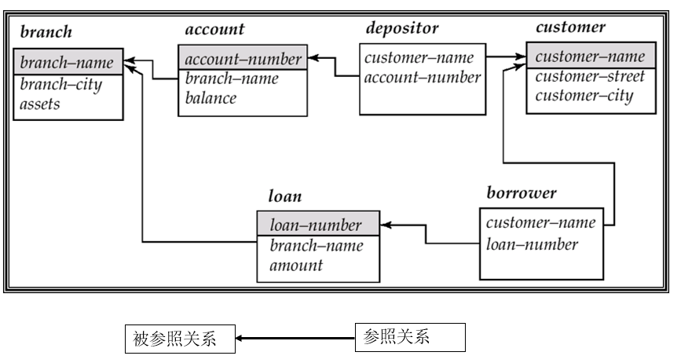

# 2 Introduction to the Relational Model

!!! tip "说明"

    此文档正在更新中……

一个 relation 就是一个二维表格

<figure markdown="span">
  { width="600" }
</figure>

## 2.1 Structure of Relational Databases

### 2.1.1 Basic Structure

笛卡尔积（Cartesian product）

一个 relation 是一组 n-tuples ($a_{1j}, a_{2j}, \cdots, a_{nj}(a_{ij} \in D_i (i \in [1, n]))$)

<figure markdown="span">
  { width="600" }
</figure>

<figure markdown="span">
  { width="600" }
</figure>

### 2.1.2 Attribute

- The set of allowed values for each attribute is called the domain of the attribute
- Attribute values are (normally) required to be atomic that is indivisible
- The special value null is a member of every domain

<figure markdown="span">
  { width="600" }
</figure>

## 2.2 Database Schema

- Database schema：描述 relation 的结构
- Database instance：给定条件下的具体数值

<figure markdown="span">
  { width="600" }
</figure>

## 2.3 Keys

1. superkey：能够唯一确定特定 tuple 的 relation
2. candidate key：最小 superkey
3. primary key：K 是 candidate key 其中被选中的那一个
      1. 通常下划线标注
4. foreign key：

<figure markdown="span">
  { width="600" }
</figure>

==primary key 和 foreign key 都是 integrated constraints==

## 2.4 Schema Diagram

<figure markdown="span">
  { width="600" }
</figure>

## 2.5 Relational Query Languages

用户从 database 中获取信息的语言