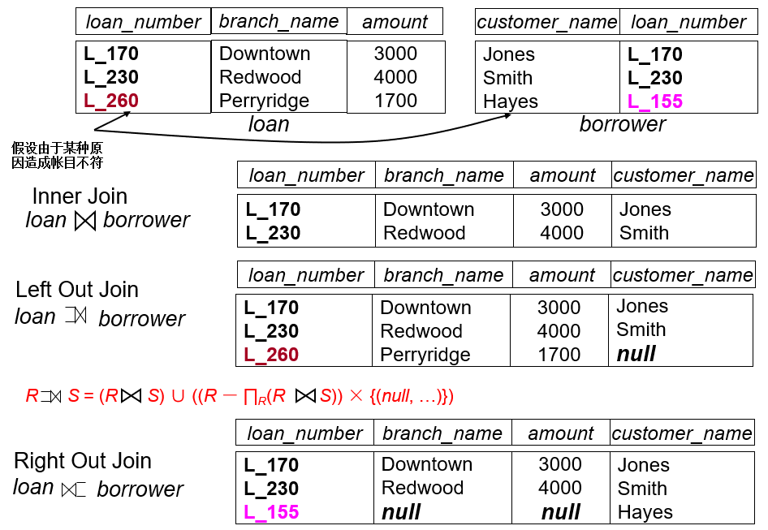
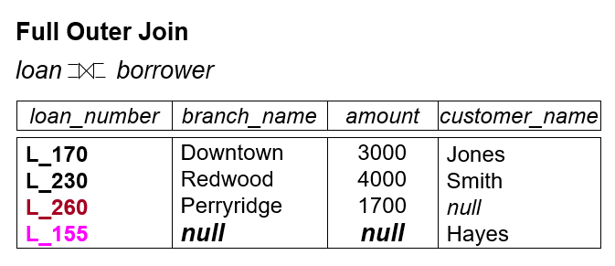
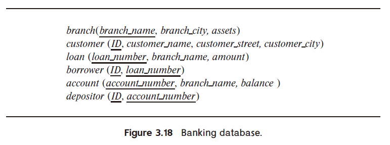
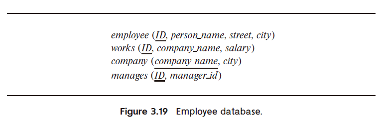
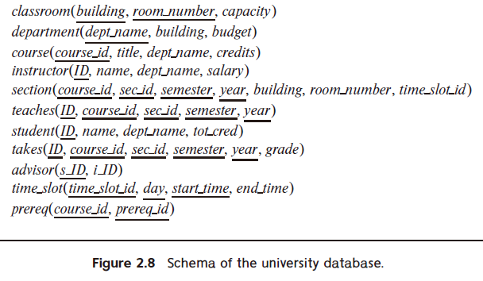

# 3 Introduction to SQL

<!-- !!! tip "说明"

    本文档正在更新中…… -->

!!! info "说明"

    本文档仅涉及部分内容，仅可用于复习重点知识

## 3.2 SQL Data Definition

### 3.2.1 Basic Types

1. `char(n)`：固定长度的字符串，长度为 n。如果字符串长度不足 n，则用空格填充
2. `varchar(n)`：可变长度的字符串，最大长度为 n。实际存储的字符串长度可以小于 n
3. `int`
4. `smallint`：存储较小范围的整数
5. `numeric(p, d)`：精确的数值类型，其中 p 是总位数，s 是小数位数
6. `float(n)`：浮点数类型，n 表示精度
7. `real`：单精度浮点数类型
8. `double precision`：双精度浮点数类型
9. `null`：用于表示缺失或未知的值。不同于空字符串或零值，null 表示数据在逻辑上不存在或不可用
10. `date`：日期类型，格式为 `YYYY-MM-DD`
11. `time`：时间类型，格式为 `HH:MI:SS`
12. `timestamp`：时间戳类型，包含日期和时间，格式为 `YYYY-MM-DD HH:MI:SS`

### 3.2.2 Basic Schema Definition

`create table`：定义一个 relation

```sql linenums="1"
-- Method 1:
create table department
    (dept_name varchar(20) not null,  -- 确保非 null
    building varchar(15),
    budget numeric(12, 2),
    primary key (dept_name),  -- 指定主键
    check (budget >= 0));  -- 确保 budget 非负
-- Method 2:
create table department2
    (dept_name varchar(20),
    primary key,  -- 指定主键时，默认确保非 null
    building varchar(15),
    budget numeric(12, 2)
    check (budget >= 0));
```

`drop table`：删除一个 relation

```sql linenums="1"
drop table department2;
```

`alter table`：增加、删除或修改 attributes

```sql linenums="1"
alter table r add A D;
alter table loan add loan_date date;  -- 增加一个数据类型为 date 的新列 loan_date

alter table r drop A;

alter table department modify (dept_name varchar(30), budget not null);
```

`create index`：定义索引

```sql linenums="1"
create index b_index on branch(branch_name);
create index cust_strt_city_index on customer(customer_city, customer_street);

-- 唯一索引确保索引列中的所有值都是唯一的，即不允许重复值
create unique index uni_acnt_index on account (account_number);

drop index b_index; 
```

## 3.3 Basic Structure of SQL QUeries

### 3.3.1 Select

```sql linenums="1"
select branch_name, balance
from account
where balance <= 500;
```

!!! tip "大小写"

    SQL 不区分大小写（case insensitive）

```sql linenums="1"
select distinct branch_name  -- 会去除掉重复的值
from account;

select all branch_name  -- all 是 select 的默认方式
from loan;
```

<figure markdown="span">
  { width="600" }
</figure>

```sql linenums="1"
select * form loan;  -- * 表示全部

select loan_number, branch_name, amount * 100  -- 可包含运算符
from loan;
```

### 3.3.2 Where

```sql linenums="1"
select loan_number
from loan
where branch_name = 'Perryridge' and amount > 1200;

select loan_number  
from loan 
where amount between 90000 and 100000;
```

### 3.3.3 From

**Example**: Find the customer name, loan number and loan amount of all customers having a loan at the Perryridge branch

```sql linenums="1"
select customer_name, borrower.loan_number, amount
from borrower, loan
where borrower.loan_number = loan.loan_number and branch_name = 'Perryridge';
```

## 3.4 Additional Basic Operations

### 3.4.1 Rename

```sql linenums="1"
old_name as new_name;

select customer_name, borrower.loan_number as loan_id, loan.amount
from borrower, loan
where borrower.loan_number = loan.loan_number;

-- = 也可以
select customer_name, loan_id = borrower.loan_number, loan.amount
from borrower, loan
where borrower.loan_number = loan.loan_number;

select customer_name, B.loan_number, L.amount
from borrower as B, loan as L
where B.loan_number = L.loan_number;
```

### 3.4.2 String

通配符

- `%`：表示零个或多个字符。它可以匹配任意长度的字符串，包括空字符串（相当于 `*`）
- `_`：只能匹配一个字符（相当于 `?`）
- `||`：连接字符

```sql linenums="1"
select customer_name
from customer
where customer_name like '%泽%'

like 'Main\%'  -- \ 转义字符，查询 Main%

select '客户名=' || customer_name
from customer;
```

`lower()` 和 `upper()`：大小写转换函数

### 3.4.3 Order by

**Example**：List in alphabetic order the names of all customers having a loan in Perryridge branch

```sql linenums="1"
select distinct customer_name
from borrower A, loan B
where A.loan_number = B.loan_number and
    branch_name = 'Perryridge'
order by customer_name

-- asc 升序，desc 降序
-- 默认 asc
order by customer_city asc, customer_street desc, customer_name 
```

## 3.5 Set Operations

**Example 1**：Find all customers who have a loan or an account or both

```sql linenums="1"
(select customer_name from depositor)
union
(select customer_name from borrower)
```

**Example 2**：Find all customers who have both a loan and an account

```sql linenums="1"
(select customer_name from depositor)
intersect
(select customer_name from borrower)
```

**Example 3**：Find all customers who have an account but no loan

```sql linenums="1"
(select customer_name from depositor)
except
(select customer_name from borrower)
```

## 3.6 Null Values

- 包含 null 的算数运算结果均为 null
- 包含 null 的比较结果均为 unknown
- 逻辑运算
      - or
          - unknown or true = true
          - unknown or false = unknown
          - unknown or unknown = unknown
      - and
          - unknown and true = unknown
          - unknown and false = false
          - unknown and unknown = unknown
      - not
          - not unknown = unknown

## 3.7 Aggregate Functions

**Example 1**：Find the average account balance at the Perryridge branch

```sql linenums="1"
select avg(balance) avg_bal
from account
where branch_name = 'Perryridge'
```

**Example 2**：Find the average account balance for each branch

```sql linenums="1"
select branch_name, avg(balance) avg_bal
from account
group by branch_name
```

**Example 3**：Find the number of depositors for each branch

```sql linenums="1"
select branch_name, count(customer_name) tot_num
from depositor, account
where depositor.account_number = account.account_number
group by branch_name

select branch_name, count(distinct customer_name) tot_num
from depositor D, account A
where D.account_number = A.account_number
group by branch_name
```

<figure markdown="span">
  { width="600" }
</figure>

**Example 4**：Find the names of all branches located in city Brooklyn where the average account balance is more than $1,200

```sql linenums="1"
select A.branch_name, avg(balance)
from account A, branch B
where A.branch_name = B.branch_name and branch_city = 'Brooklyn'
group by A.branch_name
having avg(balance) > 1200  -- 过滤
```

## 3.8 Nested Subqueries

**Example 1**：Find all customers who have both an account and a loan at the bank

```sql linenums="1"
select distinct customer_name
from borrower
where customer_name in (select customer_name
                        from depositor)
```

**Example 2**：Find all customers who have loans at a bank but do not have an account at the bank

```sql linenums="1"
select distinct customer_name
from borrower
where customer_name not in (select customer_name
                            from depositor)
```

**Example 3**：Find all customers who have both an account and a loan at the Perryridge branch

```sql linenums="1"
select distinct customer_name
from borrower B, loan L
where B.loan_number = L.loan_number and
    branch_name = 'Perryridge' and
    (branch_name, customer_name) in
    (select branch_name, customer_name
    from depositor D, account A
    where D.account_number = A.account_number)
```

**Example 4**：Find the account_number with the maximum balance for every branch

```sql linenums="1"
select account_number AN, balance
from account A
where balance >= (select man(balance)
                from account B
                where A.branch_name = B.branch_name)
order by balance
```

### 3.8.1 Some

**Example**：Find all branches that have greater assets than some branch located in Brooklyn

```sql linenums="1"
select distinct branch_name
from branch
where assets > some (select assets
                    from branch
                    where branch_city = 'Brooklyn')

select distinct T.branch_name
from branch as T, branch as S
where T.assets > S.assets and S.branch_city = 'Brooklyn'
```

<figure markdown="span">
  { width="600" }
</figure>

### 3.8.2 All

<figure markdown="span">
  { width="600" }
</figure>

### 3.8.3 Exists

- `exists r` $\Leftrightarrow r \not ={\varnothing}$
- `not exists r` $\Leftrightarrow r = \varnothing$

### 3.8.4 Unique

- `unique`
- `not unique`

**Example**：Find all customers who have at most one account at the Perryridge branch

```sql linenums="1"
select customer_name
from depositor as T
where unique
    (select R.customer_name
    from account, depositor as R
    where T.customer_name = R.customer_name and
        R.account_number = account.account_number and
        account.branch_name = 'Perryridge')
```

## 3.9 View

```sql linenums="1"
-- 创建 view
create view view_name as
    select ... from ...

create view view_name (attr_1, attr_2 ...) as
    select ... from ...

-- 删除 view
drop view view_name
```

**Example**：Create a view consisting of branches and their customer names

```sql linenums="1"
-- all_customer(branch_name, customer_name)
create view all_customer as
    ((select branch_name, customer_name
    from depositor, account
    where depositor.account_number = account.account_number)
    union
    (select branch_name, customer_name
    from borrower, loan
    where borrower.loan_number = loan.loan_number))
```

## 3.10 Derived Relations

不管是否被引用，导出表（或称嵌套表）必须给出别名

**Example**：Find the average account balance of those branches where the average account balance is greater than $500

```sql linenums="1"
select branch_name, avg_bal
from (select branch_name, avg(balance)
    from account
    group by branch_name)
    as result(branch_name, avg_bal)
where avg_bal > 500
```

### 3.10.1 With

**Example**：Find all accounts with the maximum balance

```sql linenums="1"
-- 此 with 语句仅作用于下面的一个 select 语句
with max_balance(value) as
    select max(balance)
    from account
select account_number
from account, max_balance
where account.balance = max_balance.value
```

**Example**：Find all branches where the total account deposit is greater than the average of the total account deposits at all branches

```sql linenums="1"
with branch_total(branch_name, a_bra_total) as
    select branch_name, sum(balance)
    from account
    group by branch_name
with total_avg(value) as
    select avg(a_bra_total)
    from branch_total
select branch_name, a_bra_total
from branch_total A, total_avg B
where A.a_bra_total >= B.value
```

---

**Example 1**：Find the students who have enrolled more than 10 courses

```sql linenums="1"
select sno
from enrolled
group by sno
having count(cno) > 10
```

**Example 2**：Find the student names who have enrolled more than 10 courses

```sql linenums="1"
select sno, sname
from enrolled
where sno in
    (select sno
    from enrolled
    group by sno
    having count(cno) > 10)

select TT.sno, sname, c_num
from (select sno, count(cno) as c_num
    from enroll
    group by sno) as TT, student S
where TT.sno = S.sno and c_num > 10
```

## 3.11 Modification of the Database

### 3.11.1 Deletion

```sql linenums="1"
delete from account
where branch_name = 'Perryridge'
```

**Example 1**：Delete all accounts and relevant information at depositor for every branch located in Needham city

```sql linenums="1"
delete from account
where branch_name in (select branch_name
                    from branch
                    where branch_city = 'Needham')

delete from depositor
where account_number in (select account_number
                        from branch B, account A
                        where branch_city = 'Needham' and
                            B.branch_name = A.branch_name)
```

**Example 2**：Delete the record of all accounts with balances below the average at the bank

```sql linenums="1"
-- 在同一 SQL 语句内，除非外层查询的元组变量引入内层查询，否则内层查询只进行一次
delete from account
where balance < (select avg(balance)
                from account)
```

### 3.11.2 Insertion

```sql linenums="1"
insert into account
values ('A_9732', 'Perryridge', 1200)

insert into account(branch_name, balance, account_number)
values ('Perryridge', 1200, 'A_9732')
```

**Example 1**：Add a new tuple to account with balance set to null

```sql linenums="1"
insert into account
values ('A_777', 'Perryridge', null)

insert into account(account_number, branch_name)
values ('A_777', 'Perryridge')
```

**Example 2**：Provide as a gift for all loan customers of the Perryridge branch, a $200 savings account.  Let the loan number serve as the account number for the new savings account

```sql linenums="1"
insert into account
select loan_number, branch_name, 200
from loan
where branch_name = 'Perryridge'

insert into depositor
select customer_name, A.loan_number
from loan A, borrower B
where A.branch_name = 'Perryridge' and
    A.loan_number = B.loan_number
```

### 3.11.3 Update

**Example**：Increase all accounts with balances over $10,000 by 6%, all other accounts receive 5%

```sql linenums="1"
update account
set balance = balance * 1.06
where balance > 10000
update account
set balance = balance * 1.05
where balance <= 10000

update account
set balance = case
                when balance <= 10000
                then balance * 1.05
                else balance * 1.06
            end
```

对 view 进行修改，本质是对相应的 table 进行修改

## 3.12 Joined Relations

1. 连接类型
      1. inner join：只返回两个表中满足连接条件的记录
      2. left outer join：返回左表中的所有记录以及右表中满足连接条件的记录。如果右表中没有匹配的记录，则结果为 NULL
      3. right outer join：返回右表中的所有记录以及左表中满足连接条件的记录。如果左表中没有匹配的记录，则结果为 NULL
      4. full outer join：返回两个表中的所有记录。如果没有匹配项，则另一侧的结果为 NULL
2. 连接条件
      1. on：指定连接条件，明确指出如何关联两个表的数据
      2. using：当两个表共享相同名称的列时，可以使用 using 来简化连接条件
      3. natural join：自动基于两个表中所有同名列的值相等的情况进行连接，无需显式地使用 on 或 using 子句

<figure markdown="span">
  { width="600" }
</figure>

<figure markdown="span">
  { width="500" }
</figure>

**Example**：Find all customers who have either an account or a loan (but not both) at the bank

```sql linenums="1"
select customer_name
from (depositor natural full outer join borrower)
where account_name is null or loan_number is null
```

## Homework

???+ question "课本 3.8"

    Consider the bank database of Figure 3.18, where the primary keys are underlined. Construct the following SQL queries for this relational database.

    <figure markdown="span">
      { width="600" }
    </figure>

    a. Find the ID of each customer of the bank who has an account but not a loan.<br/>
    b. Find the ID of each customer who lives on the same street and in the same city as customer '12345'.<br/>
    c. Find the name of each branch that has at least one customer who has an account in the bank and who lives in “Harrison”.

    ??? success "答案"

        a.

        ```sql linenums="1"
        (select distinct ID
        from depositor) except
        (select distinct ID
        from borrower)

        select distinct d.ID
        from depositor d
        where d.ID not in (
            select b.ID
            from borrower b
        )
        ```

        ---

        b.

        ```sql linenums="1"
        select distinct ID
        from customer
        where (customer_street, customer_city) =
                (select customer_street, customer_city
                from customer
                where ID = '12345')

        select distinct ID
        from customer
        where customer_street = 
            (select customer_street
            from customer
            where ID = '12345') and
            customer_city = 
            (select customer_city
            from customer
            where ID = '12345')
        ```

        ---

        c.

        ```sql linenums="1"
        select distinct a.branch_name
        from account a
            join depositor d
                on a.account_number = d.account_number
            join customer c 
                on c.ID = d.ID
        where c.customer_city = 'Harrison'
        ```

???+ question "课本 3.9"

    Consider the relational database of Figure 3.19, where the primary keys are underlined. Give an expression in SQL for each of the following queries.

    <figure markdown="span">
      { width="600" }
    </figure>

    a. Find the ID, name, and city of residence of each employee who works for “First Bank Corporation”.<br/>
    b. Find the ID, name, and city of residence of each employee who works for “First Bank Corporation” and earns more than $10000.<br/>
    c. Find the ID of each employee who does not work for “First Bank Corporation”.<br/>
    d. Find the ID of each employee who earns more than every employee of “Small Bank Corporation”.<br/>
    e. Assume that companies may be located in several cities. Find the name of each company that is located in every city in which “Small Bank Corporation” is located.<br/>
    f. Find the name of the company that has the most employees (or companies, in the case where there is a tie for the most).<br/>
    g. Find the name of each company whose employees earn a higher salary, on average, than the average salary at “First Bank Corporation”.

    ??? success "答案"

        a.

        ```sql linenums="1"
        select e.ID, e.person_name, e.city
        from employee e
            join works w on e.ID = w.ID
        where w.company_name = 'First Bank Corporation'
        ```

        ---

        b.

        ```sql linenums="1"
        select e.ID, e.person_name, e.city
        from employee e
            join works w on e.ID = w.ID
        where w.company_name = 'First Bank Corporation' and
            w.salary > 10000
        ```

        ---

        c.

        ```sql linenums="1"
        select ID
        from works
        where company_name != 'First Bank Corporation'
        ```

        ---

        d.

        ```sql linenums="1"
        select w1.ID
        from works w1
        where w1.salary > all
                        (select w2.salary
                        from works w2
                        where w2.company_name = 'Small Bank Corporation')
        ```

        ---

        e.

        ```sql linenums="1"
        with sbc_cities as 
            (select city
            from company
            where company_name = 'Small Bank Corporation')
        with company_in_sbc_cities as
            (select c.company_name, count(distinct c.city) city_count
            from company c
                join sbc_cities s on c.city = s.city
            group by c.company_name)
        select company_name
        from company_in_sbc_cities
        where city_count = 
                        (select count(*)
                        from sbc_cities)
        ```

        ---

        f.

        ```sql linenums="1"
        with employee_count as
            (select company_number, count(*) employee_num
            from works
            group by company_name)
        select e1.company_name
        from employee_count e1
        where e1.employee_num >= all
                    (select e2.employee_num
                    from employee_count e2)
        ```

        ---

        g.

        ```sql linenums="1"
        with avg_salary as
            (select company_name, avg(w.salary) avg_sal
            from works
            group by company_name)
        select a1.company_name
        from avg_salary a1
        where a1.avg_sal > all
                        (select a2.avg_sal
                        from avg_salary a2
                        where a2.company_name = 'First Bank Corporation')
        ```

???+ question "课本 3.10"

    Consider the relational database of Figure 3.19. Give an expression in SQL for each of the following:

    <figure markdown="span">
      { width="600" }
    </figure>

    a. Modify the database so that the employee whose ID is '12345' now lives in “Newtown”.<br/>
    b. Give each manager of “First Bank Corporation” a 10 percent raise unless the salary becomes greater than $100000; in such cases, give only a 3 percent raise.

    ??? success "答案"

        a.

        ```sql linenums="1"
        update employee
        set city = 'Newtown'
        where ID = '12345'
        ```

        ---

        b.

        ```sql linenums="1"
        update works w
            join manages m on m.ID = w.ID
            join company c on c.company_name = w.company_name
        set w.salary = case
                        when w.salary * 1.1 <= 100000
                        then w.salary * 1.1
                        else w,salary * 1.03
                    end
        where c.company_name = 'First Bank Corporation'
        ```

???+ question "课本 3.11"

    Write the following queries in SQL, using the university schema.

    <figure markdown="span">
      { width="600" }
    </figure>

    a. Find the ID and name of each student who has taken at least one Comp. Sci. course; make sure there are no duplicate names in the result.<br/>
    b. Find the ID and name of each student who has not taken any course offered before 2017.<br/>
    c. For each department, find the maximum salary of instructors in that department. You may assume that every department has at least one instructor.<br/>
    d. Find the lowest, across all departments, of the per-department maximum salary computed by the preceding query.

    ??? success "答案"

        a.

        ```sql linenums="1"
        select distinct s.ID, s.name
        from student s
            join takes t on s.ID = t.ID
            join course c on t.course_id = c.course_id
        where c.dept_name = 'Comp. Sci.'
        ```

        ---

        b.

        ```sql linenums="1"
        select s.ID, s.name
        from student s
        where not exists 
            (select 1
            from takes t
                join section sec on t.course_id = sec.course_id and 
                    t.sec_id = sec.sec_id and 
                    t.semester = sec.semester and 
                    t.year = sec.year
            where t.ID = s.ID and 
                sec.year < 2017)
        ```

        ---

        c.

        ```sql linenums="1"
        select dept_name, max(salary) max_salary
        from instruct
        group by dept_name
        ```

        ---

        d.

        ```sql linenums="1"
        select min(max_salary) lowest_max_salary
        from (
            select dept_name, max(salary) max_salary
            from instruct
            group by dept_name
        ) as dept_max_salaries
        ```

???+ question "课本 3.15"

    Consider the bank database of Figure 3.18, where the primary keys are underlined. Construct the following SQL queries for this relational database.

    <figure markdown="span">
      { width="600" }
    </figure>

    a. Find each customer who has an account at every branch located in “Brooklyn”.<br/>
    b. Find the total sum of all loan amounts in the bank.<br/>
    c. Find the names of all branches that have assets greater than those of at least one branch located in “Brooklyn”.

    ??? success "答案"

        a.

        ```sql linenums="1"
        select d.ID, c.customer_name
        from depositor d
            join account a on a.account_number = d.account_number
            join branch b on b.branch_name = a.branch_name
            join customer c on c.ID = d.ID
        where b.branch_city = 'Brooklyn'
        group by d.ID, c.customer_name
        having count(distinct a.branch_name) = (
            select count(*)
            from branch
            where branch_city = 'Brooklyn'
        )
        ```

        ---

        b.

        ```sql linenums="1"
        select sum(amount) total_loan_amount
        from loan
        ```

        ---

        c.

        ```sql linenums="1"
        select distinct b1.branch_name
        from branch b1
        where b1.assets > some (
            select b2.assets
            from branch b2
            where b2.branch_city = 'Brooklyn'
        )
        ```