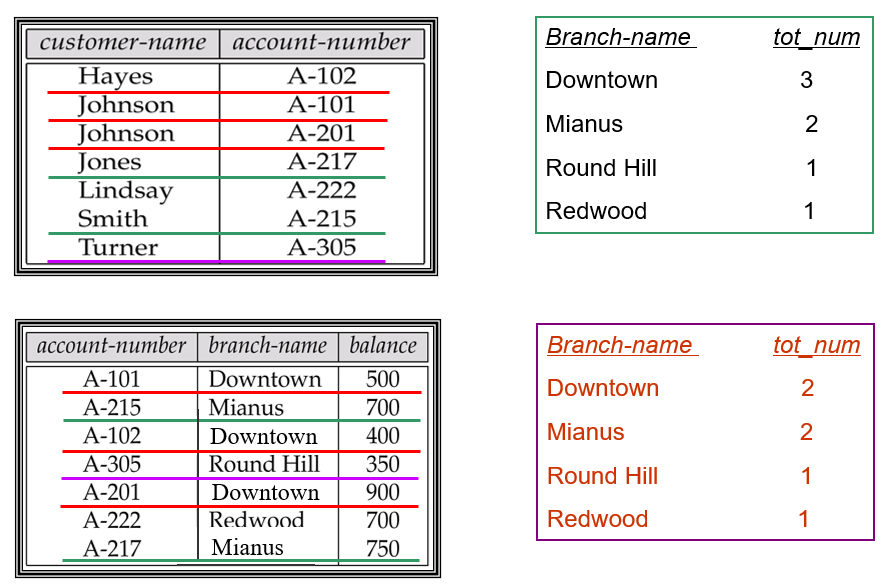
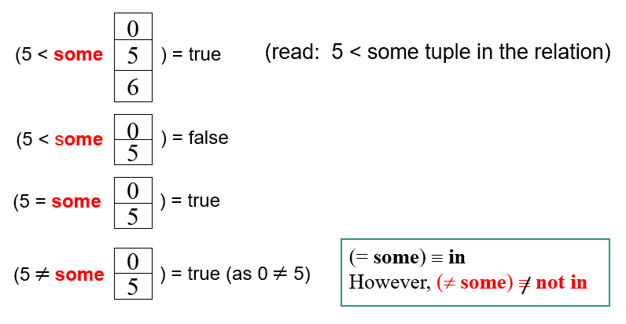
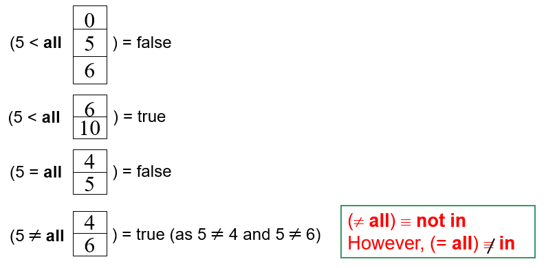

# 3 Introduction to SQL

!!! tip "说明"

    本文档正在更新中……

!!! info "说明"

    本文档只涉及部分知识点，仅可用来复习重点知识

## 3.2 SQL Data Definition

### 3.2.1 Basic Types

1. `char(n)`：固定长度的字符串，长度为 n。如果字符串长度不足 n，则用空格填充
2. `varchar(n)`：可变长度的字符串，最大长度为 n。实际存储的字符串长度可以小于 n
3. `int`
4. `smallint`：存储较小范围的整数
5. `numeric(p, d)`：精确的数值类型，其中 p 是总位数，s 是小数位数
6. `float(n)`：浮点数类型，n 表示精度
7. `real`：单精度浮点数类型
8. `double precision`：双精度浮点数类型
9. `null`：用于表示缺失或未知的值。不同于空字符串或零值，null 表示数据在逻辑上不存在或不可用
10. `date`：日期类型，格式为 `YYYY-MM-DD`
11. `time`：时间类型，格式为 `HH:MI:SS`
12. `timestamp`：时间戳类型，包含日期和时间，格式为 `YYYY-MM-DD HH:MI:SS`

### 3.2.2 Basic Schema Definition

`create table`：定义一个 relation

```sql linenums="1"
-- Method 1:
create table department
    (dept_name varchar(20) not null,  -- 确保非 null
    building varchar(15),
    budget numeric(12, 2),
    primary key (dept_name),  -- 指定主键
    check (budget >= 0));  -- 确保 budget 非负
-- Method 2:
create table department2
    (dept_name varchar(20),
    primary key,  -- 指定主键时，默认确保非 null
    building varchar(15),
    budget numeric(12, 2)
    check (budget >= 0));
```

`drop table`：删除一个 relation

```sql linenums="1"
drop table department2;
```

`alter table`：增加、删除或修改 attributes

```sql linenums="1"
alter table r add A D;
alter table loan add loan_date date;  -- 增加一个数据类型为 date 的新列 loan_date

alter table r drop A;

alter table department modify (dept_name varchar(30), budget not null);
```

`create index`：定义索引

```sql linenums="1"
create index b_index on branch(branch_name);
create index cust_strt_city_index on customer(customer_city, customer_street);

-- 唯一索引确保索引列中的所有值都是唯一的，即不允许重复值
create unique index uni_acnt_index on account (account_number);

drop index b_index; 
```

## 3.3 Basic Structure of SQL QUeries

### 3.3.1 Select

```sql linenums="1"
select branch_name, balance
from account
where balance <= 500;
```

!!! tip "大小写"

    SQL 不区分大小写（case insensitive）

```sql linenums="1"
select distinct branch_name  -- 会去除掉重复的值
from account;

select all branch_name  -- all 是 select 的默认方式
from loan;
```

<figure markdown="span">
  { width="600" }
</figure>

```sql linenums="1"
select * form loan;  -- * 表示全部

select loan_number, branch_name, amount * 100  -- 可包含运算符
from loan;
```

### 3.3.2 Where

```sql linenums="1"
select loan_number
from loan
where branch_name = 'Perryridge' and amount > 1200;

select loan_number  
from loan 
where amount between 90000 and 100000;
```

### 3.3.3 From

**Example**: Find the customer name, loan number and loan amount of all customers having a loan at the Perryridge branch

```sql linenums="1"
select customer_name, borrower.loan_number, amount
from borrower, loan
where borrower.loan_number = loan.loan_number and branch_name = 'Perryridge';
```

## 3.4 Additional Basic Operations

### 3.4.1 Rename

```sql linenums="1"
old_name as new_name;

select customer_name, borrower.loan_number as loan_id, loan.amount
from borrower, loan
where borrower.loan_number = loan.loan_number;

-- = 也可以
select customer_name, loan_id = borrower.loan_number, loan.amount
from borrower, loan
where borrower.loan_number = loan.loan_number;

select customer_name, B.loan_number, L.amount
from borrower as B, loan as L
where B.loan_number = L.loan_number;
```

### 3.4.2 String

通配符

- `%`：表示零个或多个字符。它可以匹配任意长度的字符串，包括空字符串（相当于 `*`）
- `_`：只能匹配一个字符（相当于 `?`）
- `||`：连接字符

```sql linenums="1"
select customer_name
from customer
where customer_name like '%泽%'

like 'Main\%'  -- \ 转义字符，查询 Main%

select '客户名=' || customer_name
from customer;
```

`lower()` 和 `upper()`：大小写转换函数

### 3.4.3 Order by

**Example**：List in alphabetic order the names of all customers having a loan in Perryridge branch

```sql linenums="1"
select distinct customer_name
from borrower A, loan B
where A.loan_number = B.loan_number and
    branch_name = 'Perryridge'
order by customer_name

-- asc 升序，desc 降序
-- 默认 asc
order by customer_city asc, customer_street desc, customer_name 
```

## 3.5 Set Operations

## 3.6 Null Values

## 3.7 Aggregate Functions

**Example 2**：Find the average account balance for each branch

```sql linenums="1"
select branch_name, avg(balance) avg_bal
from account
group by branch_name
```

**Example 3**：Find the number of depositors for each branch

```sql linenums="1"
select branch_name, count(customer_name) tot_num
from depositor, account
where depositor.account_number = account.account_number
group by branch_name

select branch_name, count(distinct customer_name) tot_num
from depositor D, account A
where D.account_number = A.account_number
group by branch_name
```

<figure markdown="span">
  { width="600" }
</figure>

**Example 4**：Find the names of all branches located in city Brooklyn where the average account balance is more than $1,200

```sql linenums="1"
select A.branch_name, avg(balance)
from account A, branch B
where A.branch_name = B.branch_name and branch_city = 'Brooklyn'
group by A.branch_name
having avg(balance) > 1200  -- 过滤
```

## 3.8 Nested Subqueries

**Example 1**：Find all customers who have both an account and a loan at the bank

```sql linenums="1"
select distinct customer_name
from borrower
where customer_name in (select customer_name
                        from depositor)
```

**Example 2**：Find all customers who have loans at a bank but do not have an account at the bank

```sql linenums="1"
select distinct customer_name
from borrower
where customer_name not in (select customer_name
                            from depositor)
```

**Example 3**：Find all customers who have both an account and a loan at the Perryridge branch

```sql linenums="1"
select distinct customer_name
from borrower B, loan L
where B.loan_number = L.loan_number and
    branch_name = 'Perryridge' and
    (branch_name, customer_name) in
    (select branch_name, customer_name
    from depositor D, account A
    where D.account_number = A.account_number)


```

**Example 4**：Find the account_number with the maximum balance for every branch

```sql linenums="1"
select account_number AN, balance
from account A
where balance >= (select man(balance)
                from account B
                where A.branch_name = B.branch_name)
order by balance
```

**Example 5**：Find all branches that have greater assets than some branch located in Brooklyn

```sql linenums="1"
select distinct branch_name
from branch
where assets > some (select assets
                    from branch
                    where branch_city = 'Brooklyn')

select distinct T.branch_name
from branch as T, branch as S
where T.assets > S.assets and S.branch_city = 'Brooklyn'
```

### 3.8.1 Some

<figure markdown="span">
  { width="600" }
</figure>

### 3.8.2 All

<figure markdown="span">
  { width="600" }
</figure>

### 3.8.3 Exists

- `exists r` $\Leftrightarrow r \not ={\varnothing}$
- `not exists r` $\Leftrightarrow r = \varnothing$

### 3.8.4 Unique

## 3.9 View

```sql linenums="1"
-- 创建 view
create view view_name as
    select ... from ...

create view view_name (attr_1, attr_2 ...) as
    select ... from ...

-- 删除 view
drop view view_name
```

**Example**：Create a view consisting of branches and their customer names

```sql linenums="1"
-- all_customer(branch_name, customer_name)
create view all_customer as
    ((select branch_name, customer_name
    from depositor, account
    where depositor.account_number = account.account_number)
    union
    (select branch_name, customer_name
    from borrower, loan
    where borrower.loan_number = loan.loan_number))
```

## 3.10 Derived Relations

**Example**：Find the average account balance of those branches where the average account balance is greater than $500

```sql linenums="1"
select branch_name, avg_bal
from (select branch_name, avg(balance)
    from account
    group by branch_name)
    as result(branch_name, avg_bal)
where avg_bal > 500
```

### 3.10.1 With

**Example**：Find all accounts with the maximum balance

```sql linenums="1"
-- 此 with 语句仅作用于下面的一个 select 语句
with max_balance(value) as
    select max(balance)
    from account
select account_number
from account, max_balance
where account.balance = max_balance.value
```

**Example**：Find all branches where the total account deposit is greater than the average of the total account deposits at all branches

```sql linenums="1"
with branch_total(branch_name, a_bra_total) as
    select branch_name, sum(balance)
    from account
    group by branch_name
with total_avg(value) as
    select avg(a_bra_total)
    from branch_total
select branch_name, a_bra_total
from branch_total A, total_avg B
where A.a_bra_total >= B.value
```

---

**Example 1**：Find the students who have enrolled more than 10 courses

```sql linenums="1"
select sno
from enrolled
group by sno
having count(cno) > 10
```

**Example 2**：Find the student names who have enrolled more than 10 courses

```sql linenums="1"
select sno, sname
from enrolled
where sno in
    (select sno
    from enrolled
    group by sno
    having count(cno) > 10)

select TT.sno, sname, c_num
from (select sno, count(cno) as c_num
    from enroll
    group by sno) as TT, student S
where TT.sno = S.sno and c_num > 10
```

## 3.11 Modification of the Database

### 3.11.1 Deletion

```sql linenums="1"
delete from account
where branch_name = 'Perryridge'
```

**Example 1**：Delete all accounts and relevant information at depositor for every branch located in Needham city

```sql linenums="1"
delete from account
where branch_name in (select branch_name
                    from branch
                    where branch_city = 'Needham')

delete from depositor
where account_number in (select account_number
                        from branch B, account A
                        where branch_city = 'Needham' and
                            B.branch_name = A.branch_name)
```

**Example 2**：Delete the record of all accounts with balances below the average at the bank

```sql linenums="1"
-- 在同一 SQL 语句内，除非外层查询的元组变量引入内层查询，否则内层查询只进行一次
delete from account
where balance < (select avg(balance)
                from account)
```

### 3.11.2 Insertion

```sql linenums="1"
insert into account
values ('A_9732', 'Perryridge', 1200)

insert into account(branch_name, balance, account_number)
values ('Perryridge', 1200, 'A_9732')
```

**Example 1**：Add a new tuple to account with balance set to null

```sql linenums="1"
insert into account
values ('A_777', 'Perryridge', null)

insert into account(account_number, branch_name)
values ('A_777', 'Perryridge')
```

**Example 2**：Provide as a gift for all loan customers of the Perryridge branch, a $200 savings account.  Let the loan number serve as the account number for the new savings account

```sql linenums="1"
insert into account
select loan_number, branch_name, 200
from loan
where branch_name = 'Perryridge'

insert into depositor
select customer_name, A.loan_number
from loan A, borrower B
where A.branch_name = 'Perryridge' and
    A.loan_number = B.loan_number
```

### 3.11.3 Update

**Example**：Increase all accounts with balances over $10,000 by 6%, all other accounts receive 5%

```sql linenums="1"
update account
set balance = balance * 1.06
where balance > 10000
update account
set balance = balance * 1.05
where balance <= 10000

update account
set balance = case
                when balance <= 10000
                then balance * 1.05
                lese balance * 1.06
            end
```

对 view 进行修改，本质是对相应的 table 进行修改