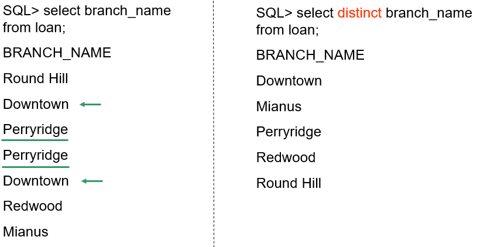

# 3 Introduction to SQL

!!! tip "说明"

    此文档正在更新中……

!!! info "说明"

    本文档只涉及部分知识点，仅可用来复习重点知识

## 3.2 SQL Data Definition

### 3.2.1 Basic Types

1. `char(n)`：固定长度的字符串，长度为 n。如果字符串长度不足 n，则用空格填充
2. `varchar(n)`：可变长度的字符串，最大长度为 n。实际存储的字符串长度可以小于 n
3. `int`
4. `smallint`：存储较小范围的整数
5. `numeric(p, d)`：精确的数值类型，其中 p 是总位数，s 是小数位数
6. `float(n)`：浮点数类型，n 表示精度
7. `real`：单精度浮点数类型
8. `double precision`：双精度浮点数类型
9. `null`：用于表示缺失或未知的值。不同于空字符串或零值，null 表示数据在逻辑上不存在或不可用
10. `date`：日期类型，格式为 `YYYY-MM-DD`
11. `time`：时间类型，格式为 `HH:MI:SS`
12. `timestamp`：时间戳类型，包含日期和时间，格式为 `YYYY-MM-DD HH:MI:SS`

### 3.2.2 Basic Schema Definition

`create table`：定义一个 relation

```sql linenums="1"
-- Method 1:
create table department
    (dept_name varchar(20) not null,  -- 确保非 null
    building varchar(15),
    budget numeric(12, 2),
    primary key (dept_name),  -- 指定主键
    check (budget >= 0));  -- 确保 budget 非负
-- Method 2:
create table department2
    (dept_name varchar(20),
    primary key,  -- 指定主键时，默认确保非 null
    building varchar(15),
    budget numeric(12, 2)
    check (budget >= 0));
```

`drop table`：删除一个 relation

```sql linenums="1"
drop table department2;
```

`alter table`：增加、删除或修改 attributes

```sql linenums="1"
alter table r add A D;
alter table loan add loan_date date;  -- 增加一个数据类型为 date 的新列 loan_date

alter table r drop A;

alter table department modify (dept_name varchar(30), budget not null);
```

`create index`：定义索引

```sql linenums="1"
create index b_index on branch(branch_name);
create index cust_strt_city_index on customer(customer_city, customer_street);

-- 唯一索引确保索引列中的所有值都是唯一的，即不允许重复值
create unique index uni_acnt_index on account (account_number);

drop index b_index; 
```

## 3.3 Basic Structure of SQL QUeries

### 3.3.1 Select

```sql linenums="1"
select branch_name, balance
from account
where balance <= 500;
```

!!! tip "大小写"

    SQL 不区分大小写（case insensitive）

```sql linenums="1"
select distinct branch_name  -- 会去除掉重复的值
from account;

select all branch_name  -- all 是 select 的默认方式
from loan;
```

<figure markdown="span">
  { width="600" }
</figure>

```sql linenums="1"
select * form loan;  -- * 表示全部

select loan_number, branch_name, amount * 100  -- 可包含运算符
from loan;
```

### 3.3.2 Where

```sql linenums="1"
select loan_number
from loan
where branch_name = 'Perryridge' and amount > 1200;

select loan_number  
from loan 
where amount between 90000 and 100000;
```

### 3.3.3 From

**Example**: Find the customer name, loan number and loan amount of all customers having a loan at the Perryridge branch

```sql linenums="1"
select customer_name, borrower.loan_number, amount
from borrower, loan
where borrower.loan_number = loan.loan_number and branch_name = 'Perryridge';
```

### 3.3.4 Rename

```sql linenums="1"
old_name as new_name;

select customer_name, borrower.loan_number as loan_id, loan.amount
from borrower, loan
where borrower.loan_number = loan.loan_number;

-- = 也可以
select customer_name, loan_id = borrower.loan_number, loan.amount
from borrower, loan
where borrower.loan_number = loan.loan_number;

select customer_name, B.loan_number, L.amount
from borrower as B, loan as L
where B.loan_number = L.loan_number;
```

### 3.3.5 String Operations

通配符

`%`：表示零个或多个字符。它可以匹配任意长度的字符串，包括空字符串（相当于 `*`）
`_`：只能匹配一个字符（相当于 `?`）
`||`：连接字符

```sql linenums="1"
select customer_name
from customer
where customer_name like '%泽%'

like 'Main\%'  -- \ 转义字符，查询 Main%

select '客户名=' || customer_name
from customer;
```

`lower()` 和 `upper()`：大小写转换函数