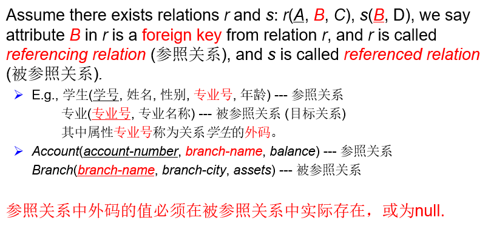
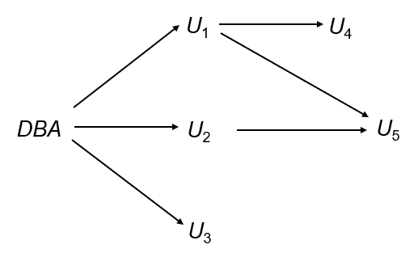
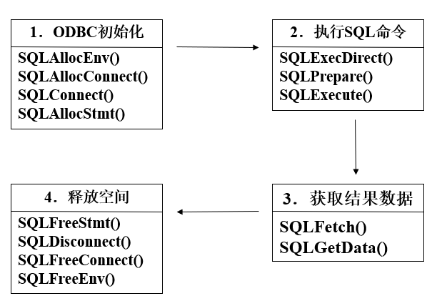
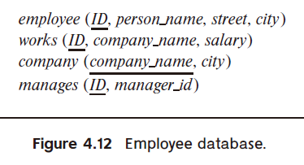
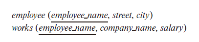

# 4 Advanced SQL

<!-- !!! tip "说明"

    本文档正在更新中…… -->

!!! info "说明"

    本文档仅涉及部分内容，仅可用于复习重点知识

## 1 SQL Data Types and Schemas

### 1.1 Large-Object Types

- blob（Binary Large Object）：即二进制大对象。它用于存储二进制数据，比如图像、音频文件、视频文件或其他类型的多媒体内容。blob 字段可以存储非常大的数据量，具体大小限制取决于数据库系统的实现
- clob（Character Large Object）：即字符大对象。它用于存储大量的文本数据。clob 适用于存储那些可能超出 VARCHAR 或 TEXT 类型长度限制的大型文本数据，如完整的书籍、长篇文章等。与 blob 类似，clob 的实际最大容量也依赖于具体的数据库系统

```sql linenums="1"
book_review clob(10KB)
image blob(10MB)
movie blob(2GB)
```

### 1.2 User-Defined Types

1. distinct types
2. structured data types

使用 `create type` 定义新的数据类型

```sql linenums="1"
create type Dollars as numeric(12, 2);
create type Pounds as numeric(12, 2);

create table department
(
    dept_name varchar(20),
    building varchar(15),
    budget Dollars
);

-- 删除自定义的数据类型
drop type Dollars;
```

尽管 Dollars 和 Pounds 本质上是相同的类型，但是不能将一个 Dollars 类型的值赋给一个 Pounds 类型的变量

使用 `create domain` 创建基于已有基本类型的新的域。一个域本质上是一个有附加约束的基本数据类型，如限制输入值范围或默认值等。使用 `create domain` 可以增加额外的数据验证规则，有助于确保数据的一致性和有效性

!!! tip "domain 和 type 的区别"

    1. 域可以有约束，例如 not null，并且可以为该域类型的变量定义默认值，而用户自定义类型不能在其上指定约束或默认值。用户自定义类型不仅用于指定属性类型，还可以在 SQL 的过程扩展中使用，在这些扩展中可能无法强制执行约束
    2. 域不是强类型的。因此，只要底层类型兼容，一个域类型的值就可以赋给另一个域类型的值

```sql linenums="1"
create domain DDollars as numeric(12, 2) not null;

-- constraint salary_value_test 是可选的
-- 用于给这个限制取个名字
create domain YearlySalary numeric(8, 2)
    constraint salary_value_test check(value >= 29000.00);

-- check 也可以限制特定的值
create domain degree_level varchar(10)
    constraint degree_level_test
        check(value in ('Bachelors', 'Masters', 'Doctorate'));
```

## 2 Transaction

事务由一系列查询和/或更新语句组成。SQL 标准规定，当执行 SQL 语句时，事务隐式开始。必须使用以下 SQL 语句之一来结束事务：

1. Commit work：提交当前事务；即，使事务执行的更新在数据库中永久生效。事务提交后，新事务会自动开始
2. Rollback work：导致当前事务回滚；即，撤销事务中所有 SQL 语句执行的更新。因此，数据库状态将恢复到事务执行第一条语句之前的状态

`begin atomic ... end`：SQL 标准中用于定义原子事务块的一种语法结构。它用于将一组 SQL 语句组合成一个原子操作，确保这些语句要么全部成功执行，要么全部不执行（即回滚）

## 3 Integrity Constraints

### 3.1 Referential Integrity

**参照完整性**

1. 参照完整性：这是数据库设计中的一个重要概念，确保一个表中的外键值必须在另一个表的主键中存在。==这有助于维护数据的一致性和完整性==
2. 关系与主键：在关系数据库中，表被称为关系（relation）。每个关系有一个主键（primary key），它是唯一标识表中每一行的列或列的组合
3. 外键：外键是一个表中的列或列的组合，它引用另一个表的主键。外键的值必须与引用表中的主键值匹配，或者为 NULL（如果允许的话）
4. 子集依赖：参照完整性约束可以表示为外键列的值集必须是引用表主键列值集的子集。这意味着外键的值不能随意设置，必须引用已存在的主键值

<figure markdown="span">
  { width="600" }
</figure>

在对数据库进行修改时，检查 referential integrity：

1. Insert：在插入新元组时，必须确保外键值在引用表的主键中存在。如果不存在，插入操作将被拒绝
2. Delete：在删除元组时，必须检查是否有其他表中的元组引用该元组。如果有，可以选择拒绝删除或进行级联删除，即同时删除所有引用该元组的元组
3. Update：
      1. 如果更新涉及外键值的修改，必须确保新值在引用表的主键中存在
      2. 如果更新涉及主键值的修改，必须确保没有其他表中的元组引用该主键，或者进行级联更新，即同时更新所有引用该主键的元组

```sql linenums="1"
Create table account (
    account_number char(10), 
    branch_n	char(15), 
    balance	integer, 
    primary key (account_number), 
    -- 外键名和被引用表的主键名可以不相同
    foreign key (branch_n) references branch(branch_name)
); 

Create table account (
    -- 简写
    account_number char(10) references branch,  
    branch_name	char(15), 
    balance	integer, 
    primary key (account_number),
); 
```

#### 3.1.1 Cascade

**级联**

```sql linenums="1"
create table course (
    ...
    foreign key(dept_name) references department
        on delete cascade
        on update cascade
    ...
);
```

1. Cascade on delete（级联删除）：当在 department 表中删除一个元组时，如果 course 表中有元组的外键引用了被删除的 department 元组，这些 course 表中的元组也会被自动删除
2. cascade on update（级联更新）：当在 department 表中更新一个元组的主键时，如果 course 表中有元组的外键引用了被更新的 department 元组，这些 course 表中的外键值也会被自动更新为新的主键值

注意事项：

1. 外键依赖链：
      1. 当多个表通过外键相互引用时，可能会形成一个依赖链。例如，表 A 引用表 B，表 B 引用表 C，依此类推
      2. 如果在每个外键约束中都指定了 on delete cascade 或 on update cascade，那么在链的一端进行的删除或更新操作会自动传播到整个链
2. 级联操作的传播：
      - 例如，如果在表 C 中删除一个元组，且表 B 和表 A 都通过外键引用表 C 并指定了 on delete cascade，那么删除操作会依次传播到表 B 和表 A，删除所有相关的元组
3. 约束冲突与事务回滚：
      1. 如果级联操作导致无法解决的约束冲突（例如，某个表的外键约束不允许删除或更新操作），系统将中止整个事务
      2. 这意味着事务中的所有操作（包括级联操作）都会被撤销，数据库将回滚到事务开始之前的状态，以确保数据的一致性和完整性

级联操作的替代方案：

1. `on delete set null`：当删除被引用表中的元组时，引用表中的外键值将被设置为 NULL。这意味着引用表中的相关元组将不再指向被删除的元组
2. `on delete set default`：当删除被引用表中的元组时，引用表中的外键值将被设置为默认值。这需要为外键列定义一个默认值

外键属性中的空值会使参照完整性的语义变得复杂。如果外键的任何部分为 NULL，数据库系统会认为该元组满足外键约束，即使它没有实际引用任何有效的元组。为了防止这种情况，通常建议在外键列上使用 NOT NULL 约束，以确保外键值始终指向有效的元组

---

==参照完整性仅在事务结束时检查==，而不是在事务的每个中间步骤中检查。这意味着在事务执行过程中，数据库可以暂时处于违反参照完整性的状态，只要在事务提交前这些违规被消除

原因：在某些情况下，数据库操作需要暂时违反参照完整性才能完成。例如，插入两个相互引用的元组时，第一个元组插入时可能暂时违反参照完整性，直到第二个元组插入后才满足完整性约束

事务的原子性：确保了所有操作要么全部成功，要么全部失败。如果在事务结束时参照完整性约束未被满足，整个事务将被回滚，数据库将恢复到事务开始前的状态

### 3.2 Assertions

**断言**

断言是数据库中的一种约束，用于确保数据库始终满足某些复杂的条件。这些条件可能涉及多个表或复杂的逻辑。断言通常用于表达那些无法通过简单的列级或表级约束来实现的条件

```sql linenums="1"
-- 确保所有员工的工资不为负数
CREATE ASSERTION salary_constraint
CHECK (NOT EXISTS (SELECT * FROM employee WHERE salary < 0));
```

每次可能违反断言的数据库更新操作发生时，系统都会测试断言的有效性。如果谓词为真，更新操作被允许；否则，系统会报告错误并拒绝更新。由于断言可能涉及复杂的条件和多个表，频繁的测试可能会显著增加系统的开销。因此，断言应谨慎使用，特别是在对性能要求较高的系统中

断言适用于那些需要跨多个表或复杂逻辑的约束条件。由于可能带来的性能影响，应优先考虑使用简单的列级或表级约束，只有在必要时才使用断言

**Example 1**：The sum of all loan amounts for each branch must be less than the sum of all account balances at the branch

```sql linenums="1"
-- 每个 branch 的 loan 总和都小于 account 总和
-- 相当于没有一个 branch 的 loan 总和大于 account 总和
create assertion sum_constraint check (
    -- SQL 中没有类似 for all 的语句
    not exists (
        select *
        from branch B
        where (
            select sum(amount)
            from loan
            where loan.branch_name = B.branch_name
        ) > (
            select sum(balance)
            from account
            where account.branch_name = B.branch_name
        )
    )
)
```

**Example 2**：Every loan has at least one borrower who maintains an account with a minimum balance of $1000

```sql linenums="1"
-- 没有这种情况的 loan，它没有一个 borrower 的 balance >= 1000
create assertion balance_constraint check (
    not exists (
        select *
        from loan L
        where not exists (
            select *
            from borrower B, depositor D, account A
            where L.loan_number = B.loan_number
                and B.customer_name = D.customer_name
                and D.account_number = A.account_number
                and A.balance >= 1000
        )
    )
)
```

### 3.3 Triggers

**触发器**

触发器是一种特殊的数据库对象，它在特定事件发生时自动执行。这些事件通常是对数据库的修改操作，如插入（INSERT）、更新（UPDATE）或删除（DELETE）。触发器用于在数据修改时自动执行一些操作，以维护数据的完整性、执行业务规则或记录日志等

定义一个触发器，我们必须：

1. 指定触发器何时执行。这分为导致触发器被检查的事件和触发器执行必须满足的条件
2. 指定触发器执行时要采取的操作

触发器的执行是作为数据库修改操作的副作用（side effect）发生的，这意味着它在主要操作（如插入、更新或删除）之后自动触发

**Example：** 假设银行不允许账户余额为负，而是通过以下操作处理透支：1. 将账户余额设为零。2. 创建一个贷款，金额为透支金额，并将该贷款的贷款号设置为透支账户的账号。触发器的执行条件是对 account 关系的更新导致 balance 值为负

```sql linenums="1"
create trigger overdraft_trigger
after update on account
referencing new row as nrow
for each row
when (nrow.balance < 0)
    begin atomic
        insert into borrower (
            select customer_name, account_number 
            from depositor
            where nrow.account_number = depositor.account_number
        );

        insert into loan
        values (nrow.account_number, nrow.branch_name, - nrow.balance);

        update account
        set balance = 0
        where account.account_number = nrow.account_number;
    end
```

trigger 可以与特定的属性绑定

```sql linenums="1"
create trigger overdraft_trigger
after update of balance on account
```

1. 引用旧行：`referencing old row as` 子句用于引用被更新或删除的行的旧值。这在需要比较更新前后的数据或记录历史数据时非常有用
2. 引用新行：`referencing new row as` 子句用于引用插入或更新后的新行数据。这在需要访问新插入或更新后的数据时非常有用

#### 3.3.1 statement-level trigger

**语句级触发器**

与行级触发器（for each row）不同，语句级触发器（for each statement）在整个 SQL 语句执行完毕后触发一次，而不是为每一行触发一次。这种方式适用于需要对整个操作结果进行处理的情况，而不是逐行处理

在语句级触发器中，可以使用 referencing old table 和 referencing new table 来引用临时表（过渡表），这些表包含在 SQL 语句中受影响的所有行

当 SQL 语句影响大量行时，使用语句级触发器可以显著提高效率，因为它只需要执行一次操作，而不是为每一行执行一次操作。这种方式减少了触发器的执行次数，降低了系统开销

#### 3.3.2 External World Actions

外部世界操作指的是那些与数据库系统外部环境交互的操作，例如发送电子邮件、控制硬件设备（如报警灯）或与外部系统通信（如重新订购库存物品）。这些操作通常不能直接在数据库系统中执行，因为它们涉及到外部资源或系统

触发器主要用于在数据库内部执行操作，如更新、插入或删除数据。它们不能直接执行外部世界操作。例如，触发器不能直接发送电子邮件或控制硬件设备

虽然触发器不能直接执行外部世界操作，但它们可以用于记录需要执行的操作。例如，可以在数据库中创建一个表，用于存储需要执行的外部操作（如重新订购物品或打开报警灯）。触发器可以在数据库更新时向该表中插入记录，表示需要执行的外部操作

一个外部进程可以定期扫描这个表，读取需要执行的操作，并实际执行这些外部世界操作（如发送电子邮件或控制硬件设备）。执行完操作后，外部进程可以从表中删除相应的记录，以避免重复执行

**Example：** 当仓库某个物品的容量小于阈值，记录需要订购的数据

```sql linenums="1"
create trigger reorder_trigger
after update of level on inventory
referencing old row as orow, new row as nrow
for each row
when nrow.level <= (
    select level
    from minlevel
    where minlevel.item = nrow.item    
) and orow.level > (
    select level
    from minlevel
    where minlevel.item = orow.item
)
begin
    insert into orders (
        select item, amount
        from reorder
        where reorder.item = orow.item
    )
end
```

---

何时不使用触发器：

触发器在过去用于以下任务：

1. 维护汇总数据（例如，每个部门的总工资）
2. 通过记录对特殊关系（称为变更或增量关系）的更改来复制数据库，并通过一个单独的进程将这些更改应用到副本中

现在有更好的方法来完成这些任务：

1. 现代数据库提供了内置的物化视图功能来维护汇总数据
2. 数据库提供了内置的复制支持

!!! tip "比较"

    1. 检查（Check）：用于在列级别强制执行简单的约束条件，例如确保某个列的值在特定范围内
    2. 断言（Assertion）：用于在表级别或跨表级别强制执行复杂的约束条件，例如确保某个条件在整个数据库中始终为真
    3. 触发器（Trigger）：用于在数据修改时自动执行复杂的操作，例如更新其他表或执行外部操作

## 4 Authorization

Security：

1. Database system level：认证和授权机制允许特定用户仅访问所需数据
2. Operating system level：操作系统超级用户可以对数据库执行任何操作，需要良好的操作系统级别安全性
3. Network level：必须使用加密来防止
      -  Eavesdropping（窃听）：未经授权读取消息
      -  Masquerading（伪装）：假装是授权用户或发送据称来自授权用户的消息
4. Physical level
      - 对计算机的物理访问允许入侵者破坏数据；需要传统的锁和钥匙安全措施
      - 计算机还必须受到保护，防止洪水、火灾等）
5. Human level
      - 必须对用户进行筛选，以确保授权用户不会向入侵者提供访问权限
      - 应对用户进行密码选择和保密培训

对数据库部分的授权：

1. 读取授权（Read authorization）：允许读取数据，但不允许修改数据
2. 插入授权（Insert authorization）：允许插入新数据，但不允许修改现有数据
3. 更新授权（Update authorization）：允许修改数据，但不允许删除数据
4. 删除授权（Delete authorization）：允许删除数据

对数据库模式修改的授权：

1. 索引授权（Index authorization）：允许创建和删除索引
2. 资源授权（Resources authorization）：允许创建新的关系（表）
3. 修改授权（Alteration authorization）：允许在关系中添加或修改属性（列）
4. 删除关系授权（Drop authorization）：允许删除关系（表）

### 4.1 Authorization and Views

用户可以被授予 views 权限，而 views 所使用的 relations 的权限可以不授予给用户，这在一定程度上能够保护数据库的安全

创建 view 不需要 resources authorization 因为没有新表被创建

### 4.2 Grant

#### 4.2.1 Grant Graph

被授予权限的用户可以授予其他用户相同的权限（如果允许的话）

<figure markdown="span">
  { width="600" }
</figure>

授权图中的所有边必须是源自数据库管理员（DBA）的某条路径的一部分

如果 DBA revoke U1 的授权：

- 必须撤销对 U4 的授权
- 不能撤销对 U5 的授权，因为 U5 有另一条通过 U2 从 DBA 获得的授权路径

必须防止没有从 DBA 出发的路径的授权循环

#### 4.2.2 SQL

```sql linenums="1"
grant <privilege list>
on <relation name or view name>
to <user/role list>;
```

`<user/role list>`：

1. 具体的某个 user
2. public（所有有效的用户）
3. role

SQL 中的权限：

1. select：允许对关系（表）进行读取访问，或使用视图进行查询的能力
2. insert
3. update
4. delete
5. references（引用）：在创建关系时声明外键的能力
6. all privileges：用于表示所有允许的权限的简写形式
7. all：通常指代所有权限

```sql linenums="1"
-- 向用户 1，2 授予对 branch 的选择和插入权限
grant select, insert
on branch
to user1, user2
```

权限传递：`with grant option`

```sql linenums="1"
grant select, insert
on branch
to user
with grant option;  -- user 可以授予其他用户该权限
```

#### 4.2.3 Roles

角色允许为一类用户指定共同的权限，只需创建相应的“角色”一次

权限可以授予或从角色中撤销，就像用户一样；角色可以分配给用户，甚至可以分配给其他角色

```sql linenums="1"
Create role teller;
Create role manager;
-- 授予角色权限
Grant select on branch to teller;
Grant update (balance) on account to teller;
Grant all privileges on account to manager;

-- 将 teller 角色授予 manager 角色
-- 意味着 manager 也拥有对 branch 的 select 权限
Grant teller to manager;
-- 将 teller 角色授予这两个用户
Grant teller to Alice, bob;
-- 将 manager 角色授予用户
Grant manager to avi;
```

### 4.3 Revoke

```sql linenums="1"
revoke <privilege list>
on <relation name or view name>
from <user/role list>
```

```sql linenums="1"
revoke select
on branch
from user1 cascade;  -- 撤销的级联

revoke select
on branch
from user1 restrict;
-- 使用 restrict 防止级联撤销
-- 如果撤销操作会导致级联，命令将失败
-- 从而保护其他用户的权限
```

1. 撤销所有权限：使用 ALL 可以一次性撤销用户或角色持有的所有权限
2. 撤销 PUBLIC 权限：PUBLIC 是一个特殊的角色，代表所有用户。如果撤销 PUBLIC 的权限，所有用户都会失去该权限，除非他们被单独授予了该权限
3. 多次授予的权限：如果用户通过不同的授予者获得了相同的权限，撤销一个授予者的权限可能不会影响用户保留该权限，因为他们可能还通过其他途径拥有该权限
4. 依赖权限的撤销：当撤销某个权限时，所有依赖于该权限的其他权限也会被撤销。这确保了权限撤销的彻底性和一致性

### 4.4 Limitations

1. SQL不支持元组级别的授权：
      - 例如，无法通过授权限制学生只能查看（存储）他们自己成绩的元组
2. 随着通过 Web 访问数据库的增长，数据库访问主要来自应用服务器
      - 最终用户没有数据库用户 ID，他们都被映射到同一个数据库用户 ID
3. 应用程序（如 Web 应用程序）的所有最终用户可能被映射到单个数据库用户

在上述情况下，授权任务由应用程序承担，而 SQL 不提供支持

1. 优点：细粒度的授权（例如对单个元组的授权）可以通过应用程序实现
2. 缺点
      1. 授权必须在应用程序代码中完成，并且可能分散在整个应用程序中
      2. 检查授权漏洞变得非常困难，因为这需要阅读大量的应用程序代码

### 4.5 Audit Trails

**审计跟踪**

审计跟踪是记录数据库中所有更改（插入/删除/更新）的日志，包括执行更改的用户以及更改的时间等信息。可以使用触发器来实现，但许多数据库系统提供直接支持

## 5 Embedded SQL

SQL 在计算和资源管理等方面可能存在功能上的不足。SQL 标准定义了 SQL 在多种编程语言中的嵌入方式，如 Pascal、PL/I、Fortran、C 和 Cobol 等。嵌入 SQL 查询的语言被称为宿主语言（Host language），宿主语言中允许的 SQL 结构称为嵌入式 SQL

使用 EXEC SQL 语句来标识嵌入式 SQL 请求，以便预处理器处理

`EXEC SQL <embedded SQL statement> END_EXEC`

### 5.1 Query

**单行查询**

```c linenums="1"
exec sql begin declare section;
char V_an[20], bn[20];
float bal;
exec sql end declare section;

scanf("%s", V_an);  // 读入账号，然后据此在下面的语句获得 bn, bal 的值

exec sql select branch_name, balance 
into :bn, :bal  // :bn, :bal 表示宿主变量，在嵌入式 SQL 语句中需要加冒号 : 
from account
where account_number = :V_an;
end_exec

printf("%s, %s, %f", V_an, bn, bal);
```

**多行查询**

```c linenums="1"
exec sql
// 定义一个游标 c，相当于 C 语言的指针，这里可以理解为指向一个文件的指针
declare c cursor for
select customer_name, customer_city
from depositor D, customer B, account A
where D.customer_name = B.customer_name
    and D.account_number = A.account_number
    and A.balance > :v_amount
end_exec

// 打开游标，可以理解为打开文件
exec sql open c end_exec

// 取数据
exec sql fetch c into :cn, :city end_exec

// 关闭游标，可以理解为关闭文件
exec sql close c end_exec
```

> 不同语言的语法均有所差异，以上代码可当作伪代码来看

### 5.2 Update

**单行修改**

```c linenums="1"
exec sql begin declare section;
char an[20];
float bal;
exec sql end declare section;

scanf("%s, %d", an, &bal);  // 读入账号及要增加的存款额

exec sql update account 
set balance = balance + :bal
where account_number = :an;
```

**多行修改**

```c linenums="1"
exec sel begin declare section;
char an[20];
float bal;
exec sel end declare section;
exec sql declare csr cursor for
select *
from account
where branch_name = 'Perryridge'
for update of balance;

exec sql open csr;

while (1) {
    exec sql fetch csr into :an, :bn, :bal;
    if (sqlca.sqlcode <> success) {  // <> 是不等号
        break;
    }
    exec sql update account
    set balance = balance + 100
    where current of csr;
}

exec sql close csr;
```

## 6 Dynamic SQL

动态 SQL 允许程序在运行时构造并提交 SQL 查询

```c linenums="1"
char *sqlprog = "update account
    set balance = balance * 1.05
    where account_number = ?";  // ? 是一个占位符，表示在执行 SQL 程序时通过 USING 子句提供的值

EXEC SQL PREPARE dynprog FROM :sqlprog;  
char v_account [10] = "A_101";  

EXEC SQL EXECUTE dynprog USING :v_account;
```

## 7 ODBC and JDBC

### 7.1 ODBC

Open Database Connectivity（ODBC，开放数据库互连）

1. 开放数据库互连（ODBC）是一个标准，允许应用程序与数据库服务器进行通信
2. 通过应用程序接口（API）实现以下功能：
      1. 打开与数据库的连接
      2. 发送查询和更新
      3. 获取结果

!!! tip "嵌入式 SQL 与 ODBC 的比较"

    1. 嵌入式 SQL：预编译器是特定于数据库管理系统（DBMS）的
    2. ODBC：通过 API 为应用程序程序员提供了一种标准化的数据库连接方式
          1. 不特定于 DBMS
          2. 不需要预编译
    
    ODBC 提供了一种通用的、标准化的方法来连接和操作数据库，使得应用程序可以在不同的 DBMS 之间移植和互操作。与嵌入式 SQL 相比，ODBC 更加灵活和通用，因为它不依赖于特定的 DBMS，也不需要预编译步骤。这使得 ODBC 成为跨平台和跨数据库应用程序开发的理想选择

ODBC 提供了一个公共的、与具体数据库无关的应用程序设计接口 API 。它为开发者提供单一的编程接口，这样同一个应用程序就可以访问不同的数据库服务器

#### 7.1.1 ODBC 基本流程

ODBC 接口定义的三种句柄类型：

1. 环境句柄：用于管理 ODBC 环境
2. 连接句柄：用于管理与数据库的连接
3. 语句句柄：用于执行 SQL 语句

<figure markdown="span">
  { width="600" }
</figure>

**1.分配环境句柄**

使用 `SQLAllocEnv` 函数分配环境句柄

```c linenums="1"
HENV henv;
SQLAllocEnv(&henv);
```

**2.分配连接句柄**

使用 `SQLAllocConnect` 函数分配连接句柄

```c linenums="1"
HDBC hdbc;
SQLAllocConnect(henv, &hdbc);
```

**3.连接数据源**

使用 `SQLConnect` 函数通过已分配的连接句柄连接数据源

```c linenums="1"
SQLConnect(hdbc, szDSN, cbDSN, szUID, cbUID, szAuthStr, cbAuthStr);
```

1. hdbc：已分配的连接句柄
2. szDSN 和 cbDSN：数据源名称字符串及其长度
3. szUID 和 cbUID：用户名字符串及其长度
4. szAuthStr 和 cbAuthStr：权限字符串及其长度

**4.分配语句句柄**

使用 `SQLAllocStmt` 函数分配语句句柄

```c linenums="1"
HSTMT hstmt;
SQLAllocStmt(hdbc, &hstmt);
```

**5.直接执行 SQL 语句**

使用 `SQLExecDirect` 函数直接执行 SQL 语句

```c linenums="1"
SQLExecDirect(hstmt, szSqlStr, cbSqlStr);
```

1. hstmt：有效的语句句柄
2. szSqlStr 和 cbSqlStr：将要执行的 SQL 语句的字符串及其长度

```c linenums="1"
// 删除 book 表中 ISBN=1 的记录
// SQL_NTS 是 ODBC 的一个常数，表示字符串以 NULL 结尾
retcode = SQLExecDirect(hstmt, "delete from book where ISBN=1", SQL_NTS);
```

**6.有准备地执行 SQL 语句**

如果 SQL 语句需要执行多次，可以使用 SQLPrepare 和 SQLExecute 函数

```c linenums="1"
// SQLPrepare 用于准备 SQL 语句
SQLPrepare(hstmt, szSqlStr, cbSqlStr);
// SQLExecute 用于执行准备好的语句
SQLExecute(hstmt);
```

**7.查询结果的获取**

使用 `SQLFetch` 函数将游标移到下一行

```c linenums="1"
SQLFetch(hstmt);
```

当查询语句执行后第一次调用时，游标移到结果集的第一行

使用 `SQLGetData` 函数读取游标指向行的列值

```c linenums="1"
SQLGetData(hstmt, icol, fcType, rgbValue, cbValueMax, pcbValue);
```

1. icol 和 fcType：结果集的列号和类型
2. rgbValue 和 cbValueMax：接收数据存储区的指针和最大长度
3. pcbValue：返回参数，表示本次调用后实际接收到的数据的字节数

**8.释放语句句柄**

```c linenums="1"
// foption 指定选项
// 其中一个选项是用 SQL_DROP 表示释放所有与该句柄相关的资源
SQLfreeStmt(hsmi, foption);
```

**9.断开数据源连接**

```c linenums="1"
SQLDisconnect(hdbc);
```

**10.释放连接句柄**

```c linenums="1"
SQLFreeConnect(hdbc);
```

**11.释放环境句柄**

```c linenums="1"
SQLFreeEnv(henv); 
```

#### 7.1.2 ODBC Code

1. 分配 SQL 环境和数据库连接句柄：
      - ODBC 程序首先分配一个 SQL 环境，然后分配一个数据库连接句柄
2. 使用 `SQLConnect` 函数打开数据库连接：
      - `SQLConnect` 函数的参数如下：
        - 连接句柄：用于标识数据库连接
        - 服务器：要连接的数据库服务器
        - 用户标识符：连接数据库的用户名
        - 密码：连接数据库的密码
3. 指定参数类型：
      - 必须指定参数的类型
      - `SQL_NTS` 表示前一个参数是以NULL结尾的字符串

如何使用 ODBC API 发送 SQL 命令并获取查询结果：

1. 发送SQL命令：
      - 使用 `SQLExecDirect` 函数向数据库发送 SQL 命令
2. 获取查询结果：
      - 使用 `SQLFetch` 函数获取查询结果的元组
3. 绑定C语言变量：
      - 使用 `SQLBindCol` 函数将 C 语言变量绑定到查询结果的属性
      - 当获取一个元组时，其属性值会自动存储到相应的C变量中
      - `SQLBindCol` 函数的参数包括
        - ODBC语句变量
        - 查询结果中属性的位置
        - 从SQL类型到C类型的转换
        - 变量的地址
        - 对于可变长度类型（如字符数组）：
          - 变量的最大长度
          - 获取元组时存储实际长度的位置
          - 注意：长度字段返回负值表示空值
4. 良好的编程实践：
      - 需要检查每个函数调用的结果以捕获错误；为了简洁起见，省略了大部分错误检查

---

```c linenums="1" title="example"
int ODBCexample()  // 程序结构
{
    RETCODE error;
    HENV env; /* environment */
    HDBC conn; /* database connection */
    SQLAllocEnv(&env);
    SQLAllocConnect(env, &conn); /* 建立连接句柄 */
    SQLConnect (conn, "MySQLServer", SQL_NTS, "user", SQL_NTS, "password", SQL_NTS); /* 建立用户user与数据源的连接，SQL_NTS表示前一参量以null结尾 */

    char branchname[80];
    float balance;
    int lenOut1, lenOut2;
    HSTMT stmt;

    SQLAllocStmt(conn, &stmt); /* 为该连接建立数据区，将来存放查询结果 */
    char * sqlquery = "select branch_name, sum (balance) from account group by branch_name"; /* 装配SQL语句 */
    error = SQLExecDirect(stmt, sqlquery, SQL_NTS); /* 执行sql语句,查询结果存放到数据区stmt，同时sql语句执行状态的返回值送变量error*/
    if (error == SQL_SUCCESS) {
        SQLBindCol(stmt, 1, SQL_C_CHAR, branchname, 80, &lenOut1);
        SQLBindCol(stmt, 2, SQL_C_FLOAT, &balance, 0, &lenOut2);
        /* 对stmt中的返回结果数据加以分离，并与相应变量绑定。第1项数据转换为C的字符类型，送变量branchname(最大长度为80)，lenOut1为实际字符串长度（若==1代表null），第2项数据转换为C的浮点类型送变量balance中 */
        while ( SQLFetch(stmt) >= SQL_SUCCESS ) { /* 逐行从数据区stmt中取数据，放到绑定变量中 */
            printf (" %s %d\n", branchname, balance);
            /* 对取出的数据进行处理 */
        }
    }

    SQLFreeStmt(stmt, SQL_DROP); /* 释放数据区*/
    SQLDisconnect(conn);
    SQLFreeConnect(conn);
    SQLFreeEnv(env);
}
```

#### 7.1.3 Conformance Levels

ODBC 的一致性级别（Conformance Levels）以及与 SQL 调用级接口（CLI）标准的比较：

1. ODBC 一致性级别：
   - ODBC 一致性级别指定了标准定义的功能子集
     - 核心级别（Core level）：提供基本的 ODBC 功能
     - 级别 1（Level 1）：要求支持元数据查询
     - 级别 2（Level 2）：要求支持发送和检索参数值数组以及更详细的目录信息
2. SQL 调用级接口（CLI）标准：
   - SQL CLI 标准与 ODBC 接口类似，但有一些细微差别
   - 例如，Oracle 调用接口（OCI）

### 7.2 JDBC

JDBC 是一个用于与支持 SQL 的数据库系统通信的 Java API

1. 支持查询和更新数据的多种功能
2. 支持检索查询结果
3. 支持元数据检索，例如查询数据库中存在的关系以及关系属性的名称和类型

与数据库通信的模型：

1. 打开连接
2. 创建一个“语句”对象
3. 使用语句对象执行查询，发送查询并获取结果
4. 使用异常机制处理错误

#### 7.2.1 JDBC Code

```java linenums="1" title="example"
public static void JDBCexample(String dbid, String userId, String passwd)
{
    try {
        // 加载 Oracle 的 JDBC 驱动类
        Class.forName ("oracle.jdbc.driver.OracleDriver");
        // 建立数据库连接
        Connection conn = DriverManager.getConnection("jdbc:oracle:thin:@aura.bell_labs.com:2000:bankdb", userId, passwd);
        // 创建语句对象
        Statement stmt = conn.createStatement();
        ... Do Actual Work ...
        // 关闭 stmt 对象
        stmt.close();
        // 关闭数据库连接
        conn.close();
    }
    // 异常处理
    catch (SQLException sqle) {
        System.out.println("SQLException : " + sqle);
    }
}
```

**Update**

```java linenums="1"
try { 
    stmt.executeUpdate("insert into account values('A_9732', 'Perryridge', 1200)"); 
} catch (SQLException sqle) { 
    System.out.println("Could not insert tuple. " + sqle); 
} 
```

**Query and fetch**

```java linenums="1"
ResultSet rset = stmt.executeQuery("select branch_name, avg(balance) from account group by branch_name"); 
while (rset.next()) { 
    System.out.println(rset.getString("branch_name") + "  " + rset.getFloat(2));
} 
```

获取结果字段：如果 branchname 是 select 结果的第一个参数，`rs.getString("branchname")` 和 `rs.getString(1)` 是等效的

> `rs.getString(1)` 获取第一个字段的值

处理空值：

```java linenums="1"
int a = rs.getInt("a");
if (rs.wasNull()) System.out.println("Got null value");
```

## 8 SQL Injection

**SQL 注入**

使用预编译语句（Prepared Statement）可以防止 SQL 注入。预编译语句内部会将用户输入的内容进行转义处理

预编译语句通过将 SQL 语句和参数分开处理，提高了执行效率。SQL 语句只需编译一次，之后可以多次执行，每次只需设置不同的参数

```java linenums="1"
PreparedStatement pStmt = conn.prepareStatement("insert into account values(?,?,?)");
pStmt.setString(1, "A_9732");
pStmt.setString(2, "Perryridge");
pStmt.setInt(3, 1200);
// 执行更新操作
pStmt.executeUpdate();
pStmt.setString(1, "A_9733");
pStmt.executeUpdate();
```

预编译语句会自动处理特殊字符（如单引号），避免直接拼接 SQL 字符串时可能导致的语法错误。例如，如果直接拼接字符串，输入 `O'Reilly` 会导致 SQL 语法错误，而预编译语句会正确处理这种情况

## 9 Functions and Procedures

### 9.1 Functions

**函数**

1. 函数是一个返回单一值或表的代码块
2. 函数可以接受输入参数，并返回一个结果

特点：

1. 必须返回一个值
2. 可以嵌套在 SQL 查询中使用
3. 不能直接修改数据库中的数据

分类：

1. 标量函数：返回单一值
2. 表值函数：返回一个表

---

创建一个统计 dept_name 人数的函数

```sql linenums="1"
create function dept_count(dept_name varchar(20))
returns integer
begin
    declare d_count integer;
    select count(*) into d_count
    from instructor
    where instructor.dept_name = dept_name
return d_count;
end
```

在查询中使用此函数

```sql linenums="1"
select dept_name, budget
from department
where dept_count(dept_name) > 12;
```

table function：

```sql linenums="1"
create function instructor_of(dept_name varchar(20))
returns table (
    ID varchar(5),
    name varchar(20),
    dept_name varchar(20),
    salary numeric(8, 2)
)
return table (
    select ID, name, dept_name, salary
    from instructor
    where instructor.dept_name = instructor_of.dept_name
);

select *
from table(instructor_of('Finance'));
```

### 9.2 Procedures

1. 存储过程是一组预编译的 SQL 语句，可以接受输入参数并执行一系列操作
2. 不一定需要返回值

特点：

1. 可以执行复杂的业务逻辑
2. 支持修改数据库中的数据
3. 提高性能（因为是预编译的）

---

`dept_count()` 函数可以被写成一个 procedure

```sql linenums="1"
create procedure dept_count_proc(in dept_name varchar(20), out d_count integer)
begin
    select count(*) into d_count
    from instructor
    where instructor.dept_name = dept_count_proc.dept_name
end

declare d_count integer;
call dept_count_proc('Physics', d_count);
```

### 9.3 Language Constructs

SQL 的持久存储模块（Persistent Storage Module, PSM）及其提供的编程构造，使 SQL 几乎具备了通用编程语言的能力

**1.变量声明和赋值**

1. 使用 `default` 语句声明变量，变量可以是任何有效的 SQL 数据类型
2. 使用 `set` 语句进行赋值

**2.复合语句**

compound statement

1. 复合语句形式为 `begin ... end`，在其之间可以包含多个 SQL 语句
2. 局部变量可以在复合语句中声明
3. 形式为 `begin atomic ... end` 的复合语句确保其中包含的所有语句作为一个单一事务执行

**3.循环语句**

```sql linenums="1" title="while"
while 布尔表达式 do
    语句序列;
end while
```

```sql linenums="1" title="repeat"
repeat
    语句序列;
until 布尔表达式
end repeat
```

for 循环允许对查询结果进行迭代：

```sql linenums="1" title="for"
declare n integer default 0;
for r as
    select budget from department
    where dept_name = 'Music'
do
    set n = n + r.budget
end for
```

程序将查询结果逐行提取到 for 循环变量（在上例中为 r）中

`leave`（break）语句可用于退出循环，而 `iterate`（continue）语句则跳过剩余语句，从循环的开头开始处理下一个元组

**4.条件语句**

```sql linenums="1" title="for"
if 布尔表达式
    then 语句或复合语句
    elseif 布尔表达式
    then 语句或复合语句
    else 语句或复合语句
end if
```

SQL 也支持类似与 C 语言的 case 语句

**5.异常处理**

```sql linenums="1" title="for"
-- 自定义异常条件
declare out_of_classroom_seats condition

-- 为特定的异常条件定义处理程序
-- exit：退出当前代码块
-- continue：继续执行后续语句
declare exit handler for out_of_classroom_seats
begin
    语句序列
end
```

在代码块中，可以通过 `signal` 语句显示引发异常条件

SQL 预定义的异常条件：

1. `sqlexception`：处理 SQL 执行过程中发生的异常
2. `sqlwarning`：处理 SQL 执行过程中产生的警告
3. `not found`：处理查询结果为空的情况

---

```sql linenums="1" title="example"
create function registerStudent(
    in s_id varchar(5),
    in s_courseid varchar(8),
    in s_secid varchar(8),
    in s_semester varchar(6),
    in s_year numeric(4,0),
    out errorMsg varchar(100)
)
returns integer
begin
    declare currEnrol int;
    select count(*) into currEnrol
        from takes
        where course_id = s_courseid and sec_id = s_secid
        and semester = s_semester and year = s_year;

    declare limit int;
    select capacity into limit
        from classroom natural join section
        where course_id = s_courseid and sec_id = s_secid
        and semester = s_semester and year = s_year;

    -- 若选的课有余量，则添加该学生
    if (currEnrol < limit) then
        begin
            insert into takes values
            (s_id, s_courseid, s_secid, s_semester, s_year, null);
            return(0);
        end
    end if;

    -- Otherwise, section capacity limit already reached
    set errorMsg = 'Enrollment limit reached for course ' || s_courseid || ' section ' || s_secid;
    return(-1);
end;
```

## Homework

???+ question "课本 4.7"

    Consider the employee database of Figure 4.12. Give an SQL DDL definition of this database. Identify referential-integrity constraints that should hold, and include them in the DDL definition.

    <figure markdown="span">
      { width="500" }
    </figure>

    ??? success "答案"

        ```sql linenums="1"
        create table employee (
            ID varchar(8) not null,
            person_name varchar(50) not null,
            street varchar(30),
            city varchar(30),
            primary key (ID),
        );
        
        create table works (
            ID varchhar(8) not null,
            company_name varchar(50),
            salary numeric(10, 2),
            primary key (ID),
            foreign key (ID) references employee,
            foreign key (company_name) references company,
            check (salary >= 0)
        );
        
        create table company (
            company_name varchar(50) not null,
            city varchar(30),
            primary key (company_name)
        );
        
        create table manages (
            ID varchar(8) not null,
            manager_id varchar(8) not null,
            primary key (ID),
            foreign key (ID) references employee(ID),
            foreign key (manager_id) references employee(ID)
        );
        ```

???+ question "课本 4.9"

    SQL allows a foreign-key dependency to refer to the same relation, as in the following example:

    ```sql linenums="1"
    create table manager (
        employee ID char(20),
        manager ID char(20),
        primary key employee ID,
        foreign key (manager ID) references manager(employee ID)
            on delete cascade 
    )
    ```

    Here, employee ID is a key to the table manager, meaning that each employee has at most one manager. The foreign-key clause requires that every manager also be an employee. Explain exactly what happens when a tuple in the relation manager is deleted.

    ??? success "答案"

        当一个 tuple（t_employee_ID, t_manager_ID） 被删除，manager 表中 `employee_ID = t_employee_ID` 以及 `manager_ID = t_manager_ID` 的 tuple 都会被删除

???+ question "课本 4.12"

    Suppose a user wants to grant select access on a relation to another user. Why should the user include (or not include) the clause granted by current role in the grant statement?

    ??? success "答案"

        1. 包含 `granted by current role`：表示权限是通过授权者所在角色授予给其他用户的。这可能有助于后续追踪权限的授予路径
        2. 不包含 `granted by current role`：表示权限是直接通过授权者授予给其他用户的。这可以简化 `grant` 语句

???+ question "课本 5.6"

    Consider the bank database of Figure 5.21. Let us define a view branch cust as follows:

    ```sql linenums="1"
    create view branch cust as
    select branch name, customer name
    from depositor, account
    where depositor.account number = account.account number
    ```

    Suppose that the view is materialized; that is, the view is computed and stored. Write triggers to maintain the view, that is, to keep it up-to-date on insertions to depositor or account. It is not necessary to handle deletions or updates. Note that, for simplicity, we have not required the elimination of duplicates.

    ??? success "答案"

        ```sql linenums="1"
        create trigger insert_depositor
        after insert on depositor
        referencing new row as nrow
        for each row
        begin
            insert into branch_cust(branch_name, customer_name) (
                select A.branch_name, A.customer_name
                from account A
                where A.account_name = nrow.account_name;
            )
        end;
        
        create trigger insert_account
        after insert on account
        referencing new row on nrow
        for each row
        begin
            insert into branch_cust(branch_name, customer_name) (
                select nrow.branch_name, D.customer_name
                from depositor D
                where D.account_number = nrow.account_number;
            )
        end;
        ```

???+ question "课本 5.15"

    Consider an employee database with two relations

    <figure markdown="span">
      { width="500" }
    </figure>

    where the primary keys are underlined.Write a function avg salary that takes a company name as an argument and finds the average salary of employees at that company. Then, write an SQL statement, using that function, to find companies whose employees earn a higher salary, on average, than the average salary at “First Bank”.

    ??? success "答案"

        ```sql linenums="1"
        create function avg_salary(company_name varchar(50))
        returns numeric(10, 2)
        begin
        	declare average numeric(10, 2);
        	select avg(salary) into average
        	from works
        	where works.company_name = company_name;
        return average;
        end;
        
        select company_name
        from works
        where avg_salary(company_name) > avg_salary('First Bank');
        ```

???+ question "课本 5.19"

    Suppose there are two relations r and s, such that the foreign key B of r references the primary key A of s. Describe how the trigger mechanism can be used to implement the on delete cascade option when a tuple is deleted from s.

    ??? success "答案"

        ```sql linenums="1"
        create trigger cascade_delete
        after delete on s
        referencing old row as orow
        for each row
        begin
        	delete from r
        	where r.B = orow.A;
        end
        ```

???+ question "课本 5.24"

    Consider the relation, r, shown in Figure 5.22. Give the result of the following query:

    <figure markdown="span">
      { width="600" }
    </figure>

    ```sql linenums="1"
    select building, room number, time slot id, count(*)
    from r
    group by rollup (building, room number, time slot id)
    ```

    ??? success "答案"

        | building | room_number | time_slot_id | count |
        | :--------: | :-----------: | :------------: | :-----: |
        | Garfield | 359         | A            | 1     |
        | Garfield | 359         | B            | 1     |
        | Saucon   | 651         | A            | 1     |
        | Saucon   | 550         | C            | 1     |
        | Painter  | 705         | D            | 1     |
        | Painter  | 403         | D            | 1     |
        | Garfield | 359         | NULL         | 2     |
        | Saucon   | 651         | NULL         | 1     |
        | Saucon   | 550         | NULL         | 1     |
        | Painter  | 705         | NULL         | 1     |
        | Painter  | 403         | NULL         | 1     |
        | Garfield | NULL        | NULL         | 2     |
        | Saucon   | NULL        | NULL         | 2     |
        | Painter  | NULL        | NULL         | 2     |
        | NULL     | NULL        | NULL         | 6     |
