# 5 Entity-Relationship Model

<!-- !!! tip "说明"

    本文档正在更新中…… -->

!!! info "说明"

    本文档仅涉及部分内容，仅可用于复习重点知识

E-R 模型通过实体集、关系集和属性来描述数据库的结构，并使用 E-R 图来图形化表示这些结构。E-R 图的简洁性和清晰性使其成为数据库设计中的常用工具

## 1 Entity Sets

1. entity：一个实体是存在并且可以与其他对象所区分的对象，它可以是具体的，也可以是抽象的
2. attributes：实体都有属性
3. entity set：实体集就是共享相同属性的同一类型实体的集合

<figure markdown="span">
  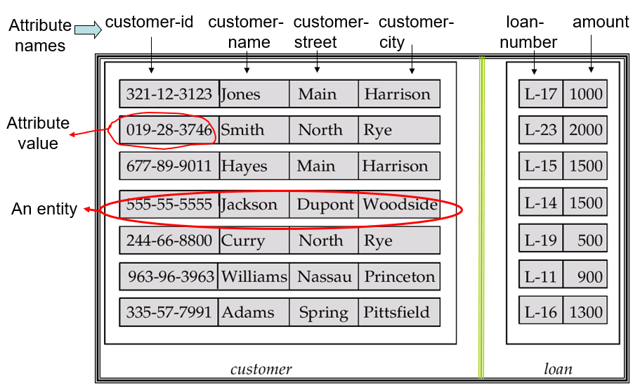{ width="600" }
</figure>

### 1.1 Attributes

实体由一组属性表示，这些属性是实体集中所有成员所拥有的描述性特性

domain（域）：每个属性允许的值的集合

类型：

1. simple and composite attributes（简单和复合属性）
2. single-valued and multi-valued attributes（单值和多值属性）
3. derived attributes（派生属性）
      1. 可以从其他属性计算得出
      2. 与 base attributes（基属性）和 stored attributes（存储属性）相对

#### 1.1.1 Composite Attributes

<figure markdown="span">
  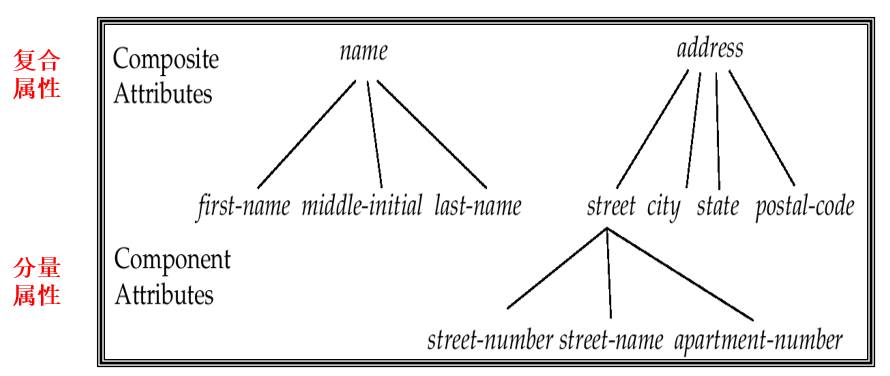{ width="600" }
</figure>

> 分量属性是指复合属性中的各个组成部分。复合属性是由多个简单属性组合而成的属性，而这些简单属性就是分量属性

## 2 Relationship Sets

1. relationship：关系是多个不同实体之间的关联
2. relationship set：关系集是同类型实体（即实体集）之间关系的集合

> 从数学概念上来说，$\lbrace (e_1, e_2, \cdots, e_n)|e_1 \in E_1, e_2 \in E_2 ,\cdots , e_n \in E_n \rbrace$，$(e_1, e_2, \cdots, e_n)$ 就是一个关系，$E_i$ 是一个实体集

<figure markdown="span">
  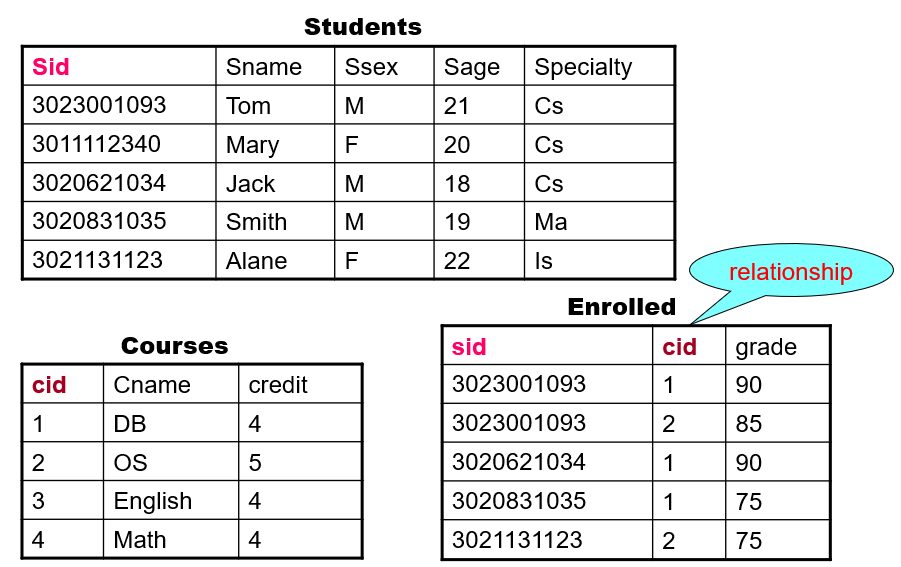{ width="600" }
</figure>

<figure markdown="span">
  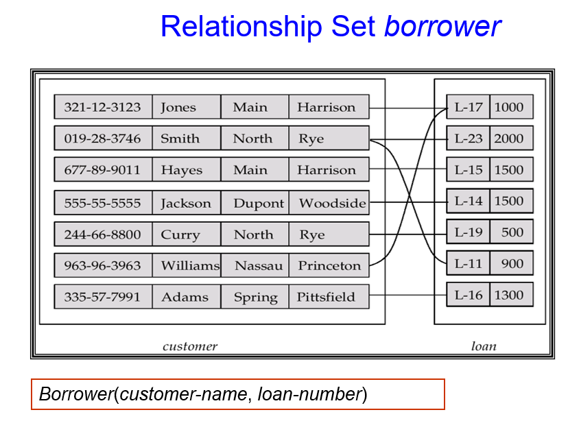{ width="600" }
</figure>

属性不仅可以属于实体集（Entity Set），还可以属于关系集（Relationship Set）。例如上图例子，depositor 这个关系集表示 customer 和 account 之间的关系，而这个关系集本身也可以有自己的属性，比如 access-data

### 2.1 Degree

degree of a relationship set

1. 关系集的度指的是参与关系集的实体集的数量
2. 涉及两个实体集的关系集是二元的 binary（或度为二）

### 2.2 Mapping Cardinalities

**映射基数**：表示通过关系集，一个实体可以与另一类实体相关联的实体数量

对于 binary relationship set：

1. one to one：就任总统（总统，国家）
2. one to many：分班情况（班级，学生）
3. many to one：就医（病人，医生）
4. many ro many：选课（学生，课程）

<div class="grid" markdown>

<figure markdown="span">
  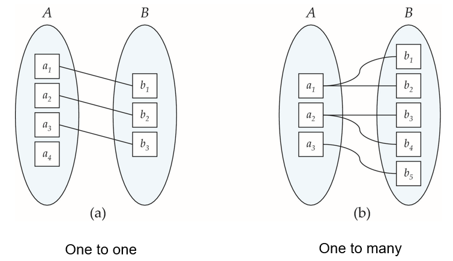{ width="500" }
</figure>

<figure markdown="span">
  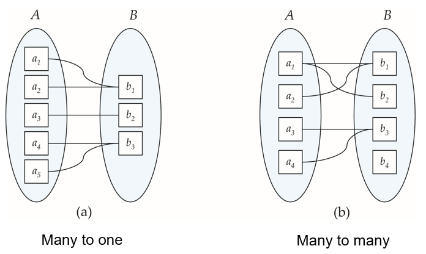{ width="500" }
</figure>

</div>

> A 和 B 中的实体可以没有映射

## 3 Keys

Keys of Entity Sets：

1. super key
2. candidate key
3. primary key

Keys of Relationship Sets:

1. super key：参与一个关系集的各实体集的 primary key 的组合
2. 作为 primary key 的属性不能为空

## 4 E-R Diagram

<figure markdown="span">
  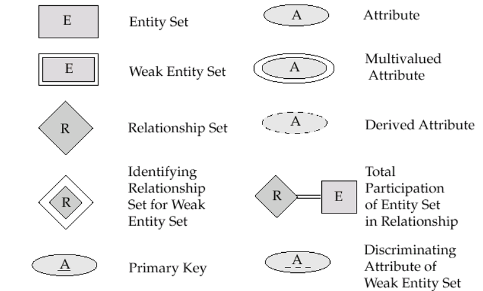{ width="600" }
</figure>

<figure markdown="span">
  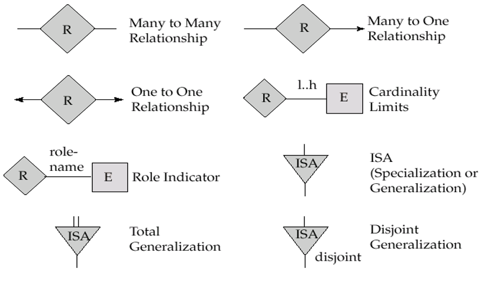{ width="600" }
</figure>

<figure markdown="span">
  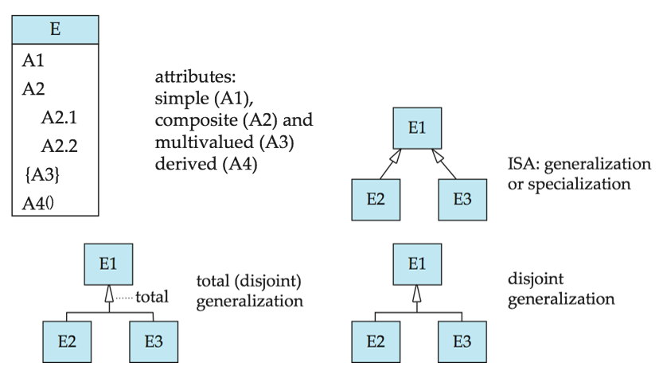{ width="600" }
</figure>

---

<figure markdown="span">
  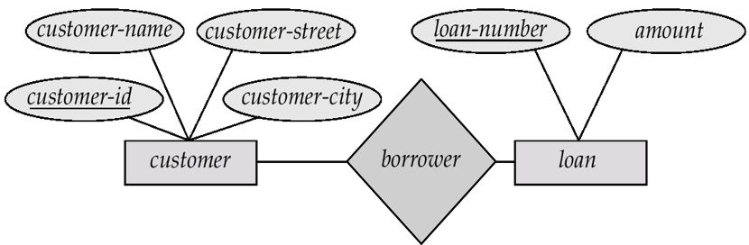{ width="500" }
</figure>

1. 矩形表示 entity sets
2. 菱形表示 relationship sets
3. 线条将 attributes 联系到 entity sets 并且将 entity sets 联系到 relationship  sets
4. 椭圆表示 attributes
      1. 双椭圆表示 multi-valued attributes
      2. 虚线椭圆表示 derived attributes
5. 下划线表示 primary key

<figure markdown="span">
  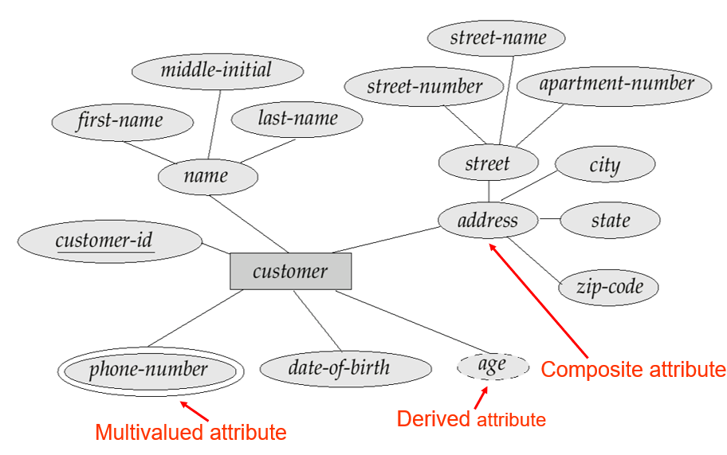{ width="600" }
</figure>

<figure markdown="span">
  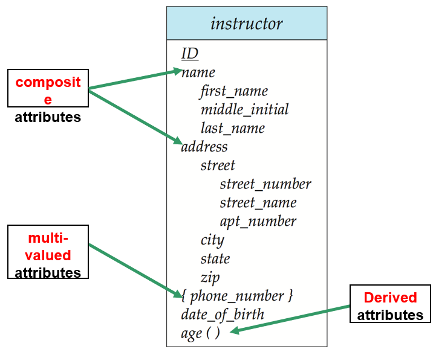{ width="600" }
</figure>

<figure markdown="span">
  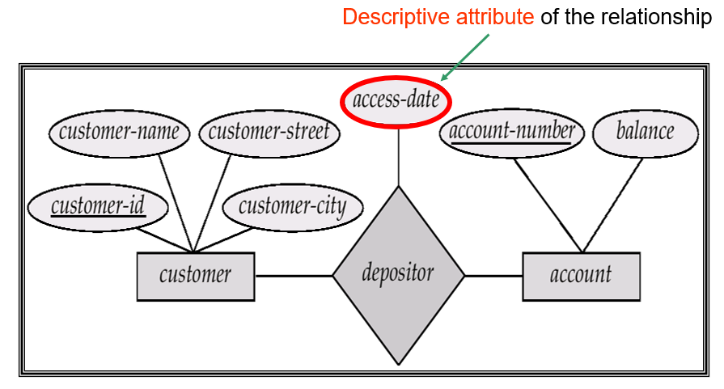{ width="600" }
</figure>

---

关系中的实体集可能是不同的，例如 recursive relationship set

1. 这意味着一个实体集可以与自身建立关系
2. role：角色描述了实体在关系中的功能或作用。例如 works-for 关系集中，员工实体可以扮演“经理”或“工人”的角色。角色标签（如“经理”和“工人”）用于明确实体在关系中的具体作用
3. role label：角色标签是可选的，但它们有助于更清晰地理解关系的语义

<figure markdown="span">
  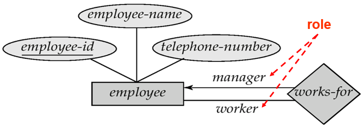{ width="600" }
</figure>

### 4.1 Cardinality Constraints

1. directed line $\rightarrow$：表示 one
2. undirected line $—$：表示 many

**one to one**

<figure markdown="span">
  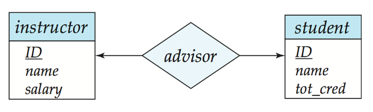{ width="400" }
</figure>

**one to many**

<figure markdown="span">
  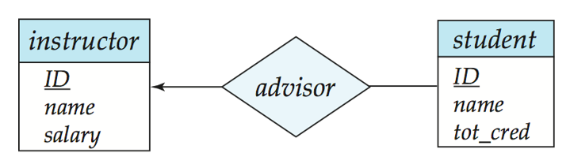{ width="400" }
</figure>

**many to one**

<figure markdown="span">
  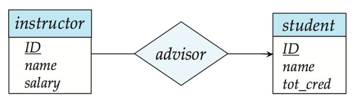{ width="400" }
</figure>

**many to many**

<figure markdown="span">
  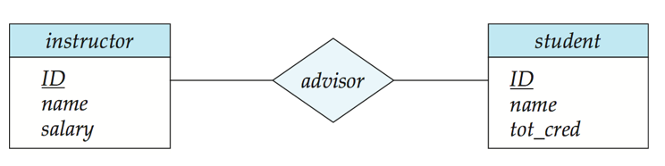{ width="400" }
</figure>

1. total participation（全参与）（用 double line $=$ 表示）：实体集中的每个实体都至少参与关系集中的一个关系
2. partial participation（部分参与）：实体集中的一些实体可能不参与关系集中的任何关系

<figure markdown="span">
  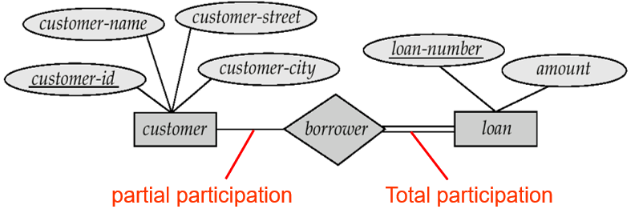{ width="600" }
</figure>

1. mapping cardinality constraints：限定了一个实体与发生关联的另一端实体可能关联的数目上限
2. total / partial participation：反映了一个实体参与关联的数目下限

Alternative notation：

<figure markdown="span">
  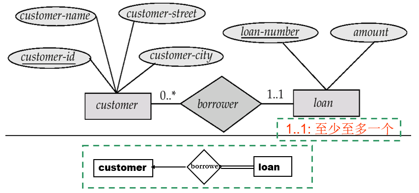{ width="600" }
</figure>

**Example**：一个银行职员在多个支行兼职，并承担不同类型的工作

<figure markdown="span">
  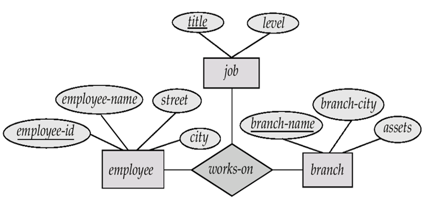{ width="600" }
</figure>

### 4.2 Non-Binary Relationships

一些关系集使用 non-binary 比使用 binary 要更好

1. parents(he, she, child)
2. works-on(employee, branch, job)

通常，任何非二元关系都可以通过创建一个 artificial entity set（人工实体集）来用二元关系表示

<figure markdown="span">
  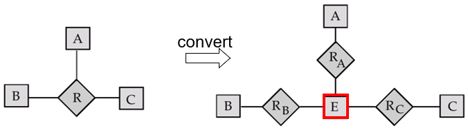{ width="600" }
</figure>

<figure markdown="span">
  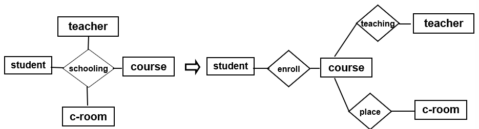{ width="600" }
</figure>

## 5 Week Entity Sets

1. week entity sets（弱实体集）：没有主键的实体集
2. 弱实体集的存在依赖于 identifying entity set（标识实体集或强实体集）的存在
      1. 它必须通过一个从标识实体集到弱实体集的全参与、一对多的关系集与标识实体集相关联
      2. identifying relationship（标识关系）用双菱形表示
3. 弱实体集的 discriminator / partial（分辨符 / 部分键）是区分弱实体集中所有实体的属性集
4. 弱实体集的主键由其所依赖的强实体集的主键加上弱实体集的分辨符组成

<figure markdown="span">
  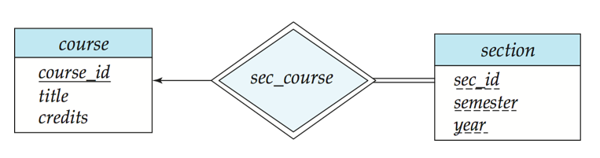{ width="600" }
</figure>

1. 下划虚线表示弱实体集的标识符
2. 将弱实体集的标识关系放在双菱形中

---

1. 弱实体集的主键由强实体集的主键和弱实体集的分辨符组成。强实体集的主键不会显式地存储在弱实体集中，因为这种关系已经在标识关系中隐含了
2. 如果显式地将 course_id 存储在 section 中，那么 section 可以成为一个强实体。然而，这样做会导致 section 和 course 之间的关系被重复表示：一次通过显式的 course_id 属性，另一次通过标识关系。这种重复可能会导致数据冗余和不一致性

<figure markdown="span">
  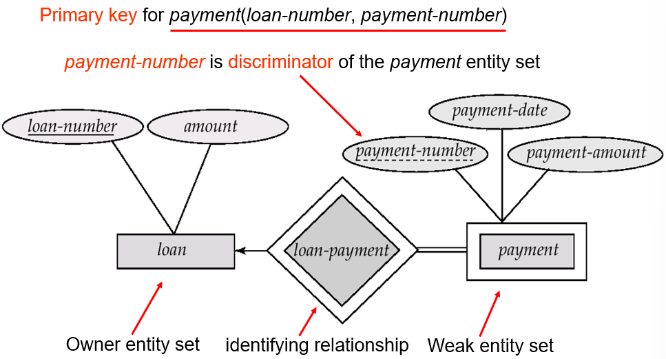{ width="600" }
</figure>

<figure markdown="span">
  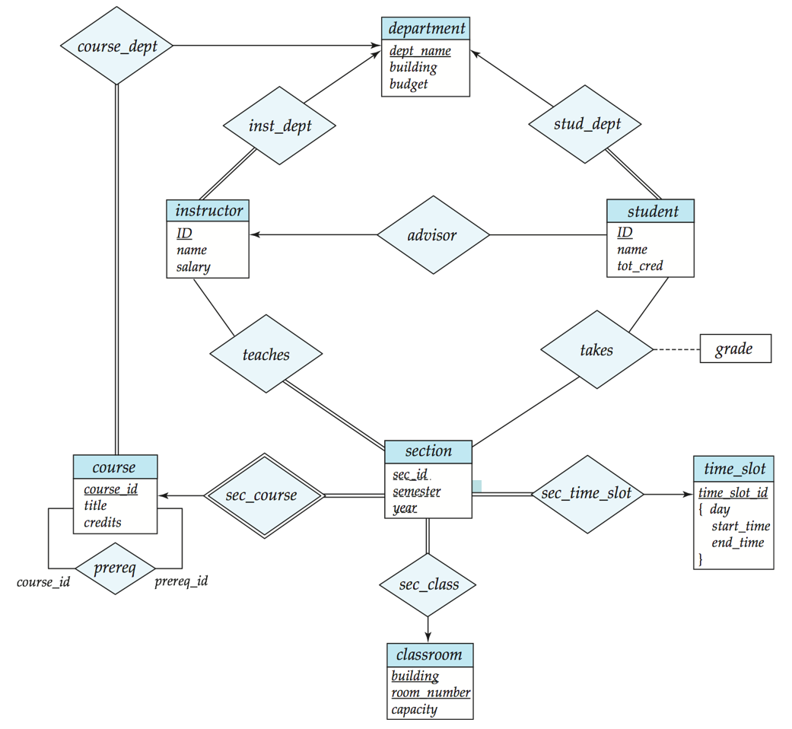{ width="800" }
</figure>

## 6 Extended E-R Features

### 6.1 Specialization

**特殊化**

1. 设计方向：采用自上而下（Top-down）的方式，从一般到具体的设计过程
2. 核心思想：在一个通用的实体集中，识别出具有特殊属性的子类。例如，"人"实体集可以特殊化为"学生"和"教师"两个子类
3. 特点：
      1. 子分组（子类）具有父类没有的特殊属性或关系
      2. 子类自动继承父类的所有属性和关系（属性继承）
      3. 形成一种层级结构，上层更通用，下层更具体
4. 应用：这种设计方法在面向对象数据库和ER模型中很常见，有助于实现数据的层次化组织和代码复用

<figure markdown="span">
  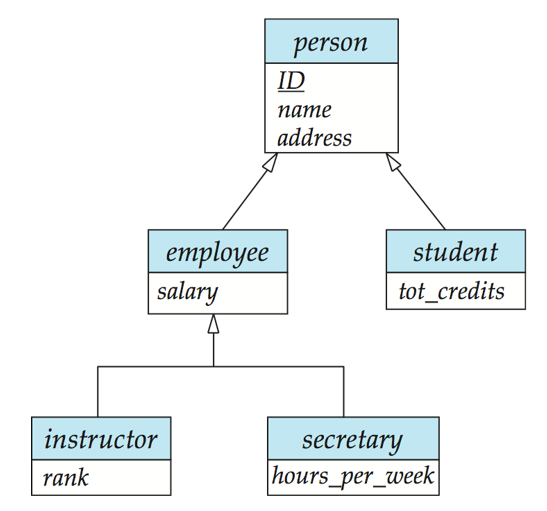{ width="600" }
</figure>

### 6.2 Generalization

**泛化**

1. 设计方向：泛化是自下而上（Bottom-up）的设计过程，从具体的子类抽象出通用的父类。例如，将"学生"和"教师"实体集合并为更高层级的"人"实体集
2. 与特殊化的关系
      1. 泛化和特殊化是互逆过程
          - 特殊化：从父类拆分出子类（如"人"→"学生"/"教师"）
          - 泛化：将子类合并为父类（如"学生"+"教师"→"人"）
      2. 在 E-R 图中，两者用相同的符号表示（通常用空心箭头指向父类）
3. 应用：泛化用于提取共性，减少数据冗余（如"学生"和"教师"共享"姓名""年龄"等属性）

### 6.3 Design Constraints

1. 成员资格约束
      1. 条件定义的：通过明确的规则（如年龄、账户类型）自动划分实体
          - person 实体集中，年龄≥65的自动归入 senior-citizen 子类
          - account 实体按类型分为 saving-account 和 checking-account
      2. 用户定义的：由人工指定（如管理员将员工分配到具体团队）
2. 重叠性约束
      1. 不相交（Disjoint）：子类之间互斥，实体只能属于一个子类
          - E-R 图表示：在 ISA 关系旁标注 disjoint
          - 示例：student 和 teacher 作为 person 的子类，一个人不能同时属于两者
      2. 可重叠（Overlapping）：子类允许交叉，实体可属于多个子类
          - 示例：person 的子类 employee 和 student 可以重叠（某人既是在职员工又是学生）
3. 完全性约束（Completeness Constraint）
      1. 完全约束（Total）：父类中的所有实体都必须映射到至少一个子类
      2. 部分约束（Partial）：父类中的实体可以不属于任何子类

ISA 关系：表示父类与子类的继承关系（如 senior-citizen ISA person）

<figure markdown="span">
  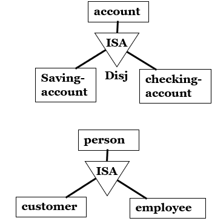{ width="400" }
</figure>

<figure markdown="span">
  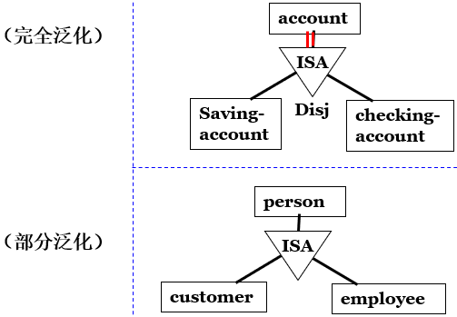{ width="400" }
</figure>

### 6.4 Aggregation

<figure markdown="span">
  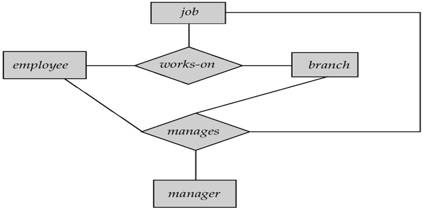{ width="600" }
</figure>

- works-on（员工-工作-分支机构）和 manages（经理-员工-工作-分支机构）两个关系集存在信息重叠
- 每个 manages 实例必然对应一个 works-on 实例（经理必须先在该岗位工作），但反之不成立（普通员工的 works-on 可能无经理关联）
- 直接合并会丢失信息：若仅保留 manages，会丢失无经理关联的 works-on 数据

聚合：

1. 核心思想
      1. 将 works-on 关系抽象为一个实体（如 assignment）
      2. 在 manages 中引用该实体，而非直接关联原始三要素（员工、工作、分支机构）
2. 优势
      1. 消除冗余：manages 只需关联 assignment 实体，无需重复存储员工-工作-分支机构组合
      2. 保留完整性：所有 works-on 数据（包括无经理关联的）均被保留

<figure markdown="span">
  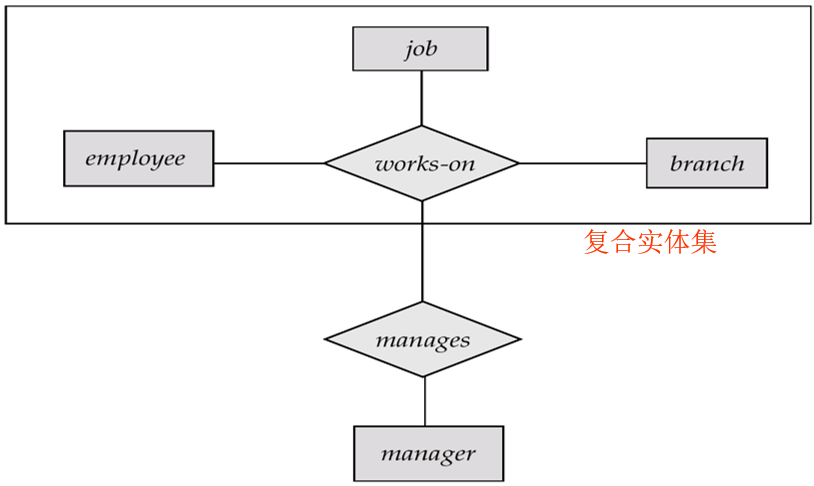{ width="600" }
</figure>

## 7 Design of an E-R Database Schema

**1.使用属性还是实体集表示对象**

- 作为属性的条件
      - 对象是单值且无附加属性
      - 示例：gender（性别）只需存储“男/女”，适合作为 employee 的属性
- 作为实体集的条件
      - 对象需要多值或额外属性描述
      - 示例：phone 需要存储号码、类型、颜色等，应独立为实体集，并通过联系集 emp-phone 与 employee 关联
      - 示例：department 若有预算、位置等属性，也需作为实体集

**2.使用实体集还是关系集**

- 关系集的本质：描述实体间的动态交互行为（如“学生选课”“客户存款”），而非静态对象
      - 示例：enrolled（学生与课程的注册关系）
      - 示例：borrower（客户与图书的借阅关系）
- 实体集的本质：表示独立存在的对象（如学生、课程、图书）

<figure markdown="span">
  { width="600" }
</figure>

**3.将信息作为实体的属性还是关系的属性**

`student(sid, name, sex, age, ..., supervisor-id, supervisor-name, supervisor-position, ..., class, monitor)`

- 数据冗余：如果多个学生有同一位导师，导师信息会被重复存储
- 结构混乱：将本应独立的实体（如导师、班级）信息作为属性存储
- 维护困难：当导师信息变更时需要更新多条记录

```sql title="优化后"
student(sid, name, sex, age, ...);
supervisor(sup-id, name, position, ...);
class(classno, specialty, monitor, stu-num);
stu-class(sid, classno);
stu-sup(sid, sup-id, from, to);
```

1. 语义独立性：
      1. 具有独立语义的对象（如导师、班级）应建模为实体
      2. 仅描述性的信息（如学生年龄）可作为属性
2. 减少冗余：
      1. 通过关系连接实体，避免重复存储信息
      2. 如导师信息只存储在 supervisor 实体中
3. 扩展性：
      1. 关系可以添加属性（如 stu-sup 中的 from/to 时间）
      2. 独立实体更易于扩展新属性

**4.使用三元 / N 元关系还是多个二元关系**

**5.使用强实体集还是弱实体集**

**6.使用特殊化/泛化**

有助于设计的模块化

**7.使用聚合**

可以将 E-R 图的一部分组合成单个实体集，作为一个整体单元处理，而无需关心其内部结构细节

## 8 Reduction of an E-R Schema to Tables

展开 composite attributes：例如 name.first-name, name.second-name，`customer(customer-id, first-name, last-name, cust-street, cust-city)`

multivalued attribute 用一个独立的 table 表示：例如多值属性 dependent-names

```sql
employee(emp-id, ename, sex, age)
employee-dependent-names(emp-id, dependent-name)
```

弱实体集的表格应包含其标识实体集的主键：`payment(loan-number, payment-number, payment-date, payment-amount) `

关系集的表格包含其强实体集的主键，和自身的属性

对于"多"端 **完全** 参与（total on the many-side）的多对一或一对多关系集，可以通过在"多"端实体表中添加一个额外属性来表示该关系，该属性包含"一"端实体的主键

```sql
部门(dept_id, dept_name, ...)
员工(emp_id, emp_name, ...)
工作于(emp_id, dept_id)  -- 单独的联系表

部门(dept_id, dept_name, ...)
员工(emp_id, emp_name, ..., dept_id)  -- 将部门 ID 作为外键直接加入员工表
```

联系弱实体集及其标识性实体集的联系集对应的表是冗余的，即对应 identifying relationship 的表是多余的

---

“特殊化”处理：

方法一：

<figure markdown="span">
  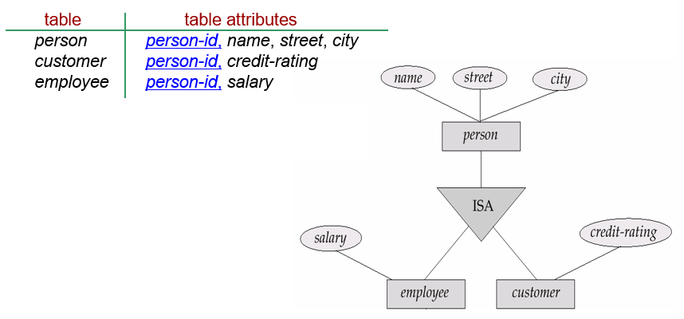{ width="600" }
</figure>

缺点：需要通过两个表格获取到信息

方法二：

<figure markdown="span">
  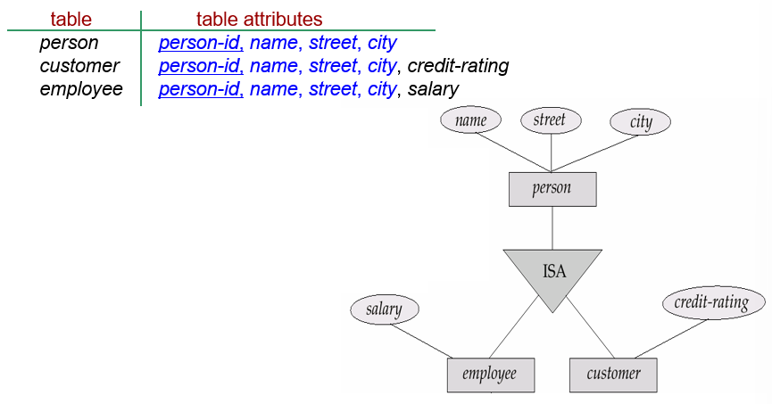{ width="600" }
</figure>

缺点：信息冗余

## Homework

???+ question "课本 6.1"

    Construct an E-R diagram for a car insurance company whose customers own one or more cars each. Each car has associated with it zero to any number of recorded accidents. Each insurance policy covers one or more cars and has one or more premium payments associated with it. Each payment is for a particular period of time, and has an associated due date, and the date when the payment was received.

    ??? success "答案"

        <figure markdown="span">
          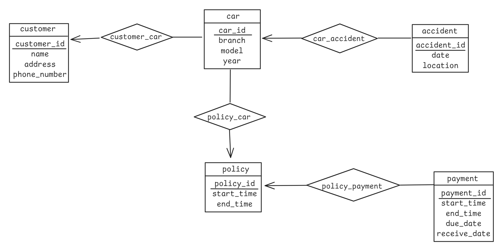{ width="600" }
        </figure>

???+ question "课本 6.2"

    Consider a database that includes the entity sets student, course, and section from the university schema and that additionally records the marks that students receive in different exams of different sections.

    a. Construct an E-R diagram thatmodels exams as entities and uses a ternary relationship as part of the design.<br/>
    b. Construct an alternative E-R diagram that uses only a binary relationship between student and section. Make sure that only one relationship exists between a particular student and section pair, yet you can represent the marks that a student gets in different exams.

    ??? success "答案"

        a.

        <figure markdown="span">
          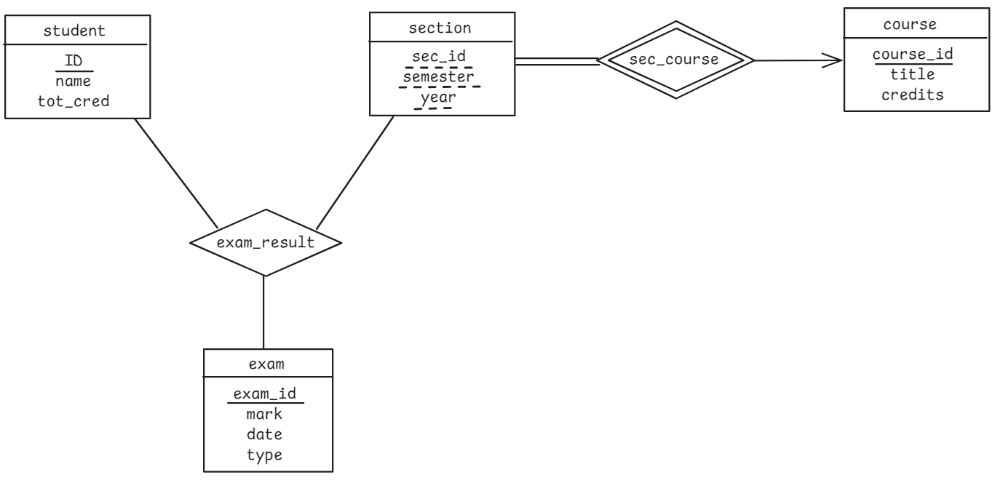{ width="600" }
        </figure>

        ---

        b.

        <figure markdown="span">
          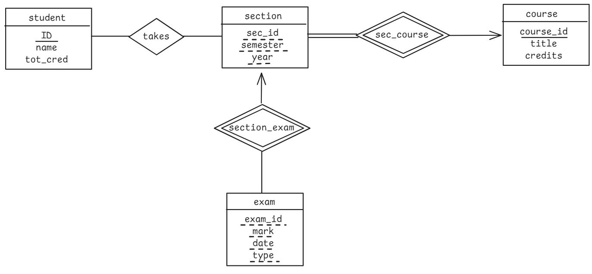{ width="600" }
        </figure>

???+ question "课本 6.21"

    Consider the E-R diagram in Figure 6.30, which models an online bookstore.

    <figure markdown="span">
      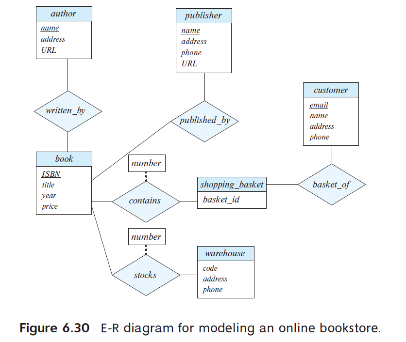{ width="600" }
    </figure>

    a. Suppose the bookstore adds Blu-ray discs and downloadable video to its collection. The same itemmay be present in one or both formats, with differing prices. Draw the part of the E-R diagram that models this addition, showing just the parts related to video.<br/>
    b. Now extend the full E-R diagram to model the case where a shopping basketmay contain any combination of books, Blu-ray discs, or downloadable video.

    ??? success "答案"

        a.

        <figure markdown="span">
          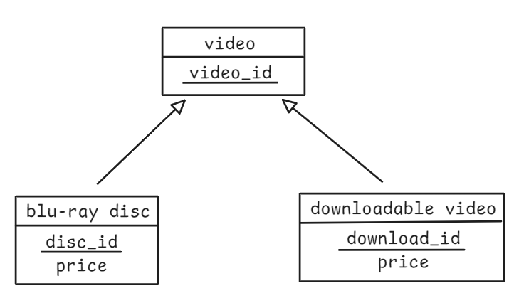{ width="600" }
        </figure>

        ---

        b.

        <figure markdown="span">
          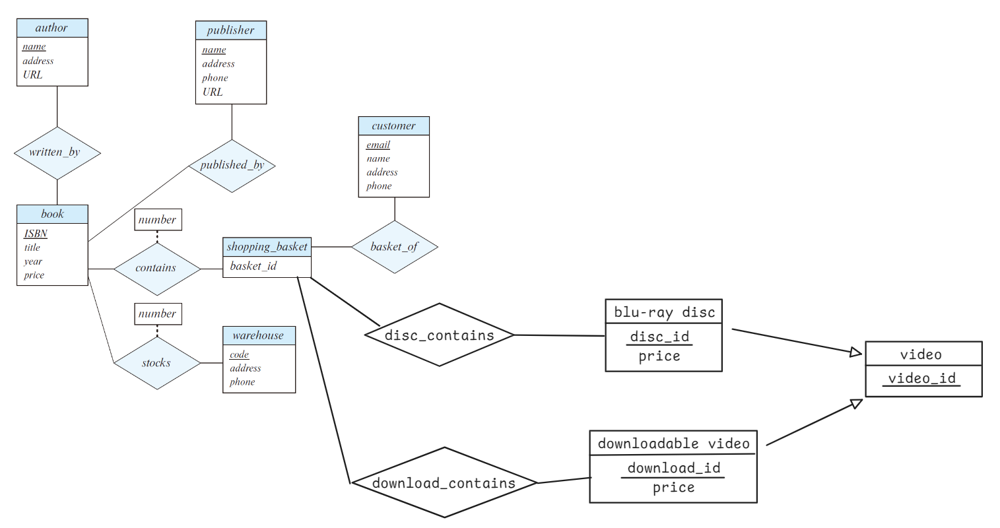{ width="600" }
        </figure>

???+ question "课本 6.22"

    Design a database for an automobile company to provide to its dealers to assist them in maintaining customer records and dealer inventory and to assist sales staff in ordering cars.

    Each vehicle is identified by a vehicle identification number (VIN). Each individual vehicle is a particular model of a particular brand offered by the company (e.g., the XF is a model of the car brand Jaguar of Tata Motors). Each model can be offered with a variety of options, but an individual car may have only some (or none) of the available options. The database needs to store information about models, brands, and options, as well as information about individual dealers, customers, and cars. 

    Your design should include an E-R diagram, a set of relational schemas, and a list of constraints, including primary-key and foreign-key constraints.

    ??? success "答案"

        <figure markdown="span">
          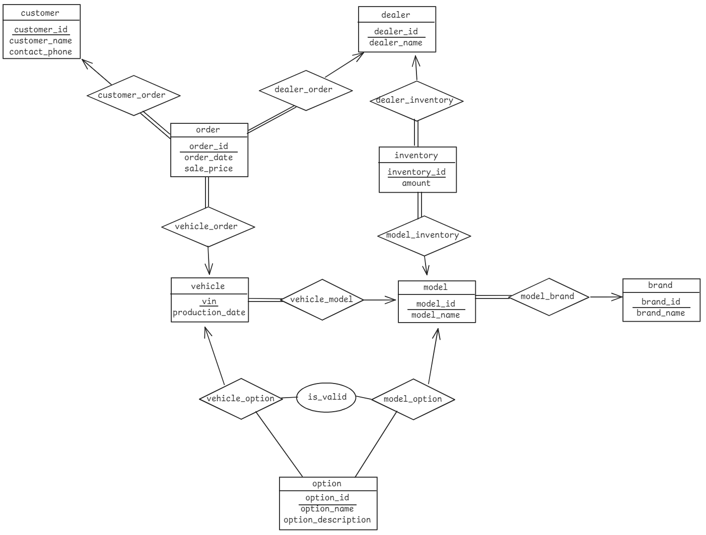{ width="600" }
        </figure>

        ```sql linenums="1"
        create table customer (
            customer_id type,
            customer_name type,
            contact_phone type,
            primary key (customer_id)
        );
        
        create table dealer (
        	dealer_id type,
            dealer_name type,
            primary key (dealer_id)
        );
        
        create table vehicle (
        	vin type,
            model_id type,
            production_date type,
            primary key (vin),
            foreign key (model_id) references model
        );
        
        create table order (
        	order_id type,
            customer_id type,
            dealer_id type,
            vin type,
            order_date type,
            sale_price type,
            primary key (order_id),
            foreign key (customer_id) references customer,
            foreign key (dealer_id) references dealer,
            foreign key (vin) references vehicle
        );
        
        create table brand (
        	brand_id type,
            brand_name type,
            primary key (brand_id)
        );
        
        create table model (
        	model_id type,
            brand_id type,
            model_name type,
            primary key (model_id),
            foreign key (brand_id) references brand
        );
        
        create table inventory (
        	inventory_id type,
            dealer_id type,
            model_id type,
            amount type,
            primary key (inventory_id),
            foreign key (dealer_id) references dealer,
            foreign key (model_id) references model
        );
        
        create table option (
        	option_id type,
            option_name type,
            option_desciption type,
            primary key (option_id),
        );
        
        create table vehicle_option (
        	option_id type,
            vin type,
            is_valid type,
            foreign key (option_id) references option,
            foreign key (vin) references vehicle
        );
        
        create table model_option (
        	option_id type,
            model_id type,
            is_valid type,
            foreign key (option_id) references option,
            foreign key (model_id) references model
        );
        ```
