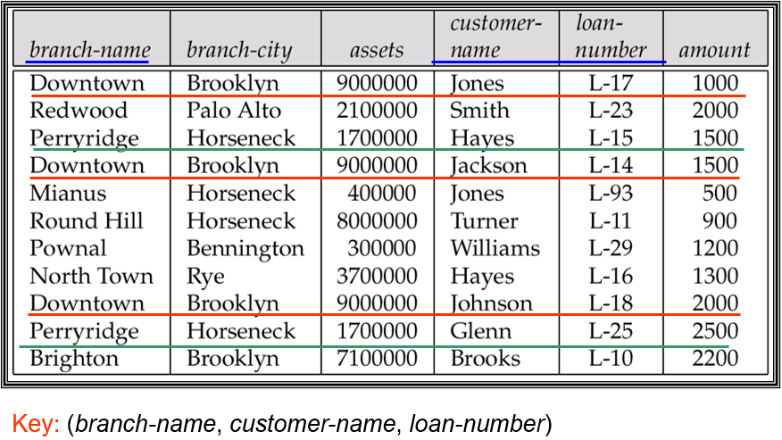
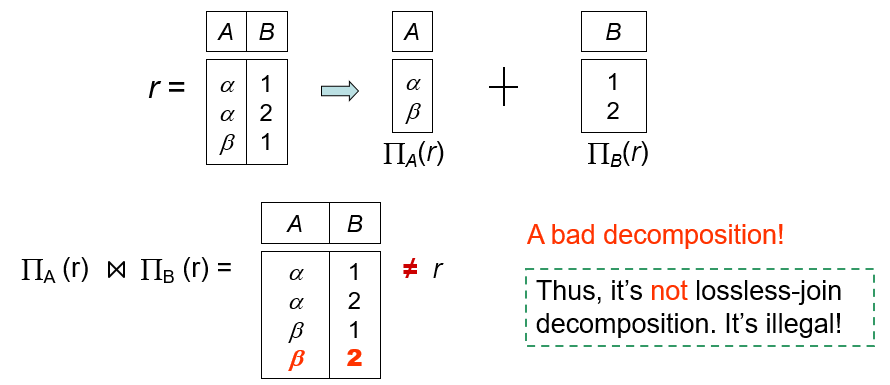
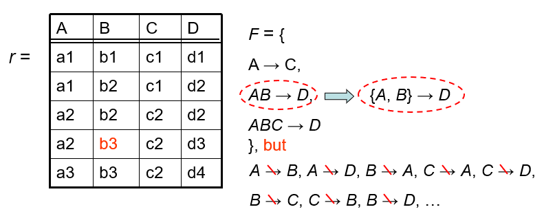
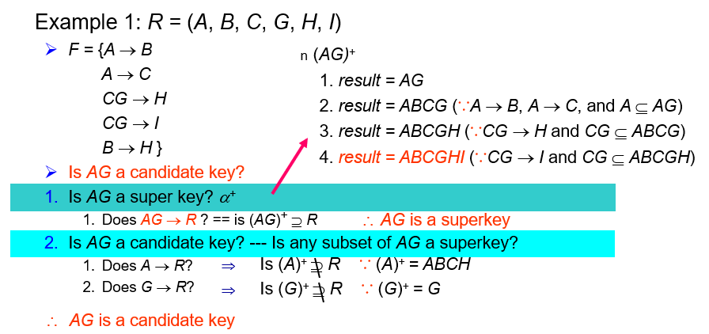
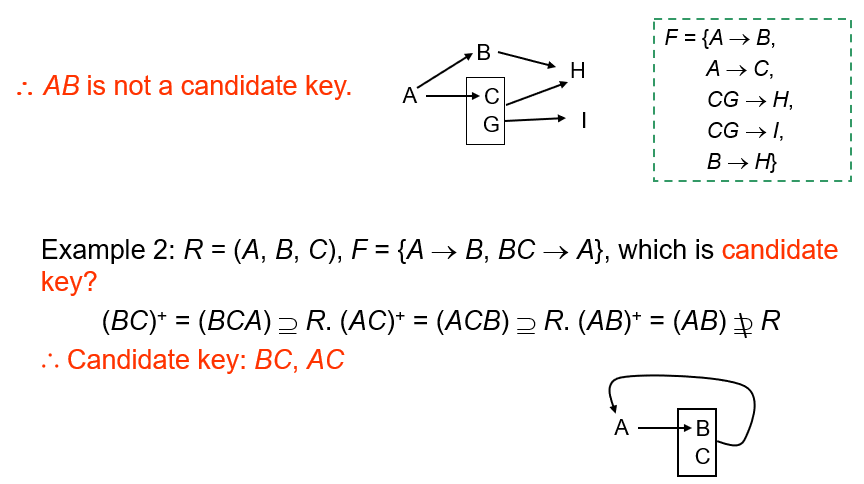
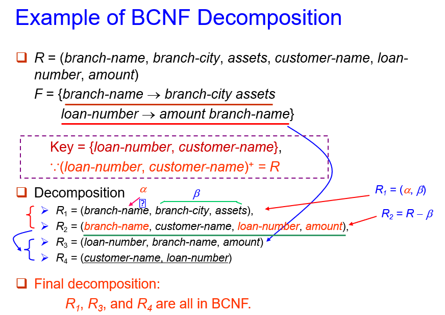
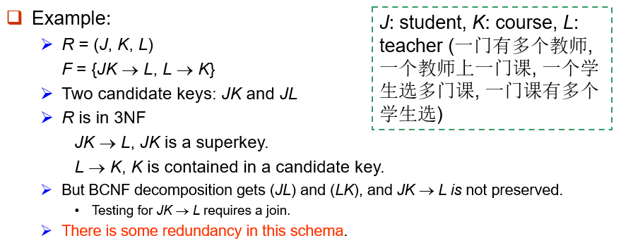
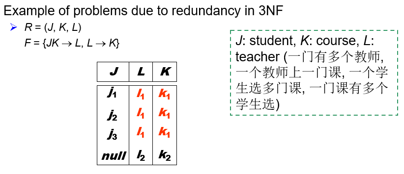

# 6 Relational Database Design

!!! tip "说明"

    本文档正在更新中……

!!! info "说明"

    本文档仅涉及部分内容，仅可用于复习重点知识

## 1 First Normal Form

atomic domain（原子域）：第一范式的核心是要求每个属性的值必须是原子的（不可再分）。这意味着

1. 不能包含复合值（如将"姓名"拆分为"姓"和"名"）
2. 不能包含多值（如一个属性存储多个电话号码）
3. 不能是复杂对象类型

在关系数据库中，所有表/关系必须至少满足第一范式，这是关系模型的基本要求

如何处理 non-atomic values：

1. composite attributes：拆分成多个简单属性
2. multi-value attributes
      1. 使用 multi fields：`person(name, phone1, phone2, phone3)`
      2. 使用单独的一张表（推荐方式）：`phone(name, phone)`
      3. 使用单个字段存储多个值（如逗号分隔的字符串）：`person(name, phones)`

非原子策略的缺点：

1. 存储复杂化：如多字段方案可能导致空值，单字段方案需要额外解析
2. 数据冗余：例如多字段方案中，未使用的字段浪费空间
3. 查询复杂：如单字段存储多值时，需用字符串操作（如 LIKE 或正则表达式），效率低且易出错

Atomicity is actually a property of how the elements of the domain are used（原子性实际上是域元素使用方式的一种属性）

1. 原子性的相对性：
      - 原子性不是数据本身的固有属性，而是取决于如何使用数据
      - 通常认为字符串是原子的(不可分割)，但在特定使用场景下可能失去原子性
2. 具体案例：
      - 学号"CS0012"表面看是一个原子字符串
      - 但如果应用程序需要提取前两位"CS"表示计算机系，后四位"0012"表示序号
      - 这种使用方式实际上破坏了学号的原子性
3. 问题本质：
      - 将结构化信息编码在单一字段中(如院系代码+序号)
      - 迫使应用程序负责解析和提取这些信息
4. 设计缺陷：
      - 违反了数据库设计原则：信息应该明确存储在数据库中
      - 增加了应用程序的复杂性(需要编写解析逻辑)
      - 降低了数据可读性和可维护性
5. 正确做法：
      - 应该将学号拆分为两个独立字段：院系代码(dept_code)和序号(seq_num)
      - 或者在数据库中建立院系表，通过外键关联

这种设计理念强调了数据库应该明确、直接地存储信息，而不是依赖应用程序来解析编码数据，这也是关系数据库规范化的重要原则之一

## 2 Pitfalls in Relational Database Design

关系数据库设计要求我们找到一个"良好"的关系模式集合。糟糕的设计可能导致：数据冗余、插入/删除/更新异常（无法表示某些信息）

两种设计方法：

1. Top - down
2. Bottom - up
      1. 从泛关系（包含所有属性的单一表）开始
      2. 通过规范化理论 decomposition（分解）得到优化的关系模式

<figure markdown="span">
  { width="600" }
</figure>

> 缺点：
>
> 1. Redundancy：浪费空间，可能导致数据不一致性
> 2. Updating anomaly：如果更新一行的 assets 数据，其他相关的行也需要更新，增大数据不一致性的概率
> 3. Insert / delete anomalies：如果一个 branch 没有 loan 信息，可以使用 null 值，但是 null 值很难处理

### 2.1 Decomposition

**分解**

将一个复杂的关系模式拆分为多个简单的模式，例如 ABCD = AB + BCD = ACD + ABD

> 可将上例的 Lending Relation 拆分为：`branch(branch_name, branch_city, assets)` 和 `branch_name, customer_name, loan_number, amount`

基本原则：

1. 完备性：分解后的模式必须包含原模式所有属性（$R = R₁ ∪ R₂$）
2. Lossless-join decomposition（无损连接）：通过自然连接能完全恢复原始数据（无信息损失）

<figure markdown="span">
  { width="600" }
</figure>

1. 判断一个 relation 是否 good：no redundant
2. 如果一个 relation 不 good，将其分解为一组 relation
      1. 每个 relation 都是 good
      2. 该分解为无损连接分解
3. 理论基于：functional dependencies（函数依赖）和 multivalued dependencies（多值依赖）

## 3 Functional dependencies

给定关系模式 $R$ 和其属性子集 $\alpha\  \beta$，函数依赖 $\alpha \rightarrow \beta$ 成立的条件是：对于关系的所有可能合法实例，如果任意两个元组在 $α$ 上的值相同，则它们在 $β$ 上的值也必须相同

- $\alpha$ 称为 determinant（决定因子集）
- $\beta$ 称为 dependent（依赖属性集）
- 表明 $\alpha$ 的属性值可以唯一确定 $\beta$ 的属性值

<div class="grid" markdown>

| $\alpha$ | $\beta$ | $\gamma$ |
| :--: | :--: | :--: |
| a | f | 1 |
| b | h | 2 |
| a | f | 3 |
| c | f | 4 |

<div markdown>

1. 当 $\alpha = a$，$\beta$ 总是 $f$
2. 当 $\alpha = b$，$\beta$ 总是 $h$
3. 当 $\alpha = b$，$\beta$ 总是 $f$

$\beta$ is functionally dependent on $\alpha$, $\alpha$ functionally determines $\beta$

</div>

</div>

函数依赖是一种 integrity constraints，表达了特定属性的值的关系，可以用来判断模式规范化，并提出改进建议

!!! tip "functional dependencies 和 key"

    - 函数依赖是比键更广义的约束概念
    - 所有键都是特殊的函数依赖，但函数依赖不一定是键

    函数依赖可以表达键无法表示的语义约束

    - 键约束强调唯一标识（实体完整性）
    - 函数依赖强调属性间的决定关系（语义完整性）

### 3.1 The Use of Functional Dependencies

**1.在给定的函数依赖 F 下，判断 relations 是否合法**

如果 relation r 合法，称为 r satisfies F

<figure markdown="span">
  { width="600" }
</figure>

**2.分辨一组合法 relations（schema R） 的 constraints F**

如果所有合法 relations r on R 满足 F，称 F holds on R

- 容易判断单个关系实例 r 是否满足给定的 F
- 难以判断 F 是否在模式 R 上成立（不能仅从一个 r 推断 F）
- R 上的函数依赖 F 通常由 R 的语义定义决定
- 不能从单一实例反推函数依赖

### 3.2 Trivial and Non-Trivial Dependency

**trivial functional dependency**

右边属性集（β）完全包含于左边属性集（α）中的依赖，$\beta \sube \alpha$

- 自反性：$A \rightarrow A$（属性决定自身）
- 包含性：$AB \rightarrow A$（组合属性决定其子集）

**non-trivial functional dependency**

右边属性至少有一个不属于左边属性集的依赖，$\beta \not\subseteq \alpha$

### 3.3 Closure of Functional Dependencies

- 传递性：$A \rightarrow B,\ B \rightarrow C \implies A \rightarrow C$

定义：通过 F 推导出的所有函数依赖称为 F 的 closure（闭包），记作 $F^+$

$F = \lbrace A \rightarrow B,\ B \rightarrow C \rbrace \implies F^+ = \lbrace A \rightarrow B,\ B \rightarrow C,\ A \rightarrow C,\ A \rightarrow A,\ AB \rightarrow A,\ AB \rightarrow B,\ AC \rightarrow C,\ A \rightarrow BC, \cdots$

#### 3.3.1 Armstrong's Axioms

Armstrong 公理提供了用于求 $F^+$ 的推理规则

1. reflexivity（自反律）：$\beta \sube \alpha \implies \alpha \rightarrow \beta$
2. augmentation（增补律）：$\alpha \rightarrow \beta \implies \gamma \alpha \rightarrow \gamma \beta,\ \gamma \alpha \rightarrow \beta$
3. transitivity（传递律）：$\alpha \rightarrow \beta,\ \beta \rightarrow \gamma \implies \alpha \rightarrow \gamma$

性质：

1. soundness（保真性）：所有通过这些规则推导出的函数依赖都是逻辑正确的
2. completeness（完备性）：这些规则足以推导出所有可能的函数依赖

!!! example "例子"

    $R = (A, B, C, G, H, I)$

    $F = \lbrace A \rightarrow B, A \rightarrow C, CG \rightarrow H, CG \rightarrow I, B \rightarrow H \rbrace$

    Some members of $F^+$

    - $A \rightarrow H$：传递律
    - $AG \rightarrow I$：$A \rightarrow C \implies AG \rightarrow CG$（pseudotransitivity 伪传递律）
    - $AG \rightarrow H$
    - $CG \rightarrow HI$：$CG \rightarrow H \implies CG \rightarrow CGH$，$CG \rightarrow I \implies CGH \rightarrow HI$，$\implies CG \rightarrow HI$（合并律）
    - $A \rightarrow BC$

补充定律：

1. union（合并律）：$\alpha \rightarrow \beta,\ \alpha \rightarrow \gamma \implies \alpha \rightarrow \beta \gamma$
2. decomposition（分解律）：$\alpha \rightarrow \beta \gamma \implies \alpha \rightarrow \beta,\ \alpha \rightarrow \gamma$
3. pseudotransitivity（伪传递律）：$\alpha \rightarrow \beta,\ \beta \gamma \rightarrow \delta \implies \alpha \gamma \rightarrow \delta$

```sql linenums="1" title="计算 F+ 的过程"
F+ = F
repeat
    for each functional dependency f in F+
        apply reflexivity and augmentation rules on f
        add the resulting functional dependencies to F+
    for each pair of functional dependencies f1 and f2 in F+
        if f1 and f2 can be combined using transitivity
        then add the resulting functional dependency to F+
until F+ does not change any further
```

对于包含 n 个属性的关系模式，可能的函数依赖数量最多为 $2^n \times 2^n$

### 3.4 Closure of Attribute Sets

closure of a，记作 $a^+$，表示所有可以通过 F 中的函数依赖从 a 推导出的属性集合

> 若 $F = \lbrace A→B,B→C \rbrace$，则 $A^+ = \lbrace A,B,C \rbrace$

1. 测试 $\alpha \rightarrow \beta$ 是否在 $F^+$ 中，查看 $\beta \sube a^+$
2. 测试 a 是否是 super key，查看 $a^+ = R$

```sql linenums="1" title="计算 a+ 的过程"
result = a
while (changes to result) do
    for each β -> γ in F do
        begin
            if β ⊆ result then result = result ∪ γ
        end
a+ = result
```

<figure markdown="span">
  { width="600" }
</figure>

---

<figure markdown="span">
  { width="600" }
</figure>

<figure markdown="span">
  { width="600" }
</figure>

#### 3.4.1 The Use of Attribute Set Closure

1. 测试 super key
2. 测试 functional dependencies
3. 计算 F 的闭包
      1. 找出所有子集
      2. 计算各个子集的闭包
      3. 从各个闭包生成所有函数依赖
      4. 最终 $F^+$ 包含上述所有有效依赖

### 3.5 Canonical Cover

**正则覆盖**

数据库管理系统应始终检查以确保不违反函数依赖集 F 中的任何函数依赖 FD。但如果 F 太大，检查成本会很高。因此我们需要简化 FD 集合

F 的正则覆盖，记作 $F_c$，是一个与 F 等价的“最小” FD 集合。例如 $\alpha_1 \rightarrow \beta_1,\ \alpha_1 \rightarrow \beta_2 \implies \alpha_1 \rightarrow \beta_1\beta_2$

1. 等价性：Fc 与原始函数依赖集 F 在逻辑上等价（Fc ≡ F），能推导出相同的函数依赖
2. 最小性：没有冗余的函数依赖，也没有冗余的属性
3. 唯一性：每个函数依赖的左侧都是唯一的

通过删除 extraneous attributes（多余属性）得到 Fc

1. FD 有可以通过其它依赖关系推导出的依赖关系
      - $F = \lbrace A \rightarrow C,\ A \rightarrow B,\ B \rightarrow C \rbrace$ 中 $ A \rightarrow C$ 是 redundant，$F_c = \lbrace A \rightarrow B,\ B \rightarrow C \rbrace$
2. 左侧有 extraneous attributes
      - $F = \lbrace A \rightarrow B,\ B \rightarrow C,\ AC \rightarrow D \rbrace$，$F_c = \lbrace A \rightarrow B,\ B \rightarrow C,\ A \rightarrow D \rbrace$
3. 右侧有 redundant
      - $F = \lbrace A \rightarrow B,\ B \rightarrow C,\ A \rightarrow CD \rbrace$，$F = \lbrace A \rightarrow B,\ B \rightarrow C,\ A \rightarrow D \rbrace$

#### 3.5.1 Extraneous Attributes

**1.左侧冗余属性**

在函数依赖 $\alpha \rightarrow \beta$ 中，若属性 $A \in \alpha$ 满足：移除 A 后，新的函数依赖 $(\alpha - A) \rightarrow \beta$ 仍然可以由原函数依赖集 F 逻辑推导得出，则称 A 是冗余的

例如：$F = \lbrace A \rightarrow C,\ AB \rightarrow C \rbrace$，B 是冗余属性，$F_C = \lbrace A \rightarrow C \rbrace$

1. 从函数依赖的左侧 $\alpha$ 中移除待测试属性 A，得到 $\alpha' = \alpha - A$
2. 计算 $\alpha'$ 的属性闭包 $(\alpha')^+$
3. 如果 $\beta \sube (\alpha')^+$，说明不需要 A 也能推导出 $\beta$，因此 A 是冗余的

例如：$F = \lbrace AB \rightarrow C,\ A \rightarrow B \rbrace$，测试 $AB \rightarrow C$ 中的 B 是否冗余。计算 $(AB - B)^+ = A^+ = \lbrace A,\ B \rbrace$，所以 B 不是冗余的（不能只通过 A 得到 C）

**2.右侧冗余属性**

在函数依赖 $\alpha \rightarrow \beta$ 中，若属性 $A \in \beta$ 满足：移除 A 后，新的函数依赖 $\alpha \rightarrow (\beta - A)$ 仍然可以由原函数依赖集 F 逻辑推导得出，则称 A 是冗余的

例如：$F = \lbrace A \rightarrow C,\ AB \rightarrow CD \rbrace$，C 是冗余的，$F_c = \lbrace A \rightarrow C,\ AB \rightarrow D \rbrace$

1. 从函数依赖的右侧 $\beta$ 中移除待测试属性 A，得到 $\beta' = \beta - A$
2. 构造新的函数依赖集 $F' = (F - \lbrace \alpha \rightarrow \beta \rbrace) \cup \lbrace \alpha \rightarrow \beta' \rbrace$
3. 计算 $\alpha$ 在 $F'$ 下的属性闭包 $(\alpha)^+$
4. 如果 $A \in (\alpha)^+$，说明 A 可以通过其他依赖推出，因此 A 在 $\beta$ 中是冗余的

!!! example "例子"

    $R = (A, B, C)$<br/>
    $F = \lbrace A \rightarrow BC, B \rightarrow C, A \rightarrow B, AB \rightarrow C \rbrace$
    
    1. $F' = \lbrace A \rightarrow BC, B \rightarrow C, AB \rightarrow C \rbrace$
    2. $F' = \lbrace A \rightarrow BC, B \rightarrow C \rbrace$
    3. $F_c = \lbrace A \rightarrow B, B \rightarrow C \rbrace$

## 4 Decomposition

1. 属性完备性：原始模式的所有属性必须出现在分解后的子模式中
2. lossless-join decomposition：分解后的关系通过自然连接能完全恢复原始数据
      - 公共属性集必须是 R₁ 或 R₂ 的超键
3. dependency preserving（依赖保持）：所有原始函数依赖都能通过子关系的依赖集推导出来
4. no redundancy：分解后的子关系应达到 BCNF 或 3NF
      - BCNF：每个决定因素都是超键
      - 3NF：允许存在主属性对键的传递依赖

!!! example "例子"

    $R = (A,B,C)$<br/>
    $F = \lbrace A \rightarrow B, B \rightarrow C \rbrace$

    **方法 1** 正确

    $R_1 = (A,B)$<br/>
    $R_2 = (B,C)$

    1. lossless-join decomposition：公共属性集为 B，是 $R_2$ 的超键
    2. dependency preserving：$F_1 = \lbrace A \rightarrow B \rbrace,\ F_2 = \lbrace B \rightarrow C \rbrace$，$(F_1 \cup F_2)^+ = F^+$

    **方法 2** 错误

    $R_1 = (A,B)$<br/>
    $R_2 = (A,C)$

    1. lossless-join decomposition：公共属性集为 A，是 $R_1$ 的超键
    2. dependency preserving：$F_1 = \lbrace A \rightarrow B \rbrace,\ F_2 = \lbrace A \rightarrow C \rbrace$，$(F_1 \cup F_2)^+ \not= F^+$

## 5 Boyce-Codd Normal Form

对于函数依赖集 F⁺ 中的每一个非平凡函数依赖 α → β，必须满足以下两条之一：

1. 该依赖是平凡的：即 β 完全包含于 α 中（β ⊆ α）
2. α 是关系 R 的超键：即 α 能函数决定 R 中的所有属性（R ⊆ α⁺）

!!! example "例子"

    $R = (A, B, C)$<br/>
    $F = \lbrace A \rightarrow B, B \rightarrow C \rbrace$<br/>
    $Key = \lbrace A \rbrace$

    R 不满足 BCNF，因为函数依赖 $B \rightarrow C$ 中，B 不是一个 key

方法：

1. 列出所有非平凡函数依赖
2. 检查每个依赖的左侧 α：
      1. 计算 α 的属性闭包 α⁺
      2. 验证是否 α⁺ = R（即 α 是超键）
3. 若存在违反 BCNF 的依赖：
      1. 需要将关系模式分解为多个符合 BCNF 的子模式

==只需要检查给定函数依赖集 F 中的依赖是否违反 BCNF，而不需要检查 F⁺ 中的所有依赖==

```c linenums title="BCNF decomposition 方法"
result = {R};
done = false;
compute F+;
while (!done) {
    if (there is a schema Ri in result that is not in BCNF) {
        let α → β be a nontrivial functional dependency that holds on Ri 
        such that α → Ri is not in F+, and α ∩ β = ∅;
        result = (result - Ri) ∪ (α, β) ∪ (Ri - β);
        // (α, β) 就是 R1
        // (Ri - β) 就是 R2
    } else {
        done = true;
    }
}
```

<figure markdown="span">
  { width="600" }
</figure>

但是我们不能永远同时满足这三个目标：

1. lossless join
2. BCNF
3. dependency preservation

## 6 Third Normal Form

设计动机：

1. BCNF 的局限性：当将关系分解为 BCNF 时，某些原始函数依赖可能无法在任何一个子关系中完整表达
2. 解决方案：定义一个较弱范式，称为第三范式（3NF）
      1. 允许存在一定冗余（会带来相关问题）
      2. 保持依赖：所有原始函数依赖都能在分解后的子关系中体现
      3. 无损连接：确保数据完整性不被破坏

对于函数依赖闭包 F⁺ 中的每一个函数依赖 α → β，至少满足以下条件之一：

1. 平凡依赖：β 完全包含于 α 中（β ⊆ α）
2. 超键决定：α 是关系 R 的超键（R ⊆ α⁺）
3. 主属性包含：β - α 中的每个属性都包含在 R 的某个候选键中

主属性（Prime Attribute）：指包含在任何一个候选键中的属性。示例：在 R(A, B, C) 中，若候选键为 {A, B} 和 {A, C}，则 A、B、C 都是主属性

> 所有 BCNF 都满足 3NF

<figure markdown="span">
  { width="600" }
</figure>

### 6.1 Redundancy of 3NF

<figure markdown="span">
  { width="600" }
</figure>

> 可能需要使用 null 值

---

3NF decomposition 方法：

1. 为每个导致违反 3NF 的函数依赖创建新关系
2. 保留原始候选键

```c linenums title="3NF decomposition 方法"
let Fc be a canonical cover of F;
i = 0;
for (each functional dependency α → β in Fc) {
    if (none of the schemas Rj, 1 ≤ j ≤ i contains α, β) {
        i = i + 1;
        Ri = (α, β);
    }
}
if (none of the schemas Rj, 1 ≤ j ≤ i contains a candidate key for R) {
    i = i + 1;
    Ri = any candidate key for R;
}
return (R1, R2, ..., Ri);
```

!!! example "例子"
    
    考虑一个 **学生选课系统** 的关系模式：
    
    ```
    选课记录(学号, 学生姓名, 课程号, 课程名称, 成绩, 系别, 系主任)
    ```
    
    函数依赖集 F 为：
    
    1. {学号} → {学生姓名, 系别}
    2. {系别} → {系主任}
    3. {课程号} → {课程名称}
    4. {学号, 课程号} → {成绩}
    
    **步骤 1：确定候选键**
    
    - 找出所有属性闭包：
            - {学号,课程号}⁺ = {学号,课程号,学生姓名,系别,系主任,课程名称,成绩} = 全部属性
    - **唯一候选键**：{学号,课程号}
    
    **步骤 2：检查 3NF 条件**
    
    对于每个函数依赖：
    
    1. {学号} → {学生姓名, 系别}：
            - 学号不是超键
            - {学生姓名,系别}包含非主属性（不在任何候选键中）→ **违反 3NF**
    2. {系别} → {系主任}：
            - 系别不是超键
            - 系主任是非主属性 → **违反 3NF**
    3. {课程号} → {课程名称}：
            - 课程号不是超键
            - 课程名称是非主属性 → **违反 3NF**
    4. {学号, 课程号} → {成绩}：
            - {学号, 课程号}是超键 → 符合 3NF
    
    **步骤 3：进行 3NF 分解**
    
    5. 处理{学号} → {学生姓名, 系别}：
            - 创建：学生(学号, 学生姓名, 系别)
    6. 处理{系别} → {系主任}：
            - 创建：系别(系别, 系主任)
    7. 处理{课程号} → {课程名称}：
            - 创建：课程(课程号, 课程名称)
    8. 保留原始候选键：
            - 创建：选课(学号, 课程号, 成绩)
    
    **最终分解结果**
    
    ```
    学生(学号, 学生姓名, 系别)
    系别(系别, 系主任)
    课程(课程号, 课程名称)
    选课(学号, 课程号, 成绩)
    ```

!!! tip "比较 BCNF 和 3NF"

    | 特性 | BCNF | 3NF |
    | :-: | :-: | :-: |
    | 冗余 | 完全消除 | 部分允许 |
    | dependency preserve | 不保证 | 保证 |
    | lossless join | 保证 | 保证 |

