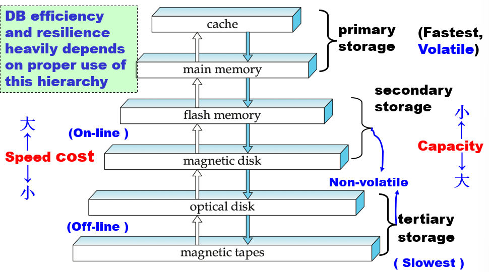
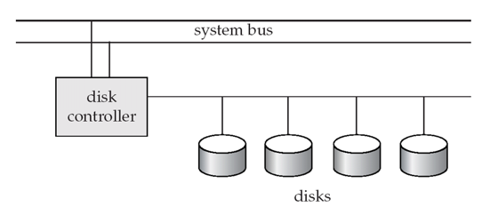
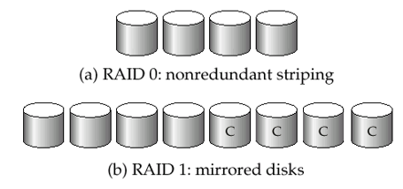
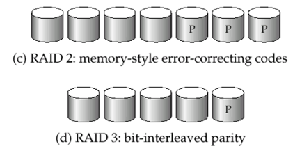
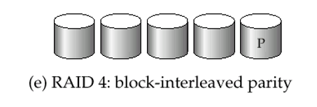
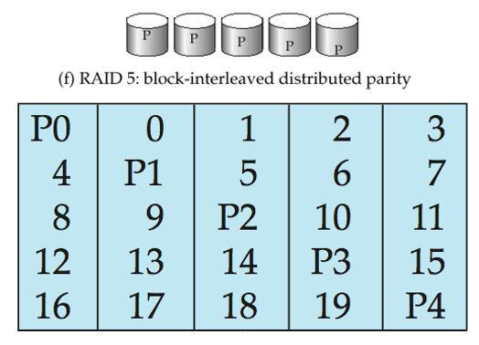
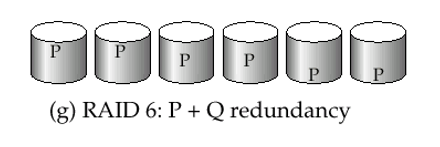

# 7 Storage and File Structure

!!! tip "说明"

    本文档正在更新中……

!!! info "说明"

    本文档仅涉及部分内容，仅可用于复习重点知识

## 1 Overview of Physical Storage Media

**物理存储介质**

### 1.1 Classification of Physical Storage Media

The physical level of database：数据库在物理存储上的实现形式，通常表现为各种文件格式（如 SQL Server 的 .mdf/.ldf，Oracle 的 .ora/.dbf 等）

1. files
2. storage

存储介质分类标准：

1. 访问速度：不同介质（如SSD、HDD、磁带）的数据读写速度差异
2. 存储成本：通常速度越快的介质单位存储成本越高
3. 可靠性考量：
      1. 易失性：断电时是否丢失数据（如RAM vs 磁盘）
      2. 设备容错：通过 RAID 等技术防止物理设备故障导致的数据丢失

#### 1.1.1 Storage Hierarchy

<figure markdown="span">
  { width="600" }
</figure>

1. Primary Storage（主存储器）：速度最快但具有易失性（如缓存、主内存）
2. Secondary Storage（辅助存储器、联机存储器）：非易失性，访问速度中等，成本较低
      - 长期存储数据（如操作系统、用户文件），是数据库和文件系统的主要存储介质
      - SSD（闪存）、机械硬盘（磁盘）
3. Tertiary Storage（三级存储器、脱机存储器）：非易失性，访问速度最慢，但容量大、成本极低，通常需要手动加载（如磁带库）
      - 归档、备份等冷数据存储场景
      - 磁带、光盘（如蓝光存储）

---

根据 reliability（可靠性）分类的存储介质：

1. 易失性存储器（Volatile Storage）：断电后数据丢失，例如 DDR2、SDR 内存
2. 非易失性存储器（Non-volatile Storage）：断电后数据仍保留
      - 包括辅助存储器（二级存储）、三级存储器，以及电池供电的主存储器

根据 speed 分类的存储介质：

1. 高速缓存（Cache）
2. 主内存（Main-memory）
3. 闪存（Flash Memory）
4. 磁盘（Magnetic-disk）
5. 光盘（Optical Storage）
6. 磁带（Tape Storage）

### 1.2 Physical Storage Media

**1.cache**：速度最快且成本最高的存储形式，具有易失性，由计算机硬件系统管理

**2.main memory**

1. 访问速度快
2. 通常容量过小（或成本过高）而无法存储整个数据库
3. 易失性：若发生断电或系统崩溃，主存储器的内容通常会丢失

**3.flash memory**：又称 EEPROM（电可擦可编程只读存储器）

1. 断电后数据仍能保存
2. 每个存储位置只能写入一次，但可擦除后重新写入。擦除操作需针对整个存储区块进行
3. 读取速度接近主内存
4. 但写入较慢，擦除更慢
5. 单位存储成本与主内存相近
6. 广泛应用于嵌入式设备，如数码相机、手机和U盘

**4.magnetic-disk**：数据通过磁记录方式存储在旋转盘片上

1. 长期数据存储的主要介质，通常存储整个数据库
2. 数据需从磁盘调入主内存才能访问，修改后需写回磁盘。访问速度远慢于主内存
3. 随机访问：与磁带不同，磁盘支持任意顺序读取数据
4. 存储容量大
5. 可靠性：
      1. 可抵御断电和系统崩溃
      2. 磁盘故障可能破坏数据，但概率极低

**5.Optical storage**：通过激光从旋转盘片光学读取数据

1. 非易失性存储
2. 主流形式：CD-ROM（640 MB）和 DVD（4.7-17 GB）
3. 一次写入多次读取（WORM）光盘用于归档存储（如 CD-R/DVD-R）
4. 也有可重复擦写版本（CD-RW/DVD-RW/DVD-RAM）
5. 读写速度比磁盘更慢
6. 自动光盘库系统（Juke-box）可管理大量可移动光盘，通过机械臂自动加载/卸载，实现海量数据存储

**6.tape storage**：主要用于备份（从磁盘故障恢复）和归档存储

1. 非易失性介质
2. 顺序访问：速度远低于磁盘
3. 超高容量
4. 磁带可脱离驱动器保存 → 存储成本远低于磁盘，但驱动器昂贵
5. 自动磁带库可存储海量数据

## 2 Magnetic Disks

<figure markdown="span">
    { width="600" }
</figure>

1. read-write head（读写磁头）：定位极其接近盘片表面（几乎接触），通过磁编码方式读取或写入信息
2. 每个盘片（platter）划分为同心圆形磁道（track），每条磁道划分为若干扇区（sector）
3. 扇区是读写的最小数据单元
4. 扇区读写过程：磁臂（disk arm）摆动使磁头定位到目标磁道，盘片持续旋转，当目标扇区经过磁头下方时完成读写
5. 磁头-盘片组件：单个主轴上安装多个盘片（通常 4-16 个），每个盘片对应一个磁头，所有磁头安装在共用磁臂上

磁盘控制器：计算机系统与磁盘驱动器硬件之间的接口

1. 接收读写扇区的高级命令
2. 执行具体操作：移动磁臂到目标磁道，实际完成数据读写
3. 为每个扇区计算并附加校验和，以验证读取数据的正确性。若数据损坏，存储的校验和与重新计算的校验和不匹配的概率极高
4. 写入验证：写入后立即回读扇区确保写入成功
5. 坏扇区重映射：将故障扇区逻辑映射到预留的物理扇区，重映射信息记录在磁盘非易失性存储器中

### 2.1 Disk Subsystem

<figure markdown="span">
  { width="400" }
</figure>

通过控制器将多个磁盘连接到计算机系统。校验和计算、坏扇区重映射等功能常由各磁盘独立完成，减轻控制器负载

disk interface standards：

1. ATA（AT 适配器）系列标准
2. SATA（串行 ATA）
3. SCSI（小型计算机系统接口）系列标准
4. SAS（串行连接 SCSI）

每种标准有多个变体（不同速度和功能）

### 2.2 Performance Measures of Disks

访问数据三阶段：

1. **寻道**（seek）：把磁头定位到正确的磁道上
      - 磁头找到正确磁道的时间被称为 **寻道时间**（seek time）
2. 等待正确的扇区旋转到读/写磁头下面，这段时间被称为 **旋转时间/旋转延时**（rotation latency/delay）。取得信息的平均延时是磁盘旋转半周所需的时间
3. 传输数据：**传输时间**，传输一块数据所需的时间。传输时间是扇区大小、旋转速度和磁道记录密度的函数

**磁盘控制器** 通常用来具体地控制磁盘以及内存之间地数据传输。这导致磁盘存取时间又多了一项 **控制器时间**（controller time），它是执行 I/O 存取操作时控制器带来地开销

简单来说：access time = seek time + rotational latency

1. data-transfer rate（数据传输率）：数据从磁盘读取或写入的速率
2. 平均故障时间（MTTF）：磁盘预期持续运行无故障的平均时间

### 2.3 Optimization of Disk-Block Access

block（磁盘块）：磁盘块是一个连续的扇区序列，来自单个磁道

1. 数据在磁盘和主存之间以块为单位进行传输
2. 块大小范围从 512 字节到几千字节不等
      - 较小的块：意味着更多的磁盘传输次数
      - 较大的块：由于部分填充的块导致空间浪费
      - 当今典型的块大小范围从 4 到 16 千字节

Disk-arm-scheduling algorithms（磁盘臂调度算法）：这些算法对等待访问磁道的请求进行排序，以最小化磁盘臂的移动

- 电梯算法（Elevator algorithm）：移动磁盘臂在一个方向上（从外向内或从内向外），处理该方向上的下一个请求，直到没有更多请求，然后改变方向并重复

File organization（文件组织）：通过组织块以对应数据将如何被访问来优化块访问时间

- 例如，将相关的信息存储在相同的或附近的柱面上
- 文件可能会随着时间变得碎片化（fragmented）
      - 例如，如果数据被插入或从文件中删除
      - 或者磁盘上的空闲块是分散的，新创建的文件会将其块分散在整个磁盘上
      - 对碎片化文件进行顺序访问会导致磁盘臂移动增加
- 一些系统具有用于整理文件系统的工具，以加快文件访问速度。但当这些工具运行时，系统通常无法使用

Nonvolatile write buffers（非易失性写缓冲区）：通过立即将数据块写入非易失性 RAM 缓冲区来加速磁盘写操作

> 非易失性 RAM：电池支持的 RAM 或闪存内存。即使电源故障，数据也是安全的，并且会在电源恢复时写入磁盘

- 控制器操作：控制器在磁盘没有其他请求或请求已经等待一段时间后将数据写入磁盘
- 数据库操作：需要在继续之前确保数据安全存储的数据库操作可以继续进行，而无需等待数据写入磁盘
- 写操作重排序：写操作可以被重新排序以最小化磁盘臂的移动

Log disk（日志磁盘）：专门用于记录块更新顺序的日志的磁盘

- 使用方式与非易失性 RAM 完全相同
- 写入日志磁盘非常快，因为不需要寻道操作

文件系统的写操作重排序：文件系统通常会重新排序写入磁盘的操作以提高性能

- Journaling file systems（日志文件系统）：将数据按安全顺序写入非易失性 RAM 或日志磁盘
- Reordering without journaling（无日志的重排序）：存在文件系统数据损坏的风险

## 3 RAID

RAID：独立磁盘冗余阵列（Redundant Arrays of Independent Disks）

RAID 是通过将多个独立磁盘组合成一个阵列的技术，提供单一磁盘的视图，同时获得更高性能

- 性能提升：通过并行使用多个磁盘，提高数据存取速度和存储容量
- 可靠性增强：通过数据冗余存储，即使某个磁盘故障也能恢复数据

随着磁盘数量增加，系统整体故障概率显著提高。冗余技术是解决这一问题的关键

RAID 通过 redundancy 提高可靠性、通过 parallelism 提升速度

### 3.1 Redundancy

**Reliability Improvement via Redundancy**

冗余：存储额外信息，可用于重建因磁盘故障丢失的数据

例如：mirroring / shadowing（镜像 / 影子技术）

- 每个磁盘都复制一份；逻辑磁盘由两个物理磁盘组成
- 每次写入操作都在两个磁盘上执行。读取操作可以从任意一个磁盘进行
- 如果镜像对中的一个磁盘故障，数据仍可从另一个磁盘获取
- 只有当磁盘故障且其镜像盘在系统修复前也发生故障时，才会导致数据丢失。这种组合事件的概率非常小，除非发生相关故障模式，如火灾、建筑物倒塌或电涌

平均数据丢失时间取决于平均故障间隔时间和平均修复时间

### 3.2 Parallelism

**Performance Improvement via Parallelism**

磁盘系统中并行化的两个主要目标：

1. 平衡多个小型访问的负载以提高吞吐量
2. 并行化大型访问以减少响应时间

通过跨多块磁盘条带化（Striping）数据来提高传输速率

1. Bit-level striping（比特级拆分）：将每个字节的比特拆分到多块磁盘上
      1. 在八块磁盘组成的阵列中，将每个字节的第 i 比特写入第 i 块磁盘
      2. 每次访问可以以单块磁盘八倍的速率读取数据
      3. 但寻道/访问时间比单块磁盘更差
      4. 比特级条带化现已较少使用
2. Block-level striping（块级拆分）：在 n 块磁盘系统中，文件的第 i 个块存放在第 (i mod n) + 1 块磁盘上
      1. 如果数据块位于不同磁盘上，对不同块的请求可以并行执行
      2. 对长序列块的请求可以并行利用所有磁盘

### 3.3 RAID Levels

通过磁盘条带化结合奇偶校验位来以较低成本提供冗余的方案。不同的 RAID 级别具有不同的成本、性能和可靠性特征

#### 3.3.1 RAID 0

- 纯块级条带化技术
- 无任何冗余机制

优势：

1. 最高存储效率（100% 磁盘空间可用）
2. 最佳性能表现（完全并行 I/O）

缺点：

1. 无容错能力（任一磁盘故障导致全部数据丢失）

适用场景：临时数据、缓存等可重建的非关键数据

<figure markdown="span">
  { width="400" }
</figure>

#### 3.3.2 RAID 1

磁盘镜像（100% 冗余）结合块级条带化

优势：

1. 最佳读取性能（可从任一镜像盘读取）
2. 高可靠性（允许单盘故障）

缺点：

1. 存储效率最低（仅 50% 空间可用）
2. 写入性能略低（需写两份数据）

典型应用：数据库事务日志等关键写入密集型工作负载

#### 3.3.3 RAID 2

- 采用内存式汉明码（Hamming Code）纠错技术
- 按比特条带化分布数据
- 需要多个磁盘专门存储校验信息

优势：可实时纠正错误

缺点：校验磁盘开销大，实际已被淘汰

<figure markdown="span">
  { width="400" }
</figure>

#### 3.3.4 RAID 3

- 单块专用校验盘存储奇偶校验信息
- 数据按比特/字节交错分布在其他磁盘

关键机制：

1. 写入时实时计算校验值（所有数据盘的 XOR）
2. 故障恢复时通过剩余数据盘和校验盘 XOR 计算重建

示例：5 盘系统中，4 盘存数据，1 盘存校验

优势：

1. 顺序读写性能优异（所有磁盘协同工作）
2. 校验效率高（单校验盘集中管理）

缺点：

1. 随机 IOPS 性能差（每次 I/O 需同步所有磁盘）
2. 校验盘可能成为瓶颈

#### 3.3.5 RAID 4

<figure markdown="span">
  { width="400" }
</figure>

- 采用块级（block-level）条带化，不同于 RAID 3 的比特/字节级
- 使用专用校验盘存储所有数据块的奇偶校验信息
- 典型配置：N + 1 块磁盘（N 块数据盘 + 1 块校验盘）

数据写入机制：

1. 每次写入数据块时都需要 2 读 2 写：
      1. 读取旧数据块和旧校验块
      2. 计算新校验块 =（旧数据 XOR 新数据）XOR 旧校验
      3. 写入新数据块和新校验块
2. 这一过程称为"读-改-写"周期，会导致写惩罚（write penalty）

数据恢复原理：

1. 利用异或（XOR）运算的可逆特性
2. 允许任意单块磁盘故障的数据恢复

优点：

1. 读取性能优秀（多数据盘可并行读取）
      - 单个块读取只需访问一个数据盘（不像 RAID 3 需要所有盘）
      - 相比非条带化存储，为多块连续读取提供更高的传输速率
2. 校验集中管理，空间效率高于镜像（RAID 1）

缺点：

1. 校验盘成为写入瓶颈（所有写入都需访问校验盘）
2. 随机写入性能差（小写入放大为多个物理 I/O）

#### 3.3.6 RAID 5

<figure markdown="span">
  { width="600" }
</figure>

- 革命性的分布式校验设计
- 摒弃 RAID 4 的专用校验盘方案
- 校验块轮转分布在所有磁盘上

优势：

1. 消除校验盘瓶颈：
      1. 写入负载均匀分布到所有磁盘：当数据块及其校验块位于不同磁盘时，块写入可以并行执行
      2. 避免 RAID 4 的校验盘热点问题
2. 保持单磁盘容错能力：
      1. 仍采用 XOR 校验机制
      2. 任意单盘故障可恢复

#### 3.3.7 RAID 6

<figure markdown="span">
  { width="400" }
</figure>

- 采用两种不同的校验计算（通常称为 P 和 Q）
- P 校验：传统的 XOR 计算（与 RAID 5 相同）
- Q 校验：基于 Reed-Solomon 编码等更复杂的算法

N + 2 磁盘架构（相比 RAID 5 的 N + 1）

RAID 6 虽然提供了更高的可靠性，但由于其显著的写入性能下降和额外的存储开销，通常仅用于云存储、医疗影像等绝对不能接受数据丢失的场景。而 RAID 5 至今仍是企业级存储系统最平衡的选择

### 3.4 Choice of RAID Level

选择 RAID 的关键考量因素：

1. 成本效益：包括初始购置成本和长期维护成本
2. 性能指标：
      1. 正常运行的 IOPS 和吞吐量
      2. 磁盘故障时的性能降级程度
      3. 重建过程的性能影响和时间
3. 可靠性需求：根据数据重要性选择适当保护级别

各级别现状分析：

1. RAID 0：仅适用于临时数据/缓存等非关键场景
2. RAID 2/4：已被更先进的方案取代（技术淘汰）
3. RAID 3：因性能问题被 RAID 5 替代
4. RAID 6：过度设计，仅用于极端关键场景