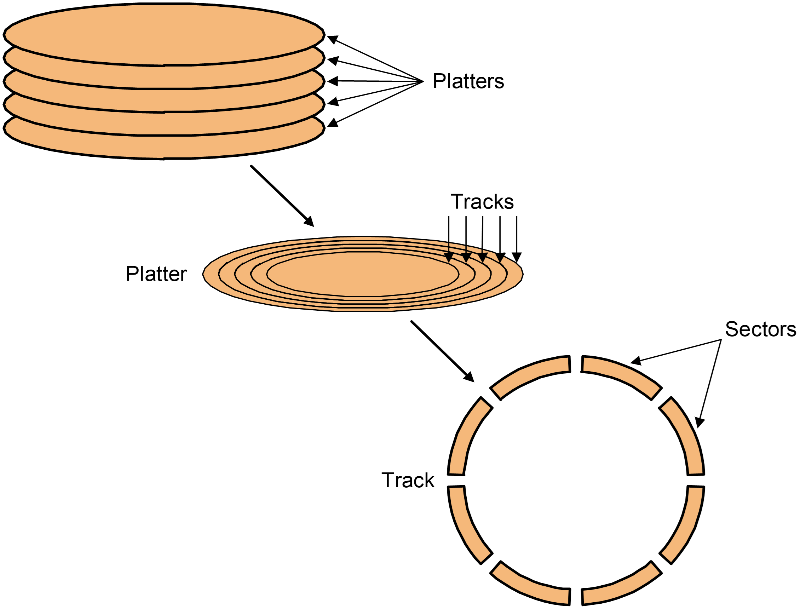
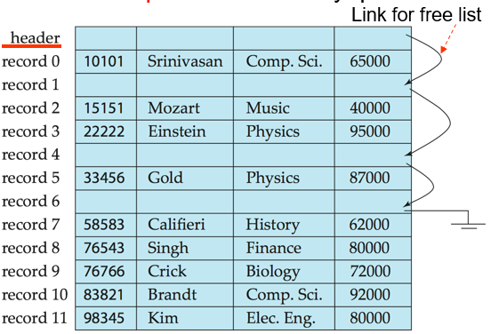
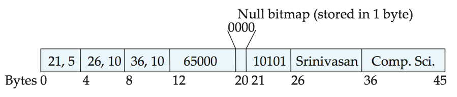
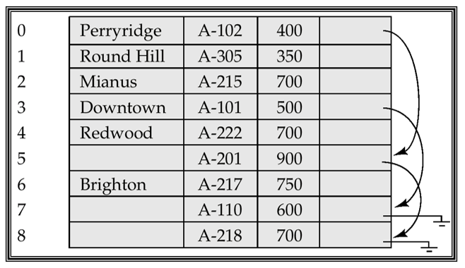
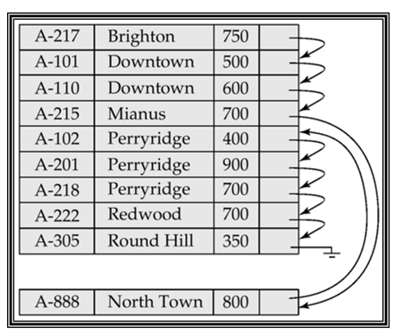
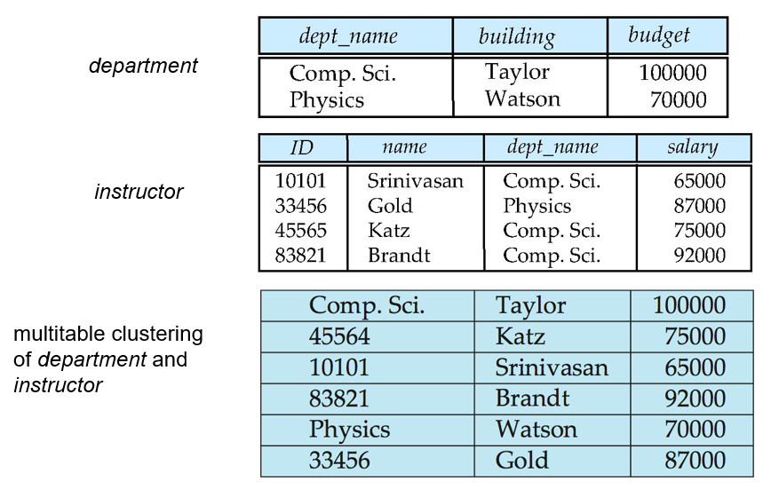
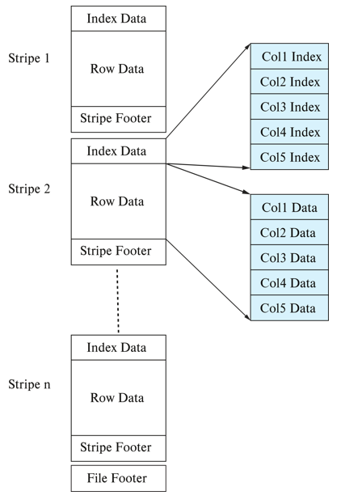

# 7 Storage and File Structure

<!-- !!! tip "说明"

    本文档正在更新中…… -->

!!! info "说明"

    本文档仅涉及部分内容，仅可用于复习重点知识

## 1 Overview of Physical Storage Media

**物理存储介质**

### 1.1 Classification of Physical Storage Media

The physical level of database：数据库在物理存储上的实现形式，通常表现为各种文件格式（如 SQL Server 的 .mdf/.ldf，Oracle 的 .ora/.dbf 等）

1. files
2. storage

存储介质分类标准：

1. 访问速度：不同介质（如SSD、HDD、磁带）的数据读写速度差异
2. 存储成本：通常速度越快的介质单位存储成本越高
3. 可靠性考量：
      1. 易失性：断电时是否丢失数据（如RAM vs 磁盘）
      2. 设备容错：通过 RAID 等技术防止物理设备故障导致的数据丢失

#### 1.1.1 Storage Hierarchy

<figure markdown="span">
  { width="600" }
</figure>

1. Primary Storage（主存储器）：速度最快但具有易失性（如缓存、主内存）
2. Secondary Storage（辅助存储器、联机存储器）：非易失性，访问速度中等，成本较低
      - 长期存储数据（如操作系统、用户文件），是数据库和文件系统的主要存储介质
      - SSD（闪存）、机械硬盘（磁盘）
3. Tertiary Storage（三级存储器、脱机存储器）：非易失性，访问速度最慢，但容量大、成本极低，通常需要手动加载（如磁带库）
      - 归档、备份等冷数据存储场景
      - 磁带、光盘（如蓝光存储）

---

根据 reliability（可靠性）分类的存储介质：

1. 易失性存储器（Volatile Storage）：断电后数据丢失，例如 DDR2、SDR 内存
2. 非易失性存储器（Non-volatile Storage）：断电后数据仍保留
      - 包括辅助存储器（二级存储）、三级存储器，以及电池供电的主存储器

根据 speed 分类的存储介质：

1. 高速缓存（Cache）
2. 主内存（Main-memory）
3. 闪存（Flash Memory）
4. 磁盘（Magnetic-disk）
5. 光盘（Optical Storage）
6. 磁带（Tape Storage）

### 1.2 Physical Storage Media

**1.cache**：速度最快且成本最高的存储形式，具有易失性，由计算机硬件系统管理

**2.main memory**

1. 访问速度快
2. 通常容量过小（或成本过高）而无法存储整个数据库
3. 易失性：若发生断电或系统崩溃，主存储器的内容通常会丢失

**3.flash memory**：又称 EEPROM（电可擦可编程只读存储器）

1. 断电后数据仍能保存
2. 每个存储位置只能写入一次，但可擦除后重新写入。擦除操作需针对整个存储区块进行
3. 读取速度接近主内存
4. 但写入较慢，擦除更慢
5. 单位存储成本与主内存相近
6. 广泛应用于嵌入式设备，如数码相机、手机和U盘

**4.magnetic-disk**：数据通过磁记录方式存储在旋转盘片上

1. 长期数据存储的主要介质，通常存储整个数据库
2. 数据需从磁盘调入主内存才能访问，修改后需写回磁盘。访问速度远慢于主内存
3. 随机访问：与磁带不同，磁盘支持任意顺序读取数据
4. 存储容量大
5. 可靠性：
      1. 可抵御断电和系统崩溃
      2. 磁盘故障可能破坏数据，但概率极低

**5.Optical storage**：通过激光从旋转盘片光学读取数据

1. 非易失性存储
2. 主流形式：CD-ROM（640 MB）和 DVD（4.7-17 GB）
3. 一次写入多次读取（WORM）光盘用于归档存储（如 CD-R/DVD-R）
4. 也有可重复擦写版本（CD-RW/DVD-RW/DVD-RAM）
5. 读写速度比磁盘更慢
6. 自动光盘库系统（Juke-box）可管理大量可移动光盘，通过机械臂自动加载/卸载，实现海量数据存储

**6.tape storage**：主要用于备份（从磁盘故障恢复）和归档存储

1. 非易失性介质
2. 顺序访问：速度远低于磁盘
3. 超高容量
4. 磁带可脱离驱动器保存 → 存储成本远低于磁盘，但驱动器昂贵
5. 自动磁带库可存储海量数据

## 2 Magnetic Disks

<figure markdown="span">
    { width="600" }
</figure>

1. read-write head（读写磁头）：定位极其接近盘片表面（几乎接触），通过磁编码方式读取或写入信息
2. 每个盘片（platter）划分为同心圆形磁道（track），每条磁道划分为若干扇区（sector）
3. 扇区是读写的最小数据单元
4. 扇区读写过程：磁臂（disk arm）摆动使磁头定位到目标磁道，盘片持续旋转，当目标扇区经过磁头下方时完成读写
5. 磁头-盘片组件：单个主轴上安装多个盘片（通常 4-16 个），每个盘片对应一个磁头，所有磁头安装在共用磁臂上

磁盘控制器：计算机系统与磁盘驱动器硬件之间的接口

1. 接收读写扇区的高级命令
2. 执行具体操作：移动磁臂到目标磁道，实际完成数据读写
3. 为每个扇区计算并附加校验和，以验证读取数据的正确性。若数据损坏，存储的校验和与重新计算的校验和不匹配的概率极高
4. 写入验证：写入后立即回读扇区确保写入成功
5. 坏扇区重映射：将故障扇区逻辑映射到预留的物理扇区，重映射信息记录在磁盘非易失性存储器中

### 2.1 Disk Subsystem

<figure markdown="span">
  { width="400" }
</figure>

通过控制器将多个磁盘连接到计算机系统。校验和计算、坏扇区重映射等功能常由各磁盘独立完成，减轻控制器负载

disk interface standards：

1. ATA（AT 适配器）系列标准
2. SATA（串行 ATA）
3. SCSI（小型计算机系统接口）系列标准
4. SAS（串行连接 SCSI）

每种标准有多个变体（不同速度和功能）

### 2.2 Performance Measures of Disks

访问数据三阶段：

1. **寻道**（seek）：把磁头定位到正确的磁道上
      - 磁头找到正确磁道的时间被称为 **寻道时间**（seek time）
2. 等待正确的扇区旋转到读/写磁头下面，这段时间被称为 **旋转时间/旋转延时**（rotation latency/delay）。取得信息的平均延时是磁盘旋转半周所需的时间
3. 传输数据：**传输时间**，传输一块数据所需的时间。传输时间是扇区大小、旋转速度和磁道记录密度的函数

**磁盘控制器** 通常用来具体地控制磁盘以及内存之间地数据传输。这导致磁盘存取时间又多了一项 **控制器时间**（controller time），它是执行 I/O 存取操作时控制器带来地开销

简单来说：access time = seek time + rotational latency

1. data-transfer rate（数据传输率）：数据从磁盘读取或写入的速率
2. 平均故障时间（MTTF）：磁盘预期持续运行无故障的平均时间

### 2.3 Optimization of Disk-Block Access

block（磁盘块）：磁盘块是一个连续的扇区序列，来自单个磁道

1. 数据在磁盘和主存之间以块为单位进行传输
2. 块大小范围从 512 字节到几千字节不等
      - 较小的块：意味着更多的磁盘传输次数
      - 较大的块：由于部分填充的块导致空间浪费
      - 当今典型的块大小范围从 4 到 16 千字节

Disk-arm-scheduling algorithms（磁盘臂调度算法）：这些算法对等待访问磁道的请求进行排序，以最小化磁盘臂的移动

- 电梯算法（Elevator algorithm）：移动磁盘臂在一个方向上（从外向内或从内向外），处理该方向上的下一个请求，直到没有更多请求，然后改变方向并重复

File organization（文件组织）：通过组织块以对应数据将如何被访问来优化块访问时间

- 例如，将相关的信息存储在相同的或附近的柱面上
- 文件可能会随着时间变得碎片化（fragmented）
      - 例如，如果数据被插入或从文件中删除
      - 或者磁盘上的空闲块是分散的，新创建的文件会将其块分散在整个磁盘上
      - 对碎片化文件进行顺序访问会导致磁盘臂移动增加
- 一些系统具有用于整理文件系统的工具，以加快文件访问速度。但当这些工具运行时，系统通常无法使用

Nonvolatile write buffers（非易失性写缓冲区）：通过立即将数据块写入非易失性 RAM 缓冲区来加速磁盘写操作

> 非易失性 RAM：电池支持的 RAM 或闪存内存。即使电源故障，数据也是安全的，并且会在电源恢复时写入磁盘

- 控制器操作：控制器在磁盘没有其他请求或请求已经等待一段时间后将数据写入磁盘
- 数据库操作：需要在继续之前确保数据安全存储的数据库操作可以继续进行，而无需等待数据写入磁盘
- 写操作重排序：写操作可以被重新排序以最小化磁盘臂的移动

Log disk（日志磁盘）：专门用于记录块更新顺序的日志的磁盘

- 使用方式与非易失性 RAM 完全相同
- 写入日志磁盘非常快，因为不需要寻道操作

文件系统的写操作重排序：文件系统通常会重新排序写入磁盘的操作以提高性能

- Journaling file systems（日志文件系统）：将数据按安全顺序写入非易失性 RAM 或日志磁盘
- Reordering without journaling（无日志的重排序）：存在文件系统数据损坏的风险

## * 3 RAID

RAID：独立磁盘冗余阵列（Redundant Arrays of Independent Disks）

RAID 是通过将多个独立磁盘组合成一个阵列的技术，提供单一磁盘的视图，同时获得更高性能

- 性能提升：通过并行使用多个磁盘，提高数据存取速度和存储容量
- 可靠性增强：通过数据冗余存储，即使某个磁盘故障也能恢复数据

随着磁盘数量增加，系统整体故障概率显著提高。冗余技术是解决这一问题的关键

RAID 通过 redundancy 提高可靠性、通过 parallelism 提升速度

### 3.1 Redundancy

**Reliability Improvement via Redundancy**

冗余：存储额外信息，可用于重建因磁盘故障丢失的数据

例如：mirroring / shadowing（镜像 / 影子技术）

- 每个磁盘都复制一份；逻辑磁盘由两个物理磁盘组成
- 每次写入操作都在两个磁盘上执行。读取操作可以从任意一个磁盘进行
- 如果镜像对中的一个磁盘故障，数据仍可从另一个磁盘获取
- 只有当磁盘故障且其镜像盘在系统修复前也发生故障时，才会导致数据丢失。这种组合事件的概率非常小，除非发生相关故障模式，如火灾、建筑物倒塌或电涌

平均数据丢失时间取决于平均故障间隔时间和平均修复时间

### 3.2 Parallelism

**Performance Improvement via Parallelism**

磁盘系统中并行化的两个主要目标：

1. 平衡多个小型访问的负载以提高吞吐量
2. 并行化大型访问以减少响应时间

通过跨多块磁盘条带化（Striping）数据来提高传输速率

1. Bit-level striping（比特级拆分）：将每个字节的比特拆分到多块磁盘上
      1. 在八块磁盘组成的阵列中，将每个字节的第 i 比特写入第 i 块磁盘
      2. 每次访问可以以单块磁盘八倍的速率读取数据
      3. 但寻道/访问时间比单块磁盘更差
      4. 比特级条带化现已较少使用
2. Block-level striping（块级拆分）：在 n 块磁盘系统中，文件的第 i 个块存放在第 (i mod n) + 1 块磁盘上
      1. 如果数据块位于不同磁盘上，对不同块的请求可以并行执行
      2. 对长序列块的请求可以并行利用所有磁盘

### 3.3 RAID Levels

通过磁盘条带化结合奇偶校验位来以较低成本提供冗余的方案。不同的 RAID 级别具有不同的成本、性能和可靠性特征

**RAID 0**

- 纯块级条带化技术
- 无任何冗余机制

优势：

1. 最高存储效率（100% 磁盘空间可用）
2. 最佳性能表现（完全并行 I/O）

缺点：

1. 无容错能力（任一磁盘故障导致全部数据丢失）

适用场景：临时数据、缓存等可重建的非关键数据

<figure markdown="span">
  { width="400" }
</figure>

**RAID 1**

磁盘镜像（100% 冗余）结合块级条带化

优势：

1. 最佳读取性能（可从任一镜像盘读取）
2. 高可靠性（允许单盘故障）

缺点：

1. 存储效率最低（仅 50% 空间可用）
2. 写入性能略低（需写两份数据）

典型应用：数据库事务日志等关键写入密集型工作负载

**RAID 2**

- 采用内存式汉明码（Hamming Code）纠错技术
- 按比特条带化分布数据
- 需要多个磁盘专门存储校验信息

优势：可实时纠正错误

缺点：校验磁盘开销大，实际已被淘汰

<figure markdown="span">
  { width="400" }
</figure>

**RAID 3**

- 单块专用校验盘存储奇偶校验信息
- 数据按比特/字节交错分布在其他磁盘

关键机制：

1. 写入时实时计算校验值（所有数据盘的 XOR）
2. 故障恢复时通过剩余数据盘和校验盘 XOR 计算重建

示例：5 盘系统中，4 盘存数据，1 盘存校验

优势：

1. 顺序读写性能优异（所有磁盘协同工作）
2. 校验效率高（单校验盘集中管理）

缺点：

1. 随机 IOPS 性能差（每次 I/O 需同步所有磁盘）
2. 校验盘可能成为瓶颈

**RAID 4**

<figure markdown="span">
  { width="400" }
</figure>

- 采用块级（block-level）条带化，不同于 RAID 3 的比特/字节级
- 使用专用校验盘存储所有数据块的奇偶校验信息
- 典型配置：N + 1 块磁盘（N 块数据盘 + 1 块校验盘）

数据写入机制：

1. 每次写入数据块时都需要 2 读 2 写：
      1. 读取旧数据块和旧校验块
      2. 计算新校验块 =（旧数据 XOR 新数据）XOR 旧校验
      3. 写入新数据块和新校验块
2. 这一过程称为"读-改-写"周期，会导致写惩罚（write penalty）

数据恢复原理：

1. 利用异或（XOR）运算的可逆特性
2. 允许任意单块磁盘故障的数据恢复

优点：

1. 读取性能优秀（多数据盘可并行读取）
      - 单个块读取只需访问一个数据盘（不像 RAID 3 需要所有盘）
      - 相比非条带化存储，为多块连续读取提供更高的传输速率
2. 校验集中管理，空间效率高于镜像（RAID 1）

缺点：

1. 校验盘成为写入瓶颈（所有写入都需访问校验盘）
2. 随机写入性能差（小写入放大为多个物理 I/O）

**RAID 5**

<figure markdown="span">
  { width="600" }
</figure>

- 革命性的分布式校验设计
- 摒弃 RAID 4 的专用校验盘方案
- 校验块轮转分布在所有磁盘上

优势：

1. 消除校验盘瓶颈：
      1. 写入负载均匀分布到所有磁盘：当数据块及其校验块位于不同磁盘时，块写入可以并行执行
      2. 避免 RAID 4 的校验盘热点问题
2. 保持单磁盘容错能力：
      1. 仍采用 XOR 校验机制
      2. 任意单盘故障可恢复

**RAID 6**

<figure markdown="span">
  { width="400" }
</figure>

- 采用两种不同的校验计算（通常称为 P 和 Q）
- P 校验：传统的 XOR 计算（与 RAID 5 相同）
- Q 校验：基于 Reed-Solomon 编码等更复杂的算法

N + 2 磁盘架构（相比 RAID 5 的 N + 1）

RAID 6 虽然提供了更高的可靠性，但由于其显著的写入性能下降和额外的存储开销，通常仅用于云存储、医疗影像等绝对不能接受数据丢失的场景。而 RAID 5 至今仍是企业级存储系统最平衡的选择

### 3.4 Choice of RAID Level

选择 RAID 的关键考量因素：

1. 成本效益：包括初始购置成本和长期维护成本
2. 性能指标：
      1. 正常运行的 IOPS 和吞吐量
      2. 磁盘故障时的性能降级程度
      3. 重建过程的性能影响和时间
3. 可靠性需求：根据数据重要性选择适当保护级别

各级别现状分析：

1. RAID 0：仅适用于临时数据/缓存等非关键场景
2. RAID 2/4：已被更先进的方案取代（技术淘汰）
3. RAID 3：因性能问题被 RAID 5 替代
4. RAID 6：过度设计，仅用于极端关键场景

写入性能对比：

1. RAID 1 优势：
      1. 直接镜像写入，只需同时写入两份数据（2 次写入）
      2. 无校验计算开销，延迟更低
      3. 特别适合数据库日志等写入密集型负载
2. RAID 5 劣势：
      1. 每次写入需要"读-改-写"过程（2 读 + 2 写）
      2. 小随机写入性能可能比单盘还差

磁盘容量增长迅速（每年 50%），而磁盘访问时间降低有限（10 年仅提高 3 倍），I/O 需求大幅增加（如 Web 服务器），当购买的磁盘数量已满足 I/O 速率需求时，通常会有剩余存储容量，因此采用 RAID 1 通常不会增加额外经济成本

- RAID 5 适用于更新频率低、数据量大的应用场景
- 其他应用场景均推荐使用 RAID 1

### 3.5 Hardware Issues

1. Software RAID：完全通过软件实现的 RAID 方案，无需特殊硬件支持
2. Hardware RAID：需要专用硬件支持的 RAID 实现
      1. 使用非易失性内存（NVRAM）记录正在执行的写入操作
      2. 注意：写入过程中的断电可能导致磁盘数据损坏
          1. 例如在镜像系统中，写完第一个块但第二个块尚未写入时发生断电
          2. 恢复供电后必须检测此类数据损坏
          3. 数据损坏恢复流程与磁盘故障恢复类似
          4. 非易失性内存有助于高效识别可能损坏的数据块
          5. 否则必须读取磁盘所有块并与镜像/校验块进行比对

Latent failures（潜在故障）：先前成功写入的数据发生损坏，可能导致即使仅单磁盘故障也会造成数据丢失

Data scrubbing（数据巡检）：持续扫描检测潜在故障，并通过副本/校验数据进行恢复

Hot swapping（热插拔）：在系统运行状态下更换磁盘，无需关机，部分硬件 RAID 系统支持此功能，显著缩短恢复时间，极大提高可用性

在线备用磁盘：许多系统配置在线备用磁盘，在检测到故障时立即自动替换，大幅缩短恢复时间

高可用设计：优质硬件 RAID 系统通过以下方式确保单点故障不会影响系统运行：

- 配备电池备份的冗余电源
- 多控制器与多重互连设计，防止控制器/连接故障

## * 4 Tertiary Storage

### 4.1 Optical Disks

1. 只读光盘存储器（CD-ROM）
      1. 平均寻道时间约 100 毫秒（光学读取头较重且速度较慢）
2. 数字视频光盘（DVD）
      1. 寻道时间较慢，原因与 CD-ROM 相同
3. 一次性刻录版本（CD-R/DVD-R）应用广泛
      1. 数据只能写入一次，不可擦除
      2. 高容量和长寿命，适用于档案存储

### 4.2 Magnetic Tapes

1. 存储容量大且传输速率高
2. 磁带本身便宜，但驱动器成本非常高
3. 与磁盘和光盘相比访问速度非常慢
4. 主要用于备份、存储不常用信息，以及作为系统间离线传输数据的介质
5. 磁带库用于超大规模存储

## 5 Storage Access

数据库文件在逻辑上被划分为固定长度的存储单元，称为块（Block）。块是数据库系统中存储分配和数据传输的基本单位

缓冲区（Buffer）：主内存 RAM 中用于存储磁盘块副本的部分

- 用于缓存磁盘块，减少直接访问磁盘的次数，提高性能
- 数据库系统会尽量让频繁访问的数据块驻留在缓冲区中

缓冲区管理器（Buffer Manager）：负责在主内存中分配缓冲区空间的子系统

- 缓冲区大小有限，无法缓存所有数据块，因此需要缓冲区管理器来优化内存分配
- 缓冲区管理器决定哪些块保留在内存，哪些块被替换（如采用 LRU、FIFO 等算法）

核心概念：

- 页（Page）：数据的逻辑单位，DBMS 以页为单位管理数据（如读取、修改）。
- 块（Block）：磁盘存储的物理单位，通常与页大小一致（例如 4KB、8KB）。
- 帧（Frame）：缓冲池中的存储单元，用于缓存磁盘页

关键点：

1. 数据操作依赖内存：DBMS 只能直接操作 RAM 中的数据，因此缓冲池是性能优化的核心
2. 映射表维护：通过 <帧, 页 ID> 表记录缓冲池中哪些页已被缓存，避免重复加载
3. 替换策略的重要性：高效的策略（如 LRU）能减少磁盘 I/O，提升性能

### 5.1 Buffer Manager

工作流程：

1. 检查请求：首先检查请求的数据块是否已在缓冲区
2. 命中处理：若在缓冲区（命中），直接返回内存地址
3. 未命中处理：若不在缓冲区（未命中），执行以下步骤：
      1. 空间分配：通过替换算法（如 LRU）选择牺牲页
      2. 写回判断：仅当牺牲页被修改过（dirty）才写回磁盘
      3. 数据读取：将请求的块从磁盘读入缓冲区
      4. 地址返回：将新加载块的内存地址返回给请求者

Buffer-Replacement Policies：LRU，MRU

Pinned block（固定块）：不允许被写回磁盘的内存块（如当前正在使用的块）

toss-immediate strategy（立即丢弃策略）：当一个块的最后一个元组被处理后立即释放其占用的空间

强制写回块：请求者必须解除块的固定状态，并指明该页是否被修改。使用脏位（Dirty bit）来标记

缓冲池中的页可能被多次请求（被多个事务使用）：使用引用计数（pin count），只有当引用计数 = 0 时，页才能被替换

### 5.2 Buffer-Replacement Policies

1. LRU（Least Recently Used，最近最少使用）：替换最近最少被使用的块
      1. 对顺序扫描/循环访问模式表现不佳
2. MRU（Most Recently Used，最近最常用）：优先替换最近被使用过的块
      1. 适用于顺序扫描操作
      2. 处理时固定（pin）当前块，处理完成后解除固定（unpin）并标记为 MRU

使用 mixed strategy（混合策略）：查询优化器提供访问模式提示，预测查询的缓冲区需求，动态调整替换策略

1. 对索引查找使用 LRU
2. 对全表扫描使用 MRU
3. 对数据字典采用固定驻留

## 6 File Organization

- 数据库以文件集合的形式存储
- 每个文件由一系列记录（records）组成
- 每条记录由若干字段（field）组成

record 分为两种类型：

1. fixed-length records
2. variable-length records

### 6.1 Fixed-Length Records

第 i 条记录的起始位置 = 记录长度 x (i - 1)

记录可能跨越块边界，解决方案：强制记录对齐块边界（不允许记录跨越块边界）

删除记录 i 的方法：

1. 移动 i + 1 及之后的所有记录
2. 将最后一条记录移动到 i 的位置
3. 不移动记录，而是将所有空闲记录链接成空闲列表（free list）

#### 6.1.1 Free List

在 file header（文件头）存储第一条被删除记录的地址（文件头还包含其他信息）

链式存储结构：每个空闲记录存储下一个空闲记录的位置

<figure markdown="span">
  { width="600" }
</figure>

### 6.2 Variable-Length Records

变长记录产生场景：

1. 多态存储：同一文件存储不同结构的记录（如员工和学生记录混存）
2. 变长字段：如 VARCHAR(100)、TEXT 等类型
3. 历史遗留：早期数据库支持的重复字段（数组式存储）

存储结构设计：

1. 固定部分
      1. 定长属性连续存储
      2. 每个便变长属性用 (offset, length) 二元组表示
2. 变长部分
      1. 所有变长数据集中存储在固定部分之后
      2. 通过偏移量快速定位

空值用空值位图表示

1. 使用位图（bitmap）标记空值
2. 每个 bit 对应一个属性（1 表示 NULL）
3. 下图中 "0000" 表示前 4 个属性均非空
4. 显著节省空间（相比用特殊值标记 NULL）

<figure markdown="span">
  { width="600" }
</figure>

### 6.3 Slotted Page Structure

**槽页**

<figure markdown="span">
  { width="600" }
</figure>

结构布局：

1. 头部区域：
      1. 存储元信息：记录数、空闲空间偏移量
      2. 维护槽位数组：每个槽位存储 [记录偏移量, 记录长度]
2. 记录区域：
      1. 实际记录从页尾部向前生长
      2. 空闲空间位于头部和记录区之间

关键机制：

1. 动态整理：删除记录时，通过移动后续记录消除碎片
2. 间接寻址：所有外部引用通过槽位号访问，物理位置变化不影响逻辑指针
3. 空间管理：Free Space 指针动态分割/合并空闲区域

### 6.4 Fixed-Length Representation

定长表示法：

1. reserved space
2. pointers

#### 6.4.1 Reserved Space

使用已知最大长度的定长记录，较短记录未使用的空间用空值或记录结束符填充

<figure markdown="span">
  { width="600" }
</figure>

#### 6.4.2 Pointer Method

- 将逻辑上的变长记录拆分为多个定长"记录段"
- 每个记录段包含：
      - 实际数据字段
      - 指向下一个记录段的指针
- 形成单向链表结构

即使不知道记录的最大长度也能使用

<figure markdown="span">
  { width="600" }
</figure>

缺点：在上图中，链式结构中除首记录外，其他记录的 branch-name 字段空间都被浪费

解决方案：在文件中使用两种块类型：

1. 锚块（Anchor block）：存储链的首记录
2. 溢出块（Overflow block）：存储链的非首记录

<figure markdown="span">
  { width="600" }
</figure>

## * 7 Organization of Records in FIles

1. 堆文件（Heap File）：记录可以存放在文件中任何有空间的位置
2. 顺序文件（Sequential File）：根据记录的搜索键值按顺序存储记录
3. 散列文件（Hashing File）：通过对记录的某个属性计算哈希值，决定记录应存放在文件的哪个块中
4. 聚集文件组织（Clustering File Organization）：不同关系的记录可以存储在同一文件中
      - 设计动机：将不同关系中相关联的记录存储在同一个块上，以最小化 I/O 操作

### 7.1 Sequential File Organization

适用于需要顺序访问整个文件。文件的 records 通过 search-key 排序

<figure markdown="span">
  { width="600" }
</figure>

- Deletion：使用 pointer chains
      - 不立即物理删除，而是标记为 "已删除"（逻辑删除）
      - 通过指针链跳过已删除记录
- Insertion：寻找 record 可以被插入的地方，并更新 pointer chains
      - 如果有空闲空间，插入
      - 如果没有空闲空间，将 record 插入到一个 overflow block

需要定期对文件重新排序

<figure markdown="span">
  { width="600" }
</figure>

> 新记录"A-888"本应按字母序位于"Perryridge"前，因原位置无空间，暂存溢出块

### 7.2 Multi-table Clustering File Organization

通过使用一个多表聚集将不同的表存储在同一文件中

<figure markdown="span">
  { width="600" }
</figure>

优点：适合某些连接查询，以及查询单个部门及其教师的操作

缺点：不适合仅涉及部门表的查询

会产生变长记录

可以添加指针链来链接特定关系的记录

<figure markdown="span">
  { width="600" }
</figure>

## * 8 Data-Dictionary Storage

data-dictionary（或 system catalog）存储 metadata：

1. 有关 relations 的信息
      1. name
      2. 每个 relation 属性的 name 和 type
      3. views 的 name 和定义
      4. integrity constraints
2. user 和 accounting 的信息，包括密码
3. 静态和描述性数据
      1. 每个 relation 的 tuple 的数量
4. 物理结构文件组织的信息
      1. relation 的存储方法
      2. relation 的物理地址
          1. 操作系统文件名
          2. 包含关系记录的磁盘块地址 
5. indices 的信息

### 8.1 Relational Representation of System Metadata

<figure markdown="span">
  { width="600" }
</figure>

### 8.2 Column-Oriented Storage

也称 columnar representation

分别存储一个 relation 的每个属性

<figure markdown="span">
  { width="600" }
</figure>

优点：

1. 当只需访问部分属性时减少 I/O 操作
2. 提升 CPU 缓存命中率
3. 增强数据压缩效率
4. 适配现代 CPU 架构的向量化处理

缺点：

1. 从列式重建元组的开销
2. 元组删除和更新成本较高
3. 数据解压缩开销

实践证明列式存储比行式存储更适合决策支持系统，传统行式存储更适合事务处理场景

部分数据库同时支持两种存储格式，称为行列混合存储（hybrid row/column stores）

#### 8.2.1 Columnar File Representation

- ORC 与 Parquet：文件内部采用列式存储的文件格式
- 在大数据应用中非常流行

<figure markdown="span">
  { width="400" }
</figure>

## Homework

???+ question "课本 12.13"

    Suppose you have data that should not be lost on disk failure, and the application is write-intensive. How would you store the data?

    ??? success "答案"

        由于是写入密集型的数据库应用，我会优先选择 RAID 1

        RAID 1 的优势：
        
        1. 直接镜像写入，只需同时写入 2 份数据
        2. 无校验计算开销，延迟更低
        3. 特别适合写入密集型负载
        
        同时 RAID 1 是 100 % 冗余，拥有高可靠性，可在一定程度上防止磁盘故障而导致的数据丢失问题（允许单盘故障）

???+ question "课本 13.11"

    List two advantages and two disadvantages of each of the following strategies for storing a relational database:

    a. Store each relation in one file. 
    b. Store multiple relations (perhaps even the entire database) in one file.

    ??? success "答案"

        a. store each relation in one file.

        - 优点：
              1. 文件管理简单方便：每个表对应一个独立文件，备份、迁移单个表等操作比较容易
              2. 不同表可以并行访问：在多用户同时访问不同表的场景下，不同表的 I/O 操作可以并行化
        - 缺点：
              1. 跨表查询性能较低：如果需要跨表查询的话，需要频繁打开或关闭多个文件，增加系统开销
              2. 存储空间利用率低：如某一个表的内容相较于其他表内容很少，但也需要占用一个最小分配单元，存在浪费空间的问题

        b. Store multiple relations (perhaps even the entire database) in one file.

        - 优点：
              1. 跨表操作高效：表连接操作可以在同一个文件内完成，减少 I/O 开销
              2. 整体管理简便：因为多个表都在同一个文件当中，因此需要备份等操作时，只需要处理单个文件，事务管理更简单
        - 缺点：
              1. 维护数据难度大：单个文件损坏可能导致整个数据库不可用
              2. 存在并发限制：所有表共享相同的 I/O 通道，大量并发写入时容易出现问题
