# 8 Indexing and Hashing

!!! tip "说明"

    本文档正在更新中……

!!! info "说明"

    本文档仅涉及部分内容，仅可用于复习重点知识

## 1 Basic Concepts

- index（索引）的作用：索引是为了提高数据检索效率而设计的，类似于图书馆的作者目录可以帮助快速找到书籍
- 索引机制：通过建立特定的数据结构，可以避免每次查询都扫描整个数据文件
- search key（搜索键）：这是建立索引的依据，可以是一个字段（如"作者姓名"）或多个字段的组合
- 索引结构：每个 index entry 包含两部分
      1. search key
      2. pointer：指向实际数据记录的指针
- 空间效率：index files 只包含键值和指针，因此比存储完整数据的原始文件要小得多

index 的类型：

1. ordered indices（顺序索引）：index entry 按照键值排序存储（如字母顺序、数值大小等）
      - 优点：支持高效的范围查询和有序遍历
      - 实现：B+ 树
2. hash indices（散列索引）：index entry 通过 hash function 将 search key 映射到固定数量的 buckets（桶）中，每个桶包含若干个 index entry
      - 优点：对精确查询效率极高
      - 缺点：不支持范围查询，且哈希冲突可能影响性能

### 1.1 Index Evaluation Metrics

支持的查询类型：

1. 精确匹配查询（如 `WHERE id = 100`）：散列索引效率极高
2. 范围查询（如 `WHERE age BETWEEN 20 AND 30`）：顺序索引支持高效范围扫描，而散列索引无法直接支持

性能指标：

1. access time：从索引中检索数据的速度
2. insertion time
3. deletion time
4. space overhead（空间开销）：索引占用的额外存储空间

## 2 Ordered Indices

- Sequentially ordered file（顺序排序文件）：数据文件本身已按搜索键物理排序
- Primary index / clustering index（主索引 / 聚集索引）：索引顺序与数据文件物理顺序一致
- Index-sequential file（索引顺序文件）：顺序文件 + 主索引的组合结构
- Secondary index / non-clustering index（辅助索引）：索引顺序独立于数据物理存储顺序

Ordered Indices 的类型：

1. Dense index（稠密索引）：每个数据记录都对应一个索引条目
2. Sparse index（稀疏索引）：仅部分记录（如块/页的首记录）建立索引条目

### 2.1 Dense Index Files

Dense index：每个数据记录都对应一个索引条目

<figure markdown="span">
  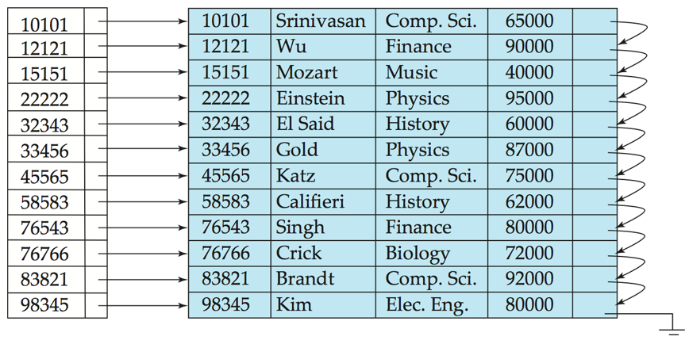{ width="600" }
</figure>

<figure markdown="span">
  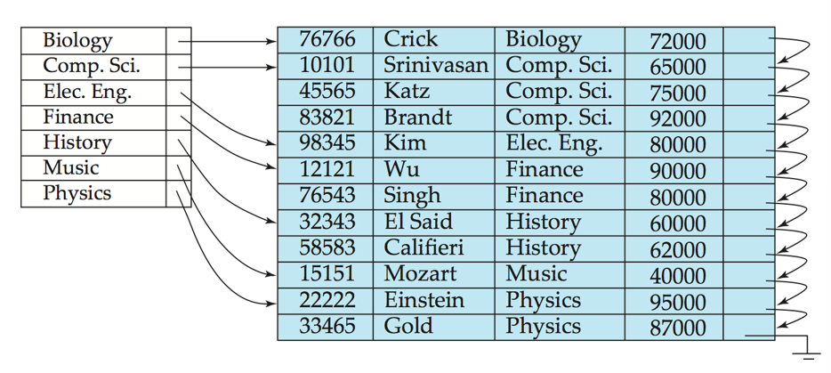{ width="600" }
</figure>

### 2.2 Sparse Index Files

Sparse Index：

- 仅部分记录（如块/页的首记录）建立索引条目
- 每个索引条目对应一个有序数据块（block）
- 要求数据文件本身必须按搜索键物理有序排列

定位搜索键值为 K 的记录的方法：

1. 找到 search key 值小于 K 的最大索引条目
2. 从该索引条目指向的记录开始，在文件中顺序搜索

<figure markdown="span">
  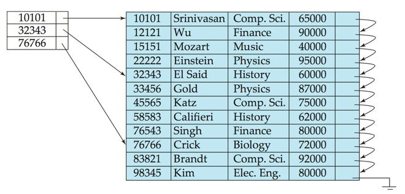{ width="600" }
</figure>

!!! tip "与 Dense index 比较"

    1. Sparse Index 占用更少的空间，插入和删除操作的维护开销更低
    2. Sparse Index 定位记录的速度通常比 dense index 慢
    3. Sparse Index 只能用于顺序文件，而稠密索引既可用于顺序文件也可用于非顺序文件（如构建非顺序文件的索引）

Good tradeoff：为文件中的每个数据块建立一个索引条目，对应块中的最小搜索键值（一个块通常包含多条数据记录，将每块的最小搜索键值存入索引项）

### 2.3 Secondary Indices

实际应用中，常有多种属性作为查询条件

我们可以为每个搜索键值创建一个 secondary index，该索引记录指向包含指向所有具有该特定搜索键值的实际记录的指针的桶

<figure markdown="span">
  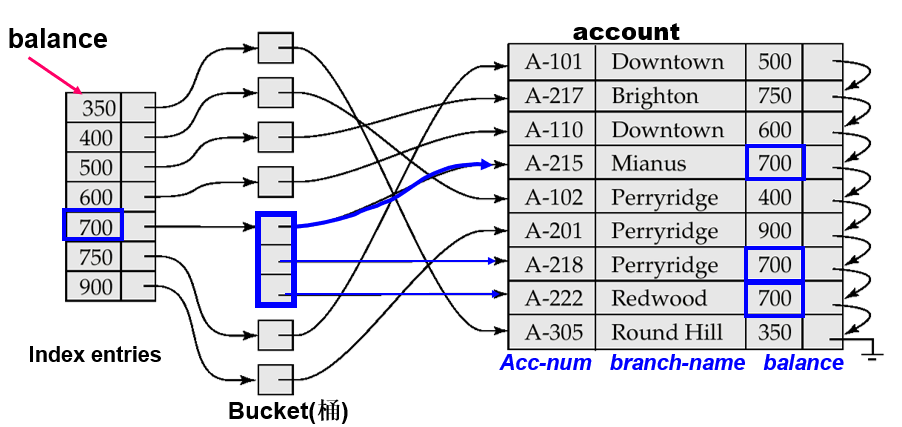{ width="600" }
</figure>

辅助索引不能使用稀疏索引，每条记录都必须有指针指向。但 search key 常存在重复项，而 index entry 不能有重复，否则查找算法复杂化，为此，使用 bucket 结构

范围查询：

<figure markdown="span">
  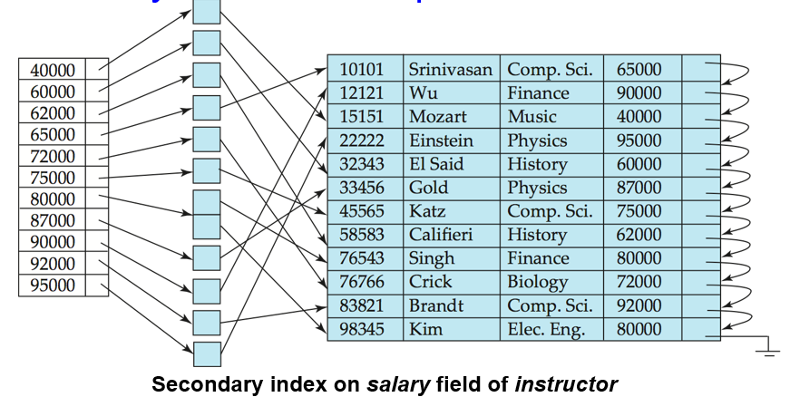{ width="600" }
</figure>

### 2.4 Multilevel Index

当主索引（primary index）过大无法完全载入内存时，每次查询需要多次磁盘 I/O，性能较差

- 将主索引视为"数据文件"，在其上建立更高层次的稀疏索引（outer index，外层索引）
- 外层索引只需要存储主索引块的起始键值，因此体积更小
- 搜索时先在外层索引定位，再到 inner index（内层索引）定位，最后到数据文件

可以递归地创建更多层级（三级、四级等），直到最顶层的索引能放入内存。但任何数据修改（插入/删除）都需要同步更新所有相关层级的索引

<figure markdown="span">
  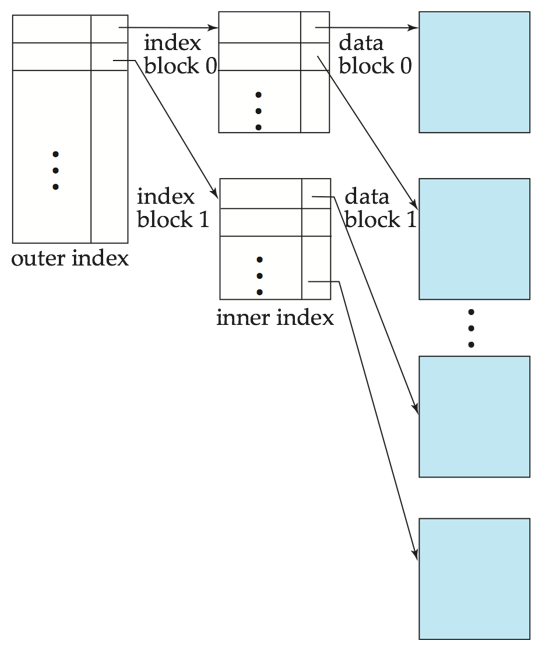{ width="600" }
</figure>

### 2.5 Index Update

#### 2.5.1 Deletion

1. 先删除数据文件中的实际记录
2. 再同步更新所有相关的索引结构

**case 1: Dense index**

1. 唯一键值记录：直接删除整个索引条目（因为键值已不存在）
2. 非唯一键值记录：
      1. 辅助索引（如二级索引）：从索引条目的指针列表中移除被删除记录的指针
      2. 主索引：
          1. 如果删除的是索引直接指向的记录（通常是该键值的第一条记录），则更新指针指向下一条记录
          2. 如果删除的不是索引直接指向的记录（如链表后续记录），则无需修改索引

<figure markdown="span">
  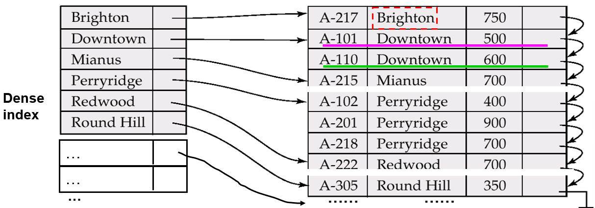{ width="400" }
</figure>

<figure markdown="span">
  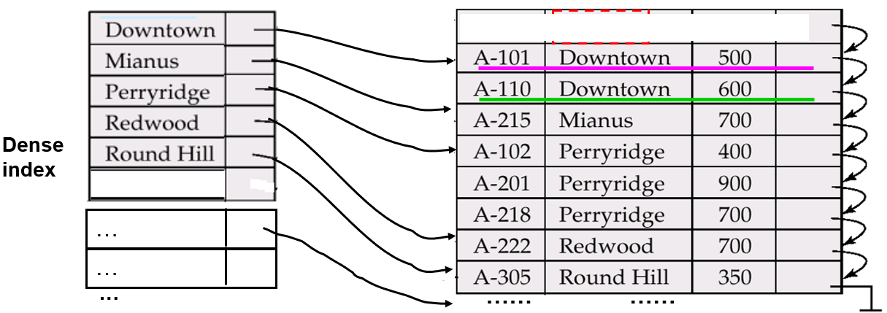{ width="400" }
</figure>

**case 2: Sparse index**

1. 如果删除的记录的 search key 没有出现在 index 中，则无需修改 index
2. 如果删除的记录的 search key 出现在 index 中
      1. 用数据文件中​​下一个搜索键值​​（按搜索键顺序）替换当前索引项
      2. 若“下一个搜索键值”​​已有索引项​​，则直接删除原索引项（而非替换）

<figure markdown="span">
  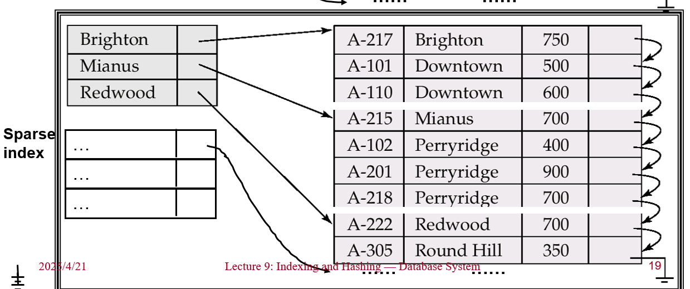{ width="400" }
</figure>

<figure markdown="span">
  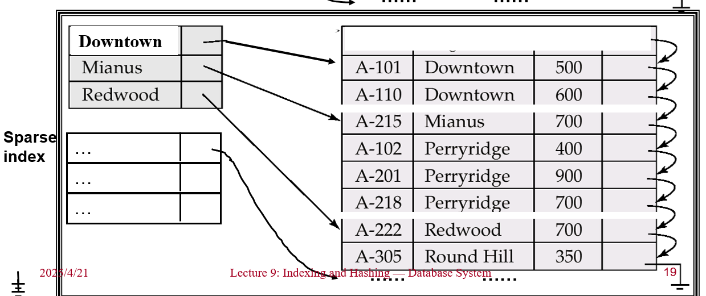{ width="400" }
</figure>

多级索引扩展​​：从最底层索引开始逐级向上处理，每一层的逻辑与上述单层稀疏索引相同

#### 2.5.2 Insertion

利用索引找到插入位置，在数据文件中插入记录，然后分别根据情况来修改索引

单层索引插入：

1. dense index
      1. 如果 search key 没有出现在 index 中，插入新的 index entry
      2. 如果 search key 出现在 index 中
          1. 如果有多个指针，则增加一个指向新记录的指针
          2. 否则，无需修改索引
2. Sparse index
      1. 如果增加了一个新的 block，插入一个指向新 block 的第 1 个 search key 的索引项
      2. 如果新记录的 search key 的值是所在 block 的最小值，更新索引项
      3. 否则，无需修改索引

<figure markdown="span">
  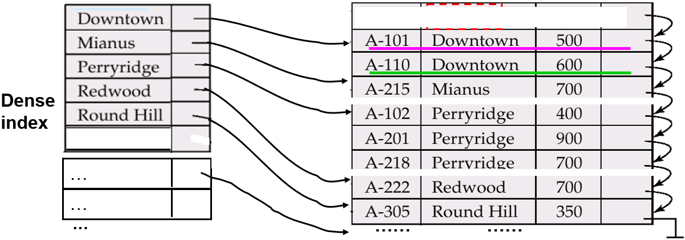{ width="400" }
</figure>

<figure markdown="span">
  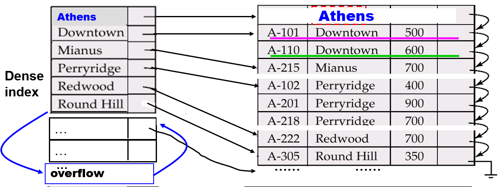{ width="400" }
</figure>

<figure markdown="span">
  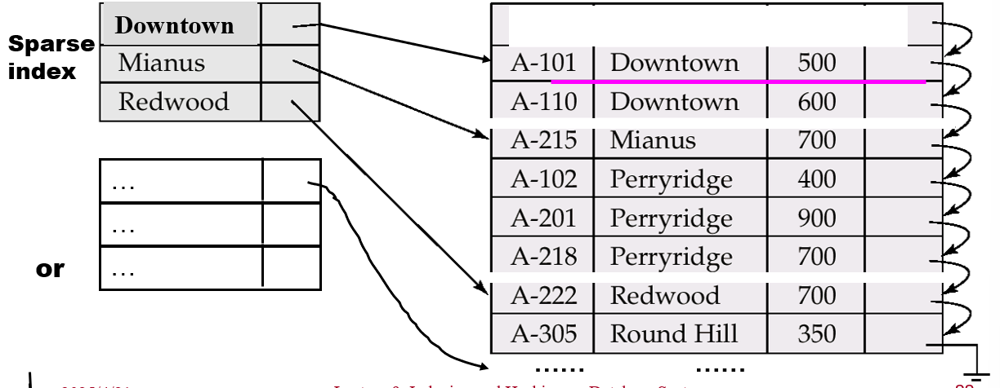{ width="400" }
</figure>

<figure markdown="span">
  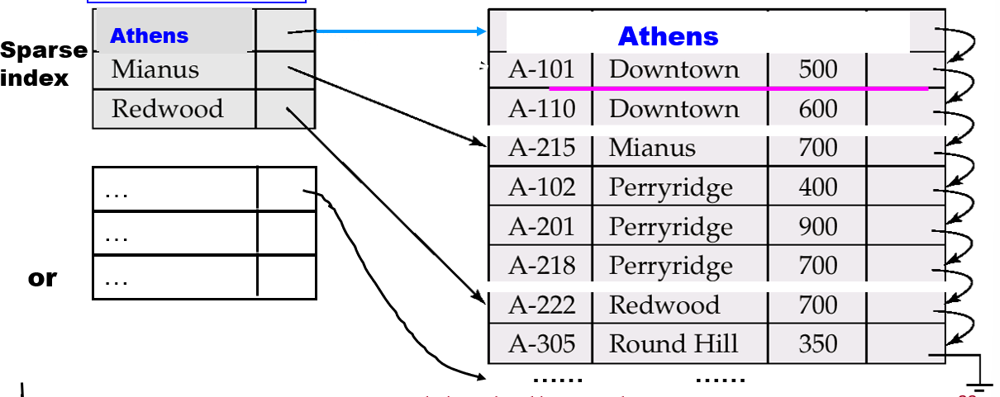{ width="400" }
</figure>

### 2.6 Primary and Secondary Indices

索引在搜索记录时具有显著优势。​​​但是更新索引会增加数据库修改的开销。当文件被修改时，其上的所有索引都必须更新

​​主索引的顺序扫描高效​​，但​​二级索引的顺序扫描代价高昂​​

## 3 B+ Tree Index Files

B⁺ 树索引是索引顺序文件（indexed-sequential files）的替代方案

索引顺序文件的缺点：

1. 随着文件增大，性能下降（因为会产生大量溢出块）
2. 需要定期对整个文件进行重组

B⁺ 树索引文件：

- 优点：在插入和删除时，能通过​​局部小范围调整​​自动重组，无需整体重组即可维持性能
- （较小）缺点：额外的插入/删除开销；一定的空间开销

B⁺ 树的​​优点远大于缺点​​，因此被​​广泛应用​​

### 3.1 B+ Tree

[ADS 中的 B+ Tree](../ADS/ch2.md#2-b-trees){:target="_blank"}

> 注意：数据库系统中对 B+ Tree 的定义和 ADS 中的不一样

一个 order 为 N 的 B+ Tree 有以下性质：

1. 根结点是叶结点或者有 2 ~ N 个孩子
2. 所有的非叶结点（除了根结点）有 $\lceil \frac{N}{2} \rceil \sim N$ 个孩子
3. 所有的叶结点具有相同的 depth
4. 叶结点上键值的个数为 $\lceil \frac{N - 1}{2} \rceil \sim N - 1$

<figure markdown="span">
  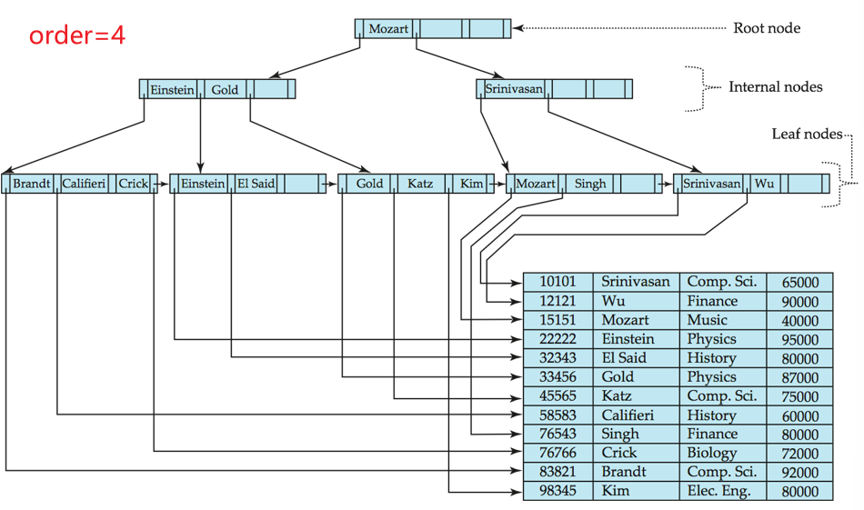{ width="800" }
</figure>

- 由于节点间通过指针连接，"逻辑上"相邻的块在"物理上"不需要相邻存储
- B+ 树的非叶节点层级构成了多级稀疏索引的层次结构
- B+ 树通常只有较少的层级（与主文件大小的对数成正比），因此可以高效执行搜索操作
- 对主文件的插入和删除操作也能高效处理，因为索引可以在对数时间内完成重组

B+ Tree 的插入和删除操作见[ADS 中的 B+ Tree](../ADS/ch2.md#2-b-trees){:target="_blank"}

### 3.2 Non-Unique Search Keys

**非唯一搜索键**

1. 独立桶存储（不推荐）：将重复键值存储在单独的磁盘块中问题。导致额外的 I/O 操作，破坏数据局部性
2. 指针列表方案：每个键值对应一个指针链表
      1. 优点：节省空间
      2. 缺点：长链表需要特殊处理（可能需分块存储），删除记录需遍历整个链表
3. 唯一化方案（主流方法）：在原搜索键后追加记录 ID
      1. 优势：将非唯一键转化为唯一键，可直接复用 B+ 树等唯一键索引结构
      2. 代价：每个索引条目增加几个字节存储 row_id

### 3.3 B+ Tree File Organization

<figure markdown="span">
  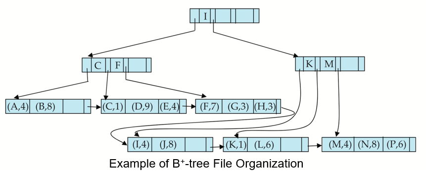{ width="800" }
</figure>

## * 4 B Tree Index Files

B 树允许键值在非叶节点中重复出现（即搜索键值可能出现在内部节点和叶节点中），而 B+ 树的所有键值只出现在叶节点，内部节点仅作为导航路径

<figure markdown="span">
  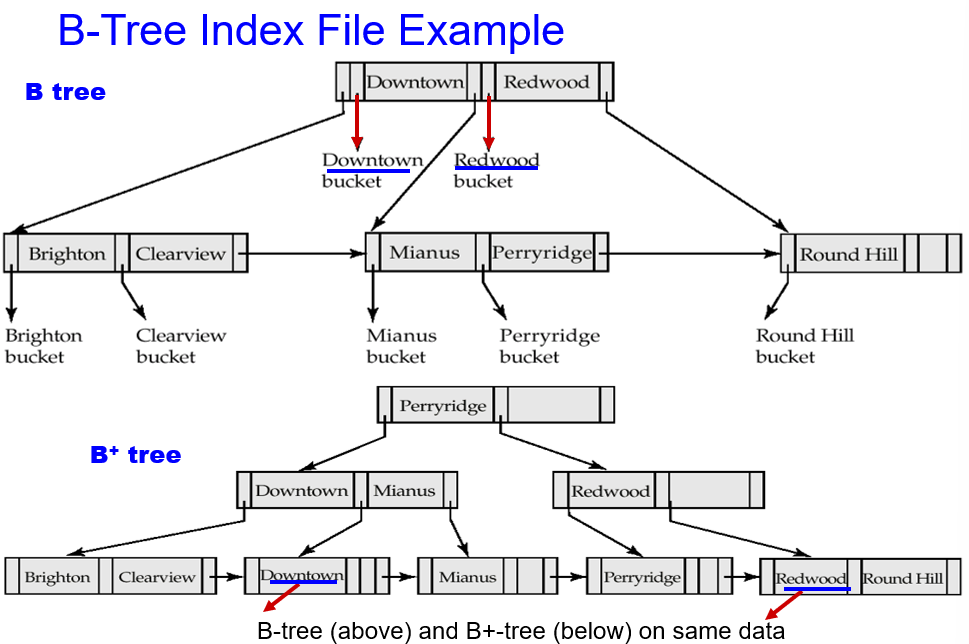{ width="800" }
</figure>

优点：

1. 节点更少：由于键值可能在内部节点直接找到，某些情况下可以减少总节点数
2. 提前终止搜索：若在内部节点命中目标键值，无需遍历到叶节点即可返回结果

缺点：

1. 深度更大：非叶节点存储实际数据导致扇出（子节点数）减少，树的高度增加，可能影响查询效率
2. 操作复杂：插入和删除需要处理键值在多层节点的分布，逻辑更复杂
3. 实现难度：需同时维护内部节点和叶节点的数据一致性

通常，B 树的优点无法抵消其缺点

## * 5 Static Hashing

- 桶（bucket）是存储单位，包含一个或多个记录（通常一个桶对应一个磁盘块）
- 在哈希文件组织中，我们通过哈希函数直接从记录的搜索键值（search-key value）获取其对应的桶
- 哈希函数 h 是从所有搜索键值集合 K 到所有桶地址集合 B 的映射
- 哈希函数用于定位记录以进行访问、插入和删除操作
- 不同搜索键值的记录可能被映射到同一个桶中，因此必须顺序搜索整个桶才能定位特定记录

### 5.1 Hash Function

1. Worst hash function：将所有搜索键值映射到同一个桶，导致访问时间与文件中搜索键值的数量成正比（退化为线性搜索）
2. Ideal hash function：

   - uniform（均匀的）：即每个桶被分配相同数量的搜索键值（基于所有可能的键值集合）
   - random（随机的）：因此无论文件中搜索键值的实际分布如何，每个桶分配到的记录数量大致相同

Typical hash function：会对搜索键值的内部二进制表示进行计算。例如，对于字符串类型的搜索键，可以将其所有字符的二进制值相加，然后对桶数量取模，得到最终的哈希值

### 5.2 Handling of Bucket Overflows

Bucket overflow（桶溢出）的原因

1. 桶数量不足（Insufficient buckets）
2. 数据分布倾斜（Skew in distribution of records）

   1. 多个记录具有相同的搜索键值（如大量重复数据）
   2. 哈希函数选择不当，导致键值分布不均匀（如某些桶被频繁映射）

虽然可以通过优化减少桶溢出的概率，但无法完全避免，通常使用溢出桶（Overflow Buckets）来解决该问题

使用 overflow chaining（溢出链）：给定桶的所有溢出桶通过链表连接在一起

上述方案被称为 closed hashing（封闭哈希）

> 另一种称为 open hashing（开放哈希）的方案不使用溢出桶，但不适合数据库应用

<figure markdown="span">
  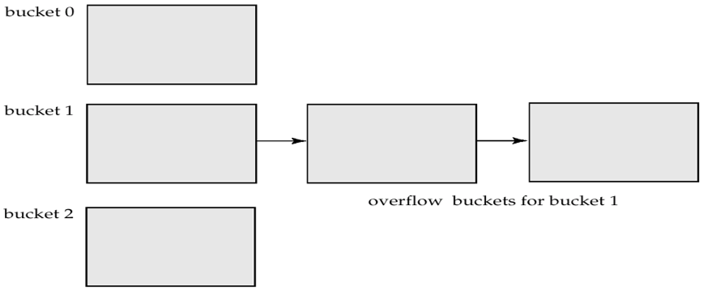{ width="600" }
</figure>

### 5.3 Hash Indices

哈希索引是通过哈希表实现的索引结构，它将：

- 搜索键（如 ID、姓名等）通过哈希函数映射到特定位置
- 每个位置存储指向实际数据记录的指针

严格来说，哈希索引总是二级索引

<figure markdown="span">
  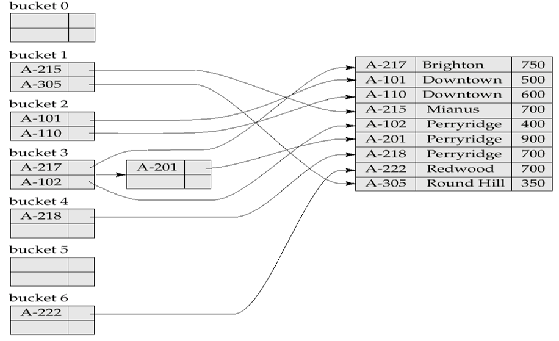{ width="600" }
</figure>

### 5.4 Deficiencies of Static Hashing

静态哈希的核心问题是其"静态性"：

- 固定桶数量：一旦初始化后无法改变
- 缺乏弹性：无法适应数据量的动态变化

一个解决方案是定期使用新的哈希函数重新组织文件，但这样做代价很高。这些问题可以通过使用允许动态修改桶数量的技术来避免

## * 6 Dynamic Hashing

动态哈希：适合大小会增长和缩小的数据库，允许动态修改哈希函数

### 6.1 Extendable hashing

**可扩展哈希**

1. 哈希函数：生成 32 位哈希值（范围大）
2. bucket address table（桶地址表）：大小 = $2^i$，i 动态调整
3. 实际桶：数量 ≤ $2^i$，通过指针共享

动态调整过程

- Split（分裂）：

    - 当桶溢出时，增加 i 值
    - 原桶数据按新 i 值重新分布

- Coalesce（合并）：

    - 当数据删除使桶太空时
    - 减少 i 值，合并相关桶

<figure markdown="span">
  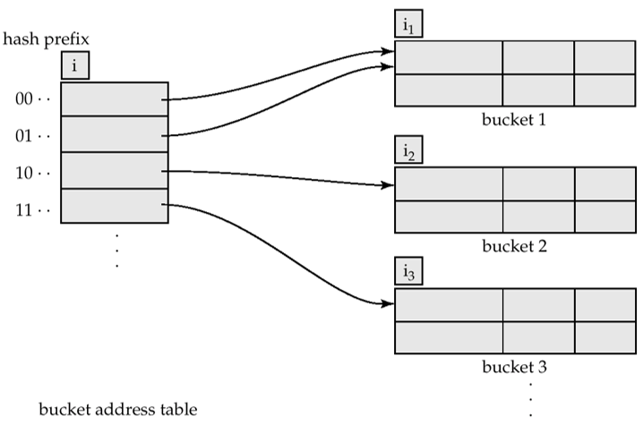{ width="600" }
</figure>

每个桶 j 存储一个值 $i_j$，所有指向同一个桶的表项在首 $i_j$ 位具有相同的值

要定位包含搜索键 $K_j$ 的桶：

1. 计算 $h(K_j) = X$
2. 使用 X 的前 i 个高位作为位移量访问桶地址表，并跟随指针找到对应桶

插入搜索键值为 $K_j$ 的记录：

1. 先定位桶 j
2. 如果桶 j 有空间，则插入记录
3. 否则分裂该桶并重新尝试插入（某些情况下会改用溢出桶）

    1. 如果 $i > i_j$：有多个指针指向桶 j

        1. 分配一个新桶 z，令 $i_j = i_z = i_j + 1$
        2. 将桶地址表中指向 j 的后半部分条目改为指向 z
        3. 移除并重新插入桶 j 中的所有记录
        4. 重新计算 $K_j$ 对应的桶并插入

    2. 如果 $i = i_j$：只有一个指针指向桶 j

        1. 增加 i 值，把桶地址表的容量扩大一倍
        2. 将表中每个条目替换为两个指向相同桶的条目
        3. 重新计算 $K_j$ 对应的新桶地址表条目
        4. 此时 $i > i_j$，转为使用第一种情况处理

当插入数据时，如果桶经过数次分裂使得 i 达到某个限定值 b，则创建溢出桶

删除一个记录：

1. 定位所在的桶并删除
2. 如果桶空了，则移除桶（同时更新桶地址表）
3. 可以合并桶（只能与 "buddy" 桶合并：即具有相同 $i_j$ 值和相同 $i_j - 1$ 前缀的桶）
4. 也可以减少桶地址表的大小：减少桶地址表大小的操作代价较高，仅当桶数量远小于表大小时才应进行

<figure markdown="span">
  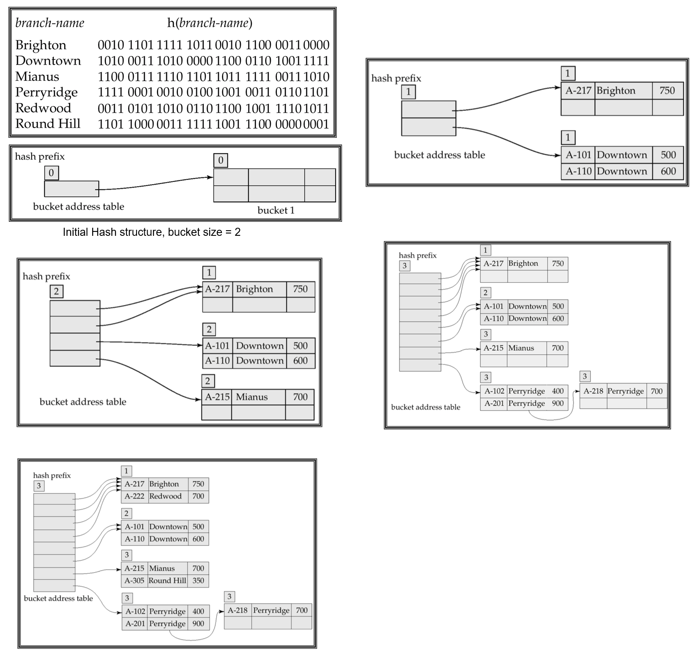{ width="800" }
</figure>

## * 7 Comparison of Ordered Indexing and Hashing

| 特性 | 有序索引 | 哈希索引 |
| :--: | :--: | :--: |
| 查询类型 | 范围查询优秀 | 等值查询极快 |
| 时间复杂度 | O(log n) | 平均 O(1)，最差 O(n) |
| 重组需求 | 自动平衡 | 需显式重组 |
| 插入/删除 | 中等成本 | 通常低成本 |
| 存储开销 | 额外 20-30% | 额外 10-15% |

## 8 Write-optimized Indices

### 8.1 Log Structured Merge Tree

**LSM Tree 日志结构合并树**

当前仅考虑插入/查询操作

1. 记录首先插入内存中的树（L₀ 树），L₀（内存）
2. 当内存树满时，记录转移到磁盘（L₁ 树）

    - 通过将现有 L₁ 树与 L₀ 树记录合并，自底向上构建 B⁺ 树，L₁（磁盘）

3. 当 L₁ 树超过阈值时，合并到 L₂ 树

    - 更多层级依此类推
    - $L_{i+1}$ 树的大小阈值是 $L_i$ 树的 $k$ 倍

优势：

1. 插入操作仅使用顺序 I/O 操作
2. 叶节点填满，避免空间浪费
3. 相比常规 B+ 树，每条记录的插入操作 I/O 次数更少（在一定数据量内）

缺点：

1. 查询需要搜索多棵树
2. 每个层级的内容会被多次复制

Stepped-merge index（阶梯式合并索引）

1. LSM 树的变体，每层包含多棵树
2. 相比标准 LSM 树降低了写入成本
3. 但查询代价更高：使用布隆过滤器避免在多数树中查找

---

删除操作通过添加特殊"删除标记"（墓碑标记）条目处理

- 查询时会同时找到原始条目和删除标记，必须只返回没有对应删除标记的条目
- 当树合并时，如果发现删除标记与原始条目匹配，两者都会被丢弃

更新操作通过插入 + 删除组合实现

LSM 树最初为磁盘索引设计，但对减少闪存擦除操作同样有效，阶梯式合并变体被广泛应用于大数据存储系统
