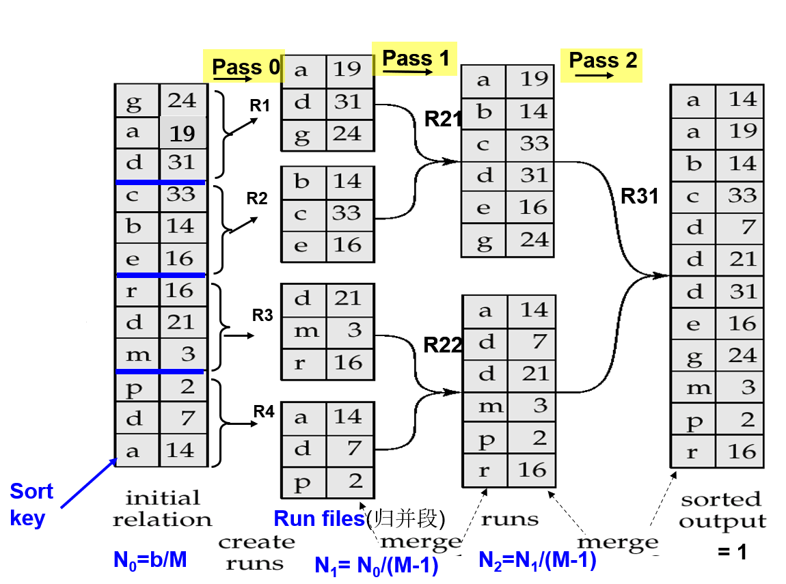
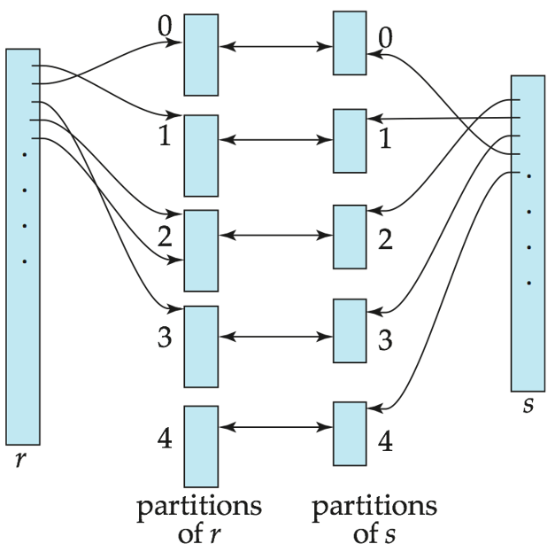
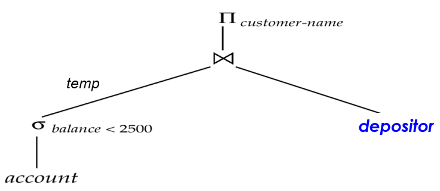

# 9 Query Processing

<!-- !!! tip "说明"

    本文档正在更新中…… -->

!!! info "说明"

    本文档仅涉及部分内容，仅可用于复习重点知识

    > 哦，神圣的史，完全不知道这节在干嘛

1. CPU 无法直接处理磁盘中的数据
2. 磁盘数据读取速度的增长速度要比磁盘大小的增长速度慢
3. 磁盘寻道速度的增长速度比磁盘数据传输速度的增长速度慢得多

## 1 Overview

### 1.1 Basic Steps in Query Processing

1. parsing and translation：语法分析与翻译

    1. 类似于编译器的工作流程，首先解析 SQL 查询语句
    2. 解析器会检查 SQL 语句的语法是否正确
    3. 验证查询中涉及的关系（表）是否存在
    4. 将 SQL 查询转换为内部表示形式 —— extended relational algebra 扩展关系代数（ERA）

2. optimization：优化

    1. 对于同一个 SQL 查询，可能存在多个等价的 relational algebra expressions（关系代数表达式）
    2. 每个关系代数操作可以使用不同的算法来执行
    3. 数据库优化器会生成一个 evaluation plan（评估计划），明确指定

        1. 使用哪些关系代数表达式
        2. 每个操作采用什么算法（如使用索引还是全表扫描）
        3. 操作的执行顺序和数据传递方式

3. evaluation：评估

    1. 查询执行引擎接收经过翻译的查询计划
    2. 执行这个 evaluation plan 并返回查询结果

### 1.2 Basic Steps: Optimization

1. 找出各种等价的关系代数表达式
2. 一系列指定详细执行策略的基本操作，称为查询执行计划（query execution plan）或查询评估计划（query evaluation plan）
3. query optimization：在所有等价的评估计划中选择成本最低的方案。成本估算基于两个因素：

    1. 成本取决于具体执行算法的选择
    2. 成本估算需要使用数据库目录中的统计信息。例如：每个关系的元组数量、元组大小等

## 2 Measures of Query Cost

成本通常以查询 total elapsed time（总响应时间）衡量。影响时间成本的多重因素：disk access + CPU + network communication（网络通信）

通常磁盘访问是主要成本因素（相对容易估算），具体通过以下指标衡量：

1. 执行的寻道操作次数
2. 读取的块数 × 单块读取平均成本
3. 写入的块数 × 单块写入平均成本

写入块的成本高于读取块。写入后需要回读数据以确保写入成功

简单起见，我们仅使用以下两个指标作为成本度量标准：

1. $t_T$：传输一个数据块的时间（time to transfer one block）
2. $t_S$：执行一次磁盘寻道的时间（time for one seek）

完成 b 次块传输加 S 次寻道的总成本：$b \times t_T + S \times t_S$

> 1. 为简化模型，暂不考虑 CPU 计算成本（但实际系统会考虑）
> 2. 结果数据写回磁盘的成本也不包含在本公式中

内存缓冲区与查询成本的关系：

1. 查询成本取决于主内存缓冲区大小：内存越大，磁盘访问需求越少
2. 实际可用内存受以下因素影响： 操作系统其他并发进程的内存占用；难以在执行前准确预判
1. 常用评估方法：采用最坏情况估计（假设仅满足操作最低内存需求），同时考虑最佳情况估计
2. 数据缓存的影响：所需数据可能已驻留缓冲区（避免磁盘 I/O），但这一因素难以在成本预估中量化考虑

## 3 Selection Operation

### 3.1 Basic Algorithms

**file scan**（文件扫描）：不使用索引，通过搜索算法定位并检索满足选择条件的记录

**A1: linear search**（线性搜索）：扫描每个文件块并测试所有记录是否满足选择条件

成本估算：$b_r$ 次块 transfer + 1 次 seek。$b_r$ 表示包含关系 r 记录的块数量。如果是对键属性的选择，找到记录后可立即停止，成本 = $\dfrac{b_r}{2}$ 次块 transfer + 1 次 seek

> 初始化寻道：磁头移动到块头位置（1 次 seek）；连续传输：依次读取所有数据块（$b_r$ 次传输）
>
> 当搜索键属性（可提前终止）时：平均只需扫描一半块数 $\dfrac{b_r}{2}$

线性搜索的适用性：

1. 不受选择条件类型影响
2. 不受记录存储顺序影响
3. 不依赖索引可用性

binary search 通常不适用，因为数据不是连续存储的。除非有可用索引，而且二分查找比索引搜索需要更多的寻道操作

---

**A2: binary search**（二分搜索）：当选择条件是针对已排序文件的属性进行等值比较时适用

假设关系的所有块是连续存储的。成本 = $⌈log₂(b_r)⌉$ 次块传输 + $⌈log₂(b_r)⌉$ 次寻道。如果选择的不是键属性，还需加上包含满足条件记录的所有块数量

块传输次数 = $⌈log₂(b_r)⌉ + ⌈sc(A, r) / f_r⌉ - 1$

- $sc(A, r)$：满足选择条件的记录数
- $f_r$：每个块包含的记录数

### 3.2 Using Indices and Equality

**Index scan**（索引扫描）：使用索引的搜索算法。选择条件必须是索引的搜索键

**A3: (primary index, equality on key)**：检索满足等值条件的单条记录。成本 = $(h_i + 1) × (t_T + t_S)$，其中 $h_i$ 为索引树高度

> 1. 索引树遍历阶段（$h_i$ 次）需要从根节点逐层向下访问到叶子节点。每次层级跳转都需要：1 次 seek + 1 次 transfer
> 2. 数据获取阶段（+ 1 次）

---

**A4: (primary index, equality on nonkey)**：检索多条记录。记录将存储在连续的块中。设 b 为包含匹配记录的块数。成本 = $h_i × (t_T + t_S) + t_S + t_T × b$

> 1. 索引遍历阶段：$h_i × (t_T + t_S)$
> 2. 数据定位阶段：$+ t_S$
> 3. 数据读取阶段：$+ t_T × b$

---

**A5: (secondary index, equality on nonkey)**

1. 当搜索键是候选键时：检索单条记录。成本 = $(h_i + 1) × (t_T + t_S)$
2. 当搜索键不是候选键时：检索多条记录。每条匹配记录可能位于不同数据块。成本 = $(h_i + n) × (t_T + t_S)$

### 3.3 Involving Comparisons

实现比较查询：

1. linear file scan
2. binary search
3. using indices

**A6: (primary index, comparison)**：基于主索引的比较

1. 对于 $\sigma_{A \geqslant V}(r)$ 的查询，使用 index 定位到第一个 tuple，然后顺序读取即可
2. 对于 $\sigma_{A \leqslant V}(r)$ 的查询，顺序读取直到遇到不满足条件的 tuple。不使用 index

---

**A7: (secondary index, comparison)**：基于辅助索引的比较

1. 对于 $\sigma_{A \geqslant V}(r)$ 的查询，使用 index 定位到第一个 tuple，然后顺序扫描索引获取记录指针
2. 对于 $\sigma_{A \leqslant V}(r)$ 的查询，顺序读取指针直到遇到不满足条件的 tuple

两种情况下都需要获取指针指向的记录：每条记录都需要一次 I/O 操作，可能比线性文件扫描成本更高

### 3.4 Complex Selections

$\sigma_{\theta_1 \land \theta_2 \land \cdots \land \theta_n}(r)$

**A8: (conjunctive selection using one index)**：使用单一索引的合取选择

从条件 θ₁ 到 θₙ 中选择执行成本最低的 θᵢ（使用算法 A1-A7），将结果元组存入内存缓冲区。在内存中对这些元组检查其他条件

---

**A9: (conjunctive selection using composite index)**：使用复合索引的合取选择

如果有可用的复合（多键）索引则使用

---

**A10: (conjunctive selection by intersection of identifiers)**：通过标识符交集的合取选择

1. 需要带有记录指针的索引
2. 对每个条件使用相应索引，获取记录指针集合并求交集
3. 然后从文件中获取记录
4. 如果某些条件没有合适索引，则在内存中检查

---

$\sigma_{\theta_1 \lor \theta_2 \lor \cdots \lor \theta_n}(r)$

**A10: (disjunctive selection by union of identifiers)**：通过标识符并集的析取选择

适用条件：所有子条件都有可用索引。否则使用线性扫描

对每个条件使用相应索引，获取记录指针集合并取并集。最后从文件中获取记录

---

$\sigma_{\neg \theta}(r)$

默认使用线性文件扫描

例外情况：若满足 ¬θ 的记录极少，且 θ 有可用索引。先通过索引找出满足 θ 的记录，再反向筛选

## * 4 Sorting

为什么需要 sort：

1. 输出需求
2. 连接操作可以快速实现

我们可以在关系上建立索引，然后使用该索引按排序顺序读取关系。但这只是在逻辑上而非物理上对关系进行排序，并且可能导致每个元组都需要访问一个磁盘块

排序方法：

1. 内存排序：若数据能完全装入内存，使用高效的内部排序算法（如快速排序）
2. [external sorting](../ADS/ch15.md){:target="_blank"}：若数据量超过内存容量，需使用外部排序归并算法（分块排序后归并），适合大规模数据

<figure markdown="span">
  { width="600" }
</figure>

## 5 Join Operation

处理 join 的不同算法：

1. Nested-loop join
2. Block nested-loop join
3. Indexed nested-loop join
4. Merge-join
5. Hash-join

### 5.1 Nested-Loop Join

**嵌套循环连接**

$r \Join_\theta s$

算法流程：

1. 通过双重循环实现连接：外层循环遍历外部关系 r 的每个元组 $t_r$，内层循环遍历内部关系 s 的每个元组 $t_s$
2. 对每一对元组 $(t_r, t_s)$ 检查是否满足连接条件 θ，若满足则组合两元组并输出结果

关键术语：

1. Outer Relation（外部关系）：外层循环的关系 r，通常选择数据量较小的表以减少循环次数
2. Inner Relation（内部关系）：内层循环的关系 s

优点：无需依赖索引，适用于任意连接条件（灵活性高）

缺点：时间复杂度为 $O(n \times m)$ （n 和 m 为两表的元组数），性能较差，尤其适合小表连接或作为其他连接算法的备用方案

最坏情况代价：当内存仅能缓存每个表的一个数据块时

1. 块传输次数：$n_r \times b_s + b_r$（$n_r$ 为外部关系元组数，$b_s$ 和 $b_r$ 为内部/外部关系的块数）
2. 磁盘寻道次数：$n_r + b_r$（每次外层循环需重新定位内部关系的数据块）

> 1. 对于外部关系 r 的每一个元组 $t_r$，数据库需要：扫描整个内部关系 s（即读取 $b_s$ 次块），因此，总块传输次数为 $n_r \times b_s$，最后还要完整读取一次外部关系 r（$b_r$ 次块）
> 2. 每次处理外部关系的一个元组 $t_r$ 时，可能需要：寻道到内部关系 s 的第一个块（1 次寻道），最坏情况下，认为每次外层循环都要重新寻道，因此 $n_r$ 次寻道。读取整个 r 需要 $b_r$ 次寻道（每块一次）

如果较小的关系能完全放入内存，则将其作为内部关系使用：代价降低至 $b_r + b_s$ 次块传输和 2 次磁盘寻道

### 5.2 Block Nested-Loop Join

**块嵌套循环连接**

四层循环结构：

1. 外层循环遍历外关系 r 的每个块
2. 次外层循环遍历内关系 s 的每个块
3. 内层两个循环分别处理当前两个块中的元组

最坏情况代价：

1. 传输次数：$b_r \times b_s + b_r$ 
2. 寻道次数：$2 \times b_r$

最佳情况代价：

1. 传输次数：$b_r + b_s$ 
2. 寻道次数：$2$

优化策略：

1. 内存利用：使用 M - 2 个磁盘块作为外关系的缓冲单元（M 是内存的块大小），剩下的 2 个块用于缓冲内关系和输出结果
2. 提前终止内循环：如果连接属性是主键或内关系具有唯一性，可以在第一次匹配后立即停止内循环扫描
3. 交替扫描内关系：交替正向和反向扫描内关系，以利用缓冲区的剩余块（采用 LRU 替换策略）
4. 利用索引：如果内关系上有索引，可以使用索引加速连接

### 5.3 Indexed Nested-Loop Join

**索引嵌套循环连接**

适用条件：

1. 连接是等值连接（equi-join）或自然连接（natural join）
2. 内关系的连接属性上存在索引

可以临时构建索引来优化连接计算

算法流程：对于外关系 r 中的每个元组 $t_r$，使用索引查找内关系 s 中满足连接条件的元组

最坏情况：缓冲区只能容纳 r 的一个页，并且对于 r 的每个元组，都需要在 s 上执行一次索引查找

$b_r + n \times c$

- n：匹配的元组数量
- c：单次索引查找的成本

索引查找成本 c 的估算：可以近似看作在 s 上执行一次基于连接条件的单点查询的成本

优化策略：如果两个关系的连接属性上都有索引，则选择元组较少的关系作为外关系，以减少索引查找次数

!!! example "例子"

    计算 $student \Join takes$，student 作为 outer relation。takes 在 ID 属性上有一个 B+ 树索引，每个 node 包含 20 项。takes 有 10000 个元组，树高 4，需要额外的 1 次访问来获取真实数据。student 有 5000 个元组

    block nested loop join：$100 \times 400 + 100 = 40100$ 传输次数，$2 \times 100 = 200$ 寻道次数

    indexed nested loop join：$100 + 5000 \times 5 = 25100$，$c = 4 + 1 = 5$

### 5.4 Merge Join

**排序归并连接**

1. 排序阶段（sort phase）：如果输入关系 pr 和 ps 未按连接属性（如 a₁）排序，则需先对它们进行排序（通常使用外部排序算法，如多路归并排序）。排序后的数据可以按连接属性顺序访问，为归并阶段做准备
2. 归并阶段（merge phase）

    1. 同时扫描两个已排序的关系，按连接属性值进行匹配：

        1. 如果 pr.a₁ == ps.a₁，则输出匹配的元组对（如 (a,3,A)）
        2. 如果 pr.a₁ < ps.a₁，则移动 pr 的指针到下一个更大的值
        3. 如果 pr.a₁ > ps.a₁，则移动 ps 的指针

    2. 重复值处理：如果连接属性有重复（如 pr 中的 d 出现两次），需匹配所有组合（如 (d,8,N) 和 (d,13,N)）

仅适用于等值连接和自然连接

每个数据块只需读取一次（假设内存可容纳连接属性的所有匹配元组）

- 传输次数：$b_r + b_s$
- 寻道次数：$\lceil \dfrac{b_r}{b_b} \rceil+\lceil \dfrac{b_s}{b_b} \rceil$

若关系未排序，需额外加上排序成本

> $b_b$ 表示块缓冲大小

Hybrid merge-join（混合归并连接）：若一个关系已排序，另一个关系在连接属性上有辅助 B+ 树索引

1. 归并阶段：已排序关系直接与 B+ 树索引的叶节点（存储键值和地址）匹配
2. 地址排序：将匹配结果的元组地址按物理存储顺序排序（减少随机访问）
3. 元组填充：按地址顺序扫描未排序关系，高效获取实际数据

### 5.5 Hash Join

**哈希连接**

仅适用于等值连接和自然连接

1. 分区阶段（partitioning phase）：使用哈希函数 h 对两个关系的元组进行分区：h 将连接属性（JoinAttrs）的值映射到 {0, 1, ..., n}，其中 JoinAttrs 是自然连接中 r 和 s 的共同属性
2. 探测阶段（probing phase）：对每一对分区 (ri, si) 将 ri 的元组与 si 的元组进行匹配。例如，将 ri 的所有元组加载到内存的哈希表中，然后扫描 si 的元组并查找匹配

> s 称为 probe input，r 称为 build input

<figure markdown="span">
  { width="600" }
</figure>

分区数 n 和哈希函数 h 的选择：

1. 需确保每个分区 si 能放入内存
2. 通常 $n = \lceil \dfrac{b_s}{M} \rceil \times f$，其中 f 为 fudge factor（缓冲因子），通常取 1.2 左右
3. 探测关系的分区 si 无需全部装入内存

recursive partitioning（递归分区）：若分区数 n 超过内存页数 M，则需递归分区

1. 首次分区时，对关系 s 使用 M - 1 个分区
2. 对每个 M - 1 分区进一步用不同哈希函数分区
3. 对关系 r 采用相同的分区方法

无需递归分区时的成本公式：$3(b_r + b_s) + 4n_h$ 传输 + $2(\lceil \dfrac{b_r}{b_b} \rceil+\lceil \dfrac{b_s}{b_b} \rceil) + 2n_h$ 寻道

> 分区阶段，读取和写入每个关系一次，探测阶段：读取分区一次，所以是 $3(b_r + b_s)$
>
> $n_h$：溢出分区数量（需递归处理的次数）（没见做题的时候用过）

需要递归分区时：

1. 分区趟数（passes）由构建关系决定：$pass = \lceil \log_{M-1}(b_s)-1 \rceil$
2. $2(b_r + b_s)\lceil \log_{M-1}(b_s)-1 \rceil + b_r + b_s$ 传输 + $2(\lceil \dfrac{b_r}{b_b} \rceil+\lceil \dfrac{b_s}{b_b} \rceil)\lceil \log_{M-1}(b_s)-1 \rceil$ 寻道

最佳情况（构建关系可完全放入内存）：无需分区，成本降至：$b_r + b_s$ 次传输

#### * 5.5.1 Handling of Overflows

哈希表溢出发生在分区 si 无法装入内存时，可能原因包括：

1. 关系 s 中存在大量连接属性值相同的元组（数据分布不均）
2. 哈希函数设计不合理

若某些分区的元组数量显著多于其他分区，称为分区倾斜（skewed partitioning）

解决方案：

1. 常规选择分区数：$n = \lceil \dfrac{b_s}{M} \rceil \times f$，其中 f 为 fudge factor（缓冲因子），通常取 1.2 左右
2. 构建阶段溢出处理：使用不同哈希函数对溢出分区 si 进行二次分区。必须同步对 ri 执行相同操作

溢出预防：通过精细分区避免构建阶段溢出

#### * 5.5.2 Hybrid Hash Join

适用场景：当内存较大且构建关系（build input）超过内存容量时使用

核心特性：将构建关系的第一个分区始终保留在内存中

示例：内存 25 块时，将 instructor 表（100 块）划分为 5 个分区（每区 20 块）。第一个分区占 20 块内存，1 块用于输入缓冲，剩余 4 块分别缓冲其他 4 个分区；teaches 表同样划分为 5 个分区（每区 80 块），第一个分区立即用于探测（无需写磁盘）

最佳效能条件：当内存大小 $M ≫ \sqrt{b_s}$

### 5.6 Complex Join

Join with a conjunctive condition：$r \Join_{\theta_1 \land \theta_2 \land \cdots \land \theta_n} S$

1. 直接使用嵌套循环或块嵌套循环算法处理整个复杂条件
2. 先处理其中一个简单条件得到中间结果，然后筛选满足剩余条件的元组

Join with a disjunctive condition：$r \Join_{\theta_1 \lor \theta_2 \lor \cdots \lor \theta_n} S$

1. 直接使用嵌套循环或块嵌套循环算法处理整个复杂条件
2. 将复杂连接分解为多个简单连接的并集

## * 6 Other Operations

duplicate elimination（去重）：

1. 排序法：先对数据进行排序，使重复项相邻，便于一次性移除

    - 优化：在外部排序（数据量过大无法全部装入内存时使用的排序算法）的初始阶段和归并阶段即可提前去重，减少后续计算量

2. 哈希法：利用哈希函数将相同值映射到同一桶中，只需检查桶内是否有重复，无需全局排序

---

projection（投影）：对每个元组执行投影运算，对投影结果进行去重

---

aggregation（聚合）：与去重类似，可以使用排序或哈希将同一分组的元组聚集在一起，然后对每个分组应用聚合函数

优化：在外部排序-合并（external sort-merge）过程中，可以提前计算部分聚合值，减少后续计算量：

1. 简单聚合函数（count/min/max/sum）：在排序的初始阶段（run generation）和归并阶段（intermediate merges），直接累积聚合值（如累加 count 或 sum，比较 min/max）
2. 平均值（avg）：需分别维护 sum 和 count，避免丢失信息（因 avg 不可直接合并）

---

set operations（集合操作）：对排序后的关系使用变种的归并连接（merge-join），或使用变种的哈希连接（hash-join）

基于哈希的集合操作实现步骤：

1. 分区：用相同哈希函数将两个关系（表）划分为对应的小分区，确保同一键值的元组必然落在同一分区编号中
2. 构建内存哈希索引：对每个分区 $r_i$ 构建内存哈希索引，加速查找操作（如判断元组是否存在）
3. 按操作类型处理分区：

    1. 并集：结果需包含所有来自 r 和 s 的唯一元组。通过哈希索引去重，合并两分区的数据
    2. 交集：结果仅包含同时存在于 r 和 s 的元组。通过检查 $s_i$ 的元组是否在 $r_i$ 的哈希索引中实现
    3. 差集：结果包含存在于 r 但不在 s 的元组。通过从 $r_i$ 的哈希索引中删除 $s_i$ 的元组实现

---

outer join（外连接）：

1. 先执行普通连接，再补充未匹配的元组（用空值填充）
2. 通过修改连接算法直接实现。

修改归并连接（merge join）：在归并过程中，若左表 r 的元组 $t_r$ 无匹配的右表 s 元组，则输出 $t_r$ 并补 `NULL`

修改哈希连接（hash join）：

1. 若 r 是探测关系（probe relation）：直接输出 r 中未匹配的元组，并用空值填充
2. 若 r 是构建关系（build relation）：在探测阶段记录 r 中匹配的元组；处理完分区 $s_i$ 后，输出 r 中未匹配的元组并用空值填充

## * 7 Evaluation of Expressions

**表达式求值**

现在考虑多个操作的情况

$\Pi_{\text{customer-name}}((\sigma_{balance < 2500}(account)) \Join depositor)$

表达式求值策略：

1. 物化（Materialization）：逐步计算每个子表达式的结果，并将中间结果临时存储到磁盘，供后续操作使用
2. 流水线（Pipelining）：无需等待子操作完全执行完毕，直接将生成的元组实时传递给父操作

### 7.1 Materialization

Materialized evaluation：每次只计算一个操作，从最底层的操作开始。将中间结果物化为临时关系，用于计算下一层操作

先计算：$\sigma_{balance < 2500}(account)$ 并存储到 temp 中，然后读取存储的结果与 depositor 表进行连接，最后计算 customer-name 上的投影

<figure markdown="span">
  { width="600" }
</figure>

物化求值方法具有普适性，可应用于所有场景

将结果写入磁盘再读回的成本可能很高，之前的操作成本计算公式忽略了结果写入磁盘的开销，因此总成本 = 各独立操作成本之和 + 中间结果写入磁盘的成本

double buffering（双缓冲技术）：为每个操作分配两个输出缓冲区，当一个缓冲区填满时写入磁盘，同时另一个缓冲区继续接收数据，实现磁盘写入与计算的并行处理，减少总执行时间

### 7.2 Pipelining

Pipelined evaluation：同时执行多个操作，将一个操作的输出结果直接传递给下一个操作

不存储选择操作（σ）的结果，而是将元组直接传递给连接操作（⋈）。同样，不存储连接操作的结果，直接将元组传递给投影操作（∏）

- 比物化执行成本低得多：不需要将临时关系存储到磁盘
- 流水线并非总是可行（取决于后续操作的类型，以及输出是否有序等因素）
- 要使流水线有效，需要使用能在接收输入元组的同时就生成输出元组的求值算法
- 流水线可以通过两种方式执行：demand driven（需求驱动型）和 producer driven（生产者驱动型）

#### 7.2.1 Demand Driven

1. 查询执行引擎从查询树的最顶层开始驱动，像多米诺骨牌一样逐级向下触发元组请求，最终传导到最底层的表扫描操作
2. 在两次请求之间，操作需要维护"状态"以记住接下来应该返回什么

每个操作都实现为一个 iterator（迭代器），需要支持以下操作：

1. Open：

    1. file scan（文件扫描）：初始化文件扫描，将文件起始位置指针保存为状态
    2. merge join（归并连接）：对关系进行排序，并将已排序关系的起始指针保存为状态

2. Next：

    1. file scan（文件扫描）：输出下一个元组，推进并保存文件指针
    2. merge join（归并连接）：从之前保存的状态继续归并过程，直到找到下一个输出元组，保存指针作为迭代器状态

3. Close：资源释放

#### 7.2.2 Producer Driven

操作符主动生成元组并向上传递给父操作符

1. 操作符之间维护缓冲区，子操作符将元组放入缓冲区，父操作符从中取出元组
2. 若缓冲区满，子操作符将等待直到缓冲区有空位，再继续生成元组

系统会调度那些输出缓冲区有空位且能处理更多输入元组的操作

#### 7.2.3 Evaluation Algorithms for Pipelining

部分算法无法在接收输入元组时即时输出结果：例如，归并连接（merge join）或哈希连接（hash join）。这些操作总是需要将中间结果写入磁盘后再读取

可通过算法变体实现实时生成（至少部分）结果：在读取输入元组的同时即时输出处理结果

改进算法可实现部分流水化执行：

1. 例如混合哈希连接（hybrid hash join）可以实时处理内存分区（分区 0）中的探测关系元组
2. Double-pipelined join technique（双管道连接技术）：改进版混合哈希连接，将两个关系的分区 0 元组都缓冲在内存中，一旦数据可用就立即处理：当发现新的 r₀ 元组时，立即与现有 s₀ 元组匹配并输出结果，同时保存该 r₀ 元组。对 s₀ 元组执行对称处理

#### 7.2.4 Complex Joins

三表连接示例：loan ⋈ depositor ⋈ customer

Strategy 1：

1. 先计算 depositor ⋈ customer
2. 将结果与 loan 表连接：loan ⋈ (depositor ⋈ customer)

Strategy 2：

1. 先计算 loan ⋈ depositor
2. 将结果与 customer 表连接：(loan ⋈ depositor) ⋈ customer

Strategy 3：

1. 同时执行两个连接操作：

    1. 在 loan 表的 loan-number 上建立索引
    2. 在 customer 表的 customer-name 上建立索引
    3. 对 depositor 表的每个元组 t：

        1. 通过 customer-name 查找匹配的 customer 元组
        2. 通过 loan-number 查找匹配的 loan 元组

2. 每个 depositor 元组仅需检查一次
3. 将两个连接操作合并为一个专用操作，效率高于分别执行两个二表连接
