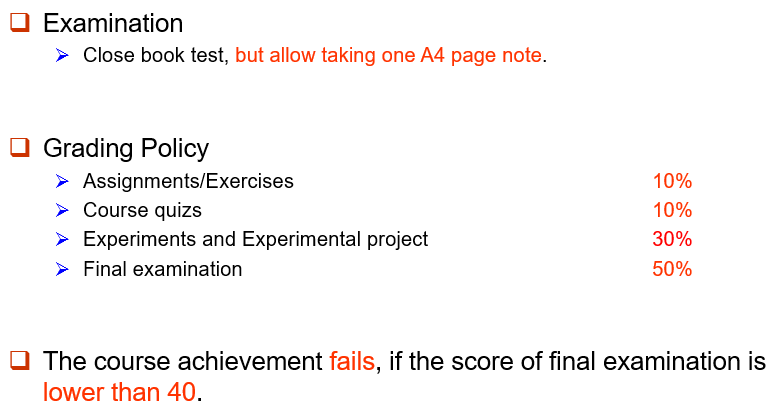

# 数据库系统

!!! tip "说明"

    本文档正在更新中……

## 课程介绍

!!! info "注意"

    此为 2024-2025 春夏学期课程安排，仅供参考

cg老师

### 考核方式

<figure markdown="span">
  { width="600" }
</figure>

## 个人笔记及课本部分习题答案

[1 Introduction](./ch1.md) 
[2 Introduction to the Relational Model](./ch2.md) 
[3 Introduction to SQL](./ch3.md) 
[4 Advanced SQL](./ch4.md) 
[5 Entity-Relationship Model](./ch5.md)