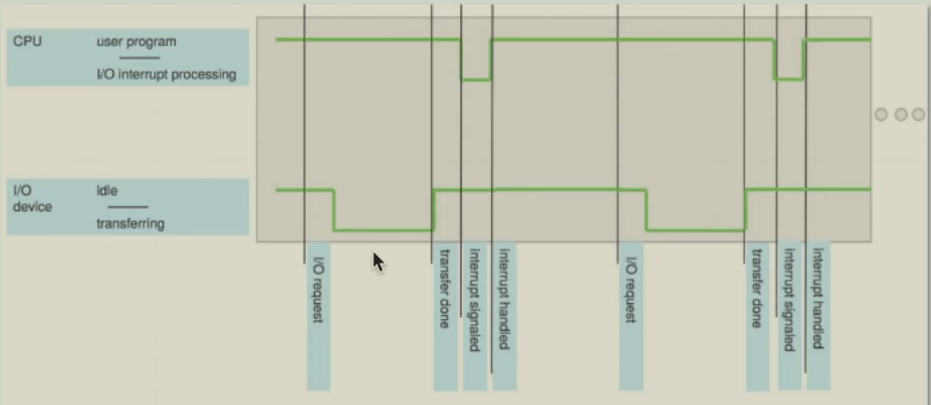
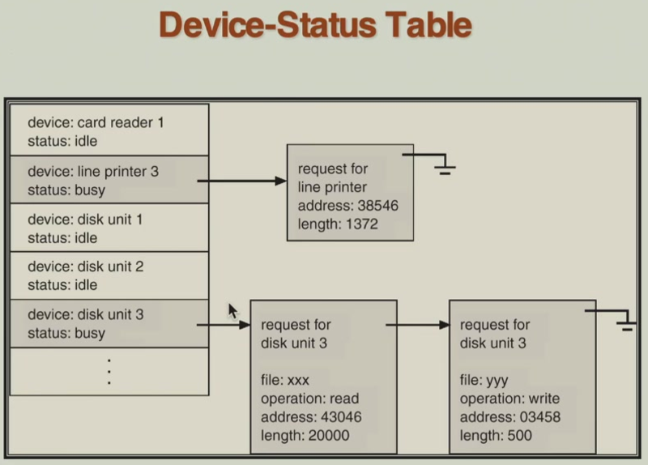
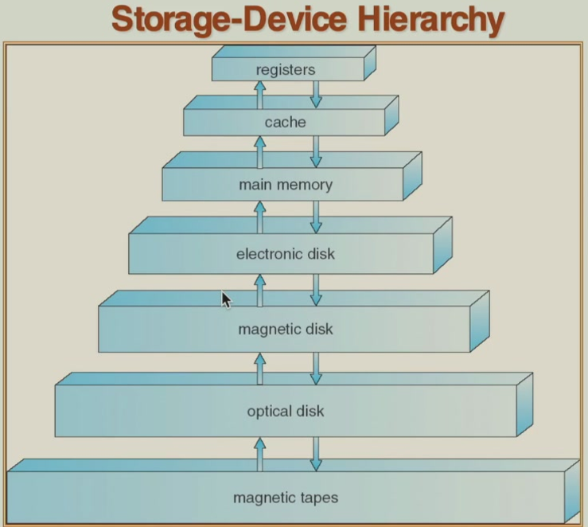
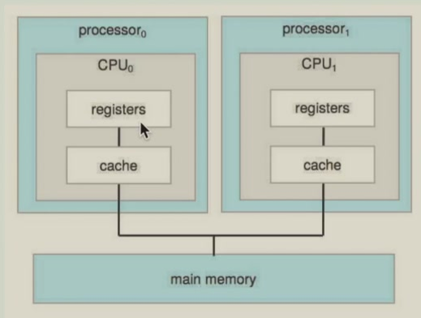
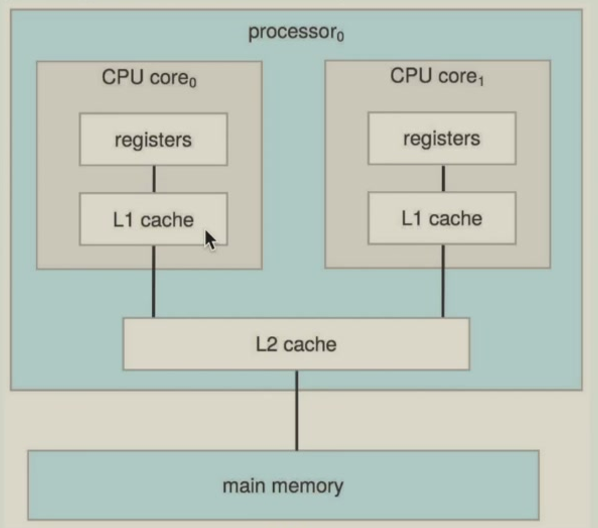

# 1 Overview

<!-- !!! tip "说明"

    本文档正在更新中…… -->

!!! info "说明"

    本文档仅涉及部分内容，仅可用于复习重点知识

operating system 是一种在计算机用户与计算机硬件之间充当中介的程序

操作系统目标：

1. 执行用户程序，使解决用户问题更便捷
2. 使计算机系统更便于使用
3. 高效利用计算机硬件

计算机系统可分为 4 个组成部分：

1. hardware
2. operating system
3. system & application programs
4. users

OS 不存在普遍接受的定义，但可以这样理解：

1. OS 是一种 resource allocator：管理所有资源；在冲突的请求之间做出决策，以实现高效且公平的资源使用
2. OS 是一种 control program：控制程序执行，以防止错误和计算机的不当使用

狭义：仅指 kernel（真正意义上的操作系统核心） 
广义：包含 kernel + 系统程序 + 工具的软件集合

bootstrap program 在通电或重启时加载：

1. 引导程序，计算机启动的第一段代码
2. 通常存储在 ROM 或 EPROM 中，一般称为 firmware（固件）
3. 初始化系统的所有方面
4. 加载操作系统内核并开始执行

## 1 Interrupt

一个或多个 CPU、设备控制器通过 common bus 连接，提供对共享内存的访问。CPU 和设备并发执行，竞争内存访问周期。因此需要机制协调 CPU 和设备对内存周期的竞争

1. 每个控制器配备 local buffer，形成“设备 → 控制器 buffer → 主内存”的数据流层次
2. CPU 负责主内存与控制器 buffer 间的数据搬运，实际设备 I/O 操作由控制器独立完成
3. 设备控制器则通过产生 interrupt（通过 system bus 传递）通知 CPU 操作已完成

中断：

1. 中断通过 interrupt vector 将控制权转移给中断服务例程，中断向量表包含所有中断处理程序的入口地址
2. 中断架构必须保存被中断指令的地址（program counter 程序计数器），确保中断结束后能够返回原指令，并能继续正确执行
3. 在处理一个中断时，新到来的中断会被禁用，以防止丢失中断

区分：

1. 硬件中断：由外部设备触发
2. 软件中断（trap）

    1. 错误陷阱：除零错误、内存访问违规等
    2. 系统调用（system call）：用户程序主动请求操作系统服务

==An operating system is interrupt driven==. 所有活动（设备 I/O 完成、用户请求、系统错误）都通过中断机制触发操作系统响应

中断处理三阶段

1. 状态保护阶段：完整保存被中断程序的执行上下文，包括所有寄存器值（通用寄存器、状态寄存器等），程序计数器（指向被中断的指令地址）
2. 中断识别阶段

    1. 通用查询式：通过检查中断状态寄存器确定中断源
    2. 向量索引式（更高效）：中断号直接对应处理程序地址

3. 中断分发阶段：不同类型中断由特定代码段处理，每种中断类型有独立的处理逻辑

<figure markdown="span">
  { width="600" }
</figure>

## 2 I/O Structure

1. 同步 I/O（阻塞式）：I/O 启动后，只有在 I/O 完成时控制权才返回用户程序

    1. 程序发起 I/O 请求后完全暂停执行，CPU 进入忙等待状态（执行等待循环），只有 I/O 完成后才继续执行程序
    2. CPU 利用率极低（在等待期间完全空闲），无法处理并发 I/O 请求

2. 异步 I/O（非阻塞式）：I/O 启动后，控制权立即返回用户程序而不等待 I/O 完成

    1. 发起 I/O 请求后立即获得控制权，通过设备状态表（device-status table）跟踪所有 I/O 设备状态，I/O 完成后通过中断通知系统

异步 I/O 方法使得 CPU 可以在等待 I/O 完成时执行其他任务，从而实现了真正的并发处理

<figure markdown="span">
  { width="600" }
</figure>

direct memory access structure（DMA 结构）：

1. 设备控制器绕过 CPU 直接与内存进行数据交换
2. 专为接近内存速度的设备设计（如磁盘、网卡）
3. 以数据块为单位传输，而非单个字节。整个数据块传输完成后产生单个中断通知 CPU

DMA 技术将 CPU 从繁琐的数据搬运工作中解脱出来，CPU 在传输期间可以执行其他任务，提高并发性。减少中断开销，提高数据传输效率

## 3 Storage Structure

1. main memory：volatile（易失性），CPU 能够直接访问的唯一大容量存储介质
2. secondary storage：non-volatile（非易失性），主内存的扩展，提供大容量的非易失性存储能力

三个核心维度的平衡：

1. speed
2. cost
3. volatility

存储设备按层次排列，从上到下：

- 顶层：速度最快、成本最高、容量最小、通常易失
- 底层：速度最慢、成本最低、容量最大、通常非易失

<figure markdown="span">
  { width="600" }
</figure>

caching 解决不同存储层级间的速度差异，将常用数据提前放置到更快存储介质

首先在快速缓存中寻找数据，若缓存命中，直接使用，获得最大性能 benefit；若缓存缺失，从慢速存储加载，并存入缓存

Multitasking 环境必须小心使用最新值，无论它存储在存储层次结构的哪个位置。避免不同任务看到不同版本的值（脏读）

Multiprocessor 环境必须在硬件层面提供 cache coherence，使所有 CPU 在其缓存中都具有最新值（一个 CPU 修改数据后，其他 CPU 的缓存可能包含过时副本）

SMP：

<figure markdown="span">
  { width="600" }
</figure>

Multicore：

<figure markdown="span">
  { width="600" }
</figure>
