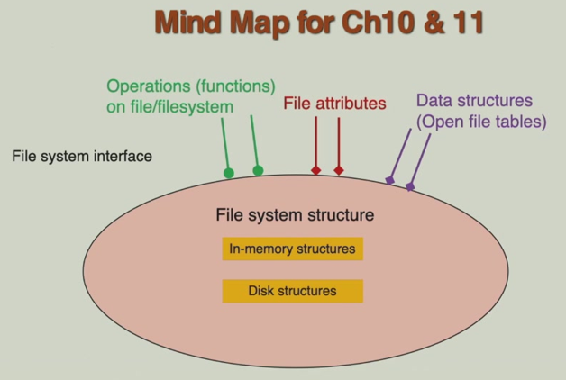
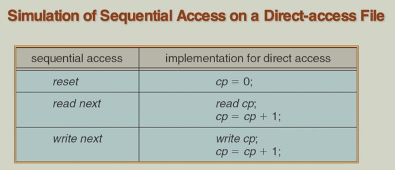
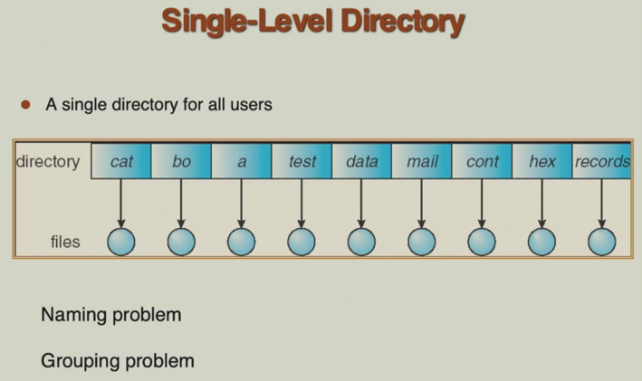
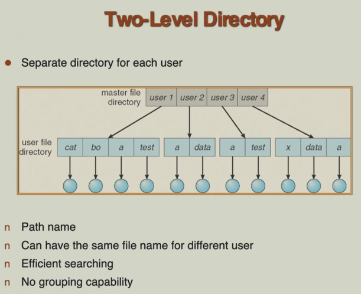
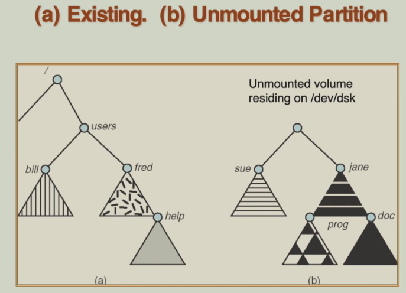
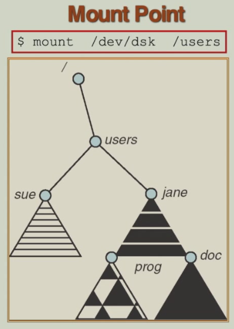

# 10 File System Interface

!!! tip "说明"

    本文档正在更新中……

!!! info "说明"

    本文档仅涉及部分内容，仅可用于复习重点知识

<figure markdown="span">
    { width="600" }
</figure>

## 1 File Concept

文件是操作系统管理的一种连续的逻辑地址空间，对用户和程序呈现为一个统一的整体。文件本质上是信息的序列，可以以位、字节、行或记录等形式组织。其具体含义和格式由文件的创建者与使用者决定，操作系统一般不解释其内容

文件类型：

1. 数据文件：存储用户或程序生成的数据。数值型，字符型，二进制型
2. 程序文件：存储计算机程序。源代码，目标代码，可执行文件

!!! tip "File Structure"

    1. none（无结构）：文件被视为一个没有内部逻辑划分的字节流或字序列。操作系统仅负责存储和检索这些字节，对其内容的任何解释（如格式、意义）完全由应用程序负责
    2. simple record structure（简单记录结构）：文件由一组记录组成，每条记录是一个逻辑单位

        1. 行：以换行符分隔的记录，常见于文本文件
        2. 固定长度记录：所有记录具有相同的字节数，易于定位
        3. 可变长度记录：记录长度不同，需要更复杂的管理来分隔记录

    3. complex structure（复杂结构）：文件具有特定的、可能很复杂的内部格式

        1. 格式化文档：如 Word 文档、PDF 文件，包含字体、排版等丰富信息
        2. 可重定位装入文件：如 .o 或 .obj 文件，包含可由链接器重新组织的机器代码和数据

    复杂的文件结构可以在无结构（字节流）的基础上实现。只需在字节流中定义和插入特殊的控制字符或标记，应用程序就能解释出记录或复杂格式。这提供了灵活性

    文件采用何种逻辑结构，取决于：

    4. 操作系统：操作系统内核或文件系统可能定义一些通用的基础结构
    5. 程序：大多数情况下，是应用程序决定如何解释文件中的字节序列，从而赋予文件具体的结构

!!! tip "File Attributes"
    
    1. name
    2. identifier：文件系统内部使用的唯一数字标识（如 inode 编号），用于在存储中精确定位文件，对用户透明
    3. type
    4. location
    5. size
    6. protection：定义访问权限（读、写、执行）及适用于哪些用户/组，是系统安全性的基础
    7. time，date，user identification：记录文件的创建、最后修改/访问时间及所有者，用于审计、追踪和系统管理

    所有这些属性信息（元数据）通常作为一个记录保存在目录结构中，而目录结构本身也存储在磁盘上，确保系统重启后仍可恢复

    !!! tip "File Type"

        MS-DOS / Windows（传统方式）：主要依赖文件扩展名

        <figure markdown="span">
            { width="600" }
        </figure>

        MAC OS X（macOS）：历史上使用一种更丰富的元数据系统。每个文件除了数据外，还包含创建者属性，用于记录是哪个应用程序创建了该文件。这有助于系统快速找到并启动关联程序来打开文件。现代 macOS 也结合使用了扩展名和统一类型标识符

        UNIX / Linux：采用更底层、更可靠的 magic number 方法。魔数是保存在文件开头（文件头）的几个特定字节，它们像签名一样，唯一标识了该文件的格式。当系统需要判断文件类型时，它会读取文件开头的这些字节，并与已知的魔数表进行比对。这种方法不依赖于容易篡改的扩展名，因此更可靠

        <figure markdown="span">
            { width="600" }
        </figure>

!!! tip "File Operations"

    文件是一种抽象数据类型 (ADT)。这意味着操作系统可以通过定义一组良好的操作（接口）来隐藏文件存储和管理的复杂细节，为用户和程序提供一个简洁、统一的逻辑视图

    1. create
    2. write：系统会维护一个当前文件位置指针来指示下一个写入操作发生的位置。写入后指针会自动更新
    3. read
    4. seek：在不进行读写的情况下，显式地移动当前文件位置指针到文件的指定位置。这允许随机访问文件内容
    5. delete
    6. truncate：删除文件的部分或全部内容
    7. open(Fi)：系统根据文件名 Fi 在磁盘上的目录结构中查找其对应的元数据条目，然后将这些信息加载到内存中的一个打开文件表条目中。这样做是为了避免后续每次操作都去访问较慢的磁盘。打开操作通常会返回一个文件描述符或句柄，供进程后续操作使用
    8. close(Fi)：将内存中保存的该文件的元数据写回磁盘的目录结构中，以确保持久化。同时释放内存中的相关资源

### 1.1 Open File

当进程成功调用 open() 系统调用打开一个文件后，操作系统会返回一个文件描述符或句柄。这个描述符本质上是一个指向内核 open-file table 某个条目的索引或指针。进程后续的所有文件操作（读、写、关闭等）都通过这个描述符来引用对应的打开文件信息

1. system-wide table（系统范围的打开文件表）：这是一个全局表，系统中所有进程共享。每个打开的文件在这里有且只有一个条目。它存储文件级的共享信息
2. per-process table（每个进程的打开文件表）：每个进程有自己独立的表。它存储进程特有的信息

操作系统在内存中为每个已打开文件维护的几类核心元数据：

1. file pointer：它是一个偏移量，指向文件中下一次读或写操作将要发生的位置。每个进程独立拥有。即使两个进程打开了同一个文件，它们各自拥有独立的文件指针，互不影响。这确保了进程对文件的操作（如顺序读写）是独立的
2. file-open count：一个计数器，记录当前有多少个进程打开了这个文件。全局共享。该计数保存在系统级的打开文件表中。当进程关闭文件时，计数减 1。只有当计数变为 0 时，操作系统才认为文件已完全关闭，此时可以安全地释放为该文件在内存中分配的所有资源
3. disk location of the file：这是文件数据在物理存储设备（如磁盘）上位置信息的缓存。它通常包含了指向文件数据块的指针。全局共享，缓存在系统级表中
4. access rights：记录了进程打开文件时请求的访问模式。按进程存储，保存在进程级的打开文件表中

open file locking（文件锁）：并非所有系统都支持，这通常是特定操作系统（如 Linux、Windows）及其文件系统提供的一项高级功能。作为仲裁者，在多进程并发访问文件的场景下，通过锁机制来协调访问顺序，确保数据操作的完整性

文件锁的类型类似于读写锁：

1. shared lock（reader，读锁）：允许多个进程同时获取并用于读取文件。当一个进程持有共享锁时，其他进程仍然可以获取共享锁进行读操作，但不能获得排他锁进行写操作
2. exclusive lock（writer，写锁）：一次只允许一个进程获取。用于写入文件。当一个进程持有排他锁时，其他进程既不能获取共享锁也不能获取排他锁，即完全独占访问

文件锁的执行模式：

1. mandatory（强制锁）：由操作系统内核强制执行。如果进程 A 持有了某个锁（如排他锁），那么进程 B 的任何违反锁规则的访问尝试（如试图读取被排他锁锁定的文件）将被操作系统直接阻止或返回错误
2. advisory（劝告锁）：操作系统只提供查询和设置锁的机制，但不强制阻止进程的 I/O 操作。进程在访问文件前，可以先劝告性地检查锁的状态。如果发现有冲突的锁，由进程自己决定是等待、放弃还是忽略锁直接进行访问

## 2 Access Methods

### 2.1 Sequential Access

数据必须严格按照从前到后的线性顺序进行读取或写入，就像磁带机一样

1. read next：读取当前位置的数据，并将内部指针自动移动到下一个位置
2. write next：在当前位置写入数据，并将指针移动到下一个位置
3. reset：将当前位置指针移回文件的起始位置

不允许在最后一次写入之后直接读取：如果文件刚刚被写入了一些数据，在没有执行重置操作将指针移回文件开头（或某个已知位置）的情况下，立即尝试读下一个可能会失败或读取到无意义的数据。这是因为写入操作使指针停留在了文件末尾之后的位置

<figure markdown="span">
    { width="600" }
</figure>

### 2.2 Direct / Random Access

允许程序直接跳转到文件的任何位置进行读写操作，无需经过前面的数据，就像磁盘或内存访问一样

文件被逻辑上划分为固定大小的块或记录，n 表示第 n 个块

1. read n：直接读取第 n 个块的数据
2. write n：直接在第 n 个块的位置写入数据
3. position to n：将内部文件指针移动到第 n 个块的位置

    1. read next / write next：在定位操作之后，可以顺序地读取或写入后续的块

4. rewrite n：直接覆盖第 n 个块的数据。这是直接访问模式最有用的操作之一，可以修改文件中任意部分的内容，而无需重写整个文件

<figure markdown="span">
    { width="600" }
</figure>

### 2.3 Index Access

1. index file（索引文件）：一种文件组织方式，其中通过一个单独的索引结构来记录文件中每个记录的位置，从而实现快速随机访问
2. relative file（相对文件，直接文件）：一种文件组织方式，其中记录通过相对记录号（RRN） 直接访问，记录号通常通过哈希函数从键值计算得出

<figure markdown="span">
    { width="600" }
</figure>

## 3 Directory Structure

目录是一个 symbol table（符号表）。就像编程中的符号表将变量名映射到内存地址一样，目录将用户友好的、人类可读的文件名映射到操作系统内部用于标识和管理文件的底层数据结构 —— file control block

文件控制块是操作系统内核中保存一个文件所有元数据（属性）的数据结构，如文件大小、位置、权限、时间戳等（在 UNIX/Linux 中通常是 inode，在 Windows 中是文件记录）。

从数据结构的角度看，目录本身是一个包含多条记录的集合。每个节点对应一个文件（或子目录），其中存储了该文件的管理信息。这些信息通常至少包括：文件名；指向文件控制块（FCB）的引用。因此，目录是文件系统元数据的组织框架，它不直接存储文件数据，而是存储如何找到和管理这些数据的索引或指针

<figure markdown="span">
    { width="600" }
</figure>

<figure markdown="span">
    { width="600" }
</figure>

对目录执行的操作：

1. search for a file
2. create a file
3. delete a file
4. list a directory：获取并显示目录中所有文件和子目录的列表
5. rename a file
6. traverse the file system：系统地访问文件系统中的每一个目录和文件。通常从根目录开始，递归地进入每个子目录

在文件系统设计中，对目录进行逻辑组织所要实现的三个核心目标：

1. efficiency：目录的组织方式应能使操作系统和用户快速找到所需文件
2. naming：目录系统应提供灵活、符合直觉的命名机制

    1. 不同文件可同名：在不同的目录（或对不同用户）中，允许使用相同的文件名。这避免了全局唯一命名带来的繁琐
    2. 同一文件可多名：通过硬链接（同一文件系统内）或符号链接/快捷方式（可跨文件系统）机制，允许一个文件拥有多个不同的路径名。这为用户提供了从不同逻辑视角访问同一文件的灵活性

3. grouping：目录结构应允许用户根据文件的属性、用途或项目将其逻辑地组织在一起

<figure markdown="span">
    { width="600" }
</figure>

<figure markdown="span">
    { width="600" }
</figure>

<figure markdown="span">
    { width="600" }
</figure>

!!! tip "Tree-Structured Directories"

    每个目录条目中有一个特殊位（0 或 1），用于区分该条目是文件还是子目录

    层次结构允许使用路径名进行精确导航，减少搜索范围。自然地通过子目录组织相关文件，形成逻辑分组

    每个进程有一个当前工作目录，所有相对路径都从此处开始解析

    - 绝对路径：从根目录 `/` 开始的完整路径
    - 相对路径：相对于当前目录的路径

    创建文件是在当前目录中创建新文件

<figure markdown="span">
    { width="600" }
</figure>

!!! tip "Acyclic-Graph Directories"

    无环图目录支持文件共享，允许一个文件有多个路径名（多个目录条目指向同一个文件），形成一个有向无环图

    别名问题：同一个文件可以有两个或多个不同的名称（路径），这在目录结构中称为 alias。这提供了灵活性，但也引入了管理复杂性

    悬空指针问题：假设文件 count 在目录 dict 和 spell 中都有条目。如果 dict 中的条目被删除，但文件本身可能还被 spell 引用。如果通过某个目录（如 dict）的链接删除文件本身，那么其他目录（如 spell）中指向该文件的链接就会变成悬空指针，指向一个已不存在的文件

    解决方案：维护反向指针列表。为每个文件维护一个列表，记录所有指向它的目录条目。这样，在删除文件时，可以先检查引用计数，或同时删除所有相关链接

    为了明确区分原始文件和它的别名，引入了 link 作为新的目录条目类型。link 本身是一个目录条目，但它不包含文件数据，只包含一个指针，指向另一个文件（或目录）的原始位置

    解析链接：当访问一个链接时，操作系统需要解析它，即跟随该指针找到实际的文件数据

    无环图目录需要确保没有环
    
    <figure markdown="span">
        { width="600" }
    </figure>

文件系统中两种不同的链接机制：

1. soft link（软链接，符号链接）：本质上是一个独立的文件，它像快捷方式一样，内容仅仅是目标文件（或目录）的路径字符串，有自己的 inode 和文件属性

    - 优点：可以链接到不同文件系统或分区上的文件；可以链接到目录
    - 缺点：如果目标文件被移动、重命名或删除，软链接会失效（成为悬空链接）

2. hard link（硬链接）：本质上是同一个文件数据块的另一个目录条目（文件名）。它和原始文件完全平等，都直接指向存储数据的 inode。与原始文件共享同一个 inode，因此文件属性（如权限、所有者、时间戳）完全相同

    - 优点：非常高效，删除任何一个硬链接（包括原始名称）只要链接数不为零，文件数据就不会被释放
    - 缺点：不能跨文件系统；传统上大多数系统不允许为目录创建硬链接（以防止目录结构中出现循环）

## 4 File System Mounting

mount（挂载）：是将一个独立的存储设备（如硬盘分区、U 盘、光盘）或虚拟文件系统（如网络共享）的内容，链接到现有目录树结构中的一个特定目录（即挂载点）的过程。挂载后，操作系统和应用程序就可以通过访问这个目录来使用该存储设备上的文件和目录

除了根文件系统在启动时由内核自动挂载外，其他文件系统（如额外的硬盘分区、U 盘、光盘等）在物理连接或逻辑存在后，必须经过挂载这一步骤，才能被操作系统识别并整合到统一的目录视图中，从而被用户和程序访问。未被挂载的文件系统是不可见或不可访问的

mount point（挂载点）：这是现有目录树中的一个空目录。挂载完成后，访问这个目录（挂载点）的操作，实际上就被重定向到了新挂载的文件系统的根目录。挂载点目录原有的内容（如果有）在新文件系统卸载前会被暂时隐藏

<figure markdown="span">
    { width="600" }
</figure>

<figure markdown="span">
    { width="500" }
</figure>

## 5 File Sharing

在多用户操作系统中，允许多个用户访问和使用同一个文件是核心功能之一，这对于协作、数据一致性和资源高效利用是必要的

文件共享需要建立在 protection 机制之上

在分布式系统中，文件可以存储在网络上的某台服务器（或存储设备）上，并被网络中的其他计算机（客户端）访问和使用。网络文件系统（NFS）是此类技术的一个典型代表和广泛使用的标准。它的工作原理是，允许客户端计算机将远程服务器上的目录挂载到本地目录树中，使其看起来和操作起来就像本地文件系统一样。这实现了跨网络的透明文件访问

在多用户操作系统中实现文件共享和访问控制的两种基本身份标识机制：

1. UID：每个用户在系统中都有一个唯一的数字标识（UID）。它是操作系统识别和区分不同用户的最基本单位
2. GID：除了个体身份，用户还可以被分配到一个或多个组中，每个组也有一个唯一的数字标识（GID）。文件或目录也可以关联一个组 ID

三种网络文件访问方式：

1. 手动 (FTP 等)：用户主动运行特定程序（如 FTP 客户端），建立连接后进行文件传输。操作不透明，需用户干预
2. 自动/无缝 (分布式文件系统)：如 NFS (Unix/Linux) 或 CIFS/SMB (Windows)。远程文件系统可以像本地磁盘一样挂载到本地目录树，应用程序无需修改即可透明访问远程文件，系统自动处理网络通信
3. 半自动 (万维网)：通过浏览器（HTTP/HTTPS 协议）访问，流程比 FTP 简单，但通常只支持下载和有限的上传，功能不如专业文件共享协议完整

Client-server 模型：服务端存储实际文件，响应客户端请求；客户端发起访问请求，并将远程文件系统呈现给本地用户

特性：

1. 可扩展性：一台服务器可服务多个客户端
2. 身份认证是核心挑战。如何安全、便捷地确认远程客户端的用户身份
3. 协议：NFS，类 Unix 系统间的标准协议；CIFS/SMB，Windows 网络文件/打印机共享的标准协议，现也广泛用于跨平台
4. 透明性：通过客户端软件（如 VFS 层），将 open()、read()、write() 等本地系统调用透明地转换为网络消息发送给服务器

distributed information systems / distributed naming services（分布式信息系统 / 分布式命名服务）提供集中的、分布式的信息查询服务，是实现安全、可管理远程访问的基础设施。例如 LDAP，DNS，NIS，Active Directory

与本地文件系统相比，远程文件系统依赖网络和远程服务器。因此，引入了两个关键的故障点：网络故障和服务器故障。当上述故障发生时，客户端可能有一个或多个正在进行的文件操作被中断。为了在连接恢复后能够正确地恢复操作，系统需要知道这些被中断的请求之前进行到了什么状态。这些信息就是状态信息

如何处理这些状态信息：

1. 无状态协议（以 NFS 为例）：服务器不保存客户端操作的状态。每个客户端请求都必须是自包含的，即包含完成该操作所需的全部信息。服务器崩溃重启后，客户端只需简单地重发请求即可。因为服务器不需要记得之前发生了什么，恢复过程非常简单和健壮
2. 有状态协议：服务器会维护与客户端会话相关的状态，如打开的文件、持有的锁、读写位置等。服务器崩溃后，其内存中的状态信息会丢失。恢复时，客户端和服务器需要进行复杂的状态重建或状态回收协商，协议设计更复杂

consistency semantics（一致性语义）：定义了当一个文件的多个副本或同一文件的多个并发访问者存在时，读操作应该看到什么内容

1. Unix 文件系统 (UFS) 语义（强一致性模型）

    1. 写入立即可见：一个进程对已打开文件的修改，立即对同时打开了该文件的其他进程可见
    2. 共享文件偏移量（指针）：如果多个进程共享同一个打开的文件描述符（如通过 fork），它们使用同一个文件指针。一个进程的读/写操作会改变指针位置，直接影响另一个进程的后续操作

2. Andrew 文件系统 (AFS) 语义（会话语义/弱一致性模型）：文件在客户端被缓存。客户端对缓存的修改，在文件关闭之前，只对本地会话可见。只有当文件被关闭后，修改才会被写回服务器。其他客户端只有在新打开（或重新打开） 该文件时，才会从服务器获取最新版本，从而看到之前会话的修改

UFS 语义在网络文件系统中实现起来比较昂贵，因为要频繁地在客户端和服务器之间同步数据和状态。但是在单机环境下，提供了直观的强一致性。AFS 语义减少了网络通信，提升了性能

## 6 Protection

系统应提供一种机制，让文件（或资源）的所有者/创建者有权决定该文件如何被访问。规定对文件可以执行哪些具体操作，规定哪些用户或主体可以执行这些操作

操作权限：

1. read
2. write
3. execute
4. append：在文件末尾添加新内容，但不修改已有内容
5. delete
6. list
