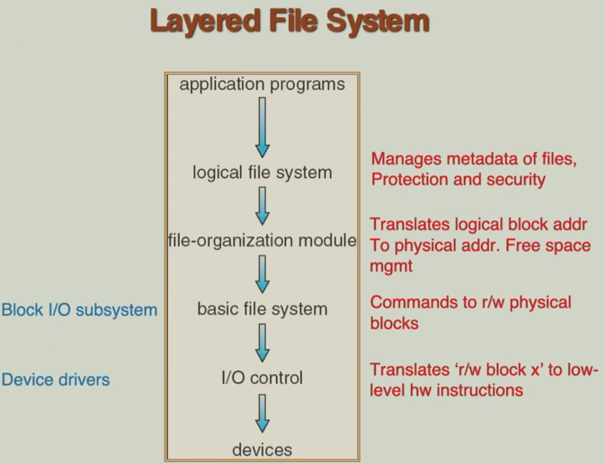
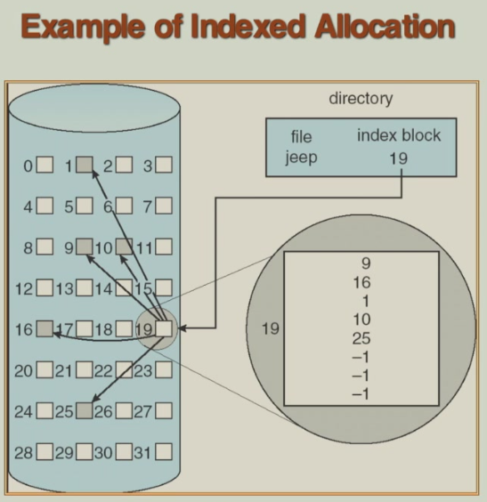
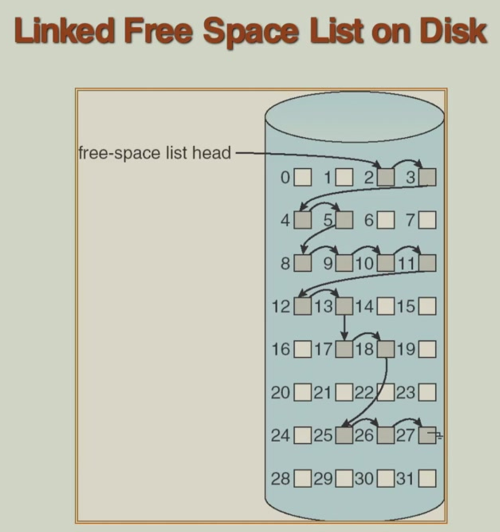

# 11 File System Implementation

!!! tip "说明"

    本文档正在更新中……

!!! info "说明"

    本文档仅涉及部分内容，仅可用于复习重点知识

## 1 File System Structure

文件结构：

1. 逻辑存储单元：文件是操作系统和用户视角下的基本数据存储单位。它是一个抽象概念，用于组织和管理数据，对用户隐藏了磁盘物理扇区、磁道等复杂细节
2. 相关信息集合：一个文件包含逻辑上相关联的数据，例如一个文本文档、一个可执行程序、一张图片或一组数据库记录

文件系统及其管理的文件，最终都持久化存储在辅助存储设备上。磁盘提供了大容量、非易失性的存储空间。文件系统并非一个单一模块，而是由多个不同职责的软件层协同构建的

<figure markdown="span">
    { width="600" }
</figure>

## 2 File System Implementation

文件系统实现时所需的两大类核心数据结构：

1. disk structures（磁盘结构）：持久化存储在磁盘上的，用于描述文件系统本身的组织

    1. boot control block（引导控制块）：通常位于卷的第一个块，包含用于启动操作系统的引导程序（如果该卷是可引导的）。在非引导卷上可能不存在
    2. volume control block（superblock in Unix）（卷控制块，超级块）：文件系统的总说明书，包含整个卷的关键信息，如块/簇的大小、总空间、空闲空间信息、inode 表的位置等。读取文件系统时首先读取此结构
    3. directory structure per file system（目录结构）：存储文件名到文件内部标识符的映射关系。它定义了文件系统的目录层次结构
    4. per file FCB（inode in Unix）（文件控制块）：描述一个文件所有属性的元数据记录。通常包含：文件大小、所有者、权限、时间戳，以及最关键的数据块指针（指示文件内容存储在磁盘的哪些块上）。Unix/Linux 中的 inode 是其经典实现

2. in-memory structures（内存结构）：运行时加载到内存中的，用于提高访问效率和管理系统状态

    1. in-memory mount table about each mounted volume（内存挂载表）：记录系统中所有已挂载文件系统的信息，如挂载点、指向其超级块的指针等
    2. directory cache（目录缓存）：缓存最近访问过的目录条目，避免每次路径解析都从磁盘读取目录，极大提高查找速度
    3. system wide open file table（系统全局打开文件表）：整个内核维护一张表，记录所有被打开文件的系统级信息
    4. per process open file table（进程级打开文件表）：每个进程都有自己的打开文件描述符表。表中的每个条目指向系统全局打开文件表中的一个条目

<figure markdown="span">
    { width="600" }
</figure>

<figure markdown="span">
    { width="600" }
</figure>

### 2.1 Virtual File System

虚拟文件系统：操作系统可能需要同时支持多种不同的文件系统。VFS 的核心作用就是为上层提供一个统一、抽象的访问接口，隐藏底层各种文件系统的具体实现差异

VFS 采用类似面向对象编程的思想来实现：

1. 定义通用接口（抽象基类）：VFS 定义了一组标准的操作接口
2. 具体文件系统实现（派生类）：每种具体的文件系统都提供一套自己的函数，来实现 VFS 定义的这些标准操作。这些函数集合通常被称为文件系统驱动
3. 运行时多态：当上层发起一个系统调用时，请求首先到达 VFS。VFS 根据操作的目标文件所属的具体文件系统类型，动态地调用该文件系统提供的对应实现

VFS 引入了一个比传统 inode 更通用的概念 vnode。vnode 是一个内核数据结构，它在整个网络范围内是唯一标识一个文件的。它包含了访问该文件所需的所有信息，无论该文件是本地磁盘上的、网络远程的，还是内存中的。每个活动的文件在内存中都有一个对应的 vnode。vnode 内部通常会包含一个指向具体文件系统特定 inode 的指针

<figure markdown="span">
    { width="600" }
</figure>

VFS 在内存中创建的四种核心数据结构：

1. superblock object（超级块对象）：一个已挂载的具体文件系统实例。它在内存中的数据结构来源于（但不完全等同于）该文件系统在磁盘上的超级块/控制块。它被加载到内存并进行补充，加入了管理挂载状态所需的信息。存储该文件系统的全局信息和管理方法，它是访问该文件系统上任何文件或目录的起点
2. inode object（inode 对象）：一个特定文件或目录本身。它在内存中的数据结构来源于（但不完全等同于）磁盘上的 inode。内存中的 inode 对象包含更多运行时信息。存储文件的元数据和关键操作接口，以及指向文件数据块的指针。一个文件在内存中只有一个 inode 对象，无论被多少个进程打开
3. dentry object（目录项对象）：文件系统目录树中的一个节点。它代表路径名中的一个组成部分。它不直接对应于磁盘上的持久化结构。它是内核为了高效进行路径名解析而动态创建和管理的缓存项。建立文件名到对应 inode 对象的映射。目录项之间通过父子关系构成一棵目录项缓存树，这极大地加速了路径名的查找过程
4. file object（文件对象）：一个进程与已打开文件之间的交互会话。它完全是一个运行时对象，由 open() 系统调用创建，close() 时销毁。它不直接对应于磁盘上的任何结构。存储一个进程访问文件时的上下文信息，以及指向该文件对应 inode 对象 和目录项对象的指针。它还包含文件操作函数表。同一个文件（同一个 inode）可以被多个进程打开，每个进程都有一个独立的文件对象

## 3 Directory Implementation

文件系统实现其目录结构的两种主要数据组织方法：

1. linear list：目录被实现为一个简单的线性列表或数组，其中的每一项包含两个核心信息：文件名和指向文件数据块（或其元数据，如 inode）的指针

    - 优点：实现简单，易于添加新文件
    - 缺点：查找效率低，删除文件可能产生空洞

2. hash table：系统维护一个哈希表。当创建或查找一个文件时，使用一个哈希函数对文件名进行计算，生成一个固定范围的索引值。这个索引值直接指向哈希表中的一个槽位。槽位中存储了指向实际文件条目（包含文件名和指针）的指针。查找时，计算哈希值并直接访问该槽位，理想情况下只需一次操作

    - 优点：查找速度极快
    - 缺点：哈希冲突：当两个不同的文件名经过哈希函数计算后得到相同的索引值时，就发生了冲突。系统必须有处理冲突的机制：

        1. 链式溢出：最常用的方法。每个哈希表的槽位不是一个单一条目，而是一个链表（或线性列表）的头指针。所有哈希到同一位置的文件条目都存储在这个链表中。查找时，在计算出的槽位对应的链表中进行顺序查找
        2. 再哈希/扩展哈希表：当哈希表过满（冲突过多）时，可以创建一个容量更大的新哈希表，将所有现有条目通过新的哈希函数（或同一函数但取更大模数）重新计算位置并插入新表。这能从根本上降低冲突概率，但操作成本较高

## 4 Allocation Methods

分配方法指的是磁盘块如何分配给文件：

1. contiguous allocation：为每个文件分配一组连续的磁盘块。在文件目录项中，只需记录文件的起始块地址和长度（块数）
2. linked allocation：文件的每个磁盘块中都包含一个指针，指向文件的下一个数据块。目录项只需记录文件的第一个块和最后一个块的地址
3. indexed allocation：为每个文件创建一个单独的索引块，其中存放一个数组，数组的每个条目指向文件的一个数据块。目录项中存放该文件的索引块地址

### 4.1 Contiguous Allocation

文件的所有数据块在物理磁盘上是紧密相邻、顺序排列的

优点：

1. 管理简单：文件系统只需在目录项中记录两个信息：起始块号和文件长度（占用的块数）
2. 顺序访问：磁头可以顺序读取，几乎没有寻道时间，效率极高
3. 随机访问：要读取文件的第 `i` 个逻辑块（从 0 开始），可通过简单计算直接定位物理块：物理块地址 = 起始块号 + `i`。这使得直接访问文件中任意位置的速度很快

缺点：

1. 外部碎片：这是最主要的问题。随着文件的不断创建和删除，磁盘上会留下许多大小不一的空闲块间隙。虽然总的空闲空间可能足够，但新文件可能因为找不到一块足够大的连续空间而无法存放。这被称为动态存储分配问题，严重浪费了磁盘空间。解决它需要进行磁盘压缩（移动文件以合并空闲空间），这是一个非常耗时的操作
2. 文件大小固定，难以扩展：创建文件时必须预先确定其最大可能大小并分配空间，如果估计过大，会造成内部碎片。如果文件后期需要增长，而其末尾紧接着的空间已被其他文件占用，则它无法就地扩展。唯一的办法是将整个文件移动到一个更大的连续空闲区域，这成本极高，通常不允许。因此，连续分配的文件系统通常不支持文件的动态增长

<figure markdown="span">
    { width="600" }
</figure>

将文件的逻辑字节地址转换为物理磁盘块地址：

1. LA：从文件开头算起的字节偏移量
2. start_address：文件在磁盘上所占用的第一个物理块的块号
3. Q = LA / 块大小：逻辑地址 LA 相对于文件起始位置的块偏移量
4. R = LA % 块大小：逻辑地址 LA 在目标块内的字节偏移量

目标物理块号 = Q + 起始地址，在该块内，从第 R 个字节开始，读取数据

!!! tip "Extent Based System"

    许多较新的文件系统使用一种改进的连续分配方案，即 extent
    
    区段是磁盘上一组连续的物理块。它是文件空间分配的基本单位。一个文件不再被强制要求存储在单一的连续区域，而是可以由多个区段（每个区段内部连续）组合而成。这解决了文件增长问题

### 4.2 Linked Allocation

文件在物理上是由一系列不连续的磁盘块组成的。每个磁盘块除了存储文件数据外，还额外包含一个指针，指向属于同一个文件的下一个磁盘块。这样，属于同一个文件的所有磁盘块就通过指针链接起来，形成一个逻辑上的链表。文件的目录项只需记录第一个块（头指针）和最后一个块（可选，方便追加）的地址

优点：无外部碎片，文件大小动态可变

缺点：

1. 只能顺序访问
2. 指针空间开销：每个块都要拿出一部分空间存储指针，减少了实际存储用户数据的空间
3. 可靠性风险：如果某个块的指针信息损坏或丢失，其后的所有数据块都将无法访问，导致文件部分或全部损坏

<figure markdown="span">
    { width="600" }
</figure>

将文件的逻辑字节地址转换为物理磁盘块地址：系统从起始块开始，沿着指针链顺序遍历 Q 次，找到第 Q 个逻辑块对应的物理块。在该物理块内，从偏移量 R 处读取/写入数据

!!! tip "File Allocation Table"

    这是链接分配的一种改进：将所有块的指针集中存储在一个单独的表格中，文件分配表（FAT），而不是分散在每个数据块里

    <figure markdown="span">
        { width="600" }
    </figure>

### 4.3 Indexed Allocation

为每个文件创建一个单独的索引块。这个索引块是一个指针数组，数组中的每个条目直接指向文件的一个数据块。文件的目录项中，不再存储起始块指针，而是存储该文件的索引块的地址。文件的所有数据块的地址（指针）都集中存储在这个索引块里

<figure markdown="span">
    { width="600" }
</figure>

优点：支持高效随机访问

缺点：

1. 索引块开销：每个文件都至少需要一个额外的磁盘块来存储索引
2. 大文件限制：一个索引块能存储的指针数量是有限的，对于超过此限制的大文件，需要更复杂的机制：

    1. 链接索引：使用多个索引块，并通过指针链接起来
    2. 多级索引：采用直接指针、一级间接指针、二级间接指针等多层结构，在空间开销和文件大小支持上取得平衡

<figure markdown="span">
    { width="600" }
</figure>

将文件的逻辑字节地址转换为物理磁盘块地址：使用 Q 作为索引，去查找文件的索引表。索引表的第 Q 个条目中存储的就是目标数据块的物理块号。读取该物理块，并在块内偏移 R 处进行访问

<figure markdown="span">
    { width="600" }
</figure>

## 5 Free Space Management

bit vector：位图法

<figure markdown="span">
    { width="600" }
</figure>

为了分配一个新文件或数据，系统需要快速找到第一个可用的空闲块：每个字的位数 x 值为 0 的字数 + 第一个 1 位的偏移量 = 块号

位图的优点：易于获得连续空间。因为可以一次性找到多个连续的空闲位，便于分配连续的文件块，提高访问效率

Linked list：链接空闲块列表。将磁盘上所有的空闲块用链表链接起来，每个空闲块中保存下一个空闲块的地址

<figure markdown="span">
    { width="600" }
</figure>

优点：几乎没有管理结构的空间浪费

缺点：很难找到多个连续的空闲块

Grouping：分组。为了解决链表法难以快速分配多个连续块的问题，采用的一种改进方案

第一组将一个空闲块（称为索引块）用来存储 n 个空闲块的地址，其中，前 n-1 个地址指向真正的空闲数据块，可以直接分配，第 n 个地址指向下一组空闲块的索引块

优点：既能快速找到多个空闲块，又能通过索引块高效地管理大量空闲块

Counting：计数。利用了文件系统中常见的现象，分配和释放往往是连续进行的

不单独记录每个空闲块，而是记录一个（起始块号，连续空闲块数）的对

优点：极大减少了管理信息的大小，非常适合管理大片的连续空闲区域

!!! tip "protect"

    关键数据结构必须保护：如果使用链表法，保护指向空闲列表的指针；如果使用位图法，保护位图本身

    这些管理结构不能只存在于内存中，必须写入磁盘持久存储。系统运行时，为了提高性能，通常会在内存中保留这些管理结构的缓存副本。这就导致可能出现内存副本与磁盘副本不一致的情况

## 6 Efficiency and Performance