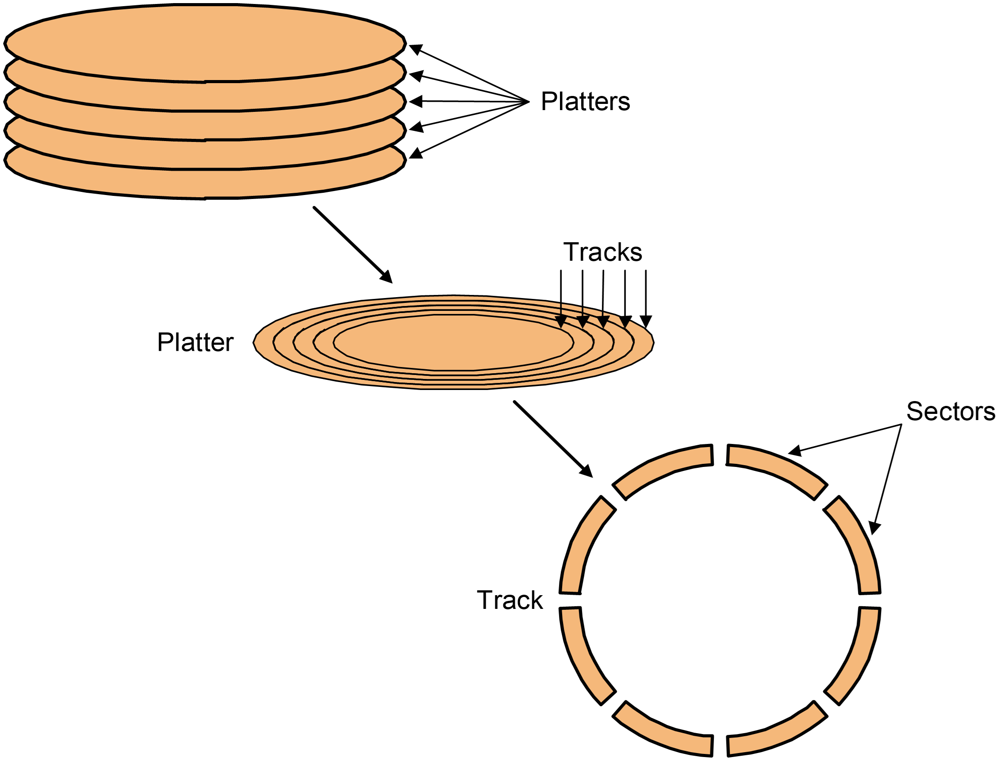
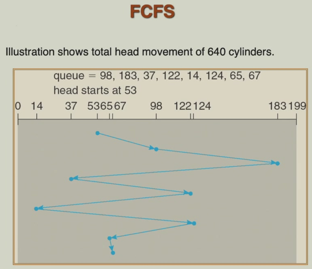
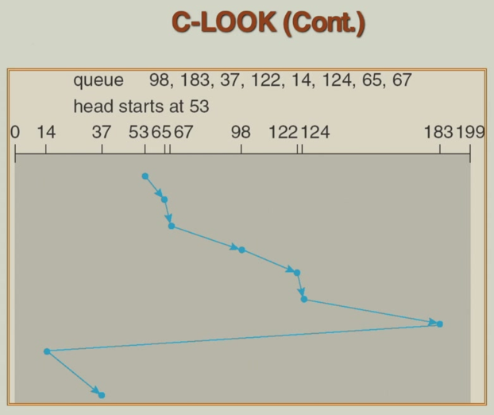
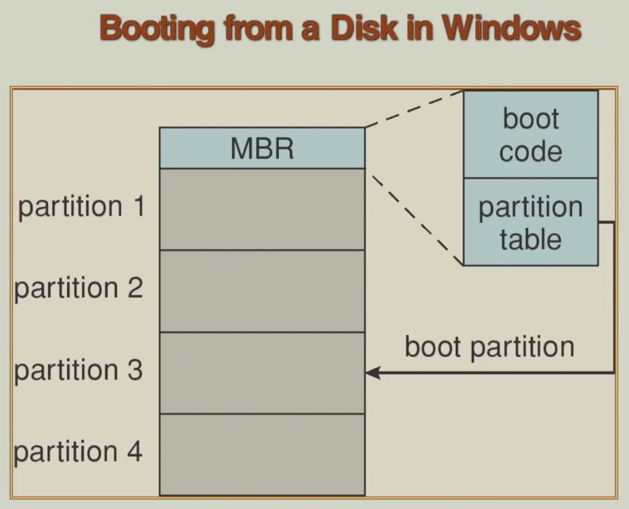
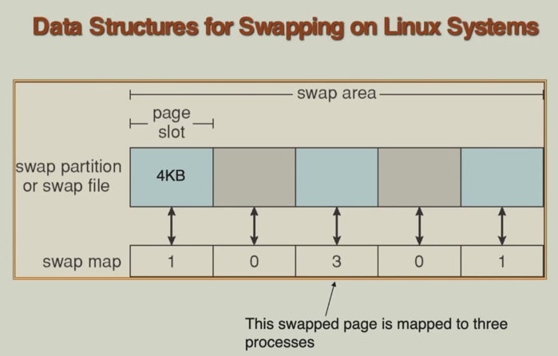
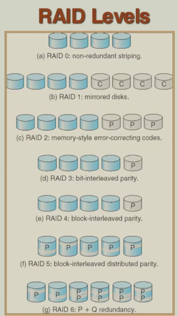
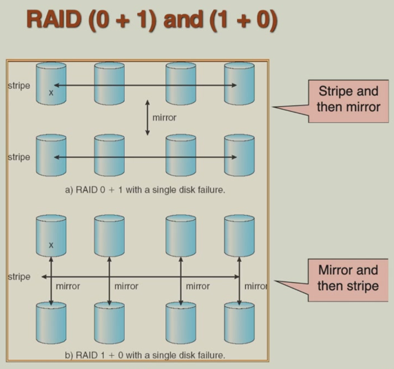
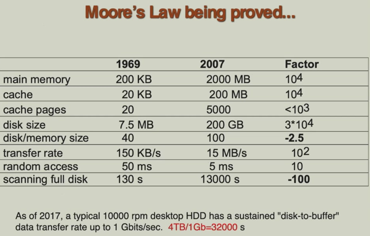

# 12 Mass storage Systems

!!! tip "说明"

    本文档正在更新中……

!!! info "说明"

    本文档仅涉及部分内容，仅可用于复习重点知识

## 1 Overview of Mass Storage Structure

硬盘作为二级存储（外存）的主要介质，用于长期、大容量数据存储

性能关键参数：

1. 转速：直接影响读写速度，单位通常是 RPM（每分钟转数）
2. transfer rate（传输速率）：衡量数据在硬盘与内存 / CPU 之间传输的速度
3. positioning time / random access time（定位时间）：seek time（寻道时间，磁头移动到目标磁道的时间） + rotational latency（旋转延迟，盘片旋转至目标扇区到达磁头下方的时间）

head crash（磁头碰撞）：磁头与高速旋转的盘片接触会导致物理损坏和数据丢失，是硬盘的严重故障

硬盘通过多种 I/O 总线与计算机连接，常见的接口包括 SATA、SCSI、USB 等。主机控制器（在主板上）与磁盘控制器（在硬盘内部）协同工作，负责数据传输与控制指令

<figure markdown="span">
    { width="600" }
</figure>

<figure markdown="span">
    { width="600" }
</figure>

!!! tip "Nonvolatile Memory Devices"

    固态硬盘（SSD）使用 NAND 闪存（属于非易失性存储器）作为存储单元，断电后数据不会丢失

    NAND 闪存不能直接覆盖已写入的数据。要更新数据，必须先将整个存储块（Block）擦除，然后再写入新数据。读取操作最快，写入操作次之，擦除最慢。这种特性被称为写入放大和擦除延迟

    每个 NAND 存储单元有一定的编程-擦除循环次数上限。超过此限制后，单元可能失效，因此 SSD 需要通过磨损均衡等技术来延长整体寿命

magnetic tape（磁带）：磁带是计算机早期常用的二级存储介质，至今仍因其大容量、低成本、数据持久的特性而在特定领域中使用

特点：

1. 访问速度极慢：由于是顺序访问介质，随机访问性能远低于磁盘
2. 传输速率尚可：一旦定位到目标位置，连续读写的传输速率可与磁盘媲美

主要用途：

1. 数据备份与归档：适用于不常访问但需长期保存的数据（如历史记录、法律文档、冷备份）
2. 系统间数据迁移：因磁带便于物理携带，曾常用于大规模数据转移

磁带缠绕在带盘中，通过机械传动经过磁头进行读写。典型容量在 20-200 GB 范围

## 2 Disk Structure

操作系统将磁盘看作一个连续的一维逻辑块数组，每个逻辑块是磁盘 I/O 操作的最小单位。这样抽象后，上层系统无需关心磁盘的物理结构，只需通过逻辑块号（LBA，logical block addressing）进行读写

逻辑块到物理扇区的映射是顺序且连续的，从最外圈柱面的第一个磁道的第一个扇区开始编号为逻辑块 0。映射顺序为：先填满当前磁道的所有扇区，然后移到同一柱面的下一个磁头（对应不同盘面的同一半径位置），当前柱面所有磁道用完后，再移到下一个柱面（从外向内依次进行）

这种映射方式使得外圈磁道的扇区密度较低但线速度较快，因此外圈区域的理论传输速率通常高于内圈。顺序访问时（尤其是从外圈开始）性能较好，因为减少了磁头移动和寻道时间

## 3 Disk Attachment

<figure markdown="span">
    { width="600" }
</figure>

host-attached storage（主机连接存储）：存储设备直接通过 I/O 总线（如 SCSI、SATA 等）连接到单个主机。性能较高，但扩展性受限，通常用于服务器或高性能工作站

Small Computer System Interface（SCSI）是一种并行总线标准，一条总线最多支持 16 个设备。SCSI 启动器通常为主机适配卡，发出 I/O 请求。SCSI 目标器为存储设备控制器，执行具体操作。每个目标器可管理多个逻辑单元（如磁盘、磁带机），支持更灵活的存储配置

fibre channel（光纤通道）：高速串行传输技术，常用于高性能存储网络

1. 支持交换式网络（Switched Fabric）：通过交换机连接，形成存储区域网络（SAN），具有高可扩展性和灵活性。提供 24 位地址空间，支持大量设备互联
2. 也支持仲裁环（FC-AL）：设备以环形拓扑连接，最多 126 个节点，结构简单但扩展性较低

<figure markdown="span">
    { width="600" }
</figure>

Network attached storage（NAS）是一种通过网络提供文件级访问的存储设备，区别于直接连接到主机总线的本地存储。它将存储功能独立出来，作为一个专用设备接入局域网，允许多个客户端共享存储资源

常见协议有 NFS（主要在 Unix/Linux 系统中使用，实现跨网络的文件共享）和 CIFS（主要在 Windows 系统中使用，支持跨平台文件访问）。这两种协议都通过远程过程调用（RPC）机制实现客户端与 NAS 设备之间的通信，实现文件操作请求与响应的传输

iSCSI 是一种基于 IP 网络的存储协议，它在 TCP/IP 网络上封装并传输 SCSI 命令。与 NAS 不同，iSCSI 提供块级存储访问，使其更像是通过 IP 网络访问本地磁盘，常用于构建 IP SAN（存储区域网络）

<figure markdown="span">
    { width="600" }
</figure>

## 4 Disk Scheduling

!!! tip "accessing a disk page"

    访问时间的三个组成部分：

    1. seek time：磁头移动到目标磁道的时间，受磁头机械运动速度限制
    2. rotational delay：盘片旋转使目标扇区到达磁头下方的时间，与转速相关（半圈平均延迟）
    3. transfer time：实际读取或写入数据的时间，与数据传输速率和块大小相关

    寻道和旋转延迟（机械运动时间）占主导地位，通常远大于传输时间。以 4KB 页为例，传输时间仅约 1ms，而寻道 + 旋转延迟可达数毫秒至数十毫秒

    降低 I/O 成本的关键在于减少寻道和旋转延迟。可从两个层面解决：

    1. 硬件层面：提高转速、采用更快的磁头定位技术、使用缓存
    2. 软件/系统层面：通过调度算法减少磁头移动、使用预读和延迟写策略、数据布局优化等

!!! tip "multi actuator technology"

    驱动器是控制机械硬盘读写头定位的核心机械部件，它通过移动驱动器臂将读写头带到指定磁道上方。每个盘片表面通常对应一个读写头，它们都安装在同一组驱动器臂上

    传统硬盘只配备单一驱动器，这意味着所有读写头必须同步移动。即使只需要访问某一个盘面上的某个磁道，其他盘面的读写头也会被一同带动到对应位置，无法独立操作

    多驱动器技术指在一个硬盘内集成多个独立的驱动器系统，允许不同盘面上的读写头独立移动和并行操作。这种设计可显著提升硬盘的并发 I/O 能力，缩短寻道时间，尤其适合多线程、高并发的应用场景

操作系统在磁盘管理中负责高效利用磁盘硬件资源，主要体现在提升访问速度（减少延迟）和增加吞吐带宽

磁盘访问时间的两个核心延迟因素：寻道时间和旋转延迟。两者中寻道时间通常占主导，因此调度策略着重优化它

调度的主要目标就是最小化寻道时间，通过减少磁头移动距离来实现。常用指标是 seek distance（寻道距离），作为寻道时间的近似衡量

disk bandwidth（磁盘带宽）指传输的总字节数除以从第一个服务请求开始到最后一个传输完成所经过的总时间，反映单位时间内数据传输量，是系统吞吐能力的整体指标

典型调度算法：

FCFS：按请求顺序处理，简单但性能较差

<figure markdown="span">
    { width="600" }
</figure>

SSTF（最短寻道时间优先）：选择离当前磁头位置最近的请求，可能产生饥饿

<figure markdown="span">
    { width="600" }
</figure>

SCAN（电梯算法）：磁头沿一个方向移动，服务途中的请求，到头后反向

<figure markdown="span">
    { width="600" }
</figure>

C-SCAN（循环扫描）：类似 SCAN，但只单向服务，返回时不做服务

<figure markdown="span">
    { width="600" }
</figure>

LOOK 与 C-LOOK：SCAN/C-SCAN 的改进版，只移动到最远请求位置即返回

<figure markdown="span">
    { width="600" }
</figure>

<figure markdown="span">
    { width="600" }
</figure>

算法选择依据：

1. SSTF：直观易实现，适合一般负载，但可能引起某些请求长期等待（饥饿）
2. SCAN / C-SCAN：适合高负载系统，能提供更均匀的响应时间，避免饥饿问题

SSTF 或 LOOK 是常用的默认选择，兼顾性能和实现复杂度

## 5 Disk Management

磁盘格式化过程：

1. 低级格式化（物理格式化）：在出厂时或初始化阶段，将磁盘表面划分为磁道和扇区，并写入扇区地址信息，以便控制器定位
2. 分区：将磁盘逻辑划分为一个或多个独立区域，每个分区可独立管理
3. 逻辑格式化（创建文件系统）：在分区内建立文件系统结构，包括超级块、inode 表、目录结构等元数据，使操作系统能以文件形式管理数据

boot block（引导块）是磁盘上的特殊区域，存放引导加载器程序。计算机启动时，ROM 中的引导程序首先运行，加载磁盘引导块中的引导加载器，再由后者加载操作系统内核

扇区备用（坏块替换）：磁盘控制器或操作系统检测到损坏扇区时，将其映射到预留的正常扇区，确保数据可靠性

<figure markdown="span">
    { width="600" }
</figure>

## 6 Swap Space Management

交换空间作为虚拟内存系统的一部分，当物理内存不足时，操作系统将部分内存数据暂时换出到磁盘上的交换空间，以腾出内存供其他程序使用

交换空间可以作为普通文件存放在现有文件系统中，但更常见的做法是使用独立磁盘分区，以提高性能和管理效率

不同系统的管理策略：

1. 4.3BSD（早期 Unix 系统）：进程启动时即预留交换空间，存储整个进程的代码段和数据段，实现较为保守
2. Solaris（现代 Unix 系统）：采用按需分配策略，仅在实际需要换出页面时才分配交换空间，提高了空间利用率，减少了不必要的预留

内核通过交换映射表等数据结构跟踪哪些内存页已被换出、换出到交换空间的哪个位置，以便需要时能正确换入

<figure markdown="span">
    { width="600" }
</figure>

## 7 RAID Structure

Redundant Arrays of Independent Disks：通过组合多个独立磁盘来提升存储系统的性能和/或可靠性。核心目标是通过冗余（存储额外校验或镜像数据）来提高数据可靠性，防止单点故障导致数据丢失

RAID 将多个物理磁盘组合成一个逻辑单元，操作系统将其视为一个整体。通过数据条带化（striping）、镜像（mirroring）和奇偶校验（parity）等技术，在性能、容量和容错之间取得平衡

RAID 的核心思想是通过多个磁盘并行工作来提升性能（通过并行读写）和可靠性（通过冗余）

1. striping：将数据分割成小块，并分布到多个磁盘上，实现并行访问

    1. 位级条带化：将数据的每个位分布到不同磁盘（已较少使用）
    2. 块级条带化：将文件分成固定大小的块，轮流存储到不同磁盘上，是当前主流方式

2. mirroring / shadowing：每个数据块在另一个磁盘上保存完整副本（如 RAID 1）
3. Block Interleaved Parity：通过计算并存储奇偶校验信息（而非完整副本）来实现冗余（如 RAID 5、RAID 6）

<figure markdown="span">
    { width="500" }
</figure>

1. RAID 1（镜像）：通过完全复制数据到另一块磁盘实现冗余，提供高可靠性。读取性能可提升（支持并行读），写入性能略降（需写两份）。只要有一块盘正常，系统仍可运行
2. RAID 2（汉明码校验）：使用汉明码进行纠错，理论可靠但实现复杂，成本高，实际很少使用
3. RAID 3（字节条带化 + 专用奇偶校验盘）：数据按字节或位拆分到多块盘，校验信息集中在单独一块盘。每次写入都需更新校验盘，容易成为瓶颈
4. RAID 4（块条带化 + 专用奇偶校验盘）：类似 RAID 3，但以块为单位条带化。校验盘仍是瓶颈，尤其在小块随机写入时性能差（需读旧数据和校验、计算新校验、写回）
5. RAID 5（块条带化 + 分布式奇偶校验）：校验信息均匀分布在各盘上，避免单一校验盘瓶颈。支持单盘故障容错，是兼顾性能、可靠性和存储利用率的主流方案
6. RAID 6（双分布式奇偶校验）：使用两组独立校验，可容忍同时两块磁盘故障，适用于对可靠性要求极高的场景

> RAID 5 和 RAID 6 因其分布式校验设计，在现代存储系统中应用广泛；RAID 1 适用于对可靠性要求高且预算充足的场景；RAID 2、3、4 因性能瓶颈或实现复杂已较少使用

<figure markdown="span">
    { width="600" }
</figure>

## 8 Stable Storage Implementation

稳定存储主要用于支持预写日志等机制，确保在系统崩溃或故障时能够恢复数据一致性。稳定存储保证一旦数据被确认写入，即使在电源故障等情况下也不会丢失

实现原则：

1. 冗余存储：将数据同时写入多个独立的非易失性存储介质，避免单点故障
2. 受控更新：采用严格的写入顺序和校验机制（如先写日志再写数据、使用校验和、原子写入等），确保即使在写入过程中发生故障，也能通过恢复流程还原到一致状态

!!! tip "tertiary storage"

    三级存储：在存储层次中，它位于一级存储（主存/内存）和二级存储（硬盘/SSD）之下。主要目标是提供大容量、低成本的长期数据存储，常用于数据备份、归档和不常访问的数据

    主要特点：
    
    1. 低成本：单位存储容量的价格远低于硬盘或 SSD
    2. 可移动介质：存储介质可物理移除和替换，便于离线保存、运输和数据交换
    
    常见介质类型包括软盘、CD-ROM、磁带、DVD、蓝光光盘等。现代三级存储也涵盖大容量外部硬盘、磁带库、光学存储系统以及云存储中的冷存储层

!!! tip "removable disks"

    可移动磁盘
    
    软盘由柔性盘片和磁性涂层组成，封装在塑料保护壳内。类似技术后来发展为更高容量的可移动磁盘，如 Zip 磁盘、Jaz 磁盘等，它们使用更先进的磁记录技术和更坚固的外壳

    可移动磁盘的读写速度可接近硬盘，尤其是采用高速接口的现代外置硬盘或固态移动硬盘。但由于介质常暴露在外部环境中，面临物理损伤（划痕、灰尘、磁场）、意外掉落或接口损坏等风险，可靠性通常低于内置硬盘

    磁光盘结合磁与光技术。写入时，激光局部加热盘片，使其矫顽力降低，同时外加磁场改变该点的磁化方向（代表 0/1）。读取时，利用克尔效应——反射激光的偏振方向因磁化方向不同而改变，从而识别数据。磁头与盘面距离较大，且盘片有坚固保护层，因此抗刮擦、耐磨损、几乎免疫磁头碰撞，适合长期归档存储

    光盘使用纯光学技术，通过激光在特殊材料上产生物理/化学变化来记录数据，通过反射光强弱读取。包括 CD、DVD、蓝光光盘等，具有成本低、易于复制、抗电磁干扰等优点，但一般写入速度较慢，且大多为只读或一次性写入

!!! tip "WORM Disks"

    Write Once, Read Many Times，一次写入多次读取

    WORM 是一种不可更改的存储介质，数据一旦写入便无法修改，但可多次读取。适用于需要数据完整性、防篡改的场景，如法律文档、财务记录、档案保存等

    物理结构是在两片透明基板（玻璃/塑料）之间夹一层薄铝膜。数据写入时，通过激光在铝膜上烧蚀形成微孔（或改变反射率），代表二进制数据。由于是物理改变，数据无法被覆盖或修改，只能销毁（但通常不可逆）

    因无机械磁头、无磁性材料，且密封结构防尘防刮，具有高耐用性、长寿命。只读光盘（如 CD-ROM、DVD-ROM）是 WORM 的一种特殊形式，数据在工厂预制，用户无法写入

    一次性刻录光盘（CD-R、DVD-R、BD-R）也属于 WORM 类型。在数字归档、合规存储中仍在使用，尤其适合法律、医疗、政府等对数据审计和留存有严格要求的领域

!!! tip "Tapes"

    磁带：

    1. 优点：单位存储成本低、容量大、功耗低、寿命长（适合长期保存）
    2. 缺点：顺序访问介质，随机访问性能极差（需倒带/寻址），通常只适合顺序读写场景

    主要应用场景：

    1. 数据备份与灾难恢复：企业常用磁带进行定期全量/增量备份
    2. 海量冷数据归档：如科研数据、媒体资料、法律合规存档等不常访问但需长期保留的数据
    3. 数据分级存储：作为存储层次中的最低层（三级存储）

    磁带库系统：机械臂自动换带系统实现磁带的自动装载、卸载和归位，支持大规模、自动化磁带管理。堆叠式适用于中小规模，大型磁带库（如磁带仓） 可管理数千盘磁带，实现 PB 甚至 EB 级存储

    磁盘上的文件可以 archive（归档）到磁带上进行低成本存储；计算机可以将其 stage（回迁）到磁盘存储中供活动使用

操作系统通常将可移动磁盘视为普通块设备，支持文件系统。用户可以像使用内置硬盘一样进行格式化、创建文件夹、复制文件等操作，兼容性好，使用方便

磁带通常以原始设备（raw device）形式暴露给应用程序，操作系统不提供标准的文件系统层。磁带驱动器一次只能由一个应用程序控制，不支持多任务并发访问。应用程序需自行实现数据布局、块划分、索引和错误处理逻辑。不同程序写入的磁带往往无法直接互换读取，导致磁带数据通常与创建它的软件绑定

操作系统的主要任务是管理物理设备，为应用程序提供虚拟机抽象。对于硬盘，操作系统提供两种抽象：

1. raw device（原始设备）：将硬盘视为线性的数据块数组（逻辑块寻址），应用程序可直接访问特定块号
2. file system（文件系统）：在原始设备之上构建层次化命名空间。负责请求调度：对多个应用程序的并发 I/O 请求进行排序、合并、缓存，以优化性能并确保数据一致性、

!!! tip "Tape Drives"

    磁带操作命令：
    
    1. 定位（locate）：将磁带移动到指定逻辑块位置，类似磁盘的寻道（seek），但磁带是线性移动而非径向移动
    2. 读取位置（read position）：查询当前磁头所在的逻辑块号，用于确定磁带位置
    3. 间隔（space）：使磁带相对当前位置向前或向后移动指定数量的块，实现快速跳转
    
    磁带不支持随机覆盖写入。若要修改磁带中间的某个块，必须从该点开始重写其后所有数据，否则后续数据将被覆盖或丢失。这一特性使磁带不适合频繁更新的应用，但非常适合顺序写入、长期保存的场景

    EOT（End Of Tape）标记：在每次写入操作的结尾自动写入一个特殊标记，用于标识已写入区域的结束，防止误读空白区域

    磁盘支持随机读写，可直接覆盖任意扇区。磁带本质上是顺序访问介质，更新成本高，通常只用于一次写入、多次读取或全序列重写的场景

当我们需要在一台计算机上的可移动存储介质中写入数据，然后在另一台计算机上使用该介质时，文件命名问题尤为困难。不同系统对文件名编码、路径格式、文件属性的支持存在差异，可能导致文件无法正确识别或访问

大多数操作系统未完全解决跨平台兼容性问题，通常依赖文件系统本身的兼容性来减少问题。用户和应用程序常需自行处理命名冲突、字符集转换或使用通用命名规则

高度标准化的介质（如 CD/DVD/蓝光光盘）使用统一文件系统，并严格规定文件名长度、字符集和目录结构，确保了跨平台兼容性。这类介质在制造或刻录时即遵循标准，因此在不同系统上均可正常读取

!!! tip "Hierarchical Storage Management"

    分级存储管理（HSM）：将存储介质按速度、成本和容量分为多个层次，并根据数据的访问频率和重要性自动在不同层级间迁移数据

    通常通过扩展文件系统来整合三级存储：

    1. 热数据：频繁访问的小文件保留在高速磁盘（二级存储）
    2. 冷数据：不常访问的大文件、旧文件自动迁移到低成本磁带/光盘（三级存储），释放磁盘空间

    三级存储通常实现为磁带或可移动磁盘的自动点播机

    > jukebox（自动点播机）：一种自动化磁带库或光盘库，可机械切换介质，实现海量近线存储

    HSM 通常见于超级计算中心和其他拥有海量数据的大型设施中

三级存储速度的两个维度：

1. bandwidth：衡量数据传输的吞吐能力

    1. Sustained Bandwidth（持续带宽）：仅计算数据实际传输期间的速率，不包括机械准备时间。反映介质本身的物理读写速度
    2. Effective Bandwidth（有效带宽）：涵盖整个 I/O 过程的平均速率，包括寻道/定位、机械臂移动、介质加载/卸载、数据验证等时间。更真实地反映实际使用场景下的性能

2. latency：从发出 I/O 请求到开始接收数据所需的时间，包括定位介质、机械准备等开销

三级存储由于涉及机械操作（如磁带定位、机械臂取放盘片），有效带宽通常远低于持续带宽。在连续大文件传输时，有效带宽接近持续带宽；但在小文件随机访问时，机械开销占主导，有效带宽显著下降

access latency（访问延迟）：定位数据所需的时间

1. 磁盘访问延迟：主要由寻道时间（1–20 ms）和旋转延迟（0–10 ms）构成，通常在 35 ms 以内
2. 磁带访问延迟：由于需机械卷绕磁带至目标位置，延迟可达数十秒甚至数分钟，尤其是对磁带中部的随机块访问

磁带随机访问比磁盘慢约 1000 倍，因此磁带几乎不适合需要快速随机读写的场景

三级存储通过共享昂贵驱动器（机械臂、读写机构） 和使用低成本可替换介质（磁带、光盘）来实现低单位容量成本。这种架构牺牲了并发访问能力和响应速度，但极大降低了海量数据存储的总拥有成本

磁带库等可移动介质库的 I/O 处理能力有限（受机械操作速度制约），通常每小时只能处理几十到几百个 I/O 请求。因此最适合冷数据或归档数据存储，即访问频率低、但需长期保留的大容量数据

!!! tip "Reliability"

    设备可靠性：

    1. 固定硬盘（内置硬盘）：由于封装严密、工作环境稳定，且无频繁插拔，通常具有更高的平均无故障时间（MTBF）
    2. 可移动磁盘/磁带驱动器：常暴露于外部环境，存在接口磨损、灰尘污染、机械冲击等风险，可靠性相对较低

    介质可靠性：

    1. 光盘（如 CD/DVD/BD）：采用光学读写，无磁头接触，且介质通常有保护层，抗刮擦、抗磁场干扰，长期保存性较好
    2. 磁盘/磁带：磁性介质易受磁场、高温、潮湿影响，且磁带存在粘连、变形等问题，长期可靠性较低

    硬盘磁头碰撞：磁头与高速旋转盘片接触会导致盘面划伤，常造成数据永久性丢失

    磁带/光盘驱动器故障：通常仅影响读写功能，数据介质本身往往完好，可更换驱动器后继续读取，数据恢复可能性高

!!! tip "Cost"

    存储成本层次：

    1. 主存（RAM）：单位容量成本最高，但速度快，用于临时存储运行中的数据和程序
    2. 硬盘（二级存储）：成本远低于主存，是当前在线数据存储的主力
    3. 磁带（三级存储）：单位容量成本最低，但访问速度慢，适合大容量离线/近线存储

    如果仅使用单盘磁带且不共享驱动器，硬盘的单位存储成本已与磁带接近，甚至更低（得益于硬盘容量快速增长和价格下降）。然而，磁带系统的成本优势体现在驱动器与介质分离的架构上

    磁带库等三级存储系统通过少量昂贵驱动器配合大量廉价磁带，实现高容量存储。只有当磁带数量远多于驱动器数量时，才能摊薄驱动器成本，使单位存储成本显著低于硬盘。这要求数据具有低访问频率，否则驱动器将成为瓶颈，无法发挥成本优势

    <figure markdown="span">
        { width="600" }
    </figure>

    <figure markdown="span">
        { width="600" }
    </figure>

    <figure markdown="span">
        { width="600" }
    </figure>

<figure markdown="span">
    { width="600" }
</figure>
