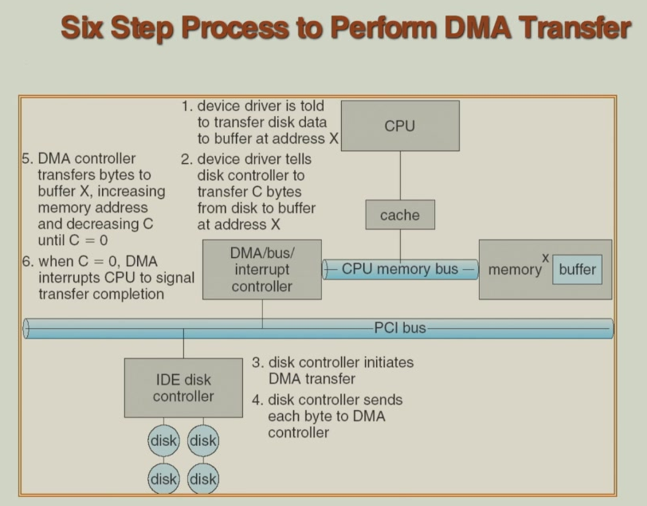
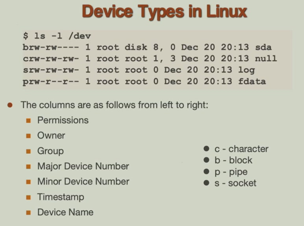

# 13 I/O Systems

!!! tip "说明"

    本文档正在更新中……

!!! info "说明"

    本文档仅涉及部分内容，仅可用于复习重点知识

## 1 I/O Hardware

1. port（端口）：设备与系统通信的接口
2. bus（总线）：连接多个设备的通信路径，可以是 daisy chain（菊花链式）或者 direct access（共享直连式）
3. controller / host adapter（控制器 / 主机适配器）：管理设备与系统之间数据传输的硬件

通过 I/O 指令直接控制设备。每个设备有唯一的地址，系统可通过两种方式访问：

1. special I/O instructions：专用 I/O 指令
2. memory-mapped I/O：内存映射 I/O。将设备地址映射到内存地址空间

有些计算机系统同时采用上述两种寻址方式，以兼容不同设备和提高灵活性

<figure markdown="span">
    { width="600" }
</figure>

<figure markdown="span">
    { width="600" }
</figure>

I/O port registers（I/O 端口寄存器）：它们是主机（CPU）与 I/O 设备之间进行通信和控制的关键硬件接口。这些寄存器通常位于设备的控制器上，CPU 通过访问这些寄存器来管理设备的数据传输与状态

1. data-in（数据输入寄存器）：用于存放从设备输入到主机的数据。例如，当键盘有按键输入时，按键的扫描码会暂存在此寄存器中，供 CPU 读取
2. data-out（数据输出寄存器）：用于存放从主机输出到设备的数据。例如，CPU 将要显示的字符写入显卡的数据输出寄存器，由显卡处理后显示在屏幕上
3. status（状态寄存器）：反映设备的当前状态，如忙碌、就绪、错误等。CPU 通过读取此寄存器来判断设备是否可进行下一次操作
4. control（控制寄存器）：用于向设备发送控制命令或设置工作模式。例如，CPU 通过写入控制寄存器来启动磁盘读取、设置串口波特率等

### 1.1 Polling

polling（轮询）：可通过轮询方式进行 I/O 操作

1. 主机反复读取 busy 标志位，直到该位被清除（表示设备就绪）
2. 主机在命令寄存器中设置 write 位，并将一个字节写入数据输出寄存器
3. 主机设置 command-ready 位
4. 当控制器注意到 command-ready 位被设置时，它设置 busy 位
5. 控制器读取命令寄存器，识别出是写命令。然后读取数据输出寄存器获取该字节，并执行对设备的 I/O 操作
6. 控制器清除 command-ready 位，清除状态寄存器中的 error 位（表示设备 I/O 操作成功），并清除 busy 位（表示操作完成）

特点：

1. 同步等待：CPU 在步骤 1 中持续循环检查设备的 busy 位，直到设备就绪。在此期间 CPU 不能执行其他任务，造成资源浪费
2. 写入命令与数据：设备就绪后，CPU 通过设置命令寄存器和数据输出寄存器来告知设备要执行的操作及要写入的数据
3. 设备响应：控制器检测到命令后，标记自身为 busy ，读取命令和数据，执行实际的 I/O 操作（如写入磁盘、发送到串口等）
4. 状态清理与完成：操作完成后，控制器更新状态寄存器（清除错误标志和忙标志），表示可以接收下一个命令

### 1.2 Interrupt

interrupt（中断）是一种比轮询更高效的 I/O 事件处理方式

1. interrupt-request line（中断请求线）：硬件设备通过物理信号线向 CPU 发送中断请求，表示它需要 CPU 的注意或已完成某个操作
2. interrupt handler（中断处理程序）：是一段预先定义好的软件代码，当中断发生时由 CPU 调用，用于处理相应的 I/O 事件或设备请求
3. maskable interrupt（可屏蔽中断）：大多数中断可以被 CPU 临时屏蔽（忽略），通常通过设置状态寄存器中的标志位实现。这对于处理高优先级任务或关键代码段时非常有用
4. interrupt vector（中断向量）：是一个指向各个中断处理程序入口地址的表格（数组）。每个中断类型对应一个唯一的中断向量号，CPU 根据该号快速定位到相应的处理程序。不同中断有不同优先级，高优先级中断可以打断低优先级中断的处理

    1. nonmaskable interrupt（NMI，不可屏蔽中断）：如电源故障、硬件错误等关键事件，不能被屏蔽，必须立即处理
    2. interrupt chain（中断链）：当设备数量超过中断向量条目时，多个设备可共享一个中断向量，形成链表结构，处理程序依次检查是哪个设备触发了中断

5. 异常处理：中断机制不仅用于 I/O 事件，也用于处理 CPU 内部异常（如除零错误、页面错误等），实现了统一的事件响应框架

<figure markdown="span">
    { width="600" }
</figure>

<figure markdown="span">
    { width="600" }
</figure>

不同类型中断的处理机制：

1. page fault（缺页中断）：这是内存管理单元（MMU）检测到访问的页面不在物理内存时产生的中断。保存当前进程上下文 → 将其状态改为等待（通常放入等待队列）→ 调度其他进程运行 → 当页面加载完成后恢复原进程
2. trap（s/w interrupt）：由软件指令主动触发的中断，用于从用户模式切换到内核模式。常见于系统调用（如读写文件、创建进程等）。保存用户程序状态 → 提升特权级别到内核模式 → 执行系统服务

高优先级中断可以打断正在处理的低优先级中断。这确保了关键事件（如硬件故障、实时设备）能得到及时响应

分层中断处理（高/低优先级协作）：

1. 高优先级处理程序

    1. 记录 I/O 状态：快速保存设备操作的关键信息
    2. 清除设备中断：通知设备中断已被接收，避免重复触发
    3. 启动下一个 I/O：保持设备持续工作，提高吞吐量
    4. 引发低优先级中断：将耗时操作推迟到低优先级中断处理

2. 低优先级处理程序

    1. 数据复制：将内核缓冲区的数据传输到用户空间
    2. 进程调度：将等待 I/O 完成的进程重新放入就绪队列

### 1.3 Direct Memory Access

programmed I/O：指 CPU 通过执行指令来亲自管理每个字节/字的数据传输（如轮询或中断）。但是当传输大量数据（如硬盘读写、网络数据包、图形数据）时，CPU 会花费大量时间在简单的数据搬运上，严重影响系统整体性能

DMA 通过一个独立的 DMA 控制器来处理数据传输任务。数据直接在 I/O 设备（如硬盘、网卡）和内存之间流动，无需经过 CPU 寄存器。在此期间，CPU 可以继续执行其他任务，只需在传输开始和结束时介入

DMA 简化的工作流程：

1. 初始化：CPU 设置 DMA 控制器，告知：源地址（如 I/O 设备缓冲区）、目标地址（如内存位置）、传输数据量
2. 启动传输：CPU 启动 DMA 操作后，即可处理其他任务
3. 数据传输：DMA 控制器独立管理数据在设备和内存间的传输
4. 完成通知：传输完成后，DMA 控制器通过中断通知 CPU

<figure markdown="span">
    { width="600" }
</figure>

## 2 Application I/O Interface

I/O 系统调用：操作系统提供的一组标准化函数（如 read(), write(), open(), close()），应用程序通过这些接口访问设备，无需关心具体硬件实现

设备驱动程序层：位于内核中，直接与硬件控制器通信，将通用的系统调用转换为特定设备的操作指令

设备在多个维度上各不相同：

| 维度 | 类型 | 示例 |
| -- | -- | -- |
| 数据组织 | 字符流 | 以字节流形式处理数据，如键盘、鼠标、串口 |
|  | 块设备 | 以固定大小的数据块为单位，如硬盘、SSD、U盘 |
| 访问方式 | 顺序访问 | 必须按顺序读写，如磁带机 |
|  | 随机访问 | 可直接跳转到任意位置读写，如硬盘 |
| 共享属性 | 可共享 | 多个进程可同时使用，如硬盘、打印机（带假脱机） |
|  | 独占 | 一次只能被一个进程使用，如磁带机、某些安全设备 |
| 操作速度 | 低速到高速 | 从键盘（慢）到 NVMe SSD（极快），速度差异巨大 |
| 访问权限 | 读写 | 大多数存储设备 |
|  | 只读 | CD-ROM、某些传感器 |
|  | 只写 | 打印机、某些日志设备 |

<figure markdown="span">
    { width="600" }
</figure>

!!! example "Linux/Unix"

    Linux/Unix 系统中，设备文件是操作系统将硬件设备和某些特殊功能抽象为文件的体现，位于 `/dev` 目录下

    1. SCSI 设备命名（现代存储设备）：`sd` + 字母序号

        1. `/dev/sda`：第一块 SCSI/SATA/USB 存储设备
        2. `/dev/sdb`：第二块设备
        3. `/dev/sda3`：第一块设备的第三个分区（分区用数字表示）

    2. ATA 设备命名（旧式 IDE 硬盘）：`hd` + 字母序号

        1. `/dev/hda`：第一块 IDE 硬盘
        2. `/dev/hdd2`：第四块 IDE 硬盘的第二个分区

    3. 伪设备（特殊功能文件）：这些不是真实的硬件设备，而是操作系统提供的特殊功能接口

        1. `/dev/zero`：输出无限个零字节。用于初始化文件、填充磁盘区域
        2. `/dev/null`：丢弃所有输入，输出为空。用于丢弃不需要的输出
        3. `/dev/random`：生成高质量的随机数。用于加密、密钥生成、安全相关应用

<figure markdown="span">
    { width="600" }
</figure>

<figure markdown="span">
    { width="600" }
</figure>

!!! tip "Block and Character Devices"

    块设备：包括磁盘驱动器。以固定大小的数据块为单位进行读写。支持随机访问，可直接跳转到任意位置读写数据。包括 read、write、seek 命令。支持原始 I/O 或文件系统访问，可能支持内存映射文件访问

    字符设备：包括键盘、鼠标。以字符流为单位进行读写。通常是顺序访问，数据按到达顺序处理。通常不支持随机访问或寻道操作。包括 get、put 命令。可通过软件库在基础字符流上实现更高级功能，例如行编辑、回显等

!!! tip "Network Devices"

    网络设备（如网卡、调制解调器等）在数据传输特性上与块设备、字符设备有本质区别，因此，网络设备不适合直接套用块设备或字符设备的抽象模型，需要有自己专门的接口

    Unix 和 Windows 等现代操作系统通过套接字（Socket）接口为应用程序提供统一的网络编程接口，将网络协议与网络操作分离，为服务器提供 select 功能（允许服务器同时监控多个套接字的活动）

!!! tip "Clocks and Timers"

    时钟和定时器是计算机系统中的重要硬件组件，主要负责获取当前时间、测量已用时间、定时/计时

    programmable interval timer（可编程间隔定时器）：是硬件定时器的一种，可由软件配置。用于计时，生成周期性中断

    在 Unix 系统中，`ioctl` 系统调用涵盖诸如时钟和定时器等 I/O 操作的非常规方面

!!! tip "Blocking and Nonblocking I/O"

    blocking I/O（阻塞 I/O，同步阻塞）：进程发起 I/O 请求，被操作系统挂起，I/O 完成后，进程被唤醒并继续执行

    nonblocking I/O（非阻塞 I/O，同步非阻塞）：进程发起 I/O 请求，但立即返回，如果没有数据可用，返回错误码，进程需要反复轮询检查 I/O 是否就绪

    asynchronous I/O（异步 I/O）：进程发起 I/O 请求后立即返回，I/O 操作在后台由操作系统执行，进程继续执行其他任务，I/O 完成后，通过回调函数、信号或事件通知进程

    <figure markdown="span">
        { width="600" }
    </figure>

## 3 Kernel I/O Subsystem

scheduling：每个 I/O 设备都有自己的请求队列，操作系统调度器决定队列中请求的执行顺序

buffering（缓冲）：缓冲是在内存中创建临时存储区域，用于协调设备间的数据传输

1. 解决速度不匹配：

    1. 问题：快速设备向慢速设备传输数据时，快速设备需要等待
    2. 方案：数据先存入缓冲区，快速设备可继续工作

2. 解决传输单元大小不匹配：

    1. 问题：发送方和接收方的数据块大小不一致
    2. 方案：在缓冲区中重组数据包

3. 维护写时复制语义

    1. 问题：进程调用 write() 后修改了缓冲区内容，write() 应该写入调用时的数据，即使缓冲区后来被修改
    2. 方案：内核复制用户缓冲区的数据到内核空间

caching：将频繁访问的数据副本存储在更快的存储介质（通常是内存）中，目的是加速后续对相同数据的访问。缓存中的数据是原始数据的副本，可能过时

spooling（假脱机）：将输出数据暂存到中间存储（通常是磁盘），然后由后台进程按顺序将数据发送到设备。主要用于打印系统，每个打印任务被假脱机到磁盘队列，打印机按顺序处理队列中的任务，用户应用程序在数据假脱机后即可继续运行

device reservation（设备预留）：为进程提供对设备的独占访问权，防止多个进程同时访问导致冲突或数据损坏。可通过系统调用预留或释放设备

!!! tip "Error Handling"

    操作系统通常能够从常见 I/O 错误中恢复：磁盘读取失败、设备不可用、临时写入故障、传输超时

    当 I/O 操作失败时，系统通过标准化的方式通知应用程序，例如返回错误代码/编号、抛出异常、设置状态寄存器对应位置

    操作系统维护集中化的错误记录系统

!!! tip "I/O Protection"

    用户进程可能意外或故意尝试通过非法 I/O 指令破坏正常操作，操作系统需要 I/O 保护机制

    I/O 指令被标记为特权指令，只能在核心态执行。用户程序尝试执行特权指令会触发异常/陷阱

    所有 I/O 操作必须通过操作系统提供的安全接口来执行。内存映射 I/O 区域、I/O 端口空间、内存管理单元（MMU）也需要受到保护

## 4 Transforming I/O Requests to Hardware Operations

## 5 Performance