# 2 Operating System Structures

<!-- !!! tip "说明"

    本文档正在更新中…… -->

!!! info "说明"

    本文档仅涉及部分内容，仅可用于复习重点知识

## 1 Operating System Services

一组操作系统服务提供对用户有帮助的功能：

1. user interface: CLI, GUI
2. program execution
3. I/O operations
4. file system manipulation
5. communications：进程可在同一台计算机或通过网络在不同计算机之间交换信息
6. error detection

另一组操作系统功能旨在通过资源共享确保系统自身的高效运行

1. resource allocation：当多个用户或多个任务并发运行时，必须为每个对象分配资源
2. accounting（统计）：跟踪记录用户使用的计算机资源数量和类型
3. protection and security：要实现系统保护与安全，必须在整个系统中实施预防措施。链条的强度取决于其最薄弱环节

## 2 User Operating System Interface

### 2.1 CLI

CLI 允许直接输入命令

- 有时通过 kernel 实现
- 有时通过 systems program 实现
- 有时实现多种风格：shell
- 有时命令是内置的（DOS）：命令直接嵌入 CLI 本身，执行效率高但扩展性差
- 有时只是程序名称（Unix）：CLI 只识别程序名称，实际执行外部可执行文件，支持功能扩展而无需修改 CLI 核心代码

## 3 System Calls

**系统调用**

操作系统提供服务的编程接口，通常用高级语言（C/C++）编写。程序主要通过高级应用程序接口（API，Application Program Interfaces）访问这些服务，而非直接使用系统调用

1. Win32 API：Windows
2. POSIX API：基于 POSIX 系统（包括几乎所有 UNIX、Linux 和 Mac OS X版本）
3. Java API：Java 虚拟机

使用 API：

1. portability（可移植性）
2. easy to use（易用性）

### 3.1 System Call Implementation

每个系统调用都有一个对应的编号，系统调用接口维护一个根据这些编号索引的表格

系统调用接口在操作系统内核中调用预期的系统调用，并返回系统调用的状态和任何返回值

调用者无需知道系统调用的具体实现方式，只需要遵守 API 并理解操作系统执行调用后的结果。API 向程序员隐藏了操作系统接口的大部分细节

### 3.2 System Call Parameter Passing

向操作系统传递参数的三种通用方法：

1. 通过寄存器传递参数：在某些情况下，参数数量可能超过寄存器数量
2. 参数存储在内存中的块或表中，块的地址作为参数通过寄存器传递
3. 参数由程序压入栈中，由操作系统弹出栈：块和栈方法不限制传递参数的数量或长度

## 4 Types of System Calls

1. process control
2. file management
3. device management
4. information maintenance
5. communication
6. protection

<figure markdown="span">
  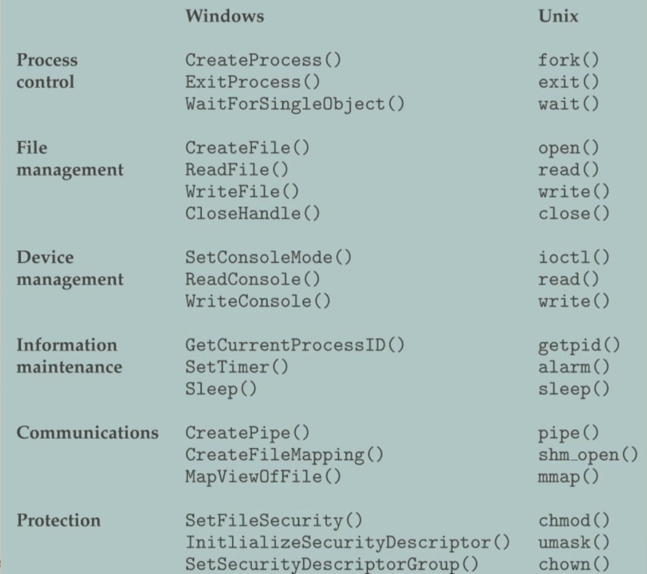{ width="600" }
</figure>

### 4.1 System Programs

system program 为程序开发和执行提供了便利环境。它们可分为：

1. file manipulation
2. status information
3. file modification
4. programming language support
5. program loading and execution
6. communications
7. application programs

## 5 Operating System Design and Implementation

操作系统设计没有标准解决方案，属于开放性问题。不同系统采用不同架构（如宏内核、微内核等），结构差异显著

设计必须首先明确设计目标和功能规格，硬件平台和系统类型（实时系统、分时系统等）决定设计方向

- user goals：注重用户体验——易用性、学习曲线、性能表现和安全性
- system goals：关注工程实现——可维护性、灵活性、正确性和效率

policy 决定做什么（实现什么规则），mechanism 决定怎么做

!!! example "separation of mechanism and policy"

    - mechanism：磁卡读卡器、远程控制的门锁、与安全服务器的连接（系统中固定的、通用的底层实现部件）
    - policy：哪些人应在何时被允许进入哪些门（可变的、具体的业务规则或决策）

    如果需要更改准入规则，只需在安全服务器的数据库（策略）中修改即可，无需更换或重新编程门锁和读卡器（机制）

## 6 Operating System Structure

### 6.1 Simple Structure

**MS-DOS**

- 设计目标：在最小的空间内提供最多的功能
- 未划分为模块：操作系统的大部分功能（如命令解释器、内核、设备驱动程序）都紧密地耦合在一起，没有清晰的界限
- 接口和功能层级未得到良好分离：

    - 接口不清晰：应用程序可以直接访问底层的 BIOS（基本输入输出系统）甚至硬件，这虽然提高了效率，但极其危险
    - 缺乏层级：高级功能（如文件系统）和低级功能（如直接硬件操作）之间没有严格的层级保护。一个应用程序的错误很容易导致整个系统崩溃

<figure markdown="span">
  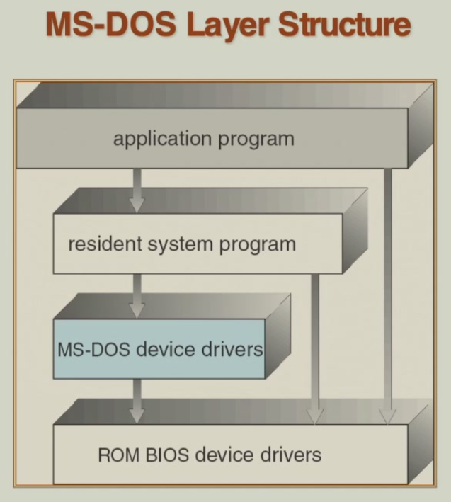{ width="600" }
</figure>

### 6.2 Layered Operating System

Layered Approach：操作系统被划分为若干层（层级），每一层都构建在更低层之上。最底层（第 0 层）是硬件；最高层（第 N 层）是用户界面。通过模块化，分层的选择使得每一层仅使用更低层级层的功能（操作）和服务

<figure markdown="span">
  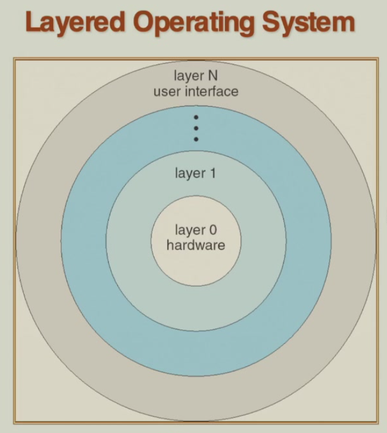{ width="600" }
</figure>

### 6.3 UNIX

受限于硬件功能，最初的 UNIX 操作系统结构较为简单。UNIX 操作系统由两个可分离的部分组成：

1. System programs
2. The kernel：内核包含系统调用接口以下、物理硬件以上的所有部分。它提供文件系统、CPU 调度、内存管理和其他操作系统功能；在单一层次上包含了大量功能

<figure markdown="span">
  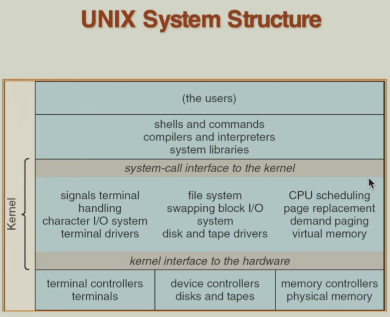{ width="600" }
</figure>

### 6.4 Microkernel System Structure

微内核的设计哲学是最小化内核。它只将最核心、最必须的功能保留在内核中，而将其他所有操作系统服务（如文件系统、设备驱动、网络协议栈等）作为独立的"用户态进程"运行

用户模块之间通过消息传递进行通信：当一个应用程序需要操作系统服务时（例如，要读取一个文件），它不会直接调用内核函数，而是向"文件系统服务器"进程发送一个消息。微内核只负责安全地传递这些消息。目标服务器进程收到消息，执行请求的操作，然后通过消息回复结果

优点：

1. 更容易扩展微内核
2. 更容易将操作系统移植到新的体系结构
3. 更可靠（在内核模式下运行的代码更少）
4. 更安全

缺点：用户空间与内核空间通信的性能开销

<figure markdown="span">
  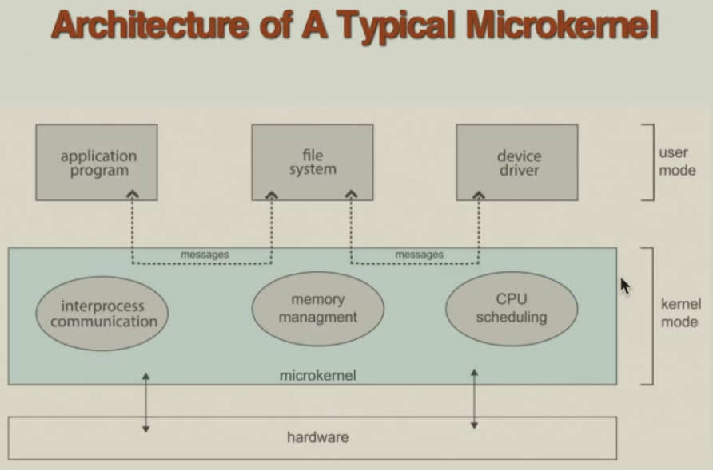{ width="600" }
</figure>

### 6.4 Mac OS (X) Structure

<figure markdown="span">
  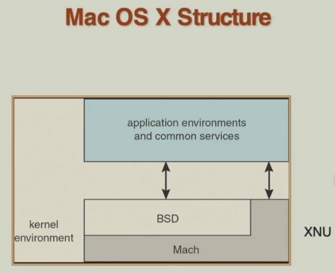{ width="600" }
</figure>

<figure markdown="span">
  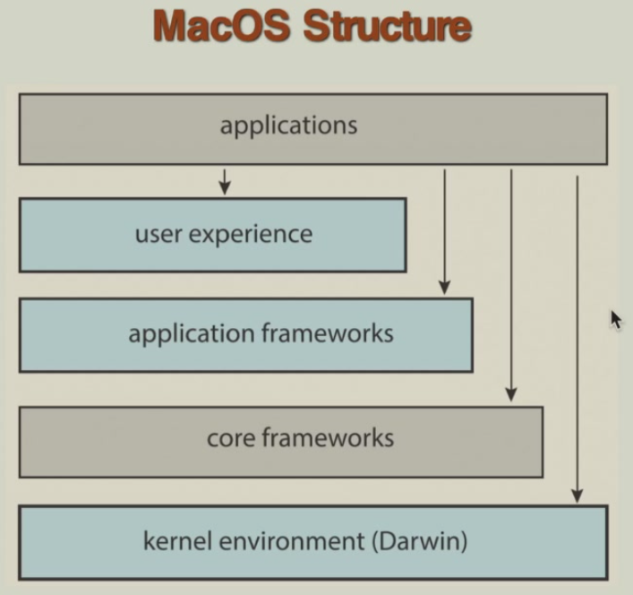{ width="600" }
</figure>

### 6.5 Modules

大多数现代操作系统实现了 kernel module

设计特点：

1. 面向对象方法：每个模块像一个"对象"，封装了特定的功能，并对外提供定义良好的接口
2. 组件分离：核心组件与扩展功能是分离的，提高了代码的模块化和可维护性
3. 每个组件通过已知的接口与其他组件通信：模块之间通过预先定义好的、稳定的 API（应用程序编程接口）进行交互。这保证了模块之间的松散耦合
4. 模块之间直接相互调用，而不是通过消息传递：这是与微内核的关键区别。模块都运行在内核态，它们之间的通信是直接的函数调用，效率极高，避免了微内核消息传递的性能开销
5. 动态加载：模块可以在系统运行时被加载到内核或从内核中卸载，而无需重新启动计算机。这提供了极大的灵活性，例如，插入一个新 U 盘时，系统可以动态加载对应的 USB 驱动模块

与 layered structure 类似，都强调模块化，但是 Modules 结构没有严格的层级限制，更加灵活

<figure markdown="span">
  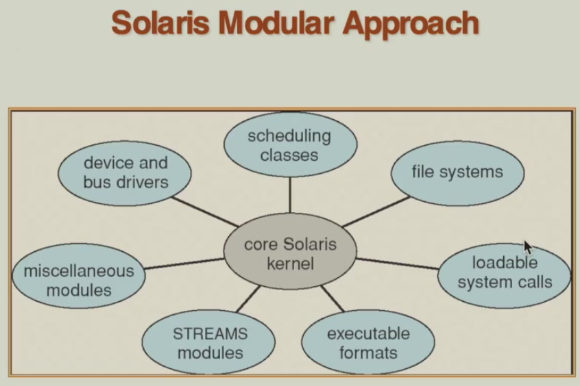{ width="600" }
</figure>

### 6.6 Other Structures

Exokernel：高度简化 kernel，只负责资源分配，提供了低级的硬件操作，必须通过定制 library 供应用使用

高性能，但定制化 library 难度大，兼容性差

<figure markdown="span">
  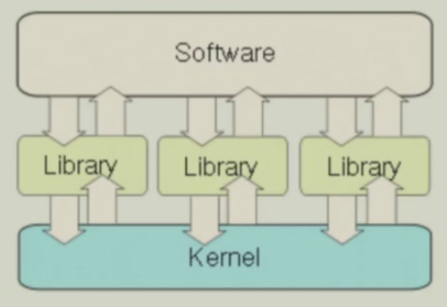{ width="600" }
</figure>

Unikernel：将应用程序代码和它所依赖的、最小化的操作系统库代码在编译时静态链接在一起，生成一个单一的、自包含的镜像文件

适用于云服务，应用程序可在数十毫秒内启动

<figure markdown="span">
  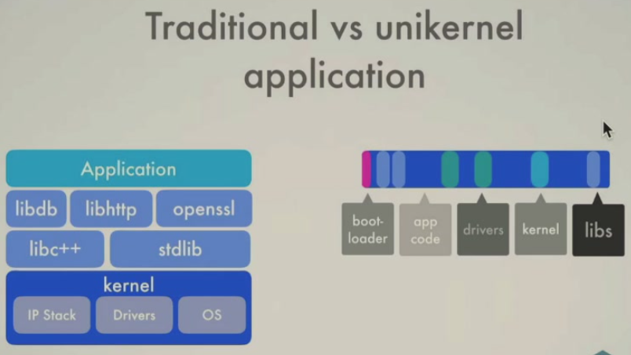{ width="600" }
</figure>

## 7 Virtual Machines

分层架构是在硬件之上逐层构建软件抽象（如进程、文件）。虚拟机将这一思想发挥到极致：它构建的抽象层不再是某个单一功能（如文件系统），而是一个完整的、功能齐全的计算机系统。这个抽象层（即虚拟机）之下的一切，包括真实的硬件和宿主操作系统内核，都被视为新的“底层硬件”

核心机制：提供一个与底层裸硬件完全相同的接口。这是实现虚拟化的关键。软件（通常称为虚拟机监控器或 Hypervisor）运行在真实硬件之上，它模拟出一个或多个虚拟硬件环境（包括虚拟 CPU、虚拟内存、虚拟磁盘等）。这个虚拟环境与真实的物理硬件在接口上完全一致。因此，一个客户操作系统可以被安装并运行在这个虚拟硬件上，而它无法察觉自己并非运行在真实的物理机上

<figure markdown="span">
  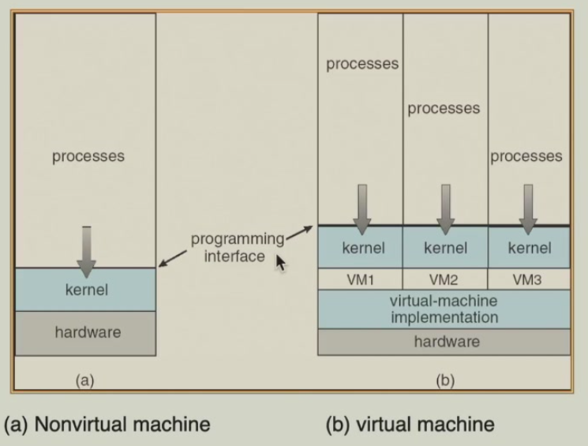{ width="600" }
</figure>

<figure markdown="span">
  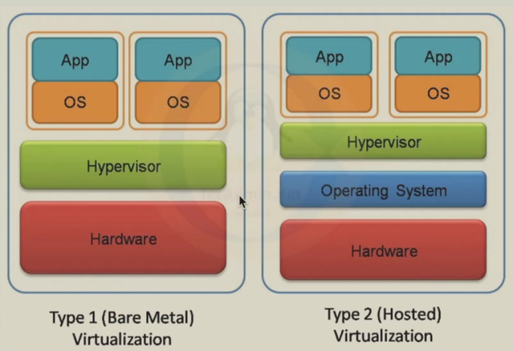{ width="600" }
</figure>

## 8 Operating System Generation

操作系统被设计为能在一类机器上运行，系统必须为每个具体的计算机站点进行配置

1. SYSGEN 程序：通过检测或询问用户来获取当前计算机硬件的具体信息，然后根据这些信息生成一个适合本机硬件的、定制化的操作系统内核或配置文件
2. Booting（启动）：计算机从关机状态到操作系统开始运行的整个过程，其核心步骤是加载操作系统内核到内存并执行它
3. Bootstrap program（引导程序）：存储在 ROM 中的代码。它的任务是找到存储设备上的操作系统内核，将它从磁盘读入到内存中，然后把控制权交给内核，从而启动操作系统的运行

System boot 步骤：

1. 通电
2. 执行固件：CPU 被设计为从一个固定的内存地址开始执行指令。这个地址指向一块 ROM，里面存储着基本的启动代码，这部分硬件相关的代码称为固件（例如 BIOS）
3. 加载引导程序：固件中的代码执行硬件自检，然后寻找可启动的设备。找到后，它会读取设备上最开始的固定位置的内容到内存。这个引导块中包含了一个更复杂的引导程序
4. 加载内核：现在，控制权交给了这个从磁盘加载的引导程序。它负责定位磁盘上的操作系统内核文件，将其加载到内存中，然后执行它
