# 3 Processes

!!! tip "说明"

    本文档正在更新中……

!!! info "说明"

    本文档仅涉及部分内容，仅可用于复习重点知识

## 1 Process Concept

process（进程）：正在执行的程序。程序本身是存储在磁盘上的静态指令集合，而进程是程序被加载到内存后，实际运行时的动态实体

process 对的执行是顺序的，即 CPU 按照指令顺序一条一条地处理（在单线程视角下）

> 在早期的 batch system（批处理系统）中称为 job，在现代的 time-shared systems（分时系统）中称为 process。几乎可以互换使用

process 的组成：

1. text section：存放程序的实际执行代码
2. program counter：一个特殊的寄存器，存放下一条要执行的指令的地址。它是进程能"顺序执行"的关键
3. stack：用于管理函数调用。存放每次函数调用时的参数、局部变量和返回地址。其增长方向通常是向下的
4. data section：存放全局变量和静态变量。其大小在程序编译后通常是固定的
5. heap：用于程序运行时动态分配的内存。其增长方向通常是向上的

<figure markdown="span">
  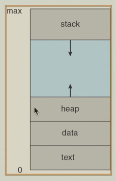{ width="400" }
</figure>

### 1.1 Process State

1. new：进程刚刚被创建，但操作系统还未将其完全加载到内存或准备好执行。此时，操作系统正在为其分配必要的资源（如进程控制块 PCB、初始内存等）
2. ready：进程已获得除 CPU 之外的所有必要资源，万事俱备，只欠"CPU 时间片"。它正在排队等待操作系统的调度器选择它来运行。系统中可能有很多处于就绪状态的进程
3. running：进程已经被操作系统调度，其指令正在 CPU 上被执行。在单核 CPU 系统中，任一时刻最多只有一个进程处于运行状态
4. waiting：进程在运行过程中，由于需要等待某个外部事件（如 I/O 操作完成、收到一个信号、获取一个锁等）而主动或被动地暂停执行。此时，即使 CPU 空闲，该进程也无法继续运行，直到它等待的事件发生。事件发生后，进程会从"等待"状态转换到"就绪"状态
5. terminated：进程已经执行完毕（或被强制终止），操作系统正在回收分配给它的资源（内存、打开的文件等）。之后，该进程将从系统中消失

<figure markdown="span">
  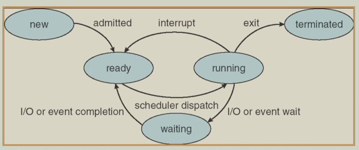{ width="600" }
</figure>

### 1.2 Process Control Block

PCB 是操作系统内核为了管理进程而创建的一个数据结构。可以把它理解为进程的"身份证"。每个进程有且只有一个 PCB

PCB 的根本作用是实现进程的并发执行。当操作系统需要暂停当前运行的进程，转而运行另一个进程时（这称为"上下文切换"），它必须把当前进程的运行状态完整地保存下来，以便下次恢复时能继续执行。所有这些需要保存和恢复的信息都记录在 PCB 中

PCB 包含与每个进程相关联的信息：

1. process state：指明进程当前处于新建、就绪、运行、阻塞、终止中的哪种状态
2. program counter：保存了下一次该进程被调度执行时，应该运行的指令地址
3. contents of CPU registers：保存了所有通用寄存器、累加器等硬件上下文。这是恢复进程运行的关键
4. CPU scheduling information：包括进程优先级、调度队列指针、已经等待的时间等，供调度器使用
5. Memory-management information：包括指向该进程的页表或段表的指针、内存界限等，确保进程只能访问自己的内存空间
6. Accounting information：记录 CPU 使用时间、实际运行时间、账号ID等，用于统计和计费
7. I/O status information：记录进程分配到的 I/O 设备列表、打开的文件列表等

<figure markdown="span">
  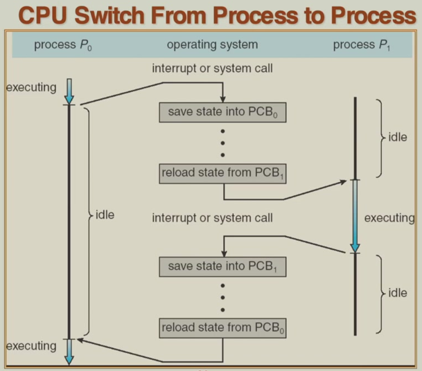{ width="600" }
</figure>

### 1.3 Process Scheduling Queues

1. job queue：指系统中存在的所有进程的集合，包括那些已经被创建但可能还部分存在于磁盘（交换区）上的进程
2. ready queue：包含了当前在内存中、并且已经准备好、只等 CPU 空闲就可以立即运行的所有进程。操作系统的短期调度器（或称 CPU 调度器）会从这个队列中选择下一个要运行的进程。这是直接影响 CPU 利用率的核心队列
3. device queue：每个 I/O 设备（如磁盘、打印机、键盘）通常都有自己的设备队列。当一个进程需要执行 I/O 操作（如读取文件）时，如果该设备正被其他进程占用，该进程就会被放入对应的设备队列中等待。一旦设备可用，操作系统（或 I/O 子系统）会从该队列中取出一个进程来使用设备

一个进程在其生命周期中，会根据其状态的变化在不同队列之间移动，这个过程就是 process migrate（进程迁移）

!!! tip "进程迁移"

    1. 新进程进入 **作业队列**
    2. 当被操作系统选中并加载到内存后，它进入 **就绪队列** 等待 CPU
    3. 获得 CPU 时间片后，它离开就绪队列，状态变为“运行”
    4. 运行时如果需要等待 I/O 操作完成，它会被移出 CPU，并加入到相应的 **设备队列**
    5. I/O 操作完成后，它被从设备队列中移除，并再次放回 **就绪队列** 等待CPU
    6. 进程执行完毕后，从所有队列中移除并终止

<figure markdown="span">
  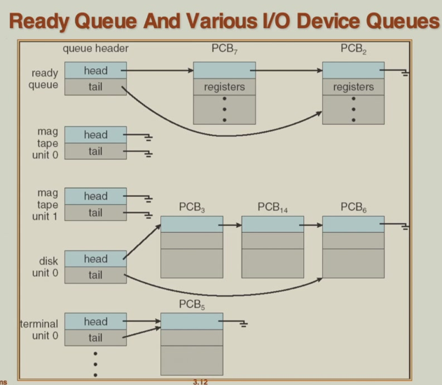{ width="600" }
</figure>

## 2 Process Scheduling

<figure markdown="span">
  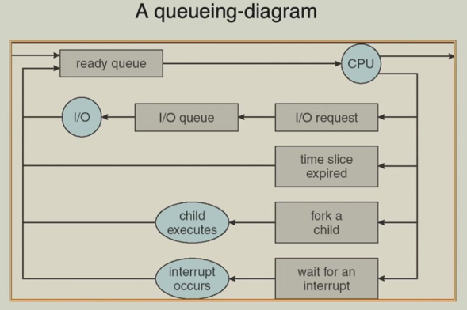{ width="600" }
</figure>

Scheduler 本质上是操作系统内核中的一段代码（程序），负责做出"接下来运行哪个进程"的决策

1. long-term scheduler（job scheduler）：决定将磁盘上的哪个"程序"加载到内存中，使其成为一个活跃的进程并进入就绪队列，从而获得竞争 CPU 的资格。它控制着内存中并发进程的数量（即 degree of multiprogramming，多道程序设计的程度）
2. short-term scheduler（CPU scheduler）：当 CPU 空闲时，从就绪队列中选择一个进程，并将 CPU 的控制权分配给它。这是最核心的调度操作

<figure markdown="span">
  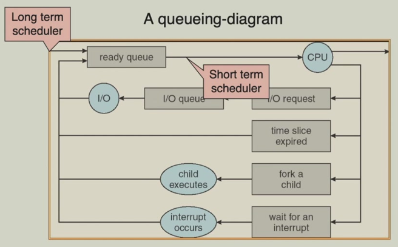{ width="600" }
</figure>

1. long-term scheduler：因为负责将新作业调入内存，这个操作相对较慢（涉及磁盘 I/O），所以它被调用的频率很低（秒或分钟一次）。因此，它可以花费更多时间来做出更复杂的决策
2. short-term scheduler：因为负责分配 CPU，而 CPU 时间片很短（毫秒级），所以它被调用的频率极高。这就要求它的决策算法必须非常高效快速，否则调度本身就会消耗过多的 CPU 时间

!!! tip "swap process in / out"

    在内存资源紧张时，操作系统需要将某些暂时不能运行的进程（例如，正处于“等待/阻塞”状态的进程）的整个或部分内存映像从物理内存（RAM）复制到磁盘上的一个特殊区域（称为交换空间）。这个过程就叫 swap out。被换出的进程仍然存在于系统中，但其状态被标记为“挂起”或“换出”。之后，这些进程所占用的物理内存空间就可以被释放，分配给其他急需内存的进程使用
    
    目的：
    
    1. 解决内存过度分配：当系统中同时运行的进程太多，导致物理内存不足时，通过换出进程来释放内存，防止系统崩溃
    2. 提高多道程序度：即使物理内存有限，操作系统也可以通过“换出/换入”技术，让系统“看起来”能够同时维护比物理内存容量允许的更多活动进程

medium-term scheduling：负责管理和执行“换出”和“换入”操作的调度程序。它是长期调度和短期调度之间的一个中间层次。当操作系统检测到物理内存严重不足时，中期调度器会被触发。它会选择一个或多个进程将其“换出”到磁盘。当内存压力减小，或者被换出的进程所等待的事件（如 I/O 操作）已经完成时，中期调度器可能会决定将该进程重新“换入”内存

<figure markdown="span">
  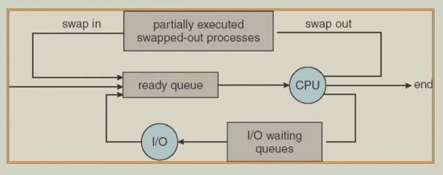{ width="600" }
</figure>

process 可以分为：

1. I/O bound process：这类进程的大部分时间都在等待 I/O 操作（如用户输入、读写文件）。它们每次获得 CPU 后，通常只运行很短时间就会发出 I/O 请求，然后主动放弃 CPU。例如：文本编辑器、大多数交互式应用
2. CPU bound process：这类进程需要长时间连续使用 CPU 进行计算，很少被 I/O中断。例如：科学计算、图像渲染

> 一个理想的系统应该保持这两种进程的良好混合

### 2.1 Context Switch

上下文切换是操作系统内核将 CPU 从一个正在运行的进程切换到另一个就绪进程时所执行的操作

“上下文”指的是一个进程在 CPU 上运行时所需的全部状态信息，其核心就保存在 PCB 中

1. 保存旧进程上下文：将当前运行进程的 CPU 状态（寄存器值、程序计数器等）保存到其 PCB 中
2. 加载新进程上下文：从即将运行的新进程的 PCB 中，将其之前保存的 CPU 状态加载到相应的寄存器和程序计数器中
3. 切换：将程序计数器跳转到新进程的下一条指令地址，CPU 开始执行新进程的代码

上下文切换本身不执行任何用户有用的工作，纯粹是系统管理的开销。在这段时间里，CPU 只在为切换服务。虽然一次切换可能只耗时几微秒到几毫秒，但由于切换发生得非常频繁，其累积开销可能相当巨大。频繁的上下文切换会显著降低系统性能

上下文切换的速度高度依赖于硬件架构的支持

!!! example "SPARC 架构"

    SPARC 架构提供了多组寄存器。当发生上下文切换时，内核只需简单地切换到一个新的寄存器组，而不需要将旧寄存器组的值逐个保存到内存。这大大减少了需要保存和加载的数据量，从而极大地加快了上下文切换的速度

## 3 Operations on Processes

### 3.1 Process Creation

parent process 创建 children process，子进程又可以创建其他进程，形成一个进程树。父子进程存在资源共享问题

<figure markdown="span">
  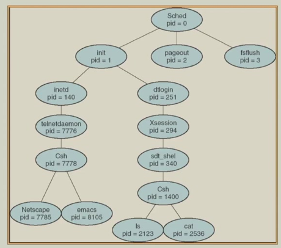{ width="600" }
</figure>

resource sharing：

1. 共享所有资源：子进程直接共享父进程的所有资源（如打开的文件句柄）。这种模式下，操作一个资源（如关闭一个文件）会影响到另一个进程
2. 共享部分资源：子进程只继承父进程的部分资源（通常是文件等）。这是一种折中方案，在共享和隔离之间取得平衡。Unix 的 `fork()` 调用是典型例子，子进程继承父进程的文件描述符
3. 不共享任何资源：子进程从头开始获取自己的资源，与父进程完全隔离。这种方式提供了最好的稳定性，但创建开销较大

创建子进程后，父进程的行为有两种可能：

1. 并发执行：父进程和子进程作为独立的调度单元，同时（在单核上是交替地）向前执行。这是最常见的情况
2. 父进程等待：父进程在创建子进程后，自己暂停执行（进入等待状态），直到一个或多个子进程运行结束。这通常用于父进程需要子进程的计算结果才能继续的情况。Unix 中的 `wait()` 系统调用就是用于实现这种等待

<figure markdown="span">
  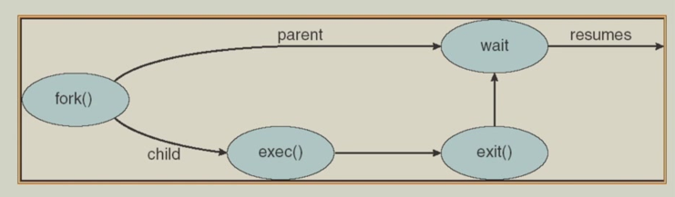{ width="600" }
  <figcaption>父进程等待</figcaption>
</figure>

当父进程创建一个子进程时，子进程会获得一份父进程地址空间的初始副本。这意味着子进程拥有和父进程完全相同的代码段、数据段、堆和栈的初始内容。创建子进程的最终目的往往不是让它运行和父进程一样的代码，而是为了执行一个不同的新程序。因此，需要一种机制来将新程序的代码和数据加载到子进程的地址空间中，替换掉从父进程复制来的内容

!!! example "UNIX"

    1. `fork()` 创建进程副本：操作系统创建一个与父进程几乎一模一样的子进程。此时，父子进程并发执行相同的代码。为了区分，`fork()` 的返回值不同：在父进程中返回子进程的 PID（进程ID），在子进程中返回 0
    2. `exec()` 执行新程序：销毁当前子进程的地址空间（即从父进程复制来的内容），然后从磁盘上加载一个指定的新程序到该地址空间，并开始执行这个新程序的 `main` 函数

    > `exec()` 并不创建新进程，它只是替换了当前进程正在执行的程序

### 3.2 Process Termination

进程终止的两种情形：

1. 正常终止 / 退出：

    1. 当一个进程完成了它的所有工作，执行完最后一条指令后，它会主动请求操作系统将其销毁，这个过程称为 exit
    2. 在退出之前，它可以通过 wait 这类系统调用将数据传递给其父进程
    3. 随后，操作系统会回收分配给该进程的所有资源（如内存、CPU 时间、打开的文件等）

2. 强制终止 / 中止：

    1. 父进程有权主动终止其创建的子进程，这被称为 abort
    2. 中止可能发生在以下几种情况：

        1. 子进程消耗了过多资源
        2. 子进程的任务已经不再需要
        3. 父进程本身即将退出。不同的操作系统对此的处理方式不同

            1. 级联终止：在一些系统（如 Windows）中，当父进程退出时，操作系统会自动终止其所有子进程
            2. 孤儿进程：在类 Unix 系统（如 Linux）中，如果父进程先于子进程退出，子进程会变成"孤儿进程"。为了解决这个问题，init 进程（PID=1，系统启动后的第一个进程）会接管这些孤儿进程，成为它们新的父进程，从而确保它们退出后能被正确清理，避免成为无法管理的"僵尸进程"

> 在 MacOS 中，init 进程称为 launchd

## 4 Cooperating Processes

- independent process：不会受另一个进程的执行影响，也无法影响另一个进程的执行
- cooperating process：可能受另一个进程的执行影响，或能够影响另一个进程的执行

协作进程的优点：

1. information sharing：多个进程可能需要访问同一组数据
2. computation speed-up：将一个大型任务分解成多个小任务，并由不同的进程并行处理，可以显著加快速度
3. modularity：将复杂的系统功能划分为多个独立的、协作的进程，使系统设计更清晰、易于开发和维护
4. convenience：用户可以同时运行多个进程来分别处理多个子任务

!!! tip "Producer-Consumer Problem"

    协作进程的典范模型。涉及两类进程：

    1. producer：负责"生产"数据或物品，并将其放入一个共享的 buffer 中
    2. consumer：负责从共享缓冲区中"取出"（消费）这些数据或物品

    这是一个异步场景：生产者不知道消费者何时会消费，消费者也不知道生产者何时会生产

    缓冲区的两种模式：

    1. unbounded-buffer：

        1. 缓冲区可以被认为是无限大的（实际上受限于物理内存，但逻辑上无上限）
        2. 主要矛盾在消费者方：生产者可以一直生产，不用担心空间不足。但如果缓冲区为空，消费者想消费时找不到任何物品，就必须等待，直到生产者生产出新物品

    2. bounded-buffer：

        1. 缓冲区大小是固定的
        2. 矛盾是双向的：

            1. 生产者需要等待：当缓冲区已满时，生产者必须停止生产并等待，直到消费者消费掉一些物品，腾出空间
            2. 消费者需要等待：当缓冲区为空时，消费者也必须等待，直到生产者放入新物品

## 5 Interprocess Communication

**进程间通信（IPC）**：允许不同进程进行数据交换和行动同步的机制

两种 IPC 模型：

1. message passing：进程通过明确地发送和接收消息来通信。关键特点是进程不直接共享变量或内存区域。通信由操作系统内核提供的 send 和 receive 操作原语完成
2. shared memory：进程通过访问一个共同的、被映射到它们各自地址空间的内存区域来通信

进程在通信前，必须先建立一条通信链路。通信链路的实现层次：

1. 物理实现：依赖于实际的硬件或内存资源。例如：共享内存，硬件总线
2. 逻辑实现：更侧重于通过软件协议、网络套接字等定义的通信规则和属性，而不是具体的物理媒介

<figure markdown="span">
  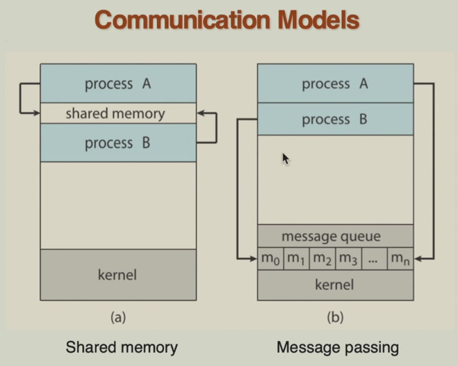{ width="600" }
</figure>

### 5.1 Direct Communication

通信的进程必须在每次发送或接收消息时，明确指定目标进程或源进程的标识符（如进程 ID 或名称）

- send (P, message)：发送操作需要明确指出消息要发给哪个进程
- receive (Q, message)：接收操作也需要明确指出准备从哪个进程接收消息

这种方式下 communication link 的四大特性：

1. 自动建立：当进程开始使用通信原语时，操作系统会自动在进程间建立通信链路，无需程序员进行额外的连接操作
2. 一对一独占：一条通信链路专门服务于且仅服务于两个特定的进程
3. 唯一性：在任意两个通信的进程之间，有且仅有一条链路存在。这简化了通信的管理
4. 方向性：链路在理论上是单向的，但在实际的直接通信实现中，为了便于双向对话，它通常是双向的

### 5.2 Indirect Communication

进程通过一个中间载体 mailboxes（或称 ports）来交换消息。发送进程将消息发送到一个指定的邮箱，接收进程从该邮箱中读取消息。进程间通信的前提是它们必须共享同一个邮箱

这种方式下 communication link 的四大特性：

1. 通过共享邮箱建立：链路的建立不是基于进程 ID，而是基于对同一个邮箱的访问权限。只要两个进程都能访问同一个邮箱，它们之间就建立了通信链路
2. 一对多关联：一个邮箱（即一条通信链路）可以被多个进程共享。多个发送者可以向同一个邮箱发送消息，多个接收者也可以尝试从同一个邮箱读取消息（这通常需要额外的同步机制）
3. 多链路共存：两个进程之间如果共享了多个不同的邮箱，那么它们之间就存在多条通信链路。这允许它们根据不同的消息类型或目的使用不同的通道，增加了通信的灵活性
4. 方向灵活：链路可以灵活地定义为单向（例如，一个邮箱专用于发送，另一个专用于接收）或双向

涉及到的操作：

1. create 新邮箱
2. 通过邮箱 send 和 receive 消息
3. destroy 邮箱

Primitives：

- send (A, message)：向邮箱 A 发送一条消息
- receive (A, message)：从邮箱 A 接收一条消息

!!! question "多个接收者竞争同一邮箱的消息时，如何确定消息的归属"

    三种解决方案：

    1. 限制链路关联的进程数：规定一个邮箱（通信链路）最多只能被两个进程共享，即一个典型的发送者和一个典型的接收者
    2. 序列化接收操作：通过某种同步机制（如互斥锁），确保在任一时刻，只有一个进程能够成功执行针对该邮箱的接收操作
    3. 由系统选择接收者：操作系统（或通信系统）在多个等待的接收者中任意选择一个作为消息的接收方，并且可以通知发送方最终是哪个进程接收了消息

### 5.3 Synchronization

通信方式分为两大类：

1. blocking communication（阻塞（同步）通信）：进程在执行通信操作时，必须等待该操作完成才能继续执行

    1. blocking send：发送进程调用 send 后，其自身会被挂起（阻塞），直到目标进程执行了对应的 receive 操作，将消息成功取走
    2. blocking receive：接收进程调用 receive 后，其自身会被挂起（阻塞），直到有另一个进程向它发送了一条消息

2. non-blocking communication（非阻塞（异步）通信）：进程在发出通信操作后立即返回，无需等待操作完成，可以继续执行后续代码

    1. non-blocking send：发送者调用 send 后，无论消息是否被接收，它都立即继续运行
    2. non-blocking receive：接收者调用 receive 后，无论是否有消息，它都立即继续运行。如果有消息，它获取消息；如果没有，它可能收到一个错误码或空值

### 5.4 Buffering

缓冲定义了消息在传递过程中如何被临时存储。缓冲本质上是一个与通信链路相关联的消息队列。根据这个队列的容量，可以分为三种模式：

1. zero capacity（无缓冲）：链路上没有任何临时存储消息的空间。队列大小为 0

    - 发送者必须阻塞并等待，直到接收者准备好并执行了接收操作，直接将消息取走。这实现了最严格的同步

2. bounded capacity（有界缓冲）：链路上有一个固定大小为 n 的队列用于暂存消息

    - 只要队列未满，发送者发送消息后可以立即继续执行。当队列已满时，发送者必须阻塞并等待，直到接收者取走消息腾出空间

3. unbounded capacity（无界缓冲）：链路上的队列长度理论上是无限的

    - 发送者永远不需要等待，因为它总能把消息放入这个“无限”的队列中。所有的等待压力都转移到了接收者一方（如果队列为空，接收者需要等待）

## 6 Communication in Client-Server Systems

### 6.1 Sockets

套接字被定义为通信的 endpoint（端点），要进行通信，通信的每一方都必须拥有这样一个端点（套接字）

socket 由 IP 地址和端口号构成。例如 `161.25.19.8:1625`

> - IP 地址：唯一标识网络中的一台主机
> - 端口号：唯一标识一台主机上的一个特定应用或进程

通信在 a pair of sockets 之间进行（一个在客户端，一个在服务器端）

<figure markdown="span">
  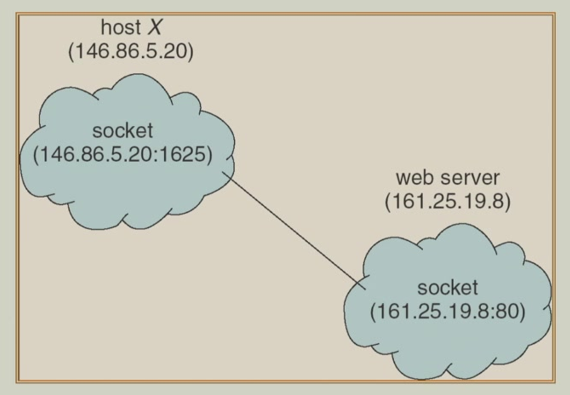{ width="600" }
</figure>

### 6.2 Remote Procedure Calls

远程过程调用（RPC）：主要用于跨网络的通信，其核心目标是让调用远程网络服务像调用本地函数一样简单

RPC 的设计目标是抽象网络通信的复杂性。程序员编写代码时，看起来只是在调用一个普通的本地函数，但实际上这个函数是在网络上的另一台计算机（服务器）上执行的

**Stubs（存根）**：RPC 系统在客户端和服务器端都使用了称为存根的代理模块

- 客户端存根：位于调用者进程中，扮演着“本地代表”的角色。它对程序员来说，就是那个要调用的“函数”
- 服务器端存根：位于被调用者（服务器）进程中，负责接收远程请求并调用真正的服务器端函数

工作流程：

1. 当客户端代码调用一个远程函数时，它实际上调用的是 **客户端存根**
2. 客户端存根将函数参数打包成一个网络消息，这个过程称为 **marshal（封送）**（或序列化）。然后，它通过网络将这个消息发送到服务器
3. **服务器端存根** 监听网络请求。它接收到消息后，会 **unpack（解包）**（或反序列化）参数，还原出原始的调用信息
4. 服务器端存根然后调用服务器上真正的函数，并将解包后的参数传递给它
5. 函数执行完毕后，返回值会沿着相反的路径返回给客户端调用者

<figure markdown="span">
  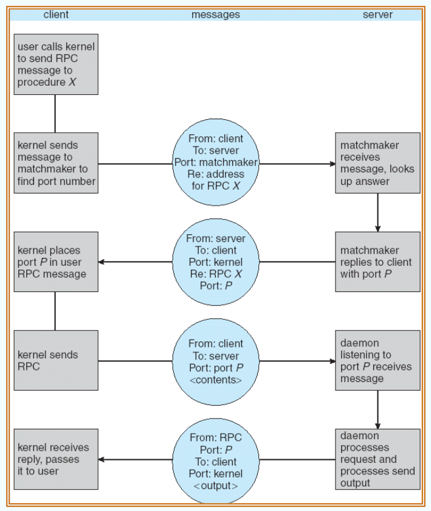{ width="600" }
</figure>

### 6.3 Remote Method Invocation

远程方法调用（RMI）是一种类似于 RPC 的 Java 机制

RMI 允许一个 Java 虚拟机（JVM）上的客户端程序，直接调用另一个 JVM（可能在网络上的另一台机器）上的某个对象的方法。对程序员来说，调用远程对象方法的语法与调用本地对象方法几乎一样，RMI 机制隐藏了底层的网络通信、参数序列化等复杂细节

与 RPC 的关键区别：RMI 是面向对象的

- RPC 可以看作是面向过程的，它远程调用的是一个“函数”或“过程”
- RMI 则是远程调用一个特定“对象”的“方法”。它天然地支持面向对象的特性，如继承、多态，并且能够传递整个对象（而不仅仅是基本数据类型参数）

<figure markdown="span">
  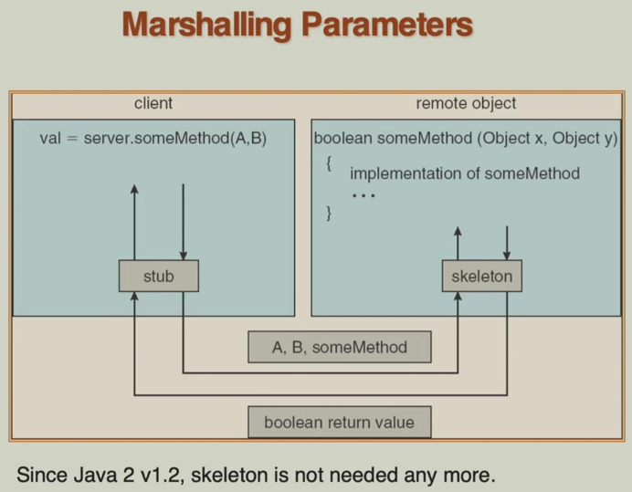{ width="600" }
</figure>

