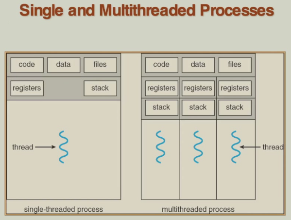
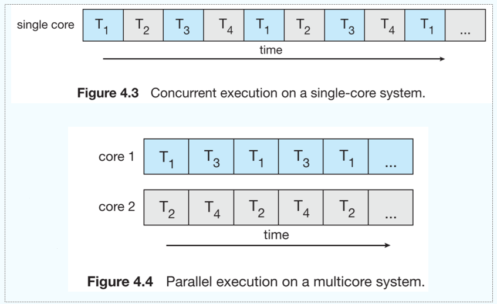
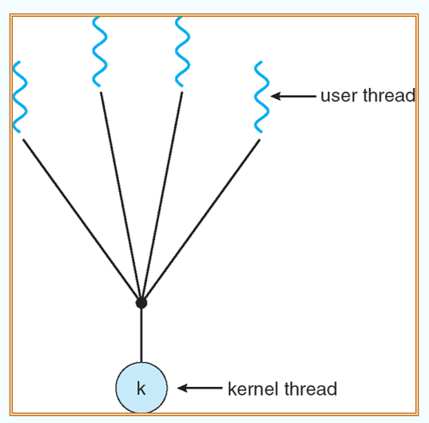
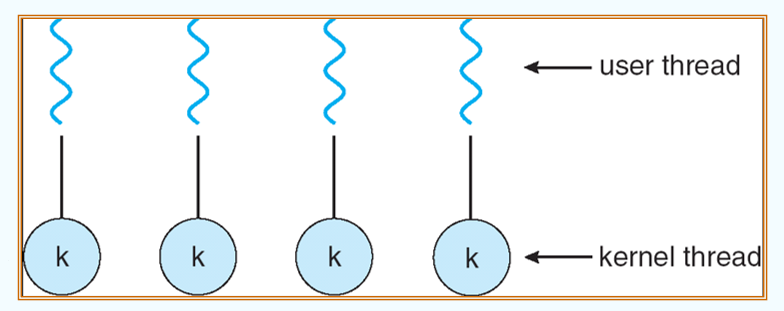
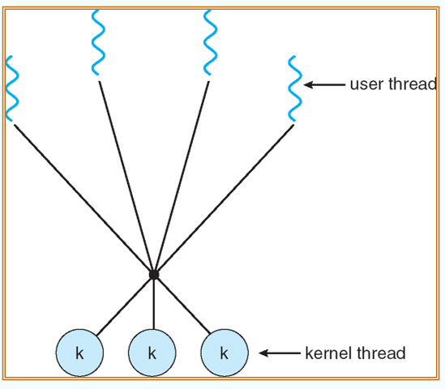
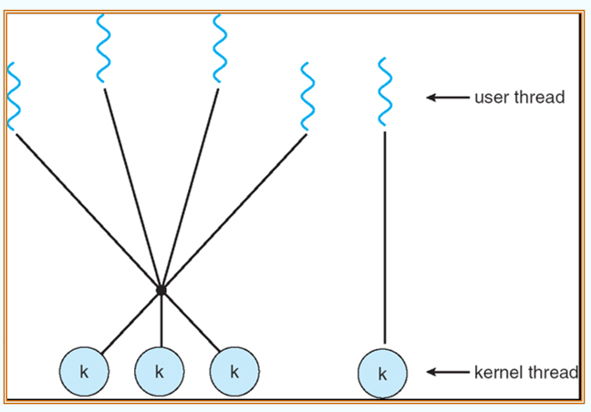
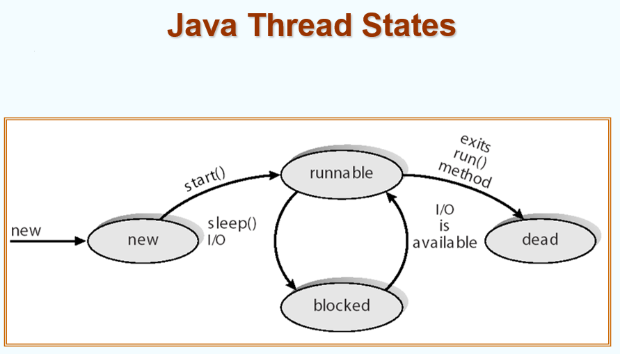

# 4 Threads

<!-- !!! tip "说明"

    本文档正在更新中…… -->

!!! info "说明"

    本文档仅涉及部分内容，仅可用于复习重点知识

## 1 Overview

假设正在开发一个 Web 程序

```java linenums="1"
while (1) {
    RetrieveData();  // block for 1 second
    DisplayData();  // block for 1 second
    GetInputEvents();  // block for 1 second
}
```

如果想要让程序响应更快

```java linenums="1"
while (1) {
    RetrieveALittleData();  // block for 0.1 second
    DisplayALittleData();  // block for 0.1 second
    GetAFewInputEvents();  // block for 0.1 second
}
```

```java linenums="1"
while (1) {
    if (CheckData() == True) {
        RetrieveALittleData();  // block for 0.1 second
        DisplayALittleData();  // block for 0.1 second
    }
    
    if (CheckInputEvents() == True) {
        GetAFewInputEvents();  // block for 0.1 second
    }
}

// 太多的检查，效率不高，响应仍然不快
```

为了使其足够响应迅速，我们需要：将操作分解成非常小的片段，但是同时我们也希望以大块的形式执行代码。更准确地说，我们希望在自己地程序代码中对这些操作进行 schedule

将繁琐的工作交给操作系统，由它在线程中进行调度

```java linenums="1"
CreateThread(RetrieveData());
CreateThread(DisplayData());
CreateThread(GetInputEvents());
WaitForThreads();
```

---

<figure markdown="span">
  { width="600" }
</figure>

多线程的优点：

1. responsiveness（响应性）：在交互式应用程序（如图形界面程序、游戏、网页浏览器等）中，用户希望程序能快速响应输入。使用多线程后，一个线程可以处理用户界面（UI），而其他线程执行耗时任务（如文件读写、网络请求）。这样即使后台任务运行，用户界面仍保持流畅响应，避免“卡死”现象
2. resource sharing（资源共享）：同一进程内的多个线程共享该进程的内存空间，包括代码段、堆、全局变量和堆栈等。这意味着线程之间可以方便地交换数据，无需复杂的通信机制（如管道、消息队列），从而提高效率
3. economy（经济性）：创建和管理一个新进程需要大量系统资源（如独立的地址空间、内存分配、上下文切换开销等）。相比之下，创建线程的开销小得多，因为线程属于同一进程，共享资源，因此更轻量、更高效
4. utilization of MP Architectures（多处理器架构的利用）：现代计算机通常配备多核 CPU。多线程允许程序将不同线程并行分配到不同的 CPU 核心上运行，从而真正实现并行计算，显著提升程序性能和并发能力

<figure markdown="span">
  { width="600" }
</figure>

1. concurrency：多个任务在同一时间段内交替执行，从宏观上看像是“同时”进行，但实际上可能是在一个处理器上通过快速切换来实现的
2. parallelism：多个任务在同一时刻真正同时执行，通常需要多核处理器或多台计算机等硬件支持

## 2 Multithreading Models

### 2.1 User Threads and Kernel Threads

1. user threads（用户线程）：线程的创建、调度、同步等所有管理工作完全在 **用户空间** 由应用程序的线程库完成，操作系统内核并不知道这些线程的存在。内核看到的是一个单一的进程
2. kernel threads（内核线程）：线程的创建、管理和调度由 **操作系统内核** 直接负责。每个内核线程都是内核可调度的基本单位

三个主要的线程库：

1. POSIX Pthreads
2. Win32 threads
3. Java threads

用户线程：

- 优点

    1. 高效：线程切换不需要陷入内核态（不需要 CPU 从用户模式切换到特权模式），开销非常小
    2. 灵活性：线程调度算法可以由应用程序自定义，不依赖于操作系统的调度策略

- 缺点

    1. “一损俱损”问题：如果一个用户线程执行了阻塞操作（如 I/O 读写），由于内核只知道这个进程，它会将整个进程挂起，导致该进程内的所有用户线程都被阻塞，即使其他线程可以继续工作
    2. 无法利用多核：在纯用户线程模型下，内核只将一个进程调度到一个 CPU 核心上，因此该进程的多个线程无法真正在多个核心上并行运行

内核线程：

- 优点

    1. 真正的并发：内核可以将一个进程的多个线程同时调度到多个 CPU 核心上执行，从而实现真正的并行，充分利用多核处理器
    2. 健壮性：如果一个线程发生阻塞，内核可以调度该进程的其他就绪线程继续运行，不会导致整个进程挂起

- 缺点

    1. 开销大：线程的创建、切换、销毁等操作都需要进行系统调用，导致 CPU 需要在用户态和内核态之间切换，速度和效率通常低于用户线程

### 2.2 There Main Models

用户线程映射到内核线程的三种主要模型：

1. many to one
2. one to one
3. many to many

**many to one**：多个用户线程映射到一个内核线程

- 优点：因为所有线程管理（创建、切换、同步）都在用户空间的线程库中完成，不需要请求内核，所以速度很快、开销小
- 缺点

    1. 如果进行系统调用则会阻塞：当一个用户线程执行了一个系统调用（如读写文件）时，整个进程（包括所有其他用户线程）都会被内核阻塞，即使其他用户线程已经准备好运行
    2. 内核一次只能调度一个线程：由于内核只看到一个线程（即那个内核线程），它无法将进程的多个线程调度到多个 CPU 核心上，无法实现真正的并行

!!! example "例子"

    1. Solaris Green Threads
    2. GNU Portable Threads

<figure markdown="span">
  { width="600" }
</figure>

**one to one**：每个用户线程都直接映射到一个内核线程

- 优点：并发性更强

    1. 当一个线程阻塞时，内核可以立即调度该进程的另一个线程运行，不会阻塞整个进程
    2. 内核可以将不同线程分配到不同 CPU 核心上，实现真正的并行

- 缺点：创建线程的开销大

    1. 每次创建一个用户线程，都必须相应地创建一个内核线程。创建内核线程需要进入内核态，消耗更多系统资源。因此，对一个进程可以创建的线程数量通常有限制

!!! example "例子"

    1. Windows NT / XP / 2000
    2. Linux
    3. Solaris 9 and later

<figure markdown="span">
  { width="600" }
</figure>

**many to many**：多个用户线程（可以是任意数量）映射到数量相等或更少的内核线程上

- 优点：灵活，结合了前两种模型的优点

    1. 开发者可以创建任意多的用户线程（不受内核限制），因为用户线程在用户空间管理，开销小
    2. 这些线程可以并发执行，因为内核有多个线程为其服务。当其中一个内核线程阻塞时，内核可以调度另一个可用的内核线程来运行其他用户线程
    3. 可以实现一定程度的并行

- 缺点：实现复杂

!!! example "例子"

    1. Solaris prior to version 9
    2. Windows NT / 2000 with the ThreadFiber package

<figure markdown="span">
  { width="600" }
</figure>

---

**tow level model**：本质上是一个多对多模型。在此基础之上，它允许将特定的、重要的用户线程 bound（绑定）或“专用于”某个特定的内核线程

也就是说：对于普通的、大量的任务，使用多对多的复用方式，以节省资源、提高效率；对于关键的、需要保证性能的任务，使用一对一的绑定方式，以确保响应性和并发性

1. 保证响应速度：对于一个需要极低延迟和确定性响应的任务（如实时音频/视频处理线程），将其绑定到一个专属的内核线程上，可以确保它随时能被操作系统内核调度执行，而不用在用户级的线程库中排队等待。这提供了类似于一对一模型的及时响应特性
2. 避免调度开销：被绑定的线程在用户态和内核态之间的映射是固定的，减少了线程库进行动态调度的开销
3. 利用处理器亲和性：绑定的线程可以更有效地利用 CPU 缓存，因为它更有可能始终在同一个 CPU 核心上运行

!!! example "例子"

    1. IRIX
    2. HP-UX
    3. Tru64 UNIX
    4. Solaris 8 and later

<figure markdown="span">
  { width="600" }
</figure>

## 3 Threading Issues

!!! tip "TCB"

    **Thread Control Block**：线程控制块。操作系统为了管理线程而创建的数据结构，类似于进程的 PCB

    PCB 描述了一个程序的执行环境，包括内存空间、打开的文件、I/O 设备等。当一个进程被切换时，整个执行环境（地址空间等）都需要改变

    TCB 描述了程序执行的执行流状态。同一个进程内的多个线程共享大部分资源，但每个线程有自己独立的执行状态

    > 一个进程 = 一个 PCB + 一个或多个 TCB + 共享的资源（如地址空间、文件等）

    TCB 不包含进程的资源信息（如内存限制、打开文件列表等），因为这些由 PCB 统一管理，所有线程共享

### 3.1 Fork and Exec

在单线程程序中，`fork()` 系统调用会创建一个与父进程完全相同的新子进程。这包括复制代码、数据、堆栈、文件描述符等

而在多线程程序中，如果某个线程（非主线程）调用了 `fork()`，可能会有两种情况：

1. 复制所有线程
2. 只复制调用线程

`exec() `的作用：该系统调用会完全替换当前进程的内存空间（代码、数据、堆栈等），加载一个新的程序文件来执行

在多线程当中，无论哪个线程调用了 `exec()`，它的行为都是明确且一致的：它会终止整个进程的所有线程，并用一个新的、单线程的程序映像替换整个进程

### 3.2 Signal Handling

**信号** 是操作系统内核向进程发送的一种异步通知机制，用于通知进程发生了某种事件

signal handler 用于处理信号，可以是同步或异步的：

1. 生成：事件发生，内核为该进程生成一个信号
2. 送达：内核将信号传递给目标进程
3. 处理：进程收到信号后，采取行动。行动可以是：忽略信号、执行默认操作（如终止），或执行程序员自定义的信号处理函数

在单线程进程中，信号送达很简单，只有一个线程可以接收。但在多线程进程中，信号应该送给谁

1. 送达给信号所适用的那个线程：适用于由特定线程动作同步触发的信号
2. 送达给进程中的每一个线程：适用于与整个进程相关、由外部源异步触发的信号
3. 送达给进程中的某些线程：一种更灵活的折中方案。操作系统可能选择所有不阻塞该信号的线程，或者选择一个主线程组来接收
4. 指定一个特定的线程来接收所有信号：这是最清晰和推荐的多线程信号处理模型。程序可以专门创建一个线程，其唯一任务就是接收和处理所有发送给该进程的信号。这个线程使用 `sigwait()` 等函数阻塞并等待信号的到来

### 3.3 Thread Cancellation

线程取消，即主动请求一个尚未执行完毕的线程终止

两种主要的取消方式：

1. asynchronous cancellation：一个线程（取消者）发出取消请求后，目标线程会立即被强制终止，没有机会进行任何清理工作
2. deferred cancellation：一个线程发出取消请求后，目标线程不会立即终止。取消请求只是设置一个取消标志。目标线程需要在代码中显式地设置“取消点”，并在这些点上检查这个标志。如果发现取消标志被设置，它才会开始执行清理工作（如释放锁、关闭文件等），然后安全地终止自己

### 3.4 Thread Pools

在程序启动时（或任务到来前），预先创建一组固定数量的线程，让它们处于休眠或等待状态。当有新的任务到达时，从池中分配一个空闲线程来执行该任务。任务完成后，该线程不会被销毁，而是返回池中，等待下一个任务

优点：

1. 使用现有线程处理请求通常比创建新线程稍快一些：创建和销毁线程涉及系统调用和内核操作，开销较大。而线程池避免了这部分开销，它只需要进行任务分配（这通常是在用户空间通过队列等数据结构完成的，速度很快）。因此，对于大量短小的任务，使用现有线程比每次都创建新线程的效率要高得多
2. 可以将应用程序中的线程数量限制在线程池的大小

    1. 避免系统过载：防止因为创建过多线程而耗尽系统内存和 CPU 资源，提高系统的稳定性和可预测性
    2. 可管理性：线程池的大小可以根据系统的 CPU 核心数、I/O 负载等具体情况进行调优，以达到最佳性能

### 3.5 Thread Specific Data

线程特定数据，也称为 Thread Local Storage（线程本地存储），是一种特殊的变量存储类别

1. 普通全局 / 静态变量：在进程的所有线程之间共享。一个线程修改了它，所有其他线程都能看到修改后的值
2. 线程本地存储变量：虽然它在代码层面被声明得像一个全局变量（即所有线程都能按名字访问它），但每个线程都拥有该变量的一个独立副本。一个线程对自己副本的修改，完全不会影响其他线程中同名变量的值

### 3.6 Scheduler Activations

在 M:M 或两级模型中：用户态线程库负责调度大量的用户线程；内核负责调度少量的内核线程（即 LWP）

当用户线程执行一个阻塞式系统调用（如读取文件）时，它所在的内核线程（LWP）也会被内核阻塞。如果线程库不知道这个情况，它可能会继续将其他就绪的用户线程分配到已经被阻塞的 LWP 上，导致这些用户线程也无法执行，尽管 CPU 可能空闲。这就是“一损俱损”问题的变体

调度器激活通过引入 upcall（上行调用）来解决这个问题。上行调用与系统调用（应用程序调用内核）相反，是内核主动调用应用程序（线程库）的机制

- LWP（轻量级进程）：可以理解为内核线程，是内核调度实体。它是用户线程得以在 CPU 上运行的“虚拟处理器”
- 上行调用：内核通知线程库某个事件发生的机制
- upcall handler（上行调用处理程序）：线程库中用于接收和处理内核通知的代码

!!! example "以线程阻塞为例"

    1. 事件发生：一个用户线程（T1）在执行 read() 系统调用时即将被阻塞
    2. 内核触发上行调用：内核不是简单地阻塞 T1 及其 LWP，而是先向上行调用处理程序发送一个通知，内容大致是：“你的线程 T1 在 LWP1 上即将阻塞，我现在要把 LWP1 拿走了。同时，我额外给你一个新的、可用的 LWP2，请你继续工作。”
    3. 线程库响应：线程库得知 T1 和 LWP1 将被阻塞。同时，它得到了一个新的、空闲的 LWP2。线程库立即将另一个就绪的用户线程（T2）调度到这个新的 LWP2 上执行

    应用程序的并发性得以维持。尽管 T1 被阻塞了，但应用程序仍然有一个活跃的内核线程（LWP2）可以执行其他任务，CPU 不会被闲置。当 T1 的 I/O 操作完成时，内核会通过另一个上行调用通知线程库，线程库再将其重新调度到一个可用的 LWP 上

## 4 Pthreads

POSIX 标准：Pthreads 全称是 POSIX Threads。POSIX 是一个旨在保证操作系统可移植性的标准体系。遵循 POSIX 标准的程序可以更容易地在不同版本的 UNIX、Linux 和类 UNIX 系统上编译和运行

Pthreads 定义了一套函数、数据类型和行为规范（即 API），但它本身并不是一个具体的实现

Pthreads 是用户级还是内核级，这取决于具体的实现

1. 内核级实现：操作系统内核直接提供 Pthreads 接口
2. 用户级实现：Pthreads 库作为一个运行在用户空间的库来实现

## 5 Windows XP Threads

核心模型：一对一映射

每个线程包含：

1. 线程 ID：用于唯一标识线程
2. 寄存器组：保存线程当前执行时的 CPU 状态（如指令指针、栈指针等）。当线程被切换时，这些值被保存，以便恢复运行时能继续执行
3. 独立的用户栈和内核栈

    1. 用户栈：用于线程在用户模式下执行函数调用，存储局部变量等
    2. 内核栈：当线程通过系统调用进入内核模式时，使用独立的内核栈。这提供了安全隔离，防止用户应用程序破坏内核数据

4. 私有数据存储区：通常指线程本地存储，允许线程拥有属于自己的全局变量副本

将寄存器组、栈和私有存储区统称为线程的 context（上下文）。当操作系统进行线程切换时，本质上就是在保存当前线程的上下文，并恢复下一个线程的上下文

Windows 内核使用三个主要数据结构来管理线程：

1. KTHREAD（内核线程块）：这是内核调度线程所需的核心信息。包含了调度优先级、时间片、状态（就绪、运行、阻塞等）、内核栈指针等与调度和同步密切相关的数据
2. ETHREAD（执行体线程块）：这是执行体（Windows 内核中高于微内核的部分）管理线程所需的信息。它包含更广泛的信息，比如指向所属进程的指针、线程启动地址、用于 I/O 操作的链表等。ETHREAD 结构体的第一个成员通常就是指向 KTHREAD 的指针
3. TEB（线程环境块）：这是一个在用户空间的数据结构。它包含了线程在用户模式下运行所需的信息，例如线程本地存储数组、线程相关的 GDI/User 信息、最后一个错误代码等。应用程序可以（有限地）访问这个块中的信息

## 6 Linux Threads

Linux 将线程视作为 tasks（任务）

线程创建通过 `clone()` 系统调用完成

- `fork()` 的特点：默认创建一个子进程，该子进程获得父进程所有资源的独立副本（采用写时复制技术）
- `clone()` 的特点：通过传递不同的标志参数，可以精确指定子“任务”要与父“任务”共享哪些资源

也就是说 `clone()` 允许子任务共享其父任务（进程）的地址空间

## 7 Java Threads

Java 线程由 JVM 管理

创建 Java 线程的两种方式：

1. 继承 Thread 类
2. 实现 Runnable 接口

<figure markdown="span">
  { width="600" }
</figure>
