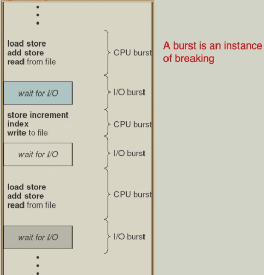
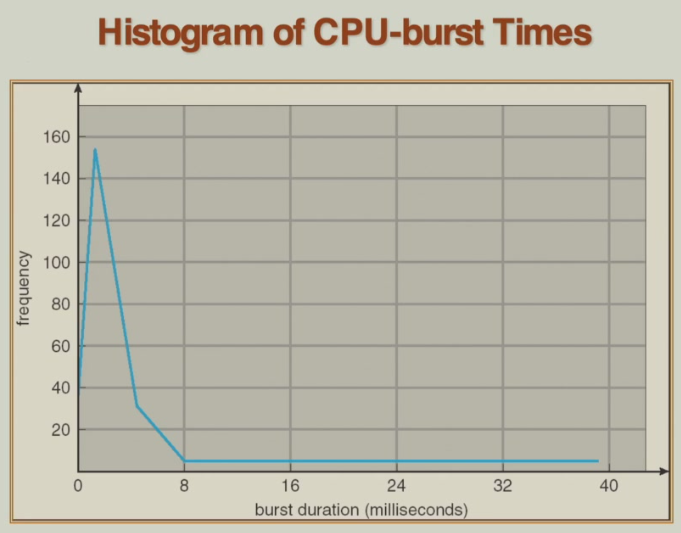
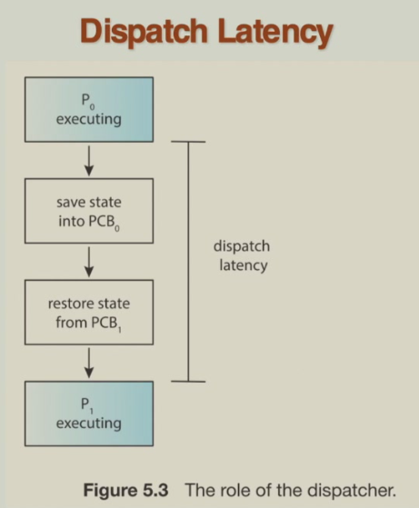
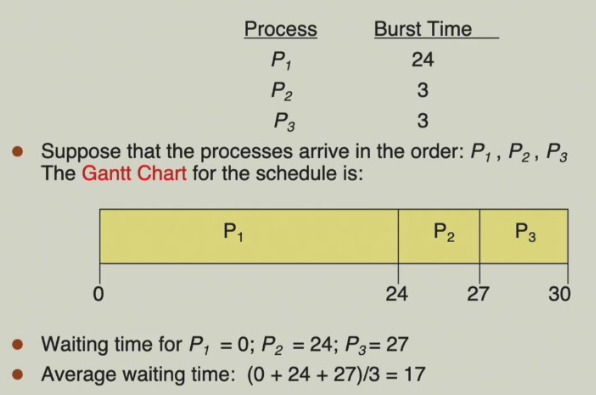
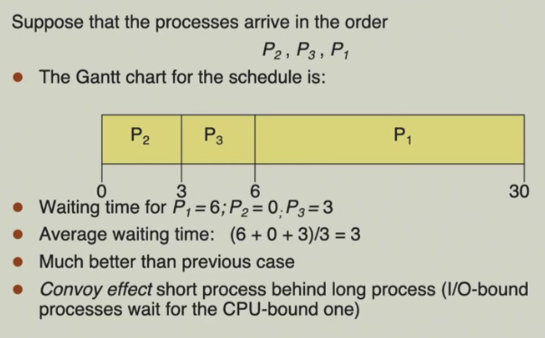
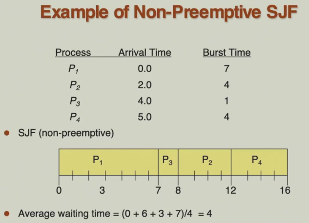
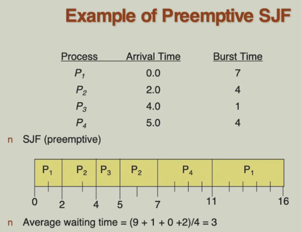
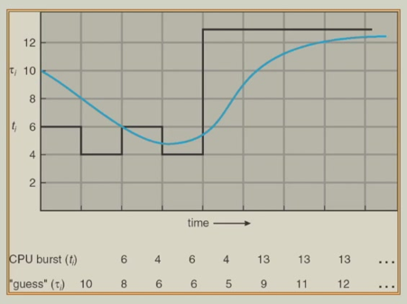

# 5 CPU Scheduling

!!! tip "说明"

    本文档正在更新中……

!!! info "说明"

    本文档仅涉及部分内容，仅可用于复习重点知识

## 1 Basic Concepts

通过 multiprogramming，使 CPU 尽可能保持忙碌状态，减少空闲时间。多道程序设计允许在某个进程等待 I/O 操作时，CPU 可以执行其他进程

CPU-I/O burst cycle：先进行一段 CPU 计算，然后进行 I/O 操作，如此循环

<figure markdown="span">
    { width="600" }
</figure>

<figure markdown="span">
    { width="600" }
</figure>

### 1.1 CPU Scheduler

CPU 调度程序负责从 ready 队列中选择下一个要执行的进程，并将 CPU 控制权分配给它

四种调度时机：

1. running → waiting：进程主动放弃 CPU
2. running → ready：外部事件中断当前进程
3. waiting → ready：等待的事件完成，进程重新就绪
4. running → terminated：进程完成执行

调度类型：

1. nonpreemptive（非抢占式）：一旦分配 CPU，进程会一直运行直到主动放弃或终止
2. preemptive（抢占式）：操作系统可以强制收回 CPU 控制权

上面的四种调度时机都属于 nonpreemptive

### 1.2 Dispatcher

调度器模块将 CPU 的控制权交给短期调度器选择的进程，包括

1. 切换上下文：保存当前进程的寄存器状态、程序计数器等现场信息，恢复下一个要运行进程的保存状态
2. 切换到用户模式：从内核模式切换回用户模式，确保用户进程在受保护的环境中运行
3. 跳转到正确位置以（重新）启动该程序：将程序计数器设置为进程上次被中断时的位置。或者对于新进程，设置为程序的入口点

Dispatch latency：调度器停止一个进程并启动另一个进程运行所需的时间

<figure markdown="span">
    { width="600" }
</figure>

## 2 Scheduling Criteria

调度性能指标：

1. CPU utilization（CPU 利用率）：尽可能让 CPU 保持忙碌状态，最大化 CPU 的工作时间
2. throughput（吞吐率）：单位时间内完成执行的进程数量
3. turnaround time（周转时间）：执行一个特定进程所需的总时间，从被提交到最终完成
4. waiting time（等待时间）：进程在 ready 队列中等待的总时间
5. response time（响应时间）：从用户输入一个请求到系统给出第一个反馈所花费的时间

Optimization：

1. CPU utilization ↑
2. throughput ↑
3. turnaround time ↓
4. waiting time ↓
5. response time ↓

### 2.1 FCFS Scheduling

**First Come First Served**

<figure markdown="span">
    { width="600" }
</figure>

<figure markdown="span">
    { width="600" }
</figure>

### 2.2 SJF Scheduling

**Shortest Job First**

基于进程的下一个 CPU 执行期长度来进行调度决策，优先执行预计运行时间最短的进程

两种方案：

1. nonpreemptive：进程一旦开始运行，就会完整执行完当前的 CPU 执行期，调度只在进程完成或主动放弃 CPU 时发生
2. preemptive：当有新进程到达时，会比较其 CPU 执行期与当前运行进程的剩余时间，如果新进程更短，立即抢占 CPU。这称为 SRTF（shortest remaining time first）

在平均等待时间上，SJF 是理论最优的

<figure markdown="span">
    { width="600" }
</figure>

<figure markdown="span">
    { width="600" }
</figure>

那么，如何得知下一个进程的 CPU 执行期的长度呢？这在实际当中是不可知的，只能基于历史数据进行预测，使用 exponential averaging 的方法

- $t_n$：第 n 个 CPU 执行期的实际长度
- $\tau_{n}$：CPU 执行期的预测值
- $a$：平滑系数，$0 < a < 1$

$\tau_{n+1} = at_n + (1 - a)\tau_n$

- 当 $a=0$ 时，完全依赖历史预测，忽略最新观测值
- 当 $a=1$ 时，完全依赖最新观测值，忽略历史数据

<figure markdown="span">
    { width="600" }
</figure>

## 3 Scheduling Algorithm

## 4 Multiple-Processor Scheduling

## 5 eal-Time Scheduling

## 6 Thread Scheduling

## 7 Operating Systems Examples

## 8 Java Thread Scheduling

## 9 Algorithm Evaluation