# 5 CPU Scheduling

<!-- !!! tip "说明"

    本文档正在更新中…… -->

!!! info "说明"

    本文档仅涉及部分内容，仅可用于复习重点知识

## 1 Basic Concepts

通过 multiprogramming，使 CPU 尽可能保持忙碌状态，减少空闲时间。多道程序设计允许在某个进程等待 I/O 操作时，CPU 可以执行其他进程

CPU-I/O burst cycle：先进行一段 CPU 计算，然后进行 I/O 操作，如此循环

<figure markdown="span">
    { width="600" }
</figure>

<figure markdown="span">
    { width="600" }
</figure>

### 1.1 CPU Scheduler

CPU 调度程序负责从 ready 队列中选择下一个要执行的进程，并将 CPU 控制权分配给它

四种调度时机：

1. running → waiting：进程主动放弃 CPU
2. running → ready：外部事件中断当前进程
3. waiting → ready：等待的事件完成，进程重新就绪
4. running → terminated：进程完成执行

调度类型：

1. nonpreemptive（非抢占式）：一旦分配 CPU，进程会一直运行直到主动放弃或终止
2. preemptive（抢占式）：操作系统可以强制收回 CPU 控制权

上面的四种调度时机都属于 nonpreemptive

### 1.2 Dispatcher

调度器模块将 CPU 的控制权交给短期调度器选择的进程，包括

1. 切换上下文：保存当前进程的寄存器状态、程序计数器等现场信息，恢复下一个要运行进程的保存状态
2. 切换到用户模式：从内核模式切换回用户模式，确保用户进程在受保护的环境中运行
3. 跳转到正确位置以（重新）启动该程序：将程序计数器设置为进程上次被中断时的位置。或者对于新进程，设置为程序的入口点

Dispatch latency：调度器停止一个进程并启动另一个进程运行所需的时间

<figure markdown="span">
    { width="600" }
</figure>

<figure markdown="span">
    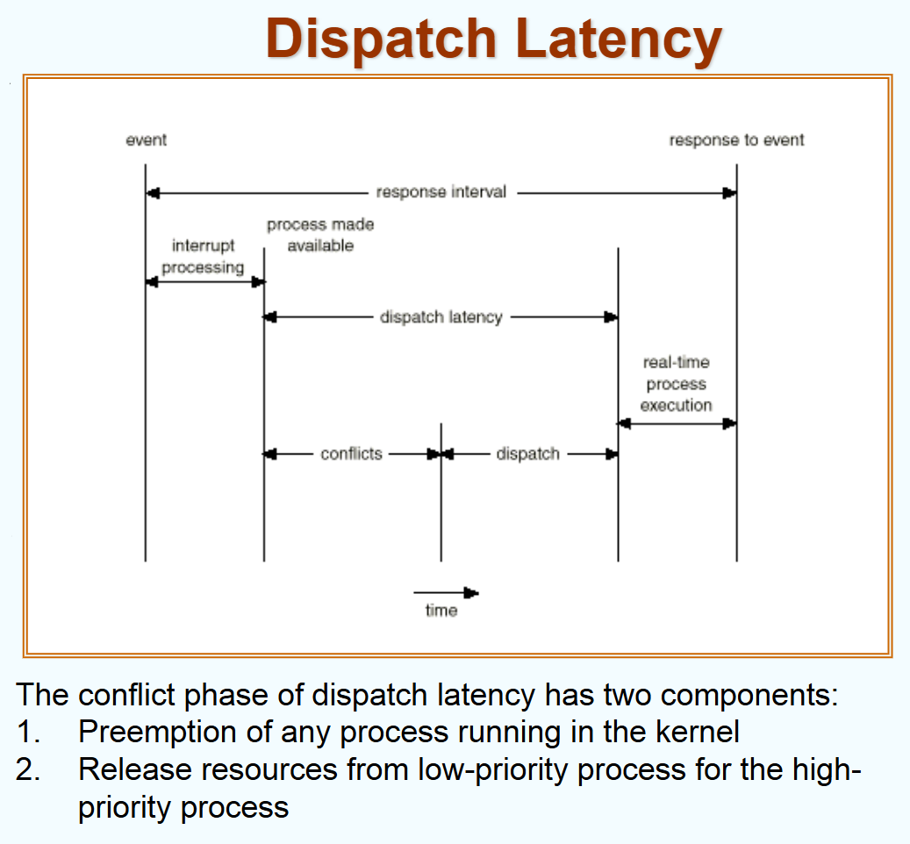{ width="600" }
</figure>

## 2 Scheduling Criteria

调度性能指标：

1. CPU utilization（CPU 利用率）：尽可能让 CPU 保持忙碌状态，最大化 CPU 的工作时间
2. throughput（吞吐率）：单位时间内完成执行的进程数量
3. turnaround time（周转时间）：执行一个特定进程所需的总时间，从被提交到最终完成
4. waiting time（等待时间）：进程在 ready 队列中等待的总时间
5. response time（响应时间）：从用户输入一个请求到系统给出第一个反馈所花费的时间

Optimization：

1. CPU utilization ↑
2. throughput ↑
3. turnaround time ↓
4. waiting time ↓
5. response time ↓

## 3 Scheduling Algorithm

### 3.1 FCFS Scheduling

**First Come First Served**

<figure markdown="span">
    { width="600" }
</figure>

<figure markdown="span">
    { width="600" }
</figure>

### 3.2 SJF Scheduling

**Shortest Job First**

基于进程的下一个 CPU 执行期长度来进行调度决策，优先执行预计运行时间最短的进程

两种方案：

1. nonpreemptive：进程一旦开始运行，就会完整执行完当前的 CPU 执行期，调度只在进程完成或主动放弃 CPU 时发生
2. preemptive：当有新进程到达时，会比较其 CPU 执行期与当前运行进程的剩余时间，如果新进程更短，立即抢占 CPU。这称为 SRTF（shortest remaining time first）

在平均等待时间上，SJF 是理论最优的

<figure markdown="span">
    { width="600" }
</figure>

<figure markdown="span">
    { width="600" }
</figure>

那么，如何得知下一个进程的 CPU 执行期的长度呢？这在实际当中是不可知的，只能基于历史数据进行预测，使用 exponential averaging 的方法

- $t_n$：第 n 个 CPU 执行期的实际长度
- $\tau_{n}$：CPU 执行期的预测值
- $a$：平滑系数，$0 < a < 1$

$\tau_{n+1} = at_n + (1 - a)\tau_n$

- 当 $a=0$ 时，完全依赖历史预测，忽略最新观测值
- 当 $a=1$ 时，完全依赖最新观测值，忽略历史数据

<figure markdown="span">
    { width="600" }
</figure>

### 3.3 Priority Scheduling

每个进程都被赋予一个优先级（通常用整数表示）。CPU 会根据这些优先级来决定下一个运行哪个进程。数值越小，优先级越高

该调度算法同样有两种实现方式：

- nonpreemptive：一旦进程开始运行，它会一直占用 CPU 直到完成或主动放弃，即使有更高优先级的进程到达
- preemptive：如果一个更高优先级的进程进入就绪队列，它可以抢占当前正在运行的低优先级进程的 CPU

SJF 实际上是优先级调度的一种特殊形式。在这里，优先级被定义为进程的“下一个预测 CPU 执行时间”，执行时间越短，优先级越高

主要问题：**starvation**。低优先级的进程可能会因为持续有高优先级进程到达而无限期地等待，永远得不到 CPU

解决方案：**aging**。系统会逐渐增加那些等待了很长时间的进程的优先级。这样，一个低优先级的进程在等待足够长的时间后，其优先级会提高到足以被调度执行的程度

### 3.4 Round Robin

**时间片轮转调度**（RR）

算法为每个进程分配一个固定的时间片（time quantum）来使用 CPU。当进程用尽它的时间片后，即使没有执行完毕，也会被强制剥夺 CPU 使用权（即被抢占），然后被重新放到 ready queue 的末尾排队，等待下一轮执行

如果 ready queue 中有 n 个进程，时间片为 q，那么每个进程一次最多能获得 q 个时间单位的 CPU 时间。在最坏情况下，一个进程需要等待 (n-1)q 个时间单位，才能再次运行

- 如果 q 很大：算法退化为 FIFO
- 如果 q 很小：上下文切换的频率增加，如果时间片大小和上下文切换开销接近，那么大部分 CPU 时间都会被浪费在管理切换上，而不是实际执行任务。因此，q 必须设置得远大于上下文切换所需的时间

<figure markdown="span">
    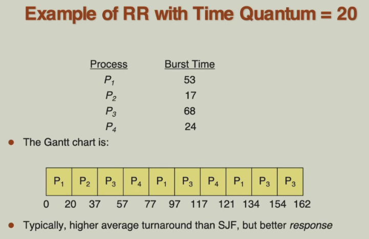{ width="600" }
</figure>

<figure markdown="span">
    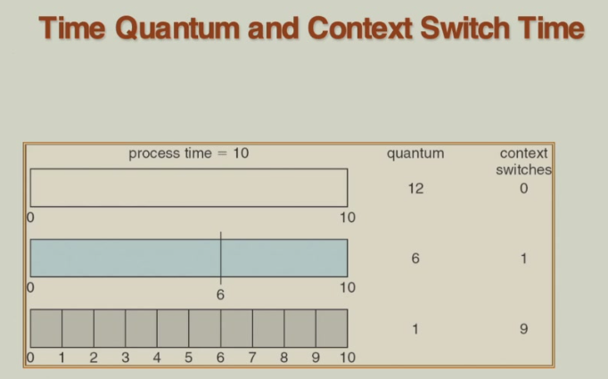{ width="600" }
</figure>

<figure markdown="span">
    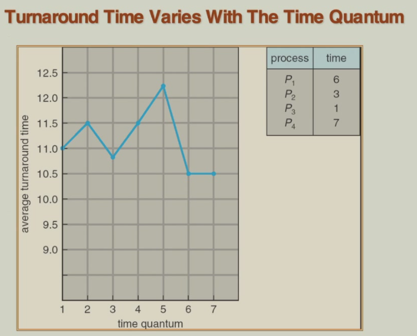{ width="600" }
</figure>

### 3.5 Multilevel Queue

将进程按其类型分组到不同的就绪队列中：

1. foreground queue：用于交互式进程（如用户应用程序），这些进程需要快速的响应时间
2. background queue：用于批处理进程（如数据分析、编译），这些进程不需要立即交互，但需要完成大量工作

每个队列可以根据其中进程的特点，采用最适合的调度算法：

1. foreground queue：使用 RR，可以保证交互式进程能频繁获得 CPU 时间片，从而提供流畅的用户体验
2. background queue：使用 FCFS，因为这类进程通常没有紧迫的响应时间要求

那么如何在不同队列之间分配 CPU 资源？

1. 固定优先级调度：总是优先运行高优先级队列（如前台）中的进程，只有在高优先级队列为空时，才运行低优先级队列（如后台）中的进程
2. 时间片分配：这是一种更公平的策略。它为每个队列分配一个固定的 CPU 时间百分比。例如，80% 的 CPU 时间分配给前台队列（内部使用 RR），20% 的 CPU 时间分配给后台队列（内部使用 FCFS）

在实际操作系统中，不同的就绪队列可以有很多个

<figure markdown="span">
    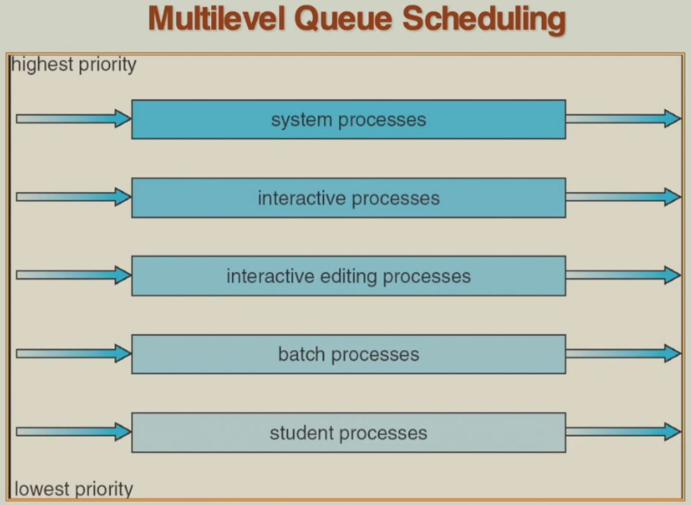{ width="600" }
</figure>

### 3.6 Multilevel Feedback Queue

在多级队列中，进程被固定分配到某个队列。而在多级反馈队列中，进程可以根据其行为在不同优先级的队列之间移动

> 可以通过这种方式实现老化：如果一个低优先级队列中的进程等待了很长时间，调度器可以将其提升到一个更高优先级的队列中，从而防止该进程被“饿死”

多级反馈队列调度器的行为由一组参数决定：

1. 队列数量
2. 每个队列的调度算法
3. upgrade 策略：决定何时将一个进程移到更高优先级的队列
4. demote 策略：决定何时将一个进程移到更低优先级的队列
5. 初始队列分配

!!! example "示例"
    
    三个队列：

    1. Q0：RR with time quantum 8 ms
    2. Q1：RR with time quantum 16 ms
    3. Q2：FCFS 

    新作业进入 Q0，进程获得一个 8 ms 的时间片。如果未完成，该进程被认为是可能需要更长时间的作业，被降级到 Q1

    进程在 Q1 中获得一个 16 ms 的时间片。如果仍未完成，该进程被却认为 CPU 密集型长作业，被进一步降级到 Q2

    在 Q2 中按 FCFS 方式运行，直到完成

<figure markdown="span">
    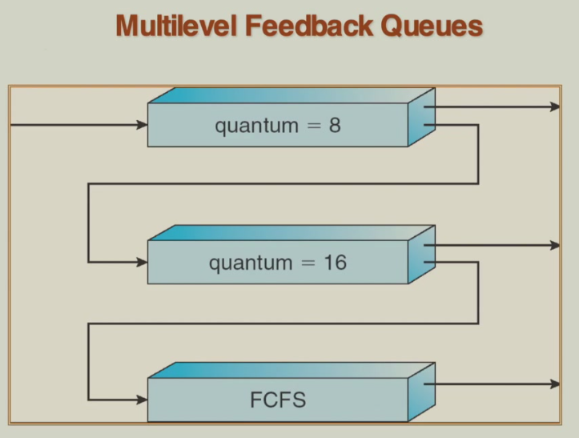{ width="600" }
</figure>

## 4 Multiple-Processor Scheduling

在单处理器系统中，调度只涉及为一个 CPU 分配任务。但在多处理器系统中，需要同时管理多个 CPU，复杂性显著增加

homogeneous processors（同构处理器）：指系统中的所有 CPU 在架构和性能上完全相同，这是实现有效负载均衡的前提条件

load balancing（负载均衡）：让所有 CPU 的工作负载尽可能均衡

多处理架构：

1. asymmetric multiprocessing：一个主处理器专门处理操作系统内核代码和系统数据结构；其他从处理器只运行用户应用程序。这简化了数据同步问题
2. symmetric multiprocessing：所有处理器地位相同，每个都可以运行内核代码和进行调度决策。这需要复杂的同步机制来保护共享的系统数据结构

## 5 Real-Time Scheduling

- hard real-time systems：要求关键任务必须在保证的时间范围内完成。例如：航空航天控制系统，汽车防抱死刹车系统
- soft real-time computing：要求关键进程优先于非关键进程执行，关键任务有较高的优先级，但偶尔错过截止期限是可以接受的。例如：多媒体系统，视频会议系统

## 6 Thread Scheduling

也称为 Contention Scope（竞争范围），竞争范围指的是线程在争夺 CPU 资源时所涉及的范围或层级。它决定了线程调度是在进程内部还是在整个系统范围内进行

- local scheduling（process-contention scope）：本地调度是指线程调度由用户态的线程库负责，仅在当前进程内的线程之间进行调度。线程库会从该进程的多个线程中选择一个合适的线程，将其绑定到一个可用的轻量级进程（LWP）上运行。这种调度方式不涉及内核，因此效率较高，但线程之间的竞争仅限于本进程内部。例如：如果一个进程有 5 个线程，但只有 2 个 LWP，那么线程库会决定哪两个线程被分配给这两个 LWP
- global scheduling（system-contention scope）：全局调度是由操作系统内核负责的调度机制，所有系统的线程（包括不同进程的线程）都参与竞争 CPU 资源。内核会从整个系统的所有可运行线程中选择一个线程来执行，这通常基于优先级、时间片等调度算法。在这种模式下，线程之间的竞争是跨进程的，因此调度范围更广，但可能引入更大的上下文切换开销。例如：系统中有多个进程，每个进程都有多个线程，内核会从这些线程中统一调度，决定哪一个线程获得 CPU 时间

## 7 Operating Systems Examples

### 7.1 Solaris Scheduling

<figure markdown="span">
    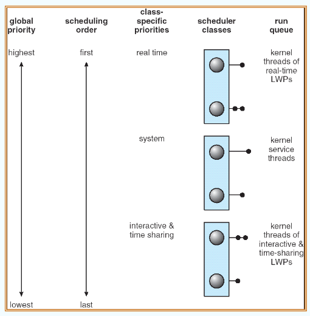{ width="600" }
</figure>

<figure markdown="span">
    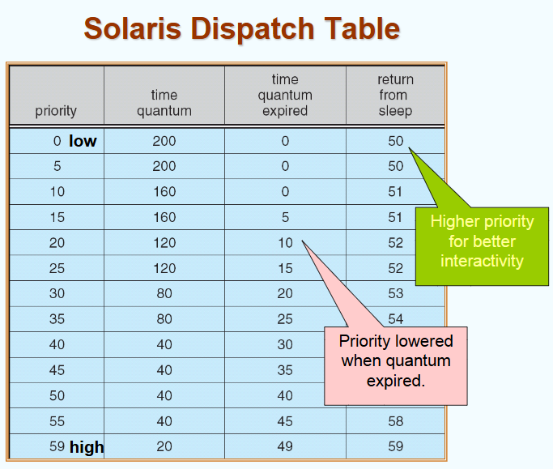{ width="600" }
</figure>

1. priority：数值越大，优先级越高
2. time quantum：表示该优先级的进程 / 线程在 CPU 上运行的最大时间。高优先级任务获得更短的时间片，以便快速响应。低优先级任务获得更长的时间片，以减少上下文切换开销
3. time quantum expired：当一个任务的时间片用完时，它的优先级会降低到此列对应的数值。这是 Solaris 实现“动态优先级调整”的一种机制
4. return from sleep：当一个任务从休眠状态（如等待 I/O）唤醒时，它的优先级会被提升到该列的值。这样可以提高交互性，让刚醒来的任务更快获得 CPU

### 7.2 Windows XP Scheduling

<figure markdown="span">
    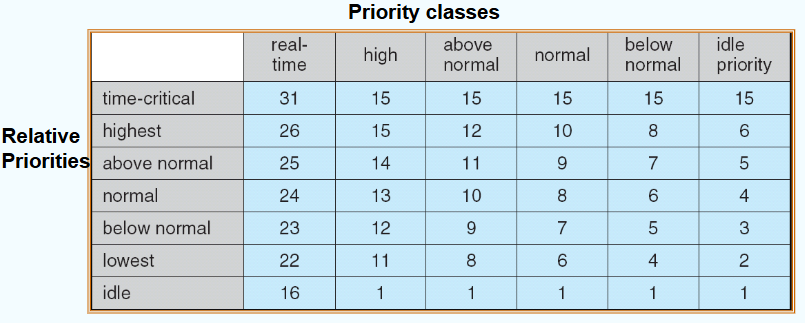{ width="600" }
</figure>

1. 最左边一列：这些是进程或线程在启动时可以设置的全局优先级类，由操作系统根据此分类决定其基础优先级范围
2. 最上边一行：这是线程相对于其所属优先级类的“内部优先级”。每个线程可以在其所在优先级类中进一步调整自己的优先级
3. 数字：实际的优先级数值。数值越大优先级越大

### 7.3 Linux Scheduling

使用两种调度算法：

1. time-sharing：时间共享调度。这是 Linux 中用于普通用户进程和后台任务的主要调度方式，目标是实现公平性、响应性和多任务处理

    1. Prioritized credit-based（基于信用的优先级调度）：每个进程有一个信用值，系统总是选择信用最多的进程进行调度运行，信用越高，表示该进程越值得被运行
    2. 定时器中断时扣除信用：当定时器中断发生（即一个进程运行了一段时间），系统会从当前运行进程的信用中减去一定数值。这相当于消耗了它的运行权利
    3. 信用为零时切换进程：如果某个进程的信用降为 0，它将被暂停，系统会选择另一个信用较高的进程运行。这确保了没有进程能无限占用 CPU
    4. 所有进程信用都为零时重新分配信用：当所有进程的信用都变为 0 时，系统会重新为它们分配信用。分配依据包括：进程的优先级，进程的历史行为

2. real-time：实时调度。用于需要严格时间保证的任务

    1. soft real-time
    2. 符合 POSIX.1b 标准，提供两类实时调度策略 FCFS 和 RR
    3. 最高优先级进程总是优先运行：在实时调度中，优先级是绝对的。即使一个低优先级进程正在运行，一旦有更高优先级的实时进程就绪，它会立即抢占 CPU。这种机制保证了关键任务能够及时响应

<figure markdown="span">
    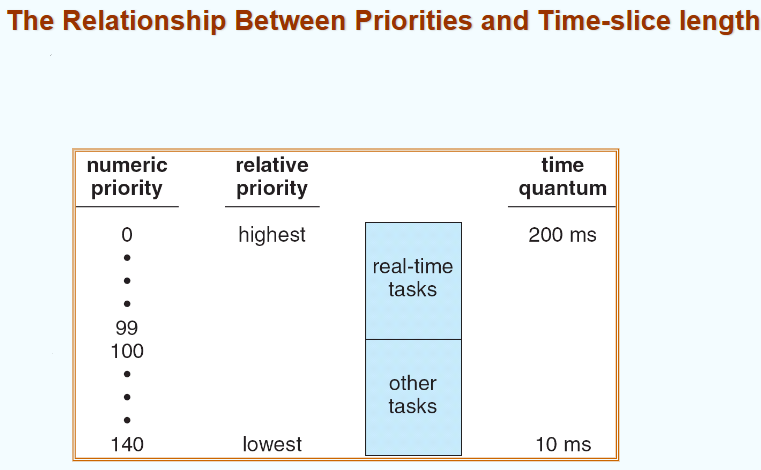{ width="600" }
</figure>

在 Linux 的调度系统中，时间片长度的设计目标不是为了响应速度，而是为了保证关键任务的执行效率和稳定性。因此，优先级越高的进程获得的时间片轮越长

<figure markdown="span">
    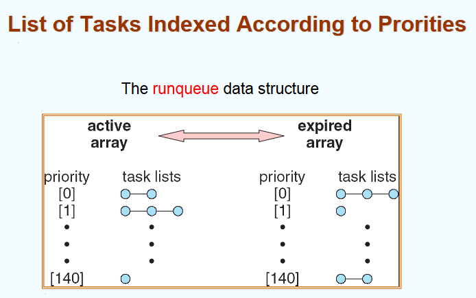{ width="600" }
</figure>

linux 的 runqueue 被分为两个主要部分：

1. active array：当前正在使用的任务列表，包含尚未用完时间片的进程
2. expired array：存放已经用完时间片、等待重新分配信用/时间片的进程

这两个数组之间可以互相切换，意味着调度器可以在它们之间来回切换

每个优先级对应一个链表，存放该优先级的所有就绪任务，每个圆圈则代表一个进程。在 active array 中，调度器会优先从高优先级开始查找是否有任务可运行。所有任务一开始都在 active array 中，时间片用完后，被移到 expired array。当 active array 中所有任务的时间片都耗尽后，调度器会将 active array 和 expired array 互换角色，继续下一轮的运行

## 8 Java Thread Scheduling

JVM 使用一个 preemptive，priority-based 的调度算法。当有很多优先级相同的线程时，使用 FIFO Queue

JVM 在以下情况下调度线程运行：

1. 当前正在运行的线程退出了“可运行”状态：线程可能因为执行完毕、被阻塞或进入 wait 状态等原因退出可运行状态，此时，JVM 会从就绪队列中选择下一个合适的线程来运行
2. 更高优先级的线程进入了“可运行”状态：如果此时有更高优先级的线程变为“可运行”，JVM 会立即中断当前线程，并调度高优先级线程运行

> JVM 并未规定线程是否采用 time-sliced（时间片轮转）。具体实现取决于底层操作系统和 JVM 实现

## 9 Algorithm Evaluation

评估计算机算法（尤其是与调度、操作系统或队列管理相关的算法）性能的主要方法：

1. deterministic modeling（确定性建模）：是一种理论分析方法，它假设输入的工作负载是已知且固定的。通过这种模型，我们可以计算出算法在特定场景下的运行时间、资源消耗等性能指标。它的优点是简单、可预测；缺点是缺乏对现实世界中随机性和不确定性的考虑
2. queueing models（排队模型）：Little's Law：$n = \lambda W$。$n$ 表示系统中客户的平均数量（例如等待或正在被服务的请求数）；$\lambda$ 表示单位时间内到达系统的平均客户数（到达率）；$W$ 表示一个客户从进入系统到离开的平均时间（即响应时间或等待时间）
3. simulations：是一种实验性方法，通过构建虚拟环境来测试算法。可以处理复杂的、非确定性的场景。优点是可以灵活地测试多种情况；缺点是需要大量时间和计算资源
4. implementation：是最接近现实的评估方式，可以反映算法在真实硬件和软件环境下的性能。包括性能测试、压力测试、稳定性测试等。缺点是成本高、耗时长，且结果可能受具体实现细节影响

<figure markdown="span">
    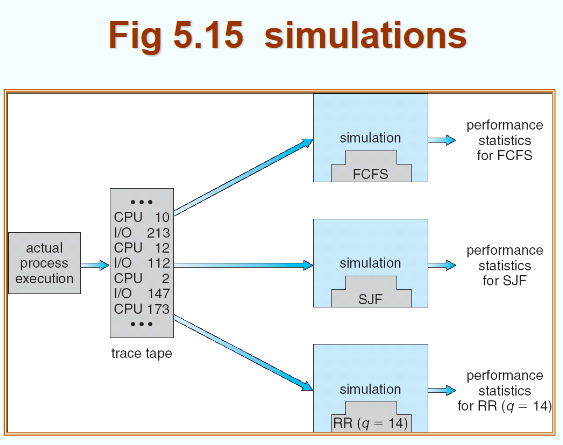{ width="600" }
</figure>
