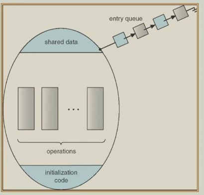

# 6 Process Synchronization

!!! tip "说明"

    本文档正在更新中……

!!! info "说明"

    本文档仅涉及部分内容，仅可用于复习重点知识

## 1 Background

<!-- TODO: 少一部分内容 -->

producer-consumer 模型的实现：

```c linenums="1" title="producer"
while (true) {
    while (count == BUFFER_SIZE);
    buffer[in] = nextProduced;
    in = (in + 1) % BUFFER_SIZE;
    count++;
}
```

```c linenums="1" title="consumer"
while (true) {
    while (count == 0);
    nextConsumed = buffer[out];
    out = (out + 1) % BUFFER_SIZE;
    count--;
}
```

## 2 The Critical Section Problem

### 2.1 Race Condition

!!! example "示例"

    `count++` 可能被实现为

    ```c linenums="1"
    reg1 = count;
    reg1 = reg1 + 1;
    count = reg1
    ```

    `count--` 可能被实现为

    ```c linenums="1"
    reg2 = count;
    reg2 = reg2 - 1;
    count = reg2
    ```

    一个生产者线程执行 `count++`，一个消费者线程执行 `count--`。但由于两个线程的指令交错执行，可能导致错误（假设初始值 `count = 5`），例如

    1. 生产者读取 `count` (5) 并计算新值 (6)，但尚未写回
    2. 在生产者写回之前，消费者读取了 `count` 的值，此时它仍然是 5。消费者计算新值 (4)
    3. 生产者将其计算的结果 (6) 写回 count
    4. 消费者将其计算的结果 (4) 写回 count，覆盖了生产者刚刚写入的值

    那么 `count` 最后的值可能有三种情况：4、5 或 6

当满足以下两个条件时，就会发生竞态条件：

1. 并发访问：多个线程或进程同时访问同一个内存位置（变量、数据结构等）
2. 至少包含写操作：这些并发访问中，至少有一个是写操作（修改数据），而不仅仅是读操作

### 2.2 Critical Section Problem

critical section（临界区）：指代进程中访问共享资源（例如全局变量、公共文件、硬件设备）的那段代码

critical section problem：当多个进程或线程需要共享资源（如数据、设备）时，如何确保不会有两个以上的进程同时进入其临界区

为了解决这个问题，需要设计一个协议，任何进程在进入临界区前都必须遵守这个协议。这个协议将进程访问临界区的代码划分为四个部分：

1. entry section：进程在进入临界区之前必须执行的代码。这是请求许可的区域。进程在这里等待，直到获准进入临界区。通常包含实现同步机制的代码（如获取锁）
2. critical section：进程实际访问共享资源的代码段。这是需要互斥访问的部分，即一次最多只能有一个进程在此段代码中执行
3. exit section：进程在离开临界区时执行的代码。这是释放访问权的区域。通常用于通知其他进程临界区已空闲（如释放锁）
4. remainder section：进程中不涉及共享资源访问的其余代码部分

任何解决临界区问题的方案都必须满足 3 个核心条件：

1. **mutual exclusion**（互斥）：这是最根本的要求。它保证了任何时候最多只有一个进程能够处于其临界区中，从而确保对共享资源的访问是串行化的，防止了数据不一致（即解决了之前提到的竞态条件问题）
2. **progress**（进展）：这个要求保证了系统的活性。它意味着：选择哪个进程进入临界区的决策必须在有限的进程中做出（不能依赖超出这些进程之外的因素），这个选择不能无限期拖延。如果没有进程在临界区，并且有进程想进去，那么其中一个必须能够被允许进入。这防止了系统死锁或停滞在无人能进入临界区的状态
3. **bounded waiting**（有限等待）：这个要求防止了进程饥饿。它确保任何一个进程在请求进入临界区后，只需要等待有限的时间（即被其他进程插队的次数是有限的），之后它一定能获得进入权限。这保证了所有进程都有公平的机会访问共享资源，避免了某个进程因为某种原因永远无法进入其临界区

以及 2 个系统假设：

1. 每个进程以非零速度执行：意味着进程最终都会完成其计算，不会完全停止。这排除了因进程自身故障导致的问题，让我们专注于并发控制逻辑
2. 不假设进程的相对速度：这是一个非常重要的现实假设。在真实的多处理器或分时系统中，我们无法预知哪个进程运行得更快，调度器何时切换进程。因此，一个正确的解决方案不能依赖于任何特定的时间安排或执行速度假设。它必须在任何可能的指令交错执行情况下都能正常工作

> 一个正确的临界区解决方案必须同时满足互斥、进展和有限等待这 3 个条件，并且必须在不依赖进程相对执行速度的前提下做到这一点

!!! example "Algorithm 1"

    ```c linenums="1"
    int turn;
    turn = 0;
    ```

    <div class="grid" markdown>
    <div markdown>

    Process Pi:

    ```c linenums="1"
    do {
        while (turn != i);
        critical section;
        turn = j;
        remainder section;
    } while (1);
    ```
    
    </div>
    <div markdown>

    Process Pj:

    ```c linenums="1"
    do {
        while (turn != j);
        critical section;
        turn = i;
        remainder section;
    } while (1);
    ```

    </div>
    </div>

    1. mutual exclusion：满足。`turn` 的值只能是 `i` 或 `j`，两个进程不会同时进入临界区
    2. progress：不满足。如果 `turn = i`，但 Pi 不在剩余区（不请求进入），而 Pj 想进入，Pj 必须等待 Pi 进入一次并把 `turn` 改为 `j`。如果 Pi 永远不再请求进入（比如结束或卡在剩余区），Pj 就永远无法进入
    3. bounded waiting：满足。任何一个进程最多等待另一个进程完成一次临界区访问，等待次数是有界的（最多 1 次）

!!! example "Algorithm 2"

    ```c linenums="1"
    boolean flag[2];
    flag[0] = flag[1] = 0;
    ```

    <div class="grid" markdown>
    <div markdown>

    Process Pi:

    ```c linenums="1"
    do {
        flag[i] = true;  // 标记自己正在尝试进入临界区
        while (flag[j]);  // 循环等待，直到对方不再尝试进入
        critical section;  // 进入临界区
        flag[i] = false;  // 离开后清除标记
        remainder section;  // 执行非临界区代码
    } while (1);
    ```
    
    </div>
    <div markdown>

    Process Pj:

    ```c linenums="1"
    do {
        flag[j] = true;
        while (flag[i]);
        critical section;
        flag[j] = false;
        remainder section;
    } while (1);
    ```

    </div>
    </div>

    1. mutual exclusion：满足。每次进入临界区之前，都会检查对方的 `flag` 是否为 `true`，两个进程不会同时进入临界区
    2. progress：不满足。如果 Pi 执行了 `flag[i] = true`，Pj 执行了 `flag[j] = true`，那么两个进程都会卡在 `while` 循环当中
    3. bounded waiting：不满足。Pi 退出 CS 后立即又想进入，执行 `flag[i] = true`，此时 P1 可能还没进入 CS（还在执行 remainder 或刚要检查 `flag[i]`）。如果 Pi 总是能抢先设置 `flag[i] = true` 并检查 `flag[j]` 为 `false`，那么 Pj 可能饥饿

!!! example "Algorithm 3"

    ```c linenums="1"
    boolean flag[2];
    flag[0] = flag[1] = 0;
    ```

    <div class="grid" markdown>
    <div markdown>

    Process Pi:

    ```c linenums="1"
    do {
        while (flag[j]);
        flag[i] = true;
        critical section;
        flag[i] = false;
        remainder section;
    } while (1);
    ```
    
    </div>
    <div markdown>

    Process Pj:

    ```c linenums="1"
    do {
        while (flag[i]);
        flag[j] = true;
        critical section;
        flag[j] = false;
        remainder section;
    } while (1);
    ```

    </div>
    </div>

    mutual exclusion：不满足。Pi 和 Pj 可以将 `while` 循环执行完，然后才设置自己的 `flag` 为 `true`，同时进入 CS

### 2.3 Peterson's Solution

两个共享变量：

1. `turn`：明确指定当前有权进入临界区的进程
2. `flag[2]`：每个进程通过设置自身的 `flag` 为 `true` 来表达其进入临界区的意愿

假设基础硬件指令（`LOAD` 和 `STORE`）被假定为原子性（执行过程中不可中断）

```c linenums="1"
while (true) {
    flag[i] = true;
    turn = j;
    while (flag[j] && turn == j);
    critical section;
    flag[i] = false;
    remainder section;    
}
```

1. mutual exclusion：由于 `turn == i` `turn == j` 永远都会有一个成立，另一个不成立，所以不可能出现两个进程同时进入 CS
2. progress：由于 `turn == i` `turn == j` 永远都会有一个成立，另一个不成立，所以当没有进程在 CS 中时，想进入 CS 的那个进程总可以进去
3. bounded waiting：假设 Pi 卡在 `while` 循环当中，Pj 退出临界区时，它会设置 `flag[j] = false`，这就会使得 Pi 离开 `while` 循环，不会无限等待

## 3 Synchronization Hardware

计算机系统中实现同步的硬件支持方式

单处理器解决方案：禁用中断。在进入临界区前禁用中断，退出时重新启用。这会确保当前进程在执行临界区代码时不会被时钟中断或其他中断抢占

局限性：

1. 在多处理器系统中无效，因为其他 CPU 仍可同时访问共享内存
2. 影响系统响应性和实时性
3. 不适合作为通用的同步机制

现代硬件解决方案：原子指令

> Atomic：这些指令在执行过程中不可被中断，要么完全执行，要么完全不执行

两种主要类型：

1. TestAndSet（测试并设置）：检查内存值并同时设置新值
2. CompareAndSwap（交换）：原子地交换两个内存位置的内容

优势：

1. 适用于多处理器系统
2. 提供了构建更高级同步原语的基础
3. 比禁用中断更加高效和可扩展

### 3.1 TestAndSet Instruction

```c linenums="1"
boolean TestAndSet(boolean *target) {
    boolean rv = *target;
    *target = true;
    return rv;
}
```

返回值意义：

- 返回 `FALSE`：表示该锁之前未被占用，当前进程成功获得锁
- 返回 `TRUE`：表示锁已被占用，当前进程需要等待

!!! tip "实现互斥锁"

    ```c linenums="1"
    while (true) {
        while (TestAndSet(&lock));
        critical section;
        lock = false;
        remainder section;
    }
    ```

    1. 初始化共享变量 `lock = FALSE` 表示锁未被占用
    2. 获取锁：进程调用 `TestAndSet(&lock)`，如果返回 `FALSE`，说明锁原本是空闲的，现在已被设置为 `TRUE`，进程进入临界区；如果返回 `TRUE`：说明锁已被占用，进程在 `while` 循环中忙等待（自旋）
    3. 释放锁：进程退出临界区时，将 `lock` 设为 `FALSE`，允许其他等待的进程获得锁

### 3.2 CompareAndSwap Instruction

```c linenums="1"
int compare_and_swap(int *value, int expected, int new_value) {
    int temp = *value;
    if (*value == expected) {
        *value = new_value;
    }
    return temp;
}
```

参数：

1. `value`：指向要修改的内存位置
2. `expected`：期望的旧值
3. `new_value`：要设置的新值

只有在当前值与期望值匹配时才进行更新，总是返回内存位置的原始值，无论是否发生交换

!!! tip "实现自旋锁"

    ```c linenums="1"
    while (true) {
        while (compare_amd_swap(&lock, 0, 1) != 0);
        critical section;
        lock = 0;
        remainder section;
    }
    ```

    1. 获取锁 `compare_and_swap(&lock, 0, 1)`：如果 `lock` 当前为 `0`，将其设为 `1` 并返回 `0`，进程进入临界区；如果 `lock` 当前为 `1`，返回 `1`，进程继续忙等待
    2. 释放锁：将 `lock` 设为 `0`

!!! tip "实现有限等待"

    ```c linenums="1"
    while (true) {
        waiting[i] = true;  // 标记自己在等待
        key = 1;
        while (waiting[i] && key == 1) {
            key = compare_and_swap(&lock, 0, 1);  // 尝试获取锁
        }
        waiting[i] = false;  // 清除等待标记，进入临界区
        
        /* 临界区 */
        
        j = (i + 1) % n;  // 从下一个进程开始查找
        while ((j != i) && !waiting[j]) {  // 寻找下一个等待的进程
            j = (j + 1) % n;
        }
        if (j == i) {  // 没有其他进程等待
            lock = 0;  // 直接释放锁
        } else {  // 有进程在等待
            waiting[j] = false;  // 唤醒进程 j，让它获得锁
        }
        
        /* 剩余区 */
    }
    ```

    1. `lock`：全局锁
    2. `waiting[n]`：布尔数组，记录每个进程是否在等待
    3. `n`：进程总数
    4. `i`：当前进程 ID

### 3.3 Mutex Locks

之前讨论的 Peterson 算法、TestAndSet、CAS 等底层同步原语对应用程序开发者来说过于复杂，需要更简单、易用的同步工具

互斥锁将复杂的硬件同步指令封装成简单的 `acquire()` 和 `release()` 接口，开发者无需关心底层硬件实现细节

```c linenums="1"
// 简化的自旋锁实现
typedef struct {
    int locked;  // 0=未锁定, 1=已锁定
} mutex_lock;

void acquire(mutex_lock *lock) {
    while (compare_and_swap(&lock->locked, 0, 1) != 0); // 忙等待
}

void release(mutex_lock *lock) {
    lock->locked = 0;
}
```

关键特性：

1. 原子操作：`acquire()` 和 `release()` 必须不可中断
2. 忙等待（自旋）：进程在等待锁时持续检查锁状态，消耗 CPU 周期
3. spin lock（自旋锁）得名：因为进程在等待时像在旋转

```c linenums="1"
while (true) {
    acquire lock;
    critical section;
    release lock;
    remainder section;
}
```

## 4 Semaphores

**信号量**：一种同步工具，比互斥锁更高级的同步机制，整型信号量 S 表示可用资源的数量

操作语义（这两个操作必须不可中断）：

1. `wait()` / `P()`：如果 S 大于 0，立即减少 S 并继续执行；如果 S 小于等于 0，忙等待直到 S 大于 0
2. `signal()` / `V()`：增加 S 的值，表示释放一个资源

```c linenums="1"
wait(S) {
    while (S <= 0); // 空操作
    S--;
}

signal(S) {
    S++;
}
```

1. counting semaphore：其值是一个可以取任何非负整数的计数器。它用于控制对多个相同资源实例的访问。信号量的值表示当前可用资源的数量
2. binary semaphore：其值被限制为只能是 0 或 1。它主要用于提供互斥，即确保在任何时候只有一个线程或进程可以进入临界区。因此，它常被称为 mutex locks

```c linenums="1"
semaphore S;
wait(S);
critical section;
signal(S);
```

信号量本身是一个共享资源，对其值的操作必须是原子的。也就是说，必须保证没有两个进程能同时执行同一信号量的 `wait()` 和 `signal()`，否则会导致信号量状态错误（即竞态条件）

解决方案：将 `wait` 和 `signal` 操作内部的代码本身置于一个临界区中。这就把信号量的实现问题转化为了一个临界区问题

!!! tip "semaphore implementation with busy waiting"

    ```c linenums="1" hl_lines="13"
    struct semaphore {
        struct spinlock lock;
        int count;
    };
        
    void V(struct semaphore *s) {
        acquire(&s->lock);
        s->count += 1;
        release(&s->lock);
    }

    void P(struct semaphore *s) {
        while(s->count == 0);
        acquire(&s->lock);
        s->count -= 1;
        release(&s->lock);
    }
    ```

    > 如果生产者很少活动，消费者会在第 13 行空转。这非常浪费资源

    如果使用像自旋锁这样的机制来实现保护 `wait` 和 `signal` 操作的临界区，那么当一个进程在等待进入这个临界区时，它可能会在循环中忙等待，消耗 CPU 资源

    busy waiting 适用场景：

    1. 实现代码很短：如果 `wait` 和 `signal` 内部的代码执行得非常快，忙等待的时间会很短
    2. 临界区很少被占用：如果冲突很少发生，进程很少需要等待，那么忙等待的问题就不显著

    缺点：对于通用的应用程序，进程可能在临界区内花费相当长的时间。在这种情况下，忙等待会变得非常低效，因为它会浪费大量的 CPU 周期
    
    因此，信号量的实现通常不会使用纯粹的忙等待

每个信号量都有一个关联的 waiting queue。每个信号量包含两个数据项：

1. value：一个整数，表示可用资源的数量

    1. `value >= 0`：表示当前可用资源的个数
    2. `value < 0`：其绝对值表示正在等待该信号量的进程数量

2. 等待队列指针：指向一个队列，该队列中存放了所有因等待此信号量而阻塞的进程的 PCB

两种关键操作：

1. block / sleep：一个系统调用。当一个进程执行 wait 操作（或 P 操作）试图获取信号量时，如果信号量的值小于或等于 0（表示没有可用资源），系统不会让它忙等，而是会调用 block 操作。该操作会将当前进程的 PCB 从就绪队列移出，放入该信号量的等待队列，从而让出 CPU
2. wakeup：一个系统调用。当一个进程执行 signal 操作（或 V 操作）释放信号量时，它会增加信号量的值。如果发现等待队列中有进程在等待，它就会调用 wakeup 操作。该操作会从等待队列中取出一个进程的 PCB，并将其放回就绪队列，使其有机会再次被调度执行

!!! tip "sleep and wakeup"

    ```c linenums="1"
    void V(struct semaphore *s) {
        acquire(&s->lock);          // 获取信号量锁
        s->count += 1;              // 增加计数器
        wakeup(s);                  // 唤醒等待的进程
        release(&s->lock);          // 释放锁
    }
    
    void P(struct semaphore *s) {
        while (s->count == 0) {     // 如果计数为0，进入循环
            sleep(s);               // 进程睡眠，等待被唤醒
        }
        acquire(&s->lock);          // 获取锁
        s->count -= 1;              // 减少计数器
        release(&s->lock);          // 释放锁
    }
    ```

    当 `P()` 发现 `count == 0` 时，进程会进入睡眠状态，并加入到与信号量关联的等待队列中。通过 sleep 操作主动放弃 CPU，减少了开销

    但如果 P 在进入 while 循环之后，V 执行了 wakeup，P 才执行 sleep，那么进程可能永远不会被唤醒了。这就是 lost wake-up problem（丢失唤醒问题）

    !!! question "提前 acquire 操作？"

        ```c linenums="1"
        void V(struct semaphore *s) {
            acquire(&s->lock);
            s->count += 1;
            wakeup(s);
            release(&s->lock);
        }
        
        void P(struct semaphore *s) {
            acquire(&s->lock);
            while (s->count == 0) {
                sleep(s);
            }
            s->count -= 1;
            release(&s->lock);
        }
        ```

        防止了丢失唤醒，但出现了 deadlock。进程 sleep 后，它仍然拿着这个锁

    !!! tip "pass the condition lock to sleep"

        ```c linenums="1"
        void V(struct semaphore *s) {
            acquire(&s->lock);
            s->count += 1;
            wakeup(s);
            release(&s->lock);
        }
        
        void P(struct semaphore *s) {
            acquire(&s->lock);
            while (s->count == 0) {
                sleep(s, &s->lock);
            }
            s->count -= 1;
            release(&s->lock);
        }
        ```

        `sleep(s, &s->lock)` 可以在调用进程被标记为已睡眠并加入到等待队列后，自动释放该锁

        这样既避免了丢失唤醒，又避免了死锁

no busy waiting 的 semaphore 实现：

```c linenums="1"
wait(S) {
    value--;
    if (value < 0) {
        block();
    }
}

signal(S) {
    value++;
    if (value <= 0) {
        wakeup(P);
    }
}
```

## 5 Classic Problems of Synchronization

### 5.1 Deadlock and Starvation

死锁：指两个或更多的进程，每个都在等待对方释放资源，导致所有进程都无法继续执行的情况

假设 S 和 Q 是两个信号量，初始值均为 1

<div class="grid" markdown>

```c linenums="1" title="P1"
P(S)
P(Q)
...
V(Q)
V(S)
```

```c linenums="1" title="P2"
P(Q)
P(S)
...
V(S)
V(Q)
```

</div>

若 P1 持有 S 的锁，P2 持有 Q 的锁；而 P1 申请 Q 的锁，P2 申请 S 的锁，两个进程都会因无法获得对方占有的资源而无限等待，形成死锁

饥饿：指一个进程由于某种原因（如调度策略不公平、优先级低等）长期得不到它所需的资源，无法继续执行

### 5.2 Bounded-Buffer Problem

1. 缓冲区：一块共享内存区域，用于在生产者和消费者之间传递数据，假设总共有 N 个缓冲区
2. `mutex`：初始值为 1，是一个二进制信号量。用于确保生产者和消费者不会同时访问缓冲区，保证对缓冲区的互斥访问
3. `full`：初始值为 0，是一个计数信号量。它表示当前缓冲区中已被生产者放入、等待消费者取走的数据项数量
4. `empty`：初始值为 N，也是一个计数信号量。它表示当前缓冲区中空闲的、可供生产者放入新数据项的位置数量

```c linenums="1" title="producer process"
while (true) {
    // produce an item
    wait(empty);  // 检查是否有空缓冲区
    wait(mutex);  // 获取互斥锁
    // add the item to the buffer
    signal(mutex);  // 释放互斥锁
    signal(full);  // 通知有新增数据
}
```

```c linenums="1" title="consumer process"
while (true) {
    wait(full);  // 检查缓冲区中是否有可供消费的数据
    wait(mutex);  // 获取互斥锁
    // remove an item from buffer
    signal(mutex);  // 释放互斥锁
    signal(empty);  // 通知有空位
    // consume the removed item
}
```

!!! question "exercise"

    三个进程互斥使用一个包含 N 个单元的缓冲区

    1. P1：每次用 `produce` 生成一个正整数，并用 `put` 将正整数放入缓冲区的一个空单元
    2. P2：每次用 `getodd` 从缓冲区取一个奇数，并用 `countodd` 统计奇数个数
    3. P3：每次用 `geteven` 从缓冲区取一个偶数，并用 `counteven` 统计偶数个数

    ??? success "参考"

        ```c linenums="1"
        semaphore mutex = 1;   // 互斥访问缓冲区
        semaphore empty = N;   // 空槽位数量
        semaphore odd = 0;     // 奇数数量
        semaphore even = 0;    // 偶数数量
        ```

        ```c linenums="1" title="P1"
        while (true) {
            int item = produce();  // 生成一个正整数
            wait(empty);           // 等空位
            wait(mutex);           // 进入临界区
            put(item);             // 将item放入缓冲区
            if (item % 2 == 0) 
                signal(even);      // 如果是偶数，唤醒可能等待的P3
            else 
                signal(odd);       // 如果是奇数，唤醒可能等待的P2
            signal(mutex);         // 离开临界区
        }
        ```

        ```c linenums="1" title="P2"
        while (true) {
            wait(odd);             // 等有奇数
            wait(mutex);           // 进入临界区
            int num = getodd();    // 从缓冲区取出一个奇数
            signal(empty);         // 释放一个空位
            signal(mutex);         // 离开临界区
            countodd();            // 统计奇数（在临界区外执行）
        }
        ```

        ```c linenums="1" title="P3"
        while (true) {
            wait(even);            // 等有偶数
            wait(mutex);           // 进入临界区
            int num = geteven();   // 从缓冲区取出一个偶数
            signal(empty);         // 释放一个空位
            signal(mutex);         // 离开临界区
            counteven();           // 统计偶数（在临界区外执行）
        }
        ```

### 5.3 Readers and Writers Problem

1. readers：只读取数据，不会修改数据，因此多个读者可以同时读取而不会产生数据不一致
2. writers：会修改数据，因此必须独占访问权，在写操作期间不允许任何其他读者或写者访问数据

解决方案组件：

1. `readcount`：记录当前正在读取数据的读者数量。当第一个读者开始读取时，需要阻止写者；当最后一个读者结束读取时，需要允许写者
2. `mutex`：用于保护 `readcount` 变量的更新，确保多个读者不会同时修改 `readcount`，避免竞态条件
3. `wrt`：写者互斥信号量。用于确保同一时间只有一个写者可以访问数据，也用于在写者访问时阻止读者

工作原则：

1. 读者优先：只要还有读者在读取，新到的读者可以立即开始读取，写者可能被无限期推迟（写者饥饿）
2. 当第一个读者到达时，它会获取 `wrt` 信号量，阻止写者
3. 当最后一个读者离开时，它会释放 `wrt` 信号量，允许写者
4. 写者必须等待所有读者完成后才能开始写入

```c linenums="1" title="writers"
while (true) {
    wait(wrt);  // 尝试获取 wrt 信号量
    // 执行写入操作
    signal(wrt);  // 释放 wrt 信号量
}
```

```c linenums="1" title="readers"
while (true) {
    wait(mutex);  // 保护 readcount 的互斥访问
    readcount ++;
    if (readcount == 1) {
        wait(wrt);  // 如果是第一个读者，获取 wrt 信号量
    }
    signal(mutex);  // 释放对 readcount 的保护
    // 执行读取操作
    wait(mutex);  // 再次保护 readcount
    readcount --;
    if (readcount == 0) {
        signal(wrt);  // 如果是最后一个读者，释放 wrt 信号量
    }
    signal(mutex);  // 释放对 readcount 的保护
}
```

### 5.4 Dining Philosophers Problem

5 位哲学家围坐在圆桌旁，每位哲学家面前有一碗米饭，每两位哲学家之间放着一根筷子（共 5 根筷子），哲学家需要两根筷子才能吃饭

shared data：

1. 一碗米饭：代表共享的数据集或资源
2. 信号量 `chopstick[5]`：5 个信号量组成的数组，每个对应一根筷子。初始值都为 1，表示每根筷子最初都是可用的。用于控制对筷子的互斥访问

!!! failure "有缺陷的解决方案"

    ```c linenums="1" title="philosopher i"
    while (true) {
        wait(chopstick[i]);  // 拿起左边的筷子（等待并获取信号量）
        wait(chopstick[(i + 1) % 5]);  // 拿起右边的筷子
    
        // 吃饭
    
        signal(chopstick[i]);  // 放下左边的筷子（释放信号量）
        signal(chopstick[(i + 1) % 5]);  // 放下右边的筷子
    }
    ```

    如果所有哲学家同时拿起自己左边的筷子，就会发生死锁。每位哲学家都在等待右边的筷子，但所有筷子都被占用，系统陷入僵局

!!! success "solution 1"

    通过信号量 `S` 限制最多只能有 4 位哲学家同时尝试拿筷子，可以避免死锁
    
    > 数学原理：鸽巢定理
    
    ```c linenums="1" title="philosopher i"
    while (true) {
        wait(S);  // 如果已经有 4 位哲学家在尝试拿筷子，第 5 位哲学家会在此阻塞
        wait(chopstick[i]);
        wait(chopstick[(i + 1) % 5]);
        
        // 吃饭
        
        signal(chopstick[i]);
        signal(chopstick[(i + 1) % 5]);
        signal(S);
    }
    ```

    1. 简单有效：只需添加一个信号量
    2. 公平性：所有哲学家都有机会就餐

!!! success "solution 2"

    只有当两根筷子都可用时，哲学家才能拿到筷子。也就是一次性获取所有资源，通过互斥锁确保哲学家检查并获取两根筷子的过程是原子操作

    ```c linenums="1" title="philosopher i"
    while (true) {
        wait(mutex);  // 保护拿取两根筷子的整个过程
        wait(chopstick[i]);
        wait(chopstick[(i + 1) % 5]);
        signal(mutex);  // 释放互斥锁
        // 吃饭
        signal(chopstick[i]);
        signal(chopstick[(i + 1) % 5]);
    }
    ```

    1. 并发度低：一次只有一位哲学家可以尝试拿筷子，降低了系统吞吐量
    2. 可能造成饥饿：如果某位哲学家一直拿不到两根筷子，可能会长时间等待

!!! success "solution 3"

    奇数编号先拿左边筷子；偶数编号先拿右边筷子。采用非对称策略

    ```c linenums="1" title="philosopher i"
    while (true) {
        if (i is odd number) {
            wait(chopstick[i]);
            wait(chopstick[(i + 1) % 5]);
        } else {
            wait(chopstick[(i + 1) % 5]);
            wait(chopstick[i]);
        }
        // 吃饭
        signal(chopstick[i]);
        signal(chopstick[(i + 1) % 5]);
    }
    ```

    这个方案打破了循环等待链，所以不会发生死锁

    1. 高并发性：不需要全局互斥锁，多位哲学家可以同时尝试拿筷子
    2. 公平性：所有哲学家都有机会就餐

!!! success "solution 4"

    总是先等待编号较小的筷子。采用全局资源排序策略

    ```c linenums="1" title="philosopher i"
    while (true) {
        if (i < (i + 1) % 5) {
            wait(chopstick[i]);
            wait(chopstick[(i + 1) % 5]);
        } else {
            wait(chopstick[(i + 1) % 5]);
            wait(chopstick[i]);
        }
        // 吃饭
        signal(chopstick[i]);
        signal(chopstick[(i + 1) % 5]);
    }
    ```

    这个方案同样的破坏了循环等待链

    1. 高并发性：不需要全局互斥锁
    2. 适用于任意数量的哲学家

## 6 Monitors

监控器是一种高级同步抽象机制。它的主要目的是简化进程（或线程）间的同步，提供一种比使用信号量等低级原语更便捷、更不易出错的方式来控制对共享资源的访问

在任一时刻，最多只能有一个进程在监控器内处于活动状态。这意味着，当一个进程正在执行监控器中的某个过程时，任何其他进程试图调用该监控器的任何过程都会被阻塞，必须等待当前进程退出监控器

监控器结构：

1. 共享变量：这些变量代表了需要被保护和管理访问的共享资源的状态
2. 过程 / 方法：这些是操作共享变量的函数。进程必须通过调用这些过程来访问共享资源。正是这些过程保证了互斥访问
3. 初始化代码：用于对监控器的共享变量进行初始设置

<figure markdown="span">
    { width="600" }
</figure>

!!! example "Python 实现监控器模式解决有界缓冲区问题"

    ```python linenums="1"
    import threading
    
    class BoundedBuffer:
        def __init__(self, max_size):
            self.buffer = []
            self.max_size = max_size
            self.condition = threading.Condition()  # 这就是监控器
    
        def produce(self, item):
            with self.condition:  # 自动获取锁，实现互斥进入
                while len(self.buffer) >= self.max_size:
                    self.condition.wait()  # 条件等待
                self.buffer.append(item)
                self.condition.notify_all()  # 条件通知
    
        def consume(self):
            with self.condition:  # 自动获取锁，实现互斥进入
                while len(self.buffer) == 0:
                    self.condition.wait()  # 条件等待
                item = self.buffer.pop(0)
                self.condition.notify_all()  # 条件通知
                return item
    ```

**condition variables**（条件变量）是一种同步机制，与互斥锁结合使用，用于在线程 / 进程之间通信关于共享状态变化的信息。它允许线程在某个条件不满足时主动等待，并在条件可能变为真时被唤醒

- `x.wait()`：当线程发现它需要等待某个条件成立时（例如：缓冲区为空，需要等待生产者生产），调用 `x.wait()`。调用该操作的线程会立即释放其持有的互斥锁，然后该线程被挂起 / 阻塞，进入与该条件变量关联的等待队列
- `x.signal()`：当某个线程改变了共享状态，使得等待的条件可能变为真时（例如：生产者向缓冲区添加了物品），调用 `x.signal()`。调用该操作会唤醒在该条件变量上等待的一个线程（从等待队列中移出），被唤醒的线程会重新尝试获取互斥锁，一旦获得锁，就从 `wait()` 调用后继续执行

!!! tip "使用监控器解决哲学家就餐问题"

    ```c linenums="1"
    monitor DP
    {
        enum { THINKING, HUNGRY, EATING } state[5];
        condition self[5]; // 哲学家i在无法拿到筷子时可以延迟自己
    
        void pickup(int i) {
            state[i] = HUNGRY;
            test(i);
            if (state[i] != EATING) self[i].wait;
        }
    
        void putdown(int i) {
            state[i] = THINKING;
            // 测试左右邻居
            test((i + 4) % 5);
            test((i + 1) % 5);
        }
    
        void test(int i) {
            if ((state[(i + 4) % 5] != EATING) &&
                (state[i] == HUNGRY) &&
                (state[(i + 1) % 5] != EATING)) {
                state[i] = EATING;
                self[i].signal();
            }
        }
    
        initialization_code() {
            for (int i = 0; i < 5; i++)
                state[i] = THINKING;
        }
    }
    ```

    每个哲学家 `i` 按以下顺序调用 `pickup()` 和 `putdown()` 操作：

    ```c linenums="1"
    dp.pickup(i)
    // 进食
    dp.putdown(i)
    ```

    如果左右邻居持续交替进食，中间的哲学家可能永远无法获得进食机会，导致饥饿

!!! tip "使用信号量实现监控器"

    ```c linenums="1"
    semaphore mutex; // (初始值 = 1)，用于进入保护
    semaphore next;  // (初始值 = 0)，用于信号传递，进程可能在此挂起自己
    int next-count = 0;  // 等待在next上的进程数量
    ```

    1. `mutex`：用于确保一次只有一个进程能进入监控器，实现互斥访问。每个进程在进入监控器的任何过程前都必须先获取这个锁
    2. `next`：初始值为 0，用于管理在监控器内部需要挂起的进程，当进程在监控器内部需要等待某个条件时，它会在 `next` 信号量上挂起
    3. `next-count`：记录当前有多少个进程在 `next` 信号量上等待，用于决定在退出监控器时应该唤醒哪个进程

    每个 procedure F 的逻辑：

    ```c linenums="1"
    wait(mutex);

    // F 的过程体
    // 如果在执行过程中需要等待条件，会使用条件变量的等待机制

    // 退出监控器
    if (next-count > 0) {  // 如果有进程在 next 上等待
        signal(next);  // 优先唤醒其中一个
    } else {  // 如果没有进程在内部等待
        signal(mutex);  // 就释放 mutex 锁，允许新进程进入
    }
    ```

对于每个条件变量 `x`：

```c linenums="1"
semaphore x-sem; // 初始值 = 0
int x-count = 0;  // 在x上等待的进程数
```

1. `x-sem`：初始值为 0，用于让进程在条件不满足时真正挂起等待
2. `x-count`：记录当前在条件变量 `x` 上等待的进程数量，用于跟踪和管理等待队列的大小

`x.wait` 操作可以实现为：

```c linenums="1"
x-count++;
if (next-count > 0) {  // 如果有进程在 next 信号量上等待（这些是之前被挂起的进程）
    signal(next);  // 优先唤醒其中一个
} else {  // 如果没有内部等待进程
    signal(mutex);  // 就释放监控器锁，允许新进程进入
}
// 在条件变量的信号量上真正挂起当前进程，等待被唤醒
// 此时进程已经释放了监控器锁，其他进程可以进入
wait(x-sem);
// 当进程被唤醒后，减少等待计数器
// 进程此时已经重新获得了监控器锁，可以继续执行
x-count--;
```

工作流程：

1. 进程发现条件不满足，调用 `x.wait()`
2. 进程记录自己的等待状态，并安排唤醒其他进程
3. 进程挂起自己，等待条件满足
4. 当其他进程调用 `x.signal()` 时，等待的进程被唤醒
5. 被唤醒的进程继续执行，更新等待计数

`x.signal` 操作可以实现为：

```c linenums="1"
if (x-count > 0) {  // 检查是否有进程在条件变量 x 上等待
    next-count++;  // 增加在 next 信号量上等待的进程计数器
    signal(x-sem);  // 唤醒一个在条件变量 x 上等待的进程
    wait(next);  // 发出信号的进程自己要在 next 信号量上挂起
    next-count--;  // 当信号发送者被唤醒时，减少 next 计数器
}
```

工作流程：

1. 进程 A 调用 `x.signal()`，发现有进程 B 在等待
2. 进程 A 唤醒进程 B，然后自己挂起在 `next` 上
3. 进程 B 获得监控器锁并执行
4. 当进程 B 退出监控器时，会唤醒在 `next` 上等待的进程 A
5. 进程 A 恢复执行

> 进程 A 调用 `x.signal()` 时，监控器锁在 A 身上，之后唤醒进程 B 并挂起自己，锁是否依然在 A 身上？进程 B 是如何获得监控器锁的呢？没搞明白

??? example "监控器工作流程"

    假设有一个大小为 1 的缓冲区，使用监控器来同步生产者和消费者

    ```c linenums="1"
    semaphore mutex = 1;    // 监控器入口锁
    semaphore next = 0;     // 用于信号发送者等待
    int next-count = 0;     // 在next上等待的进程数
    
    // 对于"缓冲区非空"条件
    semaphore not_empty_sem = 0;  // x-sem
    int not_empty_count = 0;      // x-count
    
    // 对于"缓冲区非满"条件  
    semaphore not_full_sem = 0;   // 另一个x-sem
    int not_full_count = 0;       // 另一个x-count
    ```

    初始状态：缓冲区为空；消费者 C 先到达，生产者 P 后到达

    !!! tip "步骤 1"

        C 调用 `consume()`，获得 `mutex` 锁，检查缓冲区，发现为空，需要等待，调用 `not_empty_sem.wait()`

        ```c linenums="1" title="not_empty_sem.wait()"
        not_empty_count++;           // not_empty_count = 1
        if (next_count > 0) {        // next_count = 0，条件为假
            signal(next);
        } else {
            signal(mutex);           // 释放监控器锁
        }
        wait(not_empty_sem);         // C在not_empty_sem上挂起
        // not_empty_count--;        // 等被唤醒后才执行
        ```

    !!! tip "步骤 2"

        P 调用 `produce()`，获得 `mutex` 锁，P 生产物品放入缓冲区，然后通知消费者，执行 `not_empty_sem.signal()`

        ```c linenums="1" title="not_empty_sem.signal()"
        if (not_empty_count > 0) {   // not_empty_count = 1，条件为真
            next_count++;            // next_count = 1
            signal(not_empty_sem);   // 唤醒C (not_empty_sem 0→1)
            wait(next);              // P自己在next上挂起
            // next_count--;         // 等P被唤醒后才执行
        }
        ```

    !!! tip "步骤 3"

        > 上面的疑问依旧没解决

        C 被唤醒，执行 `not_empty_count--`，之后继续执行 `consume()`

        ```c linenums="1" title="consume()"
        item = buffer.pop();
        // 检查是否需要通知等待的生产者...
        // 然后退出监控器：
        if (next_count > 0)     // next_count = 1
            signal(next);       // 唤醒 P
        else
            signal(mutex);
        ```

    !!! tip "步骤 4"

        P 被唤醒，执行 `next_count--`，之后继续执行 `produce()`

        ```c linenums="1" title="produce()"
        // produce() 继续执行...
        // 然后退出监控器：
        if (next_count > 0)     // next_count = 0
            signal(next);
        else
            signal(mutex);      // 释放监控器锁
        ```

## 7 Synchronization Examples

## 8 Atomic Transactions