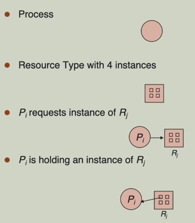
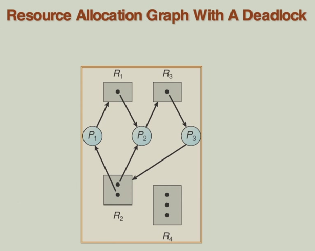
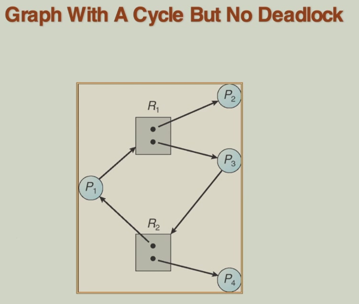
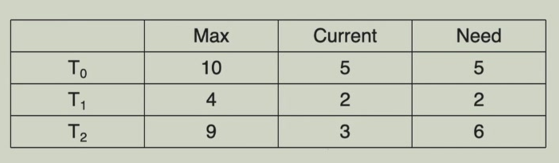
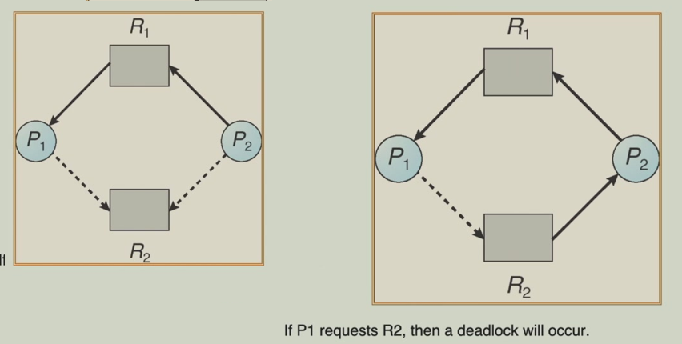
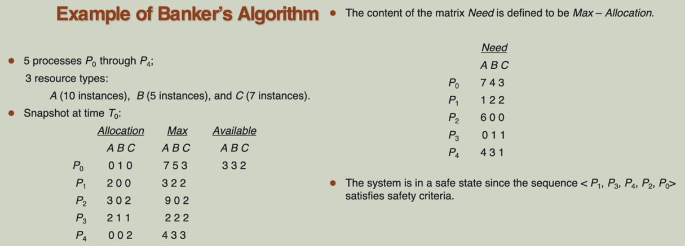
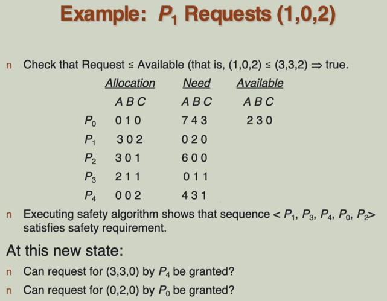
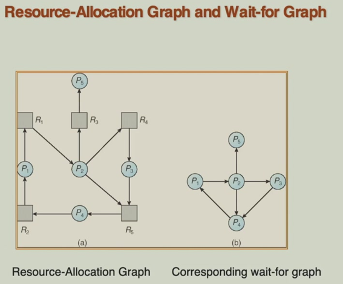
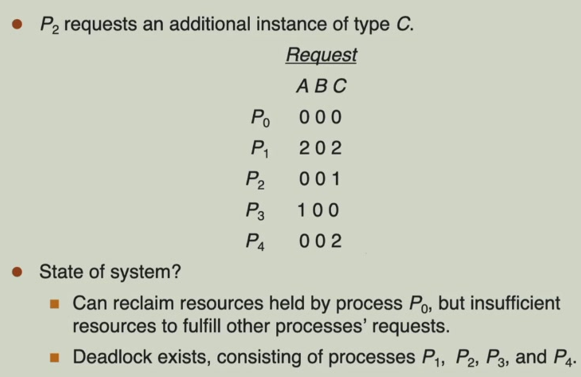

# 7 Deadlocks

!!! tip "说明"

    本文档正在更新中……

!!! info "说明"

    本文档仅涉及部分内容，仅可用于复习重点知识

## 1 The Deadlock Problem

死锁是指两个或多个进程在执行过程中，因争夺资源而造成的一种互相等待的现象。这些进程都无法继续执行，因为它们需要的资源被另一个等待中的进程持有

## 2 Deadlock Characterization

如果以下四个条件同时成立，就可能出现死锁：

1. mutual exclusion：某些资源本质上是独享的，不能同时被多个进程共享
2. hold and wait：进程已经持有了部分资源，但在等待其他资源时不会释放已持有的资源
3. no preemption：进程已获得的资源不能被强制剥夺，只能由进程主动释放
4. circular wait：存在一个进程资源的循环等待链，每个进程都在等待下一个进程持有的资源

这四个条件是死锁发生的必要条件：如果发生死锁，这四个条件一定同时成立；如果这四个条件同时成立，可能会发生死锁（但不一定立即发生）；要预防死锁，只需破坏其中至少一个条件即可

## 3 System Model

系统中有多种资源类型，用 $R_1, R_2, \cdots, R_m$ 表示。每个资源类型可能有多个相同的实体，称为实例，$W_i$ 表示资源类型 $R_i$ 的可用实例数量

每个进程在使用任何资源时都遵循标准的三步操作：

1. request：进程请求获取资源实例
2. use：进程在获得资源后执行其任务
3. release：进程完成任务后主动归还资源

resource-allocation graph 包含一组顶点 $V$ 和一组边 $E$。$V$ 被划分为两种类型：$P$ 包含系统中所有进程的集合，$R$ 包含系统中所有资源类型的集合

- request edge：有向边 $P_i \rightarrow R_j$，进程正在请求一个资源实例
- assignment：有向边 $R_j \rightarrow P_i$，一个资源实例已经分配给了进程

<figure markdown="span">
    { width="500" }
</figure>

<figure markdown="span">
    { width="600" }
</figure>

<figure markdown="span">
    { width="600" }
</figure>

1. 如果资源分配图中没有任何循环（环），那么系统一定没有发生死锁
2. 如果资源分配图中有环

    1. 如果每类资源只有一个实例，则一定发生死锁
    2. 如果至少某类资源有多个实例，则可能发生死锁

## 4 Methods for Handling Deadlocks

操作系统处理死锁问题的方法：

1. 死锁预防：通过破坏死锁发生的四个必要条件之一来确保系统永远不会进入死锁状态
2. 死锁检测与恢复：允许死锁发生，但能够检测到死锁并恢复系统
3. 鸵鸟算法：忽略死锁问题，假设死锁不会发生或极少发生。被大多数通用操作系统（如 Linux 和 Windows）采用。因为死锁在实际系统中相对罕见，预防和检测的代价可能超过死锁发生的代价，通过重启系统等简单方式就能解决偶尔发生的死锁（例如通过任务管理器终止进程）

### 4.1 Deadlock Prevention

破坏死锁发生的四个必要条件之一

1. mutual exclusion：尽可能使用可共享资源来避免互斥。对于只读文件等可共享资源，多个进程可以同时访问，无需互斥；但对于打印机等不可共享资源，互斥是固有的，无法破坏此条件。此条件通常难以完全破坏，因此重点放在其他条件上
2. hold and wait：确保进程在请求资源时不持有任何其他资源。存在的问题：资源利用率低（资源可能被提前占用但长时间未使用）；可能饥饿（需要大量资源的进程可能永远无法获得所有资源）；不切实际（进程通常无法预知所有需要的资源）

    1. 一次性分配：进程在开始执行前必须申请并获得所有需要的资源。缺点是资源可能长时间闲置，利用率低
    2. 动态请求：进程只有在不持有任何资源时才能请求新资源，需要额外资源时，必须先释放当前持有的所有资源，再重新申请。缺点是资源频繁释放和重新申请，效率低下

3. no preemption：当进程请求新资源无法立即获得时，系统会强制释放该进程当前持有的所有资源。这些被抢占的资源会被记录，该进程需要等待重新获得所有资源（包括原有的和新请求的）。缺点是实现复杂，代价高昂；可能导致进程重复执行部分工作，降低系统效率
4. circular wait：为所有资源类型建立全局顺序（全序关系），要求所有进程必须按编号递增顺序申请资源。为每类资源分配唯一编号，进程必须先申请编号小的资源，再申请编号大的资源，如果需要先申请高编号资源，必须先释放所有低编号资源。优点在于相比其他方法更实用，系统开销较小

### 4.2 Deadlock Avoidance

死锁避免不像预防那样严格限制资源请求方式，而是通过动态决策来避免系统进入不安全状态

1. 先验信息要求：系统需要预先知道每个进程对各类资源的最大需求，这是算法进行决策的基础信息
2. 动态检查机制：在每次资源分配前，算法会检查分配后的系统状态是否安全，只允许不会导致死锁的资源分配，通过避免循环等待条件来预防死锁
3. 资源分配状态：包括可用资源（当前系统中可用的各类资源数量）、已分配资源（每个进程当前持有的资源数量）、最大需求（每个进程最终可能需要的最大资源数量）

工作原理：当进程请求资源时，系统会检查如果满足该请求，系统是否会保持在安全状态。安全状态意味着存在某种进程执行顺序，使得所有进程都能顺利完成。只有在安全的情况下才批准资源分配

!!! tip "与 deadlock prevention 的区别"

    - 死锁预防：通过限制资源请求方式（静态）
    - 死锁避免：通过动态分析资源分配状态（动态）

#### 4.2.1 Safe State

安全状态是指系统能够按照某种顺序（称为安全序列）为所有进程分配资源，确保所有进程都能顺利完成

安全序列的条件：对于安全序列 $<P_1, P_2, \cdots, P_n>$ 中的每个进程 $P_i$，$P_i$ 的剩余资源需求 ≤ 当前可用资源 + 前面所有进程 $P_j\ (j<i)$ 释放的资源。这意味着每个进程都能按顺序获得所需资源并完成执行

!!! question "下面的系统是否处于安全状态"

    一共有 12 个资源实例，当前可用的有 3 个

    <figure markdown="span">
        { width="600" }
    </figure>

    1. 首先执行 T1：完成后释放 2 个，现在可用的有 5 个
    2. 接下来就可以执行 T0：完成后释放 5 个，可用的有 10 个
    3. 最后可以执行 T2

    因此，确实处于安全状态

    下面的这个系统不处于安全状态

    <figure markdown="span">
        { width="600" }
    </figure>

1. 如果系统处于安全状态，那么没有死锁
2. 如果系统不处于安全状态，那么可能死锁

而死锁避免的核心目标就是始终保持安全状态。在每次资源分配时进行检查，只批准那些分配后系统仍处于安全状态的请求，通过这种方式，系统永远保持在安全区域内

#### 4.2.2 Resource-Allocation Graph

适用条件：每类资源只有一个实例

Claim edge（声明边）：虚线箭头 $P_i \rightarrow R_j$，表示进程未来可能请求资源

边的状态转换：

1. 初始状态：声明边（虚线）。表示进程可能在未来请求该资源
2. 请求资源：声明边 → 请求边（实线）。进程实际发出资源请求
3. 分配资源：请求边 → 分配边（实线）。系统将资源分配给进程
4. 释放资源：分配边 → 声明边（虚线）。进程完成任务后释放资源，回到初始状态

进程在开始执行前必须预先声明所有可能需要的资源类型，这是该算法有效的前提条件

在分配资源前，系统检查转换后图中是否存在环，如果分配会导致环出现，则拒绝分配（即使资源可用），通过这种方式确保系统永远不会进入不安全状态

<figure markdown="span">
    { width="600" }
</figure>

#### 4.2.3 Banker's Algorithm

适用条件：每类资源有多个实例

算法前提假设：

1. 资源多实例：每类资源有多个相同实例
2. 预先声明：进程开始前必须声明其最大资源需求
3. 等待机制：请求不被立即满足时需要等待
4. 有限占用：进程完成后必须在有限时间内释放所有资源

核心数据结构：

1. available（可用资源向量）：记录当前可用的各资源数量。维度：m（资源类型数）。`Available[1] = 3` 表示资源 R₁ 有 3 个可用实例
2. max（最大需求矩阵）：记录每个进程声明的最大资源需求。维度：n × m（进程数 × 资源类型数）。`Max[2, 3] = 5` 表示进程 P₂ 最多需要 5 个 R₃ 资源
3. allocation（分配矩阵）：记录当前已分配给各进程的资源数量。维度：n × m。`Allocation[0, 2] = 1` 表示进程 P₀ 当前持有 1 个 R₂ 资源
4. need（需求矩阵）：记录每个进程尚需的资源数量。维度：n × m。`Need = Max - Allocation`

!!! tip "Safety Algorithm"

    用于判断系统是否处于安全状态

    1. work：长度为 m，算法执行过程中表示可用的资源数量，初始值为 Available
    2. finish：长度为 n 的布尔向量，表示每个进程是否已安全地完成

    算法步骤：

    1. 初始化：将 Work 向量设置为当前系统的可用资源 Available。将 Finish 向量的所有初始值设为 false，表示所有进程最初都未完成
    2. 寻找可执行的进程：在所有尚未完成（`Finish[i] == false`）的进程中，寻找这样一个进程 $P_i$：它尚需的资源（Need_i）不超过当前系统可用的资源（Work）。即 `Need_i <= Work`。如果找不到这样的进程，则跳转到步骤 4
    3. 模拟进程执行与资源释放：假设进程 $P_i$ 被选中并运行结束。它会释放其持有的所有资源。因此，系统可用资源更新为：`Work = Work + Allocation_i`，将进程 $P_i$ 标记为已完成：`Finish[i] = true`。返回步骤 2，继续寻找下一个可以执行的进程
    4. 安全状态判断：检查 Finish 向量。如果所有进程的 `Finish[i]` 都为 `true`，意味着存在一个序列（即安全序列）使得所有进程都能按此顺序成功执行完毕而不会发生死锁，因此系统处于安全状态。如果存在任何一个进程的 `Finish[i]` 为 false，则说明系统处于不安全状态（可能发生死锁）

!!! tip "Resource-Request Algorithm for Process Pi"

    进程 $P_i$ 的资源请求算法

    `request_i`：进程 $P_i$ 本次请求的资源向量

    算法步骤：

    1. 合法性检查：检查进程的请求是否超过了它最初声明的最大需求，即 `Request_i <= Need_i`。如果合法，继续；否则报错
    2. 可用性检查：检查系统当前是否有足够的可用资源来立即满足此请求，即 `Request_i <= Available`。如果资源足够，继续；否则，进程 $P_i$ 等待
    3. 模拟分配：系统假设性地将资源分配给进程 $P_i$，这会临时改变系统的状态：

        1. `Available = Available - Request_i`：可用资源减少
        2. `Allocation_i = Allocation_i + Request_i`：进程的已分配资源增加
        3. `Need_i = Need_i - Request_i`：进程的剩余需求减少

    4. 安全性检查：在模拟分配后的新状态下，调用安全算法来判断系统是否仍处于安全状态。如果安全：意味着即使分配了这些资源，系统仍然存在一个安全序列，所有进程都能顺利完成。因此，模拟分配变为实际分配，资源正式分配给 $P_i$。果不安全：意味着此次分配可能导致系统进入一个未来可能死锁的状态。因此，分配不会被执行。系统将回滚到步骤 3 之前的状态（恢复 `Available`, `Allocation_i`, `Need_i` 的值），并且进程 $P_i$ 必须等待

<figure markdown="span">
    { width="600" }
</figure>

<figure markdown="span">
    { width="600" }
</figure>

### 4.3 Deadlock Detection

允许系统进入死锁状态。系统会周期性地调用一个算法，来检查系统中是否存在死锁。一旦检测算法确认死锁已经发生，恢复机制就会被触发，以打破死锁，使系统恢复正常运行

#### 4.3.1 Single Instance of Each Resource Type

适用条件：每种资源类型只有一个实例

wait-for graph（等待图）：这是一种用于死锁检测的有向图

1. 节点：代表系统中的进程
2. 边：如果进程 $P_i$ 正在等待一个当前被进程 $P_j$ 占用的资源，那么就存在一条从 $P_i$ 指向 $P_j$ 的有向边

> 在这种（单实例资源）情况下，资源分配图可以简化为等待图，而不会丢失任何关于死锁的信息

检测算法：寻找环。在等待图中，一个环（或循环）的存在是死锁的充分必要条件。系统会周期性地调用一个图论算法来检查等待图中是否存在环。算法复杂度为 $O(n^2)$

<figure markdown="span">
    { width="600" }
</figure>

#### 4.3.2 Several Instances of a Resource Type

适用条件：一种资源类型有多个实例

1. available：长度为 m，表示每种类型资源的可用数量
2. allocation：n x m，定义了当前分配给每个进程的各类资源数量
3. request：n x m，表示每个进程的当前请求。如果 `request[i, j] = k`，那么进程 $P_i$ 正在请求 k 个更多的资源类型 $R_j$ 的实例

检测算法：

1. 初始化：

    1. `Work = Available`：将 Work 向量设置为系统当前的可用资源。这表示算法开始时可供分配的资源
    2. 对于每个进程 $P_i$，设置 `Finish[i]`：

        1. 如果 `Allocation_i ≠ 0`，则 `Finish[i] = false`。因为该进程持有资源，如果它无法完成，它可能就是死锁的一部分，或者它持有的资源可能需要被用来满足其他进程以打破死锁链。因此，我们最初假设它不能完成
        2. 如果 `Allocation_i = 0`，则 `Finish[i] = true`

2. 寻找可运行的进程：在所有尚未被标记为可完成（`Finish[i] == false`）的进程中，寻找一个进程 $P_i$，其当前请求（`Request_i`）可以被当前可用资源（`Work`）所满足，即 `Request_i ≤ Work`。如果找不到这样的进程，意味着剩下的所有未完成的进程都在等待一些当前无法满足的资源，此时跳转到步骤 4
3. 模拟进程完成与资源回收：当在步骤 2 中找到符合条件的进程 $P_i$ 后，算法执行：

    1. `Work = Work + Allocation_i`：这模拟了进程 $P_i$ 运行完成并释放其占有的所有资源
    2. `Finish[i] = true`：将进程 $P_i$ 标记为可完成
    3. 然后，算法返回步骤 2

4. 死锁判断：当算法在步骤 2 中再也找不到任何一个满足条件的进程 $P_i$ 时，进入此步骤。检查 Finish 向量。如果存在任何一个进程 $P_i$ 满足 `Finish[i] == false`：这意味着该进程无法被纳入上述的模拟完成序列中。它之所以无法完成，是因为它请求的资源无法被满足，而它所等待的资源很可能正被另一个同样无法完成的进程持有。这些 `Finish[i] == false` 的进程集合，就是处于死锁状态的进程。因此，系统被判定为处于死锁状态。如果所有进程的 `Finish[i] == true`：这意味着算法成功地为所有进程找到了一个模拟完成的序列。在这种情况下，系统当前没有发生死锁

<figure markdown="span">
    { width="600" }
</figure>

<figure markdown="span">
    { width="600" }
</figure>

如果死锁非常频繁：需要更频繁地调用检测算法，以便及时发现并恢复，减少其对系统性能的长期影响。如果死锁极为罕见：可以降低调用频率，以减少算法本身带来的运行开销

每次检测到死锁后，恢复操作（如终止进程或资源抢占）会带来显著的代价（丢失计算进度、影响用户体验等）。死锁通常表现为资源分配图中的一个或多个环。每个独立的环代表一个死锁。为了打破一个环，至少需要终止或回滚该环中的一个进程

如果预计死锁会涉及大量进程（即存在多个环或大环），导致恢复代价高昂，那么更频繁的检测可能是有益的，目的是在死锁规模扩大、涉及更多进程之前就发现它。反之，如果死锁通常只涉及少数进程，则可以适当降低检测频率

如果随意调用检测算法，可能会在死锁已经发生并持续一段时间后才发现。在这段时间内，多个独立的死锁环可能已经形成，或者一个初始的死锁环可能吸引了更多进程加入，变得更大更复杂。当资源图中存在多个环时，算法只能告诉你当前存在死锁以及哪些进程被卷入，但无法判断哪个进程或哪个初始的环是死锁的始作俑者。这给恢复过程带来了挑战

#### 4.3.3 Recovery from Deadlock

##### Process Termination

当通过死锁检测算法发现系统存在死锁后，一种主要的恢复方法是进程终止。这种方法通过强制结束进程来打破死锁所需的循环等待条件

两种终止策略：

1. 终止所有死锁进程：一次性终止所有被检测算法标记为处于死锁状态的进程。简单、直接、保证能打破死锁。但代价巨大。所有这些进程已经完成的计算工作都将丢失，可能导致巨大的计算资源和时间浪费
2. 一次终止一个进程：选择一个死锁进程将其终止，然后重新运行死锁检测算法，检查死锁是否被打破。如果没有，再选择另一个进程终止，如此反复，直到死锁解除。更为保守，目标是只终止最少数量的进程来解决问题，从而最小化恢复代价。但恢复过程耗时较长，因为每次终止后都需要调用检测算法

选择终止进程的顺序（代价最小化）：由于目标是尽量减少损失，系统需要智能地选择牺牲哪个进程。决策时应考虑以下因素，即选择标准：

1. 进程的优先级：优先终止低优先级的进程
2. 进程的执行状态：终止一个已经运行了很长时间的进程代价很高。如果某个进程即将完成，终止它可能不划算
3. 资源占用情况：终止一个已经消耗了大量资源的进程可能代价高昂。如果某个进程只需要很少资源就能完成，保留它可能更好
4. 终止影响范围：理想情况下，终止一个进程就能打破所有死锁环。应优先选择这样的进程
5. 进程类型：终止一个交互式用户进程比终止一个后台批处理作业带来的负面影响通常更大

##### Resource Preemption

这种方法不直接终止进程，而是通过强制回收已分配的资源来打破死锁。从一个或多个死锁进程中抢占（即强行收回）它们已占有的部分资源，并将这些资源分配给其他死锁进程，从而打破循环等待链

选择 victim：选择一个进程作为牺牲品，抢占其资源。选择的标准是最小化代价

rollback：当一个进程的资源被强行抢占后，它可能处于一个不一致的中间状态（例如，刚修改了一半数据）。它不能简单地继续运行。必须将该进程回滚到某个预先定义的安全状态

starvation：如果代价最小化算法总是基于相同的标准（例如，总是选择占用资源最少的进程），那么同一个进程可能会反复地被选为牺牲品。这个进程虽然没被终止，但永远无法完成其工作，这种现象称为饥饿。为了防止饥饿，在选择牺牲品时，必须将进程被回滚的次数作为一个重要的代价因子纳入考虑。一个进程被回滚的次数越多，再次选择它作为牺牲品的代价就应该被计算得越大，从而降低其被选中的概率
