# 8 Main Memory

!!! tip "说明"

    本文档正在更新中……

!!! info "说明"

    本文档仅涉及部分内容，仅可用于复习重点知识

## 1 Background

程序（通常存储在磁盘等二级存储中）必须被加载到主内存中，并由操作系统为其创建一个进程上下文，才能被 CPU 执行。CPU 只能直接与主内存和其内部的寄存器进行数据交换。其他存储设备（如磁盘）的数据需要通过主内存中转

- 寄存器：位于 CPU 内部，访问速度最快（一个时钟周期或更短）
- 主内存：访问速度比寄存器慢得多，可能需要数十甚至数百个时钟周期。这造成了 CPU 速度和内存速度之间的鸿沟

为了弥补 CPU 和主内存之间的速度差距，在它们之间引入了高速缓存。缓存保存了最近使用的内存数据的副本，当 CPU 需要数据时，会先在高速缓存中查找，如果找到就可以快速获取，从而显著提高系统性能

在多道程序操作系统中，多个进程同时存在于内存中。为了防止一个进程意外或恶意地修改另一个进程或操作系统的内存空间，必须要有内存保护机制，以确保每个进程都能正确、安全地运行

<figure markdown="span">
    { width="600" }
</figure>

Memory Wall：处理器（CPU）性能与动态随机存取存储器（DRAM）性能之间日益扩大的速度差距

<figure markdown="span">
    { width="600" }
</figure>

!!! tip "base and limit registers"

    基址-界限寄存器保护机制：用于在多个进程同时运行时，保护进程彼此之间以及保护操作系统免受进程的干扰。它为每个进程提供一个独立的、受保护的逻辑地址空间

    - 基址寄存器：存放某个进程在物理内存中的起始地址
    - 界限寄存器：存放该进程逻辑地址空间的最大长度

    当 CPU 为一个用户进程生成一个内存地址（逻辑地址）时，在将该地址发送到内存总线之前，硬件会自动将逻辑地址与基址寄存器的值相加，得到物理地址。同时，硬件会检查这个逻辑地址是否小于界限寄存器的值。如果地址 >= 界限值，则会触发一个陷阱错误（通常是由于地址越界），操作系统会终止该进程

    <figure markdown="span">
        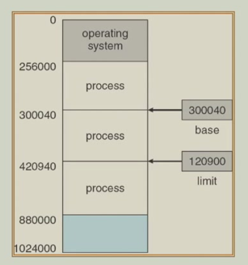{ width="600" }
    </figure>

程序中的内存地址在从源代码到最终可执行文件的生成过程中，经历的三个不同表示阶段和绑定过程

1. symbolic address（符号地址）：存在于程序员编写的源代码中。地址使用易于人类理解和记忆的符号（标识符）表示，例如变量名、函数名等
2. relocatable address（可重定位地址）：由编译器（或汇编器）生成，存在于目标模块中。编译器将符号地址转换成一个相对于该目标模块起始地址的偏移量（例如，本模块内偏移 14 字节的位置）。这个步骤称为 **编译时绑定**
3. absolute address（绝对地址）：在程序被加载到内存准备执行之前形成，存在于最终的可执行文件或内存映像中。地址是具体的、最终的物理内存地址。这个转换由链接器（在链接多个目标模块时，进行 **链接时绑定**）或加载器（在将程序放入内存时，进行 **加载时绑定**）完成。它们将可重定位地址与已知的基址相结合，计算出绝对的物理地址。地址直接对应物理内存的一个单元

!!! tip "compiler, linker and loader"

    加载器：执行装载工作，是程序运行的最后一个步骤

    1. 输入：由链接器生成的可执行程序文件
    2. 输出：将程序置于内存中运行的进程
    3. 主要任务：将可执行文件中的代码和数据段从磁盘读取到内存中。为程序分配运行时所需的内存空间。根据可执行文件中的信息，完成最后的地址重定位。跳转到程序的入口点，开始执行程序

    <figure markdown="span">
        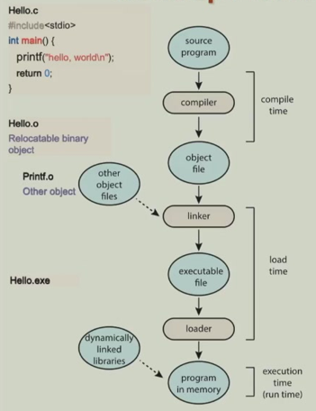{ width="600" }
    </figure>

程序中的指令和数据在哪个时间点被分配（绑定）到具体的物理内存地址：

1. compile time（编译时期）：在程序编译期间。编译器必须提前知道进程将在内存中的哪个绝对地址开始驻留。编译器直接生成使用绝对物理地址的代码（绝对代码）。缺乏灵活性，如果程序的起始地址需要改变，必须重新编译整个程序
2. load time（装入时刻绑定）：在程序被加载到内存以准备执行时。编译时不知道程序将位于何处。编译器生成可重定位代码（其中的地址是相对于程序起始地址的偏移量）。当加载器将程序读入内存时，它根据当时分配给程序的实际物理起始地址，计算出所有地址的最终值。一旦加载完成，程序在内存中的位置就固定了。如果程序需要被换出后再换入，它通常必须回到同一个内存位置。比编译时绑定更灵活，因为无需重新编译，只需重新加载
3. execution time（执行时刻）：在程序正在运行时。进程在执行过程中可以被移动到不同的内存区域。这需要硬件支持，通常是内存管理单元（MMU），其核心组件就是 **基址和界限寄存器**。进程生成的地址是逻辑地址，CPU 在访问内存的每一个指令周期中，硬件 MMU 都会自动将逻辑地址与基址寄存器的值相加，转换为物理地址，如果进程被移动，操作系统只需更新该进程的基址寄存器即可。进程本身无需感知，也无需重新编译或重新加载。提供了最大的灵活性。这是现代通用操作系统（如 Windows, Linux, macOS）实现虚拟内存、进程切换和多道程序设计的基础

!!! tip "logical and physical address space"

    1. 逻辑地址空间：这是从正在运行的进程（CPU）视角看到的地址集合。进程认为它独占了从 0 开始一直到某个最大值的连续内存空间。这个地址是虚拟的，因为它不一定对应真实的物理内存位置。逻辑地址也称为虚拟地址
    2. 物理地址空间：这是物理内存硬件（RAM） 的真实地址集合。每一个物理地址对应一个实际的内存存储单元

    在 compile time 和 load time 绑定中：程序知道或者一旦确定就固定了自己在物理内存中的位置。因此，CPU 生成的地址（逻辑地址）直接就是内存单元要使用的地址（物理地址）。两者是相同的

    在 execution time 绑定中：CPU 生成的逻辑地址和最终送达内存总线的物理地址是不同的

    <figure markdown="span">
        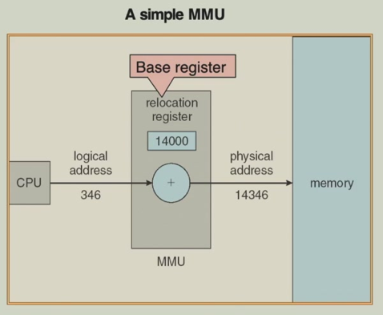{ width="600" }
    </figure>

!!! tip "MMU"

    **memory management unit**：核心功能是进行地址转换：将程序生成的虚拟地址（或逻辑地址）动态地映射或转换为内存硬件所使用的物理地址
    
    MMU 的工作机制（以基址寄存器方案为例）：

    1. relocation register（重定位寄存器）：这是 MMU 中的一个特殊寄存器，通常被称为 **基址寄存器**。当一个进程被调度执行时，操作系统会把这个进程在物理内存中的起始地址加载到这个寄存器中
    2. 地址转换过程：

        1. CPU 生成逻辑地址：用户程序在执行时，所有内存访问指令产生的都是逻辑地址
        2. MMU 介入：这个逻辑地址不会直接发送到内存总线，而是先被送到 MMU
        3. 加上基址：MMU 将重定位寄存器（基址寄存器）中的值与该逻辑地址相加，得到最终的物理地址
        4. 访问内存：计算出的物理地址被发送到内存总线，从而访问正确的物理内存单元

    用户程序完全在它自己的逻辑地址空间中运行，它认为内存就是从 0 开始的一片连续空间。程序无法感知也无法直接访问物理地址。它生成的所有地址都经过 MMU 的自动转换

!!! tip "dynamic loading"

    将一个程序（尤其是大型程序）的各个组成部分（如子程序、函数、模块）不一次性全部加载到内存中。而是等到某个部分确实被调用到时，才将其从磁盘加载到内存中

    1. 提高内存利用率：内存中只存放当前正在使用或经常使用的代码，避免了不常用代码长期占用宝贵的内存空间
    2. 适用于大型程序：特别有利于那些包含大量用于处理错误、特殊情况或高级功能的代码，但这些情况很少发生的程序

    动态加载主要由应用程序员通过程序设计来负责实现，例如在代码中显式地检查和控制模块的加载。它不需要操作系统提供直接的特殊硬件或系统调用支持。操作系统只需要提供基本的文件读取和内存分配功能即可

!!! tip "dynamic linking"

    将程序与它所使用的库（如系统函数库）的链接过程，从传统的编译/链接时推迟到程序运行时

    在编译和静态链接时，链接器不会将库函数的代码拷贝到最终的可执行文件中。相反，它只在可执行文件中放入一个 stub（存根）。存根是一小段代码，充当一个占位符

    当程序第一次调用某个库函数时，程序执行到对应的存根。存根负责定位所需的库函数。它通常会请求操作系统的帮助。操作系统检查该库是否已经存在于内存中。找到函数在内存中的实际地址后，存根会用这个地址替换自己（或更新程序的地址表）。然后跳转到该库函数执行。此后，程序对该函数的所有后续调用都会直接跳转到内存中的库代码，不再经过存根

    1. 节省内存：多个程序可以共享同一份物理内存中的库代码（因此得名共享库）
    2. 减小可执行文件体积
    3. 便于库更新：当库升级（如修复漏洞）时，只需替换系统上的共享库文件即可。所有使用该库的程序在下次运行时会自动使用新版本，无需重新编译或重新链接这些程序

## 2 Contiguous Memory Allocation

物理内存被划分为两个主要部分：

1. 操作系统分区：位于内存的低地址区域（例如从地址 0 开始）。这里存放操作系统内核代码和关键数据（如中断向量表）
2. 用户进程分区：位于内存的高地址区域。所有用户进程都被加载到这个连续的区域内

保护机制：

1. relocation register（重定位寄存器，基址寄存器）：存放的是当前正在运行的进程在物理内存中的起始地址
2. limit register（界限寄存器）：存放的是当前进程的最大逻辑地址（即进程的大小）
3. MMU：动态映射逻辑地址

<figure markdown="span">
    { width="600" }
</figure>

!!! tip "multiple partition allocation"

    多分区分配方法

    hole（空闲块）：内存中未被分配、可供使用的连续内存块。随着进程的创建与终止，这些空闲块会分散在内存的各个地方，并且它们的大小各不相同

    当一个新的进程需要被加载到内存时，操作系统会在其维护的空闲块列表中，寻找一个足够大的空闲块来容纳该进程。找到后，操作系统从该空闲块中划出进程所需大小的区域进行分配，剩余的部分会形成一个新的、更小的空闲块

    操作系统需要动态地维护两张关键列表：

    1. 已分配分区列表：记录哪些内存区域已经被分配，以及分配给哪个进程
    2. 空闲分区列表：记录所有当前可用的空闲块及其起始地址和大小

    <figure markdown="span">
        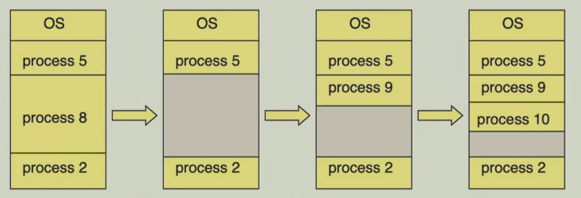{ width="600" }
    </figure>

    当一个新进程请求大小为 n 的内存时，操作系统需要决定从哪个空闲块中进行分配

    1. first-fit：从空闲块列表的起始位置开始顺序查找，第一个遇到的大小足够的空闲块就被选中用于分配
    2. best-fit：遍历整个空闲块列表，找到其中大小 ≥ n 且最小的那个空闲块进行分配
    3. worst-fit：遍历整个空闲块列表，找到其中最大的空闲块进行分配

    首次适应和最佳适应在整体性能（综合考虑分配速度和内存利用率）上通常优于最差适应。首次适应的优势在于速度。最佳适应的优势在于在某些情况下可能具有较高的内存利用率

## 3 Paging

!!! tip "fragmentation"

    碎片化：指内存空间中存在一些无法被有效利用的小块、不连续的空闲内存

    1. external fragmentation：内存中有足够多的空闲空间来加载一个进程，但这些空闲空间被分散成多个小块，没有一块足够大的连续空间来满足请求
    2. internal fragmentation：分配给一个进程的内存块大小，比这个进程实际请求的内存要大。这多出来的、在分配块内部但未被进程使用的空间就是内部碎片

    解决外部碎片的方法：
    
    1. compaction（压缩）：移动内存中已分配的区域，将所有空闲内存合并成一个大的连续块。必须支持动态重定位，即在程序运行时能更新其物理内存地址的引用。如果一个进程正在进行 I/O 操作，其数据在内存中的位置被移动会导致问题。解决方案包括：在 I/O 期间将进程锁定在内存中不动，或者让 I/O 只通过操作系统的缓冲区进行，不与进程的物理内存直接交互
    2. non-contiguous allocation（非连续分配）：它允许一个进程的内存空间不必占据连续的物理地址。这样，进程可以被分割成多个小块，分散在内存的不同位置，从而更灵活地利用内存空间，避免外部碎片。现代操作系统（如 Linux, Windows）普遍采用这种技术，即分页和分段机制

分页是一种非连续内存分配方案，旨在解决外部碎片问题。它允许一个进程的物理内存分散在不连续的页框中

- page：将进程的逻辑地址空间（程序员看到的地址空间）划分成固定大小的块
- frame：将物理内存（实际的硬件内存）划分成与页大小完全相同的固定大小的块

> page 和 frame 大小必须相同，这确保了任何一页都可以放入任何一个可用的页框中

工作原理：

1. 分配：当一个需要 n 页内存的进程要运行时，操作系统就在物理内存中寻找 n 个空闲的 frame（无论这些 frame 在物理上是否连续），然后将进程的每一 page 数据分别加载到一个 frame 里
2. 地址转换：由于进程的物理内存是不连续的，操作系统需要为每个进程维护一个称为 page table 的数据结构

    - page table：将进程的逻辑页码映射到物理内存的 frame 号。当 CPU 生成一个逻辑地址时，内存管理单元（MMU）会查询页表，找到该逻辑地址所在的页对应的物理页框，从而计算出实际的物理地址

CPU 产生的逻辑地址是一个二进制数，它被自动地划分为两个部分：

1. page number：地址的高位部分。它不直接表示地址，而是用作在页表中查找的索引
2. page offset：地址的低位部分。它表示目标数据在一个页内部的具体位置

<figure markdown="span">
    { width="400" }
</figure>

1. 逻辑地址空间 $2^m$：表示 CPU 可以寻址的总内存范围。`m` 是逻辑地址的总位数
2. 页大小 $2^n$：表示每个页包含的字节数。`n` 是页内偏移量 d 所需的位数
3. 页码 p 的位数：是总地址位数 `m` 减去偏移量位数 `n`，即 `m-n` 位。这决定了页表中有多少表项（即 $2^{m-n}$ 个页）

<figure markdown="span">
    { width="600" }
</figure>

<figure markdown="span">
    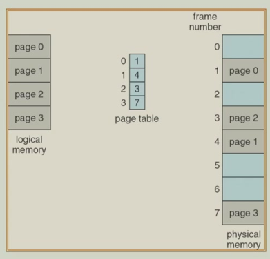{ width="600" }
</figure>

<figure markdown="span">
    { width="600" }
</figure>

<figure markdown="span">
    { width="600" }
</figure>

### 3.1 TLB

page table 存储在主内存中

1. page-table base register (PTBR)：一个专用的 CPU 寄存器，其中存放着当前运行进程的页表在物理内存中的起始地址
2. page-table length register (PTLR)：另一个专用寄存器，指示了页表的大小，用于进行地址越界检查，防止进程访问不属于它的内存区域

在这种基础设计下，CPU 每次要访问一个内存地址，都需要两次内存访问：第一次是根据 PTBR 找到页表，再根据虚拟页号在页表中查找对应的物理页框号；第二次是利用得到的物理地址（物理页框号 + 页内偏移）去访问实际的数据或指令

这导致内存访问速度减半，为了解决这个性能问题，引入了 associative memory 或 translation look-aside buffers（TLBs），TLB 是集成在 CPU 内部的一种高速缓存，专门用于缓存最近使用过的虚拟页到物理页框的映射关系

当 CPU 需要转换地址时，它首先在极快的 TLB 中查找。如果找到（称为 TLB 命中），则无需访问内存中的页表，直接获得物理地址，只需一次内存访问即可获取数据。只有在 TLB 中找不到（称为 TLB 未命中）时，才需要去访问主内存中的页表，并随后更新 TLB。由于程序通常具有局部性原理，TLB 的命中率很高，从而极大地提升了地址转换的效率

在多进程系统中，每个进程都有自己的页表。为了确保进程间隔离，需要防止一个进程误用或恶意使用另一个进程的 TLB 条目。address-space identifiers (ASIDs) 被添加到 TLB 的每个条目中。ASID 唯一地标识了每个进程。当进行地址转换时，硬件不仅会比较虚拟页号，还会比较当前运行进程的 ASID 与 TLB 条目中存储的 ASID 是否匹配。只有两者都匹配，才认为该 TLB 条目有效。这确保了进程只能访问属于自己的地址空间，提供了硬件级别的内存保护

<figure markdown="span">
    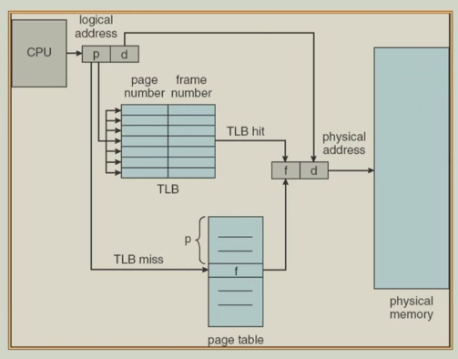{ width="600" }
</figure>

!!! tip "effective access time"

    有效访问时间： 在引入了 TLB 之后，系统平均每次内存访问所需要的时间。它综合考虑了 TLB 命中和未命中两种情况

    1. $\epsilon$：在 TLB 中进行一次查找所需要的时间。由于 TLB 是高速硬件，这个时间非常短，通常远小于内存访问时间
    2. 内存周期时间：这是访问一次主内存所需要的时间，作为计算的时间基准单位
    3. hit ratio $\alpha$：表示 CPU 要转换的地址在 TLB 中就能找到的概率（即 TLB 命中）。命中率与 TLB 的大小（容量）有关，TLB 容量越大，能缓存的页表项越多，命中率通常就越高

    TLB 命中：1 次 TLB 查找时间 + 1 次内存访问时间。$(1 + \epsilon)\alpha$

    TLB 未命中：1 次 TLB 查找时间 + 2 次内存访问时间。$(2 + \epsilon)(1 - \alpha)$

    将两种情况加权平均，就得到了有效访问时间 $EAT = (1 + \epsilon)\alpha + (2 + \epsilon)(1 - \alpha) = 2 + \epsilon - \alpha$

### 3.2 Memory Protection

protection bit：保护位通常与页表项中的每个页相关联。这些位定义了对于该页所对应的物理内存帧的访问权限，例如：读、写、执行

每个页表项中都包含一个特殊的 valid-invalid 位

1. valid：

    1. 这个页表项所映射的虚拟页是当前进程逻辑地址空间的一部分，是进程合法拥有的
    2. 该页表项内容（即物理页框号）是有效的，可以用于地址转换

2. invalid：

    1. 该虚拟页不属于进程的地址空间：进程试图访问一个它根本没有分配到的内存区域
    2. 该页目前在磁盘上（交换空间）：虽然该页属于进程，但它当前不在物理内存中。此时，这个无效位会触发一个缺页异常，操作系统会介入，负责将所需的页从磁盘加载到物理内存中，然后将页表项标记为有效，最后让进程重新执行导致异常的指令

<figure markdown="span">
    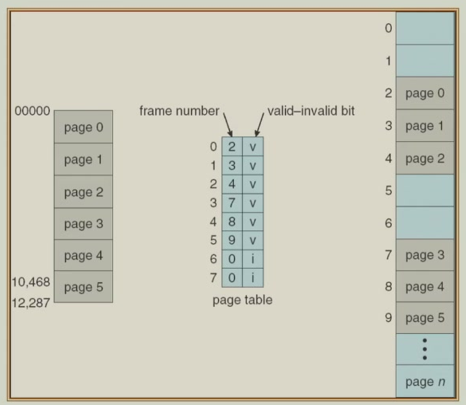{ width="600" }
</figure>

### 3.3 Shared Pages

共享页允许多个进程共同访问同一块物理内存区域（即相同的页框），而不是为每个进程在内存中保留独立的副本

shared code：可以被多个进程共同使用的代码，例如常见的系统工具或库。这些代码通常是只读的和可重入的。实现方式是在物理内存中只保留一份该代码的副本。然后，在不同进程的页表中，将映射到该代码区域的页表项都指向相同的物理页框。为了使共享代码能够正确工作，该代码在每个共享它的进程的逻辑地址空间中所处的虚拟地址必须是相同的

private code and data：每个进程所独有的部分，包括其自身的数据以及可能修改的代码。实现方式是操作系统为每个进程的私有部分分配独立的物理页框。即使两个进程运行相同的程序，它们的数据页也是完全分离的，一个进程修改其数据不会影响另一个。与共享代码不同，这些私有页可以映射到进程逻辑地址空间中的任何可用位置，不需要在不同进程间保持地址一致

<figure markdown="span">
    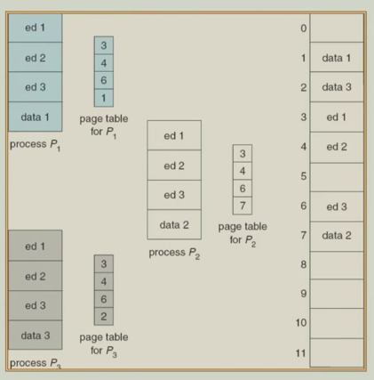{ width="600" }
</figure>

## 4 Structure of The Page Table

### 4.1 Two Level Paging

在 32 位系统中，虚拟地址空间大小为 4 GB。页大小为 1 KB，这意味着一个 4 GB 的地址空间需要 $2^22$ 个页表项来映射。如果使用单级页表，这个页表将非常庞大

解决方案是可以使用两级页表

<figure markdown="span">
    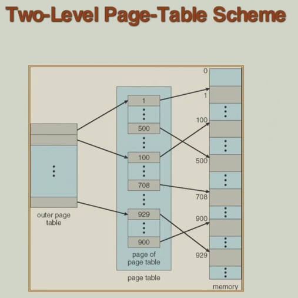{ width="600" }
</figure>

1. 外层页号（P1）：占 12 位。这 12 位用作外层页表的索引，每个页表项指向一个第二级页表的物理基地址
2. 内层页号（P2）：占 10 位。这 10 位用作由 P1 指定的那个第二级页表内的索引

<figure markdown="span">
    { width="400" }
</figure>

<figure markdown="span">
    { width="600" }
</figure>

<figure markdown="span">
    { width="600" }
</figure>

### 4.2 Hashed Page Tables

对于 64 位地址空间，即使使用多级页表，页表的层级也可能变得非常深，导致查找效率低下或内存开销仍然很大。哈希页表是解决这个问题的一种有效方法

使用哈希函数将虚拟地址中的虚拟页号直接映射到一个哈希桶中

哈希页表是一个由链表（链）组成的数组。每个链表称为一个桶或链。链表中的每个元素是一个节点，包含三个部分：

1. 虚拟页号：用于比对，确认这是我们要找的页
2. 页框号：翻译的目标，即物理内存中的帧号
3. 下一个元素的指针：指向链表中下一个节点的指针

查找过程：CPU 产生一个虚拟地址。提取出虚拟页号，通过一个哈希函数计算出一个哈希值，这个值对应哈希页表中的一个索引（即某个链表的头）。沿着该索引对应的链表进行遍历。在遍历过程中，将链表节点中存储的虚拟页号与当前要查找的虚拟页号进行比较。如果找到匹配的节点，则从该节点中取出页框号，与页内偏移组合成物理地址。如果遍历完整个链表都未找到匹配项，则发生缺页异常

<figure markdown="span">
    { width="600" }
</figure>

对于极其庞大的 64 位地址空间，地址引用通常是稀疏的。为每一个单独的页维护一个表项可能效率不高。clustered page table 是针对 64 位系统的优化。它是哈希页表的一种变体。关键区别在于，链表中的每个元素不再只映射一个虚拟页到一个物理页框，而是同时映射一组（或称一簇）连续的虚拟页到一组连续的物理页框

### 4.3 Inverted Page Table

反置页表是从物理页框号映射回虚拟页号和进程 ID。IPT 的条目数直接等于系统中物理页框的总数，与进程数量或虚拟地址空间大小无关

每个 IPT 条目（对应一个物理页框）包含：

1. 虚拟页号：当前占用该物理页框的是哪个虚拟页
2. 进程标识符：是哪个进程的虚拟页（因为不同进程的虚拟页号可能相同）
3. 其他标志位（如有效位、保护位等）

优点：内存开销极低。这是其主要优势。整个系统只需要维护一个全局的反置页表，其大小仅与物理内存容量成正比，与运行的进程数量无关

缺点：查找性能差。这是其最大缺点。当需要进行地址转换时，传统页表可以直接索引。而 IPT 需要遍历整个表来查找匹配的 `<进程ID, 虚拟页号>` 对，这是一个 $O(n)$ 操作，非常缓慢

为了解决查找缓慢的问题，实际实现中会使用一个哈希表。将需要转换的 `<进程ID, 虚拟页号>` 作为输入，通过一个哈希函数计算出一个哈希值。这个哈希值指向 IPT 中的一个起始位置或一个链表的头。只需检查这个位置（或这个短链表）上的一个或几个 IPT 条目，看是否有匹配的 `<进程ID, 虚拟页号>`

<figure markdown="span">
    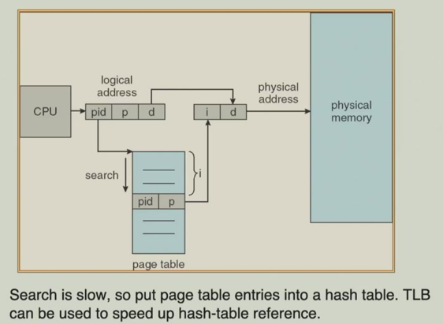{ width="600" }
</figure>

## 5 Swapping

当系统内存不足时，可以将内存中暂时不运行的进程的数据和状态（称为内存映像）完整地转移到磁盘上一个称为 backing store（后备存储）的特殊区域。当需要再次运行该进程时，再将其从磁盘读回内存。这有效地扩展了可用的内存空间

后备存储：通常是一块高速磁盘，用于存放被换出的进程内存映像。就绪队列：操作系统维护的一个队列，里面存放着所有准备运行但当前其内存映像在磁盘上的进程。一旦内存可用且轮到它们运行时，它们就会被换入内存

用于进程调度，特别是优先级调度。如果一个高优先级进程需要运行但内存不足，系统可以换出一个低优先级进程（roll out），为高优先级进程腾出空间（roll in）

交换的主要开销是传输时间，即数据在内存和磁盘之间传输的时间。传输时间与交换的数据量直接相关。因此，交换一个占用内存很大的进程会比较慢

<figure markdown="span">
    { width="600" }
</figure>

## 6 Segmentation

分段是一种内存管理方案，其核心目标是支持用户对程序的视角。用户和程序员通常不会将程序看作一个连续的线性地址空间，而是自然地将其视为由不同逻辑模块组成的集合（例如主程序、函数、变量集合、栈等）。分段正是为了在内存中反映和模拟这种逻辑视图

段是程序的一个逻辑单元。每个段都有其特定的目的和意义。程序被看作是由这些不同功能的段组成的集合，而不是一个单一的整体

各种可以作为独立段的逻辑单元：

1. 代码部分：如主程序、过程、函数、方法
2. 数据部分：如局部变量、全局变量、对象、数组
3. 运行时数据结构：如栈（用于函数调用、局部变量）、符号表（用于编译/链接）
4. 系统相关：如公用块

<figure markdown="span">
    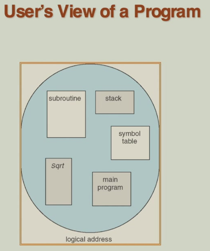{ width="600" }
</figure>

<figure markdown="span">
    { width="600" }
</figure>

在分段系统中，程序的逻辑地址不再是一个单一的线性地址，而是由一个段号和一个段内偏移量组成的二元组。这反映了程序是由多个逻辑段构成的视图

segment table：段表是分段管理的核心数据结构，负责将程序的二维逻辑地址转换（映射）为实际的一维物理内存地址。表项内容：

1. base：指明该段被加载到物理内存中的起始地址
2. limit：定义了该段的总长度，用于进行越界检查，保护内存

地址转换过程：

1. CPU 发出一个逻辑地址 `<s, d>`（s 是段号，d 是偏移量）
2. 系统使用 segment table base register (STBR) 中找到段表在内存中的位置
3. 以段号 s 作为索引，查找段表中对应的表项
4. 首先进行合法性检查：

    1. 比较段号 s 是否小于 segment table length register (STLR) 的值。如果不是，则说明段号非法，触发陷阱（错误）
    2. 比较偏移量 d 是否小于该段表项中的限长。如果不是，则说明地址越界，触发陷阱（错误）

5. 如果检查通过，则将该表项中的基址与偏移量 d 相加，得到最终的物理地址

有效性检查：每个段表表项都包含一个有效位。如果该位为 0，表示该段无效（例如未被加载或不存在），访问它会引发错误（如段错误）

权限管理：每个段表表项还包含读、写、执行等权限位。操作系统通过设置这些位，可以防止程序进行非法操作

保护与共享的单元都是段。这意味着可以将一个段（如一个公共函数库的代码段）标记为可读 / 可执行，并被多个进程共享，而它们各自的数据段保持私有和受保护

与分页系统使用固定大小的页框不同，分段系统中的段是长度可变的。因此，为这些大小不一的段在物理内存中寻找空闲区域，就变成了一个动态存储分配问题。这类似于为一个变量列表分配内存，需要解决外部碎片的问题

<figure markdown="span">
    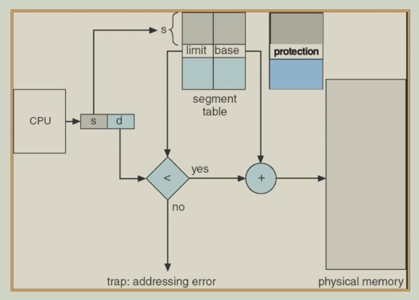{ width="600" }
</figure>

<figure markdown="span">
    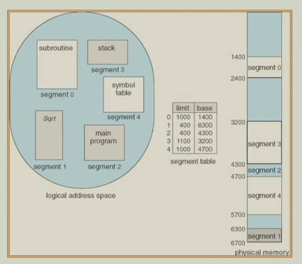{ width="600" }
</figure>

## 7 Example: The Intel Pentium

奔腾处理器采用混合内存管理方案，它既可以配置为仅使用分段，也可以（更常见地）配置为先分段，后分页。这结合了两种方案的优点

地址转换流程：分段（逻辑地址 → 线性地址）→ 分页（线性地址 → 物理地址）

CPU 产生的逻辑地址，包含一个段选择符和一个偏移量。段选择符指示这个地址属于哪个段表（GDT 或 LDT），以及段在表中的索引

- GDT：全局描述符表，包含操作系统和所有进程共享的段描述符
- LDT：局部描述符表，每个进程可以有自己私有的 LDT，包含其特有的段描述符。这实现了逻辑地址空间的划分

分段单元：根据段选择符在 GDT 或 LDT 中找到对应的段描述符。该描述符包含段的基地址。然后将这个基地址与逻辑地址中的偏移量相加，得到一个线性地址

分页单元：将分段后输出的线性地址作为输入，这个线性地址不再被视为一个单一的单元，而是被分成若干部分，作为页目录、页表和页内偏移量的索引。分页单元通过查询多级页表，最终将线性地址的页面部分映射到物理内存的页框，并结合页内偏移量，生成最终的物理地址

在奔腾架构中，内存管理单元（MMU）并非一个单一的硬件块，而是由分段单元和分页单元共同构成的

<figure markdown="span">
    { width="600" }
</figure>

<figure markdown="span">
    { width="600" }
</figure>

<figure markdown="span">
    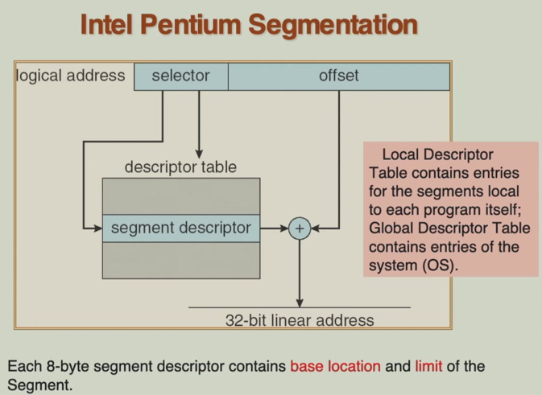{ width="600" }
</figure>

<figure markdown="span">
    { width="600" }
</figure>

<figure markdown="span">
    { width="600" }
</figure>

<figure markdown="span">
    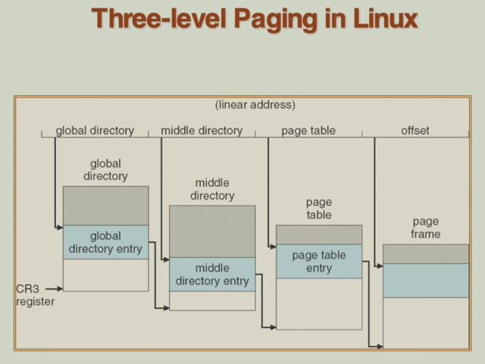{ width="600" }
</figure>
