# 9 Virtual Memory

!!! tip "说明"

    本文档正在更新中……

!!! info "说明"

    本文档仅涉及部分内容，仅可用于复习重点知识

## 1 Background

虚拟内存的核心是将逻辑内存与物理内存分离开来

1. 部分载入：程序运行时，无需将其全部代码和数据都加载到物理内存中，只需加载当前需要的部分。这使得可以运行比物理内存更大的程序
2. 地址空间更大：程序可以使用一个非常大的、连续的地址空间（逻辑地址空间），这个空间可以超过实际物理内存的大小
3. 共享内存：不同的进程可以映射到同一块物理内存区域，从而实现高效的进程间通信或共享库代码
4. 高效进程创建：创建新进程（例如通过 fork）时，可以共享父进程的地址空间，仅在需要修改时才进行复制，这提高了效率
5. 系统库共享：操作系统可以将常用的系统库（如 C 标准库）的代码段映射到多个进程的虚拟地址空间中。物理内存中只需保存一份库代码的副本，所有使用该库的进程都共享它。这节省了大量物理内存，并提高了系统效率

虚拟内存不是一个物理设备，而是一套由操作系统内核管理的抽象概念和机制，它负责处理物理内存的分配、映射以及虚拟地址的转换

实现虚拟内存的技术：

1. demand paging：这是最常见的实现方式。内存被划分为固定大小的页。当程序访问一个尚未加载到物理内存的页时，会触发一个缺页中断，操作系统负责将该页从磁盘调入内存
2. demand segmentation：内存被划分为大小可变的段（如代码段、数据段）。程序按这些逻辑单元来申请和管理内存。这种方式现在较少单独使用，常与分页结合

<figure markdown="span">
    { width="600" }
</figure>

<figure markdown="span">
    { width="600" }
</figure>

<figure markdown="span">
    { width="600" }
</figure>

## 2 Demand Paging

请求调页的原则是只有在程序真正访问（需要）某个页面时，才将其从磁盘加载到物理内存中。反之，如果页面从未被访问，则它始终留在磁盘上

1. 减少 I/O：只加载必要的页面，显著减少了磁盘输入/输出操作
2. 减少内存占用：物理内存中只存放当前活跃的页面，使得有限的内存可以支持更大的程序或多个程序
3. 加快响应：程序启动更快，因为无需等待全部代码和数据加载完毕即可开始执行
4. 支持多用户：更高效的内存利用使系统能够同时为更多用户或进程服务

工作流程：

1. 当 CPU 试图访问一个页面时，会检查该页面的状态
2. invalid reference：如果访问了一个非法地址（不属于该进程的地址空间），操作系统将终止该进程
3. 页不在内存：如果访问的是一个合法但当前未加载到物理内存的页，操作系统（调页程序）会介入，负责从磁盘找到所需页面并将其加载到空闲的物理内存页框中

> 调页程序是专门负责处理页面（而非整个进程）在内存和磁盘之间移动的操作系统组件

lazy swapper（惰性交换器）：除非确定页面将被需要，否则绝不会将页面交换进内存。惰性体现在它采取一种被动的、按需加载的策略

<figure markdown="span">
    { width="600" }
</figure>

在每个页表项中，有一个称为 valid-invalid 的特殊位。当一个进程刚开始运行时，或者一个新页被映射到其地址空间时，操作系统会将该页对应的页表项的有效-无效位初始化为 i。这体现了惰性加载的思想

<figure markdown="span">
    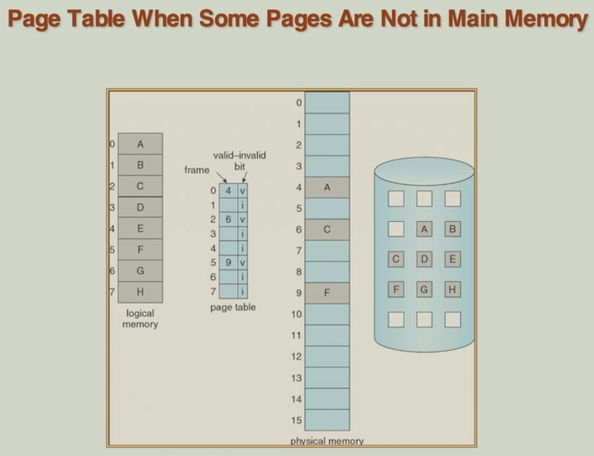{ width="600" }
</figure>

当进程首次访问一个当前不在物理内存中的有效页面时，由硬件（MMU）检测到其页表项的有效位为 i，从而触发一个 page fault

1. CPU 硬件自动将控制权交给操作系统（陷入内核）。操作系统首先保存当前进程的上下文，以便后续能完全恢复
2. 操作系统诊断出这是缺页中断。它检查请求的地址是否属于该进程的合法地址范围。如果非法，则终止进程；如果合法，则继续，并查找该页面在磁盘上的具体位置
3. 操作系统向磁盘发出读取页面的 I/O 请求。磁盘 I/O 速度相对于 CPU 速度极慢。为了极致的效率，操作系统不会让 CPU 空等。它会挂起当前进程，并执行进程调度，将 CPU 分配给另一个就绪的进程
4. 当磁盘完成数据读取后，会发出一个 I/O 完成中断。CPU 再次陷入操作系统。操作系统需要保存当前正在运行的进程的上下文，然后处理这个磁盘中断
5. 操作系统确认磁盘 I/O 已完成，随后更新页表：将对应页表项的有效位设为 v，并填入页面被加载到的物理帧号。可能还需要更新其他内部表格
6. 此时，所需页面已在内存中。原进程变为就绪状态。当进程调度器再次将 CPU 分配给该原进程时，操作系统会恢复在步骤 1 中保存的该进程的原始上下文，然后重新执行那条引发缺页的指令。这一次，指令将顺利执行

<figure markdown="span">
    { width="600" }
</figure>

!!! tip "performance of demand paging"

    page fault rate：它表示在一次内存访问中发生缺页中断的概率，记为 $p$，其值在 0 到 1 之间

    1. 页面在内存中：一次常规的内存访问时间。$(1 - p) \times \text{memory access}$
    2. 发生缺页：换出页面，换入页面，重启开销。$p \times \text{page fault overhead (swap page out + swap page in + restart overhead)}$

    即使缺页率 $p$ 很小，但由于缺页处理开销极其巨大，它也会对有效访问时间产生显著影响

    <figure markdown="span">
        { width="600" }
    </figure>

## 3 Copy on Write

COW 允许当创建一个新进程（子进程）时，操作系统并不会立即将父进程的内存页面全部复制一份。相反，它让父进程和子进程共享所有相同的物理内存页面。只有当父进程或子进程试图写入某个共享的页面时，操作系统才会介入，为该页面创建一个独立的副本供写入进程使用。此后，两个进程将各自拥有该页面的独立副本

1. 高效进程创建：fork 操作变得非常快速，因为它几乎不需要进行实际的内存拷贝，只需要复制页表并设置 COW 属性。这大大减少了进程创建的开销和时间
2. 节省物理内存

a pool of zeroed-out pages（清零页面的池）：为了安全，分配给子进程的新页面（即发生写操作后需要复制的页面）必须不包含其他进程的旧数据。因此，操作系统会维护一个空闲页面池，其中的页面在被放入池中时已被清零。当需要为 COW 分配新页面时，就从该池中取出，确保了数据隔离和安全性

<figure markdown="span">
    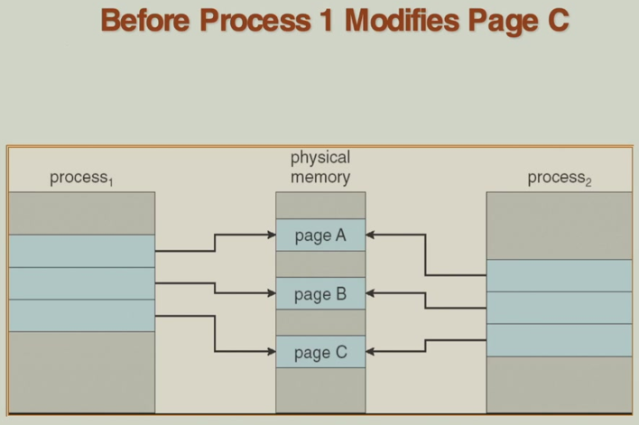{ width="600" }
</figure>

<figure markdown="span">
    { width="600" }
</figure>

## 4 Page Replacement

在请求调页系统中，当发生缺页中断，需要将磁盘上的页面调入物理内存时，操作系统必须为其分配一个空闲的物理页框。如果所有物理页框都已被占用（即没有空闲帧），系统就无法直接加载新页面。这时，就必须进行 page replacement

操作系统需要选择一个当前已存在于内存中的页面，将其驱逐出去，以释放一个页框给新的页面使用。选择哪个页面进行置换，这需要一个页面置换算法来做出决策。算法的根本目标是最小化缺页率。一个好的算法应能准确地预测哪些页面将来不会被访问，从而换出它们

> 如果一个被换出的页面后来再次被进程访问，它就会再次发生缺页，需要被重新从磁盘换入。如果置换算法选择不当，可能会导致同一个页面在内存和磁盘之间被反复换入换出

使用 modify bit / dirty bit：当进程写入某个页面时，硬件会自动将该页对应的修改位置位（设为 1），表明该页内容已被更改，与磁盘上的副本不一致。当需要换出某个页面时，如果其修改位为 0，说明磁盘上已有其最新副本，那么操作系统就无需将其写回磁盘，直接覆盖即可。这省去了一次耗时的磁盘写操作，极大地提升了置换效率

<figure markdown="span">
    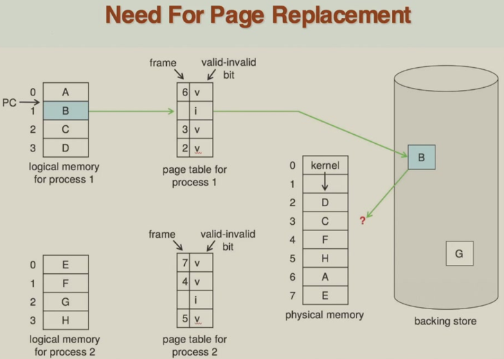{ width="600" }
</figure>

工作流程：

1. 操作系统首先在页表或相关的内部数据结构中，查明所请求的页面当前存放在磁盘上的哪个具体位置
2. 系统检查是否有空闲的物理页框

    1. 有空闲帧：这是最简单的情况。直接使用该空闲帧即可，无需置换
    2. 无空闲帧：操作系统必须调用一个页面置换算法，从所有当前已占用的帧中选出一个作为牺牲帧。在重用这个牺牲帧之前，需要检查其修改位

        1. 如果该帧的内容自从被调入后已被修改过（是脏的），则必须将其内容写回磁盘，以保持数据一致性
        2. 如果该帧的内容未被修改过（是干净的），并且磁盘上已有其副本，则无需写回，直接覆盖即可。这步优化能节省大量时间
        3. 操作系统会更新页表（使原占用该牺牲帧的进程的对应页表项变为无效）和帧表等内存管理表格

3. 现在，有一个可用的（新释放的）物理帧了。操作系统发出磁盘 I/O 请求，将最初引发缺页的那个所需页面从磁盘读入这个帧中。随后，更新页表，将引发缺页的进程的对应页表项指向这个新的物理帧，并将其有效位设置为有效
4. 在所有内存管理表格更新完毕，并且所需页面已成功加载到内存后，操作系统会安排重新执行那条当初引发缺页中断的指令。此时，所有条件都已满足，指令可以正常执行下去

<figure markdown="span">
    { width="600" }
</figure>

为了科学地比较不同页面置换算法的优劣，我们需要一个统一的、可量化的评估方式。让不同的算法在同一个内存访问序列（称为 reference string）上运行，然后观察并统计每个算法在处理这个完整序列时，总共发生了多少次缺页中断。缺页次数越少的算法，性能越好

引用串的生成：原本的地址序列中的每个虚拟地址被划分为页号和页内偏移，页面置换只关心页号，因此可以将页号单独提取出来，这样就得到了一个只包含页号的序列，这就是引用串

<figure markdown="span">
    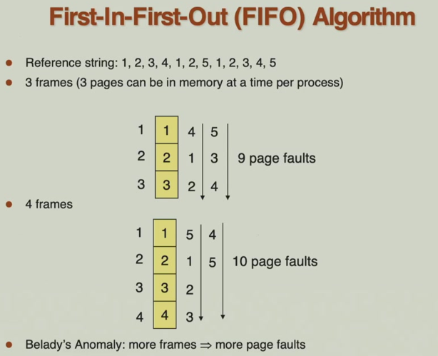{ width="600" }
</figure>

按照常理，分配给进程的物理内存帧数越多，缺页率应该越低。然而，在 FIFO 算法中，当帧数增加到 4 个时，处理同一个引用串却发生了 10 次缺页。这个内存增加反而导致性能下降的反常现象，就被称为 Belady anomaly。因此，FIFO 算法不是一种理想的页面置换算法

<figure markdown="span">
    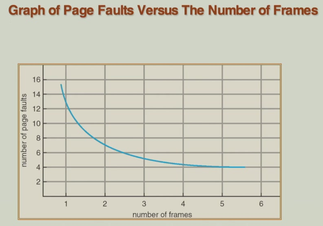{ width="600" }
</figure>

<figure markdown="span">
    { width="600" }
</figure>

<figure markdown="span">
    { width="600" }
</figure>

optimal Algorithm：在需要置换页面时，选择未来最长时间内不会被访问的页面进行替换。这是理论最优的算法，但是因为算法需要预知未来页面的访问顺序，这在实际系统中是不可能的。常作为基准来衡量其他实际页面置换算法的性能优劣

<figure markdown="span">
    { width="600" }
</figure>

<figure markdown="span">
    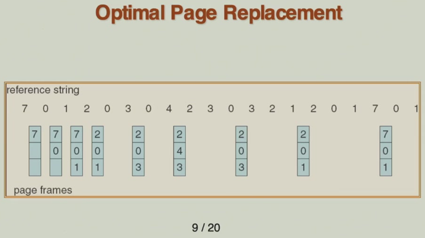{ width="600" }
</figure>

Least Recently Used（LRU）Algorithm：根据页面的历史访问时间进行置换，优先淘汰最久未被访问的页面。每个页表项配备一个时间戳计数器，每次访问页面时，将当前的系统时钟值（或逻辑时钟值）记录到该页面对应的计数器中。当发生缺页且内存已满，需要置换页面时，系统检查所有在内存中的页面对应的计数器值，选择计数器值最小（即最久未被访问）的页面进行置换

<figure markdown="span">
    { width="600" }
</figure>

<figure markdown="span">
    { width="600" }
</figure>

LRU 算法的栈实现方式：使用一个双向链表构成的栈来记录页面访问顺序，栈顶是最近访问的页面，栈底是最久未访问的页面。当页面被访问时，需要修改共 6 个指针。当需要页面置换时，淘汰栈底的页面即可，无需搜索

<figure markdown="span">
    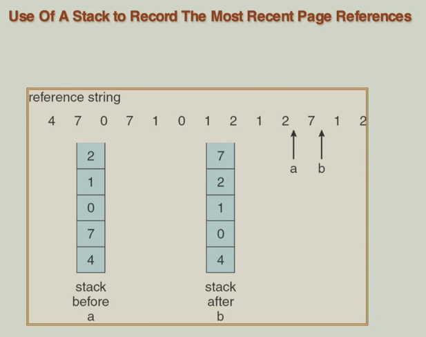{ width="600" }
</figure>

精确的 LRU 实现开销较大，有两种 LRU Approximation Algorithms：

1. Reference Bit Algorithm：系统为每个页框维护一个 Reference Bit（引用位），初始时所有页面的引用位为 0，当页面被访问时，硬件自动将其引用位置 1，需要置换页面时，操作系统扫描并选择一个引用位为 0 的页面进行置换
2. Second Chance Algorithm / Clock Algorithm：同样使用引用位，但增加了更智能的扫描机制，页面组织成环形队列（类似时钟的钟面），维护一个时钟指针，按顺序扫描页面。页面置换时，检查指针指向的页面，如果引用位为 0，直接置换该页面，指针向前移动；如果引用位为 1，给页面第二次机会：将引用位置 0，指针向前移动，继续检查下一个页面

<figure markdown="span">
    { width="600" }
</figure>

Counting-based Algorithms：基于页面访问次数的置换算法

1. Least Frequently Used（LFU）：当需要置换页面时，选择访问计数值最小的页面淘汰
2. Most Frequently Used（MFU）：当需要置换时，选择访问计数值最大的页面淘汰

## 5 Allocation of Frames

每个进程需要一定数量的内存页才能正常运行，这个最小页面数通常由计算机硬件架构决定，特别是指令集架构。如果分配少于这个最小数量，进程可能无法执行某些指令，导致严重错误

> IBM 370 的 MOVE 指令长 6 字节，可能跨越 2 个内存页，而源操作数和目标操作数可能各需要 2 个内存页，一共就需要 6 页

有两种分配方案：

1. Fixed Allocation：每个进程获得固定数量的内存帧

    1. Equal Allocation：将可用物理内存帧平均分配给所有进程。每个进程分配帧数 = 总帧数 / 进程数
    2. Proportional Allocation（按比例分配）：根据进程的逻辑地址空间大小按比例分配物理帧，进程越大，分配的帧越多。每个进程分配帧数 = $\dfrac{s_i}{S} \times m$（$s_i$ 是进程 i 的大小，$S$ 是所有进程大小的总和，$m$ 是可用物理帧总数）

2. Priority Allocation：根据进程优先级分配内存资源，高优先级进程获得更多或更高质量的内存资源。如果发生缺页，系统从产生缺页的进程自身的帧中选取替换；也可能从优先级更低的其他进程的帧中借用或替换

!!! tip "Global Allocation vs. Local Allocation"

    - 全局置换：当进程需要新页面时，可以在整个系统的所有物理帧中选择一个进行替换
    - 局部置换：每个进程只能从自己分配到的固定帧集合中选择页面替换

    全局置换的缺点：

    1. 缺页率不可预测
    2. 缺乏控制
    3. 公平性问题

    局部置换：

    1. 内存利用率低
    2. 系统吞吐量下降

## 6 Thrashing

**抖动**：当进程没有足够的内存页面来维持其当前工作集时，会频繁发生缺页中断，导致进程大部分时间都花在页面调入 / 调出上，而无法进行有效计算的状态

1. 系统性能下降：CPU 大部分时间在等待页面调换，利用率低下
2. I/O 瓶颈：大量页面在内存和磁盘之间频繁交换，形成排队
3. 系统误判：操作系统误认为 CPU 空闲是因为进程太少，从而增加更多进程
4. 恶性循环：添加新进程进一步加剧页面竞争，情况更加恶化

<figure markdown="span">
    { width="600" }
</figure>

抖动的原因：系统中所有进程的局部区域大小总和超过了物理内存总容量时，就会发生抖动。本质上是内存资源供不应求，系统无法同时容纳所有进程的工作集

1. 限制抖动影响：每个进程只能使用自己的内存帧，不能偷取其他进程的帧
2. 预防抖动：为每个进程分配足够的内存，使其能够容纳当前的局部性工作集

<figure markdown="span">
    { width="600" }
</figure>

<figure markdown="span">
    { width="600" }
</figure>

预防抖动的方法：working-set model

1. working-set window（工作集窗口）$\Delta$：一个固定的观察时间段，通常用页面引用次数或指令数衡量
2. 工作集大小 $WSS_i$：在最近 $Δ$ 时间内进程实际访问的唯一页面集合的大小
3. 总需求 $D$：所有进程工作集大小的总和

窗口大小 $Δ$ 的影响：

1. $Δ$ 过小：只看到局部性的一部分，会低估实际内存需求
2. $Δ$ 过大：包含了多个不同局部性，会高估内存需求
3. $Δ = ∞$：等同于程序需要的全部页面（失去按需调页的意义）

抖动判断机制：当所有进程的工作集总和 ($D$) > 可用物理内存帧数 ($m$) 时，必然发生抖动

预防策略：监控每个进程的 $WSS$，计算总需求 $D$，当 $D > m$ 时，系统选择挂起一个或多个进程，被挂起进程的内存可以分配给其他进程，使 $D ≤ m$

<figure markdown="span">
    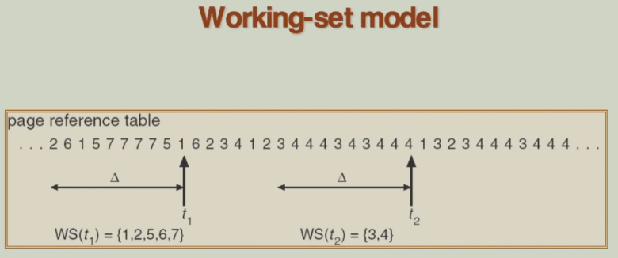{ width="600" }
</figure>

近似实现跟踪工作集：操作系统通过间隔定时器中断定期采样引用位状态

假设工作集窗口 $Δ$ = 10,000 时间单位，采样间隔 = 50,000 时间单位，每个页面用 2 位记录，1 位记录前半个窗口是否被访问，1 位记录后半个窗口是否被访问

算法流程：定时器每 5,000 单位中断一次，复制当前所有引用位到内存相应位，清零硬件引用位，如果页面对应的任一内存位 = 1，则判定该页面在最近 $Δ$ 时间内被访问过

局限性：无法确定页面是在 5,000 单位时间内的哪个具体时刻被访问，结果可能高估实际的工作集大小。可以增加位数或者缩短采样间隔来划分更细的时间段

<figure markdown="span">
    { width="600" }
</figure>

## 7 Memory Mapped Files

内存映射：将磁盘上的文件直接映射到进程的虚拟地址空间中，文件数据像访问普通内存一样通过指针操作，而非传统的 read/write 系统调用

使用按需调页技术，仅在进程访问文件某个部分时才将对应磁盘块读入物理内存页面，一旦数据在内存中，后续读写操作就是普通的内存加载/存储指令，操作系统在后台自动处理脏页写回磁盘

通过内存而非 read/write 系统调用来处理文件 I/O，从而简化文件访问。同时，还允许多个进程映射同一个文件，使得内存中的页面可以共享

<figure markdown="span">
    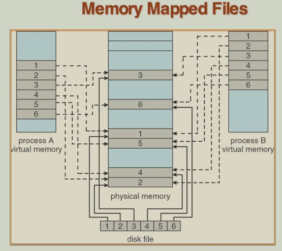{ width="600" }
</figure>

<figure markdown="span">
    { width="600" }
</figure>

## 8 Allocating Kernel Memory

内核内存通常有独立的分配器，不从通用用户堆分配，分配策略针对内核使用模式优化。内核内存来源于内核内存池，是系统启动时预留的专用内存区域。由于部分硬件操作需要连续的物理内存。所以某些内核内存需要连续，因此，许多系统不对内核代码和数据使用分页技术

内核频繁分配/释放各种大小的数据结构，使用对象缓存预分配常用大小的对象，能够减少碎片的产生

Buddy System 是一种动态内存管理算法，主要用于操作系统内核管理物理内存页。内存被组织成多个固定大小的段，每个段由物理上连续的页组成，便于高效管理。所有分配大小必须是 2 的幂次，如果请求大小不是 2 的幂次，则向上取整。当没有正好大小的块时，系统会将一个较大的块一分为二，形成两个大小相等的伙伴块。当内存释放时，如果两个伙伴块都空闲，它们会合并成一个更大的块，以减少碎片

优点是分配和释放速度快，外部碎片较少，适合管理大块连续内存；缺点是内部碎片可能较多（因为向上取整），且只支持 2 的幂次大小

<figure markdown="span">
    { width="600" }
</figure>

<figure markdown="span">
    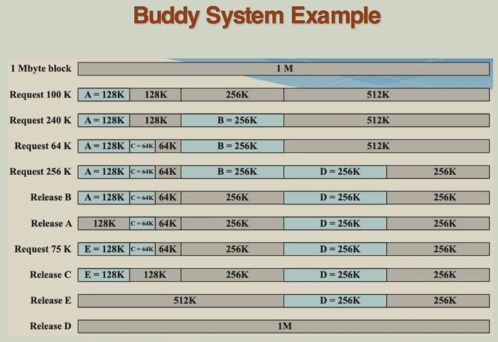{ width="600" }
</figure>

<figure markdown="span">
    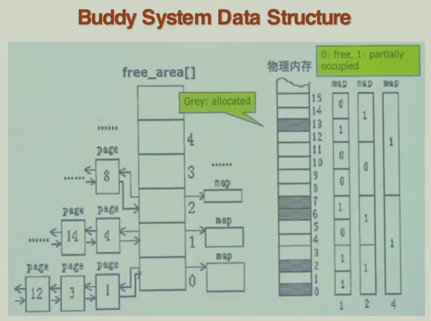{ width="600" }
</figure>

Slab 分配器是另一种高效管理内核内存的机制，主要用于频繁分配和释放小型、固定大小的内核对象

1. Slab：内存管理的基本单位，通常是一个或多个物理连续的页面
2. Cache：每个缓存对应一种特定类型的内核数据结构，其中包含一个或多个 slab
3. Object：缓存中存储的实际数据结构的实例

工作流程：系统启动时为每种常用数据结构创建一个缓存，并预先分配一些对象（标记为空闲）。当内核需要分配一个对象时，直接从对应缓存的空闲列表中获取，无需实时分配内存，速度极快。如果当前 slab 已满，则从另一个空的 slab 分配；若无空闲 slab，则分配新的 slab

优点：

1. 无外部碎片：对象大小固定且预先分配，避免了内存碎片问题
2. 高性能：对象分配和释放只是状态标记，无需复杂的内存查找与合并
3. 缓存友好：相同类型的对象集中存储，提高 CPU 缓存利用率

<figure markdown="span">
    { width="600" }
</figure>

## 9 Other Considerations

## 10 Operating System Examples